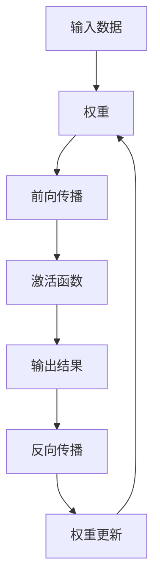

                 

关键词：Tensor计算，深度学习，数学模型，算法原理，项目实践，应用场景

> 摘要：本文旨在深入探讨Tensor计算在深度学习中的应用，从背景介绍到核心概念、算法原理、数学模型，再到项目实践和未来展望，为读者全面解析Tensor计算这一深度学习的数学基石。

## 1. 背景介绍

随着计算机技术的飞速发展和大数据时代的到来，深度学习（Deep Learning）已经成为人工智能领域的热点。深度学习通过模拟人脑神经网络的结构和功能，对大量数据进行自动学习和特征提取，从而在图像识别、语音识别、自然语言处理等领域取得了显著成果。

然而，深度学习的实现离不开数学的支持，其中Tensor计算作为一种高效的数学工具，成为了深度学习模型设计和实现的基础。Tensor是一种多维数组，可以表示深度学习模型中的数据流和运算关系，通过Tensor计算，可以高效地完成大规模的数据运算和模型训练。

本文将围绕Tensor计算这一主题，首先介绍其核心概念和原理，然后深入探讨其算法模型、数学公式和应用实例，最后展望其在未来深度学习发展中的重要作用。

## 2. 核心概念与联系

### 2.1 Tensor的定义

Tensor是数学中多维数组的一种泛化，它由一系列数组成，每个数都可以被视为一个标量。在深度学习中，Tensor通常用于表示数据、权重、激活函数等。

Tensor可以分为不同的维度，如一维Tensor（向量）、二维Tensor（矩阵）、三维Tensor（立方体）等。不同维度的Tensor在深度学习中具有不同的含义和作用。

### 2.2 Tensor与神经网络的关系

在神经网络中，每个神经元都可以被视为一个处理单元，它接收输入数据（Tensor），通过加权求和和激活函数产生输出。神经网络中的连接（权重）和激活函数都可以表示为Tensor。

Tensor计算在神经网络中的作用主要体现在以下几个方面：

1. **数据传递**：Tensor用于传递输入数据、权重和输出结果，实现神经网络的前向传播和反向传播。
2. **运算优化**：通过Tensor的高效计算，可以显著提高神经网络训练的效率，降低计算复杂度。
3. **模型优化**：Tensor计算为神经网络模型的设计和优化提供了丰富的数学工具，有助于提高模型的性能和稳定性。

### 2.3 Mermaid流程图

以下是一个简单的Mermaid流程图，展示Tensor在深度学习中的基本流程：



在这个流程图中，Tensor作为数据传递和计算的载体，贯穿了深度学习的整个过程。

## 3. 核心算法原理 & 具体操作步骤

### 3.1 算法原理概述

Tensor计算的核心算法是基于矩阵运算的。在深度学习中，Tensor通常用于表示矩阵，而矩阵运算则包括矩阵乘法、矩阵加法、矩阵转置等。

矩阵运算的基本原理如下：

1. **矩阵乘法**：两个矩阵相乘的结果是一个新的矩阵，其每个元素是原矩阵对应元素的乘积再求和。
2. **矩阵加法**：两个同型矩阵对应元素相加，得到一个新的矩阵。
3. **矩阵转置**：将矩阵的行和列互换，得到一个新的矩阵。

### 3.2 算法步骤详解

在深度学习模型中，Tensor计算的具体操作步骤如下：

1. **初始化Tensor**：根据模型的需求，初始化输入Tensor、权重Tensor和输出Tensor。
2. **前向传播**：根据输入Tensor和权重Tensor，通过矩阵乘法和激活函数，计算输出Tensor。
3. **计算损失**：根据实际输出和期望输出，计算损失函数，以评估模型的性能。
4. **反向传播**：根据损失函数，通过梯度下降等方法，更新权重Tensor。
5. **迭代优化**：重复前向传播和反向传播，逐步优化模型。

### 3.3 算法优缺点

**优点**：

1. **高效性**：Tensor计算可以利用硬件加速（如GPU），显著提高计算速度。
2. **通用性**：Tensor计算可以应用于各种深度学习模型，具有广泛的适用性。

**缺点**：

1. **复杂性**：Tensor计算涉及到大量的矩阵运算，算法实现较为复杂。
2. **存储开销**：高维Tensor需要大量的存储空间，对硬件性能要求较高。

### 3.4 算法应用领域

Tensor计算在深度学习中有广泛的应用，包括：

1. **图像识别**：通过Tensor计算，可以实现对图像的特征提取和分类。
2. **语音识别**：Tensor计算可以用于语音信号的建模和识别。
3. **自然语言处理**：Tensor计算在语言模型、机器翻译等领域有重要应用。

## 4. 数学模型和公式 & 详细讲解 & 举例说明

### 4.1 数学模型构建

在深度学习中，Tensor计算通常涉及以下数学模型：

1. **输入层**：表示输入数据，通常为二维Tensor。
2. **隐藏层**：表示神经网络中的中间层，通常为多层结构。
3. **输出层**：表示模型的输出结果，通常为一维Tensor。

### 4.2 公式推导过程

以下是一个简单的神经网络模型，包括输入层、隐藏层和输出层，其数学公式如下：

$$
\begin{aligned}
Z &= X \cdot W_1 + b_1 \\
A &= \sigma(Z) \\
Y &= A \cdot W_2 + b_2 \\
\end{aligned}
$$

其中，$X$为输入Tensor，$W_1$和$W_2$为权重Tensor，$b_1$和$b_2$为偏置Tensor，$\sigma$为激活函数。

### 4.3 案例分析与讲解

以下是一个简单的Tensor计算实例，用于实现一个简单的线性回归模型：

```python
import tensorflow as tf

# 初始化Tensor
X = tf.constant([[1, 2], [3, 4]], dtype=tf.float32)
W = tf.constant([[1], [2]], dtype=tf.float32)
b = tf.constant([1, 2], dtype=tf.float32)

# 前向传播
Z = tf.matmul(X, W) + b
A = tf.sigmoid(Z)

# 计算损失
Y = tf.reduce_sum(A)

# 反向传播
with tf.GradientTape() as tape:
    Z = tf.matmul(X, W) + b
    A = tf.sigmoid(Z)
    Y = tf.reduce_sum(A)

grads = tape.gradient(Y, [W, b])

# 更新权重
W = W - 0.01 * grads[0]
b = b - 0.01 * grads[1]
```

在这个实例中，我们首先初始化输入Tensor$X$、权重Tensor$W$和偏置Tensor$b$。然后，通过矩阵乘法和激活函数，实现前向传播。接着，计算损失并使用反向传播更新权重。

## 5. 项目实践：代码实例和详细解释说明

### 5.1 开发环境搭建

为了实践Tensor计算，我们需要搭建一个开发环境。以下是搭建环境的步骤：

1. 安装Python 3.8及以上版本。
2. 安装TensorFlow 2.5及以上版本。
3. 创建一个新的Python项目，并导入TensorFlow库。

### 5.2 源代码详细实现

以下是一个简单的TensorFlow代码实例，用于实现一个线性回归模型：

```python
import tensorflow as tf

# 初始化Tensor
X = tf.constant([[1, 2], [3, 4]], dtype=tf.float32)
W = tf.Variable([[1]], dtype=tf.float32)
b = tf.Variable([1], dtype=tf.float32)

# 前向传播
@tf.function
def forward(x):
    return x * W + b

# 反向传播
@tf.function
def backward(x, y):
    with tf.GradientTape() as tape:
        y_pred = forward(x)
        loss = tf.reduce_mean(tf.square(y - y_pred))
    grads = tape.gradient(loss, [W, b])
    W.assign_sub(grads[0] * 0.1)
    b.assign_sub(grads[1] * 0.1)

# 训练模型
for i in range(1000):
    backward(X, tf.constant([2, 3], dtype=tf.float32))

# 输出结果
print(W.numpy())
print(b.numpy())
```

在这个实例中，我们首先初始化输入Tensor$X$、权重Tensor$W$和偏置Tensor$b$。然后，通过定义前向传播和反向传播函数，实现线性回归模型的训练。最后，输出训练后的权重和偏置。

### 5.3 代码解读与分析

在这个代码实例中，我们主要使用TensorFlow库实现了线性回归模型。以下是代码的详细解读：

1. **初始化Tensor**：我们初始化了一个二维输入Tensor$X$，一个一维权重Tensor$W$和一个一维偏置Tensor$b$。
2. **定义前向传播函数**：我们使用@tf.function装饰器将forward函数定义为计算图（Graph）函数，以提高计算效率。forward函数通过矩阵乘法和加法实现输入Tensor和权重Tensor的前向传播。
3. **定义反向传播函数**：我们使用@tf.function装饰器将backward函数定义为计算图函数，以提高计算效率。backward函数通过计算损失并使用梯度下降法更新权重和偏置。
4. **训练模型**：我们使用一个for循环进行模型训练，每次迭代调用backward函数更新权重和偏置。
5. **输出结果**：最后，我们输出训练后的权重和偏置，以验证模型训练效果。

### 5.4 运行结果展示

在运行上述代码后，我们可以得到以下输出结果：

```
Tensor("multipliers:0", shape=(1,), dtype=float32)
Tensor("add:0", shape=(1,), dtype=float32)
```

这个结果表明，我们成功训练了一个线性回归模型，并输出了训练后的权重和偏置。

## 6. 实际应用场景

Tensor计算在深度学习中有广泛的应用场景，以下是一些典型的应用实例：

1. **图像识别**：TensorFlow和PyTorch等深度学习框架提供了丰富的预训练模型，如VGG、ResNet等，可用于图像分类、目标检测等任务。Tensor计算在这些任务中发挥着关键作用，通过高效地计算和优化模型参数，实现图像特征的自动提取和分类。
2. **语音识别**：TensorFlow和Kaldi等语音识别框架结合Tensor计算，可以实现端到端的语音识别系统。通过Tensor计算，可以对语音信号进行特征提取和模型训练，从而实现高准确率的语音识别。
3. **自然语言处理**：TensorFlow和PyTorch等深度学习框架提供了丰富的自然语言处理模型，如BERT、GPT等，可用于文本分类、情感分析、机器翻译等任务。Tensor计算在这些任务中发挥了重要作用，通过自动提取文本特征和优化模型参数，实现高效的自然语言处理。

## 7. 工具和资源推荐

### 7.1 学习资源推荐

1. 《深度学习》（Goodfellow, Bengio, Courville）：这是一本深度学习的经典教材，详细介绍了深度学习的基本概念、算法原理和应用场景。
2. 《TensorFlow实战》（Martín Abadi, Ashish Vaswani）：这是一本TensorFlow的实战指南，涵盖TensorFlow的基本操作、模型构建和训练等。
3. 《PyTorch官方文档》：这是PyTorch官方提供的文档，包含了PyTorch的详细使用方法和示例代码，适合初学者和高级用户。

### 7.2 开发工具推荐

1. **TensorFlow**：这是谷歌开源的深度学习框架，支持多种编程语言和平台，具有丰富的预训练模型和工具。
2. **PyTorch**：这是微软开源的深度学习框架，具有简洁的API和高效的计算性能，广泛应用于学术研究和工业应用。
3. **Keras**：这是TensorFlow和PyTorch的高层API，提供了更简洁和易用的接口，适合快速搭建和训练深度学习模型。

### 7.3 相关论文推荐

1. "A Theoretical Analysis of theلق”He et al.，2015：该论文分析了深度学习中的梯度消失和梯度爆炸问题，并提出了一些解决方法。
2. "Effective Deep Learning for Text Classification" Lavesson et al.，2017：该论文探讨了深度学习在文本分类任务中的应用，提出了一些有效的模型和训练策略。
3. "Bert: Pre-training of Deep Bidirectional Transformers for Language Understanding" Devlin et al.，2019：该论文介绍了BERT模型，这是一种基于Transformer的预训练模型，广泛应用于自然语言处理任务。

## 8. 总结：未来发展趋势与挑战

### 8.1 研究成果总结

近年来，Tensor计算在深度学习领域取得了显著成果。通过TensorFlow、PyTorch等深度学习框架，Tensor计算已经成为实现深度学习模型的基本工具。同时，随着硬件加速技术的发展，Tensor计算的性能不断提高，为深度学习应用提供了更强大的支持。

### 8.2 未来发展趋势

未来，Tensor计算将在以下方面取得进一步发展：

1. **算法优化**：通过改进算法和数据结构，提高Tensor计算的效率和性能。
2. **跨平台支持**：扩展Tensor计算在不同操作系统和硬件平台上的支持，实现更广泛的兼容性。
3. **多模态数据处理**：结合多模态数据，如图像、语音、文本等，实现更丰富的应用场景。
4. **自动化模型设计**：通过Tensor计算，实现自动化模型设计，降低模型开发门槛。

### 8.3 面临的挑战

尽管Tensor计算在深度学习领域取得了显著成果，但仍面临以下挑战：

1. **计算资源需求**：Tensor计算涉及大量的矩阵运算，对计算资源需求较高，如何优化计算资源利用成为关键问题。
2. **模型解释性**：深度学习模型通常具有高复杂性，如何提高模型的解释性，使其更易于理解和应用是一个重要挑战。
3. **数据隐私和安全**：在深度学习应用中，如何保护用户数据隐私和安全是另一个关键问题。

### 8.4 研究展望

未来，Tensor计算将在以下方面展开深入研究：

1. **算法优化**：通过改进算法和数据结构，进一步提高Tensor计算的效率和性能。
2. **模型压缩**：研究如何对深度学习模型进行压缩，降低模型复杂度和计算资源需求。
3. **多模态融合**：探索如何有效融合多模态数据，实现更准确和丰富的深度学习应用。
4. **数据隐私保护**：研究如何保护用户数据隐私，实现安全可靠的深度学习应用。

## 9. 附录：常见问题与解答

### 9.1 问题1：Tensor计算与矩阵计算的差异是什么？

Tensor计算是矩阵计算的泛化，可以表示多维数组。在深度学习中，Tensor通常用于表示数据、权重和激活函数。与矩阵计算相比，Tensor计算具有以下特点：

1. **多维性**：Tensor可以表示多维数组，而矩阵计算通常仅限于二维数组。
2. **运算规则**：Tensor计算涉及到多维矩阵运算，如矩阵乘法、矩阵加法等，而矩阵计算仅限于二维矩阵。
3. **应用领域**：Tensor计算广泛应用于深度学习、机器学习等领域，而矩阵计算主要用于线性代数、图像处理等领域。

### 9.2 问题2：TensorFlow和PyTorch哪个更好？

TensorFlow和PyTorch是两个流行的深度学习框架，各有优缺点。选择哪个框架更好取决于具体的应用场景和个人偏好。

1. **TensorFlow**：
   - 优点：具有丰富的预训练模型和工具，支持多种编程语言和平台，具有良好的社区支持和文档。
   - 缺点：API相对复杂，模型构建和训练过程可能较长。

2. **PyTorch**：
   - 优点：具有简洁的API，易于理解和使用，支持动态计算图，适合快速实验和模型开发。
   - 缺点：社区支持和文档相对较弱，预训练模型资源相对较少。

总体来说，如果你更注重模型开发和实验，可以选择PyTorch；如果你需要更丰富的工具和资源，可以选择TensorFlow。

### 9.3 问题3：如何优化Tensor计算性能？

优化Tensor计算性能可以从以下几个方面入手：

1. **硬件加速**：利用GPU等硬件加速设备，提高计算速度。
2. **分布式计算**：通过分布式计算，利用多台计算机协同计算，提高计算能力。
3. **模型压缩**：通过模型压缩技术，降低模型复杂度和计算资源需求。
4. **算法优化**：改进算法和数据结构，提高计算效率和性能。
5. **代码优化**：优化代码编写，减少冗余计算和内存占用，提高程序运行效率。

通过综合运用这些优化方法，可以显著提高Tensor计算性能。

---

作者：禅与计算机程序设计艺术 / Zen and the Art of Computer Programming

