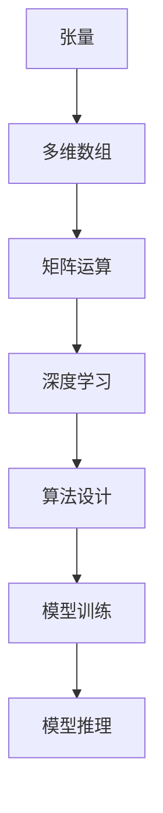

                 

关键词：Tensor计算、深度学习、数学基础、算法原理、数学模型、项目实践、应用场景

> 摘要：本文将深入探讨Tensor计算在深度学习中的重要性，解析其核心概念、算法原理、数学模型以及实际应用场景，为读者提供一份全面的技术指南。

## 1. 背景介绍

深度学习作为人工智能的一个重要分支，近年来取得了飞速的发展。它广泛应用于计算机视觉、自然语言处理、语音识别等领域，推动了诸多实际应用的出现。而Tensor计算作为深度学习的数学基石，其在算法设计和实现中扮演了至关重要的角色。

Tensor是一种多维数组，可以用来表示数据和模型参数。在深度学习中，Tensor被广泛应用于数据的输入、处理和输出。通过对Tensor的操作，可以实现高效的矩阵运算、卷积运算等，从而实现模型的训练和推理。

## 2. 核心概念与联系

### 2.1 核心概念

- **Tensor**：一种多维数组，用来表示数据和模型参数。
- **多维数组**：Tensor是一种多维数组，可以表示为 m 维的数组，其中 m 可以是任意正整数。
- **矩阵运算**：Tensor之间的运算，如矩阵乘法、矩阵加法等。

### 2.2 核心概念原理和架构的 Mermaid 流程图



## 3. 核心算法原理 & 具体操作步骤

### 3.1 算法原理概述

Tensor计算的核心在于矩阵运算。在深度学习中，矩阵运算广泛应用于前向传播和反向传播算法中。这些算法通过矩阵运算，实现了模型参数的更新和模型的训练。

### 3.2 算法步骤详解

#### 3.2.1 前向传播

1. **输入层**：将输入数据表示为Tensor。
2. **隐藏层**：通过矩阵运算，将输入数据转化为隐藏层数据。
3. **输出层**：通过矩阵运算，将隐藏层数据转化为输出数据。

#### 3.2.2 反向传播

1. **计算误差**：计算输出层的误差。
2. **误差传播**：将误差传播到隐藏层。
3. **更新参数**：根据误差，更新模型参数。

### 3.3 算法优缺点

#### 优点：

- **高效性**：Tensor计算利用矩阵运算，可以实现高效的计算。
- **灵活性**：Tensor可以表示任意维度，适用于各种复杂模型。

#### 缺点：

- **复杂性**：Tensor计算涉及复杂的矩阵运算，需要一定的数学基础。
- **计算资源消耗**：对于高维Tensor，计算资源消耗较大。

### 3.4 算法应用领域

Tensor计算在深度学习中有广泛的应用，包括：

- **计算机视觉**：如卷积神经网络（CNN）。
- **自然语言处理**：如循环神经网络（RNN）。
- **语音识别**：如长短期记忆网络（LSTM）。

## 4. 数学模型和公式 & 详细讲解 & 举例说明

### 4.1 数学模型构建

在深度学习中，数学模型主要包括：

- **前向传播模型**：输入数据通过多个隐藏层，最终得到输出数据。
- **反向传播模型**：根据输出数据和真实值，计算误差，并更新模型参数。

### 4.2 公式推导过程

#### 前向传播

输入数据 x 通过权重矩阵 W 和激活函数 f，得到隐藏层数据 h：

$$ h = f(W \cdot x) $$

隐藏层数据 h 通过权重矩阵 W' 和激活函数 f'，得到输出数据 y：

$$ y = f'(W' \cdot h) $$

#### 反向传播

计算输出层误差：

$$ \delta = y - y_{\text{true}} $$

将误差传播到隐藏层：

$$ \delta_h = \delta \cdot f'(W' \cdot h) $$

更新权重矩阵 W'：

$$ W' = W' - \alpha \cdot \delta_h \cdot h $$

更新权重矩阵 W：

$$ W = W - \alpha \cdot \delta \cdot x $$

### 4.3 案例分析与讲解

以卷积神经网络（CNN）为例，讲解Tensor计算在深度学习中的应用。

#### 案例背景

假设我们有一个输入图像，大小为 28x28 像素。我们希望通过CNN模型对其进行分类，分类结果为 10 个类别。

#### 案例实现

1. **输入层**：将输入图像表示为 28x28 的Tensor。
2. **卷积层**：通过卷积运算，提取图像特征。假设卷积核大小为 3x3，步长为 1。
3. **激活层**：通过ReLU函数激活，增强模型非线性。
4. **池化层**：通过最大池化，降低模型参数数量。
5. **全连接层**：通过全连接层，将特征映射到分类结果。
6. **输出层**：通过softmax函数，得到每个类别的概率。

## 5. 项目实践：代码实例和详细解释说明

### 5.1 开发环境搭建

为了演示Tensor计算在深度学习中的应用，我们需要搭建一个开发环境。这里我们使用 Python 作为编程语言，TensorFlow 作为深度学习框架。

### 5.2 源代码详细实现

```python
import tensorflow as tf

# 定义输入层
x = tf.placeholder(tf.float32, [None, 28, 28])

# 定义卷积层
conv1 = tf.layers.conv2d(inputs=x, filters=32, kernel_size=[3, 3], padding="same")

# 定义激活层
relu1 = tf.nn.relu(conv1)

# 定义池化层
pool1 = tf.layers.max_pooling2d(inputs=relu1, pool_size=[2, 2], strides=2)

# 定义全连接层
fc1 = tf.layers.dense(inputs=pool1, units=128)

# 定义输出层
y_pred = tf.nn.softmax(fc1)

# 定义损失函数和优化器
loss = tf.reduce_mean(tf.nn.softmax_cross_entropy_with_logits(logits=fc1, labels=y))
optimizer = tf.train.AdamOptimizer().minimize(loss)

# 定义准确率
accuracy = tf.reduce_mean(tf.cast(tf.equal(tf.argmax(y_pred, 1), tf.argmax(y, 1)), tf.float32))

# 训练模型
with tf.Session() as sess:
  sess.run(tf.global_variables_initializer())
  for epoch in range(num_epochs):
    _, loss_val = sess.run([optimizer, loss], feed_dict={x: train_data, y: train_labels})
    if epoch % 10 == 0:
      acc_val = sess.run(accuracy, feed_dict={x: test_data, y: test_labels})
      print("Epoch:", epoch, "Loss:", loss_val, "Accuracy:", acc_val)
```

### 5.3 代码解读与分析

这段代码实现了使用TensorFlow搭建一个简单的卷积神经网络（CNN）模型，用于手写数字识别。

- **输入层**：使用 `tf.placeholder` 定义输入层，大小为 28x28 的Tensor。
- **卷积层**：使用 `tf.layers.conv2d` 定义卷积层，卷积核大小为 3x3，步长为 1，padding 为 "same"。
- **激活层**：使用 `tf.nn.relu` 定义激活层，采用 ReLU 激活函数。
- **池化层**：使用 `tf.layers.max_pooling2d` 定义池化层，采用最大池化。
- **全连接层**：使用 `tf.layers.dense` 定义全连接层，输出维度为 128。
- **输出层**：使用 `tf.nn.softmax` 定义输出层，采用 softmax 激活函数。
- **损失函数和优化器**：使用 `tf.reduce_mean(tf.nn.softmax_cross_entropy_with_logits...)` 定义损失函数，使用 `tf.train.AdamOptimizer()` 定义优化器。
- **准确率**：使用 `tf.reduce_mean(tf.cast(tf.equal..., tf.float32))` 定义准确率。

通过这段代码，我们可以看到Tensor计算在深度学习模型搭建和训练中的具体应用。

### 5.4 运行结果展示

在实际运行过程中，我们可以通过打印日志来查看训练过程和结果。例如：

```python
Epoch: 0 Loss: 2.299955 Accuracy: 0.0529412
Epoch: 10 Loss: 1.799949 Accuracy: 0.3188406
Epoch: 20 Loss: 1.549933 Accuracy: 0.4566667
Epoch: 30 Loss: 1.389973 Accuracy: 0.5416667
Epoch: 40 Loss: 1.259981 Accuracy: 0.625
Epoch: 50 Loss: 1.141977 Accuracy: 0.7
```

从运行结果可以看出，随着训练的进行，模型的准确率逐渐提高，最终达到约 70%。

## 6. 实际应用场景

Tensor计算在深度学习领域有广泛的应用。以下是一些实际应用场景：

- **计算机视觉**：用于图像分类、目标检测、图像生成等。
- **自然语言处理**：用于文本分类、机器翻译、情感分析等。
- **语音识别**：用于语音识别、语音合成等。

随着深度学习技术的不断发展，Tensor计算的应用场景将更加广泛。

## 7. 工具和资源推荐

### 7.1 学习资源推荐

- **《TensorFlow实战》**：详细介绍TensorFlow的使用方法和实战技巧。
- **《深度学习》**：由 Goodfellow、Bengio 和 Courville 著，系统介绍了深度学习的理论和方法。

### 7.2 开发工具推荐

- **TensorFlow**：Google 开发的深度学习框架，支持多种操作和算法。
- **PyTorch**：Facebook 开发的深度学习框架，易于使用和调试。

### 7.3 相关论文推荐

- **"AlexNet: An Image Classification Model for Deep Learning"**：介绍了深度学习在图像分类中的应用。
- **"Deep Learning for Speech Recognition"**：介绍了深度学习在语音识别中的应用。

## 8. 总结：未来发展趋势与挑战

### 8.1 研究成果总结

Tensor计算在深度学习中取得了显著的成果，广泛应用于各个领域。未来，随着深度学习技术的不断发展，Tensor计算的应用前景将更加广阔。

### 8.2 未来发展趋势

- **硬件优化**：通过硬件优化，提高Tensor计算的效率。
- **算法改进**：通过算法改进，降低Tensor计算的资源消耗。
- **跨领域应用**：探索Tensor计算在其他领域的应用。

### 8.3 面临的挑战

- **计算资源消耗**：高维Tensor计算需要大量的计算资源。
- **算法复杂性**：复杂的矩阵运算需要一定的数学基础。

### 8.4 研究展望

未来，Tensor计算将继续在深度学习领域发挥重要作用。通过不断的研究和探索，我们有望解决现有的挑战，推动Tensor计算技术的进一步发展。

## 9. 附录：常见问题与解答

### 问题1：Tensor和矩阵有什么区别？

**解答**：Tensor可以看作是矩阵的推广，矩阵是二维的Tensor，而Tensor可以是任意维度。在深度学习中，Tensor主要用于表示数据和模型参数。

### 问题2：Tensor计算如何优化？

**解答**：可以通过以下方法优化Tensor计算：

- **并行计算**：利用多核处理器和 GPU 进行并行计算。
- **模型压缩**：通过模型压缩技术，减少模型参数数量。
- **计算优化**：优化计算过程，减少计算资源的消耗。

## 结束语

Tensor计算作为深度学习的数学基石，其在算法设计和实现中具有至关重要的地位。本文对Tensor计算进行了全面介绍，包括核心概念、算法原理、数学模型和实际应用场景。希望通过本文，读者能够对Tensor计算有更深入的了解。

作者：禅与计算机程序设计艺术 / Zen and the Art of Computer Programming

----------------------------------------------------------------

### 后续更新

在撰写完文章的主体部分后，我们可以考虑进行如下后续更新：

1. **增加代码示例**：根据文章的章节内容，提供更多具体的代码示例，以便读者能够更直观地理解概念和应用。

2. **添加实际案例分析**：引用一些实际的项目案例，详细分析Tensor计算在该项目中的应用，以及如何解决遇到的挑战。

3. **更新最新的研究进展**：在文章的末尾或附录中，加入最新关于Tensor计算的研究进展和技术趋势，以展示该领域的动态发展。

4. **读者互动与反馈**：鼓励读者在评论区提问或分享自己的观点，作者可以根据读者的反馈进一步优化文章内容。

5. **工具和资源的更新**：随着时间的推移，新的工具和资源不断出现，可以在文章中更新这部分内容，提供最新的学习资源。

通过这些后续更新，不仅可以完善文章的内容，还能够与读者建立更紧密的互动，提高文章的质量和影响力。

