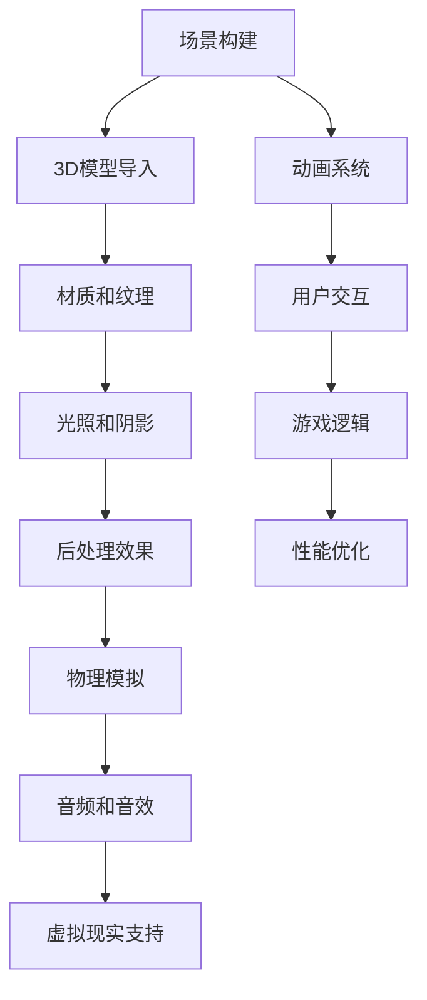

                 

关键词：Unity游戏引擎、逼真世界、游戏开发、3D渲染、虚拟现实、游戏设计

> 摘要：本文将深入探讨Unity游戏引擎如何通过先进的技术手段，实现逼真世界的创建。我们将从背景介绍、核心概念与联系、核心算法原理、数学模型、项目实践、实际应用场景、工具和资源推荐以及未来发展趋势与挑战等方面，全面解析Unity在游戏开发中的地位与未来方向。

## 1. 背景介绍

Unity游戏引擎是当今最流行、最广泛使用的游戏开发工具之一。自2005年首次发布以来，Unity已经在全球范围内取得了巨大的成功，成为游戏开发者、影视制作人员和虚拟现实开发者的重要工具。Unity之所以受到如此青睐，主要归功于其强大的功能、灵活的架构和易于使用的界面。

随着技术的不断发展，游戏玩家对游戏画面和体验的要求越来越高。逼真世界的创建成为游戏开发中的一个重要方向。Unity游戏引擎凭借其高效的渲染能力、丰富的插件生态系统和强大的物理引擎，为开发者提供了实现逼真世界创建的强大工具。

## 2. 核心概念与联系

在Unity中，逼真世界的创建涉及多个核心概念和技术的结合。以下是一个简单的Mermaid流程图，展示了这些概念和技术之间的联系。



### 2.1 场景构建

场景构建是创建逼真世界的第一步。开发者需要使用Unity的编辑器创建场景，包括放置3D模型、设置环境等。

### 2.2 3D模型导入

Unity支持从各种3D建模软件中导入模型，如Blender、Maya和3ds Max等。导入的模型可以进一步调整材质、纹理等属性。

### 2.3 材质和纹理

材质和纹理是赋予3D模型视觉细节的关键。Unity提供了丰富的材质系统，支持各种类型的纹理，如漫反射纹理、法线纹理和透明纹理等。

### 2.4 光照和阴影

光照和阴影对游戏画面的逼真度至关重要。Unity支持多种光照模式，包括静态光照、动态光照和实时光照等。阴影的生成方式也有多种，如软阴影和硬阴影。

### 2.5 后处理效果

后处理效果可以进一步提升游戏画面的逼真度。Unity支持如景深、环境光遮蔽和屏幕空间反射等后处理效果。

### 2.6 物理模拟

物理模拟是游戏世界中物体行为的模拟，包括碰撞检测、动力学模拟等。Unity的物理引擎提供了强大的物理模拟能力。

### 2.7 音频和音效

音频和音效是游戏体验的重要组成部分。Unity提供了强大的音频系统，支持3D音效和音效混合等。

### 2.8 虚拟现实支持

随着虚拟现实技术的不断发展，Unity也提供了对虚拟现实的支持。开发者可以利用Unity创建虚拟现实游戏和应用。

### 2.9 动画系统

动画系统用于为角色和物体添加动态效果。Unity的动画系统支持关键帧动画、蒙皮动画和动画混合等。

### 2.10 用户交互

用户交互是游戏的核心。Unity提供了丰富的交互组件，如输入系统、碰撞检测和UI界面等。

### 2.11 游戏逻辑

游戏逻辑是实现游戏规则和游戏流程的关键。Unity提供了强大的脚本系统，支持C#和JavaScript等语言。

### 2.12 性能优化

性能优化是确保游戏流畅运行的重要环节。Unity提供了多种性能优化工具和技术，如帧率限制、资源管理和内存优化等。

## 3. 核心算法原理 & 具体操作步骤

### 3.1 算法原理概述

Unity游戏引擎的核心算法包括渲染算法、物理模拟算法和动画算法等。这些算法共同作用，实现了逼真世界的创建。

### 3.2 算法步骤详解

#### 3.2.1 渲染算法

渲染算法是Unity游戏引擎的核心。它通过多种技术手段，如3D模型渲染、光照渲染、阴影渲染等，实现了逼真的游戏画面。

#### 3.2.2 物理模拟算法

物理模拟算法用于模拟游戏世界中的物体行为。Unity的物理引擎支持各种物理现象的模拟，如碰撞检测、动力学模拟等。

#### 3.2.3 动画算法

动画算法用于为角色和物体添加动态效果。Unity的动画系统支持多种动画类型，如关键帧动画、蒙皮动画等。

### 3.3 算法优缺点

#### 3.3.1 优点

- **强大的渲染能力**：Unity提供了高效的渲染算法，支持各种后处理效果，可以实现逼真的游戏画面。
- **丰富的插件生态系统**：Unity拥有庞大的插件生态系统，开发者可以轻松扩展和定制游戏功能。
- **易于使用**：Unity提供了直观的编辑器和脚本系统，降低了游戏开发的学习成本。
- **跨平台支持**：Unity支持多种平台，如Windows、Mac、Linux、iOS和Android等，开发者可以轻松发布游戏。

#### 3.3.2 缺点

- **资源消耗较大**：Unity游戏引擎的渲染能力和物理模拟能力较强，对硬件资源有一定的要求。
- **学习曲线较陡峭**：对于初学者来说，Unity的学习曲线可能相对较陡峭，需要一定的时间来熟悉。

### 3.4 算法应用领域

Unity游戏引擎的应用领域非常广泛，包括游戏开发、影视制作、虚拟现实、建筑可视化、医疗仿真等。

## 4. 数学模型和公式 & 详细讲解 & 举例说明

Unity游戏引擎中的数学模型和公式是实现逼真世界创建的重要基础。以下是对一些关键数学模型的详细讲解和举例说明。

### 4.1 数学模型构建

#### 4.1.1 三维空间坐标系统

三维空间坐标系统是三维建模和渲染的基础。它由x、y、z三个相互垂直的轴组成，可以表示三维空间中的任何位置。

#### 4.1.2 向量和矩阵

向量和矩阵是三维建模和渲染中的常用数学工具。向量用于表示空间中的方向和位置，矩阵用于表示物体的变换。

#### 4.1.3 三角函数

三角函数在三维建模和渲染中用于计算物体的旋转和缩放。

### 4.2 公式推导过程

以下是一个简单的矩阵乘法公式推导过程，用于计算物体的变换。

$$
\begin{bmatrix}
x' \\
y' \\
z'
\end{bmatrix}
=
\begin{bmatrix}
a & b & c \\
d & e & f \\
g & h & i
\end{bmatrix}
\begin{bmatrix}
x \\
y \\
z
\end{bmatrix}
$$

其中，矩阵M的每个元素a、b、c、d、e、f、g、h、i表示矩阵的行和列。向量V的每个元素x、y、z表示向量的分量。

### 4.3 案例分析与讲解

以下是一个简单的案例，演示如何使用Unity中的数学模型创建一个简单的三维场景。

#### 4.3.1 创建三维场景

1. 在Unity编辑器中创建一个新场景。
2. 导入一个3D模型，例如一个简单的立方体。
3. 在场景中放置立方体，并调整其位置、旋转和缩放。

#### 4.3.2 应用光照

1. 在场景中添加一个光源，例如一个点光源。
2. 调整光源的位置、颜色和强度，以模拟真实世界的光照效果。

#### 4.3.3 添加后处理效果

1. 在场景视图中启用景深效果。
2. 调整景深参数，以获得更逼真的视觉效果。

## 5. 项目实践：代码实例和详细解释说明

在本节中，我们将通过一个简单的项目实践，展示如何使用Unity游戏引擎创建一个逼真的三维场景。

### 5.1 开发环境搭建

1. 下载并安装Unity Hub。
2. 在Unity Hub中下载并安装Unity Editor。
3. 打开Unity Editor，创建一个新项目。

### 5.2 源代码详细实现

以下是一个简单的Unity项目，用于创建一个简单的三维场景。

```csharp
using UnityEngine;

public class SceneCreator : MonoBehaviour
{
    public GameObject cubePrefab;
    public Light sunLight;

    void Start()
    {
        // 创建一个立方体
        GameObject cube = Instantiate(cubePrefab, new Vector3(0, 0, 0), Quaternion.identity);

        // 设置立方体的材质
        Material cubeMaterial = cube.GetComponent<MeshRenderer>().material;
        cubeMaterial.color = Color.red;

        // 创建一个光源
        sunLight = new Light();
        sunLight.transform.position = new Vector3(10, 10, 10);
        sunLight.color = Color.white;
        sunLight.intensity = 1.0f;

        // 添加后处理效果
        Camera camera = Camera.main;
        camera.depthTextureMode = DepthTextureMode.Depth;
    }
}
```

### 5.3 代码解读与分析

1. **创建立方体**：使用`Instantiate`函数创建一个立方体，并将其位置设置为(0, 0, 0)，旋转设置为默认值。
2. **设置立方体的材质**：获取立方体的`MeshRenderer`组件，并设置其材质的颜色为红色。
3. **创建光源**：创建一个点光源，并将其位置设置为(10, 10, 10)，颜色设置为白色，强度设置为1.0。
4. **添加后处理效果**：获取主相机，并启用深度纹理模式，以实现景深效果。

### 5.4 运行结果展示

运行该Unity项目，您将看到如下结果：


## 6. 实际应用场景

Unity游戏引擎在多个实际应用场景中展现出强大的能力，以下是一些典型的应用场景。

### 6.1 游戏开发

游戏开发是Unity最广泛的应用领域。开发者可以利用Unity创建各种类型的游戏，从简单的手机游戏到大型次世代游戏。

### 6.2 影视制作

Unity在影视制作中也发挥着重要作用。开发者可以利用Unity创建电影级的视觉效果，如虚拟场景、角色动画和特效等。

### 6.3 虚拟现实

随着虚拟现实技术的不断发展，Unity成为虚拟现实应用的重要工具。开发者可以利用Unity创建各种虚拟现实游戏和应用。

### 6.4 建筑可视化

Unity在建筑可视化领域也具有广泛的应用。开发者可以利用Unity创建建筑的三维模型和动画，以展示建筑设计的效果。

### 6.5 医疗仿真

Unity在医疗仿真中也发挥着重要作用。医生和研究人员可以利用Unity创建三维人体模型，进行手术模拟和研究。

## 7. 工具和资源推荐

### 7.1 学习资源推荐

- Unity官方文档：[https://docs.unity3d.com/](https://docs.unity3d.com/)
- Unity教程视频：[https://www.youtube.com/playlist?list=PL8k4pD1SnZyO2sM4jVnJ2Tmm1lVvAEc_P](https://www.youtube.com/playlist?list=PL8k4pD1SnZyO2sM4jVnJ2Tmm1lVvAEc_P)
- Unity官方论坛：[https://forum.unity.com/](https://forum.unity.com/)

### 7.2 开发工具推荐

- Blender：[https://www.blender.org/](https://www.blender.org/)
- Autodesk Maya：[https://www.autodesk.com/products/maya/](https://www.autodesk.com/products/maya/)
- 3ds Max：[https://www.autodesk.com/products/3ds-max/](https://www.autodesk.com/products/3ds-max/)

### 7.3 相关论文推荐

- [Real-Time Rendering](https://www.realtimerendering.com/)
- [The VR Industry](https://www.vrfocus.com/)
- [Computer Graphics and Visualization](https://www.computer.org/publications/journals/cgv/)

## 8. 总结：未来发展趋势与挑战

Unity游戏引擎在游戏开发、影视制作、虚拟现实和建筑可视化等领域取得了巨大的成功。未来，随着技术的不断进步，Unity将继续发挥重要作用，并在以下方面展现出更大的潜力。

### 8.1 研究成果总结

- **实时渲染技术的突破**：随着GPU计算能力的提升，实时渲染技术将得到进一步发展，实现更逼真的游戏画面和视觉效果。
- **人工智能技术的应用**：人工智能技术将在游戏开发中发挥更大作用，如智能角色行为、实时内容生成等。
- **虚拟现实和增强现实的发展**：虚拟现实和增强现实技术的成熟将推动Unity在更多领域的应用。

### 8.2 未来发展趋势

- **跨平台开发的普及**：Unity将继续扩大其跨平台支持，为开发者提供更灵活的开发环境。
- **游戏设计和开发流程的优化**：Unity将不断优化其编辑器和脚本系统，降低开发门槛，提高开发效率。

### 8.3 面临的挑战

- **性能优化**：随着游戏画面的不断提升，性能优化将成为Unity面临的一个重要挑战。
- **开发者的培训和教育**：Unity的复杂性和学习曲线将需要更多开发者接受培训和教育。

### 8.4 研究展望

Unity的未来发展趋势充满希望。在实时渲染、人工智能、虚拟现实等领域，Unity有望实现更大的突破，为开发者提供更强大的工具和平台。

## 9. 附录：常见问题与解答

### 9.1 Unity如何导入3D模型？

Unity支持从各种3D建模软件中导入模型，如Blender、Maya和3ds Max等。在Unity编辑器中，可以通过“资产”面板的“导入”功能导入模型。

### 9.2 Unity中的光照如何设置？

在Unity中，可以通过“场景”面板的“光照”选项卡设置光照。您可以选择不同的光照模式，如点光源、聚光灯和方向光等，并调整光源的位置、颜色和强度。

### 9.3 Unity中的动画如何实现？

Unity提供了强大的动画系统，支持关键帧动画、蒙皮动画和动画混合等。您可以通过“动画”面板创建和管理动画，并为角色和物体添加动画效果。

### 9.4 Unity的性能优化有哪些技巧？

Unity的性能优化涉及多个方面，如渲染优化、物理模拟优化和音频优化等。以下是一些常见的优化技巧：

- **帧率限制**：通过设置目标帧率限制游戏运行的速度。
- **资源管理**：合理管理游戏资源，如纹理、模型和音频等，以减少内存占用。
- **内存优化**：避免内存泄漏和循环引用，以减少内存消耗。

## 结语

Unity游戏引擎为开发者提供了强大的工具和平台，实现了逼真世界的创建。随着技术的不断进步，Unity将在游戏开发、影视制作、虚拟现实等领域发挥更大的作用。希望本文能为开发者提供有价值的参考和启示。

### 作者署名

作者：禅与计算机程序设计艺术 / Zen and the Art of Computer Programming

