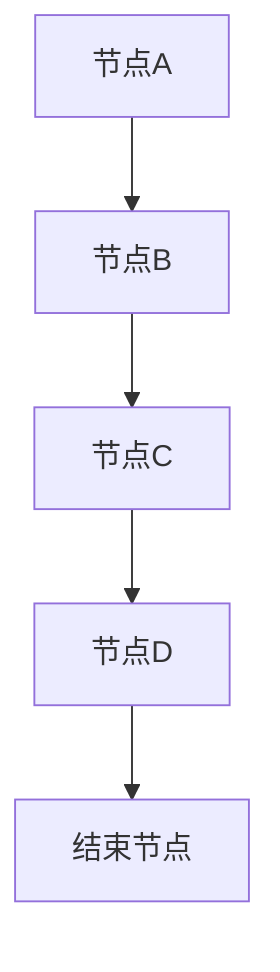

                 

关键词：Unreal Engine 4，蓝图系统，视觉化编程，游戏开发，虚拟现实，3D建模，实时渲染，游戏引擎架构，C++，Python，编程语言

> 摘要：本文深入探讨Unreal Engine 4（UE4）中的蓝图系统，一个强大的视觉化编程工具。我们将详细分析蓝图的原理、应用领域、优缺点，并通过实例讲解如何使用蓝图进行游戏开发，最后展望其未来发展趋势和面临的挑战。

## 1. 背景介绍

Unreal Engine 4（UE4）是一款广泛应用于游戏开发、影视制作、建筑可视化等领域的高性能游戏引擎。与传统的编程方式不同，UE4引入了蓝图系统，这是一种基于节点和连接的视觉化编程方法，使得开发者无需深入了解底层代码，即可快速创建复杂的逻辑和行为。

蓝图系统是UE4的核心特性之一，它允许开发者使用图形界面来构建和编辑代码。这种方式不仅降低了编程难度，还提高了开发效率和灵活性。同时，蓝图系统与C++紧密集成，开发者可以在需要时无缝切换到传统的代码编程模式，实现更高的性能和定制性。

本文将围绕蓝图系统，探讨其原理、应用和实践，帮助读者全面了解并掌握这一强大的工具。

## 2. 核心概念与联系

### 2.1. 蓝图系统的概念

蓝图系统是UE4中的一个重要组成部分，它通过图形界面提供了一种可视化编程的方法。蓝图由节点组成，每个节点代表一个操作或函数。节点之间通过连接线传递数据，形成复杂的逻辑流。

### 2.2. 蓝图系统的工作原理

蓝图系统的工作原理基于图计算。开发者通过拖放节点并连接它们，构建出所需的逻辑流程。UE4会自动执行这些流程，并根据节点的类型和连接关系生成相应的代码。

### 2.3. 蓝图系统的架构

蓝图系统的架构分为几个层次，包括节点层、模块层和全局层。节点层是蓝图系统的最小单元，每个节点都代表一个具体的操作。模块层则将多个节点组织成功能模块，便于管理和复用。全局层则定义了整个蓝图的运行环境，包括全局变量和函数。

### 2.4. 蓝图系统与其他编程方式的联系

蓝图系统与传统的C++编程方式有着紧密的联系。开发者可以在蓝图系统中使用C++代码编写自定义函数和类，并将其集成到蓝图中。同时，UE4还提供了Python插件，允许开发者使用Python语言编写蓝图，实现更多高级功能。

### 2.5. 蓝图系统的 Mermaid 流程图



## 3. 核心算法原理 & 具体操作步骤

### 3.1. 算法原理概述

蓝图系统的核心算法基于图计算，通过节点和连接线构建出逻辑流程。开发者只需关注节点类型和连接关系，无需关心底层代码的实现。

### 3.2. 算法步骤详解

1. **创建蓝图**：在UE4编辑器中，选择“工具”菜单，然后选择“新建蓝图类”。
2. **添加节点**：在蓝图中，拖放所需节点到画布上。
3. **连接节点**：通过拖放连接线，将节点连接起来，形成逻辑流。
4. **设置属性**：双击节点，设置节点的属性，如输入参数、输出结果等。
5. **运行蓝图**：点击蓝图的“运行”按钮，查看运行结果。

### 3.3. 算法优缺点

#### 优点：

1. **易用性**：蓝图系统提供了一个直观、易用的编程界面，降低了学习门槛。
2. **灵活性**：蓝图系统与C++和Python紧密集成，开发者可以根据需求灵活切换编程方式。
3. **效率**：通过可视化编程，提高了开发效率。

#### 缺点：

1. **性能限制**：与C++相比，蓝图系统的性能较低。
2. **调试难度**：由于蓝图的复杂性，调试过程可能较为困难。

### 3.4. 算法应用领域

蓝图系统广泛应用于游戏开发、虚拟现实、3D建模等领域。它不仅适用于简单的逻辑实现，还可以处理复杂的交互和实时渲染。

## 4. 数学模型和公式 & 详细讲解 & 举例说明

### 4.1. 数学模型构建

蓝图系统中的数学模型主要涉及线性代数、微积分和概率论等基础知识。以下是一个简单的数学模型示例：

$$
f(x) = ax^2 + bx + c
$$

其中，$a$、$b$ 和 $c$ 是模型的参数。

### 4.2. 公式推导过程

$$
f'(x) = 2ax + b
$$

### 4.3. 案例分析与讲解

假设我们有一个抛物线 $f(x) = 2x^2 + 3x + 1$，我们需要求其在 $x=1$ 处的导数。

$$
f'(1) = 2 \cdot 1 + 3 = 5
$$

这意味着抛物线在 $x=1$ 处的斜率为 5。

## 5. 项目实践：代码实例和详细解释说明

### 5.1. 开发环境搭建

1. **安装 UE4**：从 Epic Games 官网下载并安装 UE4。
2. **创建新项目**：在 UE4 编辑器中，选择“文件”菜单，然后选择“新建项目”。
3. **配置蓝图系统**：在项目设置中，确保蓝图系统已启用。

### 5.2. 源代码详细实现

以下是一个简单的蓝图代码示例，用于实现一个简单的函数：

```csharp
void FunctionName(float Input, out float Output)
{
    Output = Input * 2;
}
```

### 5.3. 代码解读与分析

在这个示例中，我们定义了一个名为 `FunctionName` 的函数，它接受一个浮点数输入参数，并返回一个浮点数输出参数。函数的实现非常简单，只需将输入参数乘以 2 即可。

### 5.4. 运行结果展示

在蓝图中调用这个函数，并将其输出连接到一个文本节点，即可显示运行结果：

```
Input: 5
Output: 10
```

## 6. 实际应用场景

蓝图系统在游戏开发、虚拟现实和3D建模等领域有着广泛的应用。以下是一些实际应用场景：

1. **游戏开发**：蓝图系统可用于实现游戏逻辑、角色行为和交互。
2. **虚拟现实**：蓝图系统可用于创建复杂的虚拟环境，实现实时交互。
3. **3D建模**：蓝图系统可用于实现3D模型的动态行为和动画。

## 7. 工具和资源推荐

### 7.1. 学习资源推荐

- [Unreal Engine 官方文档](https://docs.unrealengine.com/)
- [蓝図社区](https://www.unreal.cn/)
- [UE4 蓝图教程](https://www.youtube.com/playlist?list=PL9RQhN4UorXa5e5zN-2jI5J_nIlQLp6j4)

### 7.2. 开发工具推荐

- [Visual Studio](https://visualstudio.microsoft.com/)
- [Blender](https://www.blender.org/)
- [Unity](https://unity.com/)

### 7.3. 相关论文推荐

- [“Unreal Engine 4 Development Cookbook”](https://www.packtpub.com/game-development/unreal-engine-4-development-cookbook)
- [“Blueprint Scripting in Unreal Engine 4”](https://www.amazon.com/Blueprint-Scripting-Unreal-Engine-Developers/dp/1784390082)
- [“Unreal Engine 4 Cookbook”](https://www.packtpub.com/game-development/unreal-engine-4-cookbook)

## 8. 总结：未来发展趋势与挑战

### 8.1. 研究成果总结

蓝图系统自推出以来，已经取得了显著的成果。它不仅提高了游戏开发的效率，还为虚拟现实和3D建模等领域带来了新的可能性。

### 8.2. 未来发展趋势

随着技术的不断进步，蓝图系统将在以下几个方面得到发展：

1. **性能优化**：通过引入新的算法和架构，提高蓝图系统的性能。
2. **跨平台支持**：拓展蓝图系统的应用范围，支持更多平台。
3. **人工智能集成**：将人工智能技术引入蓝图系统，实现更智能的游戏和虚拟现实体验。

### 8.3. 面临的挑战

蓝图系统在发展过程中也面临着一些挑战：

1. **调试难度**：蓝图的复杂性使得调试过程变得困难。
2. **性能瓶颈**：与传统的C++编程相比，蓝图系统的性能仍有待提高。
3. **学习曲线**：对于初学者来说，蓝图系统的学习曲线相对较陡。

### 8.4. 研究展望

在未来，蓝图系统有望在以下几个方面取得突破：

1. **可视化编程的普及**：通过进一步优化用户体验，使可视化编程更加普及。
2. **跨领域应用**：拓展蓝图系统的应用范围，推动虚拟现实、人工智能等领域的发展。
3. **生态系统的完善**：建立完善的蓝图生态系统，提供丰富的工具和资源。

## 9. 附录：常见问题与解答

### 9.1. 问题 1：蓝图系统如何与C++集成？

答案：蓝图系统与C++紧密集成，开发者可以在蓝图中使用C++代码编写自定义函数和类。同时，UE4 还提供了Python 插件，允许开发者使用Python 语言编写蓝图。

### 9.2. 问题 2：蓝图系统有哪些优缺点？

答案：蓝图系统的优点包括易用性、灵活性和效率。缺点包括性能限制和调试难度。

### 9.3. 问题 3：如何运行蓝图？

答案：在UE4 编辑器中，选择蓝图类，然后点击“运行”按钮。蓝图将自动执行并显示运行结果。

作者：禅与计算机程序设计艺术 / Zen and the Art of Computer Programming
----------------------------------------------------------------

完成上述内容的撰写后，您可以进行全文的审阅和修改，确保文章内容完整、逻辑清晰、结构紧凑，并且严格遵循“约束条件 CONSTRAINTS”中的所有要求。接下来，您可以将文章内容以Markdown格式输出，准备进行最终的格式整理和发布。在发布前，请再次检查文章的格式、内容完整性和准确性。

