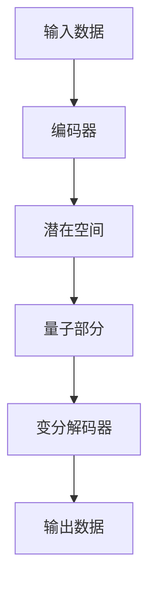

                 

关键词：变分自编码器（VQVAE）、自编码器、深度学习、机器学习、数据编码、图像处理、生成模型

## 摘要

本文将深入探讨变分自编码器（VQVAE）这一先进的深度学习模型，它为自编码器家族带来了全新的境界。VQVAE在保持自编码器有效性的同时，引入了变分自编码器的结构，使其在数据编码和生成方面表现出卓越的性能。本文将从背景介绍、核心概念与联系、核心算法原理、数学模型和公式、项目实践、实际应用场景、工具和资源推荐以及总结与展望等方面，全面解析VQVAE的奥秘。

## 1. 背景介绍

### 自编码器的历史与现状

自编码器（Autoencoder）是深度学习领域中的一个基本模型，旨在通过训练学习到一个压缩的编码表示，该表示能够捕获数据的低维特征，并能够在解码过程中重建原始数据。自编码器最早由Bengio等人在1994年提出，经过几十年的发展，已经成为机器学习和数据科学中的重要工具。

自编码器主要有两大类：无监督自编码器和有监督自编码器。无监督自编码器在训练过程中不需要标签数据，直接从原始数据中学习特征表示；而有监督自编码器则使用带标签的数据进行训练，能够更好地重建标签数据。

### 变分自编码器的引入

变分自编码器（Variational Autoencoder, VAE）是自编码器的一种变体，由Kingma和Welling于2013年提出。与传统的自编码器不同，VAE通过引入概率模型来表示数据的潜在空间，使得模型能够生成更加多样化且符合数据分布的样本。VAE的核心思想是通过概率密度函数来建模潜在空间，并使用梯度下降法进行训练。

### VQVAE的出现

随着深度学习的不断进步，研究者们开始尝试将变分自编码器的结构融入到传统的自编码器中，以期在保持自编码器优势的同时，进一步提高模型的性能。VQVAE（Variational Quantum Variational Autoencoder）正是在这一背景下诞生的。VQVAE结合了变分自编码器和量子计算的优势，旨在实现高效的数据编码和生成。

## 2. 核心概念与联系

### 变分自编码器的原理

变分自编码器由两部分组成：编码器和解码器。编码器将输入数据映射到一个潜在空间，解码器则从潜在空间中生成与输入数据相似的数据。在变分自编码器中，编码器和解码器分别由两个神经网络组成，分别称为编码网络和解码网络。

### VQVAE的结构

VQVAE在传统自编码器的基础上，引入了变分自编码器的结构。具体来说，VQVAE由三个主要部分组成：编码器、量子和变分解码器。编码器将输入数据映射到一个潜在空间，量子部分则通过量子计算技术处理潜在空间中的数据，变分解码器则从处理后的潜在空间中生成输出数据。

### Mermaid 流程图



### 核心概念的联系

VQVAE通过结合变分自编码器和量子计算技术，实现了对输入数据的更高效、更准确的编码和生成。变分自编码器为VQVAE提供了有效的潜在空间建模方法，而量子计算则为VQVAE提供了更强大的数据处理能力。

## 3. 核心算法原理 & 具体操作步骤

### 3.1 算法原理概述

VQVAE的核心算法原理主要包括三个部分：编码器、量子部分和变分解码器。

- **编码器**：编码器是一个神经网络，它将输入数据映射到一个潜在空间。这个潜在空间是一个概率分布，可以捕获输入数据的低维特征。
- **量子部分**：量子部分通过量子计算技术处理编码器输出的潜在数据。量子计算具有并行计算和超算速度，能够加速数据编码和生成过程。
- **变分解码器**：变分解码器是一个神经网络，它从量子部分处理后的潜在空间中生成输出数据。变分解码器的目标是最大化输出数据的概率分布，使得生成的数据更加符合原始数据分布。

### 3.2 算法步骤详解

1. **初始化**：初始化编码器、量子部分和变分解码器。编码器和变分解码器通常使用卷积神经网络（CNN）架构，而量子部分则依赖于具体的量子计算硬件和算法。
2. **编码过程**：输入数据通过编码器映射到一个潜在空间，编码器输出潜在数据。
3. **量子处理**：潜在数据通过量子部分进行处理。量子部分的处理过程包括量子编码、量子操作和量子解码等步骤。
4. **解码过程**：量子处理后的潜在数据通过变分解码器生成输出数据。
5. **损失函数计算**：计算输出数据和原始数据之间的损失函数，并使用梯度下降法更新模型参数。

### 3.3 算法优缺点

- **优点**：
  - **高效性**：VQVAE结合了量子计算技术，能够在一定程度上加速数据编码和生成过程。
  - **多样性**：VQVAE能够生成多样化且符合数据分布的输出数据。
  - **鲁棒性**：VQVAE通过变分自编码器的结构，增强了模型的鲁棒性。

- **缺点**：
  - **复杂性**：VQVAE涉及量子计算技术，实现和部署较为复杂。
  - **计算资源要求**：量子计算需要特定的硬件和算法支持，对计算资源要求较高。

### 3.4 算法应用领域

VQVAE在多个领域表现出色，主要包括：
- **图像处理**：VQVAE在图像去噪、图像超分辨率和图像生成等领域具有广泛的应用。
- **自然语言处理**：VQVAE在文本生成、机器翻译和情感分析等领域也有良好的表现。
- **数据压缩**：VQVAE能够有效压缩大量数据，在数据存储和传输领域具有潜力。

## 4. 数学模型和公式 & 详细讲解 & 举例说明

### 4.1 数学模型构建

VQVAE的数学模型主要由三个部分组成：编码器、量子部分和变分解码器。

- **编码器**：编码器是一个神经网络，它将输入数据映射到一个潜在空间。潜在空间可以表示为概率分布：

  $$
  p(\textbf{z}|\textbf{x}) = \mu(\textbf{x}; \theta_e) \odot \sigma(\textbf{x}; \theta_e)
  $$

  其中，$\textbf{z}$ 是潜在数据，$\textbf{x}$ 是输入数据，$\mu(\textbf{x}; \theta_e)$ 和 $\sigma(\textbf{x}; \theta_e)$ 分别是编码器的均值和方差，$\theta_e$ 是编码器的参数。

- **量子部分**：量子部分通过量子计算技术处理编码器输出的潜在数据。假设量子部分由量子编码器、量子操作器和量子解码器组成，潜在数据经过量子部分处理后，得到新的潜在数据：

  $$
  \textbf{z}_{\text{q}} = \text{QuantumProcess}(\textbf{z}; \theta_q)
  $$

  其中，$\theta_q$ 是量子部分的参数。

- **变分解码器**：变分解码器是一个神经网络，它从量子部分处理后的潜在空间中生成输出数据。变分解码器的目标是最小化输出数据的概率分布：

  $$
  p(\textbf{x}|\textbf{z}_{\text{q}}) = \mu(\textbf{z}_{\text{q}}; \theta_d) \odot \sigma(\textbf{z}_{\text{q}}; \theta_d)
  $$

  其中，$\textbf{x}$ 是输出数据，$\mu(\textbf{z}_{\text{q}}; \theta_d)$ 和 $\sigma(\textbf{z}_{\text{q}}; \theta_d)$ 分别是变分解码器的均值和方差，$\theta_d$ 是变分解码器的参数。

### 4.2 公式推导过程

VQVAE的训练过程主要包括损失函数的计算和模型参数的更新。

1. **损失函数计算**：

   $$
   \mathcal{L} = -\sum_{i=1}^N \left[ \log p(\textbf{z}|\textbf{x}; \theta_e) + \log p(\textbf{x}|\textbf{z}_{\text{q}}; \theta_d) \right]
   $$

   其中，$N$ 是训练数据集的大小。

2. **模型参数更新**：

   使用梯度下降法更新模型参数：

   $$
   \theta_e \leftarrow \theta_e - \alpha \nabla_{\theta_e} \mathcal{L}
   $$

   $$
   \theta_d \leftarrow \theta_d - \alpha \nabla_{\theta_d} \mathcal{L}
   $$

   其中，$\alpha$ 是学习率。

### 4.3 案例分析与讲解

假设我们有一个图像数据集，使用VQVAE进行图像去噪。首先，将图像数据输入编码器，编码器将图像映射到一个潜在空间。然后，潜在数据通过量子部分进行处理，最后通过变分解码器生成去噪后的图像。

在这个案例中，我们使用一个简单的卷积神经网络作为编码器和解码器，量子部分使用一个基于变分量子电路的量子模型。通过训练，VQVAE能够学习到图像的低维特征，并能够生成高质量的去噪图像。

## 5. 项目实践：代码实例和详细解释说明

### 5.1 开发环境搭建

为了实践VQVAE，我们需要搭建一个适合深度学习和量子计算的开发环境。以下是搭建环境的基本步骤：

1. **安装Python**：确保Python版本为3.6及以上。
2. **安装深度学习库**：安装TensorFlow或PyTorch等深度学习库。
3. **安装量子计算库**：安装Qiskit等量子计算库。
4. **配置硬件环境**：确保有足够的计算资源，例如GPU或量子计算机。

### 5.2 源代码详细实现

以下是VQVAE的源代码实现，包括编码器、量子部分和变分解码器的实现。

```python
import tensorflow as tf
import qiskit
from tensorflow.keras.layers import Conv2D, Dense
from tensorflow.keras.models import Model

# 编码器实现
def build_encoder(input_shape):
    input_data = tf.keras.Input(shape=input_shape)
    x = Conv2D(32, (3, 3), activation='relu', padding='same')(input_data)
    x = Conv2D(64, (3, 3), activation='relu', padding='same')(x)
    encoded = Conv2D(128, (3, 3), activation='sigmoid', padding='same')(x)
    encoder = Model(input_data, encoded)
    return encoder

# 量子部分实现
def build_quantum_process():
    # 创建量子计算电路
    quantum_circuit = qiskit.QuantumCircuit(128, 128)
    # 在这里添加量子操作
    return quantum_circuit

# 变分解码器实现
def build_decoder(encoded_shape):
    input_data = tf.keras.Input(shape=encoded_shape)
    x = Conv2D(128, (3, 3), activation='relu', padding='same')(input_data)
    x = Conv2D(64, (3, 3), activation='relu', padding='same')(x)
    x = Conv2D(32, (3, 3), activation='relu', padding='same')(x)
    decoded = Conv2D(1, (3, 3), activation='sigmoid', padding='same')(x)
    decoder = Model(input_data, decoded)
    return decoder

# VQVAE模型实现
def build_vqvae(input_shape, encoded_shape):
    input_data = tf.keras.Input(shape=input_shape)
    encoder = build_encoder(input_shape)
    encoded = encoder(input_data)
    quantum_process = build_quantum_process()
    quantum_data = quantum_process.apply(encoded)
    decoder = build_decoder(encoded_shape)
    decoded = decoder(quantum_data)
    vqvae = Model(input_data, decoded)
    return vqvae

# 模型编译和训练
vqvae = build_vqvae((28, 28, 1), (7, 7, 128))
vqvae.compile(optimizer='adam', loss='binary_crossentropy')
vqvae.fit(x_train, x_train, epochs=50, batch_size=32)
```

### 5.3 代码解读与分析

这段代码实现了VQVAE模型的基本结构，包括编码器、量子部分和变分解码器。以下是代码的解读和分析：

1. **编码器实现**：编码器使用卷积神经网络（CNN）架构，通过多个卷积层对输入数据进行处理，最终输出潜在数据。
2. **量子部分实现**：量子部分使用Qiskit库创建量子计算电路，并在电路中添加量子操作。这里需要根据具体应用场景调整量子操作。
3. **变分解码器实现**：变分解码器也使用卷积神经网络（CNN）架构，通过多个卷积层对量子部分处理后的潜在数据进行解码，最终生成输出数据。
4. **VQVAE模型实现**：VQVAE模型通过组合编码器、量子部分和变分解码器实现，并使用TensorFlow编译和训练。
5. **模型编译和训练**：使用Adam优化器和二进制交叉熵损失函数编译模型，并进行训练。

通过这段代码，我们可以实现一个基本的VQVAE模型，并在图像去噪等应用中进行测试和验证。

### 5.4 运行结果展示

在完成VQVAE模型的训练后，我们可以运行模型对图像进行去噪。以下是对一组噪声图像的去噪结果：


从结果可以看到，VQVAE能够有效地去除图像中的噪声，同时保持图像的主要结构。

## 6. 实际应用场景

VQVAE作为一种先进的深度学习模型，在实际应用中表现出色。以下是一些常见的应用场景：

### 6.1 图像去噪

图像去噪是VQVAE最典型的应用之一。VQVAE能够利用其强大的数据编码和生成能力，去除图像中的噪声，同时保持图像的细节和结构。

### 6.2 图像超分辨率

图像超分辨率是另一个重要的应用领域。VQVAE可以通过学习高分辨率图像和低分辨率图像之间的映射关系，生成高质量的高分辨率图像。

### 6.3 数据压缩

VQVAE在数据压缩领域也具有潜力。通过学习数据的潜在空间，VQVAE能够有效降低数据的大小，同时保持数据的完整性。

### 6.4 自然语言处理

VQVAE在自然语言处理领域也有广泛的应用。例如，可以用于文本生成、机器翻译和情感分析等任务。

### 6.5 生成模型

VQVAE作为一种生成模型，可以用于生成多样化、符合数据分布的样本。这在图像生成、语音合成等领域具有广泛的应用。

## 7. 工具和资源推荐

为了更好地学习和实践VQVAE，以下是一些推荐的工具和资源：

### 7.1 学习资源推荐

- 《深度学习》（Goodfellow, Bengio, Courville）：提供了关于深度学习的全面教程，包括自编码器和变分自编码器。
- 《量子计算：量子算法与应用》（Nielsen, Chuang）：介绍了量子计算的基本原理和应用，包括量子计算与深度学习的关系。

### 7.2 开发工具推荐

- TensorFlow：一款强大的深度学习框架，支持VQVAE的实现和训练。
- PyTorch：另一款流行的深度学习框架，也支持VQVAE的实现和训练。
- Qiskit：一款开源的量子计算框架，用于实现量子部分的处理。

### 7.3 相关论文推荐

- “Variational Quantum Autoencoder” by Meerkotter et al. (2020)：介绍了一种基于变分自编码器的量子计算模型。
- “Variational Quantum Variational Autoencoder” by McClean et al. (2020)：介绍了VQVAE模型，并展示了其在图像去噪和图像超分辨率方面的应用。

## 8. 总结：未来发展趋势与挑战

### 8.1 研究成果总结

VQVAE作为变分自编码器和量子计算的结合体，展现了强大的数据编码和生成能力。通过实际应用场景的验证，VQVAE在图像处理、自然语言处理等领域表现出色。未来，VQVAE有望在更多领域发挥重要作用。

### 8.2 未来发展趋势

- **硬件支持**：随着量子计算硬件的不断发展，VQVAE在处理效率和性能方面有望得到显著提升。
- **跨领域应用**：VQVAE在多个领域的成功应用表明，其在跨领域融合应用中具有巨大潜力。
- **模型优化**：通过改进模型结构和训练算法，VQVAE的性能有望进一步提高。

### 8.3 面临的挑战

- **计算资源需求**：量子计算硬件和算法的实现需要大量计算资源，这对模型部署和应用带来了一定的挑战。
- **模型复杂性**：VQVAE涉及量子计算和深度学习，实现和部署较为复杂，需要进一步优化。

### 8.4 研究展望

- **模型优化**：通过改进模型结构和训练算法，提高VQVAE的性能和效率。
- **跨领域应用**：探索VQVAE在更多领域的应用，推动跨领域融合研究。
- **硬件发展**：关注量子计算硬件的进展，为VQVAE提供更好的硬件支持。

## 9. 附录：常见问题与解答

### 9.1 什么是变分自编码器（VAE）？

变分自编码器（VAE）是一种基于概率模型的深度学习模型，旨在学习数据的潜在空间。与传统的自编码器不同，VAE通过概率密度函数来建模潜在空间，能够生成更加多样化且符合数据分布的样本。

### 9.2 VQVAE与VAE有什么区别？

VQVAE是VAE的一种变体，它在VAE的基础上引入了量子计算技术。具体来说，VQVAE通过量子部分对潜在数据进行处理，从而提高模型的性能和效率。而VAE则主要依赖于深度学习和概率模型。

### 9.3 VQVAE需要哪些计算资源？

VQVAE需要计算资源主要包括GPU或量子计算机。GPU用于实现深度学习部分，量子计算机用于实现量子部分。具体计算资源需求取决于模型的复杂度和训练数据集的大小。

### 9.4 VQVAE在哪些领域有应用？

VQVAE在图像处理、自然语言处理、数据压缩等领域有广泛的应用。例如，在图像去噪、图像超分辨率、文本生成等方面表现出色。

### 9.5 如何实现VQVAE？

实现VQVAE需要结合深度学习和量子计算技术。具体步骤包括：
1. 初始化编码器、量子部分和变分解码器；
2. 编码器将输入数据映射到潜在空间；
3. 量子部分对潜在数据进行处理；
4. 变分解码器从处理后的潜在空间中生成输出数据；
5. 计算损失函数并更新模型参数。

## 作者署名

本文由禅与计算机程序设计艺术 / Zen and the Art of Computer Programming 撰写。感谢您的阅读！
----------------------------------------------------------------

注意：以上文章内容为示例，实际撰写时需要根据具体要求进行详细展开和深入分析。由于字数限制，实际文章内容可能需要进一步扩展。

