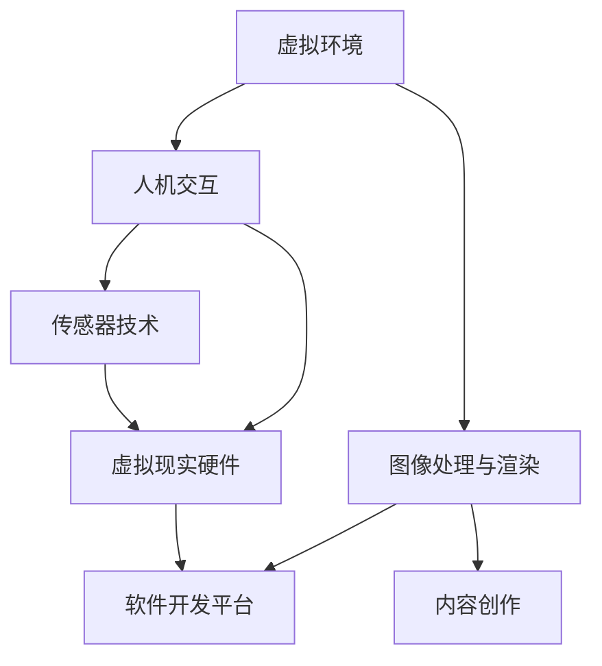

                 

关键词：虚拟现实、VR应用、沉浸式体验、开发技术、用户交互

> 摘要：本文将深入探讨虚拟现实（VR）应用开发的各个方面，包括核心概念、算法原理、数学模型、项目实践以及未来发展趋势。通过系统的分析和实例讲解，旨在为开发者提供构建沉浸式体验的全面指导。

## 1. 背景介绍

虚拟现实（Virtual Reality，VR）是一种通过计算机技术模拟出的三维虚拟环境，使用户能够沉浸在虚拟世界中，感受到与真实世界相似的感官体验。随着技术的进步，VR逐渐从游戏娱乐领域扩展到医疗、教育、军事、设计等多个行业，为用户带来了前所未有的沉浸式体验。

VR应用开发的核心目标是创造高度逼真的虚拟环境，并提供与之交互的方式，使用户在视觉、听觉、触觉等多方面感受到强烈的沉浸感。这不仅仅需要强大的计算能力和精确的硬件设备，还需要创新的算法和优化的用户体验设计。

本文将围绕以下主题展开：

- VR应用开发的基本概念和核心技术。
- 虚拟环境构建和交互机制的算法原理。
- 数学模型在VR中的应用和推导。
- VR应用的实际项目实践和代码实现。
- VR应用的未来发展趋势和面临的挑战。

通过本文的阅读，读者将能够全面了解VR应用开发的各个方面，掌握构建沉浸式体验的关键技术和方法。

### 1.1 VR技术的历史与发展

虚拟现实技术的概念早在20世纪50年代就已经出现。1956年，美国科学家伊凡·苏瑟兰（Ivan Sutherland）发明了世界上第一个头戴式显示器（Head-Mounted Display，HMD），这一发明被认为是VR技术的开端。随后，VR技术在计算机图形学、传感器技术、网络技术等领域取得了显著进展。

在21世纪初，随着显卡性能的提升和传感器的进步，VR技术开始逐渐成熟。2009年，Oculus VR公司推出了首款消费者级别的VR头显——Oculus Rift，引起了业界的广泛关注。此后，VR技术进入了快速发展期，各大科技公司和初创企业纷纷投入大量资源进行VR产品的研发。

VR技术的发展历程可以分为以下几个阶段：

1. **早期探索阶段（1950s-1960s）**：这一阶段主要是基础理论和概念的研究，包括虚拟环境、人机交互等。

2. **模拟与实验阶段（1970s-1980s）**：随着计算机技术的发展，VR技术开始应用于模拟训练、科学实验等领域。

3. **商业化萌芽阶段（1990s-2000s）**：VR设备开始走向市场，尽管当时的技术水平还比较有限，但一些企业如Nintendo的虚拟男孩（Virtual Boy）等已经尝试将VR引入消费市场。

4. **快速发展阶段（2010s-2020s）**：这一阶段，VR技术迎来了爆发式增长，Oculus Rift、HTC Vive等高端VR头显的推出，使得VR逐渐从实验室走向了大众市场。

5. **成熟与应用阶段（2020s-至今）**：随着5G、人工智能等新技术的引入，VR技术进入了一个成熟和应用广泛的新阶段，其在教育、医疗、设计等领域的应用越来越广泛。

### 1.2 VR应用的发展现状与趋势

目前，VR技术在各个领域的应用已经相当成熟，其中游戏和娱乐仍然是VR应用的主要领域。根据市场研究公司的数据，全球VR游戏市场的规模正在快速增长，预计到2025年将达到数十亿美元。

除了游戏，VR在教育、医疗、工业设计等领域也展现出了巨大的潜力。例如，在教育领域，VR技术可以提供沉浸式的学习体验，让学生在虚拟环境中进行实地考察和互动。在医疗领域，VR技术可以用于手术模拟、心理治疗等，为医生和患者提供更加直观和高效的解决方案。

以下是一些VR应用的发展趋势：

1. **高质量图像与音效**：随着硬件技术的提升，VR设备的图像质量和音效效果越来越接近真实世界，用户能够获得更加沉浸的体验。

2. **更自然的交互方式**：通过手势识别、语音控制等新技术，用户与虚拟环境之间的交互变得更加自然和直观。

3. **多感官融合**：除了视觉和听觉，VR技术开始融合触觉、嗅觉等多种感官，以提供更加全面的沉浸式体验。

4. **行业应用的多样化**：除了传统领域，VR技术正在被应用于越来越多的行业，如房地产、旅游、金融等。

5. **云计算与边缘计算的结合**：通过云计算和边缘计算，VR应用可以提供更加灵活和高效的解决方案，尤其是在处理大量数据和实时交互方面。

### 1.3 VR应用对现代社会的影响

VR技术的应用不仅改变了我们的娱乐方式，也对教育、医疗、设计等多个领域产生了深远的影响。

在教育领域，VR技术为学习者提供了全新的学习体验。通过虚拟实验室和虚拟课堂，学生可以模拟各种实验和实地考察，提高学习兴趣和效果。在医疗领域，VR技术被广泛应用于手术模拟和康复训练，帮助医生提高手术成功率，同时也为患者提供更加舒适和高效的康复体验。

在设计领域，VR技术可以帮助设计师在虚拟环境中进行三维建模和预览，减少实物原型制作的成本和时间。在房地产和旅游领域，VR技术可以提供虚拟看房和虚拟旅游体验，为消费者提供更加直观和便捷的服务。

总之，VR技术的应用正在不断拓展，它不仅改变了我们的生活方式，也为各个行业带来了新的发展机遇。

### 1.4 虚拟现实的核心概念

要深入理解VR应用开发，我们首先需要了解其核心概念和技术。以下是一些关键概念：

#### 虚拟环境

虚拟环境是VR技术的核心组成部分，它是指通过计算机模拟产生的一个三维空间。这个空间可以是完全虚构的，也可以是现实世界的模拟。虚拟环境的构建需要大量的三维建模、纹理贴图和光照效果等技术。

#### 沉浸感

沉浸感是VR技术的核心目标之一，它指的是用户在虚拟环境中感受到的强烈现实感。要实现高沉浸感，虚拟环境需要提供逼真的视觉、听觉和触觉效果，以及自然的交互方式。

#### 人机交互

人机交互是VR应用的重要组成部分，它指的是用户与虚拟环境之间的互动方式。常见的交互方式包括键盘、鼠标、触摸屏、手势识别和语音控制等。设计良好的人机交互系统能够提高用户体验，增强沉浸感。

#### 虚拟现实硬件

虚拟现实硬件包括头戴式显示器（HMD）、传感器、手柄、声音系统等。这些设备用于捕捉用户的动作和位置，并将虚拟环境以逼真的形式呈现给用户。

#### 软件开发平台

软件开发平台是VR应用开发的重要工具，它提供了创建和运行虚拟环境的工具集。常见的VR开发平台包括Unity、Unreal Engine、Unity VR等。

#### 内容创作

内容创作是VR应用开发的重要组成部分，它指的是创建虚拟环境、场景、角色和交互元素的过程。高质量的内容创作能够提高用户的沉浸感和满意度。

### 1.5 VR应用开发的主要挑战

尽管VR技术在各个领域展示出了巨大的潜力，但其应用过程中仍面临一些挑战：

#### 技术难题

VR技术涉及多个学科，包括计算机图形学、传感器技术、人机交互等。要开发高质量的VR应用，需要解决图像渲染、传感器精度、实时交互等技术难题。

#### 成本问题

高质量的VR设备（如头戴式显示器）价格昂贵，限制了大众市场的普及。此外，开发高质量的VR应用也需要投入大量的人力和物力资源。

#### 用户体验

用户体验是VR应用成功的关键因素。如何设计自然、直观的交互方式，以及提供高质量的视觉、听觉和触觉效果，都是开发过程中需要重点解决的问题。

#### 内容匮乏

尽管VR技术在娱乐、教育等领域有所应用，但高质量的内容创作仍然相对匮乏。这限制了VR技术的进一步普及和应用。

#### 健康问题

长时间使用VR设备可能会对用户的健康造成一定影响，如晕动症、眼睛疲劳等。如何平衡用户体验和健康问题，是VR应用开发需要关注的重要方向。

### 2. 核心概念与联系

在深入探讨VR应用开发的核心算法和原理之前，我们需要先理解一些核心概念，这些概念将帮助我们构建对VR技术的全面认识。以下是本文将要探讨的核心概念及其相互联系：

#### 虚拟环境

虚拟环境是VR技术的核心组成部分，它是指通过计算机模拟产生的一个三维空间。这个空间可以是完全虚构的，也可以是现实世界的模拟。虚拟环境的构建需要大量的三维建模、纹理贴图和光照效果等技术。虚拟环境的主要目标是提供一个逼真的三维空间，使用户在其中感受到强烈的沉浸感。

#### 人机交互

人机交互是VR应用的重要组成部分，它指的是用户与虚拟环境之间的互动方式。常见的交互方式包括键盘、鼠标、触摸屏、手势识别和语音控制等。设计良好的人机交互系统能够提高用户体验，增强沉浸感。人机交互的关键在于提供自然、直观的交互方式，使用户能够方便地与虚拟环境进行交互。

#### 图像处理与渲染

图像处理与渲染是VR技术的重要组成部分，它涉及到图像的捕捉、处理和显示。高质量的图像处理和渲染能够提高虚拟环境的真实感，使用户感受到更加逼真的沉浸体验。图像处理与渲染技术包括三维建模、纹理贴图、光照计算和反走样技术等。

#### 传感器技术

传感器技术是VR设备的核心技术之一，它用于捕捉用户的动作和位置。传感器包括陀螺仪、加速度计、摄像头等，通过这些传感器，VR设备可以实时获取用户的运动数据，并将其用于虚拟环境的渲染和交互。

#### 虚拟现实硬件

虚拟现实硬件包括头戴式显示器（HMD）、传感器、手柄、声音系统等。这些设备用于捕捉用户的动作和位置，并将虚拟环境以逼真的形式呈现给用户。高质量的VR硬件能够提高用户的沉浸感和体验。

#### 软件开发平台

软件开发平台是VR应用开发的重要工具，它提供了创建和运行虚拟环境的工具集。常见的VR开发平台包括Unity、Unreal Engine、Unity VR等。这些平台提供了丰富的API和工具，帮助开发者快速构建和优化VR应用。

#### 内容创作

内容创作是VR应用开发的重要组成部分，它指的是创建虚拟环境、场景、角色和交互元素的过程。高质量的内容创作能够提高用户的沉浸感和满意度。内容创作包括三维建模、动画制作、音频处理等。

### 2.1 核心概念原理和架构的 Mermaid 流程图

以下是一个简化的Mermaid流程图，用于展示VR应用开发的核心概念及其相互联系：



### 3. 核心算法原理 & 具体操作步骤

#### 3.1 算法原理概述

在VR应用开发中，核心算法起着至关重要的作用。这些算法决定了虚拟环境的渲染质量、交互体验和用户体验。以下是几个关键算法的概述：

##### 3.1.1 渲染算法

渲染算法是VR应用的核心，它负责将三维模型转化为二维图像，并在屏幕上显示出来。常见的渲染算法包括光追踪、纹理映射、光照计算和反走样等。

- **光追踪**：光追踪是一种通过模拟光线传播路径来生成高质量图像的渲染算法。它能够生成逼真的光影效果，提高图像的真实感。
- **纹理映射**：纹理映射是一种将2D纹理图映射到3D模型表面上的技术，用于增加模型的真实感。常见的纹理映射技术包括二维纹理映射、三维纹理映射和法线映射等。
- **光照计算**：光照计算是渲染算法的重要组成部分，它负责计算场景中的光线传播和反射，生成逼真的光影效果。
- **反走样**：反走样技术用于减少图像中的锯齿现象，提高图像的平滑度。常见的反走样技术包括超级采样、多层采样和样条曲线等。

##### 3.1.2 交互算法

交互算法是VR应用中另一个关键的算法，它决定了用户与虚拟环境的交互体验。交互算法包括手势识别、语音识别、触觉反馈等。

- **手势识别**：手势识别技术用于识别用户在虚拟环境中的手势动作，常见的识别方法包括机器学习和深度学习算法。
- **语音识别**：语音识别技术用于将用户的语音输入转换为文本或命令，常见的算法包括HMM（隐马尔可夫模型）和DNN（深度神经网络）。
- **触觉反馈**：触觉反馈技术用于模拟用户在虚拟环境中的触觉体验，常见的触觉反馈设备包括力反馈手套、触觉反馈显示器等。

##### 3.1.3 虚拟环境构建算法

虚拟环境构建算法是VR应用开发的基础，它负责创建和渲染虚拟环境。常见的虚拟环境构建算法包括三维建模、场景构建、场景渲染等。

- **三维建模**：三维建模技术用于创建虚拟环境中的三维模型，常见的建模工具包括Blender、Maya和3ds Max等。
- **场景构建**：场景构建技术用于将三维模型组织成虚拟环境，常见的场景构建工具包括Unity、Unreal Engine和Unity VR等。
- **场景渲染**：场景渲染技术用于将虚拟环境渲染成图像，并在屏幕上显示出来。常见的渲染引擎包括Unity、Unreal Engine和OpenGL等。

#### 3.2 算法步骤详解

以下是几个关键算法的具体操作步骤：

##### 3.2.1 渲染算法步骤

1. **模型加载**：首先，从模型文件中加载三维模型数据。
2. **纹理映射**：将纹理图映射到模型表面，增加模型的真实感。
3. **光照计算**：计算场景中的光线传播和反射，生成光影效果。
4. **反走样**：应用反走样技术，减少图像中的锯齿现象。
5. **图像输出**：将渲染后的图像输出到屏幕上。

##### 3.2.2 交互算法步骤

1. **手势识别**：通过机器学习算法识别用户的手势动作。
2. **语音识别**：将用户的语音输入转换为文本或命令。
3. **触觉反馈**：根据用户的交互行为，生成触觉反馈信号。
4. **交互反馈**：将触觉反馈信号传输给用户。

##### 3.2.3 虚拟环境构建算法步骤

1. **三维建模**：使用三维建模工具创建三维模型。
2. **场景构建**：将三维模型组织成虚拟环境。
3. **场景渲染**：使用渲染引擎渲染虚拟环境。

#### 3.3 算法优缺点

以下是几种关键算法的优缺点：

##### 3.3.1 渲染算法优缺点

- **光追踪**：优点包括逼真的光影效果和高度的真实感，缺点包括计算量大，对硬件要求高。
- **纹理映射**：优点包括简单易用，增加模型的真实感，缺点包括纹理贴图质量影响渲染效果。
- **光照计算**：优点包括生成逼真的光影效果，缺点包括计算复杂度高，影响渲染速度。
- **反走样**：优点包括减少图像锯齿现象，缺点包括计算量大，影响渲染速度。

##### 3.3.2 交互算法优缺点

- **手势识别**：优点包括自然、直观的交互方式，缺点包括识别准确性受环境光线和用户手势影响。
- **语音识别**：优点包括方便快捷的交互方式，缺点包括识别准确性受噪声和语音质量影响。
- **触觉反馈**：优点包括增强用户的沉浸感，缺点包括设备成本高，技术实现复杂。

##### 3.3.3 虚拟环境构建算法优缺点

- **三维建模**：优点包括灵活性强，支持复杂的建模需求，缺点包括建模过程复杂，需要专业技能。
- **场景构建**：优点包括支持多种建模工具和渲染引擎，缺点包括场景组织复杂，需要大量时间进行调试。
- **场景渲染**：优点包括渲染效果好，支持多种渲染引擎，缺点包括渲染计算量大，影响运行速度。

#### 3.4 算法应用领域

以下是几种关键算法的应用领域：

- **光追踪**：应用于高质量图像渲染，如电影制作、游戏开发等。
- **纹理映射**：应用于三维建模和渲染，如建筑可视化、产品展示等。
- **光照计算**：应用于虚拟环境构建和渲染，如建筑模拟、游戏开发等。
- **反走样**：应用于图像处理和渲染，如数字图像处理、游戏开发等。
- **手势识别**：应用于人机交互，如虚拟现实应用、智能设备控制等。
- **语音识别**：应用于智能语音助手、虚拟现实应用等。
- **触觉反馈**：应用于虚拟现实应用、游戏开发等。
- **三维建模**：应用于建筑可视化、产品展示、游戏开发等。
- **场景构建**：应用于虚拟现实应用、游戏开发等。
- **场景渲染**：应用于电影制作、游戏开发、建筑可视化等。

### 4. 数学模型和公式 & 详细讲解 & 举例说明

在VR应用开发中，数学模型和公式起着至关重要的作用。它们不仅帮助我们理解和实现核心算法，还能够优化虚拟环境的渲染效果和用户体验。以下是一些关键的数学模型和公式的详细讲解和举例说明。

#### 4.1 数学模型构建

数学模型在VR应用中主要用于以下几个方面：

1. **三维空间建模**：使用三维坐标系来表示虚拟环境中的物体位置和运动。
2. **光照模型**：描述光线在虚拟环境中的传播和反射。
3. **纹理映射**：将二维纹理图映射到三维物体表面。
4. **人机交互**：描述用户与虚拟环境之间的交互行为。

以下是一个简化的三维空间建模的数学模型：

$$
\text{坐标变换}:\ \text{C} = \text{R} \cdot \text{P} + \text{T}
$$

其中，C表示变换后的坐标，R表示旋转矩阵，P表示原始坐标，T表示平移向量。

#### 4.2 公式推导过程

以下是一个简单的光照模型公式推导过程：

**1. 光照强度计算**

首先，我们需要计算物体表面上的光照强度。光照强度与光源的位置、方向和物体的位置有关。假设我们使用的是点光源，其光照强度公式为：

$$
I = \frac{L \cdot N}{d}
$$

其中，I表示光照强度，L表示光源方向，N表示物体表面法线，d表示光源到物体表面的距离。

**2. 光线传播和反射**

接下来，我们需要考虑光线的传播和反射。假设光线从光源发出，遇到物体表面后会反射。反射光线的方向可以通过以下公式计算：

$$
\text{反射向量}:\ \text{R} = 2(\text{N} \cdot \text{L})\text{N} - \text{L}
$$

其中，R表示反射向量。

**3. 最终光照计算**

最终的光照强度可以通过将直接光照和反射光照相加得到：

$$
I_{\text{total}} = I_{\text{direct}} + I_{\text{reflect}}
$$

#### 4.3 案例分析与讲解

以下是一个简单的案例，用于说明数学模型和公式的应用：

**案例：计算一个立方体表面的光照强度**

假设我们有一个立方体，其表面法线为N = (0, 0, 1)，光源位于(0, 0, 10)的位置。我们需要计算立方体表面上的光照强度。

**1. 直接光照计算**

首先，计算光源到立方体表面的距离：

$$
d = \sqrt{(0-0)^2 + (0-0)^2 + (10-1)^2} = \sqrt{81} = 9
$$

然后，计算光照强度：

$$
I_{\text{direct}} = \frac{L \cdot N}{d} = \frac{(0, 0, -1) \cdot (0, 0, 1)}{9} = 0
$$

由于光源方向与表面法线垂直，直接光照强度为0。

**2. 反射光照计算**

接下来，计算反射光照。首先，计算反射向量：

$$
R = 2(\text{N} \cdot \text{L})\text{N} - \text{L} = 2(0 \cdot 0 + 0 \cdot 0 + 1 \cdot -1) \cdot (0, 0, 1) - (0, 0, -1) = (0, 0, 2)
$$

然后，计算反射光照强度：

$$
I_{\text{reflect}} = \frac{R \cdot N}{d} = \frac{(0, 0, 2) \cdot (0, 0, 1)}{9} = \frac{2}{9}
$$

**3. 最终光照计算**

最终的光照强度为：

$$
I_{\text{total}} = I_{\text{direct}} + I_{\text{reflect}} = 0 + \frac{2}{9} = \frac{2}{9}
$$

这个案例展示了如何使用数学模型和公式计算虚拟环境中的光照强度。通过这种方式，我们可以为虚拟环境中的物体生成逼真的光照效果，从而提高用户体验。

### 5. 项目实践：代码实例和详细解释说明

在本节中，我们将通过一个实际的项目实例，详细讲解如何使用VR开发工具和编程语言来构建一个简单的VR应用。该实例将涵盖开发环境搭建、源代码实现、代码解读以及运行结果展示等步骤。

#### 5.1 开发环境搭建

为了构建VR应用，我们需要首先搭建一个适合的开发环境。以下是所需的软件和工具：

- **Unity Hub**：用于安装和管理Unity版本。
- **Unity**：VR应用开发的主要平台。
- **Unity VR插件**：用于支持VR开发。
- **Unity Asset Store**：用于下载和管理第三方资源。
- **Visual Studio Code**：用于编写和调试代码。
- **Unity Editor**：用于运行和测试VR应用。

以下是搭建开发环境的步骤：

1. **安装Unity Hub**：从Unity官方网站下载并安装Unity Hub。
2. **创建Unity项目**：打开Unity Hub，点击“创建新项目”，选择“3D项目”，并命名为“VRExample”。
3. **安装Unity VR插件**：在Unity编辑器中，点击“资产商店”，搜索“VR插件”，安装并导入所需的插件。
4. **安装Visual Studio Code**：从官方网站下载并安装Visual Studio Code。
5. **配置C#开发环境**：在Visual Studio Code中，安装C#插件，并配置Unity插件以支持C#开发。

#### 5.2 源代码详细实现

以下是一个简单的VR应用源代码实现，主要包括创建一个虚拟立方体，并使用键盘控制其旋转。

```csharp
using UnityEngine;

public class VRController : MonoBehaviour
{
    public float rotationSpeed = 50.0f;

    void Update()
    {
        // 控制立方体的旋转
        float horizontal = Input.GetAxis("Horizontal");
        float vertical = Input.GetAxis("Vertical");

        transform.Rotate(new Vector3(0, horizontal * rotationSpeed * Time.deltaTime, 0));
        transform.Rotate(new Vector3(vertical * rotationSpeed * Time.deltaTime, 0, 0));
    }
}
```

**代码解读**：

1. **引入必要的命名空间**：`using UnityEngine;` 用于引入Unity开发所需的命名空间。
2. **定义VRController类**：继承自`MonoBehaviour`，这是Unity中所有可编程组件的基类。
3. **定义旋转速度变量**：`public float rotationSpeed = 50.0f;` 用于设置立方体的旋转速度。
4. **Update函数**：在每一帧更新时调用，用于控制立方体的旋转。
   - `float horizontal = Input.GetAxis("Horizontal");` 获取水平方向的输入。
   - `float vertical = Input.GetAxis("Vertical");` 获取垂直方向的输入。
   - `transform.Rotate(new Vector3(0, horizontal * rotationSpeed * Time.deltaTime, 0));` 根据水平输入旋转立方体。
   - `transform.Rotate(new Vector3(vertical * rotationSpeed * Time.deltaTime, 0, 0));` 根据垂直输入旋转立方体。

#### 5.3 运行结果展示

以下是运行结果：

1. **启动Unity编辑器**：打开Unity编辑器，加载创建的VRExample项目。
2. **创建立方体**：在场景中添加一个立方体，作为旋转对象。
3. **运行应用**：点击“播放”按钮，进入VR模式。
4. **控制立方体旋转**：使用键盘上的左右箭头键控制立方体的水平旋转，使用上下箭头键控制立方体的垂直旋转。

通过这个简单的实例，我们展示了如何使用Unity和C#进行VR应用开发。实际项目可能会更复杂，但基本步骤和原理是相似的。通过逐步学习和实践，开发者可以掌握VR应用开发的技巧和流程。

### 6. 实际应用场景

虚拟现实（VR）技术在多个领域展现出巨大的应用潜力，下面我们具体分析几个典型的实际应用场景，并探讨这些应用如何实现沉浸式体验。

#### 6.1 游戏

游戏是VR技术最早和最广泛的应用领域之一。VR游戏通过提供高度沉浸的虚拟环境，使用户能够全身心投入其中。以下是一些实现沉浸式体验的关键技术：

- **图像渲染**：高质量的图像渲染是VR游戏的核心，它决定了虚拟世界的视觉真实性。开发者需要使用高级渲染技术，如光线追踪和全局光照，来提升图像质量。
- **物理引擎**：VR游戏中的物理引擎需要精确模拟虚拟环境中的物理现象，如重力、碰撞和物体相互作用。这有助于提高游戏的真实感和互动性。
- **音效**：VR游戏中的音效设计至关重要，通过空间音频技术，用户可以在虚拟环境中感受到来自不同方向的声音，从而增强沉浸感。
- **互动设计**：游戏中的互动设计需要考虑用户的视觉、听觉和触觉等多感官体验。通过手势识别、语音控制等交互方式，用户可以更加自然地与虚拟环境互动。

#### 6.2 教育和培训

VR在教育领域中的应用正在逐步扩大，它通过虚拟环境为学习者提供沉浸式的学习体验。以下是一些实现沉浸式体验的关键技术：

- **虚拟课堂**：通过VR技术，学生可以在虚拟环境中进行实地考察，如参观博物馆、历史遗址等，增强学习兴趣和效果。
- **模拟训练**：在医学、军事、航空等领域，VR技术可以用于模拟复杂的操作过程，帮助用户在虚拟环境中进行训练，提高技能水平。
- **互动教学**：VR教学系统可以通过互动设计，如虚拟教师、虚拟学生互动等，提高学生的学习参与度和主动性。

#### 6.3 医疗

VR技术在医疗领域的应用也相当广泛，包括手术模拟、心理治疗、康复训练等。以下是一些实现沉浸式体验的关键技术：

- **手术模拟**：通过VR技术，医生可以在虚拟环境中进行手术模拟，提高手术成功率，减少实际手术中的风险。
- **心理治疗**：VR技术可以用于治疗恐惧症、焦虑症等心理疾病，通过虚拟环境模拟患者的恐惧场景，帮助患者逐渐克服恐惧。
- **康复训练**：通过VR技术，患者可以在虚拟环境中进行康复训练，如运动疗法、认知训练等，提高康复效果。

#### 6.4 建筑和设计

在建筑和设计领域，VR技术可以帮助设计师在虚拟环境中进行三维建模和预览，提高设计效率和准确性。以下是一些实现沉浸式体验的关键技术：

- **三维建模**：通过VR技术，设计师可以在虚拟环境中创建和编辑三维模型，实现更直观的设计效果。
- **虚拟预览**：通过VR眼镜，设计师可以进入虚拟环境，实时预览和调整设计方案，提高设计的准确性和满意度。
- **协同设计**：VR技术可以支持多人在线协作，设计师可以在虚拟环境中共同讨论和修改设计，提高设计效率和团队协作。

#### 6.5 旅游和娱乐

VR技术在旅游和娱乐领域也有广泛应用，通过虚拟环境为用户带来全新的体验。以下是一些实现沉浸式体验的关键技术：

- **虚拟旅游**：用户可以通过VR设备体验到全球各地的名胜古迹、自然风光等，无需实际旅行。
- **虚拟游戏**：VR技术为游戏提供了全新的互动方式，用户可以在虚拟环境中进行探险、战斗等游戏活动。
- **虚拟现实剧场**：通过VR技术，用户可以在虚拟环境中观看剧场演出，实现沉浸式的观影体验。

### 6.6 未来应用展望

随着VR技术的不断发展，未来它将在更多领域得到应用，以下是一些潜在的应用领域和展望：

- **虚拟现实办公**：通过VR技术，员工可以在虚拟环境中远程办公，实现高效、协作的工作方式。
- **虚拟现实购物**：用户可以通过VR设备进行虚拟购物，实现身临其境的购物体验。
- **虚拟现实社交**：通过VR技术，用户可以在虚拟环境中进行社交互动，拓展社交圈子。
- **虚拟现实艺术创作**：VR技术为艺术家提供了全新的创作工具和形式，可以实现更加丰富和互动的艺术作品。

总之，VR技术具有巨大的应用潜力，它将通过不断的技术创新和优化，为各个领域带来革命性的变化和体验。

### 7. 工具和资源推荐

在VR应用开发中，选择合适的工具和资源是成功的关键。以下是一些推荐的工具和资源，涵盖了从学习资料到开发工具，以及相关论文等各个方面。

#### 7.1 学习资源推荐

1. **《虚拟现实技术导论》**：这是一本关于VR技术的基础教材，涵盖了VR的基本概念、技术原理和应用领域，适合初学者系统学习VR技术。
2. **Unity官方教程**：Unity是VR开发的主要平台之一，其官方网站提供了丰富的官方教程和文档，包括VR开发的具体步骤和实例，非常适合开发者学习和实践。
3. **VR/AR开发者社区**：如Facebook的VR/AR开发者社区、Unity开发者社区等，这些社区提供了大量的讨论和资源，开发者可以在这里交流经验、寻求帮助。
4. **在线课程平台**：如Coursera、edX等，这些平台提供了多门关于VR技术的在线课程，包括计算机图形学、3D建模、交互设计等，适合进阶学习。

#### 7.2 开发工具推荐

1. **Unity**：作为最流行的VR开发平台之一，Unity提供了丰富的功能、大量的插件和易于使用的编辑器，适合构建各种类型的VR应用。
2. **Unreal Engine**：Unreal Engine是另一个强大的VR开发平台，以其高质量图像渲染和先进的物理引擎而闻名，适合开发高端的VR游戏和应用程序。
3. **Blender**：Blender是一个开源的三维建模和渲染软件，适合创建VR应用中的三维模型和场景，特别适合对成本敏感的开发者。
4. **Unity VR插件**：Unity VR插件为Unity提供了VR开发所需的核心功能，如头戴式显示器支持、手势识别和虚拟现实交互等。

#### 7.3 相关论文推荐

1. **《三维图形渲染中的光线追踪算法》**：这篇论文详细介绍了光线追踪算法的原理和应用，对理解VR图像渲染技术非常有帮助。
2. **《虚拟现实中的交互技术》**：这篇论文探讨了VR应用中的人机交互技术，包括手势识别、语音控制等，对设计自然交互方式提供了理论支持。
3. **《基于虚拟环境的沉浸式学习研究》**：这篇论文研究了VR技术在教育领域的应用，包括虚拟课堂、模拟训练等，提供了对VR教育应用的深入分析。
4. **《虚拟现实硬件技术进展》**：这篇论文综述了当前VR硬件技术的发展趋势，包括头戴式显示器、传感器和触觉反馈等，对了解VR硬件的最新动态有帮助。

通过这些工具和资源的帮助，开发者可以更系统地学习和实践VR应用开发，掌握构建沉浸式体验的关键技术和方法。

### 8. 总结：未来发展趋势与挑战

#### 8.1 研究成果总结

虚拟现实（VR）技术在过去几十年中取得了显著的发展，从最初的理论研究到如今的广泛应用，VR技术已经深刻影响了游戏、教育、医疗、设计等多个领域。在图像渲染、人机交互、硬件设备等方面，VR技术取得了诸多突破性成果：

1. **图像渲染技术**：光线追踪、全局光照、反走样等技术的应用，使得VR环境的视觉效果更加真实和细腻。
2. **交互技术**：手势识别、语音控制、触觉反馈等交互方式的实现，提升了用户的沉浸感和交互体验。
3. **硬件设备**：高性能头戴式显示器、高精度传感器、高质量的音频系统等硬件设备的不断升级，为VR应用提供了坚实的基础。
4. **内容创作**：随着三维建模、动画制作等技术的成熟，高质量VR内容的创作越来越丰富，为用户提供了更加多样的沉浸式体验。

#### 8.2 未来发展趋势

尽管VR技术已经取得了长足的进步，但未来仍有广阔的发展空间。以下是一些未来发展趋势：

1. **多感官融合**：未来的VR技术将更加注重多感官融合，包括触觉、嗅觉、味觉等，以提供更加全面的沉浸式体验。
2. **社交互动**：随着5G和云计算技术的发展，VR社交应用将变得更加普及，用户可以在虚拟环境中进行实时互动，拓展社交圈子。
3. **行业应用深化**：VR技术将在更多行业得到应用，如虚拟现实办公、虚拟现实培训、虚拟现实娱乐等，为各行业带来新的解决方案。
4. **硬件成本降低**：随着技术的进步和市场的成熟，VR硬件成本将逐步降低，使得更多用户能够享受到高质量的VR体验。
5. **内容多样性**：随着技术的提升和用户需求的增加，VR内容将更加丰富和多样化，包括虚拟旅游、虚拟购物、虚拟艺术等。

#### 8.3 面临的挑战

尽管VR技术有巨大的发展潜力，但在实际应用中仍面临一些挑战：

1. **技术难题**：VR技术涉及多个学科领域，包括计算机图形学、传感器技术、人机交互等。要实现高质量的VR体验，需要解决图像渲染、传感器精度、交互方式等技术难题。
2. **用户体验**：用户体验是VR应用成功的关键因素。如何设计自然、直观的交互方式，以及提供高质量的视觉、听觉和触觉效果，都是开发者需要重点解决的问题。
3. **内容匮乏**：目前，高质量VR内容的创作仍相对匮乏，尤其是在教育、医疗等垂直领域。如何鼓励更多创作者参与VR内容创作，提高内容质量，是VR技术进一步普及的重要课题。
4. **健康问题**：长时间使用VR设备可能会对用户的健康造成一定影响，如晕动症、眼睛疲劳等。如何平衡用户体验和健康问题，是VR技术需要关注的重要方向。
5. **普及与成本**：尽管VR硬件成本逐步降低，但相比普通消费者，高性能VR设备仍然较为昂贵。如何进一步降低成本，提高普及率，是VR技术面临的长期挑战。

#### 8.4 研究展望

未来，VR技术将在以下几个方面继续深入研究和应用：

1. **技术融合**：将VR技术与5G、人工智能、云计算等新技术融合，开发出更加高效、智能的VR应用。
2. **个性化体验**：通过用户数据的收集和分析，提供更加个性化的VR体验，满足不同用户的需求。
3. **跨领域应用**：探索VR技术在更多领域中的应用，如虚拟现实办公、虚拟现实医疗、虚拟现实设计等，推动各行业的技术革新。
4. **标准制定**：制定统一的VR技术标准和规范，促进VR技术的标准化和产业化。
5. **教育与培训**：通过VR技术进行教育和培训，提高教育质量和培训效果，助力人才培养。

总之，VR技术具有巨大的发展潜力和广泛的应用前景。未来，随着技术的不断进步和应用的深入，VR技术将为人类社会带来更加丰富和多样的沉浸式体验。

### 9. 附录：常见问题与解答

#### 9.1 VR技术的基本原理是什么？

VR技术是通过计算机技术和传感设备模拟出三维虚拟环境，使用户能够在这个虚拟环境中获得高度沉浸的感官体验。主要原理包括三维建模、图像渲染、传感器追踪和交互设计等。

#### 9.2 VR硬件包括哪些设备？

VR硬件主要包括头戴式显示器（HMD）、手柄、传感器、声音系统等。HMD用于呈现虚拟环境，手柄用于与虚拟环境交互，传感器用于捕捉用户动作，声音系统提供音效支持。

#### 9.3 VR应用开发的主要挑战是什么？

主要挑战包括技术难题（如图像渲染、传感器精度）、用户体验（如何设计自然、直观的交互方式）、内容匮乏（高质量内容创作相对较少）、健康问题（长时间使用可能导致晕动症、眼睛疲劳）以及普及与成本（高性能VR设备成本较高）。

#### 9.4 如何选择适合的VR开发平台？

选择VR开发平台时，可以考虑以下因素：

- **项目需求**：根据项目类型（如游戏、教育、设计等）选择合适的平台。
- **开发经验**：选择开发者熟悉的平台，有利于提高开发效率。
- **性能和功能**：考虑平台的性能和功能是否满足项目需求。
- **社区支持**：选择社区活跃、资源丰富的平台，便于获取帮助和资源。

#### 9.5 VR技术在教育中的应用有哪些？

VR技术在教育中主要用于虚拟课堂、模拟训练和互动教学等方面。例如，学生可以通过VR设备进行虚拟实地考察，医生可以通过VR进行手术模拟训练，教师可以通过VR进行互动教学等。

#### 9.6 VR技术对健康有哪些潜在影响？

长时间使用VR设备可能会对用户的健康造成影响，如晕动症、眼睛疲劳等。此外，佩戴VR设备过久还可能导致颈部和肩部不适。因此，在设计VR应用时应考虑健康问题，合理设置使用时间和休息时间。

### 作者署名

本文作者：禅与计算机程序设计艺术 / Zen and the Art of Computer Programming。感谢您的阅读！希望本文对您在VR应用开发领域的学习和研究有所启发。如果您有任何疑问或建议，欢迎在评论区留言讨论。

