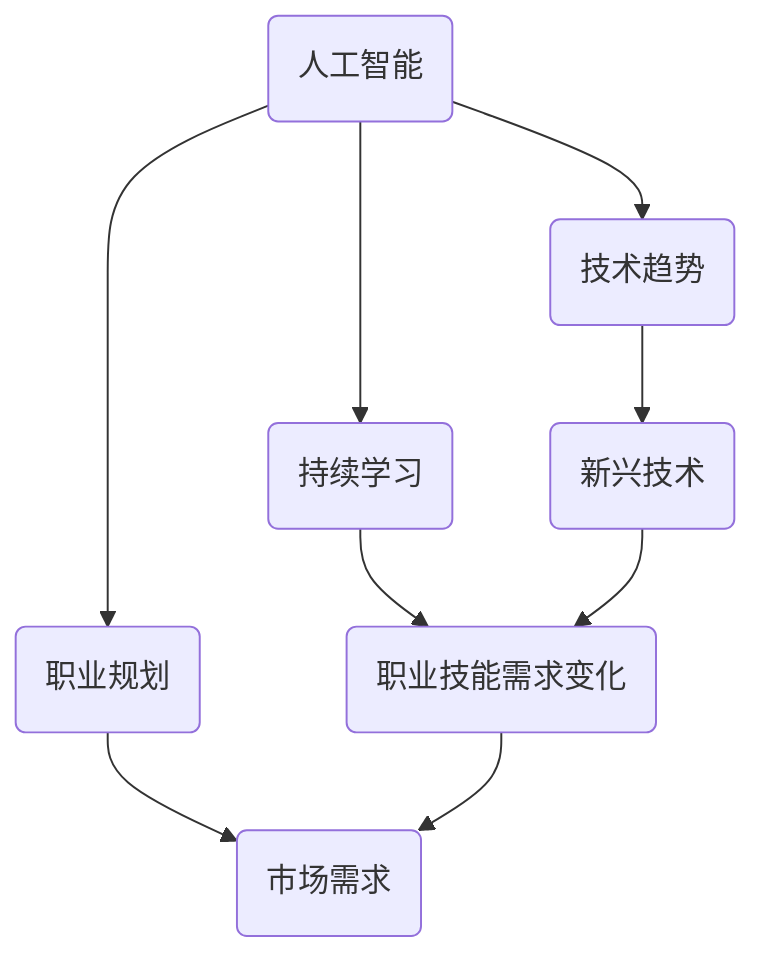

                 

关键词：VUCA时代、学习策略、人工智能、技术发展、持续学习、职业规划

> 摘要：在VUCA（易变性、不确定性、复杂性和模糊性）时代，如何应对快速变化的技术环境，成为每个IT从业者需要思考的问题。本文从人工智能、技术发展、持续学习和职业规划四个方面，探讨如何制定有效学习策略，以适应VUCA时代的挑战。

## 1. 背景介绍

VUCA，这一概念起源于军事领域，后来逐渐被商业和IT领域广泛接受。VUCA代表易变性（Volatility）、不确定性（Uncertainty）、复杂度（Complexity）和模糊性（Ambiguity）。在VUCA时代，技术发展速度迅猛，人工智能、大数据、区块链等新兴技术层出不穷，给传统行业带来了巨大的冲击。在这种环境下，如何学习和适应技术变化，成为每个IT从业者需要面对的挑战。

### 1.1 技术发展的速度

随着摩尔定律的持续发展，计算机的处理能力不断提升，这促使了人工智能、大数据等技术的快速发展。例如，深度学习技术在近年来取得了显著的突破，使得人工智能在图像识别、自然语言处理等领域取得了重要成果。

### 1.2 新兴技术的涌现

区块链技术作为一种去中心化的分布式数据库技术，正逐渐改变着金融、供应链管理等多个领域的运作方式。大数据技术的发展，使得企业可以更好地理解和分析用户需求，从而提高业务效率。

### 1.3 职业技能的需求变化

在VUCA时代，职业技能的需求也在不断变化。传统的编程语言、框架和工具可能会迅速被新技术取代，因此，IT从业者需要具备快速学习新技术的能力，以适应市场需求。

## 2. 核心概念与联系

在VUCA时代，我们需要掌握一些核心概念，以便更好地理解和应对技术变化。

### 2.1 人工智能

人工智能（Artificial Intelligence，简称AI）是计算机科学的一个分支，旨在使计算机具备人类的智能。人工智能包括机器学习、深度学习、自然语言处理等多个领域。

### 2.2 技术趋势

技术趋势是指某一时期内，技术领域的发展方向和热点。了解技术趋势有助于我们把握行业动态，及时调整学习计划。

### 2.3 持续学习

持续学习是指个人在不断变化的环境中，通过学习新知识、技能和经验，提升自身能力和竞争力。在VUCA时代，持续学习尤为重要。

### 2.4 职业规划

职业规划是指个人在职业生涯中，根据自身兴趣、能力和市场需求，制定的发展目标和行动计划。

### 2.5 Mermaid流程图

下面是一个简单的Mermaid流程图，展示了这些核心概念之间的联系。



## 3. 核心算法原理 & 具体操作步骤

在VUCA时代，掌握一些核心算法原理和具体操作步骤，有助于我们更好地应对技术挑战。

### 3.1 算法原理概述

以深度学习算法为例，其原理是通过构建神经网络模型，对大量数据进行训练，使模型具备对未知数据的预测能力。

### 3.2 算法步骤详解

1. 数据收集与预处理：收集大量具有代表性的数据，并对数据进行清洗、归一化等预处理操作。
2. 网络架构设计：根据任务需求，设计合适的神经网络架构。
3. 模型训练：使用预处理后的数据对神经网络模型进行训练。
4. 模型评估：使用测试集评估模型性能，并进行调优。

### 3.3 算法优缺点

优点：深度学习算法在图像识别、自然语言处理等领域取得了显著成果，具有较高的准确率和泛化能力。

缺点：训练过程需要大量数据和计算资源，且对参数选择和调优要求较高。

### 3.4 算法应用领域

深度学习算法广泛应用于计算机视觉、自然语言处理、语音识别等领域，如人脸识别、机器翻译、语音助手等。

## 4. 数学模型和公式 & 详细讲解 & 举例说明

在深度学习算法中，一些数学模型和公式起着关键作用。以下是一个简单的例子：

### 4.1 数学模型构建

假设我们有一个输入向量X和输出向量Y，以及一个权重矩阵W。则，神经网络的输出可以表示为：

$$
Y = \sigma(WX + b)
$$

其中，$\sigma$表示激活函数，$b$为偏置项。

### 4.2 公式推导过程

以全连接神经网络为例，假设输入层有m个神经元，隐藏层有n个神经元，输出层有p个神经元。则，隐藏层的输出可以表示为：

$$
z_j = \sum_{i=1}^{m} w_{ij}x_i + b_j \quad (j=1,2,...,n)
$$

输出层的输出可以表示为：

$$
y_k = \sum_{j=1}^{n} w_{kj}z_j + b_k \quad (k=1,2,...,p)
$$

### 4.3 案例分析与讲解

以一个简单的二分类问题为例，假设输入数据为X = [x1, x2]，输出为Y = [y1, y2]。我们希望预测y1和y2中哪一个更大。

1. 数据预处理：对输入数据进行归一化处理。
2. 网络架构设计：设计一个包含一个隐藏层的全连接神经网络，隐藏层有2个神经元。
3. 模型训练：使用训练数据对模型进行训练。
4. 模型评估：使用测试数据评估模型性能。

## 5. 项目实践：代码实例和详细解释说明

以下是一个简单的Python代码实例，实现了一个基于深度学习算法的二分类问题。

### 5.1 开发环境搭建

1. 安装Python（版本3.6以上）
2. 安装TensorFlow库

### 5.2 源代码详细实现

```python
import tensorflow as tf
from sklearn.model_selection import train_test_split
from sklearn.preprocessing import StandardScaler
import numpy as np

# 数据预处理
X = np.array([[1, 2], [2, 3], [3, 4], [4, 5], [5, 6]])
y = np.array([0, 0, 1, 1, 1])
X_train, X_test, y_train, y_test = train_test_split(X, y, test_size=0.2, random_state=42)
scaler = StandardScaler()
X_train = scaler.fit_transform(X_train)
X_test = scaler.transform(X_test)

# 网络架构设计
model = tf.keras.Sequential([
    tf.keras.layers.Dense(2, activation='sigmoid', input_shape=(2,))
])

# 模型训练
model.compile(optimizer='adam', loss='binary_crossentropy', metrics=['accuracy'])
model.fit(X_train, y_train, epochs=100, batch_size=2)

# 模型评估
model.evaluate(X_test, y_test)
```

### 5.3 代码解读与分析

1. 数据预处理：使用StandardScaler对输入数据进行归一化处理。
2. 网络架构设计：设计一个包含一个隐藏层的全连接神经网络，隐藏层有2个神经元，使用sigmoid激活函数。
3. 模型训练：使用adam优化器，binary_crossentropy损失函数，训练100个epoch。
4. 模型评估：使用测试数据评估模型性能。

## 6. 实际应用场景

在VUCA时代，深度学习算法在多个领域得到了广泛应用。以下是一些实际应用场景：

1. 计算机视觉：人脸识别、图像分类、目标检测等。
2. 自然语言处理：机器翻译、文本分类、情感分析等。
3. 语音识别：语音识别、语音合成等。
4. 推荐系统：个性化推荐、商品推荐等。

## 7. 未来应用展望

随着技术的不断发展，深度学习算法将在更多领域得到应用。以下是一些未来应用展望：

1. 自动驾驶：深度学习算法在自动驾驶领域具有巨大潜力，有望实现无人驾驶。
2. 健康医疗：深度学习算法在医学影像分析、疾病预测等方面具有广泛的应用前景。
3. 金融科技：深度学习算法在风险管理、信用评估、量化交易等领域具有重要应用价值。

## 8. 总结：未来发展趋势与挑战

在VUCA时代，技术发展速度迅猛，人工智能等新兴技术逐渐成为主流。未来，我们将面临以下发展趋势和挑战：

1. 发展趋势：人工智能技术将持续发展，深度学习算法将在更多领域得到应用。
2. 挑战：数据隐私、算法公平性、人工智能伦理等问题亟待解决。

## 9. 附录：常见问题与解答

### 9.1 如何快速学习新技术？

1. 关注技术趋势：通过阅读技术博客、参加技术会议等方式，了解最新的技术动态。
2. 实践项目：通过实际项目，将理论知识应用到实践中，提高实战能力。
3. 持续学习：保持好奇心和求知欲，持续学习新知识。

### 9.2 如何应对职业技能需求变化？

1. 定期评估自身技能：了解市场需求，评估自身技能，制定学习计划。
2. 主动学习：参加线上课程、培训班等，提高自身技能。
3. 建立个人品牌：通过博客、GitHub等平台，展示自己的技术实力。

## 作者署名

作者：禅与计算机程序设计艺术 / Zen and the Art of Computer Programming
----------------------------------------------------------------

以上是根据您的要求撰写的完整文章。如果您有任何修改意见或者需要进一步的内容补充，请随时告知。

