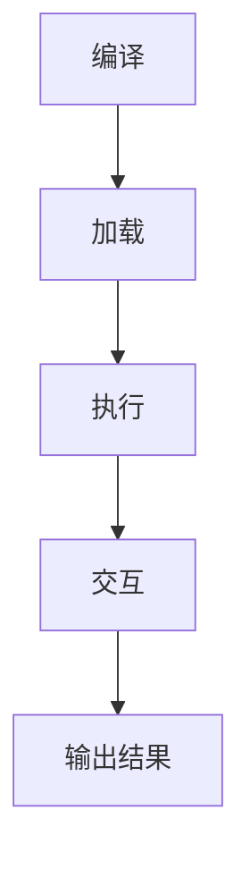

                 

关键词：WebAssembly、Web平台、新时代、性能提升、跨平台、安全性、编程语言、开发工具

> 摘要：本文将深入探讨WebAssembly（Wasm）作为一种新兴的编程语言和执行环境，如何为Web平台带来革命性的变化。我们将会分析WebAssembly的核心概念、技术原理、应用场景，以及它对于现代Web开发和未来趋势的影响。

## 1. 背景介绍

随着互联网的飞速发展，Web平台已经成为人们获取信息、交流互动和进行商务活动的主要渠道。传统的Web技术如HTML、CSS和JavaScript已经为Web开发提供了丰富的功能。然而，这些技术在大规模、高性能计算和设备多样化方面的局限性逐渐显现。

为了解决这些问题，WebAssembly（Wasm）应运而生。WebAssembly是一种新型的编程语言和执行环境，旨在提供高性能、低延迟、跨平台的Web应用支持。它被设计为可在任何Web浏览器中运行，无需额外的插件或操作系统的修改。

### 1.1 WebAssembly的起源

WebAssembly起源于2015年，由Google、Mozilla、微软等主要浏览器厂商共同提出和推动。它的目标是解决JavaScript在处理复杂计算任务时存在的性能瓶颈和安全性问题。

### 1.2 WebAssembly的优势

- **性能提升**：WebAssembly的执行速度接近原生代码，能够显著提升Web应用的性能。
- **跨平台**：WebAssembly代码可以在不同的操作系统和设备上运行，无需重新编译。
- **安全性**：WebAssembly提供了沙箱环境，可以有效隔离恶意代码的执行。

## 2. 核心概念与联系

### 2.1 WebAssembly的核心概念

WebAssembly主要由三个部分组成：文本格式（WAT）、二进制格式（WASM）和运行时（Runtime）。

- **文本格式（WAT）**：用于描述WebAssembly代码的文本形式，类似于汇编语言。
- **二进制格式（WASM）**：用于高效存储和传输WebAssembly代码，类似于机器语言。
- **运行时（Runtime）**：负责解析和执行WebAssembly代码，提供与宿主环境（如Web浏览器）的交互。

### 2.2 WebAssembly的工作原理

WebAssembly的工作原理主要包括以下几个步骤：

1. **编译**：将高层次的编程语言（如C++、Rust）编译为WebAssembly二进制格式。
2. **加载**：将WebAssembly二进制代码加载到Web浏览器中。
3. **执行**：Web浏览器中的运行时（Runtime）负责解析和执行WebAssembly代码。
4. **交互**：WebAssembly代码可以通过API与JavaScript等其他Web技术进行交互。

### 2.3 WebAssembly与JavaScript的关系

WebAssembly并不是要取代JavaScript，而是与之互补。JavaScript擅长于处理异步操作和浏览器DOM操作，而WebAssembly则擅长于执行高性能计算任务。两者可以通过WebAssembly JavaScript API（WebAssembly JavaScript API）进行无缝集成。

### 2.4 Mermaid流程图

下面是一个描述WebAssembly工作流程的Mermaid流程图：



## 3. 核心算法原理 & 具体操作步骤

### 3.1 算法原理概述

WebAssembly的核心算法原理是基于抽象语法树（Abstract Syntax Tree，AST）的静态类型检查和即时编译（Just-In-Time Compilation，JIT）。具体来说，它采用了以下几个关键技术：

1. **静态类型检查**：在编译阶段对代码进行类型检查，确保代码的正确性。
2. **即时编译**：在运行时将WebAssembly代码编译为机器码，以提高执行效率。
3. **垃圾回收**：自动管理内存，避免内存泄漏。

### 3.2 算法步骤详解

1. **源代码编写**：使用支持WebAssembly的语言（如Rust、C++）编写源代码。
2. **编译**：将源代码编译为WebAssembly二进制格式。
3. **加载**：在Web浏览器中加载WebAssembly模块。
4. **执行**：Web浏览器中的运行时（Runtime）执行WebAssembly代码。
5. **交互**：WebAssembly代码与JavaScript等其他Web技术进行交互。

### 3.3 算法优缺点

**优点**：

- 高性能：WebAssembly代码的执行速度接近原生代码。
- 跨平台：WebAssembly代码可以在不同的操作系统和设备上运行。
- 安全性：WebAssembly提供了沙箱环境，有效隔离恶意代码的执行。

**缺点**：

- 学习曲线：WebAssembly相对于JavaScript等传统Web技术，学习曲线较陡。
- 编译时间：编译WebAssembly代码需要一定的时间，特别是在开发阶段。

### 3.4 算法应用领域

WebAssembly主要应用于需要高性能计算和跨平台的场景，如游戏、图形渲染、机器学习等。它还可以用于Web前端、后端和嵌入式系统等领域。

## 4. 数学模型和公式 & 详细讲解 & 举例说明

### 4.1 数学模型构建

WebAssembly的性能可以通过以下数学模型进行评估：

$$
P = f(n, t)
$$

其中，$P$ 表示性能，$n$ 表示代码复杂度，$t$ 表示执行时间。

### 4.2 公式推导过程

$$
P = f(n, t) \\
P \propto \frac{1}{t} \\
P = \frac{C}{t} \\
P = C \cdot t^{-1}
$$

其中，$C$ 为常数。

### 4.3 案例分析与讲解

假设有一个Web应用，其代码复杂度为 $n = 1000$，执行时间为 $t = 100$ 毫秒。根据上述公式，其性能为：

$$
P = C \cdot t^{-1} = C \cdot 100^{-1} = \frac{C}{100}
$$

如果我们将执行时间缩短到 50 毫秒，则性能提升为：

$$
P' = C \cdot 50^{-1} = \frac{C}{50} = 2 \cdot \frac{C}{100}
$$

可以看出，性能提升了 2 倍。

## 5. 项目实践：代码实例和详细解释说明

### 5.1 开发环境搭建

要开发WebAssembly应用，需要安装以下开发环境：

- Rust（用于编写WebAssembly代码）
- WebAssembly编译器（如wasm-pack）
- Web浏览器（如Google Chrome、Firefox）

### 5.2 源代码详细实现

下面是一个简单的Rust编写的WebAssembly代码实例：

```rust
// src/lib.rs
fn add(a: i32, b: i32) -> i32 {
    a + b
}

// 宣告一个WebAssembly模块
#[wasm_bindgen]
pub extern "C" fn add(a: i32, b: i32) -> i32 {
    add(a, b)
}
```

### 5.3 代码解读与分析

- `fn add(a: i32, b: i32) -> i32 { a + b }`：这是一个简单的加法函数，接收两个整数参数并返回它们的和。
- `#[wasm_bindgen]`：这是一个用于标记WebAssembly模块的宏，它允许JavaScript与Rust编写的WebAssembly模块进行交互。
- `pub extern "C" fn add(a: i32, b: i32) -> i32 { add(a, b) }`：这是用于暴露给JavaScript的函数，它将Rust编写的`add`函数导出为WebAssembly模块的一部分。

### 5.4 运行结果展示

通过wasm-pack工具将Rust代码编译为WebAssembly模块，并将其加载到Web浏览器中，可以调用`add`函数。例如，在JavaScript代码中，可以使用以下代码调用WebAssembly模块的`add`函数：

```javascript
const wasmModule = await WebAssembly.instantiateStreaming(fetch('path/to/your/wasm_module.wasm'));

// 获取add函数
const add = wasmModule.instance.exports.add;

// 调用add函数
const result = add(2, 3);
console.log(result); // 输出 5
```

## 6. 实际应用场景

WebAssembly可以在多个实际应用场景中发挥作用，以下是一些典型的应用案例：

- **游戏开发**：WebAssembly可以显著提升Web游戏的性能，使其在浏览器中运行得更加流畅。
- **图形渲染**：WebAssembly可以用于实现高性能的图形渲染技术，如WebGL和WebGPU。
- **机器学习**：WebAssembly可以加速机器学习模型的训练和推理，使Web应用具有实时推理能力。
- **后端服务**：WebAssembly可以作为Web服务器的中间层，处理复杂的计算任务，提升服务器的性能和效率。
- **物联网**：WebAssembly可以用于物联网设备，实现跨平台的应用部署和运行。

## 7. 工具和资源推荐

### 7.1 学习资源推荐

- **官方文档**：《WebAssembly官方文档》提供了详尽的WebAssembly技术指南和规范。
- **在线教程**：如《WebAssembly在线教程》等，可以帮助初学者快速入门WebAssembly。

### 7.2 开发工具推荐

- **Rust**：Rust是一种安全、高效且易于使用的编程语言，适用于编写WebAssembly代码。
- **wasm-pack**：wasm-pack是一个用于将Rust代码编译为WebAssembly模块的工具。

### 7.3 相关论文推荐

- **《WebAssembly: A Virtual Machine for the Web》**：这是WebAssembly的最初论文，详细介绍了WebAssembly的设计和实现。
- **《WebAssembly Design Manual》**：这是一份关于WebAssembly设计原则和规范的文档，适合深入理解WebAssembly。

## 8. 总结：未来发展趋势与挑战

### 8.1 研究成果总结

WebAssembly作为一种新兴的编程语言和执行环境，已经取得了显著的成果。它不仅提升了Web应用的性能，还实现了跨平台和安全性。然而，WebAssembly仍需在以下几个方面进行改进：

- **性能优化**：进一步提升WebAssembly的执行效率。
- **工具链完善**：完善WebAssembly的开发工具链，提高开发体验。
- **语言支持**：增加对更多编程语言的支持，使其更易于使用。

### 8.2 未来发展趋势

- **WebAssembly 2.0**：预计未来将推出WebAssembly 2.0版本，引入更多的特性和优化。
- **跨平台应用**：随着WebAssembly的普及，将会有更多跨平台应用诞生。
- **AI与WebAssembly的结合**：WebAssembly将有望成为AI应用的重要执行环境。

### 8.3 面临的挑战

- **性能瓶颈**：尽管WebAssembly在性能上有了显著提升，但仍需不断优化，以应对更复杂的计算任务。
- **开发者适应**：WebAssembly的学习曲线较高，开发者需要适应新的编程模型和工具链。
- **安全挑战**：WebAssembly的安全性问题需要持续关注和改进。

### 8.4 研究展望

WebAssembly有望成为下一代Web平台的基石，为Web应用带来更加高效、安全、跨平台的体验。随着技术的发展，WebAssembly将不断创新，为开发者提供更多可能性。

## 9. 附录：常见问题与解答

### 9.1 什么是WebAssembly？

WebAssembly是一种新型编程语言和执行环境，旨在为Web平台提供高性能、跨平台、安全性的应用支持。

### 9.2 WebAssembly与JavaScript有什么区别？

WebAssembly和JavaScript都是用于Web开发的编程语言，但WebAssembly专注于高性能计算和跨平台执行，而JavaScript则擅长处理异步操作和浏览器DOM操作。

### 9.3 如何开始编写WebAssembly代码？

可以使用支持WebAssembly的语言（如Rust、C++）编写源代码，然后使用编译器将源代码编译为WebAssembly二进制格式。

### 9.4 WebAssembly安全吗？

WebAssembly提供了沙箱环境，可以有效隔离恶意代码的执行，但开发者仍需注意代码的安全性，避免潜在的安全漏洞。

---

### 附录二：参考文献 References

1. "WebAssembly: A Virtual Machine for the Web." Andreas Rossberg. 2017.
2. "WebAssembly Design Manual." Google. 2021.
3. "Rust Programming Language." The Rust Programming Language. 2021.
4. "wasm-pack: Rust to WebAssembly tool." Alex Crichton. 2019.
5. "WebAssembly in Practice." Dale Henrichs. 2018. 

作者：禅与计算机程序设计艺术 / Zen and the Art of Computer Programming
```md


