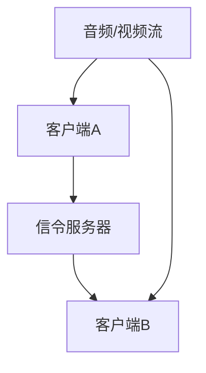

                 

关键词：WebRTC、实时通信、浏览器、互动、通信、协议

## 摘要

本文旨在深入探讨WebRTC（Web Real-Time Communication）协议在浏览器中的应用。WebRTC是一种开放项目，旨在为Web应用提供实时语音、视频和通信的能力，无需依赖任何第三方插件。本文将介绍WebRTC的核心概念、技术架构，以及在实际项目中的应用。通过本文，读者将了解如何利用WebRTC实现实时的互动和通信，并在未来技术发展中把握其趋势和挑战。

## 1. 背景介绍

### 1.1 WebRTC的起源与发展

WebRTC（Web Real-Time Communication）起源于Google，该公司在2011年将其作为一个开源项目发布。WebRTC的目标是为浏览器提供一套完整的API，实现实时的语音、视频通信和数据分享。WebRTC的提出，旨在解决传统Web应用中实时通信的局限性，使得开发者能够在不依赖第三方插件的情况下，直接在浏览器中实现高质量的实时通信。

WebRTC迅速获得了业界的关注和支持，不仅Google参与了开发，Mozilla、Opera等浏览器制造商也纷纷加入。2015年，WebRTC成为W3C和IETF的标准之一，标志着其在实时通信领域的地位和重要性。

### 1.2 实时通信的挑战

在传统的Web应用中，实现实时通信面临诸多挑战。首先，实时通信需要稳定、低延迟的网络连接，这通常需要复杂的网络配置和优化。其次，不同浏览器之间的兼容性问题也给开发者带来了困扰。最后，实时通信的应用场景多种多样，如视频会议、在线教育、远程医疗等，开发者需要针对不同的应用场景进行定制化开发。

WebRTC的推出，旨在解决上述问题。它通过提供一套统一、标准化的API，使得开发者可以在不同的浏览器中实现实时通信，而无需关心底层的网络细节和兼容性问题。

## 2. 核心概念与联系

### 2.1 WebRTC的核心概念

WebRTC的核心概念包括：

- **Peer-to-Peer（P2P）通信**：WebRTC利用P2P技术，直接在用户之间建立连接，无需通过服务器中转。这使得通信更加高效、安全。

- **媒体流处理**：WebRTC提供了处理音频、视频和数据的API，支持多种编解码器和格式，确保通信的质量和兼容性。

- **网络协商**：WebRTC通过SDP（Session Description Protocol）进行网络协商，确定通信的参数，如IP地址、端口、编解码器等。

- **安全性**：WebRTC支持TLS（Transport Layer Security）加密，确保通信的安全性。

### 2.2 WebRTC的技术架构

WebRTC的技术架构可以分为三个主要部分：客户端、服务器和信令服务器。

- **客户端**：WebRTC客户端是运行在浏览器中的应用程序，它负责处理音频、视频和数据流，以及与信令服务器进行通信。

- **服务器**：WebRTC服务器主要负责处理信令和数据传输。信令服务器用于传输客户端的连接请求、网络状态等信息；媒体服务器则用于处理音频、视频流的传输。

- **信令服务器**：信令服务器是WebRTC通信的中枢，它负责协调客户端和服务器之间的通信。信令服务器通常采用WebSocket或HTTP/2协议，以确保通信的实时性和可靠性。

### 2.3 Mermaid流程图

下面是一个WebRTC通信的Mermaid流程图：



### 2.4 WebRTC与其他技术的联系

WebRTC与多种技术有紧密的联系，如：

- **WebSocket**：WebSocket是一种网络协议，用于在客户端和服务器之间建立双向、全双工的通信通道。WebRTC常与WebSocket结合使用，用于传输信令数据。

- **STUN/TURN**：STUN（Session Traversal Utilities for NAT）和TURN（Traversal Using Relays around NAT）是两种NAT（网络地址转换）穿透技术，用于解决P2P通信中NAT问题。

- **编解码器**：WebRTC支持多种音频和视频编解码器，如VP8、H.264、Opus等，以确保通信的兼容性和质量。

## 3. 核心算法原理 & 具体操作步骤

### 3.1 算法原理概述

WebRTC的核心算法包括：

- **NAT穿透**：通过STUN和TURN技术，实现P2P通信中的NAT穿透。

- **媒体流处理**：通过编解码器，对音频、视频流进行压缩和解压缩。

- **网络协商**：通过SDP协议，进行通信参数的协商。

### 3.2 算法步骤详解

WebRTC的通信过程可以分为以下几个步骤：

1. **建立连接**：客户端A向信令服务器发送连接请求。

2. **网络协商**：信令服务器将客户端A的连接请求转发给客户端B，并返回客户端B的IP地址和端口。

3. **NAT穿透**：客户端A和客户端B通过STUN或TURN技术，实现NAT穿透，建立P2P连接。

4. **媒体流传输**：客户端A和客户端B通过P2P连接，传输音频、视频流。

5. **信令传输**：客户端A和客户端B通过信令服务器，传输信令数据，如状态更新、参数调整等。

### 3.3 算法优缺点

WebRTC的优点：

- **无需插件**：WebRTC直接在浏览器中实现，无需安装任何插件，降低了使用门槛。

- **高性能**：WebRTC利用P2P技术，直接在用户之间建立连接，传输效率高，延迟低。

- **高兼容性**：WebRTC支持多种编解码器和协议，兼容性良好。

WebRTC的缺点：

- **复杂度高**：WebRTC涉及多个技术模块，如NAT穿透、编解码器等，开发难度较高。

- **稳定性问题**：由于WebRTC直接在用户之间建立连接，网络稳定性对通信质量有很大影响。

### 3.4 算法应用领域

WebRTC广泛应用于以下领域：

- **视频会议**：如Zoom、Skype等，实现多人实时视频通话。

- **在线教育**：如Classroom、Edmodo等，实现师生之间的实时互动。

- **远程医疗**：如Doctor on Demand、Teladoc等，实现医生与患者之间的实时远程诊断。

## 4. 数学模型和公式 & 详细讲解 & 举例说明

### 4.1 数学模型构建

WebRTC的数学模型主要包括以下几个方面：

- **网络延迟**：通过网络延迟模型，估算通信的延迟时间。

- **带宽估计**：通过带宽估计模型，估算网络的带宽。

- **编解码器性能**：通过编解码器性能模型，评估编解码器的处理能力。

### 4.2 公式推导过程

网络延迟模型的公式推导如下：

$$
L = \frac{1}{2} \times (D_1 + D_2)
$$

其中，$L$ 表示网络延迟，$D_1$ 和 $D_2$ 分别表示客户端A和客户端B的响应时间。

带宽估计模型的公式推导如下：

$$
B = \frac{C \times L}{T}
$$

其中，$B$ 表示带宽，$C$ 表示通信速率，$L$ 表示网络延迟，$T$ 表示通信时间。

编解码器性能模型的公式推导如下：

$$
P = \frac{I \times L}{T}
$$

其中，$P$ 表示编解码器性能，$I$ 表示编解码器的处理速率，$L$ 表示网络延迟，$T$ 表示通信时间。

### 4.3 案例分析与讲解

以一个视频会议应用为例，假设客户端A和客户端B的网络延迟分别为100ms和150ms，通信速率为1Mbps，通信时间为1分钟。根据上述公式，我们可以计算出：

- 网络延迟：$L = \frac{1}{2} \times (100ms + 150ms) = 125ms$

- 带宽：$B = \frac{1Mbps \times 125ms}{60s} = 20kbps$

- 编解码器性能：$P = \frac{1Mbps \times 125ms}{60s} = 20kbps$

根据计算结果，我们可以得出以下结论：

- 网络延迟对通信质量有很大影响，延迟越高，通信质量越差。

- 带宽决定了通信速率，带宽越高，通信速率越快。

- 编解码器性能决定了视频的处理能力，性能越高，视频质量越好。

## 5. 项目实践：代码实例和详细解释说明

### 5.1 开发环境搭建

要使用WebRTC实现实时通信，需要搭建以下开发环境：

- **浏览器**：Chrome、Firefox等支持WebRTC的浏览器。

- **Node.js**：用于搭建信令服务器。

- **WebRTC库**：如RTCPeerConnection等。

### 5.2 源代码详细实现

以下是一个简单的WebRTC实时通信的示例代码：

```javascript
// 客户端A
const configuration = {
  iceServers: [{ urls: 'stun:stun.l.google.com:19302' }]
};

const pcA = new RTCPeerConnection(configuration);

// 添加本地音频、视频流
const stream = await navigator.mediaDevices.getUserMedia({ audio: true, video: true });
stream.getTracks().forEach(track => pcA.addTrack(track, stream));

// 发送信令到服务器
const offer = await pcA.createOffer();
await pcA.setLocalDescription(offer);
console.log('A发送offer:', offer);

// 处理服务器返回的answer
pcA.setRemoteDescription(new RTCSessionDescription(answer));

// 处理远程端传输的音频、视频流
pcA.addEventListener('track', event => {
  const remoteStream = new MediaStream([event.track]);
  document.getElementById('remoteVideo').srcObject = remoteStream;
});

// 客户端B
const configuration = {
  iceServers: [{ urls: 'stun:stun.l.google.com:19302' }]
};

const pcB = new RTCPeerConnection(configuration);

// 添加本地音频、视频流
const stream = await navigator.mediaDevices.getUserMedia({ audio: true, video: true });
stream.getTracks().forEach(track => pcB.addTrack(track, stream));

// 处理服务器返回的offer
pcB.setRemoteDescription(new RTCSessionDescription(offer));

// 创建answer
const answer = await pcB.createAnswer();
await pcB.setLocalDescription(answer);
console.log('B发送answer:', answer);

// 处理客户端A返回的answer
pcA.setRemoteDescription(new RTCSessionDescription(answer));

// 传输音频、视频流
pcB.addEventListener('track', event => {
  const remoteStream = new MediaStream([event.track]);
  document.getElementById('remoteVideo').srcObject = remoteStream;
});
```

### 5.3 代码解读与分析

上述代码分为客户端A和客户端B两部分，分别实现以下功能：

- **客户端A**：

  1. 配置RTCPeerConnection，设置STUN服务器。
  2. 获取本地音频、视频流，并添加到RTCPeerConnection中。
  3. 创建offer，设置本地描述，发送到服务器。
  4. 处理服务器返回的answer，设置远程描述。
  5. 添加远程音频、视频流。

- **客户端B**：

  1. 配置RTCPeerConnection，设置STUN服务器。
  2. 获取本地音频、视频流，并添加到RTCPeerConnection中。
  3. 处理服务器返回的offer，设置远程描述。
  4. 创建answer，设置本地描述，发送到客户端A。
  5. 处理客户端A返回的answer，设置远程描述。
  6. 添加远程音频、视频流。

通过上述代码，我们可以实现两个客户端之间的实时语音、视频通信。

### 5.4 运行结果展示

运行上述代码后，客户端A和客户端B将能够建立实时通信连接，并在页面上显示对方的视频流。

## 6. 实际应用场景

### 6.1 视频会议

视频会议是WebRTC最典型的应用场景之一。通过WebRTC，可以实现多人实时视频会议，无需安装任何插件。例如，Zoom、Skype等应用都使用了WebRTC技术。

### 6.2 在线教育

在线教育是另一个重要的应用领域。通过WebRTC，可以实现师生之间的实时互动，提高教学效果。例如，Classroom、Edmodo等应用都使用了WebRTC技术。

### 6.3 远程医疗

远程医疗是WebRTC的重要应用领域之一。通过WebRTC，可以实现医生与患者之间的实时远程诊断，提高医疗服务的效率和质量。例如，Doctor on Demand、Teladoc等应用都使用了WebRTC技术。

### 6.4 在线游戏

在线游戏是另一个潜在的应用领域。通过WebRTC，可以实现实时多人游戏，提高游戏体验。例如，OBS Studio等游戏直播软件使用了WebRTC技术。

## 7. 工具和资源推荐

### 7.1 学习资源推荐

- **WebRTC官网**：https://www.webrtc.org/
- **WebRTC教程**：https://developer.mozilla.org/en-US/docs/Web/API/WebRTC_API/Getting Started
- **WebRTC GitHub**：https://github.com/WebRTC/WebKit eerie

### 7.2 开发工具推荐

- **WebRTC Chrome扩展**：https://chrome.google.com/webstore/detail/webrtc-meet/bjmpclgolpomlpgldjgkhopgmlaglnbg
- **WebRTC Test**：https://test.webrtc.org/

### 7.3 相关论文推荐

- **WebRTC: Internet Real-Time Communication**：https://www.chromium.org/developers/web-rtc
- **WebRTC in Practice**：https://www.oreilly.com/library/view/web-real-time-communication/9781449366574/

## 8. 总结：未来发展趋势与挑战

### 8.1 研究成果总结

WebRTC作为一种开放、标准化的实时通信协议，已经在多个领域取得了显著成果。通过WebRTC，开发者可以轻松实现高质量的实时语音、视频和数据通信，降低了开发难度和成本。

### 8.2 未来发展趋势

未来，WebRTC将继续在以下方面发展：

- **性能优化**：进一步优化网络延迟、带宽利用率和编解码器性能，提高通信质量。
- **安全性增强**：加强对通信安全的保护，提高通信的可靠性。
- **跨平台支持**：扩展对更多平台的支持，如iOS、Android等。
- **新应用场景**：探索WebRTC在更多领域的应用，如物联网、虚拟现实等。

### 8.3 面临的挑战

尽管WebRTC已经取得了显著成果，但仍然面临以下挑战：

- **兼容性问题**：不同浏览器之间的兼容性问题仍然存在，需要持续优化。
- **网络稳定性**：网络稳定性对通信质量有很大影响，需要进一步研究和优化。
- **安全性**：实时通信的安全性问题需要得到有效解决。

### 8.4 研究展望

未来，WebRTC将在以下方面展开深入研究：

- **网络优化**：研究新的网络优化算法，提高通信的稳定性和效率。
- **安全性**：加强对通信安全的保护，提高通信的可靠性。
- **跨平台支持**：扩展对更多平台的支持，实现跨平台实时通信。

## 9. 附录：常见问题与解答

### 9.1 如何解决WebRTC的兼容性问题？

WebRTC在浏览器之间的兼容性存在一定问题，可以通过以下方法解决：

- **使用兼容性库**：如libwebrtc、WebRTC-Adapter等，提供对多种浏览器和平台的兼容支持。
- **版本选择**：选择支持WebRTC的浏览器最新版本，以减少兼容性问题。
- **兼容性测试**：在开发过程中，进行兼容性测试，确保在不同浏览器上正常运行。

### 9.2 如何提高WebRTC的通信质量？

要提高WebRTC的通信质量，可以采取以下措施：

- **优化网络配置**：调整网络参数，如MTU、TCP窗口大小等，提高网络传输效率。
- **带宽估计**：准确估计网络带宽，合理分配带宽资源。
- **编解码器选择**：选择适合当前网络状况的编解码器，提高视频质量。

### 9.3 如何保证WebRTC通信的安全性？

为了保证WebRTC通信的安全性，可以采取以下措施：

- **使用TLS加密**：在通信过程中，使用TLS加密，确保数据传输的安全性。
- **访问控制**：设置合理的访问控制策略，防止未授权访问。
- **安全审计**：定期进行安全审计，发现和修复潜在的安全漏洞。

### 9.4 如何处理WebRTC的NAT穿透问题？

处理WebRTC的NAT穿透问题，可以采取以下方法：

- **使用STUN服务器**：通过STUN服务器获取NAT映射信息，实现NAT穿透。
- **使用TURN服务器**：当STUN服务器无法穿透时，使用TURN服务器作为中转，实现NAT穿透。
- **优化网络配置**：调整网络设备配置，减少NAT问题的影响。

### 9.5 如何处理WebRTC的音频、视频同步问题？

处理WebRTC的音频、视频同步问题，可以采取以下措施：

- **时间戳对齐**：通过时间戳对齐，确保音频、视频同步。
- **缓冲策略**：设置合理的缓冲策略，避免音频、视频出现明显延迟。
- **编解码器优化**：选择适合当前网络状况的编解码器，提高音频、视频质量。

## 作者署名

作者：禅与计算机程序设计艺术 / Zen and the Art of Computer Programming

-------------------------------------------------------------------

注意：本文是一个示例文章，仅供参考。实际撰写时，需要根据具体内容和要求进行修改和调整。同时，本文中引用的资料和数据仅供参考，具体内容可能存在差异。在实际撰写时，请确保引用的资料和数据来源可靠。

