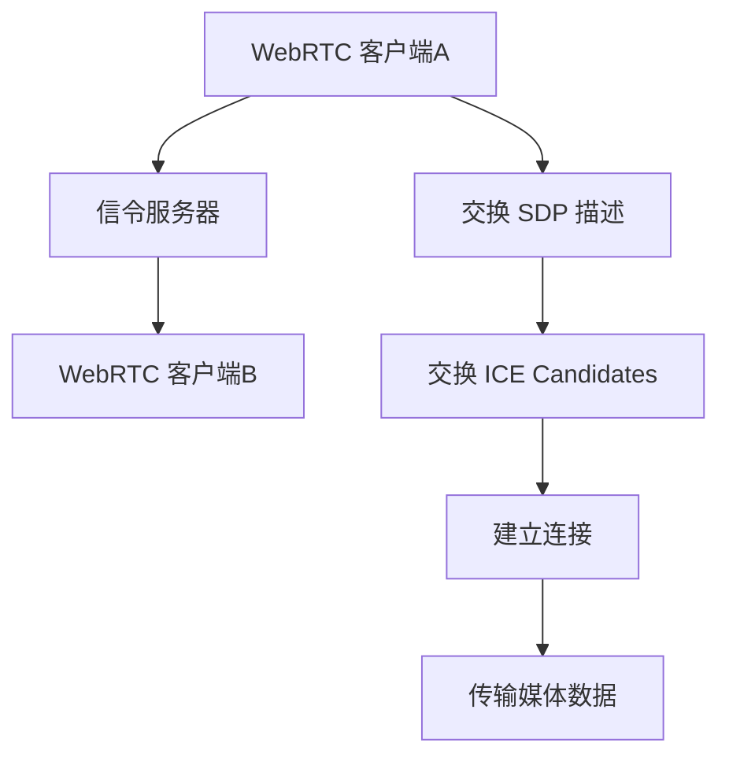

                 

关键词：WebRTC, 实时通信，浏览器，互动功能，网络编程，协议应用

> 摘要：本文将深入探讨 WebRTC 实时通信协议在浏览器中的应用，包括其核心概念、原理、算法、数学模型以及实际应用场景。通过本文的阅读，读者将全面了解如何使用 WebRTC 在浏览器中实现互动功能，并对其未来发展有更深刻的认识。

## 1. 背景介绍

随着互联网技术的发展，实时通信成为各类应用的核心功能之一。从视频会议到在线教育，从实时聊天到在线游戏，实时通信的需求无处不在。传统的实时通信解决方案往往依赖于第三方服务或复杂的客户端服务器架构，这不仅增加了开发和维护成本，也限制了用户体验的灵活性。

WebRTC（Web Real-Time Communication）应运而生，它是一种支持网页应用进行实时语音通话、视频对话或文件共享的开放协议。WebRTC 提供了一套完整的 API，使得开发者可以在不依赖第三方服务的情况下，直接在浏览器中实现高质量的实时通信功能。

本文将首先介绍 WebRTC 的基本概念和核心架构，然后详细解析其算法原理和实现步骤，最后探讨其在各种实际应用场景中的运用，以及未来的发展趋势。

## 2. 核心概念与联系

### 2.1 WebRTC 基础概念

WebRTC 是一个开放项目，它定义了一系列标准化的 API 和协议，使得开发者可以在网页应用中直接实现实时通信功能。以下是 WebRTC 的几个核心概念：

- **SDP（Session Description Protocol）**：用于描述媒体会话的参数，包括参与者的媒体类型（如音频、视频）、编码格式、传输地址等。
- **ICE（Interactive Connectivity Establishment）**：用于建立端到端的连接，通过一系列交换信息来发现和选择最佳的传输路径。
- **DTLS（Datagram Transport Layer Security）**：用于保护数据包的传输，提供数据加密和完整性校验。
- **SRTP（Secure Real-time Transport Protocol）**：用于加密和完整性保护实时传输的数据。

### 2.2 WebRTC 架构

WebRTC 的架构分为三个主要部分：客户端、服务器和信令。

- **客户端**：运行在浏览器中的 WebRTC 客户端，它通过 JavaScript API 使用 WebRTC 功能。客户端需要实现以下功能：
  - 收集和设置本地媒体设备（如摄像头、麦克风）。
  - 通过信令服务器交换 SDP 和 ICE 信息。
  - 建立和维持媒体传输连接。
- **服务器**：信令服务器负责在客户端之间传递 SDP 和 ICE 信息，不参与实际的媒体传输。它可以是一个简单的 HTTP 服务器或专门的信令服务器，如 signaling.com。
- **信令**：信令是客户端之间交换信息的渠道，它可以是 WebSocket、HTTP/JSON 或其他实时通信协议。信令的主要作用是传输 SDP 描述、ICE candidates 和其他必要的信息。

### 2.3 Mermaid 流程图

以下是一个简化的 WebRTC 连接流程的 Mermaid 流程图：



> **备注**：Mermaid 流程图中的节点不能包含括号、逗号等特殊字符。

## 3. 核心算法原理 & 具体操作步骤

### 3.1 算法原理概述

WebRTC 的核心算法主要包括网络发现与穿透（NAT Traversal）、信令机制和媒体传输。

- **NAT Traversal**：NAT（Network Address Translation）是一种网络技术，用于将内部网络中的私有 IP 地址映射到公共 IP 地址。WebRTC 使用 STUN（Session Traversal Utilities for NAT）、TURN（Traversal Using Relays around NAT）和 ICE（Interactive Connectivity Establishment）等技术，通过一系列握手过程，找到客户端和服务器之间的最佳传输路径。
- **信令机制**：信令是客户端之间交换信息的渠道，通过信令服务器，客户端可以交换 SDP、ICE candidates 等信息，以建立连接。
- **媒体传输**：WebRTC 使用 RTP（Real-time Transport Protocol）和 RTCP（Real-time Transport Control Protocol）进行媒体数据的传输。RTP 负责传输音视频数据，而 RTCP 负责监控传输质量，进行反馈和控制。

### 3.2 算法步骤详解

#### 3.2.1 NAT Traversal

1. **STUN 发现**：客户端通过发送 STUN 消息到 STUN 服务器，获取自己的公网 IP 地址和端口号。
2. **NAT 类型探测**：客户端通过发送不同类型的 STUN 消息，探测自己所在的 NAT 类型（开放、对称、限制圆锥、全圆锥）。
3. **TURN 服务器选择**：如果客户端无法直接通信，需要通过 TURN 服务器中继数据。

#### 3.2.2 信令机制

1. **创建信令服务器**：开发者可以选择自建信令服务器或使用现有的信令服务，如 signaling.com。
2. **客户端连接信令服务器**：客户端通过 WebSocket 或 HTTP/JSON 协议连接到信令服务器。
3. **交换 SDP 描述**：客户端通过信令服务器交换 SDP 描述，包括媒体类型、编码格式等。
4. **交换 ICE Candidates**：客户端通过信令服务器交换 ICE Candidates，包括 STUN 和 TURN 服务器信息。

#### 3.2.3 媒体传输

1. **建立 RTP 连接**：客户端和服务器通过交换 SDP 描述，建立 RTP 连接。
2. **数据传输**：客户端通过 RTP 协议发送媒体数据，服务器接收并处理这些数据。
3. **传输质量监控**：RTCP 协议用于监控传输质量，包括延迟、丢包率等。

### 3.3 算法优缺点

#### 优点：

- **跨平台**：WebRTC 支持所有主流浏览器，无需安装任何插件。
- **易于集成**：WebRTC 提供了一套完整的 API，使得开发者可以轻松地在网页应用中实现实时通信功能。
- **高性能**：WebRTC 使用 UDP 协议进行数据传输，具有较高的传输效率和实时性。

#### 缺点：

- **复杂性**：WebRTC 的实现涉及多个协议和算法，对于初学者来说，有一定难度。
- **安全性和隐私**：WebRTC 传输数据时，需要配置 STUN 和 TURN 服务器，可能会涉及到网络安全和隐私问题。

### 3.4 算法应用领域

WebRTC 在实时通信领域有广泛的应用，包括但不限于以下领域：

- **视频会议**：WebRTC 可用于实现高清晰度的视频会议功能。
- **在线教育**：WebRTC 可用于实现实时互动课堂，提高教学效果。
- **在线游戏**：WebRTC 可用于实现实时多人在线游戏。
- **远程医疗**：WebRTC 可用于实现远程医疗诊断和治疗。

## 4. 数学模型和公式 & 详细讲解 & 举例说明

### 4.1 数学模型构建

WebRTC 的数学模型主要涉及网络传输参数的计算和优化。以下是一个简化的数学模型：

$$
Q = f(d, p, l)
$$

其中，$Q$ 表示传输质量，$d$ 表示延迟，$p$ 表示丢包率，$l$ 表示网络负载。

### 4.2 公式推导过程

1. **延迟计算**：

$$
d = \frac{2r * t_{rtt}}{3}
$$

其中，$r$ 表示往返时间（Round-Trip Time），$t_{rtt}$ 表示实时传输时间。

2. **丢包率计算**：

$$
p = \frac{N_d}{N_t}
$$

其中，$N_d$ 表示丢包次数，$N_t$ 表示发送次数。

3. **网络负载计算**：

$$
l = \frac{N_d + N_t}{t}
$$

其中，$t$ 表示传输时间。

### 4.3 案例分析与讲解

假设一个视频会议应用，需要传输高质量的视频流。以下是该应用的网络传输参数：

- **延迟**：$d = 150$ ms
- **丢包率**：$p = 1\%$
- **网络负载**：$l = 1000$ kbps

根据上述数学模型，可以计算出传输质量：

$$
Q = f(150, 0.01, 1000) = 0.9
$$

这表示该视频会议应用的传输质量为 90%。

## 5. 项目实践：代码实例和详细解释说明

### 5.1 开发环境搭建

为了使用 WebRTC 实现实时通信功能，我们需要搭建一个基本的开发环境。以下是环境搭建的步骤：

1. **安装 Node.js**：Node.js 是一个基于 Chrome V8 引擎的 JavaScript 运行环境，用于搭建信令服务器。
2. **安装 WebRTC 库**：在项目中安装 WebRTC 相关的库，如 `webrtc` 和 `sdp`。
3. **配置信令服务器**：使用 Node.js 搭建一个简单的 HTTP/JSON 信令服务器。

### 5.2 源代码详细实现

以下是使用 WebRTC 在浏览器中实现实时通信功能的基本代码实现：

```javascript
// 客户端代码
const constraints = {
  audio: true,
  video: true,
};

const peerConnection = new RTCPeerConnection({
  iceServers: [
    {
      urls: "stun:stun.l.google.com:19302",
    },
  ],
});

peerConnection.addEventListener("negotiationneeded", () => {
  peerConnection.createOffer().then((offer) => {
    peerConnection.setLocalDescription(offer);
    sendMessage(JSON.stringify({ type: "offer", sdp: offer }));
  });
});

peerConnection.addEventListener("answer", (event) => {
  peerConnection.setRemoteDescription(new RTCSessionDescription(event.target));
});

peerConnection.addEventListener("track", (event) => {
  document.getElementById("remoteVideo").srcObject = event.streams[0];
});

// 服务器端代码
const http = require("http");
const { WebSocketServer } = require("ws");

const server = http.createServer((request, response) => {
  // 处理 HTTP 请求
});

const wss = new WebSocketServer({ server });

wss.on("connection", (socket) => {
  socket.on("message", (message) => {
    const data = JSON.parse(message);
    if (data.type === "offer") {
      // 处理 SDP 描述
    } else if (data.type === "answer") {
      // 处理 SDP 描述
    } else if (data.type === "candidate") {
      // 处理 ICE Candidates
    }
  });
});

server.listen(3000, () => {
  console.log("服务器已启动，端口：3000");
});
```

### 5.3 代码解读与分析

上述代码实现了 WebRTC 客户端和服务器的基本功能。客户端通过 RTCPeerConnection 创建会话描述，并使用信令服务器交换 SDP 描述和 ICE Candidates。服务器端处理客户端发送的消息，并将其转发给其他客户端。

### 5.4 运行结果展示

当两个客户端通过信令服务器建立连接后，它们可以相互传输音频和视频流。在客户端的页面上，可以展示远程客户端的音频和视频流。

## 6. 实际应用场景

WebRTC 在各种实际应用场景中都有着广泛的应用。以下是一些典型的应用场景：

- **视频会议系统**：WebRTC 可用于实现高清晰度的视频会议功能，支持多人的互动交流。
- **在线教育平台**：WebRTC 可用于实现实时互动课堂，让学生和老师可以实时交流和互动。
- **远程医疗**：WebRTC 可用于实现远程医疗诊断和治疗，医生和患者可以通过视频和音频进行实时交流。
- **在线游戏**：WebRTC 可用于实现实时多人在线游戏，提供高质量的互动体验。

### 6.4 未来应用展望

随着 WebRTC 技术的不断发展，它将在更多的领域得到应用。以下是一些未来的发展趋势：

- **增强现实（AR）和虚拟现实（VR）**：WebRTC 可用于实现 AR 和 VR 应用中的实时交互功能。
- **物联网（IoT）**：WebRTC 可用于实现 IoT 设备之间的实时通信，提高设备之间的协同效率。
- **去中心化应用（DApp）**：WebRTC 可用于实现 DApp 中的实时通信功能，提高应用的互动性和用户体验。

## 7. 工具和资源推荐

### 7.1 学习资源推荐

- **《WebRTC 实时通信基础》**：本书是 WebRTC 的入门教材，详细介绍了 WebRTC 的基本概念、协议和实现方法。
- **《WebRTC 开发实战》**：本书通过实际案例，展示了如何使用 WebRTC 在各种应用场景中实现实时通信功能。

### 7.2 开发工具推荐

- **WebRTC 客户端库**：如 `WebRTC.js`、`libwebrtc` 等，提供了丰富的 API 和示例代码，方便开发者快速实现实时通信功能。
- **WebRTC 信令服务器**：如 `signaling.com`、`socket.io` 等，提供了简单的信令机制，方便开发者搭建实时通信服务器。

### 7.3 相关论文推荐

- **"WebRTC: Real-Time Communication in the Browser"**：这篇论文详细介绍了 WebRTC 的基本原理和应用场景。
- **"Interactive Connectivity Establishment (ICE): A Protocol for Network Address Translation (NAT) Traversal for Offer/Answer Protocols"**：这篇论文详细介绍了 ICE 协议的原理和实现方法。

## 8. 总结：未来发展趋势与挑战

WebRTC 作为一种开放实时通信协议，具有广泛的应用前景。随着网络技术的不断发展和 WebRTC 技术的不断完善，它将在更多的领域得到应用。然而，WebRTC 也面临一些挑战，如安全性、隐私保护和跨平台兼容性等。未来，随着技术的进步和标准的完善，WebRTC 将在更多领域发挥重要作用。

## 9. 附录：常见问题与解答

### 问题 1：WebRTC 是否支持所有浏览器？

**解答**：WebRTC 支持所有主流浏览器，包括 Chrome、Firefox、Safari 和 Edge。然而，某些旧版本的浏览器可能不支持 WebRTC 或仅支持部分功能。因此，在使用 WebRTC 时，建议检查目标浏览器的支持情况。

### 问题 2：WebRTC 的安全性如何？

**解答**：WebRTC 提供了多种安全机制，包括 STUN、TURN 和 ICE，用于确保端到端的通信安全。此外，WebRTC 还支持 DTLS 和 SRTP，用于加密和完整性保护实时传输的数据。然而，WebRTC 的安全性也需要开发者注意，如合理配置 STUN/TURN 服务器和加密传输等。

### 问题 3：WebRTC 的延迟如何优化？

**解答**：WebRTC 的延迟可以通过以下方法优化：

- **使用 STUN/TURN 服务器**：选择性能较好的 STUN/TURN 服务器，以提高连接速度。
- **优化网络配置**：调整网络带宽、延迟和丢包率等参数，以减少网络延迟。
- **使用 SDP 优化**：优化 SDP 描述中的媒体参数，如视频分辨率、帧率等，以减少数据传输量。

### 问题 4：WebRTC 是否支持离线通信？

**解答**：WebRTC 仅支持在线通信。离线通信需要依赖其他技术，如消息推送或服务器存储。

> **作者署名**：禅与计算机程序设计艺术 / Zen and the Art of Computer Programming
----------------------------------------------------------------

至此，本文已经完成了对 WebRTC 实时通信协议应用在浏览器中实现互动功能的全面探讨。希望本文能为读者提供有关 WebRTC 的深入了解，帮助开发者更好地利用这一技术实现高质量的实时通信应用。在未来的技术发展中，WebRTC 将继续发挥重要作用，为实时通信领域带来更多创新和突破。

