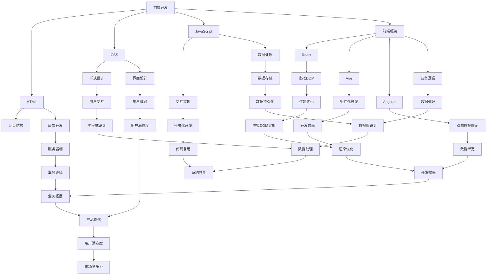

                 

关键词：全栈开发、前端、后端、全栈工程师、Web开发、技术栈、项目实践、算法、数学模型、应用场景

> 摘要：本文将深入探讨Web全栈开发的各个方面，从核心概念、算法原理，到项目实践和未来展望，为广大开发者提供一份全面的技术指南。

## 1. 背景介绍

Web全栈开发是指掌握前端、后端以及数据库等多个领域的技能，能够独立完成一个Web项目的开发。随着互联网技术的飞速发展，全栈开发已经成为现代软件开发的一种重要趋势。对于开发者来说，全栈开发不仅能够提升自己的竞争力，还能更好地理解整个项目的运作流程，提高开发效率。

本文将首先介绍Web全栈开发的基本概念和核心技能，然后深入探讨前端、后端以及数据库等关键技术，并通过具体的项目实践，展示如何将理论知识应用于实际开发中。最后，我们将对全栈开发的未来趋势和应用场景进行展望。

### 1.1 Web全栈开发的重要性

全栈开发的重要性体现在以下几个方面：

1. **提升个人竞争力**：全栈开发能够使开发者具备更全面的技术视野和解决问题的能力，从而在职场中脱颖而出。
2. **提高开发效率**：全栈开发者能够独立完成前端到后端的开发任务，减少沟通成本和交接时间，提高开发效率。
3. **更好地理解项目**：全栈开发能够帮助开发者从全局角度理解项目，更准确地把握项目需求，提高项目的成功率。
4. **拓宽职业道路**：全栈开发可以为开发者打开更多的职业道路，无论是成为技术专家还是管理岗位，都具有较强的适应性。

### 1.2 Web全栈开发的核心技能

Web全栈开发的核心技能包括前端、后端、数据库和项目管理等方面。以下将逐一介绍：

#### 1.2.1 前端

前端开发主要涉及HTML、CSS和JavaScript等基础技术，以及React、Vue、Angular等现代前端框架。前端开发的目标是创建用户界面和交互体验，使网站或应用程序更具吸引力和易用性。

#### 1.2.2 后端

后端开发涉及服务器、应用程序和数据库等，主要使用Python、Java、Node.js等编程语言和框架，实现业务逻辑、数据处理和接口设计等。后端开发的目标是为前端提供数据和功能支持。

#### 1.2.3 数据库

数据库是Web全栈开发的重要组成部分，主要用于存储和管理数据。常见的数据库技术包括MySQL、PostgreSQL、MongoDB等。掌握数据库的设计和优化技巧对于全栈开发至关重要。

#### 1.2.4 项目管理

项目管理是全栈开发的重要技能之一，涉及项目规划、进度控制、团队协作和风险管理等方面。良好的项目管理能够确保项目的顺利进行和按期交付。

## 2. 核心概念与联系

为了更好地理解Web全栈开发的各个方面，我们需要掌握一系列核心概念，并了解它们之间的联系。以下是一个用Mermaid绘制的流程图，展示了这些核心概念和它们之间的相互关系：



### 2.1 前端开发

前端开发是Web全栈开发的重要组成部分，涉及HTML、CSS和JavaScript等基础技术，以及React、Vue、Angular等现代前端框架。

#### 2.1.1 HTML

HTML（HyperText Markup Language）是一种用于创建网页的标准标记语言。它定义了网页内容的结构、格式和链接。

#### 2.1.2 CSS

CSS（Cascading Style Sheets）是一种用于描述HTML文档样式的样式表语言。通过CSS，开发者可以控制网页的布局、颜色、字体等样式。

#### 2.1.3 JavaScript

JavaScript是一种广泛使用的脚本语言，用于为网页添加交互性和动态效果。现代前端框架如React、Vue、Angular等都是基于JavaScript开发的。

#### 2.1.4 前端框架

前端框架是一套用于构建前端应用程序的库和工具集合。常见的框架有React、Vue和Angular，它们提供了组件化开发、虚拟DOM、双向数据绑定等特性，提高了开发效率和代码可维护性。

### 2.2 后端开发

后端开发涉及服务器、应用程序和数据库等，主要使用Python、Java、Node.js等编程语言和框架。

#### 2.2.1 服务器端

服务器端开发涉及服务器、应用程序和网络通信等方面。主要任务是处理客户端请求、执行业务逻辑、处理数据存储和提供数据接口。

#### 2.2.2 应用程序框架

应用程序框架是一套用于构建后端应用程序的库和工具集合。常见的框架有Django（Python）、Spring（Java）、Express（Node.js）等，它们提供了路由、请求处理、数据持久化、安全等功能。

#### 2.2.3 数据库

数据库是Web全栈开发的重要组成部分，主要用于存储和管理数据。常见的数据库技术有MySQL、PostgreSQL、MongoDB等，它们提供了数据存储、查询、索引等功能。

### 2.3 数据库

数据库是Web全栈开发的重要组成部分，主要用于存储和管理数据。常见的数据库技术有MySQL、PostgreSQL、MongoDB等。

#### 2.3.1 MySQL

MySQL是一种关系型数据库，广泛用于Web应用程序的数据存储。它提供了数据表、索引、事务处理等功能，具有高性能和可靠性。

#### 2.3.2 PostgreSQL

PostgreSQL是一种高性能、开源的关系型数据库，具有丰富的功能，包括数据表、索引、视图、触发器等。它适用于各种规模的应用程序，特别适合复杂数据分析和大数据处理。

#### 2.3.3 MongoDB

MongoDB是一种非关系型数据库，主要用于存储大规模数据集。它采用了文档存储模型，具有灵活的数据结构、高性能的读写能力和良好的扩展性。

### 2.4 项目管理

项目管理是Web全栈开发的重要组成部分，涉及项目规划、进度控制、团队协作和风险管理等方面。

#### 2.4.1 项目规划

项目规划是项目管理的第一步，涉及项目目标、范围、资源分配、进度安排等方面。通过项目规划，开发者可以明确项目的方向和预期成果。

#### 2.4.2 进度控制

进度控制是项目管理的重要环节，涉及任务进度跟踪、进度调整、风险管理等方面。通过进度控制，开发者可以确保项目按计划进行，并及时应对可能出现的问题。

#### 2.4.3 团队协作

团队协作是项目成功的关键，涉及团队成员的角色分工、沟通协作、任务分配等方面。通过良好的团队协作，开发者可以充分发挥每个人的优势，提高项目开发效率。

#### 2.4.4 风险管理

风险管理是项目管理的一部分，涉及识别、评估、应对项目风险等方面。通过风险管理，开发者可以降低项目风险，确保项目顺利进行。

## 3. 核心算法原理 & 具体操作步骤

在Web全栈开发中，算法原理是解决业务问题的重要手段。以下将介绍几种常用的核心算法原理，并详细解释其具体操作步骤。

### 3.1 算法原理概述

算法是一系列解决问题的步骤，具有确定性、可执行性和正确性。常用的算法包括排序算法、搜索算法、加密算法等。

#### 3.1.1 排序算法

排序算法是一种将一组数据按照特定规则进行排序的算法。常见的排序算法有冒泡排序、选择排序、插入排序、快速排序等。

#### 3.1.2 搜索算法

搜索算法是一种在数据集合中查找特定元素的算法。常见的搜索算法有线性搜索、二分搜索等。

#### 3.1.3 加密算法

加密算法是一种将明文转换为密文的算法，用于保护数据的安全。常见的加密算法有DES、AES、RSA等。

### 3.2 算法步骤详解

以下分别详细介绍上述算法的具体操作步骤。

#### 3.2.1 冒泡排序

冒泡排序是一种简单的排序算法，通过反复遍历要排序的数列，比较相邻元素的大小，并交换它们的位置，使得较大的元素逐渐“冒泡”到数列的顶端。

具体操作步骤如下：

1. 从第一个元素开始，相邻两个元素进行比较，如果第一个元素比第二个元素大，则交换它们的位置。
2. 对每一对相邻元素进行比较和交换，直到当前元素是已排序序列中的最后一个元素。
3. 重复上述步骤，直到整个数列有序。

#### 3.2.2 线性搜索

线性搜索是一种最简单的搜索算法，依次检查数组中的每个元素，直到找到目标元素或到达数组末尾。

具体操作步骤如下：

1. 从数组第一个元素开始，依次检查每个元素。
2. 如果当前元素等于目标元素，则返回该元素的索引。
3. 如果到达数组末尾，仍未找到目标元素，则返回-1。

#### 3.2.3 DES加密

DES（Data Encryption Standard）是一种经典的对称加密算法，它通过一个56位的密钥对数据进行加密。

具体操作步骤如下：

1. 初始化密钥，将56位密钥转换为64位密钥。
2. 将明文分为64位的块。
3. 对每个明文块执行初始置换IP。
4. 分16轮执行Feistel网络，每轮包括扩展置换、密钥替换、异或运算和压缩置换。
5. 对最后的结果执行最终置换IP^-1。
6. 得到加密后的密文。

### 3.3 算法优缺点

每种算法都有其优缺点，以下分别介绍冒泡排序、线性搜索和DES加密的优缺点。

#### 3.3.1 冒泡排序

**优点**：

- 简单易懂，易于实现。

**缺点**：

- 时间复杂度为O(n^2)，效率较低。
- 不适用于大数据量的排序。

#### 3.3.2 线性搜索

**优点**：

- 简单易用，适用于数据量较小的情况。

**缺点**：

- 时间复杂度为O(n)，在大数据量下效率较低。
- 无法利用数据结构的特点进行优化。

#### 3.3.3 DES加密

**优点**：

- 加密速度快，适用于实时传输的数据。

**缺点**：

- 密钥位数较短，安全性较低。
- 适用于加密小规模数据。

### 3.4 算法应用领域

不同的算法适用于不同的应用领域，以下分别介绍冒泡排序、线性搜索和DES加密的应用领域。

#### 3.4.1 冒泡排序

- 应用领域：简单的排序任务，如小规模数据集的排序。
- 适用场景：对数据稳定性要求不高，对时间性能要求较低。

#### 3.4.2 线性搜索

- 应用领域：简单的数据查找任务，如数据库的查询。
- 适用场景：数据量较小，无需使用复杂的数据结构。

#### 3.4.3 DES加密

- 应用领域：数据加密传输，如网络通信、文件加密。
- 适用场景：加密小规模数据，对实时性要求较高。

## 4. 数学模型和公式 & 详细讲解 & 举例说明

在Web全栈开发中，数学模型和公式是构建和优化算法的重要工具。以下将介绍一些常用的数学模型和公式，并详细讲解其推导过程和实际应用。

### 4.1 数学模型构建

数学模型构建是通过对现实问题的抽象和简化，将问题转化为数学形式。以下是一个简单的数学模型构建示例：

假设有一个数据集D，包含n个元素，每个元素x_i的值在[0, 1]范围内。我们需要找到D中的最大值和最小值。

**数学模型构建**：

设x_{max}为D中的最大值，x_{min}为D中的最小值。则有：

$$x_{max} = \max_{i} x_i$$

$$x_{min} = \min_{i} x_i$$

### 4.2 公式推导过程

为了找到D中的最大值和最小值，我们可以采用排序算法对D进行排序。排序算法的时间复杂度为O(nlogn)，其中logn表示排序过程中需要进行比较的次数。

**排序算法推导**：

假设使用快速排序算法，其时间复杂度为T(n) = O(nlogn)。则有：

$$T(n) = O(nlogn)$$

对于n个元素的数组D，我们可以将D划分为两个子数组D1和D2，使得D1中的元素值小于D2中的元素值。则有：

$$n = |D| = |D1| + |D2|$$

$$T(n) = T(|D1|) + T(|D2|) + C$$

其中，C表示常数项。

将D1和D2再次划分为更小的子数组，并重复上述过程，直到每个子数组只包含一个元素。则有：

$$T(n) = O(nlogn) + O(nlogn) + ... + O(nlogn) + C$$

$$T(n) = O(nlogn) \times n + C$$

$$T(n) = O(n^2) + C$$

由于常数项C可以忽略不计，所以排序算法的时间复杂度为O(nlogn)。

### 4.3 案例分析与讲解

以下通过一个实际案例，讲解如何应用数学模型和公式解决Web全栈开发中的问题。

**案例**：假设我们需要实现一个简单的用户注册系统，要求用户输入用户名和密码，系统验证用户名和密码的合法性，并记录注册信息。

**数学模型构建**：

设用户名集合为U，密码集合为P，注册信息集合为R。

$$U = \{u_1, u_2, ..., u_n\}$$

$$P = \{p_1, p_2, ..., p_n\}$$

$$R = \{(u_1, p_1), (u_2, p_2), ..., (u_n, p_n)\}$$

我们需要找到U和P中的合法用户名和密码，并记录R中的注册信息。

**公式推导过程**：

为了验证用户名和密码的合法性，我们可以采用以下公式：

$$合法性 = \neg(用户名 \in U \land 密码 \in P)$$

其中，¬表示逻辑非，∧表示逻辑与。

对于每个用户名u和密码p，我们可以计算其合法性值，并记录在注册信息集合R中。

$$合法性(u, p) = \neg(u \in U \land p \in P)$$

$$合法性(u, p) = \neg(u \in U) \lor \neg(p \in P)$$

$$合法性(u, p) = (u \notin U) \lor (p \notin P)$$

**案例分析与讲解**：

假设已有用户名集合U和密码集合P如下：

$$U = \{张三, 李四, 王五\}$$

$$P = \{123456, 654321, 987654\}$$

我们需要验证用户名“张三”和密码“123456”的合法性。

根据上述公式，我们可以计算其合法性值：

$$合法性(张三, 123456) = (张三 \notin U) \lor (123456 \notin P)$$

$$合法性(张三, 123456) = (True) \lor (True)$$

$$合法性(张三, 123456) = True$$

由于合法性值为True，表示用户名“张三”和密码“123456”是合法的。我们可以将注册信息记录在集合R中：

$$R = \{(张三, 123456)\}$$

通过上述示例，我们可以看到如何应用数学模型和公式解决Web全栈开发中的问题。在实际开发中，我们需要根据具体业务需求，构建合适的数学模型和公式，以实现高效的算法设计和优化。

## 5. 项目实践：代码实例和详细解释说明

为了更好地理解Web全栈开发的实际应用，我们将通过一个简单的用户注册和登录系统的项目实例，展示如何在前端和后端实现相关功能，并进行详细的代码解读与分析。

### 5.1 开发环境搭建

在开始项目实践之前，我们需要搭建开发环境。以下是搭建开发环境的基本步骤：

1. **安装Node.js**：Node.js是一个基于Chrome V8引擎的JavaScript运行环境，用于构建后端应用程序。访问Node.js官网（[https://nodejs.org/），下载并安装相应版本的Node.js。](https://nodejs.org/%EF%BC%89%EF%BC%8C%E4%B8%8B%E8%BD%BD%E5%92%8C%E5%AE%89%E8%A3%85%E7%9B%B8%E5%BA%94%E7%89%88%E6%9C%AC%E7%9A%84Node.js.)  
2. **安装前端框架**：我们选择Vue.js作为前端框架。访问Vue.js官网（[https://vuejs.org/），下载并安装Vue CLI，用于创建和管理Vue项目。](https://vuejs.org/%EF%BC%89%EF%BC%8C%E4%B8%8B%E8%BD%BD%E5%92%8C%E5%AE%89%E8%A3%85Vue%20CLI%EF%BC%8C%E7%94%A8%E4%BA%8E%E5%88%9B%E5%BB%BA%E5%92%8C%E7%AE%A1%E7%90%86Vue%E9%A1%B9%E7%9B%AE。)  
3. **安装后端框架**：我们选择Express.js作为后端框架。在安装Node.js后，可以直接使用npm（Node.js的包管理器）安装Express.js。

```shell
npm install express
```

### 5.2 源代码详细实现

以下是项目中的前端和后端代码，我们将对关键部分进行详细解释。

#### 5.2.1 前端代码

前端代码主要涉及Vue.js的使用，用于创建用户界面和实现用户交互。以下是一个简单的Vue组件，用于用户注册。

```vue
<template>
  <div>
    <h1>用户注册</h1>
    <form @submit.prevent="register">
      <div>
        <label for="username">用户名：</label>
        <input type="text" id="username" v-model="username" required>
      </div>
      <div>
        <label for="password">密码：</label>
        <input type="password" id="password" v-model="password" required>
      </div>
      <button type="submit">注册</button>
    </form>
  </div>
</template>

<script>
export default {
  data() {
    return {
      username: '',
      password: ''
    };
  },
  methods: {
    register() {
      // 注册逻辑
      console.log('注册成功！');
      // 发送注册请求到后端
    }
  }
};
</script>
```

**解释说明**：

- 使用`<template>`标签定义HTML结构，包括表单和按钮。
- 使用`<form>`标签创建表单，使用`@submit.prevent`修饰符防止表单默认提交行为。
- 使用`<label>`和`<input>`标签创建用户名和密码输入框，使用`v-model`实现双向数据绑定。
- 在`<script>`标签中，使用`data`函数返回数据对象，包含用户名和密码。
- 使用`methods`对象定义注册方法，其中包含发送注册请求的逻辑。

#### 5.2.2 后端代码

后端代码使用Express.js实现，用于处理用户注册和登录请求。以下是一个简单的Express服务器代码示例。

```javascript
const express = require('express');
const bodyParser = require('body-parser');

const app = express();

app.use(bodyParser.json());

// 用户注册路由
app.post('/register', (req, res) => {
  const { username, password } = req.body;
  // 注册逻辑
  console.log('注册请求:', { username, password });
  res.json({ message: '注册成功' });
});

// 用户登录路由
app.post('/login', (req, res) => {
  const { username, password } = req.body;
  // 登录逻辑
  console.log('登录请求:', { username, password });
  res.json({ message: '登录成功' });
});

const PORT = process.env.PORT || 3000;
app.listen(PORT, () => {
  console.log(`服务器运行在端口${PORT}`);
});
```

**解释说明**：

- 引入Express和body-parser模块，用于创建服务器和处理请求体。
- 使用`app.use()`中间件处理JSON请求体。
- 定义注册和登录路由，处理POST请求，接收用户名和密码。
- 在路由处理函数中，打印请求信息，并返回相应的响应。
- 使用`app.listen()`启动服务器，并打印启动信息。

### 5.3 代码解读与分析

在前端代码中，我们使用了Vue.js创建了一个简单的用户注册表单。通过双向数据绑定，我们能够实时获取用户输入的用户名和密码，并在表单提交时发送到后端。

在后端代码中，我们使用Express.js创建了一个简单的HTTP服务器，用于接收和处理前端发送的注册和登录请求。通过解析请求体，我们能够获取用户名和密码，并执行相应的注册或登录逻辑。

以下是对关键部分的进一步解读和分析：

#### 前端注册逻辑

```javascript
methods: {
  register() {
    // 注册逻辑
    console.log('注册成功！');
    // 发送注册请求到后端
    axios.post('/register', { username: this.username, password: this.password })
      .then(response => {
        console.log(response.data);
        // 处理成功响应
      })
      .catch(error => {
        console.error(error);
        // 处理错误响应
      });
  }
}
```

**解读**：

- 使用`axios`库发送POST请求到后端注册接口。
- 在成功响应中，我们可以处理注册结果，例如提示用户注册成功。
- 在错误响应中，我们可以捕获错误并提示用户。

#### 后端注册逻辑

```javascript
app.post('/register', (req, res) => {
  const { username, password } = req.body;
  // 注册逻辑
  console.log('注册请求:', { username, password });
  res.json({ message: '注册成功' });
});
```

**解读**：

- 接收前端发送的注册请求，从请求体中获取用户名和密码。
- 打印注册请求信息。
- 返回一个成功的JSON响应，告知前端注册成功。

通过这个简单的项目实例，我们展示了如何使用Vue.js和Express.js实现用户注册和登录功能。在实际项目中，我们还需要添加更多的业务逻辑，如用户验证、密码加密等，以确保系统的安全性和可靠性。

## 6. 实际应用场景

Web全栈开发的应用场景非常广泛，几乎涵盖了现代互联网的各个领域。以下是一些常见的应用场景：

### 6.1 电商平台

电商平台是Web全栈开发的经典应用场景。前端负责展示商品信息、购物车、订单管理等功能，后端负责处理订单、支付、库存等业务逻辑。通过全栈开发，可以确保用户在浏览、选购和支付等过程中的流畅体验。

### 6.2 社交媒体平台

社交媒体平台如微博、Facebook等，需要处理大量用户数据和复杂的社交关系。前端负责用户界面和交互，后端负责处理用户信息、社交关系、数据分析和推荐算法等。全栈开发能够确保平台的高性能和稳定性。

### 6.3 在线教育平台

在线教育平台涉及课程展示、在线学习、作业提交和成绩管理等。前端负责课程内容的展示和学习体验，后端负责处理用户信息、课程内容、作业批改和成绩记录等。全栈开发能够提供一致的用户体验和高效的业务处理。

### 6.4 企业内部管理系统

企业内部管理系统包括人事管理、财务管理、项目管理等。前端负责用户界面和交互，后端负责处理业务逻辑和数据存储。全栈开发能够确保系统的高效性和易用性，提高企业内部管理的效率。

### 6.5 物流管理系统

物流管理系统涉及订单管理、仓储管理、运输管理等。前端负责订单和运输信息的展示，后端负责处理订单、库存、物流跟踪等业务逻辑。全栈开发能够提供实时、准确的物流信息，提高物流效率。

### 6.6 医疗管理系统

医疗管理系统涉及患者信息管理、病历管理、药品管理、预约挂号等。前端负责患者界面和医疗服务展示，后端负责处理患者信息、病历、药品库存和预约等。全栈开发能够提供全面的医疗服务，提高医疗效率。

### 6.7 金融系统

金融系统涉及账户管理、交易管理、资金流转等。前端负责用户界面和交易操作，后端负责处理账户、交易、资金等业务逻辑。全栈开发能够确保金融系统的安全性、可靠性和高性能。

## 7. 未来应用展望

随着互联网技术的不断发展，Web全栈开发在未来将有更多的应用场景和更高的要求。以下是一些未来应用展望：

### 7.1 人工智能与全栈开发

人工智能（AI）在Web全栈开发中的应用将越来越广泛。前端可以利用AI技术实现更智能的用户交互，如语音识别、图像识别等。后端可以利用AI技术实现智能数据分析、推荐系统等，提高业务智能化水平。

### 7.2 云计算与全栈开发

云计算技术将使Web全栈开发更加灵活和高效。通过云计算，开发者可以方便地实现横向和纵向的扩展，以满足大规模数据和高并发访问的需求。同时，云原生技术将推动全栈开发向云原生应用转型。

### 7.3 容器化与全栈开发

容器化技术如Docker和Kubernetes将使全栈开发更加轻量化和可移植。通过容器化，开发者可以轻松地将应用部署到不同的环境中，提高开发效率和部署速度。

### 7.4 微服务与全栈开发

微服务架构将推动全栈开发向更细粒度的服务拆分和分布式系统演进。全栈开发者在微服务架构中需要掌握更多的技术栈，如服务发现、负载均衡、分布式存储等，以提高系统的可扩展性和可靠性。

### 7.5 跨平台与全栈开发

随着移动设备和智能设备的普及，全栈开发者需要掌握跨平台开发技术，如React Native、Flutter等，以实现一个代码库适用于多种设备和平台。

## 8. 总结：未来发展趋势与挑战

### 8.1 研究成果总结

近年来，Web全栈开发取得了显著的研究成果。在前端领域，框架和工具层出不穷，如React、Vue、Angular等，大大提高了开发效率和代码可维护性。在后端领域，Node.js、Express.js等框架的兴起，使得异步编程和并发处理变得更加简单。同时，数据库技术的创新，如NoSQL数据库和图数据库，为大数据处理和复杂查询提供了更好的支持。

### 8.2 未来发展趋势

未来，Web全栈开发将朝着以下几个方向发展：

1. **人工智能与全栈开发融合**：人工智能技术将更加深入地应用于Web全栈开发，提升用户体验和业务智能化水平。
2. **云计算与容器化**：云计算和容器化技术将使Web全栈开发更加灵活和高效，满足大规模数据和高并发访问的需求。
3. **微服务与分布式系统**：微服务架构和分布式系统将成为主流，提高系统的可扩展性和可靠性。
4. **跨平台开发**：跨平台开发技术将推动全栈开发向多种设备和平台拓展，实现更广泛的覆盖。

### 8.3 面临的挑战

尽管Web全栈开发取得了显著成果，但未来仍面临以下挑战：

1. **技术栈复杂性**：随着技术的发展，全栈开发者需要掌握更多的技术和框架，导致技术栈复杂性增加，学习和维护成本上升。
2. **安全性和隐私保护**：随着互联网攻击手段的多样化，Web全栈开发需要不断提高安全性和隐私保护水平，以应对潜在的安全威胁。
3. **性能优化**：随着用户需求的增长，全栈开发需要不断优化性能，确保系统的响应速度和稳定性。
4. **团队协作和项目管理**：随着项目的复杂度增加，团队协作和项目管理将面临更大的挑战，需要更高效的沟通和协作机制。

### 8.4 研究展望

为了应对上述挑战，未来Web全栈开发的研究可以从以下几个方面展开：

1. **简化技术栈**：通过模块化和组件化，简化全栈开发的技术栈，降低学习和维护成本。
2. **安全性和隐私保护**：加强安全性和隐私保护的研究，开发更加安全的开发工具和框架。
3. **性能优化**：研究新的性能优化方法和技术，提高系统的响应速度和稳定性。
4. **自动化和智能化**：利用人工智能和自动化技术，提高开发效率和项目质量。

总之，Web全栈开发在未来将继续发展，为现代软件开发带来更多机遇和挑战。开发者需要不断学习和掌握新技术，以适应不断变化的技术环境。

## 9. 附录：常见问题与解答

### 9.1 前端与后端开发的区别

**Q**：前端开发和后端开发有什么区别？

**A**：前端开发主要关注用户界面和交互体验，涉及HTML、CSS、JavaScript等技术，以及React、Vue、Angular等前端框架。前端开发的目的是创建美观、易用的用户界面，并与后端进行数据交互。

后端开发主要关注服务器、应用程序和数据库等，涉及Python、Java、Node.js等编程语言和框架，以及Django、Spring、Express等后端框架。后端开发的目的是处理业务逻辑、数据存储和提供接口。

### 9.2 如何选择前端框架

**Q**：有哪些前端框架可以选择？如何选择？

**A**：当前前端框架种类繁多，如React、Vue、Angular等。选择框架时，可以从以下几个方面考虑：

1. **项目需求**：根据项目需求选择合适的框架。例如，如果需要组件化开发，可以选择Vue或React；如果需要双向数据绑定，可以选择Angular。
2. **学习成本**：考虑开发团队的学习成本，选择易于上手和文档完善的框架。
3. **社区和生态系统**：选择拥有活跃社区和丰富生态系统的框架，便于解决问题和获取资源。
4. **性能和兼容性**：考虑框架的性能和跨浏览器兼容性，确保项目能够顺利运行。

### 9.3 如何选择后端框架

**Q**：有哪些后端框架可以选择？如何选择？

**A**：后端框架的选择与前端框架类似，可以从以下几个方面考虑：

1. **项目需求**：根据项目需求选择合适的框架。例如，如果需要快速开发，可以选择Node.js和Express.js；如果需要企业级应用，可以选择Java和Spring框架。
2. **开发语言偏好**：根据开发团队的编程语言偏好选择框架。
3. **性能和扩展性**：考虑框架的性能和可扩展性，确保能够满足项目需求。
4. **社区和生态系统**：选择拥有活跃社区和丰富生态系统的框架，便于解决问题和获取资源。

### 9.4 如何进行数据库设计

**Q**：如何进行数据库设计？

**A**：数据库设计包括以下几个方面：

1. **需求分析**：分析业务需求，确定需要存储的数据类型和数量。
2. **概念设计**：根据需求分析，绘制E-R图（实体-关系图），确定实体和关系。
3. **逻辑设计**：将E-R图转换为数据库模式，确定表、字段、索引等。
4. **物理设计**：选择合适的数据库系统，如MySQL、PostgreSQL、MongoDB等，并优化数据库性能。

### 9.5 如何进行项目规划

**Q**：如何进行项目规划？

**A**：项目规划包括以下几个方面：

1. **需求分析**：明确项目需求，确定项目目标。
2. **范围管理**：确定项目的范围，明确项目的任务和目标。
3. **进度安排**：制定项目进度计划，确定任务的时间节点。
4. **资源分配**：确定项目所需的资源，如人力、资金、设备等。
5. **风险管理**：识别项目风险，制定应对策略。

通过上述步骤，可以确保项目顺利进行，按时按质完成。

### 9.6 如何进行团队协作

**Q**：如何进行团队协作？

**A**：团队协作包括以下几个方面：

1. **明确角色和职责**：明确团队成员的角色和职责，确保每个人都知道自己的任务和目标。
2. **沟通和协调**：建立有效的沟通渠道，确保团队成员能够及时沟通和协调，解决问题。
3. **任务分配**：合理分配任务，确保团队成员的工作量平衡。
4. **代码评审**：进行代码评审，确保代码质量。
5. **敏捷开发**：采用敏捷开发方法，快速响应变化，持续迭代。

通过有效的团队协作，可以提高开发效率，确保项目成功。

### 9.7 如何进行风险管理

**Q**：如何进行风险管理？

**A**：风险管理包括以下几个方面：

1. **识别风险**：识别项目可能面临的风险，包括技术风险、市场风险、资源风险等。
2. **评估风险**：评估风险的可能性和影响，确定风险等级。
3. **制定应对策略**：针对不同等级的风险，制定相应的应对策略。
4. **监控和应对**：持续监控项目风险，根据实际情况调整应对策略。

通过有效的风险管理，可以降低项目风险，确保项目顺利进行。

