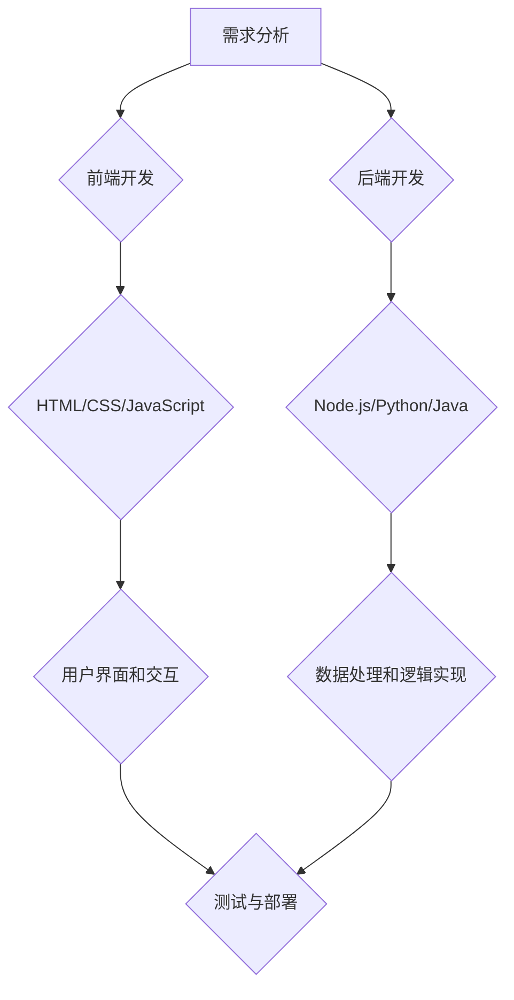

                 

关键词：Web全栈开发、前端技术、后端技术、全栈架构、全栈工程师、开发工具、项目实践

> 摘要：本文将深入探讨Web全栈开发的各个层面，从前端到后端，通过详细的分析和实例，帮助读者全面理解全栈开发的流程、技术要点和实际应用。文章将围绕核心概念、算法原理、数学模型、项目实践和未来发展趋势展开，旨在为全栈开发者提供一套系统、实用的技术指南。

## 1. 背景介绍

随着互联网技术的迅猛发展，Web开发已成为现代IT行业的重要组成部分。传统的开发模式通常将前端和后端分割开来，前端负责用户界面和交互，后端则负责数据处理和逻辑实现。然而，随着前端技术的复杂化和后端服务的多样性，单一的职责划分已无法满足高效、灵活的开发需求。全栈开发应运而生，它要求开发人员具备前端和后端的全局视野和技能，从而提高开发效率，降低沟通成本，实现更加统一和高效的应用开发。

全栈开发不仅涉及前端技术，如HTML、CSS、JavaScript，还包括后端技术，如Node.js、Python、Java等。它还要求掌握数据库技术、服务器部署、网络安全等多方面的知识。本文将围绕这些核心内容，系统地介绍Web全栈开发的方方面面，帮助读者构建全面的技术框架。

## 2. 核心概念与联系

### 2.1 Web全栈开发概述

Web全栈开发是指开发人员具备前端和后端开发的能力，能够独立完成Web应用的全过程。前端主要负责用户界面和交互，而后端则负责数据处理和逻辑实现。以下是一个简化的Web全栈开发流程：

1. **需求分析**：了解用户需求，确定应用的功能和界面。
2. **前端开发**：使用HTML、CSS、JavaScript等前端技术实现用户界面。
3. **后端开发**：选择后端技术，如Node.js、Python、Java等，实现数据处理和逻辑。
4. **数据库设计**：设计数据库结构，实现数据存储和管理。
5. **服务器部署**：将应用部署到服务器，进行测试和上线。
6. **维护与优化**：根据用户反馈进行功能优化和bug修复。

### 2.2 前端技术

前端开发是Web全栈开发的核心部分，它负责实现用户界面和交互。以下是前端开发的一些核心技术：

- **HTML**：超文本标记语言，用于构建网页结构。
- **CSS**：层叠样式表，用于美化网页样式。
- **JavaScript**：一种脚本语言，用于实现网页交互功能。

### 2.3 后端技术

后端开发是实现数据处理和逻辑的核心，以下是一些流行的后端技术：

- **Node.js**：基于Chrome V8引擎的JavaScript运行环境，适用于构建高性能的Web应用。
- **Python**：一种高级编程语言，以其简洁的语法和丰富的库支持而受到开发者的喜爱。
- **Java**：一种面向对象的编程语言，广泛应用于企业级应用。

### 2.4 Mermaid流程图

以下是一个简化的Web全栈开发流程的Mermaid流程图：



## 3. 核心算法原理 & 具体操作步骤

### 3.1 算法原理概述

在Web全栈开发中，算法是实现数据处理和逻辑的核心。以下是几种常见的算法原理：

- **排序算法**：用于对数据进行排序，常用的有冒泡排序、快速排序、归并排序等。
- **查找算法**：用于在数据中查找特定元素，常用的有二分查找、线性查找等。
- **加密算法**：用于数据加密，保障数据安全，常用的有AES、RSA等。

### 3.2 算法步骤详解

以下是排序算法中快速排序的步骤详解：

1. 选择一个基准元素。
2. 将比基准元素小的元素放在其左侧，比基准元素大的元素放在其右侧。
3. 对左右两个分区递归执行上述步骤。

### 3.3 算法优缺点

- **快速排序**：时间复杂度较低，适用于大规模数据处理。
- **冒泡排序**：简单易懂，但时间复杂度较高，适用于小规模数据处理。

### 3.4 算法应用领域

- **搜索引擎**：用于对大量网页进行排序和检索。
- **数据挖掘**：用于对大量数据进行排序和分析。

## 4. 数学模型和公式 & 详细讲解 & 举例说明

### 4.1 数学模型构建

在Web全栈开发中，数学模型是解决实际问题的重要工具。以下是一个简单的线性回归模型：

$$
y = wx + b
$$

其中，$y$ 是目标变量，$x$ 是特征变量，$w$ 是权重，$b$ 是偏置。

### 4.2 公式推导过程

线性回归模型的推导过程如下：

1. 假设数据集为 $D = \{(x_1, y_1), (x_2, y_2), ..., (x_n, y_n)\}$。
2. 对每个样本点 $(x_i, y_i)$，计算预测值 $\hat{y_i} = wx_i + b$。
3. 计算预测值与实际值之间的误差 $e_i = y_i - \hat{y_i}$。
4. 采用最小二乘法求解权重 $w$ 和偏置 $b$，使得误差的平方和最小。

### 4.3 案例分析与讲解

以下是一个线性回归模型的案例分析：

假设我们有一个数据集，包含房屋面积和房价的数据。我们希望使用线性回归模型预测房屋价格。

数据集：
```
面积（x）：100, 200, 300, 400, 500
房价（y）：150, 250, 350, 450, 550
```

使用线性回归模型预测房屋面积为300平方米时的房价：

$$
y = wx + b
$$

通过计算得到权重 $w = 1.5$，偏置 $b = 50$。代入公式：

$$
y = 1.5 \times 300 + 50 = 550
$$

预测房价为550万元。

## 5. 项目实践：代码实例和详细解释说明

### 5.1 开发环境搭建

在开始项目实践之前，我们需要搭建一个开发环境。以下是使用Node.js搭建环境的过程：

1. 安装Node.js：访问Node.js官网（[https://nodejs.org/](https://nodejs.org/)），下载并安装。
2. 验证安装：在命令行中输入 `node -v` 和 `npm -v`，检查Node.js和npm是否成功安装。

### 5.2 源代码详细实现

以下是一个简单的Web应用，使用Node.js和Express框架实现：

```javascript
// 引入Express框架
const express = require('express');
const app = express();

// 解析请求数据
app.use(express.json());

// 设置路由
app.get('/', (req, res) => {
    res.send('Hello, World!');
});

app.post('/data', (req, res) => {
    const data = req.body;
    console.log('Received data:', data);
    res.send('Data received.');
});

// 启动服务器
const PORT = process.env.PORT || 3000;
app.listen(PORT, () => {
    console.log(`Server listening on port ${PORT}`);
});
```

### 5.3 代码解读与分析

该代码实现了以下功能：

1. 引入Express框架。
2. 解析请求数据。
3. 设置路由。
4. 启动服务器。

通过访问根路径 `/`，可以获取到 “Hello, World!” 的响应。通过POST请求访问 `/data`，可以接收并处理前端发送的数据。

### 5.4 运行结果展示

在命令行中运行以下命令：

```bash
node app.js
```

然后使用浏览器或Postman工具访问 `http://localhost:3000/`，可以看到 "Hello, World!" 的响应。发送一个POST请求到 `http://localhost:3000/data`，可以看到服务器接收并处理数据的响应。

## 6. 实际应用场景

Web全栈开发在各个领域都有广泛的应用，以下是一些实际应用场景：

- **电商平台**：使用Web全栈开发技术构建用户界面、处理订单、管理商品信息等。
- **社交媒体**：实现用户注册、发布动态、评论互动等功能。
- **企业内部应用**：构建企业信息门户、项目管理、员工协作等应用。

### 6.4 未来应用展望

随着5G、物联网、人工智能等新技术的不断发展，Web全栈开发的应用领域将进一步扩展。未来，全栈开发将更加注重跨平台、实时性和安全性，为用户提供更加流畅、安全、个性化的体验。

## 7. 工具和资源推荐

### 7.1 学习资源推荐

- **《JavaScript高级程序设计》**：深入讲解JavaScript编程语言的核心概念和高级技巧。
- **《Node.js实战》**：详细介绍Node.js的应用场景和开发方法。

### 7.2 开发工具推荐

- **Visual Studio Code**：一款功能强大的代码编辑器，支持多种编程语言。
- **Postman**：一款API接口调试工具，方便进行接口测试和调试。

### 7.3 相关论文推荐

- **《Web全栈开发的实践与探索》**：探讨Web全栈开发的最佳实践和未来发展。
- **《基于Node.js的Web全栈开发技术》**：详细介绍Node.js在Web全栈开发中的应用。

## 8. 总结：未来发展趋势与挑战

### 8.1 研究成果总结

本文从多个角度探讨了Web全栈开发的各个方面，包括核心概念、算法原理、数学模型、项目实践和未来展望。通过详细的分析和实例，帮助读者全面理解Web全栈开发的技术要点和应用场景。

### 8.2 未来发展趋势

未来，Web全栈开发将继续朝着跨平台、实时性和安全性的方向发展。随着新技术的不断涌现，全栈开发的应用领域将进一步拓展，为用户提供更加丰富、个性化的体验。

### 8.3 面临的挑战

全栈开发面临的挑战包括技术多样性的增加、开发复杂度的提升和团队协作的困难。如何高效地学习和掌握多种技术，如何在复杂的项目中保持高效协作，是全栈开发者需要不断思考和解决的问题。

### 8.4 研究展望

未来，研究重点将集中在全栈开发工具的集成、开发流程的优化和新技术的应用上。通过不断探索和实践，全栈开发将更加成熟和高效，为我国互联网产业发展提供有力支撑。

## 9. 附录：常见问题与解答

### 9.1 Q：什么是全栈开发？

A：全栈开发是指开发人员具备前端和后端开发的能力，能够独立完成Web应用的全过程。

### 9.2 Q：为什么需要全栈开发？

A：全栈开发能够提高开发效率，降低沟通成本，实现更加统一和高效的应用开发。

### 9.3 Q：如何学习全栈开发？

A：可以从学习前端技术（HTML、CSS、JavaScript）开始，然后逐步学习后端技术（如Node.js、Python、Java），并掌握相关开发工具和流程。

### 9.4 Q：全栈开发有哪些应用领域？

A：全栈开发在电商平台、社交媒体、企业内部应用等多个领域都有广泛的应用。

---

作者：禅与计算机程序设计艺术 / Zen and the Art of Computer Programming

