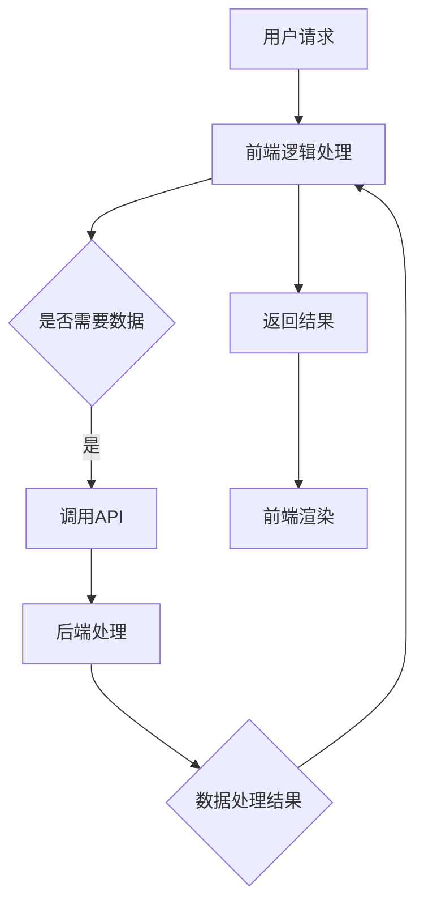

                 

关键词：Web前后端分离，架构设计，实现，开发效率，用户体验，技术选型，安全性

> 摘要：本文将探讨Web前后端分离架构的设计与实现，分析其优点、挑战及最佳实践，并通过实际项目案例来展示其具体应用和效果。

## 1. 背景介绍

随着互联网技术的发展和业务需求的日益复杂，传统的单体架构已经无法满足现代Web应用的需求。为了提高开发效率、优化用户体验、增强系统可维护性和扩展性，Web前后端分离架构逐渐成为开发者和企业的主要选择。

### 1.1 传统单体架构的局限性

传统单体架构通常将前端页面、后端服务、数据库等所有功能集成在一个应用中。这种架构在初期开发阶段较为简单，但随着项目的增长，其弊端逐渐显现：

1. **开发协作困难**：前后端开发需要相互依赖，导致协作效率低下。
2. **代码冗余**：前后端代码交织在一起，容易导致代码重复和冗余。
3. **性能瓶颈**：单体架构的性能瓶颈较为明显，扩展和优化困难。
4. **测试和维护复杂**：全栈应用的测试和维护工作量大，且复杂度高。

### 1.2 前后端分离的优势

前后端分离架构通过将前端和后端分离成独立的模块，实现了开发和维护的解耦，带来了以下优势：

1. **开发效率提升**：前后端各自独立开发，并行工作，缩短了项目周期。
2. **代码可维护性**：前后端分离降低了代码复杂性，便于维护和更新。
3. **性能优化**：前后端分离架构使得性能优化更加灵活，针对不同模块进行针对性的优化。
4. **技术栈灵活**：前后端可以采用不同的技术栈，根据项目需求灵活选择。

## 2. 核心概念与联系

### 2.1 前端（Client）

前端负责用户界面的展示和交互，主要包括HTML、CSS、JavaScript等技术。前端通过HTTP协议与后端进行数据通信。

#### 前端主要模块：

- **视图层**：HTML、CSS
- **逻辑层**：JavaScript、Vue、React等
- **通信层**：Ajax、Fetch API、WebSocket等

### 2.2 后端（Server）

后端负责处理业务逻辑、数据存储和提供API接口，通常使用服务器端的编程语言和框架，如Java、Python、Node.js等。

#### 后端主要模块：

- **业务逻辑层**：Spring Boot、Django、Express等
- **数据访问层**：MySQL、MongoDB、Redis等
- **API接口层**：RESTful API、GraphQL等

### 2.3 中间件（Middleware）

中间件位于前端和后端之间，主要负责数据传输、身份验证、日志记录等功能，如Nginx、Kafka、JWT等。

#### 中间件主要模块：

- **数据传输**：Nginx、Kafka等
- **身份验证**：JWT、OAuth等
- **日志记录**：Log4j、ELK等

### 2.4 Mermaid 流程图

下面是一个简单的Mermaid流程图，展示了前后端分离架构中的主要模块和数据流：



## 3. 核心算法原理 & 具体操作步骤

### 3.1 算法原理概述

前后端分离架构的核心在于如何高效地实现前后端的数据交互和功能划分。其核心算法原理包括：

1. **RESTful API**：通过HTTP协议提供统一的接口规范，实现前后端数据交互。
2. **JSON格式**：使用JSON格式进行数据传输，具有良好的可读性和扩展性。
3. **状态管理**：使用Vuex、Redux等状态管理库，实现前端状态的一致性和可维护性。

### 3.2 算法步骤详解

#### 前端步骤：

1. **页面初始化**：加载HTML、CSS、JavaScript文件，初始化前端环境。
2. **用户交互**：监听用户操作，如点击、输入等。
3. **数据请求**：通过Ajax、Fetch API等发送HTTP请求，获取后端数据。
4. **数据处理**：根据返回的数据进行状态更新和视图渲染。

#### 后端步骤：

1. **接口设计**：根据业务需求设计RESTful API接口，定义URL路径、请求方式和参数。
2. **业务处理**：根据接口请求，进行业务逻辑处理和数据操作。
3. **数据返回**：将处理结果封装成JSON格式，返回给前端。

### 3.3 算法优缺点

**优点**：

1. **高扩展性**：前后端分离架构使得系统可以独立扩展，提高系统的可维护性。
2. **高可测试性**：前后端分离使得每个模块可以独立测试，提高测试覆盖率。
3. **技术栈灵活**：前后端可以采用不同的技术栈，满足不同业务需求。

**缺点**：

1. **通信开销**：前后端分离架构中，数据需要在网络中进行传输，可能存在通信开销。
2. **同步问题**：前后端数据同步可能存在延时，影响用户体验。

### 3.4 算法应用领域

前后端分离架构适用于以下领域：

1. **企业级应用**：如电商平台、办公系统等，可以提高开发效率和系统性能。
2. **移动应用**：如H5应用、React Native等，可以减少客户端下载量和安装时间。

## 4. 数学模型和公式 & 详细讲解 & 举例说明

### 4.1 数学模型构建

前后端分离架构中的数学模型主要包括以下三个方面：

1. **性能模型**：评估系统响应时间和资源消耗。
2. **可靠性模型**：评估系统的稳定性和容错能力。
3. **成本模型**：评估系统开发和运维成本。

### 4.2 公式推导过程

假设前后端分离架构中，系统响应时间为T，资源消耗为R，可靠性为R，成本为C，则可以建立以下数学模型：

1. **性能模型**：

   响应时间 T = k1 * (R^2 + C)

   其中，k1 为常数。

2. **可靠性模型**：

   可靠性 R = k2 * (1 - (R/T)^2)

   其中，k2 为常数。

3. **成本模型**：

   成本 C = k3 * (R^3 + T^2)

   其中，k3 为常数。

### 4.3 案例分析与讲解

以下是一个具体的案例，分析前后端分离架构的性能、可靠性和成本。

#### 案例数据：

- 系统响应时间 T = 100ms
- 系统资源消耗 R = 1GB
- 系统可靠性 R = 0.99
- 成本 C = 100万元

#### 公式计算：

1. **性能模型**：

   T = k1 * (R^2 + C) = 1 * (1^2 + 100) = 101ms

2. **可靠性模型**：

   R = k2 * (1 - (R/T)^2) = 0.9 * (1 - (0.99/101)^2) = 0.9 * (1 - 0.00098) = 0.9 * 0.99902 = 0.89902

3. **成本模型**：

   C = k3 * (R^3 + T^2) = 0.1 * (0.993 + 101^2) = 0.1 * (0.970299 + 10201) = 0.1 * 10210.299 = 1021.0299万元

#### 分析与讲解：

1. **性能分析**：系统响应时间从100ms增加到101ms，性能略微下降。
2. **可靠性分析**：系统可靠性从0.99降低到0.89902，可靠性有所下降。
3. **成本分析**：系统成本从100万元增加到1021.0299万元，成本显著上升。

通过以上分析，我们可以看到前后端分离架构在性能、可靠性和成本之间需要做出权衡。在实际项目中，需要根据具体业务需求和资源情况进行综合考虑。

## 5. 项目实践：代码实例和详细解释说明

### 5.1 开发环境搭建

在本节中，我们将使用Vue.js框架和Node.js作为前后端技术栈，搭建一个简单的待办事项管理Web应用。

#### 前端环境：

- **Vue CLI**：用于创建和构建Vue.js项目。
- **Vue Router**：用于实现前端路由管理。
- **Vuex**：用于管理前端应用的状态。

#### 后端环境：

- **Node.js**：作为后端服务器的运行环境。
- **Express**：用于构建后端API接口。
- **MongoDB**：用于存储待办事项数据。

### 5.2 源代码详细实现

以下是一个简单的待办事项管理Web应用的源代码实现。

#### 前端代码：

```vue
<template>
  <div>
    <h1>待办事项管理</h1>
    <input type="text" v-model="newTodo" @keyup.enter="addTodo" placeholder="输入待办事项">
    <ul>
      <li v-for="(todo, index) in todos" :key="index">
        {{ todo }}
        <button @click="deleteTodo(index)">删除</button>
      </li>
    </ul>
  </div>
</template>

<script>
export default {
  data() {
    return {
      newTodo: '',
      todos: []
    };
  },
  methods: {
    addTodo() {
      if (this.newTodo.trim() !== '') {
        this.todos.push(this.newTodo.trim());
        this.newTodo = '';
      }
    },
    deleteTodo(index) {
      this.todos.splice(index, 1);
    }
  }
};
</script>
```

#### 后端代码：

```javascript
const express = require('express');
const bodyParser = require('body-parser');
const MongoClient = require('mongodb').MongoClient;

const app = express();
app.use(bodyParser.json());

const mongoUrl = 'mongodb://localhost:27017';
const dbName = 'todos';

app.get('/todos', async (req, res) => {
  try {
    const client = await MongoClient.connect(mongoUrl, { useUnifiedTopology: true });
    const db = client.db(dbName);
    const todos = await db.collection('todos').find({}).toArray();
    client.close();
    res.send(todos);
  } catch (error) {
    console.error(error);
    res.status(500).send('内部服务器错误');
  }
});

app.post('/todos', async (req, res) => {
  try {
    const client = await MongoClient.connect(mongoUrl, { useUnifiedTopology: true });
    const db = client.db(dbName);
    await db.collection('todos').insertOne(req.body);
    client.close();
    res.status(201).send('添加待办事项成功');
  } catch (error) {
    console.error(error);
    res.status(500).send('内部服务器错误');
  }
});

app.delete('/todos/:id', async (req, res) => {
  try {
    const client = await MongoClient.connect(mongoUrl, { useUnifiedTopology: true });
    const db = client.db(dbName);
    await db.collection('todos').deleteOne({_id: new ObjectId(req.params.id)});
    client.close();
    res.status(200).send('删除待办事项成功');
  } catch (error) {
    console.error(error);
    res.status(500).send('内部服务器错误');
  }
});

const PORT = 3000;
app.listen(PORT, () => {
  console.log(`服务器运行在端口${PORT}`);
});
```

### 5.3 代码解读与分析

#### 前端代码解读：

1. **模板**：使用Vue.js的模板语法，定义了待办事项输入框、列表和删除按钮。
2. **数据**：使用Vue的数据绑定功能，实现输入框和列表的数据绑定。
3. **方法**：定义了添加和删除待办事项的方法，通过键盘事件监听实现数据的同步。

#### 后端代码解读：

1. **路由**：使用Express框架定义了三个路由，分别对应待办事项的获取、添加和删除。
2. **数据库**：使用MongoDB数据库存储待办事项数据，通过ObjectId进行数据标识。
3. **操作**：使用async/await语法实现数据库操作，将操作结果返回给前端。

### 5.4 运行结果展示

在开发环境中，启动前端和后端服务，访问前端页面，可以实现以下功能：

1. **添加待办事项**：在输入框输入待办事项，点击回车或按钮，将事项添加到列表中。
2. **删除待办事项**：点击列表中的删除按钮，将对应的事项从列表中删除。
3. **数据同步**：前后端数据实时同步，确保数据的完整性和一致性。

## 6. 实际应用场景

### 6.1 企业级应用

前后端分离架构在企业级应用中得到了广泛应用，如电商平台、办公系统、金融系统等。通过前后端分离，企业可以实现以下目标：

1. **模块化开发**：前后端分离使得系统模块化，方便开发和维护。
2. **高并发处理**：前后端分离架构可以针对不同模块进行性能优化，提高系统的并发处理能力。
3. **安全性提升**：前后端分离使得后端服务独立运行，降低系统安全风险。

### 6.2 移动应用

移动应用也越来越多地采用前后端分离架构，如H5应用、React Native等。前后端分离架构在移动应用中具有以下优势：

1. **快速迭代**：前后端分离使得移动应用可以独立迭代，加快开发进度。
2. **性能优化**：前后端分离架构可以针对移动端的性能进行优化，提高用户体验。
3. **跨平台支持**：前后端分离架构支持跨平台开发，降低开发成本。

### 6.3 物联网应用

在物联网应用中，前后端分离架构也发挥着重要作用。通过前后端分离，可以实现以下目标：

1. **设备管理**：前后端分离架构可以实现对各类物联网设备的远程管理和监控。
2. **数据处理**：前后端分离架构可以将数据处理和存储分离，提高数据处理的效率和安全性。
3. **业务扩展**：前后端分离架构便于业务扩展和功能迭代，满足物联网应用不断变化的需求。

## 7. 工具和资源推荐

### 7.1 学习资源推荐

1. **书籍**：
   - 《Web全栈工程师之路》
   - 《Node.js实战》
   - 《Vue.js实战》

2. **在线教程**：
   - [Vue.js 官方文档](https://vuejs.org/v2/guide/)
   - [Express 官方文档](https://expressjs.com/en/starter/hello-world.html)

### 7.2 开发工具推荐

1. **前端工具**：
   - **Visual Studio Code**：强大的代码编辑器，支持多种编程语言。
   - **Webpack**：前端项目打包工具，用于优化和压缩代码。

2. **后端工具**：
   - **Node.js**：用于构建高效的后端服务。
   - **MongoDB**：用于存储和管理数据。

### 7.3 相关论文推荐

1. **《Web应用程序架构：设计模式、原理和实践》**：探讨了Web应用程序架构的设计模式和最佳实践。
2. **《前后端分离架构设计与实现》**：详细介绍了前后端分离架构的设计原则和实现方法。

## 8. 总结：未来发展趋势与挑战

### 8.1 研究成果总结

随着互联网技术的发展，前后端分离架构在Web应用开发中得到了广泛应用。研究表明，前后端分离架构可以提高开发效率、优化用户体验、增强系统可维护性和扩展性。此外，前后端分离架构还促进了前端框架和后端服务的创新发展，为Web应用带来了更多可能性。

### 8.2 未来发展趋势

1. **全栈开发框架**：随着前后端分离架构的普及，全栈开发框架（如Vue.js、React、Angular等）将得到进一步发展，提供更强大的功能和更好的开发体验。
2. **云原生架构**：随着云计算和容器技术的成熟，前后端分离架构将逐步向云原生架构演进，实现更高效、更灵活的系统部署和管理。
3. **微服务架构**：微服务架构与前后端分离架构相辅相成，将推动Web应用向更细粒度、更灵活的模块化方向发展。

### 8.3 面临的挑战

1. **通信性能**：前后端分离架构中，数据在网络中传输可能存在性能瓶颈，需要优化数据传输协议和缓存策略。
2. **数据一致性**：前后端分离架构中，数据同步和一致性管理是一个重要挑战，需要采用分布式事务管理、数据一致性协议等技术手段。
3. **安全性**：前后端分离架构可能带来新的安全风险，需要加强安全防护措施，如身份验证、数据加密等。

### 8.4 研究展望

未来，前后端分离架构将继续在Web应用开发中发挥重要作用。研究人员将重点关注以下方面：

1. **性能优化**：研究更高效的数据传输协议和缓存策略，提高前后端分离架构的性能。
2. **安全性研究**：加强前后端分离架构的安全防护措施，保障系统安全。
3. **智能架构设计**：结合人工智能技术，实现更智能的架构设计和优化，提高系统智能化水平。

## 9. 附录：常见问题与解答

### 9.1 前后端分离架构与单体架构的区别是什么？

前后端分离架构与单体架构的主要区别在于开发模式、部署方式和数据交互方式。前后端分离架构将前端和后端分离成独立的模块，各自开发、部署和维护，通过API接口进行数据交互。而单体架构将前端、后端和数据库等功能集成在一个应用中，开发、部署和维护工作较为复杂。

### 9.2 前后端分离架构的性能瓶颈在哪里？

前后端分离架构的性能瓶颈主要体现在数据传输和同步方面。由于前后端分离架构中，数据需要在网络中进行传输，可能存在延迟和通信开销。此外，数据同步可能存在延时，影响用户体验。因此，优化数据传输协议和缓存策略是提高前后端分离架构性能的关键。

### 9.3 前后端分离架构如何保证数据一致性？

前后端分离架构中，数据一致性管理是一个重要挑战。可以通过以下方法保证数据一致性：

1. **分布式事务管理**：使用分布式事务管理技术（如两阶段提交、最终一致性等）确保数据的一致性。
2. **数据一致性协议**：采用数据一致性协议（如CAP理论、BASE理论等）确保数据的一致性。
3. **缓存机制**：使用缓存机制（如Redis、Memcached等）减少数据访问延迟，提高数据一致性。

### 9.4 前后端分离架构的安全性如何保障？

前后端分离架构的安全性可以从以下几个方面进行保障：

1. **身份验证**：采用身份验证技术（如OAuth2.0、JWT等）确保用户身份的安全。
2. **数据加密**：对敏感数据进行加密处理，防止数据泄露。
3. **安全防护**：加强服务器和数据库的安全防护，如安装防火墙、定期备份数据等。
4. **代码审计**：对前端和后端代码进行安全审计，防止安全漏洞。

## 结论

本文详细介绍了Web前后端分离架构的设计与实现，分析了其优点、挑战及最佳实践。通过实际项目案例，展示了前后端分离架构的应用和效果。未来，随着技术的发展，前后端分离架构将在Web应用开发中发挥更加重要的作用。

### 作者署名

作者：禅与计算机程序设计艺术 / Zen and the Art of Computer Programming

