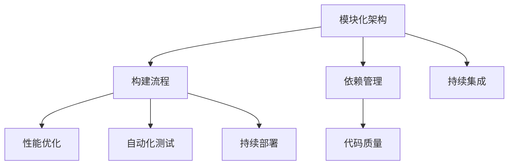

                 

关键词：Web前端工程化、模块化、性能优化、代码质量、开发工具、自动化测试、持续集成

> 摘要：本文深入探讨了Web前端工程化的最佳实践，包括模块化、性能优化、代码质量、开发工具、自动化测试和持续集成等方面。通过详细的分析和案例讲解，为开发者提供了有效的技术指导和策略建议。

## 1. 背景介绍

随着互联网技术的飞速发展，Web前端开发变得越来越复杂和庞大。为了应对这种复杂性，前端工程化逐渐成为了一项至关重要的实践。前端工程化不仅提升了项目的开发效率，还保证了代码的稳定性和可维护性。本文将围绕以下几个方面展开讨论：

1. **模块化**：如何实现代码的模块化，提高代码的可复用性和可维护性。
2. **性能优化**：如何提升Web页面的加载速度和运行效率。
3. **代码质量**：如何保证代码的规范性和一致性。
4. **开发工具**：如何选择和使用合适的开发工具来提升开发效率。
5. **自动化测试**：如何构建自动化测试体系来提高代码质量。
6. **持续集成**：如何实现持续集成和持续部署，确保代码的稳定性和安全性。

## 2. 核心概念与联系

### 2.1 前端工程化的概念

前端工程化是指通过一系列技术手段和流程，将前端开发过程规范化、自动化，以提高开发效率和代码质量。它包括代码模块化、构建工具、依赖管理、性能优化、代码质量检查等多个方面。

### 2.2 前端工程化的架构

前端工程化的架构通常包括以下几个方面：

1. **模块化架构**：通过模块化，将代码分割成可复用的模块，提高代码的可维护性和可扩展性。
2. **构建流程**：使用构建工具（如Webpack、Gulp等）对代码进行编译、打包和优化。
3. **依赖管理**：使用包管理工具（如npm、yarn等）管理项目的依赖。
4. **性能优化**：对代码和资源进行优化，提高Web页面的加载速度和运行效率。
5. **代码质量**：通过代码规范检查、静态代码分析等方式，保证代码的规范性和一致性。
6. **自动化测试**：编写自动化测试用例，对代码进行自动化测试，提高代码质量。
7. **持续集成**：通过持续集成工具（如Jenkins、Travis CI等），实现代码的自动化构建、测试和部署。

### 2.3 Mermaid 流程图



## 3. 核心算法原理 & 具体操作步骤

### 3.1 算法原理概述

前端工程化的核心算法主要涉及模块打包、代码压缩、资源压缩、代码分割等方面。以下将详细介绍这些算法的原理和具体操作步骤。

### 3.2 算法步骤详解

1. **模块打包**：
   - 使用Webpack等构建工具，根据配置文件，将各个模块打包成一个或多个bundle。
   - 使用动态导入语法（如`import()`），实现模块的动态加载。

2. **代码压缩**：
   - 使用UglifyJS、Terser等工具，对JavaScript代码进行压缩，减少代码体积。
   - 使用ESLint等工具，对JavaScript代码进行格式化，保证代码的可读性。

3. **资源压缩**：
   - 使用image-minimizer等工具，对图片、字体等资源进行压缩，减少资源体积。
   - 使用CSSNano等工具，对CSS文件进行压缩，减少代码体积。

4. **代码分割**：
   - 使用Webpack的代码分割功能，将代码分割成多个chunk。
   - 根据入口页面和路由，动态加载对应的chunk。

### 3.3 算法优缺点

1. **模块打包**：
   - 优点：提高代码的可维护性和可扩展性。
   - 缺点：构建时间可能会增加。

2. **代码压缩**：
   - 优点：减少代码体积，提高页面加载速度。
   - 缺点：可能会影响代码的可读性。

3. **资源压缩**：
   - 优点：减少资源体积，提高页面加载速度。
   - 缺点：可能会影响资源的解析速度。

4. **代码分割**：
   - 优点：提高首屏加载速度，减少首屏加载时间。
   - 缺点：可能会增加动态加载的资源。

### 3.4 算法应用领域

这些算法主要应用在前端工程化的构建和优化过程中，包括：

1. **项目构建**：模块打包、代码压缩、资源压缩等。
2. **性能优化**：代码分割、懒加载等。

## 4. 数学模型和公式 & 详细讲解 & 举例说明

### 4.1 数学模型构建

在前端工程化中，常用的数学模型包括：

1. **压缩率模型**：用于计算代码和资源的压缩率。
2. **响应时间模型**：用于计算Web页面的响应时间。

### 4.2 公式推导过程

1. **压缩率模型**：

   压缩率 = (原始大小 - 压缩后大小) / 原始大小

2. **响应时间模型**：

   响应时间 = 加载时间 + 处理时间

### 4.3 案例分析与讲解

### 4.3.1 压缩率案例分析

假设有一个JavaScript文件，原始大小为100KB，压缩后大小为50KB。则：

压缩率 = (100KB - 50KB) / 100KB = 0.5

### 4.3.2 响应时间案例分析

假设一个Web页面的加载时间为2秒，处理时间为1秒。则：

响应时间 = 2秒 + 1秒 = 3秒

## 5. 项目实践：代码实例和详细解释说明

### 5.1 开发环境搭建

为了实践前端工程化的最佳实践，我们首先需要搭建一个开发环境。以下是一个简单的步骤：

1. 安装Node.js：从官网下载并安装Node.js。
2. 安装npm或yarn：安装npm或yarn，用于管理项目依赖。
3. 创建项目：使用`npm init`或`yarn init`创建一个新项目。
4. 安装构建工具：安装Webpack、Babel等构建工具。

### 5.2 源代码详细实现

以下是一个简单的Webpack配置文件示例：

```javascript
const path = require('path');

module.exports = {
  entry: './src/index.js',
  output: {
    filename: 'bundle.js',
    path: path.resolve(__dirname, 'dist'),
  },
  module: {
    rules: [
      {
        test: /\.js$/,
        exclude: /node_modules/,
        use: {
          loader: 'babel-loader',
        },
      },
      {
        test: /\.css$/,
        use: ['style-loader', 'css-loader'],
      },
    ],
  },
};
```

### 5.3 代码解读与分析

上述配置文件实现了以下功能：

1. **入口文件**：指定入口文件为`src/index.js`。
2. **输出文件**：指定输出文件为`dist/bundle.js`。
3. **模块加载**：通过`module.rules`配置，实现对JavaScript和CSS文件的加载和转换。

### 5.4 运行结果展示

运行Webpack构建命令后，会在`dist`目录生成`bundle.js`文件，该文件包含了所有模块的代码。

## 6. 实际应用场景

前端工程化的最佳实践可以在各种实际应用场景中发挥作用，例如：

1. **大型项目**：通过模块化、性能优化和自动化测试，提高大型项目的开发效率和代码质量。
2. **团队协作**：通过代码规范检查和持续集成，确保团队成员之间的协作和质量。
3. **性能优化**：通过代码分割、懒加载等技术，提高Web页面的加载速度和用户体验。

## 7. 工具和资源推荐

### 7.1 学习资源推荐

1. 《前端工程化：从设计、架构到最佳实践》
2. 《Webpack实战：基于Vue和React的现代化Web开发》
3. 《前端性能优化最佳实践》

### 7.2 开发工具推荐

1. Webpack
2. Babel
3. ESLint
4. Prettier
5. TypeScript

### 7.3 相关论文推荐

1. "The Rise of Webpack: How It's Changing Web Development"
2. "Web Performance Optimization: Understanding the Fundamentals"
3. "Module System Design in JavaScript"

## 8. 总结：未来发展趋势与挑战

前端工程化在未来将继续发展，面临以下挑战：

1. **性能优化**：随着设备性能的提升，用户对页面加载速度和响应时间的期望也越来越高。
2. **安全性**：随着Web攻击手段的不断升级，前端工程化需要不断提高安全性。
3. **可维护性**：随着项目的规模和复杂性不断增加，如何保持代码的可维护性成为一大挑战。

## 9. 附录：常见问题与解答

### 9.1 如何选择Webpack配置？

根据项目的需求和特点，选择合适的Webpack配置。可以从以下几个方面考虑：

1. **入口文件**：指定项目的入口文件。
2. **输出文件**：指定输出的文件路径和名称。
3. **模块加载**：配置不同的模块加载规则，如JavaScript、CSS等。
4. **性能优化**：配置代码分割、懒加载等性能优化策略。

### 9.2 如何进行自动化测试？

进行自动化测试，需要遵循以下步骤：

1. **编写测试用例**：根据业务需求和功能点，编写相应的测试用例。
2. **选择测试框架**：如Jest、Mocha等。
3. **集成到CI/CD流程**：将测试用例集成到持续集成和持续部署流程中，实现自动化测试。

### 9.3 如何优化Web页面性能？

优化Web页面性能，可以从以下几个方面入手：

1. **代码优化**：压缩代码、减少重绘和回流等。
2. **资源优化**：压缩图片、字体等资源，使用懒加载等技术。
3. **网络优化**：使用CDN加速、缓存策略等。
4. **性能监控**：使用工具如Google Lighthouse等，对页面进行性能监控和优化。

---

# 致谢

感谢您阅读本文，希望本文能为您的前端工程化之路提供一些有益的启示。如果您有任何疑问或建议，欢迎在评论区留言。感谢！

---

作者：禅与计算机程序设计艺术 / Zen and the Art of Computer Programming
----------------------------------------------------------------

请注意，以上内容只是一个示例，实际撰写时需要根据具体情况进行调整和完善。在撰写过程中，还需要确保文章内容的准确性和逻辑性，以及避免使用过多的专业术语，以便让读者更容易理解。同时，文章的结构和格式也需要按照要求进行编排。祝您撰写顺利！

