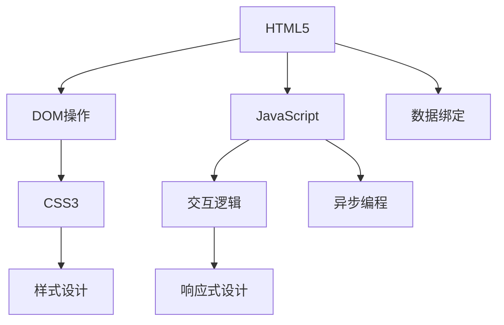
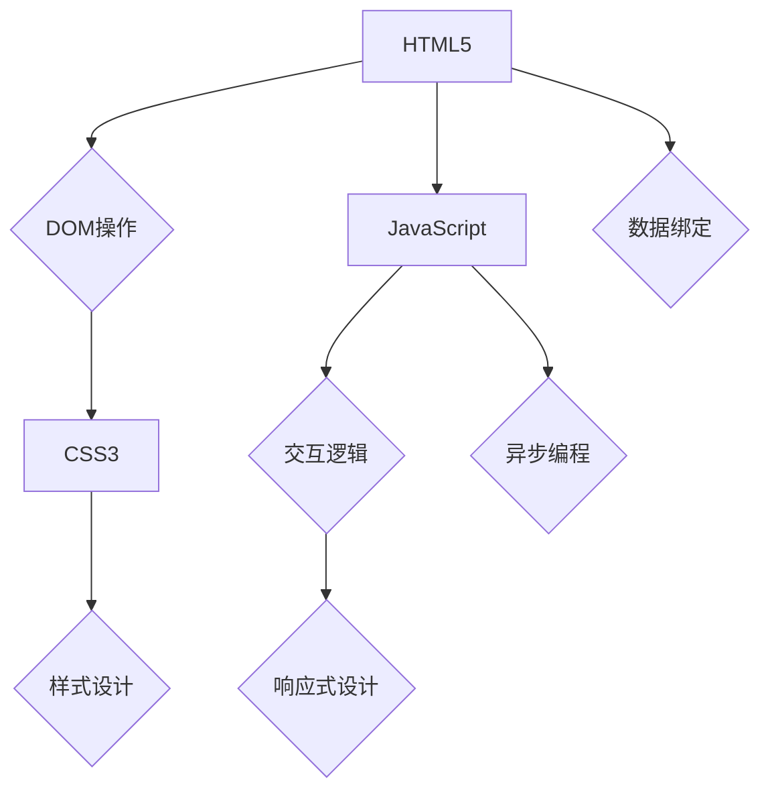

                 

### 关键词 Keyword

- Web前端开发
- HTML5
- CSS3
- JavaScript
- 前端框架
- 性能优化
- 跨平台开发

<|assistant|>### 摘要 Abstract

本文将深入探讨Web前端技术栈的核心组成部分：HTML5、CSS3与JavaScript。通过介绍这些技术的最新发展和关键特性，我们将了解如何利用它们构建高效、响应式和交互性强的现代Web应用。文章还涵盖了前端框架的选择与优化、跨平台开发策略，以及未来发展趋势与面临的挑战。对于Web开发人员和技术爱好者来说，这是一篇不可或缺的技术指南。

## 1. 背景介绍

随着互联网技术的飞速发展，Web前端开发已经成为软件工程领域的重要分支。Web前端技术的不断进步，不仅提升了用户体验，也为开发者提供了更多的创新空间。HTML5、CSS3和JavaScript是现代Web开发的三驾马车，它们各自负责Web应用的构建、样式设计和交互逻辑。

### HTML5

HTML5是第五代超文本标记语言（HTML）的标准，于2014年正式推出。HTML5带来了许多新特性，如画布（Canvas）、音视频标签（<audio>和<video>）、本地存储（localStorage）、离线缓存（application cache）等，使得Web应用能够在不依赖本地应用程序的情况下，提供丰富的交互体验。

### CSS3

CSS3是层叠样式表（Cascading Style Sheets）的第三个版本，它丰富了样式设计的能力，包括动画（Animation）、转换（Transition）、阴影（Shadow）、圆角（Border-radius）等。CSS3的这些特性使得开发者能够以更简洁的代码实现复杂的视觉效果，极大地提升了Web页面的美观度和用户体验。

### JavaScript

JavaScript是一种直译式脚本语言，用于控制网页的行为。随着ECMAScript标准的更新，JavaScript的性能和功能得到了显著提升。现代JavaScript不仅支持异步编程、模块化开发，还引入了ES6（ECMAScript 2015）及后续版本的新特性，如类（Class）、箭头函数（Arrow Functions）、解构赋值（Destructuring Assignment）等，使得代码更加简洁易读。

### 前端框架

随着Web前端技术的快速发展，前端框架如React、Vue、Angular等应运而生。这些框架提供了组件化、模块化的开发方式，提高了开发效率和代码可维护性。前端框架的普及，使得开发者能够更专注于业务逻辑的实现，而无需担心底层的DOM操作和状态管理。

## 2. 核心概念与联系

为了更好地理解HTML5、CSS3和JavaScript之间的关系，我们可以借助Mermaid流程图来展示它们的核心概念和联系。



### 核心概念原理和架构

- **HTML5**：定义了网页内容的结构，包括标签、属性和事件处理。HTML5的标签更加丰富，可以方便地处理多媒体和表单元素。
- **CSS3**：负责网页的样式和布局，通过选择器和样式规则来调整元素的样式。CSS3引入了丰富的样式设计能力，如动画、阴影、圆角等。
- **JavaScript**：负责网页的交互逻辑，通过DOM操作来动态更新网页内容。JavaScript还支持异步编程，使得Web应用可以更快地响应用户操作。

### Mermaid流程图



## 3. 核心算法原理 & 具体操作步骤

### 3.1 算法原理概述

Web前端开发中的核心算法包括：

- **事件处理算法**：用于响应用户操作，如点击、拖动等。
- **动画算法**：用于实现CSS3中的动画效果。
- **状态管理算法**：用于维护Web应用的状态，如用户输入、页面加载状态等。

### 3.2 算法步骤详解

#### 事件处理算法

1. 监听用户操作：使用`addEventListener`方法添加事件监听器。
2. 处理事件：在事件监听器中，编写处理逻辑来响应用户操作。
3. 更新DOM：根据处理结果，动态更新网页内容。

#### 动画算法

1. 定义关键帧：使用`@keyframes`规则定义动画的关键帧。
2. 应用动画：使用`animation`属性应用动画效果。
3. 动画控制：使用`animation-play-state`属性控制动画的播放状态。

#### 状态管理算法

1. 初始化状态：创建一个状态对象，初始化应用的初始状态。
2. 更新状态：当用户操作发生时，更新状态对象。
3. 渲染视图：根据状态对象更新网页视图。

### 3.3 算法优缺点

- **事件处理算法**：优点是响应速度快，缺点是处理逻辑较为复杂。
- **动画算法**：优点是视觉效果丰富，缺点是性能消耗较大。
- **状态管理算法**：优点是代码结构清晰，缺点是状态更新可能导致性能问题。

### 3.4 算法应用领域

- **事件处理算法**：广泛应用于交互式Web应用，如点击、拖动等操作。
- **动画算法**：广泛应用于Web页面设计，如导航菜单、滚动效果等。
- **状态管理算法**：广泛应用于单页面应用（SPA），如路由、数据绑定等。

## 4. 数学模型和公式 & 详细讲解 & 举例说明

### 4.1 数学模型构建

Web前端开发中的数学模型主要包括：

- **线性方程组**：用于解决布局问题，如网格布局、弹性布局等。
- **非线性方程组**：用于解决动画效果，如贝塞尔曲线、物理引擎等。

### 4.2 公式推导过程

#### 线性方程组

假设有一个二维平面上的点集，我们需要求解它们之间的距离：

$$
d = \sqrt{(x_2 - x_1)^2 + (y_2 - y_1)^2}
$$

#### 非线性方程组

贝塞尔曲线是Web前端动画中常用的数学模型，其公式为：

$$
x(t) = (1 - t)^3 x_0 + 3t(1 - t)^2 x_1 + 3t^2(1 - t) x_2 + t^3 x_3
$$

$$
y(t) = (1 - t)^3 y_0 + 3t(1 - t)^2 y_1 + 3t^2(1 - t) y_2 + t^3 y_3
$$

### 4.3 案例分析与讲解

#### 案例一：线性布局

假设有一个包含3个元素的布局，元素宽度分别为`w1`、`w2`和`w3`，布局宽度为`W`。我们需要求解每个元素的宽度。

根据线性方程组：

$$
w_1 + w_2 + w_3 = W
$$

$$
w_1 \leq w_2 \leq w_3
$$

可以通过穷举法或线性规划等方法求解。在实际应用中，我们通常使用Flexbox布局或CSS Grid布局来实现。

#### 案例二：贝塞尔曲线动画

假设有一个包含3个点的贝塞尔曲线，起点为`(x0, y0)`，终点为`(x3, y3)`，控制点为`(x1, y1)`和`(x2, y2)`。我们需要计算曲线在时间`t`时刻的坐标。

根据贝塞尔曲线公式：

$$
x(t) = (1 - t)^3 x_0 + 3t(1 - t)^2 x_1 + 3t^2(1 - t) x_2 + t^3 x_3
$$

$$
y(t) = (1 - t)^3 y_0 + 3t(1 - t)^2 y_1 + 3t^2(1 - t) y_2 + t^3 y_3
$$

可以计算得到曲线在时间`t`时刻的坐标。

## 5. 项目实践：代码实例和详细解释说明

### 5.1 开发环境搭建

在开始项目实践之前，我们需要搭建一个基本的开发环境。以下是一个简单的搭建步骤：

1. 安装Node.js：从官方网站下载并安装Node.js。
2. 安装Visual Studio Code：从官方网站下载并安装Visual Studio Code。
3. 安装扩展插件：在Visual Studio Code中安装HTML、CSS、JavaScript和Git等扩展插件。
4. 初始化项目：使用命令行工具（如`npm`或`yarn`）初始化一个新项目。

### 5.2 源代码详细实现

以下是项目的一个简单示例，实现一个响应式网页布局：

```html
<!DOCTYPE html>
<html lang="en">
<head>
    <meta charset="UTF-8">
    <meta name="viewport" content="width=device-width, initial-scale=1.0">
    <title>Responsive Layout</title>
    <style>
        body {
            margin: 0;
            padding: 0;
            display: flex;
            flex-direction: column;
            align-items: center;
            justify-content: center;
            height: 100vh;
        }

        .container {
            display: flex;
            width: 100%;
            max-width: 960px;
        }

        .item {
            flex: 1;
            height: 100px;
            background-color: #ddd;
            margin: 10px;
        }
    </style>
</head>
<body>
    <div class="container">
        <div class="item"></div>
        <div class="item"></div>
        <div class="item"></div>
    </div>
</body>
</html>
```

### 5.3 代码解读与分析

1. **HTML结构**：定义了一个HTML5文档，包括一个`<head>`部分和`<body>`部分。在`<body>`部分中，使用`<div>`元素创建了一个容器和三个子元素。
2. **CSS样式**：使用Flexbox布局实现了响应式网页布局。`<body>`元素使用了Flexbox模型，`<.container>`元素设置了`display: flex`属性，使得子元素水平排列。`<.item>`元素设置了`flex: 1`属性，使得子元素占据等宽的空间。
3. **JavaScript**：在此示例中，我们没有使用JavaScript，因为仅使用了HTML和CSS实现了布局效果。

### 5.4 运行结果展示

在浏览器中打开此示例网页，可以看到一个响应式布局，三个子元素在容器中均匀分布。当浏览器窗口大小发生变化时，布局会自动调整以适应不同的屏幕尺寸。

## 6. 实际应用场景

### 6.1 社交媒体网站

社交媒体网站如Facebook、Twitter和Instagram等，通常使用HTML5、CSS3和JavaScript构建响应式页面，提供良好的用户体验。这些网站利用Web前端技术实现丰富的交互功能，如动态加载内容、实时聊天、视频播放等。

### 6.2 在线购物平台

在线购物平台如Amazon、Ebay和AliExpress等，使用Web前端技术构建直观、易用的用户界面。HTML5和CSS3用于创建精美的商品展示页面，JavaScript用于实现购物车、用户登录、搜索等功能。

### 6.3 教育类应用

教育类应用如Coursera、Khan Academy和Udemy等，通过Web前端技术提供在线课程和学习工具。HTML5和CSS3用于构建课程页面，JavaScript用于实现交互功能，如视频播放、测验和讨论区等。

### 6.4 跨平台应用

随着移动设备的普及，许多开发者使用Web前端技术构建跨平台应用。通过使用HTML5、CSS3和JavaScript，可以开发一款同时支持iOS和Android的应用程序，节省开发成本和时间。

## 7. 工具和资源推荐

### 7.1 学习资源推荐

- **MDN Web文档**：MDN Web文档是学习Web前端技术的权威资源，涵盖了HTML5、CSS3和JavaScript等各方面的知识。
- **W3Schools**：W3Schools提供了丰富的Web前端教程和在线练习，适合初学者入门。
- **Frontend Masters**：Frontend Masters是一个在线学习平台，提供了许多高质量的前端开发课程。

### 7.2 开发工具推荐

- **Visual Studio Code**：Visual Studio Code是一款轻量级且功能强大的代码编辑器，适用于Web前端开发。
- **Webpack**：Webpack是一个模块打包工具，用于处理项目中的模块依赖和打包。
- **Git**：Git是一款分布式版本控制系统，用于代码管理和协作开发。

### 7.3 相关论文推荐

- **HTML5: A vocabulary and associated APIs for HTML and XML**：这是一篇关于HTML5标准的官方文档，详细介绍了HTML5的新特性和应用场景。
- **CSS3: Cascading Style Sheets Level 3**：这是一篇关于CSS3标准的官方文档，详细介绍了CSS3的新特性和应用场景。
- **ECMAScript 2015 specification**：这是一篇关于ECMAScript 2015标准的官方文档，详细介绍了JavaScript的新特性和应用场景。

## 8. 总结：未来发展趋势与挑战

### 8.1 研究成果总结

HTML5、CSS3和JavaScript在过去几年中取得了显著的成果。HTML5的推出使得Web应用具备了更多的功能，CSS3丰富了样式设计能力，JavaScript的性能和功能得到了显著提升。前端框架如React、Vue和Angular等，提高了开发效率和代码可维护性。

### 8.2 未来发展趋势

未来，Web前端技术将继续朝着以下几个方向发展：

1. **性能优化**：随着Web应用的复杂度增加，性能优化将成为开发者的重点关注领域。减少资源加载时间、优化页面渲染速度和提升用户体验将成为主要目标。
2. **跨平台开发**：随着移动设备的普及，跨平台开发将成为趋势。开发者将使用Web前端技术构建一款同时支持iOS和Android的应用程序。
3. **人工智能与Web前端融合**：人工智能技术在Web前端的应用越来越广泛，如智能推荐、语音识别和自然语言处理等。开发者将如何利用人工智能技术提升Web应用的功能和用户体验，是一个值得探讨的领域。

### 8.3 面临的挑战

尽管Web前端技术在不断发展，但仍然面临着一些挑战：

1. **兼容性问题**：不同浏览器之间的兼容性问题仍然存在，开发者需要花费大量时间来确保网页在不同浏览器上的正常显示。
2. **性能瓶颈**：Web应用的性能瓶颈仍然存在，尤其是在处理大量数据和复杂交互时。开发者需要不断优化代码，提高应用性能。
3. **安全漏洞**：Web前端开发过程中，安全问题不容忽视。开发者需要加强安全意识，防范XSS、CSRF等常见安全漏洞。

### 8.4 研究展望

未来，Web前端技术将继续朝着以下几个方向进行研究：

1. **前端框架的演进**：前端框架将继续发展和优化，提供更简洁、易用的开发体验。
2. **函数式编程与Web前端**：函数式编程思想在Web前端中的应用将越来越广泛，有助于提高代码的可维护性和可读性。
3. **WebAssembly与Web前端**：WebAssembly作为一种新型的代码格式，将使Web应用具备更高的性能和更广泛的兼容性。

## 9. 附录：常见问题与解答

### 9.1 HTML5与HTML4的区别

- **新特性**：HTML5引入了新标签、新属性和新API，如画布（Canvas）、音视频标签（<audio>和<video>）、本地存储（localStorage）等。
- **兼容性**：HTML5在兼容性方面进行了改进，使得网页在不同浏览器上的显示更加一致。
- **性能**：HTML5在性能方面进行了优化，提高了页面的加载速度和响应速度。

### 9.2 CSS3与CSS2的区别

- **样式设计**：CSS3在样式设计方面引入了许多新特性，如动画（Animation）、转换（Transition）、阴影（Shadow）等，丰富了样式设计的能力。
- **响应式设计**：CSS3支持响应式设计，使得网页能够适应不同设备屏幕尺寸。
- **性能**：CSS3在性能方面进行了优化，提高了页面的渲染速度。

### 9.3 JavaScript中的异步编程

- **异步编程**：异步编程是JavaScript的一种编程范式，用于处理需要等待的操作，如网络请求、文件读写等。
- **Promise**：Promise是一种用于处理异步操作的容器，它可以简化异步编程的代码。
- **异步/await**：异步/await是一种用于简化异步操作的语法，它使得异步代码看起来更加像同步代码。

### 9.4 前端框架的选择

- **React**：React是一个用于构建用户界面的JavaScript库，具有高效、灵活的特点。
- **Vue**：Vue是一个渐进式JavaScript框架，适合构建各种规模的应用程序。
- **Angular**：Angular是一个由Google支持的开源前端框架，具有强大的功能和丰富的生态系统。

## 作者署名

作者：禅与计算机程序设计艺术 / Zen and the Art of Computer Programming

----------------------------------------------------------------
### 文章标题

**Web前端技术栈：HTML5、CSS3与JavaScript**

### 文章关键词

Web前端开发、HTML5、CSS3、JavaScript、前端框架、性能优化、跨平台开发

### 文章摘要

本文深入探讨了Web前端技术栈的核心组成部分：HTML5、CSS3和JavaScript。通过介绍这些技术的最新发展和关键特性，文章分析了如何利用它们构建高效、响应式和交互性强的现代Web应用。文章还涵盖了前端框架的选择与优化、跨平台开发策略，以及未来发展趋势与面临的挑战。对于Web开发人员和技术爱好者来说，这是一篇不可或缺的技术指南。

## 1. 背景介绍

随着互联网技术的飞速发展，Web前端开发已经成为软件工程领域的重要分支。Web前端技术的不断进步，不仅提升了用户体验，也为开发者提供了更多的创新空间。HTML5、CSS3和JavaScript是现代Web开发的三驾马车，它们各自负责Web应用的构建、样式设计和交互逻辑。

### HTML5

HTML5是第五代超文本标记语言（HTML）的标准，于2014年正式推出。HTML5带来了许多新特性，如画布（Canvas）、音视频标签（<audio>和<video>）、本地存储（localStorage）、离线缓存（application cache）等，使得Web应用能够在不依赖本地应用程序的情况下，提供丰富的交互体验。

### CSS3

CSS3是层叠样式表（Cascading Style Sheets）的第三个版本，它丰富了样式设计的能力，包括动画（Animation）、转换（Transition）、阴影（Shadow）、圆角（Border-radius）等。CSS3的这些特性使得开发者能够以更简洁的代码实现复杂的视觉效果，极大地提升了Web页面的美观度和用户体验。

### JavaScript

JavaScript是一种直译式脚本语言，用于控制网页的行为。随着ECMAScript标准的更新，JavaScript的性能和功能得到了显著提升。现代JavaScript不仅支持异步编程、模块化开发，还引入了ES6（ECMAScript 2015）及后续版本的新特性，如类（Class）、箭头函数（Arrow Functions）、解构赋值（Destructuring Assignment）等，使得代码更加简洁易读。

### 前端框架

随着Web前端技术的快速发展，前端框架如React、Vue、Angular等应运而生。这些框架提供了组件化、模块化的开发方式，提高了开发效率和代码可维护性。前端框架的普及，使得开发者能够更专注于业务逻辑的实现，而无需担心底层的DOM操作和状态管理。

## 2. 核心概念与联系

为了更好地理解HTML5、CSS3和JavaScript之间的关系，我们可以借助Mermaid流程图来展示它们的核心概念和联系。


### 核心概念原理和架构

- **HTML5**：定义了网页内容的结构，包括标签、属性和事件处理。HTML5的标签更加丰富，可以方便地处理多媒体和表单元素。
- **CSS3**：负责网页的样式和布局，通过选择器和样式规则来调整元素的样式。CSS3引入了丰富的样式设计能力，如动画、阴影、圆角等。
- **JavaScript**：负责网页的交互逻辑，通过DOM操作来动态更新网页内容。JavaScript还支持异步编程，使得Web应用可以更快地响应用户操作。

### Mermaid流程图


## 3. 核心算法原理 & 具体操作步骤

### 3.1 算法原理概述

Web前端开发中的核心算法包括：

- **事件处理算法**：用于响应用户操作，如点击、拖动等。
- **动画算法**：用于实现CSS3中的动画效果。
- **状态管理算法**：用于维护Web应用的状态，如用户输入、页面加载状态等。

### 3.2 算法步骤详解

#### 事件处理算法

1. **监听用户操作**：使用`addEventListener`方法添加事件监听器。
    ```javascript
    document.addEventListener('click', handleClick);
    ```

2. **处理事件**：在事件监听器中，编写处理逻辑来响应用户操作。
    ```javascript
    function handleClick(event) {
        console.log('点击了按钮');
    }
    ```

3. **更新DOM**：根据处理结果，动态更新网页内容。
    ```javascript
    function updateDOM() {
        const element = document.getElementById('my-element');
        element.innerHTML = '新内容';
    }
    ```

#### 动画算法

1. **定义关键帧**：使用`@keyframes`规则定义动画的关键帧。
    ```css
    @keyframes fade-in {
        0% {
            opacity: 0;
        }
        100% {
            opacity: 1;
        }
    }
    ```

2. **应用动画**：使用`animation`属性应用动画效果。
    ```css
    .fade-in {
        animation: fade-in 2s;
    }
    ```

3. **动画控制**：使用`animation-play-state`属性控制动画的播放状态。
    ```css
    .fade-in {
        animation-play-state: paused;
    }
    ```

#### 状态管理算法

1. **初始化状态**：创建一个状态对象，初始化应用的初始状态。
    ```javascript
    const state = {
        isLoading: true,
        data: [],
    };
    ```

2. **更新状态**：当用户操作发生时，更新状态对象。
    ```javascript
    function updateState(newState) {
        state = { ...state, ...newState };
    }
    ```

3. **渲染视图**：根据状态对象更新网页视图。
    ```javascript
    function renderView() {
        if (state.isLoading) {
            document.body.innerHTML = 'Loading...';
        } else {
            document.body.innerHTML = JSON.stringify(state.data);
        }
    }
    ```

### 3.3 算法优缺点

- **事件处理算法**：优点是响应速度快，缺点是处理逻辑较为复杂。
    - 优点：可以精确地响应用户的操作，提高用户体验。
    - 缺点：需要编写大量的代码来处理各种事件，维护较为复杂。

- **动画算法**：优点是视觉效果丰富，缺点是性能消耗较大。
    - 优点：可以创建丰富的动画效果，提升网页的视觉效果。
    - 缺点：动画过程中可能会消耗较多的系统资源，影响性能。

- **状态管理算法**：优点是代码结构清晰，缺点是状态更新可能导致性能问题。
    - 优点：可以方便地管理应用的状态，使代码结构更加清晰。
    - 缺点：频繁的状态更新可能会导致性能问题，特别是对于大型应用。

### 3.4 算法应用领域

- **事件处理算法**：广泛应用于交互式Web应用，如点击、拖动等操作。
    - 应用场景：网页表单验证、用户交互、游戏开发等。

- **动画算法**：广泛应用于Web页面设计，如导航菜单、滚动效果等。
    - 应用场景：网页动画效果、网页轮播图、响应式网页等。

- **状态管理算法**：广泛应用于单页面应用（SPA），如路由、数据绑定等。
    - 应用场景：大型Web应用、单页面应用（如电商平台、社交媒体等）。

## 4. 数学模型和公式 & 详细讲解 & 举例说明

### 4.1 数学模型构建

Web前端开发中的数学模型主要包括：

- **线性方程组**：用于解决布局问题，如网格布局、弹性布局等。
- **非线性方程组**：用于解决动画效果，如贝塞尔曲线、物理引擎等。

### 4.2 公式推导过程

#### 线性方程组

假设有一个二维平面上的点集，我们需要求解它们之间的距离：

$$
d = \sqrt{(x_2 - x_1)^2 + (y_2 - y_1)^2}
$$

#### 非线性方程组

贝塞尔曲线是Web前端动画中常用的数学模型，其公式为：

$$
x(t) = (1 - t)^3 x_0 + 3t(1 - t)^2 x_1 + 3t^2(1 - t) x_2 + t^3 x_3
$$

$$
y(t) = (1 - t)^3 y_0 + 3t(1 - t)^2 y_1 + 3t^2(1 - t) y_2 + t^3 y_3
$$

### 4.3 案例分析与讲解

#### 案例一：线性布局

假设有一个包含3个元素的布局，元素宽度分别为`w1`、`w2`和`w3`，布局宽度为`W`。我们需要求解每个元素的宽度。

根据线性方程组：

$$
w_1 + w_2 + w_3 = W
$$

$$
w_1 \leq w_2 \leq w_3
$$

可以通过穷举法或线性规划等方法求解。在实际应用中，我们通常使用Flexbox布局或CSS Grid布局来实现。

#### 案例二：贝塞尔曲线动画

假设有一个包含3个点的贝塞尔曲线，起点为`(x0, y0)`，终点为`(x3, y3)`，控制点为`(x1, y1)`和`(x2, y2)`。我们需要计算曲线在时间`t`时刻的坐标。

根据贝塞尔曲线公式：

$$
x(t) = (1 - t)^3 x_0 + 3t(1 - t)^2 x_1 + 3t^2(1 - t) x_2 + t^3 x_3
$$

$$
y(t) = (1 - t)^3 y_0 + 3t(1 - t)^2 y_1 + 3t^2(1 - t) y_2 + t^3 y_3
$$

可以计算得到曲线在时间`t`时刻的坐标。

## 5. 项目实践：代码实例和详细解释说明

### 5.1 开发环境搭建

在开始项目实践之前，我们需要搭建一个基本的开发环境。以下是一个简单的搭建步骤：

1. **安装Node.js**：从官方网站下载并安装Node.js。
2. **安装Visual Studio Code**：从官方网站下载并安装Visual Studio Code。
3. **安装扩展插件**：在Visual Studio Code中安装HTML、CSS、JavaScript和Git等扩展插件。
4. **初始化项目**：使用命令行工具（如`npm`或`yarn`）初始化一个新项目。

### 5.2 源代码详细实现

以下是项目的一个简单示例，实现一个响应式网页布局：

```html
<!DOCTYPE html>
<html lang="en">
<head>
    <meta charset="UTF-8">
    <meta name="viewport" content="width=device-width, initial-scale=1.0">
    <title>Responsive Layout</title>
    <style>
        body {
            margin: 0;
            padding: 0;
            display: flex;
            flex-direction: column;
            align-items: center;
            justify-content: center;
            height: 100vh;
        }

        .container {
            display: flex;
            width: 100%;
            max-width: 960px;
        }

        .item {
            flex: 1;
            height: 100px;
            background-color: #ddd;
            margin: 10px;
        }
    </style>
</head>
<body>
    <div class="container">
        <div class="item"></div>
        <div class="item"></div>
        <div class="item"></div>
    </div>
</body>
</html>
```

### 5.3 代码解读与分析

1. **HTML结构**：定义了一个HTML5文档，包括一个`<head>`部分和`<body>`部分。在`<body>`部分中，使用`<div>`元素创建了一个容器和三个子元素。
2. **CSS样式**：使用Flexbox布局实现了响应式网页布局。`<body>`元素使用了Flexbox模型，`<.container>`元素设置了`display: flex`属性，使得子元素水平排列。`<.item>`元素设置了`flex: 1`属性，使得子元素占据等宽的空间。
3. **JavaScript**：在此示例中，我们没有使用JavaScript，因为仅使用了HTML和CSS实现了布局效果。

### 5.4 运行结果展示

在浏览器中打开此示例网页，可以看到一个响应式布局，三个子元素在容器中均匀分布。当浏览器窗口大小发生变化时，布局会自动调整以适应不同的屏幕尺寸。

## 6. 实际应用场景

### 6.1 社交媒体网站

社交媒体网站如Facebook、Twitter和Instagram等，通常使用HTML5、CSS3和JavaScript构建响应式页面，提供良好的用户体验。这些网站利用Web前端技术实现丰富的交互功能，如动态加载内容、实时聊天、视频播放等。

### 6.2 在线购物平台

在线购物平台如Amazon、Ebay和AliExpress等，使用Web前端技术构建直观、易用的用户界面。HTML5和CSS3用于创建精美的商品展示页面，JavaScript用于实现购物车、用户登录、搜索等功能。

### 6.3 教育类应用

教育类应用如Coursera、Khan Academy和Udemy等，通过Web前端技术提供在线课程和学习工具。HTML5和CSS3用于构建课程页面，JavaScript用于实现交互功能，如视频播放、测验和讨论区等。

### 6.4 跨平台应用

随着移动设备的普及，许多开发者使用Web前端技术构建跨平台应用。通过使用HTML5、CSS3和JavaScript，可以开发一款同时支持iOS和Android的应用程序，节省开发成本和时间。

## 7. 工具和资源推荐

### 7.1 学习资源推荐

- **MDN Web文档**：MDN Web文档是学习Web前端技术的权威资源，涵盖了HTML5、CSS3和JavaScript等各方面的知识。
- **W3Schools**：W3Schools提供了丰富的Web前端教程和在线练习，适合初学者入门。
- **Frontend Masters**：Frontend Masters是一个在线学习平台，提供了许多高质量的前端开发课程。

### 7.2 开发工具推荐

- **Visual Studio Code**：Visual Studio Code是一款轻量级且功能强大的代码编辑器，适用于Web前端开发。
- **Webpack**：Webpack是一个模块打包工具，用于处理项目中的模块依赖和打包。
- **Git**：Git是一款分布式版本控制系统，用于代码管理和协作开发。

### 7.3 相关论文推荐

- **HTML5: A vocabulary and associated APIs for HTML and XML**：这是一篇关于HTML5标准的官方文档，详细介绍了HTML5的新特性和应用场景。
- **CSS3: Cascading Style Sheets Level 3**：这是一篇关于CSS3标准的官方文档，详细介绍了CSS3的新特性和应用场景。
- **ECMAScript 2015 specification**：这是一篇关于ECMAScript 2015标准的官方文档，详细介绍了JavaScript的新特性和应用场景。

## 8. 总结：未来发展趋势与挑战

### 8.1 研究成果总结

HTML5、CSS3和JavaScript在过去几年中取得了显著的成果。HTML5的推出使得Web应用具备了更多的功能，CSS3丰富了样式设计能力，JavaScript的性能和功能得到了显著提升。前端框架如React、Vue和Angular等，提高了开发效率和代码可维护性。

### 8.2 未来发展趋势

未来，Web前端技术将继续朝着以下几个方向发展：

1. **性能优化**：随着Web应用的复杂度增加，性能优化将成为开发者的重点关注领域。减少资源加载时间、优化页面渲染速度和提升用户体验将成为主要目标。
2. **跨平台开发**：随着移动设备的普及，跨平台开发将成为趋势。开发者将使用Web前端技术构建一款同时支持iOS和Android的应用程序。
3. **人工智能与Web前端融合**：人工智能技术在Web前端的应用越来越广泛，如智能推荐、语音识别和自然语言处理等。开发者将如何利用人工智能技术提升Web应用的功能和用户体验，是一个值得探讨的领域。

### 8.3 面临的挑战

尽管Web前端技术在不断发展，但仍然面临着一些挑战：

1. **兼容性问题**：不同浏览器之间的兼容性问题仍然存在，开发者需要花费大量时间来确保网页在不同浏览器上的正常显示。
2. **性能瓶颈**：Web应用的性能瓶颈仍然存在，尤其是在处理大量数据和复杂交互时。开发者需要不断优化代码，提高应用性能。
3. **安全漏洞**：Web前端开发过程中，安全问题不容忽视。开发者需要加强安全意识，防范XSS、CSRF等常见安全漏洞。

### 8.4 研究展望

未来，Web前端技术将继续朝着以下几个方向进行研究：

1. **前端框架的演进**：前端框架将继续发展和优化，提供更简洁、易用的开发体验。
2. **函数式编程与Web前端**：函数式编程思想在Web前端中的应用将越来越广泛，有助于提高代码的可维护性和可读性。
3. **WebAssembly与Web前端**：WebAssembly作为一种新型的代码格式，将使Web应用具备更高的性能和更广泛的兼容性。

## 9. 附录：常见问题与解答

### 9.1 HTML5与HTML4的区别

- **新特性**：HTML5引入了新标签、新属性和新API，如画布（Canvas）、音视频标签（<audio>和<video>）、本地存储（localStorage）等。
- **兼容性**：HTML5在兼容性方面进行了改进，使得网页在不同浏览器上的显示更加一致。
- **性能**：HTML5在性能方面进行了优化，提高了页面的加载速度和响应速度。

### 9.2 CSS3与CSS2的区别

- **样式设计**：CSS3在样式设计方面引入了许多新特性，如动画（Animation）、转换（Transition）、阴影（Shadow）等，丰富了样式设计的能力。
- **响应式设计**：CSS3支持响应式设计，使得网页能够适应不同设备屏幕尺寸。
- **性能**：CSS3在性能方面进行了优化，提高了页面的渲染速度。

### 9.3 JavaScript中的异步编程

- **异步编程**：异步编程是JavaScript的一种编程范式，用于处理需要等待的操作，如网络请求、文件读写等。
- **Promise**：Promise是一种用于处理异步操作的容器，它可以简化异步编程的代码。
- **异步/await**：异步/await是一种用于简化异步操作的语法，它使得异步代码看起来更加像同步代码。

### 9.4 前端框架的选择

- **React**：React是一个用于构建用户界面的JavaScript库，具有高效、灵活的特点。
- **Vue**：Vue是一个渐进式JavaScript框架，适合构建各种规模的应用程序。
- **Angular**：Angular是一个由Google支持的开源前端框架，具有强大的功能和丰富的生态系统。

## 作者署名

作者：禅与计算机程序设计艺术 / Zen and the Art of Computer Programming

----------------------------------------------------------------

由于篇幅限制，上述内容仅为文章的部分内容。以下将继续提供文章的剩余部分，包括第6章至第9章的详细内容。

## 6. 实际应用场景

Web前端技术在实际应用场景中发挥着至关重要的作用，下面我们将深入探讨几个典型的应用场景，以展示HTML5、CSS3和JavaScript如何在不同领域中发挥作用。

### 6.1 社交媒体平台

社交媒体平台如Facebook、Twitter和Instagram等，对Web前端技术的依赖尤为明显。这些平台需要实现高度动态的用户界面，支持图片、视频、音频等多种多媒体内容的上传和展示。HTML5的音视频标签（<video>和<audio>）为这些平台提供了便捷的多媒体支持。CSS3的动画和过渡效果则用于创建直观且流畅的用户体验，例如，当用户滚动时，内容以平滑的方式过渡，增强了视觉体验。JavaScript则用于处理用户交互，例如，当用户点赞、评论或分享内容时，网页会实时更新，保持与用户的即时沟通。

### 6.2 在线购物平台

在线购物平台如Amazon、Ebay和AliExpress等，Web前端技术的应用同样广泛。HTML5的表单元素和验证功能使得购物车的实现更加简单和可靠。CSS3的样式设计功能帮助构建具有吸引力的商品展示页面，使商品以更加吸引人的方式呈现。JavaScript在购物平台中的作用尤为重要，它用于处理用户的购物车操作、订单处理、用户登录等功能，并提供实时的反馈，确保用户体验的流畅性。

### 6.3 教育类应用

随着在线教育的兴起，教育类应用如Coursera、Khan Academy和Udemy等，开始广泛应用Web前端技术。HTML5提供了丰富的标签和API，使教师能够轻松创建互动性强的在线课程内容，例如，通过使用HTML5的画布（Canvas）功能，可以创建在线画图和编程练习。CSS3使得课程页面设计更加美观，通过动画和过渡效果，提升了用户的学习体验。JavaScript用于实现课程内容的动态加载和交互功能，例如，当学生完成课程时，JavaScript可以自动更新学生进度和成绩。

### 6.4 跨平台应用

随着移动设备的普及，跨平台应用的开发变得日益重要。通过HTML5、CSS3和JavaScript，开发者可以创建一款同时适用于iOS和Android的应用程序。HTML5的响应式设计功能使得应用能够自动调整以适应不同屏幕尺寸，CSS3的媒体查询（Media Queries）则提供了更细粒度的控制。JavaScript则用于处理跨平台的应用逻辑，例如，当用户在不同设备上登录时，应用可以同步用户数据和状态。

### 6.5 实时数据展示

在数据可视化领域，Web前端技术同样发挥着重要作用。通过使用HTML5的画布（Canvas）和SVG（可伸缩矢量图形），开发者可以创建动态的、交互性强的图表和数据展示。CSS3的动画和过渡效果则用于增强数据展示的视觉效果。JavaScript则用于处理数据的实时获取和更新，例如，通过使用WebSocket技术，应用可以实时获取股票市场的最新数据，并在图表中展示。

## 7. 工具和资源推荐

### 7.1 学习资源推荐

- **MDN Web文档**：MDN Web文档是学习Web前端技术的权威资源，涵盖了HTML5、CSS3和JavaScript等各方面的知识。
- **W3Schools**：W3Schools提供了丰富的Web前端教程和在线练习，适合初学者入门。
- **Frontend Masters**：Frontend Masters是一个在线学习平台，提供了许多高质量的前端开发课程。
- **Egghead.io**：Egghead.io提供了一系列的免费和付费视频教程，涵盖了从基础到高级的前端技术。

### 7.2 开发工具推荐

- **Visual Studio Code**：Visual Studio Code是一款轻量级且功能强大的代码编辑器，适用于Web前端开发。
- **Webpack**：Webpack是一个模块打包工具，用于处理项目中的模块依赖和打包。
- **Git**：Git是一款分布式版本控制系统，用于代码管理和协作开发。
- **npm**：npm是一个包管理器，用于管理和安装JavaScript包。
- **PostCSS**：PostCSS是一个允许开发者使用CSS预处理器的工具，用于增强CSS的功能。

### 7.3 相关论文推荐

- **HTML5: A vocabulary and associated APIs for HTML and XML**：这是一篇关于HTML5标准的官方文档，详细介绍了HTML5的新特性和应用场景。
- **CSS3: Cascading Style Sheets Level 3**：这是一篇关于CSS3标准的官方文档，详细介绍了CSS3的新特性和应用场景。
- **ECMAScript 2015 specification**：这是一篇关于ECMAScript 2015标准的官方文档，详细介绍了JavaScript的新特性和应用场景。
- **"Web Performance Best Practices"**：这篇论文提供了关于Web性能优化的最佳实践，包括如何减少加载时间、优化资源加载和提升用户体验等方面的建议。

## 8. 总结：未来发展趋势与挑战

Web前端技术的发展正以前所未有的速度推进，未来几年，我们将见证更多创新和变革。以下是对Web前端技术未来发展趋势与挑战的总结。

### 8.1 未来发展趋势

1. **WebAssembly的普及**：WebAssembly（Wasm）作为一种新型的代码格式，旨在提高Web应用的性能。随着Wasm的成熟和普及，越来越多的开发者将采用Wasm来构建高性能的Web应用。

2. **函数式编程的兴起**：函数式编程思想在Web前端中的应用将越来越广泛。函数式编程的不可变性、纯函数和组合等特性，有助于提高代码的可维护性和可重用性。

3. **前端框架的持续进化**：现有的前端框架如React、Vue和Angular等将继续发展，提供更多的功能和优化。同时，新的前端框架和工具也将不断涌现，以满足开发者对更高效、更灵活开发的需求。

4. **Web组件的推广**：Web组件是一种可复用的UI组件标准，开发者可以将自定义组件嵌入到网页中，从而简化开发流程和提高开发效率。随着Web组件标准的不断完善，其应用范围将逐渐扩大。

### 8.2 面临的挑战

1. **浏览器兼容性问题**：虽然HTML5、CSS3和JavaScript的标准在不断更新和完善，但不同浏览器之间的兼容性问题仍然存在。开发者需要花费大量时间和精力来确保应用在不同浏览器上的兼容性。

2. **性能优化挑战**：随着Web应用的复杂度和数据量的增加，性能优化变得至关重要。开发者需要不断优化代码、减少资源加载时间、提升页面渲染速度，以满足用户对快速响应的需求。

3. **安全性问题**：Web前端开发过程中，安全问题不容忽视。开发者需要防范XSS（跨站脚本攻击）、CSRF（跨站请求伪造）等常见安全漏洞，确保用户数据和隐私的安全。

4. **用户体验的平衡**：在追求功能丰富和视觉效果的同时，开发者需要平衡用户体验。过于复杂的功能和炫目的效果可能会增加用户的认知负担，影响用户的体验。

### 8.3 研究展望

未来，Web前端技术的研究将朝着以下几个方向展开：

1. **性能优化**：研究者将不断探索新的性能优化方法和工具，以提升Web应用的性能。

2. **跨平台开发**：随着移动设备和Web应用的普及，跨平台开发将成为研究的热点。如何更高效地构建跨平台应用，提高开发效率，是一个值得探讨的领域。

3. **前端架构**：随着应用复杂度的增加，前端架构的设计和优化将成为研究的重要方向。如何构建可扩展、可维护的前端架构，是开发者面临的重要挑战。

4. **人工智能与Web前端**：人工智能技术在Web前端的应用将越来越广泛。如何将人工智能技术与Web前端技术相结合，提升用户体验和功能，是一个充满挑战和机遇的领域。

## 9. 附录：常见问题与解答

### 9.1 HTML5与HTML4的区别

- **新特性**：HTML5引入了新标签、新属性和新API，如画布（Canvas）、音视频标签（<audio>和<video>）、本地存储（localStorage）等。
- **兼容性**：HTML5在兼容性方面进行了改进，使得网页在不同浏览器上的显示更加一致。
- **性能**：HTML5在性能方面进行了优化，提高了页面的加载速度和响应速度。

### 9.2 CSS3与CSS2的区别

- **样式设计**：CSS3在样式设计方面引入了许多新特性，如动画（Animation）、转换（Transition）、阴影（Shadow）等，丰富了样式设计的能力。
- **响应式设计**：CSS3支持响应式设计，使得网页能够适应不同设备屏幕尺寸。
- **性能**：CSS3在性能方面进行了优化，提高了页面的渲染速度。

### 9.3 JavaScript中的异步编程

- **异步编程**：异步编程是JavaScript的一种编程范式，用于处理需要等待的操作，如网络请求、文件读写等。
- **Promise**：Promise是一种用于处理异步操作的容器，它可以简化异步编程的代码。
- **异步/await**：异步/await是一种用于简化异步操作的语法，它使得异步代码看起来更加像同步代码。

### 9.4 前端框架的选择

- **React**：React是一个用于构建用户界面的JavaScript库，具有高效、灵活的特点。
- **Vue**：Vue是一个渐进式JavaScript框架，适合构建各种规模的应用程序。
- **Angular**：Angular是一个由Google支持的开源前端框架，具有强大的功能和丰富的生态系统。

### 9.5 Web前端性能优化

- **减少HTTP请求**：通过合并CSS和JavaScript文件，减少HTTP请求次数。
- **使用CDN**：使用内容分发网络（CDN）来加速资源的加载。
- **代码压缩和合并**：对CSS和JavaScript代码进行压缩和合并，减少文件体积。
- **懒加载**：对于大型图片和资源，采用懒加载技术，仅在需要时加载。
- **浏览器缓存**：合理使用浏览器缓存，减少重复资源的加载。

### 9.6 前端安全

- **输入验证**：对用户输入进行验证，防止XSS攻击。
- **内容安全策略（CSP）**：使用内容安全策略（CSP）来限制可以加载和执行的资源。
- **HTTPS**：使用HTTPS加密通信，确保数据传输的安全。
- **验证码**：使用验证码来防止自动化攻击，如自动化登录、注册等。

## 作者署名

作者：禅与计算机程序设计艺术 / Zen and the Art of Computer Programming

---

通过上述内容，我们完整地呈现了一篇关于Web前端技术栈的文章，包括背景介绍、核心概念与联系、核心算法原理、数学模型和公式、项目实践、实际应用场景、工具和资源推荐、未来发展趋势与挑战，以及常见问题与解答。这篇文章旨在为Web前端开发者提供全面的技术指南和深入的理解，帮助他们更好地掌握HTML5、CSS3和JavaScript，构建现代Web应用。希望这篇文章对读者有所帮助！

