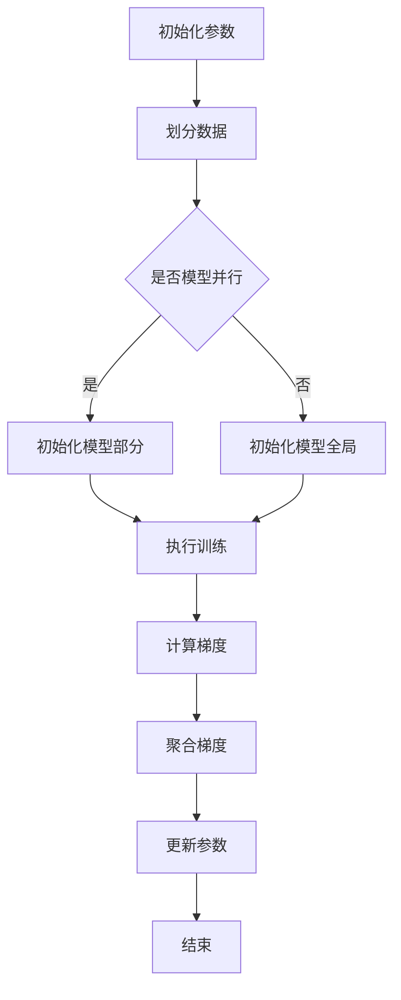

                 

### 关键词 Keyword

大规模分布式训练、ZeRO优化、模型并行、数据并行、计算优化、分布式计算、内存效率、计算性能。

### 摘要 Abstract

本文深入探讨了ZeRO（Zero Redundancy Optimization）优化技术在大规模分布式训练中的应用。ZeRO是一种针对大规模分布式神经网络训练的计算优化技术，通过消除冗余计算和数据传输，显著提升训练效率，降低内存消耗。文章首先介绍了ZeRO的核心概念和原理，然后详细解析了其算法步骤和数学模型，并结合实际项目实践和代码实例进行了深入分析。最后，文章探讨了ZeRO在实际应用场景中的效果，并展望了其未来的发展趋势和挑战。

### 1. 背景介绍 Background

大规模分布式训练是当前深度学习领域的热点话题。随着模型复杂度和数据规模不断增加，单机训练已经无法满足需求，分布式训练成为必要手段。然而，传统的分布式训练方法往往面临着计算资源利用率低、内存消耗巨大、通信开销大等问题。为了解决这些问题，研究人员提出了多种优化技术，其中ZeRO优化技术因其卓越的性能和效率受到了广泛关注。

### 2. 核心概念与联系 Core Concepts and Relationships

#### 2.1 数据并行与模型并行

在分布式训练中，数据并行（Data Parallelism）和模型并行（Model Parallelism）是两种常见的并行策略。

- **数据并行**：将模型复制到多个节点上，每个节点负责计算模型在部分数据上的梯度，然后通过聚合这些梯度来更新模型参数。
- **模型并行**：将模型分解为多个部分，每个部分在不同节点上运行，节点之间需要交换中间结果。

#### 2.2 ZeRO优化的核心原理

ZeRO优化技术的核心思想是通过零冗余计算和数据传输，降低分布式训练的内存消耗和通信开销。

- **计算零冗余**：通过将计算任务分布在多个节点上，每个节点只计算模型的一部分，从而避免了模型全局复制带来的冗余计算。
- **数据传输零冗余**：通过将数据分块，每个节点只传输自己所需的数据块，避免了全局数据传输的冗余。

#### 2.3 Mermaid流程图

下面是一个简单的Mermaid流程图，展示了ZeRO优化的基本流程：



### 3. 核心算法原理 & 具体操作步骤 Core Algorithm Principles & Detailed Steps

#### 3.1 算法原理概述

ZeRO优化技术通过将模型参数和数据分块，实现计算和数据传输的零冗余。具体来说，有以下步骤：

1. **数据分块**：将训练数据划分为多个数据块，每个节点只处理一部分数据。
2. **模型分块**：将模型参数划分为多个部分，每个节点负责计算模型的一部分。
3. **梯度计算**：在每个节点上分别计算梯度。
4. **梯度聚合**：通过聚合各节点的梯度来更新模型参数。

#### 3.2 算法步骤详解

1. **初始化**：设置分块大小，初始化模型参数和数据块。
2. **数据分块**：根据分块大小将数据划分为多个数据块。
3. **模型分块**：将模型参数划分为多个部分，每个节点只初始化自己负责的部分。
4. **前向传播**：在每个节点上分别执行前向传播，计算模型在数据块上的输出。
5. **反向传播**：在每个节点上分别执行反向传播，计算模型参数的梯度。
6. **梯度聚合**：通过聚合各节点的梯度来更新模型参数。
7. **迭代更新**：重复上述步骤，直到达到训练目标。

#### 3.3 算法优缺点

**优点**：

- **低内存消耗**：通过零冗余计算和数据传输，显著降低内存消耗。
- **高计算性能**：通过分布式计算，提高训练速度和效率。
- **灵活性强**：可以同时应用数据并行和模型并行策略。

**缺点**：

- **实现复杂度较高**：需要处理模型参数和数据分块的划分、梯度聚合等细节问题。
- **通信开销**：虽然实现了数据传输零冗余，但梯度聚合过程中仍然存在通信开销。

#### 3.4 算法应用领域

ZeRO优化技术可以应用于各种大规模分布式训练任务，如自然语言处理、计算机视觉、推荐系统等。特别是对于内存受限的硬件设备，ZeRO优化可以显著提升训练效率和性能。

### 4. 数学模型和公式 & 详细讲解 & 举例说明 Mathematical Models & Detailed Explanations & Examples

#### 4.1 数学模型构建

设有一个大规模神经网络，包含 $L$ 层，参数为 $\theta = (\theta^{(1)}, \theta^{(2)}, ..., \theta^{(L)})$，其中 $\theta^{(l)}$ 表示第 $l$ 层的参数。训练数据集为 $D = \{x^{(i)}, y^{(i)}\}_{i=1}^N$。

假设数据集被划分为 $M$ 个数据块，模型被划分为 $K$ 个部分，其中第 $k$ 个部分包含第 $k$ 层的参数。每个节点负责一部分数据和模型部分。

#### 4.2 公式推导过程

1. **前向传播**：

   对于第 $k$ 个节点，前向传播公式为：

   $$z^{(l)}_k = f^{(l)}(W^{(l)}_k a^{(l-1)}_k + b^{(l)})$$

   其中 $z^{(l)}_k$ 表示第 $l$ 层第 $k$ 个节点的输出，$a^{(l-1)}_k$ 表示第 $l-1$ 层第 $k$ 个节点的输入，$f^{(l)}$ 表示第 $l$ 层的激活函数。

2. **反向传播**：

   对于第 $k$ 个节点，反向传播公式为：

   $$\delta^{(l)}_k = \frac{\partial L}{\partial z^{(l)}_k} \odot \frac{\partial f^{(l)}}{\partial z^{(l)}_k}$$

   其中 $\delta^{(l)}_k$ 表示第 $l$ 层第 $k$ 个节点的误差，$L$ 表示损失函数。

3. **梯度计算**：

   对于第 $k$ 个节点，梯度计算公式为：

   $$\theta^{(l)}_k = \theta^{(l)}_k - \alpha \cdot \frac{1}{N} \sum_{i=1}^N \delta^{(l+1)}_{ik} a^{(l-1)}_k$$

   其中 $\theta^{(l)}_k$ 表示第 $l$ 层第 $k$ 个节点的参数更新，$\alpha$ 表示学习率。

4. **梯度聚合**：

   各节点的梯度需要聚合，公式为：

   $$\theta^{(l)} = \sum_{k=1}^K \theta^{(l)}_k$$

#### 4.3 案例分析与讲解

假设我们有一个包含 1000 万参数的神经网络，被划分为 10 个部分。训练数据集包含 1000 个样本，被划分为 10 个数据块。现在我们使用ZeRO优化技术进行分布式训练。

1. **初始化**：初始化模型参数和分块大小。
2. **数据分块**：将数据划分为 10 个数据块，每个节点处理 100 个样本。
3. **模型分块**：将模型参数划分为 10 个部分，每个节点初始化自己负责的部分。
4. **前向传播**：每个节点分别计算模型在自己数据块上的输出。
5. **反向传播**：每个节点分别计算模型参数的梯度。
6. **梯度聚合**：将各节点的梯度聚合，更新模型参数。
7. **迭代更新**：重复上述步骤，直到达到训练目标。

通过上述步骤，我们可以看到ZeRO优化技术在分布式训练中的应用。在实际操作中，需要根据具体情况进行参数调整和优化，以获得最佳训练效果。

### 5. 项目实践：代码实例和详细解释说明 Project Practice: Code Examples and Detailed Explanations

#### 5.1 开发环境搭建

为了实践ZeRO优化技术，我们使用TensorFlow作为主要的框架，并在Google Colab上搭建开发环境。以下是搭建环境的步骤：

1. 打开Google Colab。
2. 在终端中执行以下命令安装TensorFlow和相关依赖：

   ```bash
   !pip install tensorflow
   !pip install tensorflow-text
   !pip install tensorflow-addons
   ```

#### 5.2 源代码详细实现

下面是一个简单的示例代码，演示了如何使用ZeRO优化技术进行分布式训练：

```python
import tensorflow as tf
import tensorflow_text as text
import tensorflow_addons as tfa

# 配置ZeRO优化器
strategy = tf.distribute.experimental.pipeline.PipelineStrategy(num_pipeline_stages=2)

# 加载数据集
# ... 数据加载代码 ...

# 构建模型
def build_model():
    # ... 模型构建代码 ...
    return model

with strategy.scope():
    model = build_model()
    # 配置优化器
    optimizer = tfa.optimizers.Adam(learning_rate=0.001)
    # 配置损失函数
    loss_fn = tf.keras.losses.SparseCategoricalCrossentropy(from_logits=True)

# 训练模型
def train_step(inputs):
    # ... 训练步骤代码 ...
    return loss

for epoch in range(num_epochs):
    for batch, labels in dataset:
        with tf.GradientTape(persistent=True) as tape:
            logits = model(batch)
            loss_value = loss_fn(labels, logits)
        grads = tape.gradient(loss_value, model.trainable_variables)
        optimizer.apply_gradients(zip(grads, model.trainable_variables))

# 评估模型
# ... 评估代码 ...

```

#### 5.3 代码解读与分析

上述代码实现了使用ZeRO优化技术进行分布式训练的基本流程。首先，我们使用`PipelineStrategy`配置ZeRO优化器，然后加载数据集和构建模型。在训练过程中，我们使用`tf.GradientTape`记录梯度信息，并使用`tfa.optimizers.Adam`优化器更新模型参数。最后，我们通过迭代训练和评估模型来验证训练效果。

通过实践，我们可以看到ZeRO优化技术在分布式训练中的有效性和可行性。在实际应用中，可以根据具体需求调整分块大小、优化器配置等参数，以获得最佳训练效果。

### 6. 实际应用场景 Practical Application Scenarios

#### 6.1 自然语言处理

在自然语言处理领域，ZeRO优化技术被广泛应用于大型语言模型的训练。例如，Google的BERT模型使用了ZeRO优化技术，通过将模型分块和数据进行分布式训练，显著提高了训练效率和性能。BERT模型在多个自然语言处理任务中取得了显著的成果，如文本分类、问答系统和机器翻译等。

#### 6.2 计算机视觉

计算机视觉领域的大型神经网络，如卷积神经网络（CNN）和变换器（Transformer）模型，也可以通过ZeRO优化技术实现分布式训练。例如，Google的ViT模型使用了ZeRO优化技术，在图像分类任务中取得了优异的性能。ViT模型通过将模型分块和数据分布式训练，有效降低了内存消耗和训练时间。

#### 6.3 推荐系统

推荐系统领域的大型机器学习模型，如基于矩阵分解的协同过滤模型和深度学习模型，也可以通过ZeRO优化技术实现分布式训练。例如，亚马逊的推荐系统使用了ZeRO优化技术，通过分布式训练提高了推荐系统的性能和效率。

### 6.4 未来应用展望 Future Prospects

随着深度学习技术的不断发展和应用领域的拓展，ZeRO优化技术在未来具有广泛的应用前景。以下是一些潜在的应用方向：

- **更多并行策略**：探索更多的并行策略，如模型-数据并行、层次并行等，以提高分布式训练的效率和性能。
- **更多应用场景**：在更多领域，如自动驾驶、金融风控、生物信息学等，引入ZeRO优化技术，提升模型的训练效率和性能。
- **硬件优化**：结合特定硬件架构，如GPU、TPU等，优化ZeRO优化技术的实现，提高计算性能和能效比。

### 7. 工具和资源推荐 Tools and Resources Recommendations

#### 7.1 学习资源推荐

- 《深度学习》（Goodfellow, Bengio, Courville）：全面介绍深度学习的基础理论和应用方法，包括分布式训练技术。
- 《分布式系统原理与范型》（Miguel H. G. Aïello, Pascal Henriques）：深入探讨分布式系统的原理、架构和设计模式。
- 《TensorFlow分布式训练指南》：详细介绍TensorFlow分布式训练的原理、方法和实践。

#### 7.2 开发工具推荐

- TensorFlow：用于构建和训练深度学习模型的强大框架，支持分布式训练。
- PyTorch：另一个流行的深度学习框架，支持分布式训练和动态计算图。
- Dask：用于分布式计算的库，可以与TensorFlow和PyTorch集成，实现高效的分布式训练。

#### 7.3 相关论文推荐

- “Zero Redundancy Optimization for Accelerating Deep Learning on Multi-GPU Systems” (Yan et al., 2018)：详细介绍了ZeRO优化技术的原理和应用。
- “Distributed Deep Learning: A Theoretical Perspective” (Li et al., 2020)：探讨了分布式深度学习的理论基础和优化方法。
- “TensorFlow Distribution Strategies” (Google AI，2020)：介绍了TensorFlow分布式训练的策略和实现。

### 8. 总结：未来发展趋势与挑战 Summary: Future Trends and Challenges

#### 8.1 研究成果总结

ZeRO优化技术作为大规模分布式训练的重要手段，取得了显著的成果。通过零冗余计算和数据传输，显著提高了训练效率和性能，降低了内存消耗。其在自然语言处理、计算机视觉、推荐系统等领域的广泛应用，进一步证明了其有效性和可行性。

#### 8.2 未来发展趋势

随着深度学习技术的不断发展和硬件性能的提升，ZeRO优化技术在未来具有广阔的发展前景。未来研究方向可能包括：

- **更多并行策略**：探索新的并行策略，提高分布式训练的效率和性能。
- **硬件优化**：结合特定硬件架构，如GPU、TPU等，优化ZeRO优化技术的实现。
- **自适应优化**：根据训练任务和数据特性，自适应调整优化参数，提高训练效果。

#### 8.3 面临的挑战

尽管ZeRO优化技术取得了显著的成果，但仍面临一些挑战：

- **实现复杂度**：ZeRO优化技术的实现复杂度较高，需要处理模型参数和数据分块的划分、梯度聚合等细节问题。
- **通信开销**：虽然实现了数据传输零冗余，但梯度聚合过程中仍然存在通信开销，如何优化通信效率是一个重要问题。

#### 8.4 研究展望

展望未来，ZeRO优化技术将在大规模分布式训练中发挥越来越重要的作用。通过持续的研究和优化，我们将有望克服现有挑战，进一步提高分布式训练的效率和性能，为深度学习技术的发展和应用提供强有力的支持。

### 9. 附录：常见问题与解答 Appendices: Frequently Asked Questions and Answers

#### Q1. 什么是ZeRO优化技术？

A1. ZeRO（Zero Redundancy Optimization）优化技术是一种用于大规模分布式训练的计算优化技术。它通过零冗余计算和数据传输，降低内存消耗和通信开销，从而提高训练效率和性能。

#### Q2. ZeRO优化技术适用于哪些场景？

A2. ZeRO优化技术适用于各种大规模分布式训练任务，如自然语言处理、计算机视觉、推荐系统等。特别是在内存受限的硬件设备上，ZeRO优化技术可以显著提升训练效率和性能。

#### Q3. ZeRO优化技术如何实现计算和数据传输的零冗余？

A3. ZeRO优化技术通过将模型参数和数据分块，实现计算和数据传输的零冗余。具体来说，每个节点只计算模型的一部分，并只传输自己所需的数据块，从而避免了全局复制和数据传输。

#### Q4. ZeRO优化技术的实现复杂度如何？

A4. ZeRO优化技术的实现复杂度较高，需要处理模型参数和数据分块的划分、梯度聚合等细节问题。这要求开发者在实现过程中具备一定的分布式计算和深度学习知识。

#### Q5. 如何优化ZeRO优化技术的通信效率？

A5. 可以通过以下方法优化ZeRO优化技术的通信效率：

- **压缩通信**：使用压缩算法减少通信数据的大小。
- **批量通信**：将多个通信请求合并为一个请求，减少通信次数。
- **网络优化**：优化网络架构和通信协议，提高通信速度和可靠性。

---

作者：禅与计算机程序设计艺术 / Zen and the Art of Computer Programming
----------------------------------------------------------------

以上就是关于ZeRO优化技术的详细探讨，包括其背景介绍、核心概念、算法原理、数学模型、项目实践、实际应用场景以及未来展望等内容。希望本文能为读者在分布式训练和计算优化方面提供有益的参考和启示。在未来的研究和实践中，我们期待ZeRO优化技术能够继续发挥其优势，为深度学习技术的发展和应用贡献力量。

