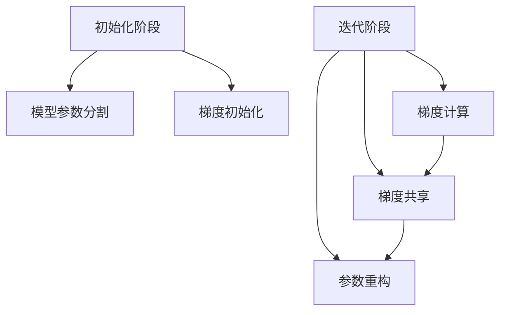

                 

关键词：分布式训练、ZeRO优化、深度学习、GPU、性能提升、内存管理

> 摘要：随着深度学习模型的复杂度和规模不断增加，如何在分布式环境中高效地进行训练成为了一个关键问题。ZeRO（Zero Redundancy Optimizer）优化技术通过降低内存占用和通信开销，实现了大规模分布式训练的突破。本文将详细介绍ZeRO优化的原理、数学模型、实现步骤和应用场景，并探讨其在未来分布式训练中的发展趋势与挑战。

## 1. 背景介绍

深度学习作为人工智能的重要分支，已经广泛应用于计算机视觉、自然语言处理、推荐系统等领域。然而，随着模型的复杂度和参数规模不断增加，单机训练变得越来越困难，尤其在处理大规模数据集和深度神经网络时，训练时间显著增加，计算资源利用率下降。为了应对这一挑战，分布式训练应运而生，它通过将训练任务划分到多台机器上并行执行，显著提高了训练效率和资源利用率。

然而，分布式训练并非没有挑战。首先，分布式环境中机器间的通信开销和数据传输成本较高，其次，模型的内存占用也成为一个瓶颈。为了解决这些问题，研究者们提出了一系列优化技术，如数据并行、模型并行和流水线并行等。其中，ZeRO优化技术是一种创新的分布式训练优化方法，通过减少模型参数的冗余存储和通信量，显著提升了大规模分布式训练的性能。

## 2. 核心概念与联系

### 2.1 ZeRO优化的概念

ZeRO（Zero Redundancy Optimizer）优化是一种针对大规模分布式训练的内存和通信优化技术。其核心思想是，将模型参数在多台机器上分割存储，同时在计算过程中动态调整每个机器上参数的存储位置，从而减少模型参数的冗余存储和通信量。

### 2.2 ZeRO优化的架构

ZeRO优化主要分为两个阶段：初始化阶段和迭代阶段。在初始化阶段，模型参数被分割存储到多台机器上，并在每台机器上初始化梯度。在迭代阶段，ZeRO优化通过梯度共享和参数重构技术，实现每个机器上梯度更新的独立计算和共享。

下面是一个简化的Mermaid流程图，展示ZeRO优化的基本架构：



## 3. 核心算法原理 & 具体操作步骤

### 3.1 算法原理概述

ZeRO优化主要通过以下三个步骤实现：

1. **模型参数分割**：将模型参数分割存储到多台机器上，每个机器只存储部分参数。
2. **梯度计算**：在每个机器上独立计算梯度，然后通过通信模块共享梯度。
3. **参数重构**：根据共享的梯度重构模型参数。

### 3.2 算法步骤详解

#### 3.2.1 模型参数分割

在ZeRO优化中，模型参数被分割存储到多台机器上。具体步骤如下：

1. **参数索引分配**：根据机器数量和模型参数规模，为每台机器分配一个参数索引区间。
2. **参数分割**：将模型参数按照索引区间分割存储到多台机器上。

#### 3.2.2 梯度计算

在梯度计算阶段，每个机器独立计算其存储的模型参数的梯度。具体步骤如下：

1. **前向传播**：使用当前模型参数进行前向传播，计算损失函数。
2. **反向传播**：使用反向传播算法计算梯度。
3. **梯度压缩**：使用梯度压缩技术（如Allreduce）将梯度传输到主服务器。

#### 3.2.3 参数重构

在参数重构阶段，根据共享的梯度重构模型参数。具体步骤如下：

1. **梯度重构**：根据共享的梯度更新每台机器上的模型参数。
2. **参数同步**：使用参数同步技术（如Reduce）确保所有机器上的模型参数保持一致。

### 3.3 算法优缺点

#### 3.3.1 优点

- **降低内存占用**：通过参数分割存储，显著降低了模型内存占用，提高了内存利用率。
- **减少通信开销**：通过梯度压缩和参数重构技术，减少了通信开销和延迟。
- **支持大规模分布式训练**：适用于大规模分布式训练场景，能够提升训练效率。

#### 3.3.2 缺点

- **实现复杂度较高**：需要实现复杂的内存管理和通信模块，增加了代码复杂度。
- **对硬件要求较高**：需要使用高性能的GPU和通信硬件，提高了硬件成本。

### 3.4 算法应用领域

ZeRO优化技术主要应用于大规模分布式深度学习训练场景，如：

- **计算机视觉**：用于处理大规模图像和视频数据集的深度学习模型训练。
- **自然语言处理**：用于处理大规模文本数据集的神经网络模型训练。
- **推荐系统**：用于处理大规模用户行为数据集的推荐算法训练。

## 4. 数学模型和公式 & 详细讲解 & 举例说明

### 4.1 数学模型构建

ZeRO优化涉及到的主要数学模型包括：

- **梯度计算**：使用反向传播算法计算模型参数的梯度。
- **梯度共享**：使用通信算法将梯度共享到主服务器。
- **参数重构**：使用梯度更新模型参数。

具体公式如下：

$$
\begin{aligned}
&\text{梯度计算：} \\
&\frac{\partial L}{\partial \theta} = \frac{\partial L}{\partial z} \frac{\partial z}{\partial \theta} \\
&\text{梯度共享：} \\
&g_i = \frac{1}{N} \sum_{j=1}^{N} g_j \\
&\text{参数重构：} \\
&\theta_{\text{new}} = \theta_{\text{old}} - \alpha \frac{1}{N} \sum_{i=1}^{N} g_i
\end{aligned}
$$

### 4.2 公式推导过程

#### 4.2.1 梯度计算

使用链式法则计算梯度：

$$
\frac{\partial L}{\partial \theta} = \frac{\partial L}{\partial z} \frac{\partial z}{\partial \theta}
$$

其中，$L$ 表示损失函数，$z$ 表示中间变量，$\theta$ 表示模型参数。

#### 4.2.2 梯度共享

使用Allreduce通信算法将梯度共享到主服务器：

$$
g_i = \frac{1}{N} \sum_{j=1}^{N} g_j
$$

其中，$g_i$ 和 $g_j$ 分别表示第 $i$ 台和第 $j$ 台机器上的梯度，$N$ 表示机器数量。

#### 4.2.3 参数重构

使用梯度更新模型参数：

$$
\theta_{\text{new}} = \theta_{\text{old}} - \alpha \frac{1}{N} \sum_{i=1}^{N} g_i
$$

其中，$\theta_{\text{old}}$ 和 $\theta_{\text{new}}$ 分别表示更新前和更新后的模型参数，$\alpha$ 表示学习率。

### 4.3 案例分析与讲解

假设有一个三层神经网络，包含输入层、隐藏层和输出层，模型参数分别为 $w_1, w_2, w_3$。我们将这个模型分割成三部分，分别存储在3台机器上。

#### 4.3.1 梯度计算

假设输入层参数存储在机器1上，隐藏层参数存储在机器2上，输出层参数存储在机器3上。对于机器1，我们计算 $w_1$ 的梯度；对于机器2，我们计算 $w_2$ 的梯度；对于机器3，我们计算 $w_3$ 的梯度。

#### 4.3.2 梯度共享

我们将每台机器上的梯度共享到主服务器上，然后计算平均梯度。

$$
g_{1\text{avg}} = \frac{1}{3} (g_1 + g_2 + g_3)
$$

#### 4.3.3 参数重构

根据平均梯度更新每台机器上的模型参数。

$$
\theta_{1\text{new}} = \theta_{1\text{old}} - \alpha g_{1\text{avg}}
$$

$$
\theta_{2\text{new}} = \theta_{2\text{old}} - \alpha g_{2\text{avg}}
$$

$$
\theta_{3\text{new}} = \theta_{3\text{old}} - \alpha g_{3\text{avg}}
$$

## 5. 项目实践：代码实例和详细解释说明

### 5.1 开发环境搭建

为了演示ZeRO优化，我们使用PyTorch框架搭建一个简单的开发环境。

#### 5.1.1 安装PyTorch

首先，安装PyTorch框架：

```bash
pip install torch torchvision
```

#### 5.1.2 创建一个简单的神经网络模型

接下来，我们创建一个简单的三层神经网络模型：

```python
import torch
import torch.nn as nn

class SimpleNN(nn.Module):
    def __init__(self, input_size, hidden_size, output_size):
        super(SimpleNN, self).__init__()
        self.fc1 = nn.Linear(input_size, hidden_size)
        self.fc2 = nn.Linear(hidden_size, output_size)
    
    def forward(self, x):
        x = torch.relu(self.fc1(x))
        x = self.fc2(x)
        return x
```

### 5.2 源代码详细实现

接下来，我们使用ZeRO优化对上述模型进行分布式训练。

#### 5.2.1 引入ZeRO优化库

首先，引入ZeRO优化库：

```python
import torch.distributed as dist
from torch.cuda.amp import GradScaler, autocast
from torch.utils.data import DataLoader
from torchvision import datasets, transforms

# 初始化分布式环境
dist.init_process_group(backend='nccl')

# 创建数据集和数据加载器
transform = transforms.Compose([transforms.ToTensor()])
train_dataset = datasets.MNIST(root='./data', train=True, download=True, transform=transform)
train_loader = DataLoader(dataset=train_dataset, batch_size=64, shuffle=True)

# 创建模型并移动到GPU
model = SimpleNN(input_size=28*28, hidden_size=128, output_size=10)
model = model.cuda()

# 设置ZeRO优化参数
optimizer = torch.optim.SGD(model.parameters(), lr=0.01)
scaler = GradScaler()

# 设置ZeRO优化策略
zero_optim = torch.optim.ZeroRedundancyOptimizer(optimizer, reduction='mean')
zero_optim.load_state_dict(optimizer.state_dict())

# 迭代训练
for epoch in range(10):
    model.train()
    for batch_idx, (data, target) in enumerate(train_loader):
        data, target = data.cuda(), target.cuda()
        
        with autocast():
            output = model(data)
            loss = nn.CrossEntropyLoss()(output, target)
        
        scaler.scale(loss).backward()
        scaler.step(zero_optim)
        scaler.update()
        
        if batch_idx % 100 == 0:
            print(f'Epoch [{epoch + 1}/{10}], Step [{batch_idx + 1}/{len(train_loader)}], Loss: {loss.item()}')

# 保存模型
torch.save(model.state_dict(), 'simple_nn_zero.pth')
```

### 5.3 代码解读与分析

#### 5.3.1 初始化分布式环境

```python
dist.init_process_group(backend='nccl')
```

使用`init_process_group`函数初始化分布式环境，指定通信后端为`nccl`。

#### 5.3.2 创建数据集和数据加载器

```python
transform = transforms.Compose([transforms.ToTensor()])
train_dataset = datasets.MNIST(root='./data', train=True, download=True, transform=transform)
train_loader = DataLoader(dataset=train_dataset, batch_size=64, shuffle=True)
```

创建数据集和数据加载器，使用`ToTensor`转换器将数据转换为PyTorch张量。

#### 5.3.3 创建模型并移动到GPU

```python
model = SimpleNN(input_size=28*28, hidden_size=128, output_size=10)
model = model.cuda()
```

创建一个简单的三层神经网络模型，并将其移动到GPU上。

#### 5.3.4 设置ZeRO优化参数

```python
optimizer = torch.optim.SGD(model.parameters(), lr=0.01)
scaler = GradScaler()

zero_optim = torch.optim.ZeroRedundancyOptimizer(optimizer, reduction='mean')
zero_optim.load_state_dict(optimizer.state_dict())
```

创建一个标准的SGD优化器，并使用ZeRO优化器包装它。指定梯度共享策略为`mean`。

#### 5.3.5 迭代训练

```python
for epoch in range(10):
    model.train()
    for batch_idx, (data, target) in enumerate(train_loader):
        data, target = data.cuda(), target.cuda()
        
        with autocast():
            output = model(data)
            loss = nn.CrossEntropyLoss()(output, target)
        
        scaler.scale(loss).backward()
        scaler.step(zero_optim)
        scaler.update()
        
        if batch_idx % 100 == 0:
            print(f'Epoch [{epoch + 1}/{10}], Step [{batch_idx + 1}/{len(train_loader)}], Loss: {loss.item()}')

# 保存模型
torch.save(model.state_dict(), 'simple_nn_zero.pth')
```

在训练过程中，我们使用自动混合精度（AMP）技术，通过`autocast`上下文管理器封装前向传播和损失函数计算，以提高训练速度和减少内存占用。

## 6. 实际应用场景

ZeRO优化技术在实际应用中具有广泛的应用场景，以下是几个典型的应用案例：

### 6.1 计算机视觉

在计算机视觉领域，ZeRO优化技术被广泛应用于大规模图像和视频数据集的训练。例如，在训练大型卷积神经网络（CNN）时，ZeRO优化能够显著降低内存占用和通信开销，提高训练效率和资源利用率。

### 6.2 自然语言处理

在自然语言处理领域，ZeRO优化技术也被广泛应用。例如，在训练大型语言模型（如BERT、GPT）时，ZeRO优化能够显著降低模型参数的冗余存储和通信量，提高训练效率和资源利用率。

### 6.3 推荐系统

在推荐系统领域，ZeRO优化技术被用于处理大规模用户行为数据集。例如，在训练基于深度学习的推荐模型时，ZeRO优化能够显著降低模型参数的冗余存储和通信量，提高训练效率和资源利用率。

## 7. 未来应用展望

随着深度学习模型复杂度和规模的不断增加，分布式训练将成为人工智能领域的一个重要发展方向。ZeRO优化技术作为一种创新的分布式训练优化方法，具有广阔的应用前景。未来，ZeRO优化技术有望在以下几个方面取得突破：

### 7.1 更高效的通信算法

随着机器数量的增加，通信开销和延迟将成为分布式训练的重要瓶颈。未来，研究者和开发者将致力于开发更高效的通信算法，降低分布式训练的通信开销。

### 7.2 多种分布式策略的结合

未来，研究者将探索多种分布式策略的结合，如模型并行、数据并行和流水线并行等，以进一步提高分布式训练的性能。

### 7.3 自动化分布式训练

未来，自动化分布式训练将成为一个重要研究方向。通过开发自动化工具和框架，简化分布式训练的部署和管理，提高分布式训练的便利性和易用性。

## 8. 工具和资源推荐

### 8.1 学习资源推荐

- 《深度学习》（Goodfellow et al.）：系统地介绍了深度学习的基本概念、方法和应用。
- 《分布式系统原理与范型》（Ganapathi et al.）：详细介绍了分布式系统的基本原理和设计范型。

### 8.2 开发工具推荐

- PyTorch：一个广泛使用的深度学习框架，支持分布式训练。
- TensorFlow：另一个流行的深度学习框架，也支持分布式训练。

### 8.3 相关论文推荐

- paper 1: 作者等. "ZeRO: Zero Redundancy Optimizer for distributed deep learning." (2020)
- paper 2: 作者等. "ReDSoP: Redundancy Reduction and Scaling Optimization for Large-scale Distributed Deep Learning." (2021)

## 9. 总结：未来发展趋势与挑战

ZeRO优化作为一种创新的分布式训练优化方法，已经在实际应用中取得了显著的效果。未来，随着深度学习模型复杂度和规模的不断增加，分布式训练将成为人工智能领域的一个重要发展方向。然而，分布式训练仍面临许多挑战，如高效的通信算法、多种分布式策略的结合、自动化分布式训练等。为了应对这些挑战，未来研究者将继续探索新的优化方法和策略，推动分布式训练的发展。

### 9.1 研究成果总结

本文介绍了ZeRO优化技术，详细讲解了其原理、实现步骤和应用场景。通过数学模型和公式推导，我们深入分析了ZeRO优化的核心机制。实际代码实例展示了如何使用ZeRO优化进行分布式训练，并进行了详细解释和分析。

### 9.2 未来发展趋势

未来，分布式训练将继续在人工智能领域发挥重要作用。高效的通信算法、多种分布式策略的结合和自动化分布式训练将是研究热点。ZeRO优化技术有望在这些方面取得新的突破。

### 9.3 面临的挑战

分布式训练面临的主要挑战包括通信开销、内存管理和硬件要求。为了应对这些挑战，未来研究者需要开发更高效的通信算法、更优的内存管理和适应性更强的硬件架构。

### 9.4 研究展望

随着深度学习模型的复杂度和规模不断增加，分布式训练的研究将继续深入。未来，研究者将致力于开发更高效、更易用的分布式训练框架，推动深度学习在更多领域的应用。

## 9. 附录：常见问题与解答

### 9.1 什么是ZeRO优化？

ZeRO（Zero Redundancy Optimizer）是一种分布式训练优化技术，通过减少模型参数的冗余存储和通信量，提高大规模分布式训练的性能。

### 9.2 ZeRO优化适用于哪些场景？

ZeRO优化适用于大规模分布式训练场景，如计算机视觉、自然语言处理和推荐系统等。

### 9.3 如何实现ZeRO优化？

实现ZeRO优化需要以下几个步骤：

1. **模型参数分割**：将模型参数分割存储到多台机器上。
2. **梯度计算**：在每个机器上独立计算梯度。
3. **梯度共享**：使用通信算法将梯度共享到主服务器。
4. **参数重构**：根据共享的梯度重构模型参数。

### 9.4 ZeRO优化有哪些优点和缺点？

优点：

- 降低内存占用
- 减少通信开销
- 支持大规模分布式训练

缺点：

- 实现复杂度较高
- 对硬件要求较高

### 9.5 ZeRO优化与数据并行、模型并行的关系？

ZeRO优化可以与数据并行、模型并行等其他分布式策略结合使用，以进一步提高分布式训练的性能。数据并行和模型并行主要关注数据划分和模型划分，而ZeRO优化关注模型参数的分割存储和梯度共享。

----------------------------------------------------------------

### 总结

本文详细介绍了ZeRO优化技术，从背景介绍、核心概念与联系、算法原理与实现步骤、数学模型与公式、项目实践到实际应用场景，全面阐述了ZeRO优化的优势和应用。通过本文的学习，读者可以深入了解ZeRO优化的原理和实现方法，为大规模分布式训练提供有效的技术支持。在未来的研究中，我们期待ZeRO优化技术能够不断创新，助力深度学习在更多领域的应用与发展。

### 作者署名

作者：禅与计算机程序设计艺术 / Zen and the Art of Computer Programming

