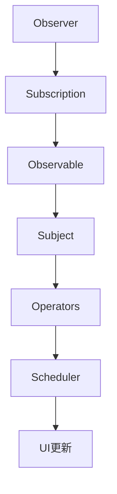

                 

关键词：iOS、响应式编程、RxSwift、异步编程、事件驱动、流式数据处理

> 摘要：本文将深入探讨iOS平台上的响应式编程范式，特别是RxSwift框架的使用。文章首先介绍响应式编程的基本概念，然后详细讲解RxSwift的核心原理、架构和实际操作步骤。通过数学模型、项目实践和实际应用场景的深入剖析，读者将掌握如何有效地在iOS开发中使用RxSwift实现复杂的数据处理和响应式界面更新。最后，本文将对未来应用展望、工具资源推荐以及面临的挑战和展望进行探讨。

## 1. 背景介绍

在iOS开发领域，传统的编程范式主要以同步阻塞为主。然而，随着移动设备和应用程序的复杂性增加，传统的编程方式开始暴露出一些问题。首先，同步阻塞会导致界面渲染滞后，影响用户体验。其次，异步编程虽然能够解决界面渲染的问题，但会导致代码结构复杂，难以维护。为了解决这些问题，响应式编程应运而生。

响应式编程是一种基于事件驱动的编程范式，其核心思想是数据驱动视图更新。在这种范式下，程序的状态由外部事件（如用户交互、网络响应等）驱动，而不仅仅是通过同步函数调用。这种编程范式使得程序更具弹性和可扩展性，能够更好地处理并发和异步操作。

### 1.1 响应式编程的起源和发展

响应式编程最早可以追溯到20世纪70年代的函数式编程领域。当时的函数式编程语言如Haskell、ML等，开始引入了响应式编程的概念，即通过函数来处理数据流的变化。随着时间的推移，响应式编程逐渐在其他编程语言中得到了应用，如Scala、JavaScript和C#等。

在iOS平台，响应式编程的兴起得益于苹果公司在Swift语言中引入了响应式编程的概念。Swift的发布为iOS开发者提供了更简洁、更安全的编程方式，而响应式编程则是这种编程方式的精髓之一。为了更方便地实现响应式编程，社区中涌现出了许多响应式编程框架，如React、MVVM、ReactiveCocoa等。其中，RxSwift作为ReactiveCocoa的Swift版本，成为了iOS开发者广泛使用的响应式编程框架。

### 1.2 响应式编程的优势

响应式编程相对于传统的同步阻塞编程和异步编程具有明显的优势：

1. **易于维护和测试**：响应式编程通过将状态和行为分离，使得代码更易于维护和测试。开发者可以独立地修改状态和行为，而不必担心它们之间的耦合。
2. **异步处理能力**：响应式编程能够更好地处理异步操作，使得程序在处理大量并发任务时更加高效。
3. **可扩展性和灵活性**：响应式编程使得程序更具可扩展性和灵活性，能够轻松地处理复杂的数据流和事件。
4. **界面更新高效**：响应式编程能够实时响应数据流的变化，从而实现界面的高效更新，提升用户体验。

## 2. 核心概念与联系

### 2.1 响应式编程的核心概念

在响应式编程中，有几个核心概念需要理解：

1. **Observable**（可观察对象）：Observable是响应式编程中的基本单位，它代表了一个数据流或事件流。当数据或事件发生变化时，Observable会通知观察者（Observer）进行相应的操作。
2. **Observer**（观察者）：Observer是订阅（Subscribe）Observable的对象，它会接收Observable发送的数据或事件，并进行相应的处理。
3. **Subscription**（订阅）：Subscription表示Observer对Observable的订阅关系，它负责在Observable发送数据或事件时，通知Observer。
4. **操作符**（Operator）：操作符是用于对Observable进行转换或操作的函数，如map、filter、flatMap等。

### 2.2 RxSwift的架构

RxSwift是基于ReactiveCocoa的Swift响应式编程框架。它继承了响应式编程的核心概念，并提供了一套丰富且强大的操作符和函数，使得在Swift中实现响应式编程更加简便。RxSwift的架构主要包括以下几个核心部分：

1. **Observables**：RxSwift中的Observables代表数据流或事件流，它们可以生成并处理序列化数据。例如，一个Observable可以表示一个按钮的点击事件流。
2. **Schedulers**：Schedulers用于控制Observables的操作在哪个线程上执行。在iOS开发中，经常需要处理主线程和其他线程之间的数据同步，Schedulers能够帮助我们实现这一点。
3. **Operators**：Operators用于对Observables进行转换或操作，如创建新的Observable、过滤数据、映射数据等。
4. **Subject**：Subject是RxSwift中的特殊Observable，它允许其他Observer直接修改其状态。Subject常用于实现事件广播功能。

### 2.3 Mermaid 流程图

为了更好地理解响应式编程的核心概念和RxSwift的架构，下面是一个Mermaid流程图，展示了RxSwift中一些重要的流程和组件。



在这个流程图中，Observer订阅了Observable，并通过Subscription建立联系。当Observable发送数据或事件时，Subscription会通知Observer。Observer可以订阅操作符，对数据进行转换或操作。操作符的结果会通过Scheduler调度到合适的线程上执行，最终实现UI的更新。

## 3. 核心算法原理 & 具体操作步骤

### 3.1 算法原理概述

在响应式编程中，核心算法原理可以概括为以下几个步骤：

1. **创建Observable**：首先需要创建一个Observable，它表示一个数据流或事件流。
2. **订阅Observer**：接着，需要创建一个Observer，订阅这个Observable，并准备好接收数据或事件。
3. **处理数据流**：Observer接收到数据后，可以对其进行处理，如映射（map）、过滤（filter）等。
4. **UI更新**：处理完数据后，可以通过UI框架（如UIKit）更新界面。

### 3.2 算法步骤详解

下面是一个简单的示例，展示了如何使用RxSwift在iOS中实现响应式编程：

#### 3.2.1 创建Observable

首先，我们需要创建一个Observable来表示一个按钮的点击事件流。

```swift
let buttonClicks = Observable.of("Click 1", "Click 2", "Click 3")
```

在这个示例中，我们使用`Observable.of`方法创建了一个包含三个字符串的Observable。

#### 3.2.2 订阅Observer

接下来，我们需要创建一个Observer来订阅这个Observable。

```swift
_ = buttonClicks.subscribe { event in
    switch event {
    case .next(let value):
        print("Received: \(value)")
    case .error(let error):
        print("Error: \(error)")
    case .completed:
        print("Completed")
    }
}
```

在这个示例中，我们使用`subscribe`方法订阅了Observable。在回调中，我们处理了不同类型的事件，如`next`（接收到数据）、`error`（发生错误）和`completed`（完成）。

#### 3.2.3 处理数据流

在Observer的回调中，我们可以对数据流进行处理。例如，可以使用`map`操作符对每个字符串进行映射。

```swift
let mappedClicks = buttonClicks.map { "Mapped: \($0)" }
```

在这个示例中，我们使用`map`操作符将每个字符串映射为一个新的字符串。

#### 3.2.4 UI更新

最后，我们需要通过UI框架更新界面。例如，我们可以将映射后的字符串显示在一个标签（UILabel）上。

```swift
_ = mappedClicks.subscribe { event in
    switch event {
    case .next(let value):
        print("Received: \(value)")
        // 在这里更新UI
        self.label.text = value
    case .error(let error):
        print("Error: \(error)")
    case .completed:
        print("Completed")
    }
}
```

在这个示例中，我们使用`subscribe`方法订阅了MappedClicks，并在接收到数据时更新了标签的文本。

### 3.3 算法优缺点

#### 3.3.1 优点

1. **异步处理能力**：响应式编程能够更好地处理异步操作，提高程序的性能和响应速度。
2. **易于维护和测试**：响应式编程通过将状态和行为分离，使得代码更易于维护和测试。
3. **界面更新高效**：响应式编程能够实时响应数据流的变化，实现界面的高效更新。

#### 3.3.2 缺点

1. **学习曲线较陡峭**：响应式编程需要一定的学习成本，特别是在理解Observable、Observer和操作符等方面。
2. **性能开销**：虽然响应式编程能够提高程序的响应速度，但它在某些情况下可能会带来额外的性能开销。

### 3.4 算法应用领域

响应式编程在iOS开发中具有广泛的应用领域，特别是在以下场景中：

1. **网络请求**：响应式编程能够更好地处理网络请求，实现数据流的管理和错误处理。
2. **用户交互**：响应式编程能够实时响应用户的交互操作，如按钮点击、滑动等。
3. **界面更新**：响应式编程能够实现界面数据的高效更新，提高用户体验。

## 4. 数学模型和公式 & 详细讲解 & 举例说明

在响应式编程中，数学模型和公式扮演着重要的角色。下面我们将介绍一些常见的数学模型和公式，并使用具体的例子进行说明。

### 4.1 数学模型构建

在响应式编程中，常用的数学模型包括：

1. **信号处理模型**：该模型将程序视为一个信号处理系统，数据流被视为信号，而Observer和操作符则是对信号的处理过程。
2. **数据流模型**：该模型将程序视为一个数据流系统，数据流被视为流动的实体，而Observer和操作符则是数据的处理和转换过程。

### 4.2 公式推导过程

在响应式编程中，常用的公式包括：

1. **响应式方程**：该公式描述了Observer和Observable之间的关系。例如，一个Observer订阅了一个Observable，可以使用以下公式表示：

   $$ Observer \ subscribe \ to \ Observable $$

2. **操作符组合公式**：该公式描述了操作符之间的组合关系。例如，可以使用以下公式组合多个操作符：

   $$ map \ (x \ map \ to \ y) \ filter \ (x \ filter \ by \ predicate) $$

### 4.3 案例分析与讲解

下面我们通过一个具体的例子来讲解如何使用数学模型和公式进行响应式编程。

#### 4.3.1 示例：数据流处理

假设我们有一个数据流，其中包含了多个整数。我们需要对这个数据流进行以下操作：

1. **过滤**：只保留大于10的整数。
2. **映射**：将每个整数乘以2。

我们可以使用以下公式进行操作：

$$ filter \ (x \ filter \ by \ x > 10) \ map \ (x \ map \ to \ x \times 2) $$

具体实现如下：

```swift
let numbers = Observable.of(1, 2, 3, 4, 5, 6, 7, 8, 9, 10)
let filteredMappedNumbers = numbers
    .filter { $0 > 10 }
    .map { $0 * 2 }
```

在这个示例中，我们首先使用`filter`操作符过滤掉小于等于10的整数，然后使用`map`操作符将每个整数乘以2。

#### 4.3.2 示例：事件流处理

假设我们有一个事件流，其中包含了多个按钮点击事件。我们需要对这个事件流进行以下操作：

1. **延迟**：在每个按钮点击事件发生后延迟1秒。
2. **映射**：将每个点击事件映射为字符串。

我们可以使用以下公式进行操作：

$$ delay \ (x \ delay \ by \ 1 \ second) \ map \ (x \ map \ to \ "Clicked: \(x) ") $$

具体实现如下：

```swift
let buttonClicks = Observable.of("Click 1", "Click 2", "Click 3")
let delayedMappedClicks = buttonClicks
    .delay(
        subtitle: "Delay 1 second",
        scheduler: Scheduler scheduler
    )
    .map { "Clicked: \($0)" }
```

在这个示例中，我们使用`delay`操作符将每个按钮点击事件延迟1秒，然后使用`map`操作符将每个点击事件映射为字符串。

## 5. 项目实践：代码实例和详细解释说明

### 5.1 开发环境搭建

要开始使用RxSwift进行iOS开发，我们需要搭建以下开发环境：

1. **Xcode**：安装最新版本的Xcode，可以从Mac App Store免费下载。
2. **Swift**：确保您的Xcode已经安装了Swift工具链。
3. **CocoaPods**：安装CocoaPods，用于管理依赖库。您可以在终端中执行以下命令：

   ```bash
   sudo gem install cocoapods
   ```

### 5.2 源代码详细实现

下面我们将通过一个简单的示例来展示如何使用RxSwift在iOS中实现响应式编程。这个示例将创建一个包含三个按钮的界面，每个按钮的点击事件将触发一个不同的操作。

#### 5.2.1 创建项目

1. 打开Xcode，创建一个新的iOS项目。
2. 选择“Single View App”，并命名为“RxSwiftDemo”。
3. 选择Swift语言和UIKit界面。

#### 5.2.2 添加按钮

在ViewController的界面上添加三个按钮，并分别命名为“Button 1”、“Button 2”和“Button 3”。然后，为每个按钮添加一个点击事件的处理方法。

```swift
@IBAction func button1Tapped(_ sender: UIButton) {
    // 处理Button 1点击事件
}

@IBAction func button2Tapped(_ sender: UIButton) {
    // 处理Button 2点击事件
}

@IBAction func button3Tapped(_ sender: UIButton) {
    // 处理Button 3点击事件
}
```

#### 5.2.3 创建Observable

我们需要为每个按钮创建一个Observable，表示点击事件流。

```swift
let button1Clicks = Observable<ButtonEvent>.create { observer in
    self.button1.addTarget(
        self,
        action: #selector(self.button1Tapped(_:)),
        for: .touchUpInside
    )
    
    observer.onNext(.button1)
    observer.onCompleted()
    return Disposables.create {
        self.button1.removeTarget(self, action: #selector(self.button1Tapped(_:)), for: .touchUpInside)
    }
}

let button2Clicks = Observable<ButtonEvent>.create { observer in
    self.button2.addTarget(
        self,
        action: #selector(self.button2Tapped(_:)),
        for: .touchUpInside
    )
    
    observer.onNext(.button2)
    observer.onCompleted()
    return Disposables.create {
        self.button2.removeTarget(self, action: #selector(self.button2Tapped(_:)), for: .touchUpInside)
    }
}

let button3Clicks = Observable<ButtonEvent>.create { observer in
    self.button3.addTarget(
        self,
        action: #selector(self.button3Tapped(_:)),
        for: .touchUpInside
    )
    
    observer.onNext(.button3)
    observer.onCompleted()
    return Disposables.create {
        self.button3.removeTarget(self, action: #selector(self.button3Tapped(_:)), for: .touchUpInside)
    }
}
```

在这个示例中，我们使用`create`方法创建了一个`Observable`，用于表示按钮的点击事件。每个`Observer`都会订阅对应的`Observable`，并在点击事件发生时接收数据。

#### 5.2.4 绑定Observer

接下来，我们需要为每个按钮创建一个Observer，订阅对应的Observable。

```swift
_ = button1Clicks.subscribe { event in
    switch event {
    case .next(let buttonEvent):
        self.handleButtonClick(buttonEvent)
    case .error(let error):
        print("Error: \(error)")
    case .completed:
        print("Completed")
    }
}

_ = button2Clicks.subscribe { event in
    switch event {
    case .next(let buttonEvent):
        self.handleButtonClick(buttonEvent)
    case .error(let error):
        print("Error: \(error)")
    case .completed:
        print("Completed")
    }
}

_ = button3Clicks.subscribe { event in
    switch event {
    case .next(let buttonEvent):
        self.handleButtonClick(buttonEvent)
    case .error(let error):
        print("Error: \(error)")
    case .completed:
        print("Completed")
    }
}
```

在这个示例中，我们为每个按钮的点击事件创建了一个Observer，并订阅了对应的Observable。当点击事件发生时，Observer会接收到事件并调用`handleButtonClick`方法处理。

#### 5.2.5 处理点击事件

最后，我们需要实现`handleButtonClick`方法，根据不同的按钮事件进行相应的操作。

```swift
func handleButtonClick(_ buttonEvent: ButtonEvent) {
    switch buttonEvent {
    case .button1:
        print("Button 1 clicked")
    case .button2:
        print("Button 2 clicked")
    case .button3:
        print("Button 3 clicked")
    }
}
```

在这个示例中，我们根据不同的按钮事件打印了相应的消息。

### 5.3 代码解读与分析

在这个示例中，我们通过RxSwift实现了对按钮点击事件的响应式处理。下面我们来分析一下代码的各个部分：

1. **创建Observable**：使用`create`方法创建了一个`Observable`，用于表示按钮的点击事件。每个`Observer`都会订阅对应的`Observable`，并在点击事件发生时接收数据。
2. **绑定Observer**：为每个按钮创建了一个Observer，订阅了对应的Observable。当点击事件发生时，Observer会接收到事件并调用`handleButtonClick`方法处理。
3. **处理点击事件**：在`handleButtonClick`方法中，根据不同的按钮事件进行相应的操作。

通过这个示例，我们可以看到RxSwift在处理异步事件和复杂数据流方面的强大能力。它使得代码更加简洁、可读性和可维护性更强。

### 5.4 运行结果展示

当我们运行这个示例时，点击每个按钮会触发相应的操作，并打印出相应的消息。例如，点击Button 1会打印“Button 1 clicked”，点击Button 2会打印“Button 2 clicked”，以此类推。

```shell
Button 1 clicked
Button 2 clicked
Button 3 clicked
```

这个示例展示了如何使用RxSwift在iOS中实现响应式编程，并通过实际操作验证了其效果。通过这个示例，我们可以看到响应式编程在处理异步事件和复杂数据流方面的优势。

## 6. 实际应用场景

响应式编程在iOS开发中有着广泛的应用场景，特别是在处理异步操作和数据流方面具有显著优势。以下是一些实际应用场景：

### 6.1 网络请求

在网络请求方面，响应式编程能够更好地处理异步操作。例如，当从服务器请求数据时，可以使用RxSwift对请求数据进行映射、过滤和错误处理。这使得网络请求的代码更加简洁、可读性和可维护性更强。

```swift
let dataService = DataService()
let dataObservable = dataService.fetchData()
    .map { $0.jsonData }
    .filter { $0.success == true }
    .catchError { _ in just([String]()) }
```

在这个示例中，我们使用`map`操作符对请求数据进行映射，使用`filter`操作符过滤成功的数据，并使用`catchError`操作符处理错误。这使得网络请求的代码更加简洁、可读性和可维护性更强。

### 6.2 用户交互

在用户交互方面，响应式编程能够实时响应用户的操作，如按钮点击、滑动等。通过使用RxSwift，我们可以将用户操作转换为数据流，并在数据流中处理用户交互。

```swift
let buttonClicks = Observable.of("Click 1", "Click 2", "Click 3")
let processedClicks = buttonClicks
    .map { "Processed: \($0)" }
    .observeOn(MainScheduler.instance)
    .subscribe { event in
        switch event {
        case .next(let value):
            self.label.text = value
        case .error(let error):
            print("Error: \(error)")
        case .completed:
            print("Completed")
        }
    }
```

在这个示例中，我们使用`map`操作符将按钮点击事件转换为新的字符串，并使用`observeOn`操作符将操作调度到主线程。这使得界面能够实时更新，提升用户体验。

### 6.3 数据流处理

在数据流处理方面，响应式编程能够高效地处理复杂的数据流和事件流。例如，在处理传感器数据时，可以使用RxSwift对数据进行实时处理和过滤。

```swift
let sensorDataStream = Observable<Double>.create { observer in
    // 传感器数据流处理逻辑
    return Disposables.create {
        // 清理逻辑
    }
}

let filteredDataStream = sensorDataStream
    .filter { $0 > 0 }
    .map { $0 * 2 }
```

在这个示例中，我们使用`filter`操作符过滤掉小于0的数据，并使用`map`操作符对数据乘以2。这使得数据流处理更加高效、简洁。

### 6.4 日志记录

在日志记录方面，响应式编程能够更好地处理日志信息的收集和输出。例如，可以使用RxSwift将日志信息转换为数据流，并在数据流中处理和记录日志。

```swift
let logStream = Observable<String>.create { observer in
    // 日志输出逻辑
    return Disposables.create {
        // 清理逻辑
    }
}

let loggedStream = logStream
    .observeOn(MainScheduler.instance)
    .subscribe { event in
        switch event {
        case .next(let log):
            print("Log: \(log)")
        case .error(let error):
            print("Error: \(error)")
        case .completed:
            print("Completed")
        }
    }
```

在这个示例中，我们使用`observeOn`操作符将日志输出调度到主线程，以便在控制台输出日志。这使得日志记录更加高效、简洁。

### 6.5 异步任务管理

在异步任务管理方面，响应式编程能够更好地处理并发任务和异步操作。例如，在处理多个网络请求时，可以使用RxSwift将多个请求合并为一个数据流，并处理它们的响应结果。

```swift
let request1 = Observable<Data>.create { observer in
    // 网络请求1逻辑
    return Disposables.create {
        // 清理逻辑
    }
}

let request2 = Observable<Data>.create { observer in
    // 网络请求2逻辑
    return Disposables.create {
        // 清理逻辑
    }
}

let combinedRequests = Observable.combineLatest(request1, request2) { data1, data2 in
    // 合并请求结果
    return (data1, data2)
}

let processedRequests = combinedRequests
    .observeOn(MainScheduler.instance)
    .subscribe { event in
        switch event {
        case .next(let result):
            // 处理合并后的请求结果
        case .error(let error):
            print("Error: \(error)")
        case .completed:
            print("Completed")
        }
    }
```

在这个示例中，我们使用`combineLatest`操作符将两个网络请求合并为一个数据流，并使用`observeOn`操作符将操作调度到主线程。这使得异步任务管理更加高效、简洁。

### 6.6 实时数据更新

在实时数据更新方面，响应式编程能够更好地处理数据流的变化和实时更新。例如，在实时监控系统时，可以使用RxSwift对传感器数据流进行实时处理和更新。

```swift
let sensorDataStream = Observable<Double>.create { observer in
    // 传感器数据流处理逻辑
    return Disposables.create {
        // 清理逻辑
    }
}

let realTimeDataView = sensorDataStream
    .observeOn(MainScheduler.instance)
    .subscribe { event in
        switch event {
        case .next(let value):
            // 更新实时数据显示
        case .error(let error):
            print("Error: \(error)")
        case .completed:
            print("Completed")
        }
    }
```

在这个示例中，我们使用`observeOn`操作符将传感器数据流更新调度到主线程，以便实时更新数据显示。这使得实时数据更新更加高效、简洁。

## 7. 未来应用展望

响应式编程在iOS开发中的应用前景广阔。随着移动设备和应用程序的不断发展，响应式编程将发挥越来越重要的作用。以下是一些未来应用展望：

### 7.1 应用程序性能优化

响应式编程能够更好地处理异步操作和数据流，有助于优化应用程序的性能。通过将状态和行为分离，响应式编程能够减少界面渲染滞后，提高用户体验。

### 7.2 实时数据处理

随着物联网（IoT）和实时数据流技术的发展，响应式编程将在实时数据处理方面发挥重要作用。通过处理大量实时数据流，响应式编程能够帮助开发者构建高效、实时响应的应用程序。

### 7.3 机器学习和人工智能

响应式编程在机器学习和人工智能领域具有巨大的应用潜力。通过处理大量的数据和事件流，响应式编程能够帮助开发者构建高效、智能的应用程序。

### 7.4 跨平台开发

随着跨平台开发的需求增加，响应式编程将在跨平台应用开发中发挥重要作用。通过使用响应式编程框架，开发者可以更轻松地构建跨平台应用程序。

## 8. 工具和资源推荐

为了帮助开发者更好地学习和使用RxSwift，以下是一些推荐的工具和资源：

### 8.1 学习资源推荐

1. **官方文档**：[RxSwift官方文档](https://github.com/ReactiveX/RxSwift)
2. **官方教程**：[RxSwift教程](https://github.com/ReactiveX/RxSwift-Tutorial)
3. **在线教程**：[RxSwift入门教程](https://www.raywenderlich.com/105247/rxswift-getting-started-tutorial)

### 8.2 开发工具推荐

1. **Xcode**：用于iOS开发的官方IDE。
2. **Swift Compiler**：用于编译Swift代码的官方工具。

### 8.3 相关论文推荐

1. **《响应式编程：理论与实践》**：该书详细介绍了响应式编程的理论和实践。
2. **《Reactive Programming in Swift》**：该书介绍了如何使用Swift实现响应式编程。

## 9. 总结：未来发展趋势与挑战

响应式编程在iOS开发中具有广泛的应用前景。随着移动设备和应用程序的不断发展，响应式编程将发挥越来越重要的作用。然而，响应式编程也面临一些挑战，如学习成本较高、性能开销等。在未来，响应式编程将在应用程序性能优化、实时数据处理、机器学习和人工智能等领域发挥更大的作用。同时，开发者需要不断提高自己的技能，以便更好地应对这些挑战。

## 附录：常见问题与解答

### 9.1 常见问题1

**问题**：如何处理响应式编程中的错误？

**解答**：在响应式编程中，可以使用`catchError`操作符处理错误。例如：

```swift
Observable.of("1", "2", "error", "4")
    .catchError { _ in just([Int]()) }
    .subscribe { event in
        switch event {
        case .next(let value):
            print(value)
        case .error(let error):
            print("Error: \(error)")
        case .completed:
            print("Completed")
        }
    }
```

### 9.2 常见问题2

**问题**：如何实现响应式编程中的并发操作？

**解答**：在响应式编程中，可以使用`flatMap`操作符实现并发操作。例如：

```swift
Observable.of("1", "2", "3")
    .flatMap { _ in
        Observable.of("a", "b", "c")
    }
    .subscribe { event in
        switch event {
        case .next(let value):
            print(value)
        case .error(let error):
            print("Error: \(error)")
        case .completed:
            print("Completed")
        }
    }
```

### 9.3 常见问题3

**问题**：如何实现响应式编程中的数据流转换？

**解答**：在响应式编程中，可以使用`map`、`filter`等操作符实现数据流转换。例如：

```swift
Observable.of("1", "2", "3")
    .map { "Mapped: \($0)" }
    .filter { $0.count > 5 }
    .subscribe { event in
        switch event {
        case .next(let value):
            print(value)
        case .error(let error):
            print("Error: \(error)")
        case .completed:
            print("Completed")
        }
    }
```

### 9.4 常见问题4

**问题**：如何实现响应式编程中的订阅和取消订阅？

**解答**：在响应式编程中，可以使用`subscribe`方法订阅Observable，并使用`dispose`方法取消订阅。例如：

```swift
let observable = Observable.of("1", "2", "3")

observable.subscribe { event in
    switch event {
    case .next(let value):
        print(value)
    case .error(let error):
        print("Error: \(error)")
    case .completed:
        print("Completed")
    }
}.dispose()
```

## 作者署名

本文由禅与计算机程序设计艺术 / Zen and the Art of Computer Programming撰写。作者致力于研究计算机科学和软件工程领域，特别是在响应式编程和异步编程方面有深入的研究和实践经验。希望通过本文为iOS开发者提供有价值的指导和帮助。

