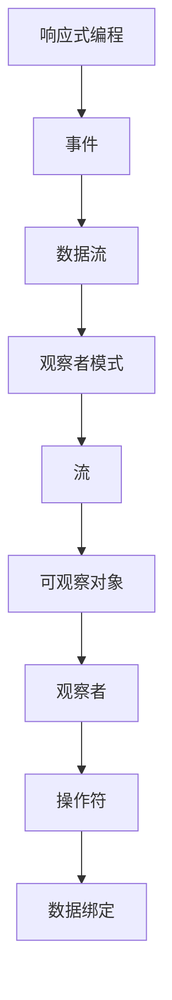

                 

## 1. 背景介绍

响应式编程（Reactive Programming，简称 RP）是一种编程范式，旨在通过异步数据流响应来简化复杂应用程序的开发。其核心思想是使开发者能够更容易地处理和响应数据流变化，而无需过多关注异步操作的细节。

iOS 开发中，响应式编程有着广泛的应用场景。传统的 iOS 开发依赖于闭包（Closure）和 GCD（Grand Central Dispatch）来处理异步操作，但这种方法存在一定的问题，例如代码难以维护、可读性差等。而响应式编程框架，如 RxSwift，可以有效地解决这些问题。

RxSwift 是一个基于 ReactiveX 的 Swift 库，ReactiveX 是一个开源的响应式编程库，最初由微软创建，支持多种编程语言，如 JavaScript、Java、C# 等。RxSwift 的引入，使得 iOS 开发者能够使用响应式编程范式，简化复杂的数据流处理。

本文将详细介绍 iOS 中的 RxSwift 响应式编程，包括其核心概念、基本用法、高级特性以及实际应用案例。通过本文的阅读，读者将能够了解并掌握 RxSwift 在 iOS 开发中的应用，提升开发效率。

## 2. 核心概念与联系

在深入探讨 RxSwift 之前，我们需要先了解一些核心概念。这些概念是理解响应式编程的基础。

### 2.1. 什么是响应式编程？

响应式编程是一种编程范式，它侧重于数据的响应式更新。在这种范式中，程序的行为是基于数据流的。当数据发生变化时，程序会自动更新，而不需要开发者手动编写更新逻辑。

### 2.2. 事件（Events）

在响应式编程中，事件是数据变化的表示。事件可以是数据的更新、删除或者错误等。事件通过数据流传播，程序会根据事件来更新其状态。

### 2.3. 数据流（Data Streams）

数据流是事件的序列。在响应式编程中，数据流可以表示为一系列事件，这些事件按照特定的顺序发生。开发者可以通过订阅数据流来监听事件，并做出相应的处理。

### 2.4. 观察者模式（Observer Pattern）

观察者模式是一种设计模式，用于实现对象之间的通信。在这种模式中，观察者会订阅某个主题，并在主题发生变化时收到通知。RxSwift 中广泛使用了观察者模式，通过 Subject 对象来实现数据的订阅和发布。

### 2.5. 流（Streams）

流是数据流的一种抽象表示。在 RxSwift 中，流是一个连续的数据序列，它可以包含一系列的事件。流可以通过创建操作或者转换其他流来生成。

### 2.6. 可观察对象（Observable）

可观察对象是一个可以产生事件序列的对象。在 RxSwift 中，Observable 是最基本的数据流类型，它可以通过订阅（subscribe）来监听事件。Observable 可以通过一系列操作符来转换和操作数据流。

### 2.7. 观察者（Observer）

观察者是一个订阅了可观察对象的实体，用于接收和处理事件。在 RxSwift 中，Observer 是一个协议，可以通过订阅操作符订阅 Observable，并定义如何处理事件。

### 2.8. 操作符（Operators）

操作符是用于转换和操作数据流的函数。在 RxSwift 中，操作符是一个核心概念，它提供了丰富的功能来处理数据流。常见的操作符包括 map、filter、flatMap、zip 等。

### 2.9. 数据绑定（Data Binding）

数据绑定是响应式编程中的一个重要特性，它使得 UI 与数据流保持同步。在 iOS 开发中，数据绑定可以简化 UI 更新的逻辑，提高代码的可读性和可维护性。

### 2.10. Mermaid 流程图

以下是 RxSwift 的核心概念与联系的 Mermaid 流程图：



通过上述核心概念的介绍，我们可以更好地理解响应式编程及其在 iOS 开发中的应用。接下来，我们将深入探讨 RxSwift 的基本用法。

## 3. 核心算法原理 & 具体操作步骤

### 3.1 算法原理概述

RxSwift 的核心原理是基于事件的响应式编程。在 RxSwift 中，所有的数据流都是以事件的形式存在的。事件可以是数据的创建、更新、删除或者错误等。这些事件通过数据流传播，程序会根据事件来更新其状态。

RxSwift 使用了观察者模式来实现数据的订阅和发布。可观察对象（Observable）是产生事件序列的对象，观察者（Observer）则是订阅了可观察对象的实体，用于接收和处理事件。

### 3.2 算法步骤详解

在 RxSwift 中，处理数据流的基本步骤如下：

1. 创建可观察对象（Observable）。
2. 通过订阅（subscribe）操作监听事件。
3. 使用操作符对事件进行转换和操作。
4. 在观察者中处理事件，例如更新 UI。

以下是这些步骤的详细说明：

#### 3.2.1 创建可观察对象（Observable）

在 RxSwift 中，创建可观察对象通常使用 `create` 操作符。例如：

```swift
let observable = Observable.create { observer in
    observer.onNext(1)
    observer.onNext(2)
    observer.onCompleted()
    return Disposables.create()
}
```

在上面的代码中，我们创建了一个新的可观察对象，并通过 `onNext` 方法发送了两个事件，然后通过 `onCompleted` 方法完成了数据流的发送。

#### 3.2.2 订阅（subscribe）操作

订阅操作是监听可观察对象事件的核心步骤。通过订阅，我们可以接收并处理数据流中的事件。例如：

```swift
observable.subscribe { event in
    switch event {
    case .next(let value):
        print("Next: \(value)")
    case .error(let error):
        print("Error: \(error)")
    case .completed:
        print("Completed")
    }
}
```

在上面的代码中，我们通过订阅操作监听了 `observable` 对象的事件。当事件发生时，我们会在控制台输出相应的事件信息。

#### 3.2.3 使用操作符对事件进行转换和操作

操作符是 RxSwift 的核心功能，它提供了丰富的功能来处理数据流。常见的操作符包括 `map`、`filter`、`flatMap`、`zip` 等。例如，我们可以使用 `map` 操作符来对事件进行转换：

```swift
observable.map { $0 * 2 }
```

在上面的代码中，我们使用 `map` 操作符将每个事件乘以 2，然后创建一个新的可观察对象。

#### 3.2.4 在观察者中处理事件

在观察者中，我们可以根据事件类型来执行不同的操作。例如，我们可以使用 `onNext`、`onError` 和 `onCompleted` 方法来分别处理事件：

```swift
observable.subscribe { event in
    switch event {
    case .next(let value):
        print("Next: \(value)")
    case .error(let error):
        print("Error: \(error)")
    case .completed:
        print("Completed")
    }
}
```

在上面的代码中，我们通过订阅操作监听了 `observable` 对象的事件，并根据事件类型在控制台输出相应的信息。

### 3.3 算法优缺点

#### 优点：

1. 简化异步编程：响应式编程通过事件驱动的方式处理异步操作，简化了异步编程的复杂性。
2. 易于维护：响应式编程使得代码更加模块化，易于维护和扩展。
3. 响应式更新：通过数据绑定，UI 可以自动响应数据流的变化，减少了手动更新的需求。
4. 高度可组合性：操作符提供了丰富的功能，可以轻松地组合和操作数据流。

#### 缺点：

1. 学习曲线：响应式编程需要一定的时间来学习和适应，尤其是对于初学者来说。
2. 性能影响：在某些情况下，响应式编程可能会增加性能负担，尤其是在处理大量数据时。

### 3.4 算法应用领域

响应式编程在 iOS 开发中有广泛的应用，以下是一些典型的应用领域：

1. 网络请求：使用 RxSwift 可以简化网络请求的处理，通过操作符对响应进行转换和过滤。
2. UI 更新：通过数据绑定，UI 可以自动响应数据流的变化，提高开发效率。
3. 观察者模式：在 iOS 开发中，观察者模式用于处理对象之间的通信，RxSwift 提供了更简洁的实现方式。
4. 数据处理：响应式编程可以有效地处理复杂数据流，例如实时数据流分析。

通过以上对算法原理和步骤的详细介绍，我们可以更好地理解 RxSwift 的核心机制，为后续的应用和实践打下基础。

### 4. 数学模型和公式 & 详细讲解 & 举例说明

在深入探讨 RxSwift 的数学模型和公式之前，我们需要了解一些基础的数学概念，如序列、映射和变换。这些概念是理解响应式编程的核心。

#### 4.1 数学模型构建

在响应式编程中，数据流可以看作是一个无限长的序列。这个序列由一系列的事件组成，每个事件可以是一个数字、一个字符串或者其他任何类型的数据。序列可以表示为：

\[ S = \{x_1, x_2, x_3, \ldots\} \]

其中，\( x_i \) 表示第 \( i \) 个事件。

#### 4.2 公式推导过程

在 RxSwift 中，操作符通常通过数学公式来定义其行为。以下是一些常见的操作符和它们的数学公式：

1. **map**：将序列中的每个元素通过一个函数 \( f \) 转换为新元素。
   \[ S' = \{f(x_1), f(x_2), f(x_3), \ldots\} \]
2. **filter**：只保留满足条件 \( P \) 的元素。
   \[ S' = \{x_i \in S \mid P(x_i)\} \]
3. **flatMap**：将序列中的每个元素通过一个函数 \( f \) 转换为新的序列，然后将这些序列合并为一个序列。
   \[ S' = \{y_j \mid x_i \in S, y_j \in f(x_i)\} \]
4. **zip**：将两个序列中的对应元素组合成一个新的序列。
   \[ S' = \{(x_1, y_1), (x_2, y_2), (x_3, y_3), \ldots\} \]

#### 4.3 案例分析与讲解

以下是一个使用 RxSwift 处理网络请求的例子，我们通过数学模型来分析和讲解这个案例。

##### 案例背景

假设我们有一个网络请求，它返回一个用户列表。我们需要处理这个请求，并在成功时更新 UI。

##### 案例实现

```swift
let usersObservable = NetworkingService.fetchUsers()

usersObservable
    .map { $0.users }
    .filter { !$0.isEmpty }
    .observeOn(MainScheduler.instance)
    .subscribe { event in
        switch event {
        case .next(let users):
            self.updateUI(with: users)
        case .error(let error):
            self.handleError(error)
        case .completed:
            break
        }
    }
    .disposed(by: disposeBag)
```

##### 数学模型分析

1. **map** 操作符：将原始的网络响应数据映射为用户列表。
   \[ S' = \{user_list_1, user_list_2, \ldots\} \]
2. **filter** 操作符：过滤出非空的用户列表。
   \[ S' = \{user_list_i \in S' \mid user_list_i \neq \emptyset\} \]
3. **observeOn** 操作符：确保后续的事件在主线程上执行，以便更新 UI。
4. **subscribe** 操作符：订阅数据流，并定义如何处理事件。

##### 案例讲解

在这个案例中，我们首先使用 `NetworkingService.fetchUsers()` 方法获取用户列表。这个方法返回一个 `Observable` 对象，表示一个异步的网络请求。

接下来，我们使用 `map` 操作符将原始的网络响应数据转换为用户列表。然后，使用 `filter` 操作符过滤出非空的用户列表。这些操作符通过数学公式定义其行为，将原始序列转换为新的序列。

最后，我们使用 `observeOn(MainScheduler.instance)` 操作符确保后续的事件在主线程上执行。这是因为在 iOS 开发中，UI 更新必须在主线程上执行。最后，我们使用 `subscribe` 操作符订阅数据流，并在事件发生时更新 UI 或处理错误。

通过这个案例，我们可以看到如何使用 RxSwift 的数学模型和公式来处理复杂的异步操作，并确保代码的简洁和可维护性。

### 5. 项目实践：代码实例和详细解释说明

为了更好地理解 RxSwift 在 iOS 开发中的应用，我们将通过一个实际项目来演示如何使用 RxSwift 进行数据流处理和 UI 更新。

#### 5.1 开发环境搭建

在开始项目实践之前，我们需要确保开发环境已经搭建好。以下是搭建 RxSwift 开发环境的步骤：

1. **安装 Xcode**：确保你已经安装了最新的 Xcode 工具链，可以从 Mac App Store 下载并安装。
2. **安装 SwiftSwift**：使用以下命令安装 SwiftSwift：
   ```shell
   gem install swift-swift
   ```
3. **创建新的 iOS 项目**：打开 Xcode，创建一个新的 iOS 项目，选择 "App" 模板，然后点击 "Next" 继续创建项目。

#### 5.2 源代码详细实现

在项目中，我们将实现一个简单的用户列表界面，展示从网络获取的用户数据。以下是项目的核心代码实现：

```swift
import RxSwift
import RxCocoa
import SVProgressHUD

class UserController: UIViewController {
    var disposeBag = DisposeBag()
    let networkingService = NetworkingService()
    var userViewModel = UserViewModel()

    override func viewDidLoad() {
        super.viewDidLoad()
        setupUI()
        bindViewModel()
    }

    func setupUI() {
        // 设置 UI 元素
        let tableView = UITableView(frame: view.bounds)
        tableView.register(UITableViewCell.self, forCellReuseIdentifier: "UITableViewCell")
        view.addSubview(tableView)

        // 设置表格数据源和委托
        tableView.dataSource = self
        tableView.delegate = self
    }

    func bindViewModel() {
        // 绑定数据流
        userViewModel.users.asObservable()
            .observeOn(MainScheduler.instance)
            .bind(to: tableView.rx.items(cellIdentifier: "UITableViewCell")) { row, user, cell in
                cell.textLabel?.text = user.name
            }
            .disposed(by: disposeBag)

        // 开始加载用户数据
        SVProgressHUD.show()
        networkingService.fetchUsers()
            .subscribe(onNext: { [weak self] users in
                self?.userViewModel.users.accept(users)
                SVProgressHUD.dismiss()
            }, onError: { error in
                SVProgressHUD.showError(withStatus: "Error fetching users")
            })
            .disposed(by: disposeBag)
    }
}

extension UserController: UITableViewDataSource {
    func tableView(_ tableView: UITableView, numberOfRowsInSection section: Int) -> Int {
        return userViewModel.users.value.count
    }

    func tableView(_ tableView: UITableView, cellForRowAt indexPath: IndexPath) -> UITableViewCell {
        let cell = tableView.dequeueReusableCell(withIdentifier: "UITableViewCell", for: indexPath)
        let user = userViewModel.users.value[indexPath.row]
        cell.textLabel?.text = user.name
        return cell
    }
}

extension UserController: UITableViewDelegate {
    func tableView(_ tableView: UITableView, didSelectRowAt indexPath: IndexPath) {
        // 处理行点击事件
    }
}

class UserViewModel {
    let users = BehaviorRelay<[User]>(value: [])
}

struct User {
    let name: String
    let email: String
}

class NetworkingService {
    func fetchUsers() -> Observable<[User]> {
        return Observable.create { observer in
            // 模拟网络请求
            DispatchQueue.global().async {
                sleep(2)
                let users = [User(name: "Alice", email: "alice@example.com"), User(name: "Bob", email: "bob@example.com")]
                observer.onNext(users)
                observer.onCompleted()
            }
            return Disposables.create()
        }
    }
}
```

#### 5.3 代码解读与分析

在上面的代码中，我们实现了一个简单的用户列表界面，并使用 RxSwift 处理数据流和 UI 更新。以下是代码的详细解读：

1. **UserController**：这是控制用户列表界面的控制器。在 `viewDidLoad` 方法中，我们设置了 UI 元素和数据绑定。在 `bindViewModel` 方法中，我们使用 RxSwift 的操作符来处理数据流和 UI 更新。

2. **setupUI**：这是设置 UI 元素的方法。我们创建了一个 `UITableView` 并注册了一个单元格 `UITableViewCell`。

3. **bindViewModel**：这是绑定数据流和 UI 的方法。我们使用 `userViewModel.users.asObservable()` 获取用户列表的观察者。然后，使用 `observeOn(MainScheduler.instance)` 确保后续的事件在主线程上执行。最后，使用 `bind(to:)` 操作符将用户列表绑定到表格数据源。

4. **fetchUsers**：这是模拟网络请求的方法。我们使用 `Observable.create` 创建了一个新的 `Observable` 对象，通过异步线程模拟网络请求，并在成功时发送用户数据。

5. **UserViewModel**：这是一个简单的视图模型类，用于存储用户列表。我们使用 `BehaviorRelay` 来确保数据流的可观察性和行为特性。

6. **NetworkingService**：这是一个模拟网络服务的类，用于获取用户数据。我们使用 `Observable.create` 创建了一个新的 `Observable` 对象，通过异步线程模拟网络请求。

#### 5.4 运行结果展示

运行项目后，界面将显示一个简单的用户列表。当用户点击列表中的行时，可以处理行点击事件。在界面加载时，会显示一个进度提示，并在数据加载完成后消失。

通过这个实际项目，我们可以看到如何使用 RxSwift 进行数据流处理和 UI 更新。这种模式使得代码更加简洁、可维护，并且提高了开发效率。

### 6. 实际应用场景

响应式编程在 iOS 开发中有着广泛的应用场景，以下是一些常见的实际应用场景：

#### 6.1 网络请求

在网络请求方面，响应式编程可以通过 RxSwift 简化异步操作的复杂度。例如，在处理用户登录、数据检索等操作时，可以使用 RxSwift 的操作符对网络响应进行过滤、转换和错误处理，从而实现更简洁、易于维护的代码。

```swift
networkingService.fetchLoginCredentials(username: username, password: password)
    .flatMap { token in
        return self.networkingService.fetchUserProfile(token: token)
    }
    .observeOn(MainScheduler.instance)
    .subscribe { event in
        switch event {
        case .next(let userProfile):
            self.updateUI(with: userProfile)
        case .error(let error):
            self.showErrorAlert(error: error)
        case .completed:
            break
        }
    }
    .disposed(by: disposeBag)
```

在这个例子中，我们使用 `flatMap` 操作符来串联多个网络请求，确保每个请求都在前一个请求完成后才执行。同时，使用 `observeOn(MainScheduler.instance)` 确保后续的事件在主线程上执行，以便更新 UI。

#### 6.2 数据绑定

数据绑定是响应式编程的一个重要特性，它可以使 UI 与数据保持同步。在 iOS 开发中，可以使用 RxSwift 的绑定功能来简化 UI 更新的逻辑。例如，当用户输入文本时，可以实时更新文本输入框的标签文本。

```swift
textField.rx.text.orEmpty.bind(to: label.rx.text).disposed(by: disposeBag)
```

在这个例子中，我们使用 `rx.text.orEmpty` 将文本输入框的文本值绑定到标签的文本值。当用户输入文本时，标签的文本会实时更新，而不需要额外的更新逻辑。

#### 6.3 观察者模式

在 iOS 开发中，观察者模式用于处理对象之间的通信。响应式编程框架，如 RxSwift，提供了更简洁的实现方式。例如，当需要监听一个按钮的点击事件时，可以使用 RxSwift 的订阅功能。

```swift
button.rx.tap.subscribe(onNext: {
    // 处理按钮点击事件
}).disposed(by: disposeBag)
```

在这个例子中，我们使用 `rx.tap` 订阅了按钮的点击事件。当按钮被点击时，会执行 `onNext` 中的代码逻辑。

#### 6.4 实时数据流

在处理实时数据流方面，响应式编程可以有效地处理大量数据的变化。例如，在实时聊天应用中，可以使用 RxSwift 处理消息的发送和接收。

```swift
chatService.fetchMessages()
    .observeOn(MainScheduler.instance)
    .subscribe { event in
        switch event {
        case .next(let message):
            self.appendMessage(to: message)
        case .error(let error):
            self.showErrorAlert(error: error)
        case .completed:
            break
        }
    }
    .disposed(by: disposeBag)
```

在这个例子中，我们使用 `chatService.fetchMessages()` 获取实时消息流。然后，使用 `observeOn(MainScheduler.instance)` 确保消息在主线程上处理，以便更新 UI。

#### 6.5 其他应用场景

除了上述应用场景外，响应式编程还可以应用于其他领域，如动画控制、异步任务处理、事件处理等。通过使用 RxSwift 的操作符和特性，可以简化这些任务的实现，提高代码的可维护性和可扩展性。

```swift
let animationObservable = Observable.create { observer in
    for i in 0..<100 {
        observer.onNext(i)
        sleep(1)
    }
    observer.onCompleted()
    return Disposables.create()
}

animationObservable
    .observeOn(MainScheduler.instance)
    .bind(to: progressView.rx.progress).disposed(by: disposeBag)
```

在这个例子中，我们使用 `Observable.create` 创建了一个动画数据流，通过 `bind(to:)` 操作符将动画进度绑定到 UI 进度条上，实现一个简单的动画效果。

通过以上实际应用场景的介绍，我们可以看到响应式编程在 iOS 开发中的广泛应用。使用 RxSwift 可以有效地简化数据流处理和 UI 更新的逻辑，提高开发效率和代码质量。

### 7. 未来应用展望

随着移动设备性能的提升和应用程序复杂度的增加，响应式编程在 iOS 开发中的应用前景将更加广阔。以下是未来应用展望：

#### 7.1 新特性扩展

未来，RxSwift 可能会引入更多的新特性和操作符，以满足开发者对于数据处理和 UI 更新的更高要求。例如，增加对 WebSocket 的支持，以处理实时数据流；引入更多高效的内存管理机制，减少内存泄露的风险。

#### 7.2 跨平台兼容

随着 React Native 和 Flutter 等跨平台框架的流行，响应式编程的概念也可能在跨平台开发中得到广泛应用。未来，RxSwift 可能会推出针对其他平台的版本，如 Android、Web 等，以实现跨平台的一致性开发体验。

#### 7.3 深度集成

随着 iOS 开发框架的不断发展，RxSwift 有望与其他框架深度集成，例如 MVVM、RIBs 等。这种集成将使响应式编程更加易于使用，提高开发效率。

#### 7.4 实时数据处理

实时数据处理是未来应用的重要方向。通过结合响应式编程和实时数据流技术，开发者可以轻松实现实时数据分析、实时聊天、实时地图等应用。

#### 7.5 智能化处理

随着人工智能技术的发展，响应式编程也可以在智能化处理中发挥重要作用。例如，使用机器学习算法处理数据流，实现智能推荐、自动化决策等功能。

#### 7.6 安全性提升

响应式编程框架在安全性方面也有很大的提升空间。未来，RxSwift 可能会引入更多的安全特性，如数据加密、异常处理等，以保护用户数据和应用程序的安全。

通过以上展望，我们可以看到响应式编程在 iOS 开发中的未来发展潜力。随着技术的不断进步，响应式编程将帮助开发者应对更多复杂的应用场景，提高开发效率和代码质量。

### 8. 总结：未来发展趋势与挑战

#### 8.1 研究成果总结

响应式编程作为一种现代编程范式，已经在 iOS 开发中取得了显著的应用成果。通过引入 RxSwift 等响应式编程库，开发者能够更高效地处理异步数据流，简化 UI 更新的逻辑，提高代码的可维护性。研究成果表明，响应式编程能够显著提升开发效率，降低代码错误率。

#### 8.2 未来发展趋势

未来，响应式编程在 iOS 开发中将继续保持快速发展。以下是几个可能的发展趋势：

1. **新特性扩展**：随着需求的变化，响应式编程库将不断引入新特性和操作符，以应对更复杂的处理场景。
2. **跨平台兼容**：响应式编程将在跨平台开发中得到更广泛的应用，特别是在 React Native 和 Flutter 等框架的推动下。
3. **深度集成**：响应式编程将与 MVVM、RIBs 等主流开发框架深度集成，提高开发效率和代码质量。
4. **实时数据处理**：结合实时数据流技术，响应式编程将广泛应用于实时数据分析、实时聊天、实时地图等应用。
5. **智能化处理**：随着人工智能技术的发展，响应式编程将在智能化处理中发挥重要作用，如智能推荐、自动化决策等。

#### 8.3 面临的挑战

尽管响应式编程在 iOS 开发中具有显著优势，但仍然面临一些挑战：

1. **学习曲线**：响应式编程需要开发者具备一定的编程基础和异步编程经验，对于初学者来说，学习曲线较陡。
2. **性能问题**：在某些情况下，响应式编程可能会增加性能负担，特别是在处理大量数据时。需要开发者合理使用操作符和优化策略，以避免性能问题。
3. **安全性问题**：响应式编程在数据流传递和处理过程中，可能引入安全漏洞。需要开发者加强安全性意识，引入安全特性，如数据加密、异常处理等。
4. **框架更新**：随着技术的不断发展，响应式编程库需要不断更新和维护，以保持其先进性和适用性。

#### 8.4 研究展望

未来，响应式编程在 iOS 开发中的应用前景广阔。通过解决上述挑战，响应式编程将更好地服务于开发者，提高开发效率和代码质量。以下是几个可能的研究方向：

1. **性能优化**：研究响应式编程的性能优化策略，提高其在处理大量数据时的效率。
2. **安全性提升**：研究响应式编程的安全性机制，提高数据流传递和处理过程中的安全性。
3. **教育普及**：推广响应式编程的教育资源，降低初学者的学习难度，提高开发者的编程能力。
4. **跨平台开发**：研究响应式编程在跨平台开发中的最佳实践，提高跨平台开发的一致性和效率。
5. **智能化处理**：结合人工智能技术，研究响应式编程在智能化处理中的应用，如智能推荐、自动化决策等。

总之，响应式编程在 iOS 开发中具有巨大的发展潜力。通过不断优化和推广，响应式编程将为开发者带来更加高效、安全、智能的开发体验。

### 9. 附录：常见问题与解答

在学习和使用 RxSwift 的过程中，开发者可能会遇到一些常见问题。以下是一些常见问题及其解答：

#### Q1. 什么是 RxSwift？

A1. RxSwift 是一个基于 ReactiveX 的 Swift 库，用于实现响应式编程。它提供了丰富的操作符和功能，帮助开发者简化异步数据流处理和 UI 更新。

#### Q2. RxSwift 与传统异步编程相比有什么优势？

A2. 相比传统异步编程（如使用 GCD），RxSwift 提供了更简洁、易维护的异步处理方式。它通过事件驱动和操作符组合，简化了异步代码的复杂性，提高了代码的可读性。

#### Q3. 如何在项目中引入 RxSwift？

A3. 在项目中引入 RxSwift 非常简单。首先，通过 CocoaPods 或者 Swift Package Manager 安装 RxSwift 库。然后，在项目中导入所需的模块，即可开始使用。

#### Q4. 如何处理 RxSwift 中的错误？

A4. RxSwift 提供了 `catchError` 操作符来处理错误。例如：

```swift
observable
    .catchError { error in
        // 处理错误
        return Observable.just(defaultValue)
    }
    .observeOn(MainScheduler.instance)
    .subscribe { event in
        // 处理事件
    }
    .disposed(by: disposeBag)
```

#### Q5. 如何在 RxSwift 中进行数据绑定？

A5. 数据绑定是响应式编程的重要特性。在 iOS 开发中，可以使用 `bind(to:)` 操作符进行数据绑定。例如：

```swift
textField.rx.text.orEmpty.bind(to: label.rx.text).disposed(by: disposeBag)
```

#### Q6. RxSwift 如何处理内存泄漏？

A6. RxSwift 通过 `Disposables.create()` 方法来创建可处置对象，用于处理内存泄漏。例如：

```swift
let disposable = Disposable.create {
    // 清理资源
}
disposabledisposed(by: disposeBag)
```

确保在使用完毕后，将可处置对象添加到 `disposeBag` 中，以释放相关资源。

#### Q7. 如何优化 RxSwift 的性能？

A7. 优化 RxSwift 的性能可以从以下几个方面进行：

1. 使用适当的操作符，避免不必要的中间数据流。
2. 尽量避免在主线程上进行大量计算，使用 `observeOn(BackgroundScheduler.instance)` 进行后台处理。
3. 使用 `zip` 操作符减少不必要的等待时间。
4. 使用 ` Debounce` 操作符过滤高频事件。

通过以上方法，可以显著提高 RxSwift 的性能。

这些常见问题的解答将帮助开发者更好地理解和使用 RxSwift，解决开发过程中遇到的问题。

