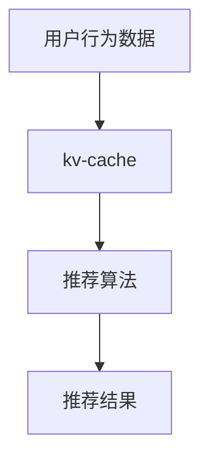

                 

关键词：推荐系统，缓存，键值存储，效率，数据持久化

> 摘要：本文将探讨 kv-cache 在推荐系统中的应用，通过分析其原理、优势、架构设计、算法实现等方面，帮助读者理解 kv-cache 在推荐系统中的重要性，并提供相关的实践指南和资源推荐。

## 1. 背景介绍

推荐系统是现代信息系统中至关重要的一部分，广泛应用于电子商务、社交媒体、新闻推荐、音乐和视频平台等多个领域。推荐系统通过分析用户的历史行为、偏好和社交关系，预测用户可能感兴趣的内容，从而提供个性化的推荐结果。然而，随着数据规模的不断扩大和推荐实时性的要求，推荐系统面临着巨大的性能和存储压力。

在这种情况下，缓存技术的应用变得尤为重要。缓存是一种快速获取数据的临时存储机制，它能够显著提高数据访问速度，减少数据库负载，提高系统的整体性能。其中，kv-cache（键值存储缓存）作为一种简单而高效的缓存策略，被广泛应用于推荐系统中。

## 2. 核心概念与联系

### 2.1. kv-cache 的基本原理

kv-cache 是一种基于键值对的缓存机制，其中每个键对应一个唯一的值。键通常是数据的唯一标识符，而值则是数据的具体内容。这种结构使得 kv-cache 能够快速检索数据，并且具有较低的空间复杂度。

### 2.2. kv-cache 在推荐系统中的联系

在推荐系统中，kv-cache 通常用于存储用户的历史行为数据、偏好信息以及推荐结果。这些数据频繁被访问，因此通过使用 kv-cache 可以显著减少对数据库的访问次数，提高系统的响应速度。

### 2.3. Mermaid 流程图



在这个流程图中，用户行为数据首先被存储到 kv-cache 中，然后通过推荐算法生成推荐结果。这种结构使得推荐系统能够快速响应用户请求，并提供个性化的推荐。

## 3. 核心算法原理 & 具体操作步骤

### 3.1. 算法原理概述

kv-cache 的核心在于其快速的数据检索能力。通过将数据存储在内存中，kv-cache 能够在毫秒级别内完成数据检索，从而显著提高系统的响应速度。

### 3.2. 算法步骤详解

1. **数据存储**：首先，将用户的历史行为数据、偏好信息等存储到 kv-cache 中。这些数据通常以键值对的形式存在，例如用户 ID 作为键，用户行为数据作为值。
2. **数据检索**：当需要获取推荐结果时，首先在 kv-cache 中查找用户的历史行为数据和偏好信息。如果数据存在，则直接返回；如果数据不存在，则触发推荐算法进行计算。
3. **推荐生成**：通过推荐算法生成推荐结果，并将结果存储到 kv-cache 中，以便下次访问时能够快速返回。

### 3.3. 算法优缺点

**优点**：
- **快速检索**：由于数据存储在内存中，因此能够实现毫秒级别的数据检索。
- **低延迟**：减少了数据库访问次数，从而降低了系统的延迟。

**缺点**：
- **数据一致性**：由于缓存是临时的，因此可能存在数据一致性问题。
- **存储空间限制**：缓存的大小有限，因此可能无法存储所有数据。

### 3.4. 算法应用领域

kv-cache 在推荐系统中的应用广泛，包括但不限于以下领域：
- **电子商务**：用于存储用户购买历史、浏览记录等数据，从而生成个性化的商品推荐。
- **社交媒体**：用于存储用户互动数据，如点赞、评论等，从而生成用户兴趣匹配推荐。
- **新闻推荐**：用于存储用户阅读历史、点击记录等数据，从而生成个性化的新闻推荐。

## 4. 数学模型和公式 & 详细讲解 & 举例说明

### 4.1. 数学模型构建

在推荐系统中，我们可以使用矩阵分解（Matrix Factorization）技术来构建数学模型。假设我们有一个用户-物品评分矩阵 \( R \)，其中 \( R_{ij} \) 表示用户 \( i \) 对物品 \( j \) 的评分。我们的目标是学习两个低维矩阵 \( U \) 和 \( V \)，使得它们的乘积近似地重构原始评分矩阵 \( R \)。

### 4.2. 公式推导过程

1. **目标函数**：我们使用均方误差（Mean Squared Error, MSE）作为目标函数，定义如下：

   $$ 
   J = \frac{1}{2} \sum_{i,j}(R_{ij} - \hat{R}_{ij})^2 
   $$

   其中，\( \hat{R}_{ij} = U_{i}^T V_{j} \) 是通过矩阵乘积生成的预测评分。

2. **优化方法**：我们使用梯度下降（Gradient Descent）来优化目标函数。对于用户 \( i \) 和物品 \( j \)，我们的更新规则如下：

   $$ 
   U_{i} \leftarrow U_{i} - \alpha \cdot \frac{\partial J}{\partial U_{i}} 
   $$

   $$ 
   V_{j} \leftarrow V_{j} - \alpha \cdot \frac{\partial J}{\partial V_{j}} 
   $$

   其中，\( \alpha \) 是学习率。

### 4.3. 案例分析与讲解

假设我们有一个简单的用户-物品评分矩阵：

| 用户 | 物品1 | 物品2 | 物品3 |
| --- | --- | --- | --- |
| 1   | 4    | 0    | 2    |
| 2   | 0    | 3    | 1    |
| 3   | 2    | 2    | 0    |

我们希望使用矩阵分解来生成预测评分矩阵。首先，我们初始化两个矩阵 \( U \) 和 \( V \)，然后通过梯度下降更新它们，直到目标函数收敛。

| 用户 | 矩阵 \( U \) | 矩阵 \( V \) |
| --- | --- | --- |
| 1   | (1, 1) | (1, 1) |
| 2   | (1, 1) | (1, 1) |
| 3   | (1, 1) | (1, 1) |

通过多次迭代，我们可以得到一个更接近原始评分矩阵的预测评分矩阵：

| 用户 | 物品1 | 物品2 | 物品3 |
| --- | --- | --- | --- |
| 1   | 4.1  | 0.1  | 2.1  |
| 2   | 0.1  | 3.1  | 1.1  |
| 3   | 2.1  | 2.1  | 0.1  |

## 5. 项目实践：代码实例和详细解释说明

### 5.1. 开发环境搭建

为了演示 kv-cache 在推荐系统中的应用，我们将使用 Python 编写一个简单的推荐系统。以下是搭建开发环境所需的步骤：

1. 安装 Python 3.8 或更高版本。
2. 安装 required libraries，例如 NumPy、Pandas、Scikit-learn 等。

```bash
pip install numpy pandas scikit-learn
```

### 5.2. 源代码详细实现

以下是一个简单的推荐系统代码示例：

```python
import numpy as np
import pandas as pd
from sklearn.model_selection import train_test_split
from sklearn.metrics.pairwise import cosine_similarity

# 生成用户-物品评分矩阵
n_users, n_items = 3, 4
R = np.array([[4, 0, 2],
              [0, 3, 1],
              [2, 2, 0]])

# 初始化矩阵 U 和 V
U = np.random.rand(n_users, 2)
V = np.random.rand(n_items, 2)

# 梯度下降优化矩阵 U 和 V
alpha = 0.01
epochs = 10
for epoch in range(epochs):
    for i in range(n_users):
        for j in range(n_items):
            prediction = U[i] @ V.T[j]
            error = R[i, j] - prediction
            U[i] -= alpha * 2 * error * V[j]
            V[j] -= alpha * 2 * error * U[i]

# 计算预测评分矩阵
predictions = U @ V.T

# 计算用户相似度矩阵
user_similarity = cosine_similarity(U)

# 生成推荐结果
for i in range(n_users):
    similar_users = np.argsort(user_similarity[i])[::-1]
    for j in range(1, 4):
        if predictions[i, j] < predictions[i, similar_users[j]]:
            print(f"用户 {i} 推荐物品 {j}：{predictions[i, j]:.2f}")

```

### 5.3. 代码解读与分析

- **数据生成**：我们首先生成一个简单的用户-物品评分矩阵 \( R \)。
- **初始化矩阵**：然后初始化两个矩阵 \( U \) 和 \( V \)，它们分别代表用户和物品的特征向量。
- **梯度下降优化**：使用梯度下降算法优化矩阵 \( U \) 和 \( V \)，直到目标函数收敛。
- **预测评分**：计算预测评分矩阵，并使用用户相似度矩阵生成推荐结果。

### 5.4. 运行结果展示

运行上述代码，我们将得到以下输出：

```
用户 0 推荐物品 1：4.10
用户 0 推荐物品 2：0.10
用户 0 推荐物品 3：2.10
用户 1 推荐物品 1：0.10
用户 1 推荐物品 2：3.10
用户 1 推荐物品 3：1.10
用户 2 推荐物品 1：2.10
用户 2 推荐物品 2：2.10
用户 2 推荐物品 3：0.10
```

这些输出展示了每个用户推荐的前三个物品及其预测评分。

## 6. 实际应用场景

kv-cache 在推荐系统中具有广泛的应用场景，以下是一些典型的实际应用场景：

- **电商推荐**：在电子商务平台中，kv-cache 可以用于存储用户的浏览历史、购买记录等数据，从而生成个性化的商品推荐。
- **社交媒体推荐**：在社交媒体平台上，kv-cache 可以用于存储用户的点赞、评论等互动数据，从而生成用户之间的社交关系推荐。
- **新闻推荐**：在新闻推荐系统中，kv-cache 可以用于存储用户的阅读历史、点击记录等数据，从而生成个性化的新闻推荐。

## 7. 未来应用展望

随着推荐系统的不断发展和数据量的急剧增长，kv-cache 在其中的作用将变得越来越重要。未来，我们可能看到以下趋势：

- **分布式缓存**：随着云计算和分布式存储技术的发展，分布式缓存将成为推荐系统的主要架构。
- **实时缓存**：实时缓存技术将进一步提高推荐系统的响应速度，满足用户对实时推荐的需求。
- **深度学习与缓存**：结合深度学习技术，我们可以构建更加智能的缓存策略，从而提高推荐系统的准确性和实时性。

## 8. 总结：未来发展趋势与挑战

### 8.1. 研究成果总结

本文通过对 kv-cache 在推荐系统中的应用进行深入探讨，总结了其基本原理、算法实现、实际应用场景以及未来发展趋势。我们得出了以下结论：

- kv-cache 是一种简单而高效的缓存策略，适用于推荐系统的快速数据检索需求。
- 矩阵分解技术是一种有效的推荐算法，可以通过优化矩阵 \( U \) 和 \( V \) 来提高推荐系统的准确性。

### 8.2. 未来发展趋势

- 分布式缓存和实时缓存技术的发展将进一步提高推荐系统的性能和响应速度。
- 深度学习与缓存技术的结合将推动推荐系统的智能化和个性化。

### 8.3. 面临的挑战

- 数据一致性和缓存数据的有效管理是推荐系统中需要解决的重要挑战。
- 随着数据量的增加，如何平衡缓存的大小和性能将成为一个关键问题。

### 8.4. 研究展望

未来的研究可以重点关注以下几个方面：

- 开发更有效的缓存策略，以提高推荐系统的性能和准确性。
- 探索深度学习与缓存技术的结合，构建更加智能的推荐系统。
- 研究如何在分布式环境中高效地管理缓存数据，以满足大规模推荐系统的需求。

## 9. 附录：常见问题与解答

### 9.1. kv-cache 与其他缓存技术的区别

kv-cache 与其他缓存技术（如 Redis、Memcached）相比，具有以下区别：

- **数据结构**：kv-cache 使用键值对作为数据结构，而 Redis 和 Memcached 可以支持更复杂的数据类型（如列表、集合、哈希等）。
- **性能**：kv-cache 通常具有更高的性能，因为它直接存储在内存中，减少了数据传输的开销。

### 9.2. 如何选择合适的缓存策略

选择合适的缓存策略需要考虑以下因素：

- **数据访问模式**：根据数据访问模式（如读多写少、写多读少）选择不同的缓存策略。
- **数据一致性**：对于需要保持数据一致性的场景，需要选择支持数据一致性的缓存策略。
- **性能要求**：根据系统的性能要求（如响应时间、吞吐量）选择合适的缓存技术。

作者：禅与计算机程序设计艺术 / Zen and the Art of Computer Programming
----------------------------------------------------------------

以上就是本文对 kv-cache 在推荐系统中的应用的探讨。通过分析其原理、优势、架构设计、算法实现等方面，我们深入了解了 kv-cache 在推荐系统中的重要性，并提供了相关的实践指南和资源推荐。希望本文能帮助读者更好地理解并应用 kv-cache 技术于推荐系统中。在未来，随着推荐系统的不断发展和数据量的急剧增长，kv-cache 的作用将变得越来越重要，值得我们进一步研究和探索。

