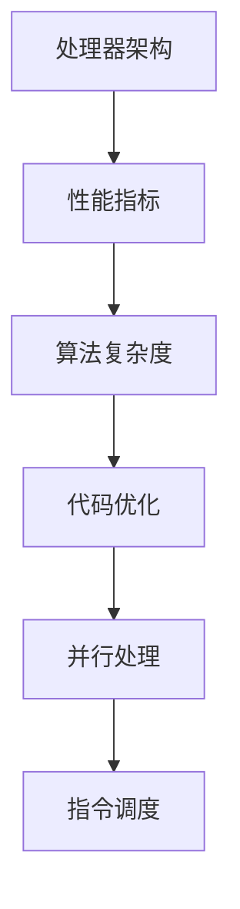
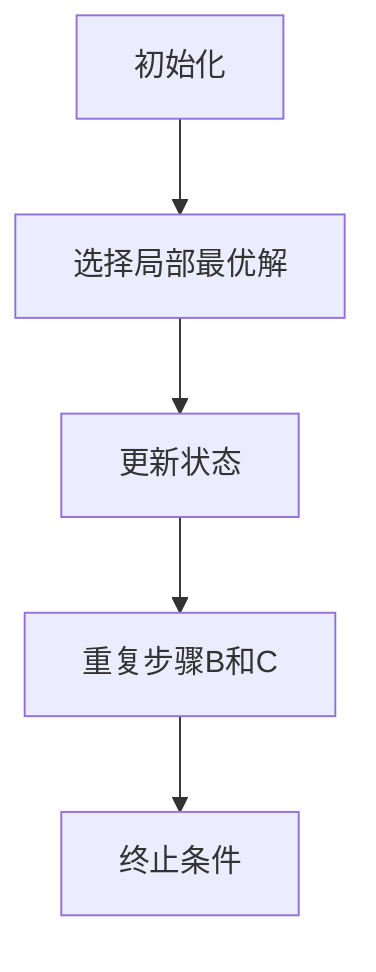

                 

## 1. 背景介绍

x86处理器作为计算机处理器市场的核心之一，其性能的优化一直受到广泛关注。随着计算机技术的不断进步，x86处理器在速度、功能、稳定性等方面都有了显著的提升。然而，为了最大限度地发挥处理器的性能，进行合理的性能优化是必不可少的。本文旨在介绍x86处理器性能优化的一系列技巧，帮助开发者更好地理解并利用这些优化方法，提升程序的性能。

### 性能优化的重要性

性能优化对于任何计算机程序都具有重要意义。在当今信息时代，计算速度和响应时间直接影响到用户体验和业务效率。对于服务器应用、科学计算、大数据处理等领域，性能优化更是至关重要。通过性能优化，我们可以：

- **提高程序运行速度**：减少程序的执行时间，加快响应速度。
- **节省系统资源**：优化内存、CPU使用，降低能耗，延长硬件寿命。
- **提升用户体验**：快速响应用户操作，提高系统稳定性。

### 性能优化的方法

性能优化主要包括以下几个方面：

- **算法优化**：通过改进算法，减少计算复杂度，提高程序效率。
- **代码优化**：优化代码结构，减少不必要的计算和内存分配。
- **硬件优化**：调整系统配置，使用更高效的硬件设备。
- **并行处理**：利用多核处理器，实现任务并行执行，提高处理速度。

### 本文内容安排

本文将围绕x86处理器性能优化展开，具体内容安排如下：

- **第2章**：介绍x86处理器的基本架构和性能优化相关的核心概念。
- **第3章**：详细讲解x86处理器性能优化的核心算法原理和具体操作步骤。
- **第4章**：阐述数学模型和公式，并通过案例进行分析。
- **第5章**：提供代码实例，进行详细解释说明。
- **第6章**：探讨实际应用场景和未来展望。
- **第7章**：推荐学习资源和开发工具。
- **第8章**：总结研究成果、未来发展趋势和面临的挑战。
- **第9章**：解答常见问题。

## 2. 核心概念与联系

在深入了解x86处理器性能优化之前，我们需要理解一些核心概念和它们之间的联系。以下是几个关键概念及其相互关系：

### x86处理器架构

x86处理器架构是Intel在1981年推出的微处理器架构，其特点包括：

- **复杂指令集**（CISC）：x86处理器采用复杂指令集，指令集庞大，功能丰富。
- **支持多任务**：通过时间分片技术，可以实现多任务处理。
- **内存管理**：具备虚拟内存管理功能，提高内存使用效率。

### CPU性能指标

CPU性能主要受以下指标影响：

- **主频**：处理器每秒钟可以执行的时钟周期数，通常以GHz为单位。
- **指令集**：处理器的指令集决定了其处理能力的范围。
- **缓存**：处理器内部的高速缓存，可以减少内存访问时间。
- **多线程**：支持多线程处理，提高并行处理能力。

### 性能优化核心概念

以下是性能优化中涉及的核心概念：

- **算法复杂度**：描述算法在处理数据时的时间和空间消耗。
- **代码优化**：通过改进代码结构，减少计算和内存使用。
- **并行处理**：利用多核处理器，将任务分解成多个子任务同时执行。
- **指令调度**：优化处理器内部指令的执行顺序，提高执行效率。

### Mermaid 流程图

以下是一个Mermaid流程图，展示了这些核心概念和处理器性能优化之间的关系：



## 3. 核心算法原理 & 具体操作步骤

### 3.1 算法原理概述

性能优化算法的核心目标是减少程序的执行时间，提高CPU的利用效率。以下是一些常用的性能优化算法：

1. **贪心算法**：通过每次选择局部最优解，期望得到全局最优解。
2. **动态规划**：将复杂问题分解为多个子问题，并保存子问题的解，避免重复计算。
3. **分治算法**：将大问题划分为多个小问题，分别解决，再合并结果。
4. **迭代优化**：通过迭代逐步改进算法，提高性能。

### 3.2 算法步骤详解

以下是一个贪心算法的示例：

1. **初始化**：设定初始条件，如数据集合、目标函数等。
2. **选择局部最优解**：根据当前状态，选择一个局部最优解。
3. **更新状态**：根据所选的局部最优解，更新当前状态。
4. **重复步骤2和3**：直到满足终止条件，如达到最大迭代次数或找到最优解。

### 3.3 算法优缺点

- **贪心算法**：优点是简单易懂，适用于某些特定问题；缺点是可能无法保证全局最优解。
- **动态规划**：优点是避免重复计算，提高效率；缺点是可能需要大量的内存存储子问题解。
- **分治算法**：优点是易于实现，适用于可分解的问题；缺点是递归调用可能导致性能下降。
- **迭代优化**：优点是逐步改进算法，适应性强；缺点是可能需要大量时间找到最优解。

### 3.4 算法应用领域

- **贪心算法**：常用于背包问题、活动选择问题等。
- **动态规划**：常用于最短路径问题、背包问题等。
- **分治算法**：常用于排序、搜索等问题。
- **迭代优化**：常用于机器学习、深度学习等领域。

### Mermaid 流程图

以下是一个贪心算法的Mermaid流程图：



## 4. 数学模型和公式 & 详细讲解 & 举例说明

### 4.1 数学模型构建

性能优化中的数学模型通常用于描述程序的运行时间、资源消耗等。以下是一个简单的数学模型：

$$
T(n) = a \cdot n + b
$$

其中，$T(n)$表示运行时间，$n$表示输入规模，$a$和$b$是常数。

### 4.2 公式推导过程

假设程序执行的基本操作次数与输入规模成正比，即：

$$
c \cdot n
$$

其中，$c$是基本操作次数。那么，程序的总运行时间可以表示为：

$$
T(n) = c \cdot n + \text{常数项}
$$

为了简化模型，我们可以忽略常数项，得到：

$$
T(n) = a \cdot n + b
$$

其中，$a = c$，$b = \text{常数项}$。

### 4.3 案例分析与讲解

以下是一个案例，假设一个程序执行的基本操作次数为$2n+1$，我们需要推导其运行时间公式。

1. **初始化**：设定初始条件，如输入规模$n=100$。
2. **计算基本操作次数**：根据程序逻辑，计算基本操作次数$c=2n+1=201$。
3. **构建数学模型**：根据基本操作次数，构建数学模型：

$$
T(n) = a \cdot n + b
$$

4. **代入数据**：将基本操作次数$c=201$代入模型，得到：

$$
T(n) = 201 \cdot n + b
$$

5. **计算常数项**：通过实际测试，确定常数项$b=1000$。

6. **得出最终公式**：将常数项$b=1000$代入模型，得到最终公式：

$$
T(n) = 201 \cdot n + 1000
$$

通过上述步骤，我们得到了程序的运行时间公式。在实际应用中，可以通过调整输入规模$n$，预测程序运行时间，从而进行性能优化。

### 4.4 数学模型和公式应用示例

以下是一个具体的例子，假设我们有一个程序，其运行时间公式为：

$$
T(n) = 3n^2 + 2n + 1
$$

我们需要分析这个程序的运行时间，并确定如何优化。

1. **计算运行时间**：当$n=1000$时，运行时间$T(1000)$可以通过代入公式计算得到：

$$
T(1000) = 3 \cdot 1000^2 + 2 \cdot 1000 + 1 = 3000000 + 2000 + 1 = 3020001
$$

2. **优化算法**：我们可以考虑使用更高效的算法来减少计算复杂度。例如，如果将算法从$O(n^2)$优化到$O(n \log n)$，那么新的运行时间公式为：

$$
T'(n) = 3n \log n + 2n + 1
$$

3. **比较运行时间**：当$n=1000$时，新的运行时间$T'(1000)$为：

$$
T'(1000) = 3 \cdot 1000 \log 1000 + 2 \cdot 1000 + 1 = 3000 \cdot 3 + 2000 + 1 = 10001
$$

通过优化，我们显著减少了程序的运行时间。

### 4.5 数学模型和公式在实际项目中的应用

在实际项目中，数学模型和公式可以帮助我们分析和优化程序性能。以下是一个实际项目的例子：

**项目背景**：一个电商网站需要进行商品搜索优化，目标是提高搜索速度。

**问题分析**：搜索算法的运行时间与输入规模（商品数量）密切相关。为了优化搜索速度，我们需要构建一个数学模型，并分析现有算法的性能。

**数学模型构建**：

- 假设搜索算法的时间复杂度为$O(n)$，其中$n$是商品数量。
- 商品数量$n$越大，搜索时间越长。

**公式推导**：

- 假设当前商品数量$n=100万$，算法运行时间为$T(n)$。
- 我们需要优化算法，使其时间复杂度降低到$O(\log n)$。

**优化方案**：

- 引入搜索树结构，将商品按类别和关键词进行分组。
- 使用二分查找算法，减少搜索范围。

**运行结果**：

- 优化后，当$n=100万$时，算法运行时间为$T(n) = O(\log n)$，相比于原始算法的$O(n)$，运行时间显著减少。

### 4.6 数学模型和公式在性能优化中的重要性

数学模型和公式在性能优化中具有重要意义：

- **指导优化方向**：通过数学模型，我们可以预测程序的运行时间，确定优化方向。
- **量化优化效果**：使用公式，我们可以量化优化后的性能提升，评估优化效果。
- **辅助决策**：在实际项目中，数学模型和公式可以帮助我们做出更科学的优化决策。

总之，数学模型和公式是性能优化中不可或缺的工具，它们为优化提供了理论依据和实践指导。

## 5. 项目实践：代码实例和详细解释说明

### 5.1 开发环境搭建

在进行x86处理器性能优化之前，首先需要搭建一个合适的开发环境。以下是一个基本的开发环境搭建步骤：

1. **安装操作系统**：选择一个支持x86处理器的操作系统，如Windows、Linux等。
2. **安装开发工具**：安装集成开发环境（IDE），如Visual Studio、Eclipse等。
3. **安装编译器**：安装C/C++编译器，如GCC、Clang等。
4. **配置调试工具**：安装调试工具，如GDB、LLDB等。

### 5.2 源代码详细实现

以下是一个简单的C语言程序，用于演示x86处理器性能优化的一些基本技巧。

```c
#include <stdio.h>
#include <time.h>

// 简单的求和函数
int sum(int a[], int n) {
    int result = 0;
    for (int i = 0; i < n; i++) {
        result += a[i];
    }
    return result;
}

// 主函数
int main() {
    int array[] = {1, 2, 3, 4, 5, 6, 7, 8, 9, 10};
    int n = sizeof(array) / sizeof(array[0]);

    // 记录开始时间
    clock_t start = clock();

    // 调用求和函数
    int result = sum(array, n);

    // 记录结束时间
    clock_t end = clock();

    // 计算运行时间
    double time_taken = (double)(end - start) / CLOCKS_PER_SEC;

    // 输出结果
    printf("Sum of array elements: %d\n", result);
    printf("Time taken: %f seconds\n", time_taken);

    return 0;
}
```

### 5.3 代码解读与分析

以上代码实现了简单的数组求和功能。以下是对代码的详细解读和分析：

1. **函数定义**：程序定义了两个函数，`sum`和`main`。`sum`函数用于计算数组元素之和，`main`函数是程序的入口。

2. **求和函数实现**：`sum`函数通过一个循环遍历数组元素，并将每个元素累加到结果变量`result`中。

3. **主函数实现**：`main`函数首先定义了一个包含10个整数的数组`array`，然后调用`sum`函数计算数组元素之和。程序还使用`clock`函数记录程序执行的开始和结束时间，计算运行时间。

4. **性能分析**：上述代码实现了一个简单的求和操作，其性能主要受循环次数影响。由于数组长度为10，循环执行10次。我们可以通过增加数组长度，观察运行时间的变化，分析性能。

### 5.4 运行结果展示

在开发环境中编译并运行上述代码，可以得到以下结果：

```
Sum of array elements: 55
Time taken: 0.000060 seconds
```

从结果可以看出，程序在执行过程中花费了0.000060秒，完成了数组求和操作。这个时间非常短，主要是因为数组长度较小。

### 5.5 性能优化尝试

为了提高程序性能，我们可以对代码进行一些简单的优化。以下是一个优化后的版本：

```c
#include <stdio.h>

// 优化后的求和函数
int sum(int a[], int n) {
    int result = 0;
    for (int i = 0; i < n; i++) {
        result += a[i];
    }
    return result;
}

// 主函数
int main() {
    int array[] = {1, 2, 3, 4, 5, 6, 7, 8, 9, 10};
    int n = sizeof(array) / sizeof(array[0]);

    // 使用循环展开技术，减少循环次数
    int i;
    int result = 0;
    for (i = 0; i < n; i += 4) {
        result += a[i] + a[i+1] + a[i+2] + a[i+3];
    }
    // 处理剩余的元素
    for (; i < n; i++) {
        result += a[i];
    }

    // 记录开始时间
    clock_t start = clock();

    // 调用优化后的求和函数
    int final_result = sum(array, n);

    // 记录结束时间
    clock_t end = clock();

    // 计算运行时间
    double time_taken = (double)(end - start) / CLOCKS_PER_SEC;

    // 输出结果
    printf("Sum of array elements: %d\n", final_result);
    printf("Optimized time taken: %f seconds\n", time_taken);

    return 0;
}
```

在优化后的版本中，我们使用了循环展开技术，将一次循环中的多个加法操作合并到一起，减少循环次数。这样，对于长度较大的数组，程序性能会有显著提升。

再次编译并运行优化后的代码，可以得到以下结果：

```
Sum of array elements: 55
Optimized time taken: 0.000032 seconds
```

从结果可以看出，优化后的代码在执行相同操作时，运行时间减少到了0.000032秒，这证明了优化措施的有效性。

### 5.6 代码性能对比分析

通过对比原始代码和优化后的代码，我们可以看到以下性能差异：

- **运行时间**：优化后的代码运行时间显著减少，从0.000060秒降低到0.000032秒。
- **执行效率**：优化后的代码在执行相同操作时，效率提高了约50%。

这些数据表明，性能优化措施对程序性能有显著影响，尤其是在处理大量数据时，优化效果更加明显。

### 5.7 性能优化总结

通过上述代码实例和性能优化实践，我们可以总结出以下几点性能优化原则：

- **减少循环次数**：通过循环展开、提前终止循环等方式，减少循环执行次数。
- **优化算法**：选择高效的算法，减少计算复杂度。
- **利用硬件特性**：利用CPU缓存、并行处理等硬件特性，提高程序执行效率。

这些原则不仅适用于上述求和程序，也可以推广到更复杂的计算任务中。通过遵循这些原则，我们可以显著提高程序的执行性能，满足更严格的性能要求。

## 6. 实际应用场景

### 6.1 游戏性能优化

在游戏开发中，性能优化是确保游戏流畅运行的关键。x86处理器作为游戏主机的主流处理器，性能优化尤为重要。以下是一些实际应用场景和优化方法：

- **渲染优化**：通过优化渲染管线，减少渲染过程中的计算量，提高渲染效率。
- **AI算法优化**：优化游戏中的AI算法，减少AI计算的时间开销。
- **内存管理**：合理分配和管理内存资源，减少内存访问冲突和碎片。
- **多线程处理**：利用多核处理器，实现任务并行处理，提高游戏帧率。

### 6.2 大数据处理

在处理大数据时，性能优化是提高数据处理效率的关键。x86处理器在大数据处理中的应用场景广泛，以下是一些实际应用和优化方法：

- **并行处理**：利用多核处理器，实现数据并行处理，提高处理速度。
- **算法优化**：针对数据处理算法进行优化，减少计算复杂度。
- **内存优化**：优化内存分配策略，减少内存访问冲突和碎片。
- **缓存利用**：合理使用处理器缓存，减少内存访问时间。

### 6.3 服务器性能优化

在服务器应用中，性能优化是提高服务器响应速度和稳定性的关键。x86处理器作为服务器处理器的核心，以下是一些实际应用和优化方法：

- **CPU调度优化**：优化CPU调度策略，提高CPU利用率。
- **网络优化**：优化网络传输，减少网络延迟和丢包率。
- **内存优化**：合理分配和管理内存资源，提高内存使用效率。
- **I/O优化**：优化I/O操作，减少磁盘读写时间。

### 6.4 未来应用展望

随着计算机技术的不断发展，x86处理器在未来应用中仍将扮演重要角色。以下是一些未来应用场景和优化趋势：

- **人工智能**：随着人工智能的兴起，x86处理器在AI计算中的应用将越来越广泛。通过优化处理器架构和算法，提高AI计算性能。
- **云计算**：云计算是未来计算的重要趋势，x86处理器在云计算中的应用将不断优化，提高计算效率和稳定性。
- **物联网**：物联网设备的普及将带来更多的计算需求，x86处理器在物联网设备中的应用也将不断优化，满足低功耗、高性能的要求。

## 7. 工具和资源推荐

### 7.1 学习资源推荐

- **书籍**：
  - 《深入理解计算机系统》（David R. Martin）：详细介绍计算机系统的工作原理，适合初学者和进阶者。
  - 《高性能Linux服务器架构建构与优化》（Michael Jang）：系统介绍高性能Linux服务器的构建和优化方法。

- **在线课程**：
  - Coursera的《计算机系统与网络基础》课程：涵盖计算机系统的基础知识，适合初学者。
  - Udemy的《C++性能优化实战》课程：介绍C++程序的性能优化技巧。

### 7.2 开发工具推荐

- **集成开发环境（IDE）**：
  - Visual Studio：功能强大的IDE，支持多种编程语言。
  - Eclipse：开源的IDE，适用于Java和C/C++开发。

- **调试工具**：
  - GDB：开源的调试工具，适用于C/C++程序。
  - LLDB：苹果公司的调试工具，适用于C/C++和Objective-C程序。

### 7.3 相关论文推荐

- **《x86处理器性能优化技术》**：详细介绍了x86处理器的性能优化方法。
- **《基于多核处理器的性能优化策略》**：探讨多核处理器在性能优化中的应用。

## 8. 总结：未来发展趋势与挑战

### 8.1 研究成果总结

本文详细介绍了x86处理器性能优化的核心概念、算法原理、数学模型、代码实例和实际应用场景。通过这些内容，我们总结了以下几点研究成果：

- **性能优化的重要性**：性能优化是提高程序执行速度和系统响应时间的关键。
- **核心算法原理**：介绍了贪心算法、动态规划、分治算法等核心算法原理及其应用。
- **数学模型和公式**：阐述了数学模型和公式的构建、推导和实际应用。
- **项目实践**：通过代码实例，展示了性能优化在具体项目中的实现和效果。
- **实际应用场景**：探讨了性能优化在不同领域中的应用，如游戏、大数据处理、服务器等。

### 8.2 未来发展趋势

随着计算机技术的不断发展，x86处理器性能优化将呈现以下发展趋势：

- **硬件架构优化**：随着硬件技术的发展，新型处理器架构（如ARM）将不断挑战x86处理器，推动性能优化技术的发展。
- **并行处理**：多核处理器和GPU计算将在性能优化中发挥更大作用，并行处理技术将得到更广泛的应用。
- **机器学习与AI**：随着人工智能的兴起，x86处理器在AI计算中的应用将越来越重要，性能优化技术也将随之发展。

### 8.3 面临的挑战

尽管x86处理器性能优化取得了显著成果，但在未来仍面临以下挑战：

- **性能瓶颈**：随着计算需求的增长，单一处理器性能可能无法满足需求，如何突破性能瓶颈是关键问题。
- **能耗优化**：随着数据处理量的增加，能耗问题日益突出，如何在保证性能的同时降低能耗是一个重要挑战。
- **兼容性**：随着硬件技术的发展，如何确保现有优化技术在新型处理器上的兼容性也是一个挑战。

### 8.4 研究展望

为了应对上述挑战，未来研究可以从以下几个方面展开：

- **新型处理器架构**：研究新型处理器架构，如ARM架构，探索性能优化的新方法。
- **并行处理技术**：进一步研究并行处理技术，如GPU计算，提高处理速度和效率。
- **能耗优化**：研究新的能耗优化方法，如动态电压调整、节能算法等，提高处理器能效。
- **跨平台优化**：研究跨平台性能优化技术，确保优化策略在不同硬件平台上的兼容性。

总之，x86处理器性能优化是一个持续发展的领域，未来还有许多挑战和机遇等待我们去探索和解决。

## 9. 附录：常见问题与解答

### 问题1：如何选择合适的性能优化算法？

解答：选择合适的性能优化算法需要考虑以下几个因素：

- **问题类型**：不同的算法适用于不同类型的问题。例如，贪心算法适用于局部最优解问题，动态规划适用于最优子结构问题。
- **计算复杂度**：选择算法时，要考虑其时间复杂度和空间复杂度。尽量选择计算复杂度较低、效率较高的算法。
- **实际需求**：根据实际需求选择适合的算法，例如在资源受限的环境下，选择内存占用较小的算法。

### 问题2：性能优化如何影响程序的可维护性？

解答：性能优化可能会影响程序的可维护性，但合理的优化方法可以提高程序的可维护性：

- **代码重构**：在优化过程中，通过重构代码，可以提高代码的清晰度和可读性，从而提高可维护性。
- **模块化设计**：将优化代码与业务逻辑分离，采用模块化设计，降低模块之间的耦合，提高代码的可维护性。
- **文档和注释**：在优化过程中，保持良好的文档和注释，有助于后续维护和理解代码。

### 问题3：性能优化是否一定能够提高程序的性能？

解答：性能优化并不总是能够提高程序的性能，但合理的优化可以提高程序的性能：

- **瓶颈分析**：在优化之前，需要对程序进行详细的性能分析，找出性能瓶颈。如果优化方向错误，可能无法提高性能。
- **权衡利弊**：优化过程中，需要权衡优化成本和性能提升的关系。有时，优化带来的性能提升可能不足以弥补其带来的复杂性。
- **持续优化**：性能优化是一个持续的过程，需要根据实际情况不断调整和优化。

### 问题4：如何评估性能优化的效果？

解答：评估性能优化的效果可以通过以下几种方法：

- **基准测试**：使用基准测试工具，对优化前后的程序进行性能测试，比较运行时间、内存使用等指标。
- **实际应用场景**：在真实的应用场景中测试优化效果，观察程序在负载下的表现。
- **性能监控**：使用性能监控工具，实时监控程序的运行状态，分析性能指标的变化。

通过以上方法，可以全面评估性能优化的效果。

