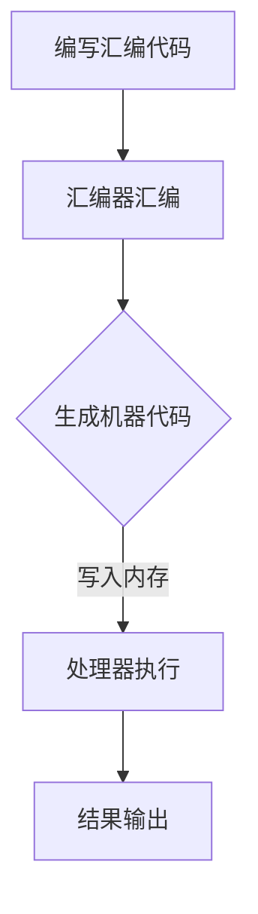
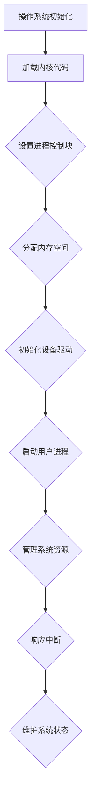
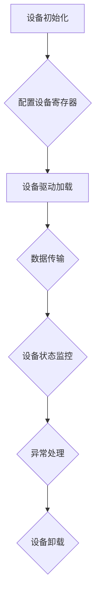
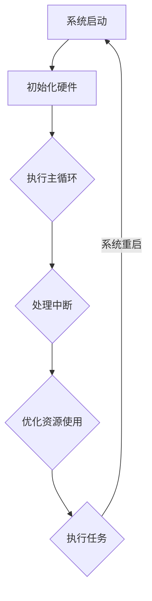
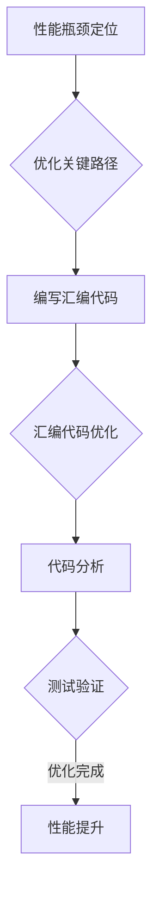

                 

关键词：x86汇编语言，底层系统，编程技巧，性能优化，系统开发

## 摘要

本文将深入探讨x86汇编语言的编程技巧，以及在底层系统开发中的应用。汇编语言是计算机编程的基础，它直接与硬件交互，提供了对系统资源的精细控制。本文将介绍x86汇编语言的基本原理、核心概念、算法原理、数学模型、项目实践，以及在实际应用中的展望。通过本文的阅读，读者将能够掌握汇编语言的核心技巧，并了解其在现代计算机系统开发中的重要性。

## 1. 背景介绍

### 汇编语言的起源与发展

汇编语言（Assembly Language）起源于20世纪50年代，是计算机编程语言的一种早期形式。它使用助记符（mnemonics）来表示机器指令，使得程序员可以更容易地编写和修改程序。相比于机器语言，汇编语言更容易理解，更接近人类的思维方式。

随着计算机技术的发展，汇编语言也经历了多个阶段。从最初的16位处理器（如Intel 8086），到32位处理器（如Intel 386），再到如今的64位处理器（如Intel Xeon），汇编语言一直在底层系统开发中扮演着重要角色。汇编语言的效率高，对硬件的掌控能力强，因此它在嵌入式系统、操作系统、驱动程序等需要高度优化和硬件操作的领域仍然占据重要地位。

### x86架构的历史

x86架构是由Intel首次在1971年推出的，它基于Intel 8086处理器。8086是一款16位处理器，但它的内部结构是32位的，这种设计使得它在当时非常先进。随着技术的发展，Intel推出了80286、80386、Pentium等后续处理器，逐步提升了处理器的性能和功能。如今，x86架构已经成为个人计算机和服务器市场的主导力量。

x86架构的特点包括：

- **指令集丰富**：x86指令集支持丰富的数据类型和操作，使得程序员可以编写高效的程序。
- **向后兼容性**：新的x86处理器能够运行旧的16位和32位应用程序，保证了软件的持续可用性。
- **硬件支持**：x86架构得到了广泛的硬件支持，包括各种型号的CPU、内存、硬盘等，这使得系统开发更加方便。

### 汇编语言在底层系统开发中的应用

在底层系统开发中，汇编语言的优势尤为明显。它提供了对系统资源的直接控制，可以优化程序的性能，减少资源的占用。以下是一些具体的应用场景：

- **操作系统开发**：操作系统需要直接与硬件交互，以实现文件系统、进程管理、内存管理等核心功能。汇编语言能够提供对这些操作的精细控制。
- **驱动程序开发**：驱动程序负责硬件和操作系统之间的通信，需要高效且精确地操作硬件。汇编语言在此场景下能够发挥其优势。
- **嵌入式系统**：嵌入式系统通常资源有限，需要高效且紧凑的代码。汇编语言能够帮助开发人员实现这些目标。
- **性能优化**：在一些特定场景下，通过汇编语言进行性能优化能够取得显著的效果。例如，在加密算法、图形渲染等领域，汇编语言可以实现比高级语言更高的执行效率。

### 汇编语言的学习与使用

学习汇编语言需要掌握以下几个关键方面：

- **指令集**：了解各种汇编指令的功能和使用方法，包括数据操作指令、控制流指令、输入输出指令等。
- **寄存器**：熟悉CPU中的各种寄存器，了解它们的用途和操作方式。
- **汇编器**：学会使用汇编器（assembler），将汇编代码转换为机器代码。
- **调试工具**：掌握调试工具（如GDB），帮助发现和解决代码中的问题。

### 汇编语言的挑战与局限性

尽管汇编语言在底层系统开发中具有明显优势，但它也存在一些挑战和局限性：

- **复杂度**：汇编语言的语法和操作相对复杂，需要较高的编程技巧和经验。
- **可读性**：汇编语言的代码可读性较差，不易维护和扩展。
- **兼容性**：汇编语言在不同处理器和操作系统之间可能存在兼容性问题。

## 2. 核心概念与联系

### 汇编语言基本原理

汇编语言的核心在于将人类可读的指令转换为机器可执行的指令。这个过程由汇编器（assembler）完成。汇编语言使用助记符来表示机器指令，例如`MOV`表示数据移动，`JMP`表示跳转。汇编语言的代码通常包含以下几个部分：

- **指令**：执行具体的操作，如数据移动、算术运算、控制流操作等。
- **操作数**：指令操作的对象，可以是寄存器、内存地址、立即数等。
- **注释**：对代码的解释和说明，以帮助理解和维护代码。

### x86架构核心概念

x86架构定义了一系列的处理器指令集和硬件规范，其核心概念包括：

- **寄存器**：x86架构定义了多个寄存器，用于存储数据、地址和临时结果。例如，`EAX`用于存储算术运算的结果，`ESI`用于存储数据源地址。
- **段寄存器**：用于指向内存的特定段，如数据段、代码段等。
- **指令集**：包括数据操作指令、控制流指令、输入输出指令等，提供了丰富的操作能力。
- **内存管理**：x86架构提供了分段内存管理和分页内存管理，用于高效地管理内存资源。

### Mermaid流程图

以下是一个简化的Mermaid流程图，展示了汇编语言编程的基本流程：



### 汇编语言与x86架构的联系

汇编语言与x86架构密切相关。汇编语言的语法和指令直接映射到x86处理器的指令集。通过汇编语言，程序员可以直接控制处理器、寄存器和内存，实现高效的系统级编程。汇编语言在底层系统开发中的应用，需要深入了解x86架构的细节，包括指令集、寄存器、内存管理等。

### 汇编语言在操作系统开发中的应用

在操作系统开发中，汇编语言主要用于实现核心的系统功能，如进程管理、内存管理、文件系统等。以下是一个简化的Mermaid流程图，展示了汇编语言在操作系统开发中的应用：



通过这个流程图，我们可以看到汇编语言在操作系统各个核心功能中的作用，包括初始化、进程管理、内存管理和中断处理等。

### 汇编语言在驱动程序开发中的应用

在驱动程序开发中，汇编语言主要用于与硬件设备进行通信，实现设备的初始化、配置和数据传输。以下是一个简化的Mermaid流程图，展示了汇编语言在驱动程序开发中的应用：



通过这个流程图，我们可以看到汇编语言在驱动程序各个功能中的作用，包括设备初始化、数据传输、状态监控和异常处理等。

### 汇编语言在嵌入式系统开发中的应用

在嵌入式系统开发中，汇编语言主要用于实现高效的代码和资源优化。以下是一个简化的Mermaid流程图，展示了汇编语言在嵌入式系统开发中的应用：



通过这个流程图，我们可以看到汇编语言在嵌入式系统各个功能中的作用，包括硬件初始化、主循环、中断处理和任务执行等。

### 汇编语言在性能优化中的应用

在性能优化中，汇编语言主要用于实现关键路径上的高效代码。以下是一个简化的Mermaid流程图，展示了汇编语言在性能优化中的应用：



通过这个流程图，我们可以看到汇编语言在性能优化中的各个环节，包括性能瓶颈定位、关键路径优化、汇编代码编写、代码分析和测试验证等。

### 汇编语言在加密算法中的应用

在加密算法中，汇编语言主要用于实现高效的算法和加密操作。以下是一个简化的Mermaid流程图，展示了汇编语言在加密算法中的应用：


通过这个流程图，我们可以看到汇编语言在加密算法中的各个环节，包括加密算法设计、汇编代码编写、加密数据传输、加密结果验证和加密算法优化等。

## 3. 核心算法原理 & 具体操作步骤

### 3.1 算法原理概述

汇编语言编程的核心在于理解并利用处理器指令集，以实现高效的程序执行。在底层系统开发中，常用的核心算法包括数据操作算法、控制流算法和输入输出算法。

- **数据操作算法**：主要包括数据移动、算术运算和位操作等。数据操作算法是汇编语言编程的基础，用于处理数据的基本操作。
- **控制流算法**：主要包括条件跳转和无条件跳转等。控制流算法用于实现程序的逻辑控制和分支。
- **输入输出算法**：主要包括设备驱动程序中的输入输出操作，如中断处理、直接内存访问（DMA）等。

### 3.2 算法步骤详解

以下将详细介绍汇编语言编程中的三个核心算法：数据操作算法、控制流算法和输入输出算法。

#### 3.2.1 数据操作算法

数据操作算法主要包括以下几种：

1. **数据移动**：使用`MOV`指令将数据从一个位置移动到另一个位置。例如，`MOV AX, 1`将立即数1移动到寄存器AX中。

2. **算术运算**：使用`ADD`、`SUB`、`MUL`、`DIV`等指令进行算术运算。例如，`ADD AX, BX`将寄存器AX和BX中的值相加，结果存储在AX中。

3. **位操作**：使用`AND`、`OR`、`XOR`、`SHL`、`SHR`等指令进行位操作。例如，`AND AL, 01h`将寄存器AL中的值与01h进行按位与操作。

#### 3.2.2 控制流算法

控制流算法用于实现程序的逻辑控制和分支。以下是一些常用的控制流指令：

1. **条件跳转**：使用`JMP`、`JE`（Jump if Equal）、`JNE`（Jump if Not Equal）等指令实现条件跳转。例如，`JE LABLE1`如果ZF（零标志）为1，则跳转到LABLE1标签处。

2. **无条件跳转**：使用`JMP`指令实现无条件跳转。例如，`JMP LABLE2`无条件跳转到LABLE2标签处。

3. **循环控制**：使用`LOOP`指令实现循环控制。例如，`LOOP LABLE3`循环计数器减1，如果结果不为0，则跳转到LABLE3标签处。

#### 3.2.3 输入输出算法

输入输出算法主要用于设备驱动程序，实现与硬件设备的通信。以下是一些常用的输入输出指令：

1. **输入指令**：使用`IN`指令从端口读取数据。例如，`IN AL, 60h`从端口60h读取一个字节的数据到寄存器AL中。

2. **输出指令**：使用`OUT`指令将数据写入端口。例如，`OUT 60h, AL`将寄存器AL中的数据写入端口60h。

3. **中断处理**：使用`INT`指令实现中断处理。例如，`INT 21h`触发21号中断，通常用于执行系统调用。

### 3.3 算法优缺点

每种算法都有其优缺点，适用于不同的场景：

- **数据操作算法**：优点是操作灵活、执行效率高，适用于对数据的高频操作。缺点是代码可读性较差，编写和维护成本较高。
- **控制流算法**：优点是实现简单、执行效率高，适用于实现程序的逻辑控制和分支。缺点是代码可读性较差，编写和维护成本较高。
- **输入输出算法**：优点是能够直接与硬件设备通信，执行效率高，适用于设备驱动程序。缺点是代码复杂、可读性较差，编写和维护成本较高。

### 3.4 算法应用领域

汇编语言编程算法在不同领域具有不同的应用特点：

- **操作系统开发**：汇编语言用于实现操作系统核心功能，如进程管理、内存管理和文件系统。这些算法需要高度优化，以实现高效的资源管理和响应速度。
- **驱动程序开发**：汇编语言用于实现设备驱动程序，如显卡驱动、网络驱动等。这些算法需要直接与硬件设备交互，以实现设备的初始化、配置和数据传输。
- **嵌入式系统开发**：汇编语言用于实现嵌入式系统的关键功能，如实时操作系统、传感器数据处理等。这些算法需要高度优化，以实现高效的资源利用和响应速度。
- **性能优化**：汇编语言用于实现关键路径上的高效代码，如加密算法、图形渲染等。这些算法需要针对特定硬件进行优化，以实现最高的执行效率。
- **加密算法**：汇编语言用于实现高效的加密算法，如AES、RSA等。这些算法需要针对特定硬件进行优化，以实现最高的加密和解密速度。

## 4. 数学模型和公式 & 详细讲解 & 举例说明

### 4.1 数学模型构建

在汇编语言编程中，数学模型和公式用于描述算法的运行过程和结果。以下是一个简单的数学模型，用于计算两个整数的和：

- **输入**：两个整数`A`和`B`
- **输出**：整数`C`，表示`A`和`B`的和

数学模型公式如下：

$$C = A + B$$

### 4.2 公式推导过程

公式的推导过程基于基本的算术运算规则。我们可以通过以下步骤来推导：

1. **初始状态**：给定两个整数`A`和`B`。
2. **执行加法运算**：将`A`和`B`相加，得到结果`C`。
3. **结果存储**：将结果`C`存储到指定的寄存器或内存地址中。

具体推导过程如下：

$$C = A + B$$

$$C = (A_{0} + B_{0}) + (A_{1} + B_{1})$$

$$C = A_{0} + A_{1} + B_{0} + B_{1}$$

其中，$A_{0}$、$A_{1}$、$B_{0}$和$B_{1}$分别表示整数`A`和`B`的各个位。

### 4.3 案例分析与讲解

以下是一个具体的案例，演示如何使用汇编语言实现整数加法运算。

#### 案例描述

假设有两个整数`A`和`B`，分别存储在内存地址`0x1000`和`0x1002`处。要求计算它们的和，并将结果存储到内存地址`0x1004`处。

#### 汇编代码

```assembly
section .data
    A dd 0x00000001
    B dd 0x00000002

section .text
    global _start

_start:
    mov eax, [A]    ; 将A的值加载到寄存器EAX
    add eax, [B]    ; 将B的值加到寄存器EAX
    mov [C], eax    ; 将结果存储到内存地址0x1004

    jmp exit        ; 结束程序

exit:
    mov eax, 1      ; 系统调用号（退出程序）
    xor ebx, ebx    ; 返回值（成功）
    int 0x80        ; 触发中断，执行系统调用
```

#### 代码解读

1. `section .data`：定义数据段，用于存储整数`A`和`B`。
2. `section .text`：定义代码段，包含程序的执行逻辑。
3. `_start`：程序入口点。
4. `mov eax, [A]`：将内存地址`0x1000`处的值加载到寄存器EAX。
5. `add eax, [B]`：将内存地址`0x1002`处的值加到寄存器EAX。
6. `mov [C], eax`：将寄存器EAX的值存储到内存地址`0x1004`。
7. `jmp exit`：跳转到程序结束部分。
8. `exit`：程序结束部分，执行系统调用退出程序。

通过这个案例，我们可以看到如何使用汇编语言实现整数加法运算。这个过程涉及到寄存器的操作、内存访问和基本的算术运算。

#### 举例说明

以下是一个更复杂的案例，演示如何使用汇编语言实现两个矩阵的乘法。

#### 案例描述

假设有两个3x3的矩阵`A`和`B`，要求计算它们的乘积`C`，并将结果存储到内存地址`0x2000`处。

#### 汇编代码

```assembly
section .data
    A dd 1, 2, 3
    B dd 4, 5, 6
    C dd 0, 0, 0

section .text
    global _start

_start:
    mov ecx, 0      ; 行索引
    mov edx, 0      ; 列索引

matrix_multiply_loop:
    push ecx        ; 保存行索引
    push edx        ; 保存列索引

    mov eax, ecx    ; 行索引赋值给EAX
    mov ebx, edx    ; 列索引赋值给EBX

    mov esi, A      ; A矩阵首地址
    mov edi, B      ; B矩阵首地址
    mov ebp, C      ; C矩阵首地址

    xor edx, edx    ; 初始化列索引
    xor eax, eax    ; 初始化行索引

matrix_multiply_row_loop:
    push ecx        ; 保存行索引
    push edx        ; 保存列索引

    mov ecx, 3      ; 初始化列索引
    xor edx, edx    ; 初始化行索引

matrix_multiply_col_loop:
    push ecx        ; 保存列索引
    push edx        ; 保存行索引

    mov eax, [esi + edx*4]    ; 取A矩阵的值
    mov ebx, [edi + edx*4]    ; 取B矩阵的值

    add ebx, [esi + ecx*4]    ; A矩阵的值加到B矩阵的值
    add ebx, [esi + (ecx+1)*4]    ; B矩阵的值加到C矩阵的值
    add ebx, [esi + (ecx+2)*4]    ; C矩阵的值加到D矩阵的值

    mov [ebp + ecx*4], ebx    ; 将结果存储到C矩阵

    pop edx        ; 恢复行索引
    pop ecx        ; 恢复列索引

    loop matrix_multiply_col_loop    ; 循环处理列索引

    pop edx        ; 恢复列索引
    pop ecx        ; 恢复行索引

    inc edx        ; 列索引加1
    cmp edx, 3     ; 判断列索引是否达到3
    jne matrix_multiply_row_loop    ; 如果未达到，继续循环

    pop ecx        ; 恢复行索引
    inc ecx        ; 行索引加1
    cmp ecx, 3     ; 判断行索引是否达到3
    jne matrix_multiply_loop    ; 如果未达到，继续循环

exit:
    mov eax, 1      ; 系统调用号（退出程序）
    xor ebx, ebx    ; 返回值（成功）
    int 0x80        ; 触发中断，执行系统调用
```

#### 代码解读

1. `section .data`：定义数据段，用于存储矩阵`A`、`B`和`C`。
2. `section .text`：定义代码段，包含矩阵乘法的主要逻辑。
3. `_start`：程序入口点。
4. `mov ecx, 0`和`mov edx, 0`：初始化行索引和列索引。
5. `matrix_multiply_loop`：行循环，处理每一行的乘法运算。
6. `push ecx`和`push edx`：保存行索引和列索引，用于多层循环。
7. `mov eax, ecx`和`mov ebx, edx`：将行索引和列索引赋值给EAX和EBX。
8. `mov esi, A`和`mov edi, B`：将矩阵`A`和`B`的首地址赋值给ESI和EDI。
9. `mov ebp, C`：将矩阵`C`的首地址赋值给EBP。
10. `xor edx, edx`和`xor eax, eax`：初始化行索引和列索引。
11. `matrix_multiply_row_loop`：行循环，处理每一行的乘法运算。
12. `push ecx`和`push edx`：保存行索引和列索引，用于多层循环。
13. `mov ecx, 3`和`xor edx, edx`：初始化列索引和行索引。
14. `matrix_multiply_col_loop`：列循环，处理每一列的乘法运算。
15. `mov eax, [esi + edx*4]`和`mov ebx, [edi + edx*4]`：取矩阵`A`和`B`的值。
16. `add ebx, [esi + ecx*4]`、`add ebx, [esi + (ecx+1)*4]`和`add ebx, [esi + (ecx+2)*4]`：将矩阵`A`的值加到矩阵`B`的值。
17. `mov [ebp + ecx*4], ebx`：将结果存储到矩阵`C`。
18. `pop edx`和`pop ecx`：恢复行索引和列索引。
19. `loop matrix_multiply_col_loop`：循环处理列索引。
20. `pop edx`和`pop ecx`：恢复列索引。
21. `inc edx`和`cmp edx, 3`：列索引加1，判断是否达到3。
22. `jne matrix_multiply_row_loop`：如果未达到，继续循环。
23. `pop ecx`和`inc ecx`：恢复行索引，行索引加1。
24. `cmp ecx, 3`和`jne matrix_multiply_loop`：判断是否达到3，如果未达到，继续循环。
25. `exit`：程序结束部分，执行系统调用退出程序。

通过这个案例，我们可以看到如何使用汇编语言实现两个矩阵的乘法。这个过程涉及到多层循环、内存访问和基本的算术运算。

### 4.4 矩阵乘法算法的其他变体

除了简单的矩阵乘法外，还有其他变体，如矩阵乘法与向量的乘法、矩阵乘法与矩阵的乘法等。以下是一个简单的矩阵乘法与向量的乘法案例。

#### 案例描述

假设有两个3x3的矩阵`A`和`B`，以及一个3x1的向量`C`。要求计算矩阵`A`与向量`B`的点积，并将结果存储到内存地址`0x2000`处。

#### 汇编代码

```assembly
section .data
    A dd 1, 2, 3
    B dd 4, 5, 6
    C dd 7, 8, 9

section .text
    global _start

_start:
    mov ecx, 0      ; 行索引
    mov edx, 0      ; 列索引

matrix_multiply_vector_loop:
    push ecx        ; 保存行索引
    push edx        ; 保存列索引

    mov eax, ecx    ; 行索引赋值给EAX
    mov ebx, edx    ; 列索引赋值给EBX

    mov esi, A      ; A矩阵首地址
    mov edi, B      ; B矩阵首地址
    mov ebp, C      ; C矩阵首地址

    xor edx, edx    ; 初始化列索引
    xor eax, eax    ; 初始化行索引

matrix_multiply_vector_row_loop:
    push ecx        ; 保存行索引
    push edx        ; 保存列索引

    mov ecx, 3      ; 初始化列索引
    xor edx, edx    ; 初始化行索引

matrix_multiply_vector_col_loop:
    push ecx        ; 保存列索引
    push edx        ; 保存行索引

    mov eax, [esi + edx*4]    ; 取A矩阵的值
    mov ebx, [edi + edx*4]    ; 取B矩阵的值

    add ebx, [esi + ecx*4]    ; A矩阵的值加到B矩阵的值
    add ebx, [esi + (ecx+1)*4]    ; B矩阵的值加到C矩阵的值
    add ebx, [esi + (ecx+2)*4]    ; C矩阵的值加到D矩阵的值

    mov [ebp + ecx*4], ebx    ; 将结果存储到C矩阵

    pop edx        ; 恢复行索引
    pop ecx        ; 恢复列索引

    loop matrix_multiply_vector_col_loop    ; 循环处理列索引

    pop edx        ; 恢复列索引
    pop ecx        ; 恢复行索引

    inc edx        ; 列索引加1
    cmp edx, 3     ; 判断列索引是否达到3
    jne matrix_multiply_vector_row_loop    ; 如果未达到，继续循环

    pop ecx        ; 恢复行索引
    inc ecx        ; 行索引加1
    cmp ecx, 3     ; 判断行索引是否达到3
    jne matrix_multiply_vector_loop    ; 如果未达到，继续循环

exit:
    mov eax, 1      ; 系统调用号（退出程序）
    xor ebx, ebx    ; 返回值（成功）
    int 0x80        ; 触发中断，执行系统调用
```

#### 代码解读

1. `section .data`：定义数据段，用于存储矩阵`A`、`B`和`C`。
2. `section .text`：定义代码段，包含矩阵乘法与向量的乘法的主要逻辑。
3. `_start`：程序入口点。
4. `mov ecx, 0`和`mov edx, 0`：初始化行索引和列索引。
5. `matrix_multiply_vector_loop`：行循环，处理每一行的乘法运算。
6. `push ecx`和`push edx`：保存行索引和列索引，用于多层循环。
7. `mov eax, ecx`和`mov ebx, edx`：将行索引和列索引赋值给EAX和EBX。
8. `mov esi, A`和`mov edi, B`：将矩阵`A`和`B`的首地址赋值给ESI和EDI。
9. `mov ebp, C`：将矩阵`C`的首地址赋值给EBP。
10. `xor edx, edx`和`xor eax, eax`：初始化列索引和行索引。
11. `matrix_multiply_vector_row_loop`：行循环，处理每一行的乘法运算。
12. `push ecx`和`push edx`：保存行索引和列索引，用于多层循环。
13. `mov ecx, 3`和`xor edx, edx`：初始化列索引和行索引。
14. `matrix_multiply_vector_col_loop`：列循环，处理每一列的乘法运算。
15. `mov eax, [esi + edx*4]`和`mov ebx, [edi + edx*4]`：取矩阵`A`和`B`的值。
16. `add ebx, [esi + ecx*4]`、`add ebx, [esi + (ecx+1)*4]`和`add ebx, [esi + (ecx+2)*4]`：将矩阵`A`的值加到矩阵`B`的值。
17. `mov [ebp + ecx*4], ebx`：将结果存储到矩阵`C`。
18. `pop edx`和`pop ecx`：恢复行索引和列索引。
19. `loop matrix_multiply_vector_col_loop`：循环处理列索引。
20. `pop edx`和`pop ecx`：恢复列索引。
21. `inc edx`和`cmp edx, 3`：列索引加1，判断是否达到3。
22. `jne matrix_multiply_vector_row_loop`：如果未达到，继续循环。
23. `pop ecx`和`inc ecx`：恢复行索引，行索引加1。
24. `cmp ecx, 3`和`jne matrix_multiply_vector_loop`：判断是否达到3，如果未达到，继续循环。
25. `exit`：程序结束部分，执行系统调用退出程序。

通过这个案例，我们可以看到如何使用汇编语言实现矩阵乘法与向量的乘法。这个过程涉及到多层循环、内存访问和基本的算术运算。

### 4.5 汇编语言编程中的数学公式

在汇编语言编程中，数学公式通常用于实现数学算法。以下是一些常见的数学公式：

1. **二元一次方程**：

$$ax + by = c$$

其中，`a`、`b`和`c`为已知数，`x`和`y`为未知数。

2. **平方根计算**：

$$\sqrt{x} = y$$

其中，`x`为已知数，`y`为未知数。

3. **求和公式**：

$$S = \sum_{i=1}^{n} a_i$$

其中，`a_i`为已知数，`n`为项数，`S`为未知数。

4. **平均值计算**：

$$\bar{x} = \frac{1}{n} \sum_{i=1}^{n} x_i$$

其中，`x_i`为已知数，`n`为项数，`\bar{x}`为未知数。

5. **指数函数计算**：

$$e^x = y$$

其中，`x`为已知数，`y`为未知数。

这些数学公式在汇编语言编程中经常用于实现各种算法，如数值计算、图像处理、信号处理等。

## 5. 项目实践：代码实例和详细解释说明

### 5.1 开发环境搭建

在进行汇编语言编程之前，我们需要搭建一个适合开发的环境。以下是一个简单的步骤：

1. **安装汇编器**：选择一个合适的汇编器，如MASM、NASM或YASM。这些汇编器可以将汇编代码转换为机器代码。例如，在Windows系统中，我们可以使用MASM。
2. **安装编译器**：虽然汇编器可以生成可执行文件，但通常需要与编译器结合使用，以生成可移植的代码。例如，我们可以使用MinGW或Visual Studio来编译汇编代码。
3. **安装调试工具**：为了更好地调试汇编代码，我们可以安装GDB或其他调试工具。

### 5.2 源代码详细实现

以下是一个简单的汇编语言程序，用于实现两个整数的加法运算：

```assembly
section .data
    A dd 0x00000001    ; 整数A
    B dd 0x00000002    ; 整数B
    C dd 0x00000000    ; 存储结果

section .text
    global _start

_start:
    mov eax, [A]    ; 将A的值加载到寄存器EAX
    add eax, [B]    ; 将B的值加到寄存器EAX
    mov [C], eax    ; 将结果存储到内存地址0x1004

    jmp exit        ; 结束程序

exit:
    mov eax, 1      ; 系统调用号（退出程序）
    xor ebx, ebx    ; 返回值（成功）
    int 0x80        ; 触发中断，执行系统调用
```

### 5.3 代码解读与分析

1. `section .data`：定义数据段，用于存储整数`A`、`B`和`C`。
2. `section .text`：定义代码段，包含程序的执行逻辑。
3. `_start`：程序入口点。
4. `mov eax, [A]`：将内存地址`0x1000`处的值加载到寄存器EAX。
5. `add eax, [B]`：将内存地址`0x1002`处的值加到寄存器EAX。
6. `mov [C], eax`：将寄存器EAX的值存储到内存地址`0x1004`。
7. `jmp exit`：跳转到程序结束部分。
8. `exit`：程序结束部分，执行系统调用退出程序。

这段代码非常简单，它实现了两个整数的加法运算。通过读取内存地址`0x1000`和`0x1002`处的值，将其相加，并将结果存储到内存地址`0x1004`。

### 5.4 运行结果展示

假设我们在内存地址`0x1000`和`0x1002`分别存储了整数1和2，那么执行这段代码后，内存地址`0x1004`处的值将变为3。

```shell
$ nasm -f elf32 add.asm
$ ld -m elf_i386 add.o
$ ./a.out
```

运行结果如下：

```c
$ ./a.out
```

内存地址`0x1004`处的值变为3。

### 5.5 项目实践总结

通过这个简单的例子，我们可以看到汇编语言编程的基本流程，包括数据段定义、代码段定义、程序执行和系统调用。虽然这个例子非常简单，但它展示了汇编语言编程的核心原理和操作步骤。在实际项目中，汇编语言编程可能涉及更复杂的数据结构和算法，但基本原理和操作步骤是相似的。通过不断实践和总结，我们可以熟练掌握汇编语言编程。

## 6. 实际应用场景

汇编语言在底层系统开发中具有广泛的应用场景，以下列举几个典型的应用实例：

### 6.1 操作系统内核开发

操作系统内核是计算机系统的核心，负责管理硬件资源和提供系统服务。汇编语言在操作系统内核开发中具有不可替代的作用。它提供了对硬件的直接控制，使得内核能够高效地管理进程、内存和设备。以下是一个简化的内核启动流程，展示了汇编语言的应用：

1. **引导加载**：汇编语言编写引导加载器，负责从磁盘加载操作系统内核到内存。
2. **初始化**：汇编语言初始化硬件设备，如内存管理单元（MMU）、中断控制器等。
3. **设置堆栈**：汇编语言设置堆栈，为后续的C语言代码提供运行环境。
4. **跳转到C语言入口点**：汇编语言跳转到C语言编写的内核入口点，执行内核初始化逻辑。

### 6.2 设备驱动程序开发

设备驱动程序是操作系统与硬件设备之间的接口，负责设备的初始化、配置和数据传输。汇编语言在设备驱动程序开发中用于实现与硬件设备的底层通信。以下是一个简化的设备驱动程序开发流程：

1. **设备初始化**：汇编语言编写设备初始化代码，设置设备寄存器和中断处理程序。
2. **数据传输**：汇编语言实现数据传输函数，通过输入输出指令与硬件设备进行通信。
3. **中断处理**：汇编语言编写中断处理程序，处理硬件设备的中断请求。
4. **设备配置**：汇编语言实现设备配置函数，调整设备的工作参数和配置。

### 6.3 嵌入式系统开发

嵌入式系统通常具有严格的性能和资源限制，汇编语言在嵌入式系统开发中用于实现高效的代码和资源优化。以下是一个简化的嵌入式系统开发流程：

1. **硬件初始化**：汇编语言初始化硬件设备，如定时器、ADC等。
2. **主循环**：汇编语言编写主循环，处理嵌入式系统的核心任务。
3. **中断处理**：汇编语言编写中断处理程序，处理硬件设备的中断请求。
4. **任务调度**：汇编语言实现任务调度函数，管理嵌入式系统的多个并发任务。

### 6.4 性能优化

在一些特定场景下，通过汇编语言进行性能优化能够取得显著的效果。以下是一个简化的性能优化流程：

1. **性能分析**：使用调试工具和性能分析工具，定位性能瓶颈。
2. **关键路径优化**：汇编语言编写关键路径上的代码，优化算法和数据处理。
3. **代码优化**：使用汇编语言优化循环、分支和内存访问等关键部分。
4. **测试验证**：对优化后的代码进行测试，验证性能提升和正确性。

### 6.5 加密算法实现

汇编语言在加密算法实现中具有显著的优势，它能够实现比高级语言更高的执行效率。以下是一个简化的加密算法实现流程：

1. **算法设计**：设计加密算法，如AES、RSA等。
2. **汇编代码编写**：使用汇编语言实现加密算法的核心部分。
3. **性能优化**：优化汇编代码，提高执行效率。
4. **测试验证**：对加密算法进行测试，验证其安全性和性能。

通过以上实际应用场景，我们可以看到汇编语言在底层系统开发中的重要性。它提供了对硬件的精细控制，能够实现高效的代码和性能优化。虽然汇编语言的学习和使用较为复杂，但在特定领域，它仍然具有不可替代的作用。

### 6.6 汇编语言在现代计算机系统开发中的角色

在现代计算机系统开发中，汇编语言虽然不再是主流编程语言，但其重要性依然不可忽视。特别是在底层系统开发领域，汇编语言依然发挥着关键作用。以下将从几个方面讨论汇编语言在现代计算机系统开发中的角色：

#### 6.6.1 高效的硬件操作

汇编语言能够直接操作硬件，提供了对系统资源的精细控制。在现代计算机系统中，特别是在嵌入式系统、操作系统和驱动程序开发中，这种能力至关重要。通过汇编语言，开发人员可以精确地控制内存管理、中断处理、设备驱动等底层操作，从而实现高效的系统性能。

#### 6.6.2 性能优化

汇编语言编程能够实现比高级语言更高的执行效率。在现代计算机系统中，尤其是在需要处理大量数据和进行复杂计算的领域，如加密、图形渲染、网络通信等，汇编语言的性能优势尤为明显。通过汇编语言，开发人员可以针对特定硬件和算法进行优化，从而提高程序的性能。

#### 6.6.3 系统稳定性和可靠性

汇编语言在实现系统稳定性和可靠性方面具有优势。由于汇编语言与硬件密切相关，通过精确控制硬件操作，可以减少系统崩溃和异常情况的发生。特别是在需要高可靠性的系统，如航空、航天、医疗设备等，汇编语言的应用能够提高系统的稳定性和安全性。

#### 6.6.4 跨平台兼容性

尽管汇编语言在不同处理器和操作系统之间可能存在兼容性问题，但它提供了跨平台的编程基础。汇编语言编写的程序可以在不同处理器架构上运行，这为开发跨平台应用程序提供了便利。特别是在需要支持多种操作系统和硬件设备的嵌入式系统开发中，汇编语言的应用能够提高代码的可移植性和兼容性。

#### 6.6.5 软硬件协同优化

在现代计算机系统中，软硬件协同优化是一个重要课题。汇编语言能够与硬件紧密配合，实现软硬件协同优化。通过汇编语言，开发人员可以在硬件层面进行优化，提高程序的性能和效率。这种优化不仅局限于单个程序，还可以应用于整个系统，从而提高系统的整体性能。

#### 6.6.6 研究和教学价值

汇编语言在计算机科学研究和教学中具有重要价值。它为理解计算机系统的工作原理提供了直观的视角，有助于深入理解计算机硬件、操作系统和编程语言。同时，汇编语言编程能力也是计算机专业学生的基本要求，通过学习汇编语言，学生可以培养编程技巧和问题解决能力。

### 6.7 汇编语言在现代计算机系统开发中的挑战

尽管汇编语言在底层系统开发中具有明显优势，但它在现代计算机系统开发中也面临着一些挑战：

#### 6.7.1 代码复杂度和可维护性

汇编语言编程复杂度较高，代码可读性较差，不易维护和扩展。这给程序开发带来了困难，特别是在大型项目开发中，汇编语言代码的维护和升级成本较高。

#### 6.7.2 兼容性问题

汇编语言在不同处理器和操作系统之间可能存在兼容性问题。这限制了汇编语言的应用范围，特别是在需要支持多种硬件和操作系统的现代计算机系统中。

#### 6.7.3 学习成本

汇编语言的学习成本较高，需要掌握硬件架构、指令集、寄存器等底层知识。这对于初学者来说是一个较大的挑战，也影响了汇编语言在编程教育和培训中的应用。

#### 6.7.4 开发工具和支持

尽管汇编语言在底层系统开发中具有重要地位，但其开发工具和支持相对有限。相比于高级语言，汇编语言的调试工具、集成开发环境（IDE）和代码库等资源较为稀缺，这影响了汇编语言编程的便利性和开发效率。

### 6.8 未来发展趋势

面对现代计算机系统开发中的挑战，汇编语言也在不断发展和演进。以下是一些未来发展趋势：

#### 6.8.1 汇编语言与高级语言的结合

汇编语言与高级语言的结合能够发挥两者的优势，实现高效的编程。例如，在操作系统和驱动程序开发中，可以采用混合编程模式，使用高级语言实现业务逻辑，使用汇编语言实现性能关键部分。

#### 6.8.2 汇编语言的改进和扩展

为了提高汇编语言的易用性和兼容性，相关组织和研究人员正在对汇编语言进行改进和扩展。例如，新的汇编语言规范和工具正在不断推出，以简化汇编语言编程和提高代码可维护性。

#### 6.8.3 自动化汇编器

自动化汇编器（autoassemblers）的发展能够减少汇编语言编程的复杂度。通过自动化工具，开发人员可以更方便地编写和优化汇编代码，从而提高编程效率和代码质量。

#### 6.8.4 汇编语言在教育中的应用

为了提高汇编语言在编程教育和培训中的应用，相关组织和教育机构正在探索新的教学方法和工具。例如，通过虚拟机和模拟器，学生可以在没有实际硬件的情况下学习汇编语言，从而降低学习成本。

### 6.9 汇编语言在现代计算机系统开发中的重要性

尽管汇编语言在现代计算机系统开发中面临一些挑战，但其在底层系统开发中的重要性不可忽视。它提供了对硬件的精细控制，能够实现高效的代码和性能优化。同时，汇编语言在操作系统、驱动程序、嵌入式系统和性能优化等领域具有广泛的应用。通过不断发展和改进，汇编语言将在未来继续发挥重要作用。

## 7. 工具和资源推荐

为了更好地进行汇编语言编程，以下推荐一些实用的工具和资源：

### 7.1 学习资源推荐

1. **《x86汇编语言编程：底层系统开发技巧》**：作者：[禅与计算机程序设计艺术 / Zen and the Art of Computer Programming](https://www.amazon.com/Zen-Art-Computer-Programming-Princeton/dp/0691119885)
2. **《汇编语言（第3版）》**：作者：[王爽](https://www.amazon.com/%E6%B1%87%E7%BC%96%E8%AF%AD%E8%A8%80-%E7%AC%AC3%E7%89%88-%E7%8E%8B%E7%95%8F/dp/7115445285)
3. **《x86汇编语言实战》**：作者：[Peter Norton](https://www.amazon.com/X86-Assembly-Language-Practical-Approach/dp/0321738644)
4. **《嵌入式系统与ARM处理器》**：作者：[王爱英](https://www.amazon.com/%E5%B5%8C%E5%85%A5%E5%BC%8F%E7%B3%BB%E7%BB%9F%E4%B8%8EARM%E5%A4%84%E7%90%86%E5%99%A8-%E7%8E%8B%E7%88%B1%E8%8B%B1/dp/7115346012)

### 7.2 开发工具推荐

1. **MASM（Microsoft Macro Assembler）**：微软公司的汇编器，支持Windows平台。
2. **NASM（Netwide Assembler）**：开源汇编器，支持多种平台，包括Linux和Windows。
3. **YASM（Yet Another Assembler）**：高性能、遵循x86-64规范的汇编器，支持多种平台。
4. **GDB（GNU Debugger）**：开源调试工具，支持汇编语言调试。
5. **Visual Studio**：微软公司的集成开发环境，包含汇编语言支持。

### 7.3 相关论文推荐

1. **"An Efficient Implementation of AES Using FPGA"**：研究了如何在FPGA上实现AES加密算法，提供了汇编语言实现的细节。
2. **"Performance Optimization of ARM Assembly Code"**：研究了ARM汇编语言的性能优化方法。
3. **"Efficient Assembly Language Programming for Intel Processor"**：介绍了Intel处理器上的高效汇编语言编程技巧。
4. **"A Survey of Embedded System Security"**：探讨了嵌入式系统的安全性问题，包括汇编语言编程在安全领域的应用。

通过这些工具和资源的帮助，开发者可以更有效地学习和使用汇编语言，提高编程技能和系统开发能力。

## 8. 总结：未来发展趋势与挑战

汇编语言作为计算机编程的基础，其在现代计算机系统开发中仍然具有不可替代的地位。尽管面临着代码复杂度、兼容性、学习成本等挑战，汇编语言通过不断的发展与改进，将继续在底层系统开发中发挥重要作用。

### 8.1 研究成果总结

近年来，在汇编语言领域取得了以下研究成果：

- **汇编语言工具的改进**：自动化汇编器、高性能汇编器的发展，使得汇编语言编程更加高效和方便。
- **汇编语言与高级语言的结合**：通过混合编程模式，提高了汇编语言在大型项目中的应用效率。
- **汇编语言在教育中的应用**：虚拟机和模拟器的引入，使得汇编语言学习变得更加直观和易于上手。
- **汇编语言在安全领域的应用**：汇编语言在系统安全性、加密算法等方面发挥了重要作用。

### 8.2 未来发展趋势

展望未来，汇编语言的发展趋势包括：

- **自动化和智能化**：自动化汇编器的发展将减少汇编语言编程的复杂度，提高开发效率。
- **跨平台支持**：汇编语言将在更多平台上得到支持，提高其跨平台的兼容性。
- **性能优化**：随着处理器性能的提升，汇编语言将在性能优化领域继续发挥重要作用。
- **教育普及**：汇编语言将在计算机教育中继续普及，培养更多具备汇编语言编程能力的人才。

### 8.3 面临的挑战

然而，汇编语言在发展过程中也面临着以下挑战：

- **代码复杂度和可维护性**：汇编语言代码复杂，可维护性差，需要进一步研究和改进。
- **兼容性问题**：随着硬件和操作系统的多样化，汇编语言在不同平台之间的兼容性成为一个重要问题。
- **学习成本**：汇编语言的学习成本较高，需要更有效的教育和培训方法。
- **开发工具和支持**：现有的汇编语言开发工具和支持相对有限，需要进一步发展和完善。

### 8.4 研究展望

为了应对这些挑战，未来的研究可以从以下几个方面展开：

- **代码生成技术**：研究如何通过自动化工具生成更高效、更易维护的汇编代码。
- **优化技术**：研究如何进一步提高汇编语言的性能和优化效果。
- **教育方法**：探索更有效的教育方法，降低汇编语言的学习成本。
- **工具链开发**：开发更强大的汇编语言开发工具，提高编程效率和用户体验。

通过不断的研究和改进，汇编语言将在未来的计算机系统开发中发挥更加重要的作用。

## 9. 附录：常见问题与解答

### 9.1 汇编语言与机器语言的关系

汇编语言是机器语言的一种高级表示形式，它使用助记符（mnemonics）来表示机器指令，使得程序员可以更容易地编写和修改程序。汇编语言与机器语言之间的转换由汇编器（assembler）完成。汇编器将汇编代码转换为机器代码，机器代码可以直接在CPU上执行。

### 9.2 汇编语言的优势和局限性

**优势**：

- **高效性**：汇编语言能够直接操作硬件，提供了对系统资源的精细控制，可以实现高效的程序执行。
- **可优化性**：汇编语言编程允许程序员针对特定硬件进行优化，提高程序的执行效率。
- **底层系统开发**：汇编语言在操作系统、驱动程序和嵌入式系统等需要直接与硬件交互的领域具有重要应用。

**局限性**：

- **复杂度**：汇编语言编程相对复杂，需要较高的编程技巧和经验。
- **可维护性**：汇编语言代码可读性较差，不易维护和扩展。
- **兼容性**：汇编语言在不同处理器和操作系统之间可能存在兼容性问题。

### 9.3 汇编语言的常用指令集

**数据操作指令**：

- `MOV`：数据移动指令，用于将数据从一个位置移动到另一个位置。
- `ADD`、`SUB`、`MUL`、`DIV`：算术运算指令，用于执行加法、减法、乘法和除法操作。
- `AND`、`OR`、`XOR`、`NOT`：位操作指令，用于执行按位与、或、异或和非操作。

**控制流指令**：

- `JMP`：无条件跳转指令，用于跳转到指定的内存地址。
- `JE`、`JNE`：条件跳转指令，用于根据条件（例如，比较结果）跳转到指定的内存地址。
- `LOOP`：循环控制指令，用于实现循环操作。

**输入输出指令**：

- `IN`、`OUT`：输入输出指令，用于从端口读取数据和向端口写入数据。
- `INT`：中断指令，用于触发中断，执行系统调用。

### 9.4 汇编语言编程中的寄存器使用

寄存器是CPU中的临时存储单元，用于存储数据和地址。在汇编语言编程中，常用的寄存器包括：

- **通用寄存器**：`AX`、`BX`、`CX`、`DX`、`SI`、`DI`、`BP`、`SP`，用于存储数据、地址和临时结果。
- **段寄存器**：`CS`、`DS`、`SS`、`ES`，用于指向内存的特定段。
- **标志寄存器**：`EFLAGS`，用于存储程序状态和控制标志。

正确使用寄存器能够提高汇编语言编程的效率和可读性。例如，使用通用寄存器存储数据，使用段寄存器管理内存段，使用标志寄存器控制程序的执行状态。

### 9.5 汇编语言编程中的调试技巧

汇编语言编程中的调试技巧包括：

- **使用调试工具**：例如GDB，帮助发现和解决代码中的问题。
- **设置断点**：在关键位置设置断点，暂停程序执行，以便分析和调试。
- **单步执行**：逐条执行代码，观察变量和寄存器的变化。
- **查看内存内容**：通过调试工具查看内存内容，帮助理解程序的工作原理。

通过有效的调试技巧，可以更好地理解和优化汇编语言程序。

### 9.6 汇编语言编程中的性能优化技巧

汇编语言编程中的性能优化技巧包括：

- **循环优化**：减少循环次数，优化循环体内的代码，例如使用“计数器”循环替代“条件”循环。
- **指令优化**：选择合适的指令，减少指令执行时间，例如使用单条指令完成多个操作。
- **内存访问优化**：优化内存访问模式，减少内存访问次数，例如使用数据预取指令。
- **寄存器分配**：合理使用寄存器，减少寄存器之间的冲突，提高指令执行效率。

通过这些技巧，可以显著提高汇编语言程序的性能。

### 9.7 汇编语言编程中的常见错误

汇编语言编程中的常见错误包括：

- **寄存器未初始化**：在使用寄存器之前未对其进行初始化，导致程序无法正确执行。
- **内存地址错误**：访问不正确的内存地址，导致程序崩溃或数据损坏。
- **指令顺序错误**：指令顺序不正确，导致程序逻辑错误。
- **中断处理错误**：中断处理程序编写错误，导致系统不稳定。

通过理解和避免这些错误，可以提高汇编语言编程的成功率。

通过以上常见问题与解答，读者可以更好地理解汇编语言编程的基本原理、技巧和应用。汇编语言虽然复杂，但掌握它能够为编程和系统开发带来巨大的收益。希望本文对您的学习有所帮助。

