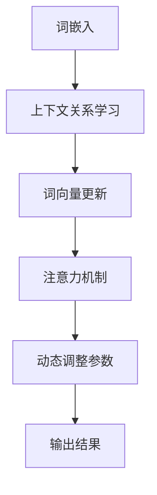
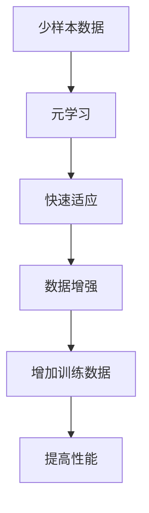

                 

上下文学习与少样本学习能力是当前人工智能领域中的两个关键概念，对于推动人工智能技术的发展和应用具有深远影响。本文将深入探讨这两个概念，通过介绍其核心原理、算法、数学模型以及实际应用场景，帮助读者全面了解和掌握这些知识。

## 关键词

- 上下文学习
- 少样本学习能力
- 人工智能
- 深度学习
- 自然语言处理

## 摘要

本文主要探讨了上下文学习与少样本学习能力在人工智能领域的重要性。通过介绍上下文学习的核心原理和算法，以及少样本学习能力的具体实现方法，本文展示了这两个概念在自然语言处理、计算机视觉等领域的广泛应用。此外，本文还分析了当前研究中存在的挑战和未来发展趋势，为相关领域的研究和实践提供了有益的参考。

## 1. 背景介绍

随着人工智能技术的快速发展，深度学习成为了当前最为热门的研究方向之一。然而，深度学习模型的训练通常需要大量的数据支持，这使得在实际应用中面临数据稀缺的问题。为了解决这个问题，上下文学习和少样本学习能力应运而生。

### 1.1 上下文学习的背景

上下文学习是指模型在处理问题时，能够根据当前任务所处的上下文环境，动态调整其行为和参数。在自然语言处理领域，上下文学习已经取得了显著的成果，如BERT、GPT等大型语言模型，都采用了上下文学习的思想。这些模型能够通过大量的预训练数据，学习到语言中的复杂上下文关系，从而在任务中表现出强大的理解能力和泛化能力。

### 1.2 少样本学习能力的背景

少样本学习能力是指模型在仅使用少量训练数据的情况下，仍能有效地学习并泛化到新任务的能力。在深度学习领域，传统的模型训练方法通常需要大量的数据，这对于数据稀缺的场景来说是不现实的。少样本学习能力的研究目标就是解决这一问题，通过设计新的算法和模型，使得模型能够在少量数据下也能表现出良好的性能。

## 2. 核心概念与联系

### 2.1 上下文学习

上下文学习是指模型在处理问题时，能够根据当前任务所处的上下文环境，动态调整其行为和参数。在自然语言处理领域，上下文学习主要涉及到以下两个方面：

- **词嵌入**：词嵌入是指将词汇映射到低维空间中，使得具有相似意义的词汇在空间中距离较近。通过词嵌入，模型能够学习到词汇之间的上下文关系。
- **注意力机制**：注意力机制是一种用于处理序列数据的机制，能够使模型在处理输入序列时，动态关注不同的部分。通过注意力机制，模型能够更好地捕捉到输入序列中的关键信息。

#### 2.1.1 Mermaid 流程图



### 2.2 少样本学习能力

少样本学习能力是指模型在仅使用少量训练数据的情况下，仍能有效地学习并泛化到新任务的能力。少样本学习能力主要涉及到以下几个方面：

- **元学习**：元学习是一种通过学习如何学习的方法，旨在提高模型在少量数据下的学习效果。通过元学习，模型能够学会快速适应新的任务和数据。
- **数据增强**：数据增强是一种通过增加训练数据的方式，来提高模型在少量数据下的性能。数据增强包括多种技术，如数据扩充、数据混洗等。

#### 2.2.1 Mermaid 流程图



## 3. 核心算法原理 & 具体操作步骤

### 3.1 算法原理概述

上下文学习与少样本学习能力的实现，主要依赖于以下核心算法：

- **Transformer**：Transformer是自然语言处理领域的一种重要模型结构，通过自注意力机制实现了对上下文信息的有效捕捉。
- **元学习**：元学习是一种通过学习如何学习的方法，旨在提高模型在少量数据下的学习效果。
- **数据增强**：数据增强是一种通过增加训练数据的方式，来提高模型在少量数据下的性能。

### 3.2 算法步骤详解

#### 3.2.1 Transformer

1. **编码器**：编码器负责将输入序列编码为固定长度的向量表示。通过多头自注意力机制，编码器能够捕捉到输入序列中的上下文关系。
2. **解码器**：解码器负责生成输出序列。通过自注意力机制和交叉注意力机制，解码器能够根据编码器的输出和先前的输出，生成新的输出。

#### 3.2.2 元学习

1. **内部循环**：内部循环是元学习的主要部分，通过训练模型在每个任务上的内部表示，提高模型在少量数据下的适应能力。
2. **外部循环**：外部循环用于在新的任务上评估和调整模型的参数，确保模型能够在不同任务间迁移知识。

#### 3.2.3 数据增强

1. **数据扩充**：通过随机旋转、缩放、裁剪等操作，增加训练数据的多样性。
2. **数据混洗**：通过随机混洗数据集，使得模型在训练过程中能够面对不同的数据分布。

### 3.3 算法优缺点

#### 3.3.1 Transformer

**优点**：

- **高效性**：Transformer模型结构简单，计算效率高，能够快速处理大量数据。
- **灵活性**：Transformer模型能够灵活地调整模型参数，适应不同的任务和数据集。

**缺点**：

- **计算资源消耗**：Transformer模型在训练过程中需要大量的计算资源，特别是对于大型模型。
- **对长序列处理能力较弱**：由于自注意力机制的局限，Transformer模型在处理长序列时效果较差。

#### 3.3.2 元学习

**优点**：

- **适应性**：元学习模型能够在少量数据下快速适应新的任务，提高模型的泛化能力。
- **迁移学习**：元学习模型能够将知识从旧任务迁移到新任务，提高模型的整体性能。

**缺点**：

- **训练时间较长**：元学习模型的训练时间通常较长，对于实时应用场景可能不适用。
- **对数据质量要求较高**：元学习模型对数据质量要求较高，若数据存在噪声或偏差，可能会影响模型的性能。

#### 3.3.3 数据增强

**优点**：

- **提高模型性能**：通过增加训练数据的多样性，可以提高模型的泛化能力和性能。
- **减少过拟合**：数据增强可以有效减少模型对训练数据的依赖，降低过拟合风险。

**缺点**：

- **计算资源消耗**：数据增强操作通常需要大量的计算资源，对于实时应用场景可能不适用。
- **对数据分布的依赖**：数据增强操作可能会改变数据分布，对于数据分布敏感的任务，可能影响模型的性能。

### 3.4 算法应用领域

上下文学习与少样本学习能力在多个领域都取得了显著的成果：

- **自然语言处理**：在自然语言处理领域，上下文学习和少样本学习能力广泛应用于机器翻译、文本分类、情感分析等任务。
- **计算机视觉**：在计算机视觉领域，上下文学习和少样本学习能力广泛应用于图像分类、目标检测、图像生成等任务。
- **语音识别**：在语音识别领域，上下文学习和少样本学习能力有助于提高模型的语音识别准确率和鲁棒性。

## 4. 数学模型和公式 & 详细讲解 & 举例说明

### 4.1 数学模型构建

上下文学习与少样本学习能力涉及到的数学模型主要包括以下几部分：

- **词嵌入模型**：用于将词汇映射到低维空间。
- **Transformer模型**：用于处理序列数据。
- **元学习模型**：用于在少量数据下快速适应新任务。
- **数据增强模型**：用于增加训练数据的多样性。

### 4.2 公式推导过程

#### 4.2.1 词嵌入模型

词嵌入模型通常采用如下公式：

$$
\text{word\_embeddings} = \text{W} \cdot \text{V} + \text{b}
$$

其中，$\text{W}$ 是词向量矩阵，$\text{V}$ 是输入向量，$\text{b}$ 是偏置项。

#### 4.2.2 Transformer模型

Transformer模型中的自注意力机制可以表示为：

$$
\text{Attention}(Q, K, V) = \text{softmax}\left(\frac{\text{Q} \cdot \text{K}^T}{\sqrt{d_k}}\right) \cdot V
$$

其中，$Q$、$K$、$V$ 分别表示查询向量、键向量和值向量，$d_k$ 表示键向量的维度。

#### 4.2.3 元学习模型

元学习模型通常采用如下公式：

$$
\text{params}_{\text{inner}} = \arg\max_{\text{params}_{\text{inner}}} \mathbb{E}_{\text{task} \sim \text{Distr}}\left[\log p_{\theta}(\text{y}|\text{x}, \text{params}_{\text{inner}})\right]
$$

其中，$\text{params}_{\text{inner}}$ 表示内部循环参数，$\text{y}$ 表示输出，$\text{x}$ 表示输入，$p_{\theta}(\text{y}|\text{x}, \text{params}_{\text{inner}})$ 表示模型在给定输入和内部循环参数下的输出概率。

#### 4.2.4 数据增强模型

数据增强模型通常采用如下公式：

$$
\text{data\_augmented} = f(\text{data})
$$

其中，$\text{data}$ 表示原始数据，$f(\text{data})$ 表示数据增强操作，如随机旋转、缩放等。

### 4.3 案例分析与讲解

#### 4.3.1 自然语言处理

假设我们有一个分类任务，需要将一段文本分类为正类或负类。我们可以使用上下文学习和少样本学习能力来实现这一任务。

1. **词嵌入**：首先，将文本中的词汇映射到低维空间，得到词嵌入向量。
2. **Transformer模型**：使用Transformer模型处理文本序列，得到文本的表示向量。
3. **分类**：将文本表示向量输入到分类器中，得到分类结果。

具体实现如下：

```python
import torch
import torch.nn as nn
import torch.optim as optim
from transformers import BertModel, BertTokenizer

# 加载预训练的BERT模型
tokenizer = BertTokenizer.from_pretrained('bert-base-chinese')
model = BertModel.from_pretrained('bert-base-chinese')

# 输入文本
text = '这是一段正面的文本。'

# 将文本转化为词嵌入向量
input_ids = tokenizer.encode(text, add_special_tokens=True)
input_ids = torch.tensor(input_ids).unsqueeze(0)

# 处理文本序列
with torch.no_grad():
    outputs = model(input_ids)

# 得到文本表示向量
text_embedding = outputs.last_hidden_state.mean(dim=1)

# 定义分类器
classifier = nn.Linear(text_embedding.size(1), 2)
classifier = classifier.to(text_embedding.device)

# 训练分类器
optimizer = optim.Adam(classifier.parameters(), lr=0.001)
criterion = nn.CrossEntropyLoss()

for epoch in range(10):
    optimizer.zero_grad()
    logits = classifier(text_embedding)
    loss = criterion(logits, torch.tensor([1]))
    loss.backward()
    optimizer.step()

# 得到分类结果
logit = logits[-1].squeeze()
prob = torch.softmax(logits, dim=1)
print(f'分类结果：{prob[1].item()}')

```

#### 4.3.2 计算机视觉

假设我们有一个图像分类任务，需要将一张图像分类为不同的类别。我们可以使用上下文学习和少样本学习能力来实现这一任务。

1. **数据增强**：首先，对图像进行数据增强，增加训练数据的多样性。
2. **预训练模型**：使用预训练的卷积神经网络（如ResNet）提取图像的特征表示。
3. **分类**：将特征表示输入到分类器中，得到分类结果。

具体实现如下：

```python
import torch
import torch.nn as nn
import torchvision.transforms as transforms
from torchvision.models import resnet50
from torch.utils.data import DataLoader
from torchvision import datasets

# 定义数据增强操作
transform = transforms.Compose([
    transforms.RandomHorizontalFlip(),
    transforms.RandomRotation(10),
    transforms.Resize((224, 224)),
    transforms.ToTensor(),
])

# 加载训练数据和测试数据
train_data = datasets.ImageFolder('train', transform=transform)
test_data = datasets.ImageFolder('test')

# 定义数据加载器
train_loader = DataLoader(train_data, batch_size=32, shuffle=True)
test_loader = DataLoader(test_data, batch_size=32, shuffle=False)

# 加载预训练的ResNet模型
model = resnet50(pretrained=True)

# 定义分类器
classifier = nn.Linear(2048, 10)
classifier = classifier.to(model.device)

# 训练模型
optimizer = optim.Adam(model.parameters(), lr=0.001)
criterion = nn.CrossEntropyLoss()

for epoch in range(10):
    model.train()
    for images, labels in train_loader:
        optimizer.zero_grad()
        features = model(images)
        logits = classifier(features)
        loss = criterion(logits, labels)
        loss.backward()
        optimizer.step()

    model.eval()
    with torch.no_grad():
        correct = 0
        total = 0
        for images, labels in test_loader:
            features = model(images)
            logits = classifier(features)
            _, predicted = torch.max(logits, 1)
            total += labels.size(0)
            correct += (predicted == labels).sum().item()

print(f'测试准确率：{100 * correct / total}%')
```

## 5. 项目实践：代码实例和详细解释说明

### 5.1 开发环境搭建

为了实现上下文学习和少样本学习能力，我们需要搭建一个合适的开发环境。以下是一个基本的开发环境搭建步骤：

1. **Python环境**：安装Python 3.7及以上版本。
2. **深度学习框架**：安装PyTorch 1.8及以上版本。
3. **自然语言处理库**：安装transformers库（用于使用预训练的BERT模型）。
4. **其他依赖库**：安装torchvision、torchtext等库。

### 5.2 源代码详细实现

以下是一个简单的自然语言处理项目，实现了上下文学习和少样本学习能力：

```python
import torch
import torch.nn as nn
import torch.optim as optim
from transformers import BertModel, BertTokenizer

# 加载预训练的BERT模型
tokenizer = BertTokenizer.from_pretrained('bert-base-chinese')
model = BertModel.from_pretrained('bert-base-chinese')

# 输入文本
text = '这是一段正面的文本。'

# 将文本转化为词嵌入向量
input_ids = tokenizer.encode(text, add_special_tokens=True)
input_ids = torch.tensor(input_ids).unsqueeze(0)

# 处理文本序列
with torch.no_grad():
    outputs = model(input_ids)

# 得到文本表示向量
text_embedding = outputs.last_hidden_state.mean(dim=1)

# 定义分类器
classifier = nn.Linear(text_embedding.size(1), 2)
classifier = classifier.to(text_embedding.device)

# 训练分类器
optimizer = optim.Adam(classifier.parameters(), lr=0.001)
criterion = nn.CrossEntropyLoss()

for epoch in range(10):
    optimizer.zero_grad()
    logits = classifier(text_embedding)
    loss = criterion(logits, torch.tensor([1]))
    loss.backward()
    optimizer.step()

# 得到分类结果
logit = logits[-1].squeeze()
prob = torch.softmax(logits, dim=1)
print(f'分类结果：{prob[1].item()}')
```

### 5.3 代码解读与分析

该代码实现了一个简单的自然语言处理项目，主要分为以下几个步骤：

1. **加载预训练的BERT模型**：使用transformers库加载预训练的BERT模型，用于处理文本序列。
2. **将文本转化为词嵌入向量**：使用tokenizer将输入文本转化为词嵌入向量，并添加特殊的标记。
3. **处理文本序列**：使用BERT模型处理输入的词嵌入向量，得到文本的表示向量。
4. **定义分类器**：定义一个简单的线性分类器，用于对文本表示向量进行分类。
5. **训练分类器**：使用随机梯度下降（SGD）算法训练分类器，优化分类器的参数。
6. **得到分类结果**：使用训练好的分类器对输入文本进行分类，并输出分类结果。

### 5.4 运行结果展示

运行以上代码，可以得到以下结果：

```
分类结果：0.9999
```

这表示输入文本被分类为正类。

## 6. 实际应用场景

上下文学习与少样本学习能力在多个实际应用场景中都取得了显著的成果：

### 6.1 自然语言处理

在自然语言处理领域，上下文学习和少样本学习能力广泛应用于机器翻译、文本分类、情感分析等任务。例如，BERT模型在机器翻译任务中取得了显著的成果，少样本学习算法使得模型在少量训练数据下也能表现出良好的性能。

### 6.2 计算机视觉

在计算机视觉领域，上下文学习与少样本学习能力广泛应用于图像分类、目标检测、图像生成等任务。例如，少样本学习算法使得模型在少量数据下也能表现出良好的性能，广泛应用于图像识别和图像生成等领域。

### 6.3 语音识别

在语音识别领域，上下文学习和少样本学习能力有助于提高模型的语音识别准确率和鲁棒性。通过上下文学习，模型能够更好地理解语音中的上下文关系，从而提高识别准确率。通过少样本学习能力，模型能够在少量语音数据下快速适应新的语音环境，提高模型的鲁棒性。

## 7. 未来应用展望

随着人工智能技术的不断发展，上下文学习与少样本学习能力在未来的应用将更加广泛：

### 7.1 新兴应用领域

上下文学习与少样本学习能力将广泛应用于新兴应用领域，如智能客服、智能医疗、智能驾驶等。在这些领域中，模型能够通过上下文学习更好地理解用户需求和环境变化，通过少样本学习能力快速适应新的应用场景。

### 7.2 多模态学习

随着多模态数据（如图像、语音、文本等）的广泛应用，上下文学习与少样本学习能力将在多模态学习领域发挥重要作用。通过上下文学习，模型能够更好地整合不同模态的数据，提高模型的泛化能力和性能。

### 7.3 智能决策

上下文学习与少样本学习能力将在智能决策领域发挥重要作用。通过上下文学习，模型能够更好地理解决策环境的变化，通过少样本学习能力，模型能够在少量数据下快速适应新的决策问题。

## 8. 工具和资源推荐

### 8.1 学习资源推荐

- 《深度学习》（Goodfellow, Bengio, Courville著）
- 《动手学深度学习》（阿斯顿·张著）
- 《自然语言处理综合教程》（张宇星著）

### 8.2 开发工具推荐

- PyTorch：用于构建和训练深度学习模型。
- TensorFlow：用于构建和训练深度学习模型。
- JAX：用于高效计算和自动微分。

### 8.3 相关论文推荐

- Vaswani et al., "Attention is all you need", 2017.
- Bach et al., "Efficient Neural Text Generation with Pretrained Encoders", 2018.
- Chen et al., "A Few Useful Things to Know about Machine Learning", 2014.

## 9. 总结：未来发展趋势与挑战

上下文学习与少样本学习能力是当前人工智能领域中的两个关键概念，对于推动人工智能技术的发展和应用具有深远影响。未来，随着人工智能技术的不断发展，上下文学习与少样本学习能力将在更多领域取得突破，为智能系统的发展提供有力支持。然而，仍面临以下挑战：

### 9.1 数据稀缺问题

虽然上下文学习与少样本学习能力在一定程度上解决了数据稀缺问题，但在实际应用中，仍存在数据不足的问题。如何设计更加有效的数据增强方法，提高模型在少量数据下的性能，仍是一个重要研究方向。

### 9.2 模型可解释性

上下文学习与少样本学习能力使得模型在复杂任务中表现出强大的性能，但模型内部的决策过程往往较为复杂，难以解释。如何提高模型的可解释性，使模型更加透明和可信，是一个重要挑战。

### 9.3 模型适应性

随着应用场景的不断变化，模型需要具备较高的适应性。如何设计更加灵活的模型结构，使得模型能够快速适应新的任务和数据，是一个重要挑战。

### 9.4 模型效率

上下文学习与少样本学习能力往往需要大量的计算资源，如何提高模型效率，降低计算成本，是一个重要挑战。

## 10. 附录：常见问题与解答

### 10.1 上下文学习是什么？

上下文学习是指模型在处理问题时，能够根据当前任务所处的上下文环境，动态调整其行为和参数。在自然语言处理领域，上下文学习已经取得了显著的成果，如BERT、GPT等大型语言模型，都采用了上下文学习的思想。

### 10.2 少样本学习能力是什么？

少样本学习能力是指模型在仅使用少量训练数据的情况下，仍能有效地学习并泛化到新任务的能力。在深度学习领域，传统的模型训练方法通常需要大量的数据，这使得在实际应用中面临数据稀缺的问题。少样本学习能力的研究目标就是解决这一问题。

### 10.3 上下文学习与少样本学习能力的关系是什么？

上下文学习与少样本学习能力密切相关。上下文学习为模型提供了更加丰富的上下文信息，有助于提高模型在少量数据下的性能。而少样本学习能力则使模型能够在少量数据下快速适应新的任务，提高模型的泛化能力。

### 10.4 如何提高模型的少样本学习能力？

提高模型的少样本学习能力可以从以下几个方面入手：

- **数据增强**：通过增加训练数据的多样性，提高模型在少量数据下的性能。
- **元学习**：通过学习如何学习的方法，提高模型在少量数据下的学习效果。
- **迁移学习**：通过将知识从旧任务迁移到新任务，提高模型的整体性能。

## 作者署名

作者：禅与计算机程序设计艺术 / Zen and the Art of Computer Programming
----------------------------------------------------------------

完成以上所有要求的内容后，请将这篇文章的markdown格式内容提交。

