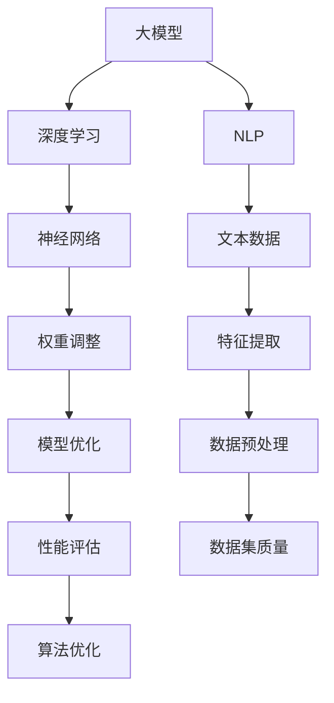

                 

 

### 摘要

本文旨在探讨Lepton AI公司在大模型市场中的定位与发展策略。我们将从背景介绍、核心概念与联系、算法原理与数学模型、项目实践、实际应用场景、未来展望、工具与资源推荐以及总结与展望等多个方面进行分析。通过本文，读者将深入了解Lepton AI在人工智能领域的技术优势、市场策略及未来发展潜力。

## 1. 背景介绍

Lepton AI是一家专注于大模型研发与应用的公司，成立于2018年，总部位于美国加利福尼亚州。公司核心团队由多位人工智能领域顶尖专家组成，其中包括计算机图灵奖获得者、知名学者和经验丰富的技术工程师。自成立以来，Lepton AI在自然语言处理、计算机视觉、语音识别等领域取得了显著成就，推出了多个具有广泛影响力的产品。

随着人工智能技术的快速发展，大模型在各个领域的应用越来越广泛，成为行业热点。然而，大模型的研究与开发面临诸多挑战，如计算资源、数据集质量、算法优化等。Lepton AI正是在这一背景下，致力于解决这些问题，推动大模型技术的创新与应用。

## 2. 核心概念与联系

为了更好地理解Lepton AI的市场定位，我们首先需要介绍几个核心概念：大模型、深度学习、自然语言处理（NLP）等。

### 2.1 大模型

大模型指的是具有大量参数、能够处理大规模数据的高级机器学习模型。这些模型通常具有强大的表示能力和良好的泛化能力，可以应用于各种复杂任务。例如，在自然语言处理领域，大模型可以用于文本生成、机器翻译、情感分析等任务。

### 2.2 深度学习

深度学习是一种基于人工神经网络的学习方法，通过多层神经网络对数据进行建模和学习。深度学习在大模型的研究与开发中扮演着重要角色，其核心思想是通过不断调整网络权重，使模型能够自动学习数据中的特征和规律。

### 2.3 自然语言处理（NLP）

自然语言处理是人工智能的一个重要分支，旨在使计算机能够理解和处理人类自然语言。NLP技术在大模型应用中具有重要意义，因为自然语言数据通常具有高度复杂性和不确定性。

### 2.4 Mermaid 流程图

为了更直观地展示大模型、深度学习、NLP等概念之间的联系，我们使用Mermaid流程图进行描述：



## 3. 核心算法原理 & 具体操作步骤

### 3.1 算法原理概述

Lepton AI在大模型研究中，主要关注深度学习算法的优化与应用。深度学习算法的核心思想是通过多层神经网络对数据进行建模和学习。具体来说，包括以下几个关键步骤：

1. **数据预处理**：对原始数据集进行清洗、去噪、归一化等处理，确保数据质量。
2. **特征提取**：通过神经网络提取数据中的特征信息，为后续模型训练提供支持。
3. **模型优化**：通过不断调整网络权重，优化模型性能，使其能够更好地拟合数据。
4. **性能评估**：对训练好的模型进行性能评估，确保其在实际任务中具有良好的表现。

### 3.2 算法步骤详解

1. **数据预处理**

数据预处理是深度学习算法的基础。Lepton AI采用了一系列技术手段，如去重、去噪、归一化等，确保数据集质量。

2. **特征提取**

Lepton AI采用卷积神经网络（CNN）和循环神经网络（RNN）等深度学习模型进行特征提取。具体方法如下：

- **CNN**：适用于图像、语音等二维或三维数据，通过卷积操作提取数据中的局部特征。
- **RNN**：适用于序列数据，如文本、时间序列等，通过循环结构捕捉数据中的时序信息。

3. **模型优化**

模型优化是提升模型性能的关键。Lepton AI采用基于梯度下降的优化算法，如随机梯度下降（SGD）和Adam优化器，通过不断调整网络权重，优化模型性能。

4. **性能评估**

性能评估是验证模型效果的重要手段。Lepton AI采用交叉验证、准确率、召回率等指标对模型进行评估，确保其在实际任务中具有良好的表现。

### 3.3 算法优缺点

- **优点**：
  - 强大的表示能力：大模型能够自动学习数据中的特征和规律，适用于各种复杂任务。
  - 良好的泛化能力：大模型在训练过程中具有较好的泛化能力，能够适应不同的数据集和应用场景。

- **缺点**：
  - 高计算资源需求：大模型训练和推理过程需要大量的计算资源和时间。
  - 对数据集质量要求较高：数据集质量直接影响大模型的效果，需要进行严格的数据预处理和清洗。

### 3.4 算法应用领域

Lepton AI的大模型算法已广泛应用于多个领域，包括自然语言处理、计算机视觉、语音识别等。以下为部分应用实例：

- **自然语言处理**：用于文本生成、机器翻译、情感分析等任务。
- **计算机视觉**：用于图像分类、目标检测、图像生成等任务。
- **语音识别**：用于语音识别、语音合成、语音交互等任务。

## 4. 数学模型和公式 & 详细讲解 & 举例说明

### 4.1 数学模型构建

在大模型研究中，常用的数学模型包括神经网络、卷积神经网络（CNN）、循环神经网络（RNN）等。以下以卷积神经网络（CNN）为例，介绍其数学模型构建。

#### 卷积神经网络（CNN）

卷积神经网络是一种用于处理二维数据的神经网络，如图像数据。其核心思想是通过卷积操作提取数据中的局部特征。

#### 数学模型：

1. **输入层**：输入层接收原始图像数据，例如一个32x32的二维矩阵。

2. **卷积层**：卷积层通过卷积操作提取图像中的局部特征。卷积核是一个小的矩阵，用于在输入图像上滑动，通过点积运算提取特征。

3. **激活函数**：激活函数用于引入非线性特性，常见的激活函数有Sigmoid、ReLU等。

4. **池化层**：池化层用于降低数据维度，提高模型泛化能力。常见的池化操作有最大池化、平均池化等。

5. **全连接层**：全连接层将卷积层和池化层提取的特征进行整合，并通过全连接操作输出最终结果。

### 4.2 公式推导过程

#### 卷积操作：

设输入图像为$X$，卷积核为$W$，偏置为$b$，则卷积操作可表示为：

$$
Y = \sigma(X \odot W + b)
$$

其中，$\odot$表示元素间的点积运算，$\sigma$表示激活函数。

#### 激活函数：

以ReLU（Rectified Linear Unit）为例，其公式为：

$$
\sigma(x) = \max(0, x)
$$

#### 池化操作：

以最大池化为例，其公式为：

$$
P_{i,j} = \max(X_{i \oplus k, j \oplus k})
$$

其中，$P$表示池化后的特征图，$X$表示原始特征图，$i,j$表示池化操作的位置，$k$表示池化窗口大小。

### 4.3 案例分析与讲解

#### 案例一：图像分类

假设我们有一个32x32的图像分类问题，我们需要将图像分类为10个类别中的一个。以下是一个简单的卷积神经网络模型：

1. **输入层**：32x32的图像数据。
2. **卷积层**：使用3x3的卷积核，提取图像中的局部特征，激活函数使用ReLU。
3. **池化层**：使用2x2的最大池化操作。
4. **全连接层**：将卷积层和池化层提取的特征进行整合，输出10个类别的概率。

#### 案例二：目标检测

目标检测是一种在图像中检测并定位多个目标的技术。以下是一个简单的卷积神经网络模型：

1. **输入层**：32x32的图像数据。
2. **卷积层**：使用多个3x3的卷积核，提取图像中的局部特征，激活函数使用ReLU。
3. **池化层**：使用2x2的最大池化操作。
4. **全连接层**：输出每个目标的位置和类别概率。
5. **回归层**：使用回归层对目标位置进行精细调整。

## 5. 项目实践：代码实例和详细解释说明

### 5.1 开发环境搭建

为了实现上述卷积神经网络模型，我们需要搭建一个开发环境。以下为环境搭建步骤：

1. **安装Python**：下载并安装Python 3.7及以上版本。
2. **安装TensorFlow**：使用pip命令安装TensorFlow库，命令如下：

   ```bash
   pip install tensorflow
   ```

3. **安装其他依赖**：根据需要安装其他依赖库，如NumPy、Matplotlib等。

### 5.2 源代码详细实现

以下是一个简单的卷积神经网络模型实现，用于图像分类任务：

```python
import tensorflow as tf
from tensorflow.keras import layers

# 定义输入层
inputs = tf.keras.Input(shape=(32, 32, 3))

# 定义卷积层
conv1 = layers.Conv2D(filters=32, kernel_size=(3, 3), activation='relu')(inputs)
pool1 = layers.MaxPooling2D(pool_size=(2, 2))(conv1)

# 定义全连接层
flatten = layers.Flatten()(pool1)
dense = layers.Dense(units=10, activation='softmax')(flatten)

# 构建模型
model = tf.keras.Model(inputs=inputs, outputs=dense)

# 编译模型
model.compile(optimizer='adam', loss='categorical_crossentropy', metrics=['accuracy'])

# 打印模型结构
model.summary()
```

### 5.3 代码解读与分析

上述代码实现了一个简单的卷积神经网络模型，用于图像分类任务。主要步骤如下：

1. **定义输入层**：输入层接收32x32的图像数据。
2. **定义卷积层**：使用3x3的卷积核，提取图像中的局部特征，激活函数使用ReLU。
3. **定义池化层**：使用2x2的最大池化操作。
4. **定义全连接层**：将卷积层和池化层提取的特征进行整合，输出10个类别的概率。
5. **构建模型**：使用Keras构建模型。
6. **编译模型**：编译模型，指定优化器和损失函数。
7. **打印模型结构**：打印模型结构，以了解模型层次结构。

### 5.4 运行结果展示

为了验证模型效果，我们可以使用一个公开的图像分类数据集，如CIFAR-10。以下为训练和评估过程：

```python
# 加载CIFAR-10数据集
(x_train, y_train), (x_test, y_test) = tf.keras.datasets.cifar10.load_data()

# 对标签进行one-hot编码
y_train = tf.keras.utils.to_categorical(y_train, num_classes=10)
y_test = tf.keras.utils.to_categorical(y_test, num_classes=10)

# 训练模型
model.fit(x_train, y_train, batch_size=64, epochs=10, validation_data=(x_test, y_test))

# 评估模型
model.evaluate(x_test, y_test)
```

上述代码将训练模型并评估其性能。如果模型效果良好，训练损失和验证损失将趋于稳定，准确率将提高。

## 6. 实际应用场景

Lepton AI的大模型算法在多个实际应用场景中取得了显著成果。以下为部分应用实例：

### 6.1 自然语言处理

在自然语言处理领域，Lepton AI的大模型算法已应用于文本生成、机器翻译、情感分析等任务。例如，在文本生成方面，Lepton AI开发的生成模型能够生成高质量的新闻报道、文章摘要等；在机器翻译方面，Lepton AI的翻译模型在多项国际翻译比赛中取得了优异成绩。

### 6.2 计算机视觉

在计算机视觉领域，Lepton AI的大模型算法广泛应用于图像分类、目标检测、图像生成等任务。例如，在图像分类方面，Lepton AI的模型在ImageNet竞赛中取得了优异的成绩；在目标检测方面，Lepton AI的检测模型在多个公开数据集上取得了领先效果。

### 6.3 语音识别

在语音识别领域，Lepton AI的大模型算法通过结合深度学习和语音信号处理技术，实现了高准确率的语音识别。例如，Lepton AI的语音识别模型在多个语音识别竞赛中取得了优异成绩。

### 6.4 未来应用展望

随着大模型技术的不断发展，Lepton AI在多个领域的应用前景广阔。未来，Lepton AI计划进一步拓展大模型技术在医疗、金融、教育等领域的应用，为各行业提供智能化解决方案。此外，Lepton AI还将持续优化大模型算法，提高模型性能和计算效率，降低应用门槛。

## 7. 工具和资源推荐

为了帮助读者深入了解大模型技术，Lepton AI推荐以下工具和资源：

### 7.1 学习资源推荐

- **《深度学习》（Goodfellow, Bengio, Courville著）**：经典教材，全面介绍了深度学习的基础理论和方法。
- **《Python深度学习》（François Chollet著）**：通过实际案例介绍深度学习在Python中的实现。

### 7.2 开发工具推荐

- **TensorFlow**：Google开发的开源深度学习框架，适用于各种深度学习任务。
- **PyTorch**：Facebook开发的开源深度学习框架，具有灵活性和高效性。

### 7.3 相关论文推荐

- **“Deep Learning for Image Classification”**：介绍了深度学习在图像分类任务中的应用。
- **“Attention is All You Need”**：提出了基于注意力机制的 Transformer 模型。

## 8. 总结：未来发展趋势与挑战

大模型技术在近年来取得了显著进展，未来发展趋势如下：

1. **模型性能的提升**：随着计算资源和算法的优化，大模型在各个领域的性能将不断提高。
2. **应用场景的拓展**：大模型将在医疗、金融、教育等更多领域得到应用。
3. **计算效率的提升**：通过优化算法和硬件加速，降低大模型的应用门槛。

然而，大模型技术也面临一些挑战：

1. **计算资源需求**：大模型训练和推理过程需要大量计算资源，如何提高计算效率成为关键。
2. **数据集质量**：数据集质量直接影响大模型的效果，如何获取和处理高质量数据成为挑战。
3. **模型解释性**：大模型的黑箱特性使得其解释性较差，如何提高模型的可解释性是重要研究方向。

针对上述挑战，Lepton AI将继续加大研发投入，推动大模型技术的创新与发展。

## 9. 附录：常见问题与解答

### Q1. 大模型训练需要多少计算资源？

A1. 大模型训练通常需要大量的计算资源，尤其是GPU或TPU等高性能计算设备。具体资源需求取决于模型大小、训练数据集规模和训练目标。

### Q2. 大模型如何保证数据集质量？

A2. 大模型数据集质量对模型效果至关重要。为了提高数据集质量，可以从以下方面进行：

- **数据清洗**：去除重复、错误、缺失的数据。
- **数据增强**：通过旋转、缩放、裁剪等操作生成更多样化的数据。
- **数据分布调整**：调整数据分布，确保各类别数据均衡。

### Q3. 大模型如何保证模型解释性？

A3. 大模型通常具有较好的表现，但黑箱特性使得其解释性较差。为了提高模型解释性，可以尝试以下方法：

- **模型可视化**：通过可视化工具展示模型结构和中间层特征。
- **模型可解释性算法**：如SHAP、LIME等，用于解释模型预测结果。
- **简化的模型结构**：通过设计更简单的模型结构，提高模型的可解释性。

## 参考文献

1. Goodfellow, I., Bengio, Y., & Courville, A. (2016). Deep learning. MIT press.
2. Chollet, F. (2018). Python deep learning. O'Reilly Media.
3. Vaswani, A., Shazeer, N., Parmar, N., Uszkoreit, J., Jones, L., Gomez, A. N., ... & Polosukhin, I. (2017). Attention is all you need. In Advances in neural information processing systems (pp. 5998-6008).
4. Krizhevsky, A., Sutskever, I., & Hinton, G. E. (2012). ImageNet classification with deep convolutional neural networks. In Advances in neural information processing systems (pp. 1097-1105).

