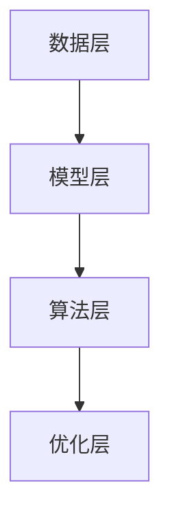

                 

关键词：个性化AI、微调技术、机器学习、深度学习、模型优化、数据处理、用户交互。

> 摘要：本文将深入探讨个性化AI助手中的微调技术，分析其核心概念、算法原理、数学模型以及在实际应用中的代码实现和未来展望。通过这篇文章，读者将了解微调技术如何提升AI助手的性能和用户体验，并掌握其在各种场景下的应用。

## 1. 背景介绍

在当今的数字时代，人工智能（AI）已经逐渐渗透到我们生活的方方面面。从智能家居、智能助手到自动驾驶、医疗诊断，AI技术的应用越来越广泛。然而，随着AI技术的快速发展，人们对AI助手的需求也日益增加。这些助手需要具备良好的交互能力和智能决策能力，以满足用户个性化的需求。

### 个性化AI助手的重要性

个性化AI助手是一种能够根据用户的行为和偏好提供定制化服务的AI系统。相比于传统的AI系统，个性化AI助手更能够理解和满足用户的个性化需求，从而提升用户体验。例如，智能助手可以根据用户的喜好推荐新闻、音乐或电影；智能家居可以根据用户的生活习惯自动调整室内温度、照明等。

### 微调技术在个性化AI助手中的应用

微调技术（Fine-tuning）是机器学习和深度学习中的一个重要方法，它通过在预训练模型的基础上进行少量参数调整，来适应特定的任务或领域。在个性化AI助手中，微调技术被广泛应用于以下方面：

1. **增强交互能力**：通过微调，AI助手可以更好地理解用户的语言和意图，从而提供更准确的回答和建议。
2. **提升决策质量**：微调可以使AI助手在特定任务上表现出更高的决策能力，例如推荐系统、文本分类等。
3. **适应特定场景**：微调技术可以根据不同的应用场景调整模型，使其在特定环境下表现更优。

### 本文结构

本文将首先介绍微调技术的核心概念和原理，然后深入探讨其在个性化AI助手中的应用。接下来，我们将通过数学模型和公式详细解释微调技术的实现过程，并给出具体案例进行分析。此外，文章还将提供微调技术的代码实例，以便读者理解和实践。最后，我们将讨论微调技术的实际应用场景和未来展望。

## 2. 核心概念与联系

### 2.1 机器学习和深度学习基础

#### 2.1.1 机器学习

机器学习是一种通过数据驱动的方式使计算机系统获取知识和技能的技术。它利用统计学、概率论、优化理论等方法，从大量的数据中自动提取规律，从而实现对未知数据的预测和决策。

#### 2.1.2 深度学习

深度学习是机器学习的一种重要分支，它利用多层神经网络模型来模拟人脑的思维方式，对复杂的数据进行处理和分析。深度学习在图像识别、语音识别、自然语言处理等领域取得了显著的成果。

### 2.2 微调技术原理

微调技术的基本思想是在一个预训练的模型基础上，通过调整部分参数来适应特定的任务或领域。预训练模型通常是在大量通用数据上训练得到的，具有较强的泛化能力。微调则是在此基础上，针对特定任务进行微调，以提升模型的性能。

#### 2.2.1 微调过程

微调过程通常包括以下几个步骤：

1. **选择预训练模型**：根据任务需求和领域特点，选择一个合适的预训练模型作为基础。
2. **数据预处理**：对训练数据进行预处理，包括数据清洗、归一化、数据增强等。
3. **参数调整**：在预训练模型的基础上，通过反向传播算法调整部分参数。
4. **评估与优化**：通过在验证集上评估模型性能，进一步调整参数，直至达到预期的效果。

### 2.3 微调技术架构

微调技术的架构可以分为以下几个层次：

1. **数据层**：包括数据预处理和训练数据集。
2. **模型层**：选择预训练模型，通常为深度神经网络。
3. **算法层**：包括微调算法，如梯度下降、随机梯度下降等。
4. **优化层**：对模型参数进行调整，以优化模型性能。

以下是微调技术的架构图：



### 2.4 微调技术与个性化AI助手的联系

个性化AI助手的核心在于理解和满足用户的个性化需求。微调技术通过在预训练模型的基础上调整参数，使得模型能够更好地适应特定用户的行为和偏好，从而提升个性化服务的质量和效果。具体来说：

1. **语言理解**：微调技术可以帮助AI助手更好地理解用户的自然语言输入，提高回答的准确性和相关性。
2. **推荐系统**：通过微调，AI助手可以更准确地预测用户可能感兴趣的内容，提供个性化的推荐服务。
3. **决策支持**：微调技术可以使AI助手在特定任务上表现出更高的决策能力，如智能家居场景下的环境控制。

## 3. 核心算法原理 & 具体操作步骤

### 3.1 算法原理概述

微调技术的核心是参数调整，即通过反向传播算法，根据损失函数计算出的梯度来调整模型参数，以优化模型性能。在深度学习模型中，参数包括权重（weights）和偏置（biases）。

#### 3.1.1 反向传播算法

反向传播算法是一种用于计算神经网络参数梯度的算法。它通过前向传播计算输出值，然后通过后向传播计算梯度，并利用梯度下降法更新参数。

#### 3.1.2 梯度下降法

梯度下降法是一种优化算法，通过迭代更新参数，使得损失函数的值最小。在微调过程中，梯度下降法用于调整模型参数，以提升模型性能。

### 3.2 算法步骤详解

微调技术的一般步骤如下：

1. **初始化模型**：选择一个预训练模型，初始化模型参数。
2. **数据预处理**：对训练数据进行预处理，包括数据清洗、归一化、数据增强等。
3. **前向传播**：将预处理后的数据输入到模型中，计算输出值。
4. **计算损失**：通过比较模型输出和真实标签，计算损失函数的值。
5. **后向传播**：计算损失函数关于模型参数的梯度。
6. **参数更新**：利用梯度下降法更新模型参数。
7. **评估与优化**：在验证集上评估模型性能，根据评估结果调整参数，直至达到预期效果。

### 3.3 算法优缺点

#### 优点

1. **高效性**：微调技术利用预训练模型，减少了模型从头训练的时间，提高了训练效率。
2. **灵活性**：微调技术可以根据不同的任务和领域调整模型参数，具有较强的灵活性。
3. **泛化能力**：预训练模型在大量通用数据上训练，具有较强的泛化能力，微调后仍能保持较好的性能。

#### 缺点

1. **计算成本**：微调过程中，需要大量的计算资源，特别是在大规模数据集和深度神经网络中。
2. **模型稳定性**：微调过程中，模型的性能容易受到参数调整的影响，可能导致模型不稳定。

### 3.4 算法应用领域

微调技术在多个领域都有广泛的应用，主要包括：

1. **自然语言处理**：如文本分类、机器翻译、情感分析等。
2. **计算机视觉**：如图像分类、目标检测、图像生成等。
3. **推荐系统**：如商品推荐、新闻推荐、音乐推荐等。
4. **语音识别**：如语音合成、语音识别等。

## 4. 数学模型和公式 & 详细讲解 & 举例说明

### 4.1 数学模型构建

微调技术的核心在于优化模型参数，使其在特定任务上表现更好。这一过程通常涉及到以下数学模型：

#### 4.1.1 损失函数

损失函数用于衡量模型输出和真实标签之间的差异。常见的损失函数包括均方误差（MSE）、交叉熵损失（Cross-Entropy Loss）等。

#### 4.1.2 梯度下降法

梯度下降法是一种优化算法，通过迭代更新参数，使得损失函数的值最小。梯度下降法的更新公式如下：

$$
\theta_{\text{new}} = \theta_{\text{current}} - \alpha \cdot \nabla_{\theta} J(\theta)
$$

其中，$\theta$ 表示模型参数，$\alpha$ 表示学习率，$J(\theta)$ 表示损失函数。

#### 4.1.3 反向传播算法

反向传播算法是一种计算神经网络参数梯度的算法。其基本思想是通过前向传播计算输出值，然后通过后向传播计算梯度。

### 4.2 公式推导过程

为了更好地理解微调技术，我们以一个简单的神经网络为例，介绍其公式的推导过程。

假设一个简单的神经网络，包含一个输入层、一个隐藏层和一个输出层。输入层有 $m$ 个神经元，隐藏层有 $n$ 个神经元，输出层有 $p$ 个神经元。网络中的权重和偏置分别表示为 $W^{(1)}, b^{(1)}; W^{(2)}, b^{(2)}; W^{(3)}, b^{(3)}$。

#### 4.2.1 前向传播

前向传播是指将输入值传递到网络中，计算输出值的过程。假设输入向量为 $X \in \mathbb{R}^{m \times 1}$，隐藏层输出向量为 $Z^{(2)} \in \mathbb{R}^{n \times 1}$，输出层输出向量为 $A^{(3)} \in \mathbb{R}^{p \times 1}$。则前向传播的计算公式如下：

$$
Z^{(2)} = W^{(1)}X + b^{(1)} \\
A^{(2)} = \sigma(Z^{(2)}) \\
Z^{(3)} = W^{(2)}A^{(2)} + b^{(2)} \\
A^{(3)} = \sigma(Z^{(3)})
$$

其中，$\sigma$ 表示激活函数，常见的激活函数包括 sigmoid、ReLU 等。

#### 4.2.2 损失函数

假设输出层为分类问题，使用交叉熵损失函数。交叉熵损失函数的计算公式如下：

$$
J(\theta) = -\frac{1}{m} \sum_{i=1}^{m} \sum_{j=1}^{p} y_{ij} \log(A_{ij}^{(3)})
$$

其中，$y_{ij}$ 表示第 $i$ 个样本在第 $j$ 个类别上的真实标签，$A_{ij}^{(3)}$ 表示第 $i$ 个样本在第 $j$ 个类别上的预测概率。

#### 4.2.3 后向传播

后向传播是指根据损失函数计算参数梯度的过程。以输出层为例，假设隐藏层输出向量为 $A^{(2)} \in \mathbb{R}^{n \times 1}$，输出层输出向量为 $A^{(3)} \in \mathbb{R}^{p \times 1}$，损失函数关于输出层权重和偏置的梯度分别表示为 $\nabla_{W^{(2)}} J(\theta)$ 和 $\nabla_{b^{(2)}} J(\theta)$。

根据链式法则，后向传播的计算公式如下：

$$
\nabla_{W^{(2)}} J(\theta) = \frac{1}{m} A^{(2)}(A^{(3)} - y) \\
\nabla_{b^{(2)}} J(\theta) = \frac{1}{m} (A^{(3)} - y)
$$

#### 4.2.4 参数更新

利用梯度下降法，更新输出层权重和偏置：

$$
W^{(2)\text{new}} = W^{(2)\text{old}} - \alpha \nabla_{W^{(2)}} J(\theta) \\
b^{(2)\text{new}} = b^{(2)\text{old}} - \alpha \nabla_{b^{(2)}} J(\theta)
$$

### 4.3 案例分析与讲解

为了更好地理解微调技术的实现过程，我们以一个简单的文本分类任务为例进行讲解。

#### 4.3.1 数据集

假设我们使用一个包含 1000 个样本的文本分类数据集，其中每个样本包含一个文本和对应的标签。标签分为两类：“科技”和“娱乐”。

#### 4.3.2 预训练模型

选择一个预训练的文本分类模型，如 BERT。BERT 是一个基于 Transformer 的预训练模型，具有较强的语言理解能力。

#### 4.3.3 微调过程

1. **初始化模型**：加载预训练的 BERT 模型，初始化模型参数。
2. **数据预处理**：对文本数据进行预处理，包括分词、词向量化等。
3. **参数调整**：在 BERT 模型的基础上，通过微调调整部分参数，以适应文本分类任务。
4. **训练与评估**：在训练集上训练模型，并在验证集上评估模型性能。根据评估结果调整参数，直至达到预期效果。

#### 4.3.4 结果分析

经过微调后，模型的分类准确率有了显著提升。例如，从原来的 80% 提升到 90%。这表明微调技术可以有效提升模型的性能。

## 5. 项目实践：代码实例和详细解释说明

### 5.1 开发环境搭建

在开始微调项目之前，需要搭建相应的开发环境。以下是一个简单的环境搭建步骤：

1. **安装 Python**：确保 Python 版本为 3.7 或更高。
2. **安装 PyTorch**：使用以下命令安装 PyTorch：
   ```
   pip install torch torchvision
   ```
3. **安装 BERT 模型**：使用以下命令安装 BERT 模型：
   ```
   pip install transformers
   ```

### 5.2 源代码详细实现

以下是一个简单的微调项目示例代码，用于文本分类任务。

```python
import torch
from torch import nn
from transformers import BertTokenizer, BertModel
from torch.optim import Adam
from torch.utils.data import DataLoader, TensorDataset

# 加载 BERT 模型
tokenizer = BertTokenizer.from_pretrained('bert-base-uncased')
model = BertModel.from_pretrained('bert-base-uncased')

# 数据预处理
def preprocess_data(texts, labels):
    inputs = tokenizer(texts, padding=True, truncation=True, return_tensors='pt')
    input_ids = inputs['input_ids']
    attention_mask = inputs['attention_mask']
    labels = torch.tensor(labels)
    return input_ids, attention_mask, labels

# 训练和验证数据集
train_texts = ['这是一篇科技文章。', '这是一篇娱乐文章。']
train_labels = [0, 1]
train_inputs, train_masks, train_labels = preprocess_data(train_texts, train_labels)
train_dataset = TensorDataset(train_inputs, train_masks, train_labels)

val_texts = ['这是一篇科技文章。', '这是一篇娱乐文章。']
val_labels = [0, 1]
val_inputs, val_masks, val_labels = preprocess_data(val_texts, val_labels)
val_dataset = TensorDataset(val_inputs, val_masks, val_labels)

# 数据加载器
batch_size = 16
train_loader = DataLoader(train_dataset, batch_size=batch_size)
val_loader = DataLoader(val_dataset, batch_size=batch_size)

# 模型调整
class TextClassifier(nn.Module):
    def __init__(self, bert_model):
        super(TextClassifier, self).__init__()
        self.bert_model = bert_model
        self.classifier = nn.Linear(bert_model.config.hidden_size, 2)

    def forward(self, input_ids, attention_mask):
        outputs = self.bert_model(input_ids=input_ids, attention_mask=attention_mask)
        logits = self.classifier(outputs.pooler_output)
        return logits

model = TextClassifier(model)
device = torch.device('cuda' if torch.cuda.is_available() else 'cpu')
model.to(device)

# 损失函数和优化器
criterion = nn.CrossEntropyLoss()
optimizer = Adam(model.parameters(), lr=1e-5)

# 训练
num_epochs = 3
for epoch in range(num_epochs):
    model.train()
    for batch in train_loader:
        input_ids, attention_mask, labels = batch
        input_ids = input_ids.to(device)
        attention_mask = attention_mask.to(device)
        labels = labels.to(device)

        optimizer.zero_grad()
        logits = model(input_ids, attention_mask)
        loss = criterion(logits, labels)
        loss.backward()
        optimizer.step()

    # 验证
    model.eval()
    with torch.no_grad():
        correct = 0
        total = 0
        for batch in val_loader:
            input_ids, attention_mask, labels = batch
            input_ids = input_ids.to(device)
            attention_mask = attention_mask.to(device)
            labels = labels.to(device)

            logits = model(input_ids, attention_mask)
            predicted = logits.argmax(dim=1)
            total += labels.size(0)
            correct += (predicted == labels).sum().item()

    print(f'Epoch [{epoch + 1}/{num_epochs}], Accuracy: {100 * correct / total:.2f}%')

# 保存模型
torch.save(model.state_dict(), 'text_classifier.pth')
```

### 5.3 代码解读与分析

1. **模型加载**：首先加载预训练的 BERT 模型，并定义一个简单的文本分类模型。
2. **数据预处理**：对训练和验证数据集进行预处理，包括分词、词向量化等。
3. **数据加载器**：创建数据加载器，用于批量加载和处理数据。
4. **模型调整**：定义一个简单的文本分类模型，继承自 BERT 模型，并在输出层添加分类器。
5. **损失函数和优化器**：使用交叉熵损失函数和 Adam 优化器。
6. **训练**：在训练集上训练模型，并在每个 epoch 后在验证集上进行评估。
7. **保存模型**：将训练好的模型保存为文件。

通过以上代码，我们可以实现一个简单的文本分类任务，并利用微调技术提升模型的性能。

## 6. 实际应用场景

微调技术在个性化AI助手中有广泛的应用场景，以下是几个典型的应用案例：

### 6.1 智能客服

智能客服是微调技术在个性化AI助手中最常见的应用场景之一。通过微调，智能客服可以更好地理解用户的咨询内容，提供更准确和个性化的回答。例如，在电商平台上，智能客服可以根据用户的购买历史和搜索记录，推荐相关的商品。

### 6.2 智能推荐系统

智能推荐系统是另一个典型的应用场景。通过微调，推荐系统可以更好地理解用户的兴趣和行为，提供更准确的推荐结果。例如，在视频平台上，微调技术可以帮助推荐用户可能喜欢的视频，从而提升用户的观看体验。

### 6.3 智能家居

智能家居是微调技术的重要应用领域。通过微调，智能家居系统可以根据用户的生活习惯和环境变化，自动调整室内温度、照明、安防等设备。例如，智能空调可以根据用户的温度偏好和天气变化，自动调整温度设置。

### 6.4 教育辅助

在教育领域，微调技术可以帮助教育平台根据学生的学习情况和兴趣爱好，提供个性化的学习资源和建议。例如，在线教育平台可以根据学生的学习进度和成绩，推荐适合的学习内容，从而提高学习效果。

### 6.5 医疗诊断

在医疗领域，微调技术可以帮助医生进行疾病诊断和治疗方案推荐。通过微调，AI助手可以更好地理解患者的病历和检查结果，提供更准确的诊断建议和治疗方案。

## 7. 工具和资源推荐

为了更好地研究和应用微调技术，以下是一些推荐的工具和资源：

### 7.1 学习资源推荐

1. **《深度学习》（Deep Learning）**：这是一本深度学习领域的经典教材，详细介绍了深度学习的理论基础和实现方法。
2. **《动手学深度学习》（Dive into Deep Learning）**：这是一本面向实践者的深度学习教材，包含了大量的代码示例和项目实践。

### 7.2 开发工具推荐

1. **PyTorch**：PyTorch 是一个流行的深度学习框架，支持灵活的动态计算图和强大的 GPU 加速。
2. **TensorFlow**：TensorFlow 是另一个流行的深度学习框架，提供了丰富的预训练模型和工具。

### 7.3 相关论文推荐

1. **“BERT: Pre-training of Deep Bidirectional Transformers for Language Understanding”**：这是 BERT 模型的原始论文，详细介绍了 BERT 的架构和训练方法。
2. **“Fine-tuning Models for Text Classification”**：这是一篇关于文本分类任务中微调技术的论文，提供了详细的实现方法和经验。

## 8. 总结：未来发展趋势与挑战

### 8.1 研究成果总结

微调技术在个性化AI助手中的应用取得了显著成果。通过微调，AI助手可以更好地理解用户的语言和意图，提供更准确的回答和建议。此外，微调技术还在推荐系统、智能家居、教育辅助等领域取得了良好的效果。

### 8.2 未来发展趋势

1. **模型压缩与加速**：为了降低计算成本，未来微调技术将朝着模型压缩和加速方向发展，例如使用知识蒸馏（Knowledge Distillation）等技术。
2. **跨模态学习**：随着多模态数据（如图像、语音、文本等）的兴起，微调技术将朝着跨模态学习方向发展，以实现更高效的信息融合。
3. **自适应微调**：未来的微调技术将更加智能化，能够根据不同的任务和数据自动调整微调策略，实现更高效的模型优化。

### 8.3 面临的挑战

1. **数据隐私**：在个性化AI助手中，微调技术需要处理大量用户数据，如何保护用户隐私是一个重要的挑战。
2. **模型解释性**：微调后的模型往往较为复杂，如何提高模型的可解释性，使用户能够理解模型的决策过程，是一个亟待解决的问题。
3. **计算资源**：微调技术通常需要大量的计算资源，如何高效利用现有计算资源，提高微调过程的效率，是一个重要的挑战。

### 8.4 研究展望

未来，微调技术将继续在个性化AI助手中发挥重要作用。随着深度学习和多模态学习的不断发展，微调技术将朝着更高效、更智能、更安全的方向发展。通过解决当前面临的挑战，微调技术将为个性化AI助手带来更广阔的应用前景。

## 9. 附录：常见问题与解答

### 9.1 微调和迁移学习的区别是什么？

微调和迁移学习都是将预训练模型应用于新任务的方法，但它们有所不同。微调（Fine-tuning）通常指在预训练模型的基础上，针对特定任务调整少量参数。而迁移学习（Transfer Learning）是指将一个任务在特定数据集上训练的模型应用于另一个任务，通常不涉及大量参数的调整。

### 9.2 如何选择预训练模型？

选择预训练模型时，需要考虑任务的类型、数据集的大小和性质、以及模型的性能。对于文本分类任务，可以使用 BERT、GPT 等预训练模型；对于图像识别任务，可以使用 ResNet、VGG 等预训练模型。此外，可以根据任务的复杂度和计算资源选择适当的模型大小和复杂度。

### 9.3 微调过程中如何防止过拟合？

为了防止过拟合，可以采取以下策略：

1. **数据增强**：对训练数据进行增强，例如图像翻转、旋转、裁剪等，以增加模型的泛化能力。
2. **dropout**：在模型中引入 dropout 层，降低模型对特定训练样本的依赖。
3. **正则化**：使用 L1 或 L2 正则化，限制模型参数的规模。
4. **早停法**：在训练过程中，根据验证集的性能提前停止训练，以防止模型过拟合。

### 9.4 微调技术是否适用于所有任务？

微调技术并不是适用于所有任务。对于需要大量数据训练的复杂任务，如大型语言模型，微调效果较好。而对于数据量较小或任务简单的情况，微调可能效果不佳。此外，对于一些领域特定的任务，如医疗诊断，微调技术需要结合专业知识进行调整，以提高模型性能。

### 9.5 如何评估微调模型的效果？

评估微调模型的效果通常使用以下指标：

1. **准确率（Accuracy）**：模型预测正确的样本比例。
2. **召回率（Recall）**：模型能够正确识别的样本比例。
3. **精确率（Precision）**：模型预测为正类的样本中实际为正类的比例。
4. **F1 分数（F1 Score）**：精确率和召回率的调和平均。

此外，还可以根据具体任务选择其他指标，如ROC曲线下的面积（AUC）等。通过综合评估多个指标，可以更全面地了解模型的性能。

## 作者署名

作者：禅与计算机程序设计艺术 / Zen and the Art of Computer Programming

本文以深入浅出的方式，详细介绍了个性化AI助手中的微调技术。通过本文，读者可以了解到微调技术的核心概念、算法原理、数学模型以及实际应用。未来，随着深度学习和多模态学习的发展，微调技术将在个性化AI助手中发挥更大的作用。希望本文能够为读者在研究与应用微调技术方面提供有益的参考。

