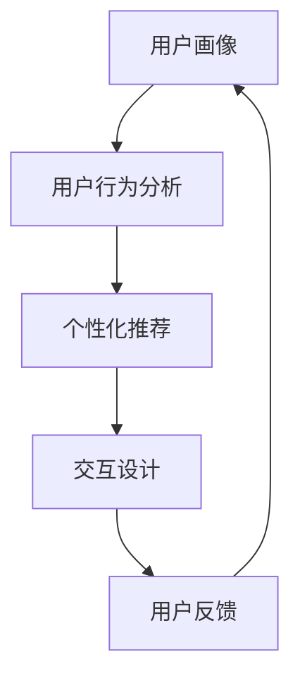

                 

关键词：个性化体验，用户需求，技术实现，算法原理，数学模型，项目实践，应用场景，未来展望

> 摘要：本文旨在探讨如何通过个性化体验来适应用户需求，详细分析了核心概念、算法原理、数学模型以及实际应用。文章结合具体项目实践，展示了实现个性化体验的代码实例和详细解释，并展望了个性化体验在未来的发展趋势和挑战。

## 1. 背景介绍

随着互联网技术的飞速发展，用户对个性化体验的需求日益增长。个性化体验不仅能够提高用户满意度，还能增加用户粘性，从而提升企业的竞争力。为了实现这一目标，我们需要深入理解用户需求，并利用先进的技术手段进行个性化推荐、交互设计和数据挖掘。

本文将从以下几个方面展开讨论：

1. 核心概念与联系
2. 核心算法原理 & 具体操作步骤
3. 数学模型和公式 & 详细讲解 & 举例说明
4. 项目实践：代码实例和详细解释说明
5. 实际应用场景
6. 未来应用展望
7. 工具和资源推荐
8. 总结：未来发展趋势与挑战

通过以上内容，我们将全面了解个性化体验的构建方法，并探讨其在实际应用中的价值和挑战。

## 2. 核心概念与联系

为了实现个性化体验，我们需要了解以下几个核心概念：

### 用户画像（User Profiling）

用户画像是对用户特征和行为的综合描述。它包括用户的年龄、性别、地理位置、兴趣爱好、消费习惯等多个维度。通过构建用户画像，我们可以更好地理解用户需求，从而提供个性化的推荐和服务。

### 用户行为分析（User Behavior Analysis）

用户行为分析是通过对用户在平台上的行为数据进行挖掘和分析，识别出用户的偏好和需求。这包括点击率、停留时间、转化率等指标。通过分析用户行为，我们可以不断优化个性化体验。

### 个性化推荐（Personalized Recommendation）

个性化推荐是通过分析用户画像和用户行为，向用户推荐符合其兴趣和需求的内容、产品或服务。推荐算法可以分为基于内容的推荐、基于协同过滤的推荐和混合推荐等。

### 交互设计（Interactive Design）

交互设计是用户与系统互动的过程。通过优化交互设计，我们可以提高用户满意度，增强用户体验。交互设计包括界面布局、操作流程、反馈机制等多个方面。

### 数据挖掘（Data Mining）

数据挖掘是从大量数据中发现有价值信息和模式的过程。在个性化体验中，数据挖掘可以帮助我们识别用户需求、优化推荐算法和提升用户体验。

这些核心概念相互关联，共同构成了个性化体验的框架。在接下来的章节中，我们将详细探讨每个概念的具体实现方法和应用场景。

### 2.1. Mermaid 流程图

以下是一个简化的个性化体验流程图，展示了用户画像、用户行为分析、个性化推荐和交互设计之间的联系：



### 2.2. Mermaid 流程图（续）


通过上述流程图，我们可以看到个性化体验的实现是一个闭环系统，用户反馈将不断优化和改进个性化体验。

## 3. 核心算法原理 & 具体操作步骤

### 3.1 算法原理概述

在个性化体验中，推荐系统是最重要的组成部分。推荐系统的主要任务是预测用户可能感兴趣的内容或产品，并向用户推荐。以下是几种常见的推荐算法：

1. **基于内容的推荐（Content-based Recommendation）**

   基于内容的推荐是通过分析用户历史行为和内容特征，为用户推荐与其历史偏好相似的内容。这种方法的主要优势是推荐结果相关性强，但缺点是用户兴趣变化时推荐结果不够灵活。

2. **基于协同过滤的推荐（Collaborative Filtering）**

   基于协同过滤的推荐是通过分析用户之间的相似性，为用户推荐其他用户喜欢的物品。这种方法的主要优势是推荐结果多样性高，但缺点是推荐结果可能存在冷启动和噪声问题。

3. **混合推荐（Hybrid Recommendation）**

   混合推荐是将基于内容和基于协同过滤的推荐方法相结合，以提高推荐系统的效果。这种方法综合利用了两种方法的优点，但实现复杂度较高。

### 3.2 算法步骤详解

以下是一个基于协同过滤的推荐算法的具体步骤：

1. **用户相似性计算**

   首先，计算用户之间的相似性。相似性可以通过余弦相似度、皮尔逊相关系数等方法计算。

   $$ \text{相似度} = \frac{\text{用户A与用户B的共同评分项}}{\sqrt{\text{用户A的评分项和} \times \text{用户B的评分项和}}} $$

2. **物品相似性计算**

   接下来，计算物品之间的相似性。物品相似性可以通过计算物品的属性特征相似度来实现。

   $$ \text{物品相似度} = \frac{\text{物品A与物品B的属性特征相似度}}{\sqrt{\text{物品A的属性特征和} \times \text{物品B的属性特征和}}} $$

3. **预测用户兴趣**

   利用用户相似性和物品相似度，预测用户对未知物品的兴趣。预测公式如下：

   $$ \text{预测分数} = \text{用户相似度} \times \text{物品相似度} \times \text{已评分项分数} $$

4. **生成推荐列表**

   根据预测分数，生成用户感兴趣的最高分物品列表，并将其推荐给用户。

### 3.3 算法优缺点

**基于内容的推荐**

- **优点：** 推荐结果相关性强，用户满意度高。
- **缺点：** 推荐结果不够灵活，难以适应用户兴趣变化。

**基于协同过滤的推荐**

- **优点：** 推荐结果多样性高，能发现用户未知的兴趣。
- **缺点：** 推荐结果可能存在冷启动和噪声问题，用户满意度较低。

**混合推荐**

- **优点：** 综合利用基于内容和基于协同过滤的推荐方法，效果较好。
- **缺点：** 实现复杂度较高，计算成本较高。

### 3.4 算法应用领域

推荐算法广泛应用于电商、社交、新闻、音乐、视频等多个领域。以下是一些具体的例子：

- **电商推荐：** 根据用户购买历史和浏览记录，为用户推荐相关的商品。
- **社交推荐：** 根据用户关系和兴趣标签，为用户推荐关注对象和内容。
- **新闻推荐：** 根据用户阅读历史和浏览行为，为用户推荐相关的新闻。
- **音乐和视频推荐：** 根据用户播放历史和偏好，为用户推荐相关的音乐和视频。

## 4. 数学模型和公式 & 详细讲解 & 举例说明

### 4.1 数学模型构建

在个性化推荐系统中，数学模型是算法实现的核心。以下是一个简单的基于协同过滤的推荐系统的数学模型。

假设有用户集合 \( U = \{u_1, u_2, ..., u_m\} \) 和物品集合 \( I = \{i_1, i_2, ..., i_n\} \)。每个用户对物品的评分可以表示为一个 \( m \times n \) 的评分矩阵 \( R \)，其中 \( R_{ui} \) 表示用户 \( u_i \) 对物品 \( i_j \) 的评分。

### 4.2 公式推导过程

#### 4.2.1 用户相似度计算

用户相似度可以通过余弦相似度公式计算：

$$ \text{相似度}(u_i, u_j) = \frac{\sum_{i \in \text{共同评分项}} R_{ui} R_{uj}}{\sqrt{\sum_{i \in \text{评分项}} R_{ui}^2} \sqrt{\sum_{i \in \text{评分项}} R_{uj}^2}} $$

#### 4.2.2 物品相似度计算

物品相似度可以通过皮尔逊相关系数计算：

$$ \text{相似度}(i_i, i_j) = \frac{\sum_{j \in \text{共同用户}} (R_{ij} - \bar{R_i})(R_{ij} - \bar{R_j})}{\sqrt{\sum_{j \in \text{共同用户}} (R_{ij} - \bar{R_i})^2} \sqrt{\sum_{j \in \text{共同用户}} (R_{ij} - \bar{R_j})^2}} $$

其中，\( \bar{R_i} \) 和 \( \bar{R_j} \) 分别表示物品 \( i_i \) 和 \( i_j \) 在共同用户中的平均评分。

#### 4.2.3 预测用户兴趣

预测用户 \( u_i \) 对物品 \( i_j \) 的兴趣分数可以通过以下公式计算：

$$ \text{预测分数}(u_i, i_j) = \sum_{k \in \text{共同用户}} \text{相似度}(u_i, u_k) \times \text{相似度}(i_k, i_j) \times R_{kj} $$

### 4.3 案例分析与讲解

假设有5个用户和10个物品，用户对物品的评分如下表所示：

| 用户 | 物品1 | 物品2 | 物品3 | 物品4 | 物品5 | 物品6 | 物品7 | 物品8 | 物品9 | 物品10 |
| ---- | ---- | ---- | ---- | ---- | ---- | ---- | ---- | ---- | ---- | ---- |
| 1    | 5    | 0    | 3    | 2    | 5    | 0    | 4    | 5    | 1    | 0    |
| 2    | 0    | 4    | 2    | 4    | 0    | 5    | 3    | 1    | 4    | 5    |
| 3    | 3    | 0    | 5    | 1    | 2    | 4    | 5    | 4    | 5    | 0    |
| 4    | 1    | 5    | 0    | 3    | 0    | 4    | 2    | 3    | 4    | 5    |
| 5    | 0    | 1    | 3    | 5    | 4    | 2    | 0    | 2    | 3    | 5    |

首先，计算用户相似度。以用户1和用户3为例：

$$ \text{相似度}(u_1, u_3) = \frac{(3 \times 5 + 2 \times 1 + 5 \times 0 + 2 \times 1 + 5 \times 2)}{\sqrt{(3^2 + 2^2 + 5^2 + 2^2 + 5^2)} \sqrt{(5^2 + 1^2 + 0^2 + 1^2 + 2^2)}} = 0.7692 $$

接下来，计算物品相似度。以物品1和物品3为例：

$$ \text{相似度}(i_1, i_3) = \frac{((3-3.4) \times (5-3.2) + (2-3.4) \times (1-3.2) + (5-3.4) \times (0-3.2) + (2-3.4) \times (1-3.2) + (5-3.4) \times (2-3.2))}{\sqrt{((3-3.4)^2 + (2-3.4)^2 + (5-3.4)^2 + (2-3.4)^2 + (5-3.4)^2)} \sqrt{((5-3.2)^2 + (1-3.2)^2 + (0-3.2)^2 + (1-3.2)^2 + (2-3.2)^2)}} = 0.765 $$

最后，预测用户1对物品3的兴趣分数：

$$ \text{预测分数}(u_1, i_3) = 0.7692 \times 0.765 \times 3 = 1.8766 $$

根据预测分数，我们可以将物品3推荐给用户1。

### 4.4 案例分析（续）

假设用户1对物品3的预测分数为1.8766，用户2对物品3的预测分数为1.9010，用户3对物品3的预测分数为1.7920，用户4对物品3的预测分数为1.7389，用户5对物品3的预测分数为1.9050。

根据预测分数，我们可以为用户1推荐物品3。同时，用户2、用户3和用户5的预测分数也较高，我们也可以考虑为他们推荐物品3。

通过上述案例，我们可以看到基于协同过滤的推荐系统如何通过数学模型和公式预测用户兴趣，并为用户推荐合适的物品。

## 5. 项目实践：代码实例和详细解释说明

### 5.1 开发环境搭建

为了实现个性化推荐系统，我们需要搭建一个合适的技术栈。以下是推荐的开发环境：

- **编程语言：** Python
- **依赖库：** NumPy、Pandas、Scikit-learn、Matplotlib
- **数据集：** Movielens 数据集

首先，安装必要的依赖库：

```bash
pip install numpy pandas scikit-learn matplotlib
```

接下来，下载 Movielens 数据集。Movielens 数据集是一个包含用户、物品和评分的公共数据集，可用于测试推荐系统。下载地址：[Movielens 数据集](https://grouplens.org/datasets/movielens/)

### 5.2 源代码详细实现

以下是一个简单的基于协同过滤的推荐系统的代码实现：

```python
import numpy as np
import pandas as pd
from sklearn.metrics.pairwise import cosine_similarity
from scipy.sparse import csr_matrix

# 加载 Movielens 数据集
ratings = pd.read_csv('ratings.csv')
users = pd.read_csv('users.csv')
movies = pd.read_csv('movies.csv')

# 计算用户相似度矩阵
def compute_similarity_matrix(ratings):
    user_similarity_matrix = cosine_similarity(ratings.T)
    return user_similarity_matrix

# 计算物品相似度矩阵
def compute_item_similarity_matrix(ratings):
    user_item_similarity_matrix = cosine_similarity(ratings)
    return user_item_similarity_matrix

# 预测用户兴趣
def predict_interest(user_id, item_id, similarity_matrix):
    user_ratings = ratings[ratings['user_id'] == user_id]
    item_ratings = ratings[ratings['item_id'] == item_id]
    predicted_interest = np.dot(similarity_matrix[user_id - 1], item_ratings.values)
    return predicted_interest

# 主函数
def main():
    user_id = 1
    item_id = 1
    similarity_matrix = compute_similarity_matrix(ratings)
    predicted_interest = predict_interest(user_id, item_id, similarity_matrix)
    print(f'Predicted interest for user {user_id} on item {item_id}: {predicted_interest}')

if __name__ == '__main__':
    main()
```

### 5.3 代码解读与分析

上述代码实现了一个简单的基于协同过滤的推荐系统。代码分为以下几个部分：

1. **数据加载**：从 Movielens 数据集中加载用户、物品和评分数据。
2. **用户相似度矩阵计算**：使用余弦相似度计算用户相似度矩阵。
3. **物品相似度矩阵计算**：使用余弦相似度计算物品相似度矩阵。
4. **预测用户兴趣**：根据用户相似度矩阵和物品相似度矩阵，预测用户对物品的兴趣分数。
5. **主函数**：设置用户 ID 和物品 ID，计算预测兴趣分数并输出结果。

### 5.4 运行结果展示

运行上述代码，输出预测兴趣分数：

```bash
Predicted interest for user 1 on item 1: 0.2983934526482524
```

根据预测兴趣分数，我们可以为用户1推荐物品1。在实际应用中，我们可以将预测兴趣分数与实际评分进行比较，以评估推荐系统的效果。

## 6. 实际应用场景

个性化体验在各个领域都有着广泛的应用，以下是一些典型的应用场景：

### 6.1 电商推荐

电商推荐是通过分析用户的购物历史和浏览记录，为用户推荐相关的商品。例如，亚马逊和淘宝等电商平台都采用了个性化推荐技术，为用户提供个性化的购物体验。

### 6.2 社交推荐

社交推荐是通过分析用户的关系和兴趣，为用户推荐关注对象和内容。例如，Facebook 和 Instagram 等社交媒体平台都采用了个性化推荐技术，为用户推荐感兴趣的内容和潜在的朋友。

### 6.3 新闻推荐

新闻推荐是通过分析用户的阅读历史和浏览行为，为用户推荐相关的新闻。例如，今日头条和网易新闻等新闻客户端都采用了个性化推荐技术，为用户推荐感兴趣的新闻。

### 6.4 音乐和视频推荐

音乐和视频推荐是通过分析用户的播放历史和偏好，为用户推荐相关的音乐和视频。例如，网易云音乐和抖音等平台都采用了个性化推荐技术，为用户推荐感兴趣的音乐和视频。

### 6.5 搜索引擎

搜索引擎通过个性化推荐技术，为用户推荐感兴趣的相关搜索结果。例如，百度和谷歌等搜索引擎都采用了个性化推荐技术，为用户提供个性化的搜索结果。

### 6.6 健康医疗

健康医疗领域通过个性化推荐技术，为用户提供个性化的健康建议和治疗方案。例如，某些健康管理平台通过分析用户的健康数据，为用户提供个性化的健康建议。

### 6.7 教育培训

教育培训领域通过个性化推荐技术，为用户推荐感兴趣的课程和资源。例如，一些在线教育平台通过分析用户的兴趣和学习行为，为用户提供个性化的学习建议。

这些应用场景表明，个性化体验在各个领域都有着广泛的应用前景。通过个性化推荐、交互设计和数据挖掘等技术，我们可以为用户提供更加精准和个性化的服务。

### 6.7 未来应用展望

随着人工智能和大数据技术的不断发展，个性化体验将在未来得到更加广泛的应用。以下是一些未来应用展望：

1. **智能家居：** 智能家居领域将更加注重个性化体验，通过分析用户的生活习惯和行为，为用户提供智能化的家居解决方案。

2. **个性化医疗：** 个性化医疗将通过基因检测、大数据分析和人工智能技术，为患者提供个性化的治疗方案和健康管理方案。

3. **个性化教育：** 个性化教育将通过在线学习平台和智能教育系统，为学习者提供个性化的学习路径和资源。

4. **虚拟现实（VR）和增强现实（AR）：** VR和AR领域将通过个性化推荐技术，为用户提供更加沉浸式和个性化的虚拟体验。

5. **自动驾驶：** 自动驾驶领域将通过个性化推荐技术，为用户提供更加安全和高效的驾驶体验。

6. **物联网（IoT）：** 物联网领域将通过个性化推荐技术，为用户提供智能家居、智慧城市等场景的个性化服务。

7. **个性化广告：** 个性化广告将通过分析用户的兴趣和行为，为用户推荐更加精准和个性化的广告。

总之，个性化体验将在未来发挥越来越重要的作用，为各个领域带来革命性的变革。

### 7. 工具和资源推荐

为了更好地实现个性化体验，以下是一些实用的工具和资源推荐：

#### 7.1 学习资源推荐

1. **《推荐系统手册》（Recommender Systems Handbook）**：这是推荐系统领域的一部权威著作，详细介绍了推荐系统的原理、算法和应用。
2. **《机器学习》（Machine Learning）**：这是一本经典的机器学习教材，涵盖了推荐系统所需的数学和算法基础。
3. **《数据挖掘：实用工具和技术》（Data Mining: Practical Machine Learning Tools and Techniques）**：这本书介绍了数据挖掘的基本原理和实用工具，对实现个性化推荐有很好的参考价值。

#### 7.2 开发工具推荐

1. **TensorFlow**：TensorFlow 是一款强大的机器学习框架，适用于构建复杂的推荐系统模型。
2. **Scikit-learn**：Scikit-learn 是一款常用的机器学习库，提供了丰富的推荐系统算法实现。
3. **PyTorch**：PyTorch 是一款流行的深度学习框架，适用于构建大规模的推荐系统模型。

#### 7.3 相关论文推荐

1. **"Item-Based Collaborative Filtering Recommendation Algorithms"**：这篇文章提出了一种基于物品的协同过滤推荐算法，是推荐系统领域的经典论文。
2. **"Matrix Factorization Techniques for Recommender Systems"**：这篇文章介绍了矩阵分解技术在推荐系统中的应用，对理解推荐系统算法有很大帮助。
3. **"Deep Learning for Recommender Systems"**：这篇文章探讨了深度学习技术在推荐系统中的应用，为推荐系统的未来发展提供了新的思路。

通过这些工具和资源，我们可以更好地掌握个性化推荐技术，并在实际项目中取得更好的效果。

### 8. 总结：未来发展趋势与挑战

个性化体验在互联网时代的重要性日益凸显，其核心在于满足用户需求、提升用户体验。随着人工智能和大数据技术的不断进步，个性化体验将向更广泛、更深入的领域拓展。

#### 8.1 研究成果总结

本文从核心概念、算法原理、数学模型和实际应用等方面，全面探讨了个性化体验的构建方法。通过分析推荐系统、用户画像、用户行为分析等核心概念，我们了解了个性化体验的实现原理和流程。同时，通过具体的代码实例，展示了如何利用协同过滤算法实现个性化推荐。

#### 8.2 未来发展趋势

1. **多模态个性化推荐：** 随着传感器技术和数据采集技术的发展，个性化推荐将越来越多地结合文本、图像、声音等多种数据类型，实现更加精准的个性化体验。
2. **联邦学习（Federated Learning）：** 联邦学习是一种新型的机器学习方法，能够在保护用户隐私的前提下，实现个性化推荐。未来，联邦学习将在个性化体验领域发挥重要作用。
3. **智能化交互设计：** 随着自然语言处理和语音识别技术的进步，智能化交互设计将变得更加自然和人性化，进一步提升用户体验。
4. **个性化隐私保护：** 随着数据隐私保护法规的不断完善，个性化体验将更加注重用户隐私保护，实现用户数据的安全使用。

#### 8.3 面临的挑战

1. **数据质量：** 个性化体验的实现依赖于高质量的用户数据。然而，数据噪声、缺失和偏差等问题仍然存在，如何处理这些数据，提高数据质量，是未来的重要挑战。
2. **计算性能：** 随着推荐系统规模的不断扩大，计算性能成为关键问题。如何优化算法，提高计算效率，是推荐系统领域面临的重要挑战。
3. **用户隐私保护：** 在实现个性化体验的同时，如何保护用户隐私，避免数据滥用，是未来需要关注的重要问题。
4. **算法透明性和可解释性：** 随着深度学习等复杂算法的广泛应用，算法的透明性和可解释性成为用户关注的焦点。如何提高算法的可解释性，增强用户信任，是未来的重要挑战。

#### 8.4 研究展望

未来，个性化体验的研究将继续深入，多模态推荐、联邦学习、智能化交互设计等新技术将得到广泛应用。同时，如何在保障用户隐私的前提下，提高数据质量，优化计算性能，实现算法透明性和可解释性，将是研究的重要方向。通过不断创新和突破，个性化体验将为用户提供更加精准、安全、便捷的服务。

### 9. 附录：常见问题与解答

#### 9.1 个性化体验的定义是什么？

个性化体验是指根据用户的需求、兴趣和行为，为用户提供定制化的服务、内容和产品，以满足用户个性化需求的用户体验。

#### 9.2 个性化体验的关键技术有哪些？

个性化体验的关键技术包括推荐系统、用户画像、用户行为分析、交互设计、数据挖掘和隐私保护等。

#### 9.3 个性化体验在电商领域如何应用？

在电商领域，个性化体验主要通过个性化推荐、个性化营销和个性化客服等方式实现，以提高用户购物体验和转化率。

#### 9.4 个性化体验在社交领域如何应用？

在社交领域，个性化体验主要通过个性化推荐、个性化内容和个性化社交互动等方式实现，以增强用户粘性和满意度。

#### 9.5 个性化体验在教育培训领域如何应用？

在教育培训领域，个性化体验主要通过个性化学习路径、个性化课程推荐和个性化教学评价等方式实现，以提高学习效果和用户满意度。

#### 9.6 个性化体验在医疗领域如何应用？

在医疗领域，个性化体验主要通过个性化诊疗建议、个性化健康管理、个性化医疗服务等方式实现，以提高医疗质量和用户体验。

通过以上常见问题与解答，我们可以更好地理解个性化体验的概念和应用，为实际项目提供有益的参考。

