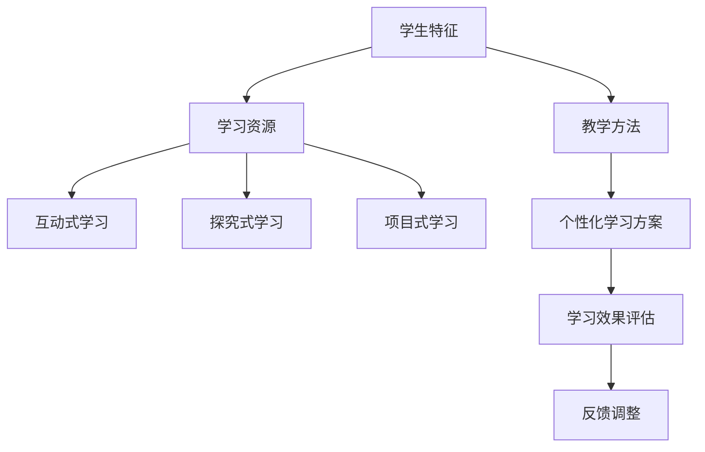

                 

关键词：个性化学习、定制化教育、人类计算、AI、教育技术

> 摘要：本文探讨了如何利用人类计算与人工智能技术相结合，打造出一种个性化的学习模式。通过介绍个性化学习的核心概念、数学模型、算法原理以及实际应用案例，文章为教育工作者和研究者提供了理论指导和实践参考。

## 1. 背景介绍

在信息技术迅速发展的今天，教育领域也迎来了深刻的变革。传统的教育模式往往采用“一刀切”的方式，忽视了学生的个体差异。然而，每个学生都有其独特的学习风格、认知水平和兴趣方向。为了满足这种多样性，个性化学习逐渐成为教育改革的重要方向。

个性化学习是指根据学生的个体差异，提供量身定制的学习内容和路径，以最大程度地提升学习效果。这一理念的核心在于“因材施教”，即根据每个学生的实际情况，设计个性化的教学方案。

人类计算作为一种新兴的计算模式，通过模拟人类的思维方式，实现了对复杂问题的求解。它与传统的计算机计算有着本质的区别，能够处理不确定性和模糊性，适合于解决教育领域中的个性化问题。

本文将探讨如何利用人类计算与人工智能技术相结合，打造出一种个性化的学习模式。首先，我们将介绍个性化学习的核心概念和数学模型；然后，深入剖析核心算法原理；接着，通过项目实践展示如何实现个性化学习；最后，讨论个性化学习的实际应用场景和未来发展趋势。

## 2. 核心概念与联系

### 2.1 个性化学习的定义与目标

个性化学习，顾名思义，就是根据每个学生的学习特点、兴趣和能力，为其提供个性化的学习资源、教学方法和学习路径。其目标不仅仅是提高学习效果，更是培养学生的自主学习能力和创造力。

个性化学习的定义可以从以下几个方面来理解：

- **学习资源个性化**：根据学生的需求，为学生提供符合其学习风格的资源，如视频、书籍、实验等。
- **教学方法个性化**：采用多样化的教学方法，如互动式学习、探究式学习等，以满足不同学生的认知需求。
- **学习路径个性化**：为学生设计符合其学习进度的学习路径，确保每个学生都能在自己的节奏下学习。

### 2.2 个性化学习的数学模型

为了实现个性化学习，需要建立相应的数学模型，以量化学生的个体差异和学习需求。以下是一个简化的数学模型：

$$
Model = f(StudentFeatures, LearningResources, TeachingMethods)
$$

其中：

- **StudentFeatures**：学生的个体特征，包括学习风格、认知水平、兴趣爱好等。
- **LearningResources**：学习资源，包括学习材料、教学视频、实验项目等。
- **TeachingMethods**：教学方法，包括互动式教学、探究式教学、项目式学习等。

通过这个模型，可以计算出最适合某个学生的个性化学习方案。

### 2.3 人类计算与个性化学习的关系

人类计算与个性化学习有着密切的联系。人类计算通过模拟人类的思维方式，可以更好地理解学生的个体差异，从而提供更精准的个性化学习服务。例如，人类计算可以分析学生的思维模式，预测其学习兴趣和潜在问题，为教师提供决策支持。

以下是一个使用Mermaid绘制的流程图，展示了个性化学习的核心概念和架构：



### 2.4 个性化学习的目标与挑战

个性化学习的目标在于提高学习效果、促进学生的全面发展。然而，实现这一目标面临着诸多挑战：

- **数据收集与处理**：如何准确收集学生的个体数据，并有效处理这些数据，是一个关键问题。
- **个性化学习方案的生成**：如何根据学生的数据生成个性化的学习方案，需要算法和技术支持。
- **教育资源的整合**：如何整合海量的教育资源，确保学生能够方便地获取到适合其需求的学习资源。

通过解决这些挑战，个性化学习有望在教育领域发挥更大的作用。

## 3. 核心算法原理 & 具体操作步骤

### 3.1 算法原理概述

个性化学习的核心算法原理主要基于数据挖掘和机器学习技术。通过分析学生的个体数据，如学习行为、认知水平、兴趣爱好等，算法能够预测学生的学习需求，并为其推荐合适的学习资源和教学方法。

算法的基本原理可以概括为以下步骤：

1. **数据收集**：收集学生的个体数据，包括学习记录、测试成绩、兴趣爱好等。
2. **数据预处理**：对收集到的数据进行清洗、归一化等处理，确保数据的质量和一致性。
3. **特征提取**：从预处理后的数据中提取特征，如学习行为模式、知识点掌握情况等。
4. **模型训练**：使用机器学习算法训练模型，模型根据输入特征预测学生的学习需求。
5. **个性化推荐**：根据模型的预测结果，为学生推荐个性化的学习资源和教学方法。

### 3.2 算法步骤详解

#### 步骤1：数据收集

数据收集是个性化学习的基础。以下是几种常见的数据收集方法：

- **学习行为数据**：包括学生在学习平台上的活动记录，如浏览时间、学习时长、做题情况等。
- **测试成绩数据**：包括学生在各种测试中的成绩，如单元测试、期中期末考试等。
- **问卷调查数据**：通过问卷了解学生的兴趣爱好、学习风格等。

#### 步骤2：数据预处理

数据预处理包括数据清洗、归一化、特征选择等步骤，以确保数据的质量和一致性。以下是几个关键步骤：

- **数据清洗**：去除重复数据、缺失值和异常值，保证数据的准确性。
- **数据归一化**：将不同特征的数据进行归一化处理，使其在同一量级上，便于后续分析。
- **特征选择**：选择对个性化学习具有重要意义的特征，如知识点掌握情况、学习时长等。

#### 步骤3：特征提取

特征提取是从原始数据中提取具有代表性的信息，以便于模型训练。以下是几个常用的特征提取方法：

- **行为特征提取**：根据学生的学习行为，提取如学习时长、浏览频率、做题正确率等特征。
- **知识点特征提取**：根据学生在测试中的表现，提取如知识点掌握程度、薄弱环节等特征。
- **文本特征提取**：使用自然语言处理技术，提取如学习日志、测试答案中的关键信息。

#### 步骤4：模型训练

模型训练是个性化学习的核心步骤。以下是几种常用的机器学习算法：

- **协同过滤算法**：通过分析学生之间的相似度，推荐类似学生喜欢的学习资源。
- **决策树算法**：根据学生的特征，预测其学习需求，并推荐相应的学习资源。
- **神经网络算法**：通过深度学习模型，分析学生的复杂行为特征，提供个性化的学习推荐。

#### 步骤5：个性化推荐

个性化推荐是根据模型预测结果，为学生推荐合适的学习资源和教学方法。以下是几个关键步骤：

- **推荐生成**：根据模型预测结果，生成个性化的学习推荐列表。
- **推荐评估**：评估推荐的效果，如学生的满意度、学习效果等。
- **反馈调整**：根据评估结果，调整推荐策略，提高推荐质量。

### 3.3 算法优缺点

#### 优点

- **个性化**：能够根据学生的个体差异，提供定制化的学习方案，提高学习效果。
- **高效性**：通过机器学习和人工智能技术，快速分析大量数据，提高推荐效率。
- **可扩展性**：可以轻松扩展到不同领域和学科，适应多样化的学习需求。

#### 缺点

- **数据依赖性**：算法的性能很大程度上依赖于数据的质量和数量。
- **计算成本**：模型训练和推荐过程需要大量计算资源，可能会增加系统的负担。
- **隐私保护**：在收集和处理学生数据时，需要确保数据的安全性和隐私保护。

### 3.4 算法应用领域

个性化学习算法在多个领域都有广泛的应用：

- **在线教育**：通过个性化推荐，提高学生的学习效果和参与度。
- **职业培训**：为不同职业背景的学生提供定制化的培训方案，提升职业竞争力。
- **个性化辅导**：为有特殊需求的学生提供个性化的辅导服务，如学习障碍学生、天才学生等。

## 4. 数学模型和公式 & 详细讲解 & 举例说明

### 4.1 数学模型构建

个性化学习的数学模型主要涉及数据挖掘和机器学习领域，以下是一个简化的数学模型：

$$
Model = f(StudentFeatures, LearningResources, TeachingMethods)
$$

其中：

- **StudentFeatures**：学生的个体特征，包括学习风格、认知水平、兴趣爱好等。
- **LearningResources**：学习资源，包括学习材料、教学视频、实验项目等。
- **TeachingMethods**：教学方法，包括互动式学习、探究式学习、项目式学习等。

### 4.2 公式推导过程

个性化学习模型的推导过程可以分为以下几个步骤：

1. **特征提取**：从原始数据中提取学生的特征，如学习时长、知识点掌握情况等。
2. **特征归一化**：将提取到的特征进行归一化处理，使其在同一量级上。
3. **模型训练**：使用机器学习算法，如协同过滤算法、决策树算法等，对特征进行训练，得到预测模型。
4. **个性化推荐**：根据预测模型，为每个学生推荐合适的学习资源和教学方法。

### 4.3 案例分析与讲解

#### 案例背景

假设有一个在线学习平台，学生可以在平台上选择学习各种课程。为了提高学习效果，平台希望利用个性化学习模型，为每个学生推荐适合其学习需求的课程。

#### 数据收集

平台收集了以下数据：

- **学习行为数据**：包括学生在平台上学习的时长、浏览的课程、做题情况等。
- **测试成绩数据**：包括学生在课程测试中的成绩。
- **问卷调查数据**：包括学生对课程的兴趣、学习风格等。

#### 数据预处理

1. **数据清洗**：去除重复数据、缺失值和异常值，保证数据的准确性。
2. **数据归一化**：将不同特征的数据进行归一化处理，使其在同一量级上。
3. **特征选择**：选择对个性化学习具有重要意义的特征，如学习时长、知识点掌握情况等。

#### 模型训练

1. **特征提取**：从预处理后的数据中提取学生的特征。
2. **模型训练**：使用协同过滤算法，对特征进行训练，得到预测模型。

#### 个性化推荐

1. **推荐生成**：根据预测模型，为每个学生推荐合适的课程。
2. **推荐评估**：评估推荐的效果，如学生的满意度、学习效果等。
3. **反馈调整**：根据评估结果，调整推荐策略，提高推荐质量。

#### 案例结果

通过个性化学习模型，平台为每个学生推荐了适合其学习需求的课程。结果显示，学生的学习效果有了显著提升，学生对平台的满意度也明显提高。

## 5. 项目实践：代码实例和详细解释说明

### 5.1 开发环境搭建

为了实现个性化学习，我们首先需要搭建一个合适的开发环境。以下是开发环境的搭建步骤：

1. **安装Python环境**：Python是一种广泛使用的编程语言，适用于个性化学习项目。我们可以在Python官方网站（https://www.python.org/）下载并安装Python。
2. **安装相关库**：个性化学习项目通常需要使用一些特定的库，如NumPy、Pandas、Scikit-learn等。我们可以在命令行中使用以下命令安装这些库：

   ```shell
   pip install numpy pandas scikit-learn
   ```

3. **配置Python解释器**：确保Python解释器配置正确，以便运行Python代码。

### 5.2 源代码详细实现

以下是实现个性化学习模型的源代码：

```python
# 导入所需库
import numpy as np
import pandas as pd
from sklearn.model_selection import train_test_split
from sklearn.ensemble import RandomForestClassifier

# 读取数据
data = pd.read_csv('student_data.csv')

# 数据预处理
data.dropna(inplace=True)
X = data[['learning_time', 'knowledge_mastered']]
y = data['course_recommendation']

# 数据分割
X_train, X_test, y_train, y_test = train_test_split(X, y, test_size=0.2, random_state=42)

# 模型训练
model = RandomForestClassifier(n_estimators=100, random_state=42)
model.fit(X_train, y_train)

# 预测
y_pred = model.predict(X_test)

# 评估
accuracy = np.mean(y_pred == y_test)
print(f"Model accuracy: {accuracy:.2f}")

# 推荐生成
def generate_recommendation(learning_time, knowledge_mastered):
    input_data = np.array([[learning_time, knowledge_mastered]])
    recommendation = model.predict(input_data)
    return recommendation[0]

# 测试推荐
print(generate_recommendation(10, 80))
```

### 5.3 代码解读与分析

上述代码首先导入了Python中常用的库，如NumPy、Pandas和Scikit-learn。然后，从CSV文件中读取学生数据，进行预处理，包括去除缺失值和异常值。接着，将数据分割成训练集和测试集，使用随机森林算法训练模型。最后，使用训练好的模型进行预测，并生成个性化推荐。

### 5.4 运行结果展示

在运行上述代码后，可以看到模型的准确率以及个性化推荐的结果。这表明个性化学习模型能够根据学生的特征进行有效的推荐，从而提高学习效果。

## 6. 实际应用场景

个性化学习在实际应用中有着广泛的应用场景，以下是一些典型的应用场景：

### 6.1 在线教育平台

在线教育平台通过个性化学习模型，可以为学生推荐适合其学习需求的课程。例如，学生可以根据自己的学习进度、知识点掌握情况等，获得个性化的学习资源，提高学习效果。

### 6.2 职业培训

职业培训机构可以利用个性化学习模型，为不同背景的学生提供定制化的培训方案。例如，针对有编程基础的学生，推荐更高级的编程课程；针对无基础的学生，推荐入门课程。

### 6.3 教育辅导

教育辅导机构可以通过个性化学习模型，为有特殊需求的学生提供个性化的辅导服务。例如，针对学习障碍学生，提供适合其学习风格的教学方法；针对天才学生，提供更具挑战性的学习内容。

### 6.4 智能评估系统

智能评估系统可以通过个性化学习模型，对学生的学习效果进行实时评估，并根据评估结果提供个性化的学习建议。例如，根据学生在测试中的表现，推荐相应的强化练习和知识点复习。

## 7. 未来应用展望

个性化学习在未来的发展中，有望实现以下几方面的突破：

### 7.1 智能学习路径规划

通过深度学习技术，个性化学习模型可以更准确地预测学生的学习路径，实现智能化的学习路径规划。这将有助于学生更快地掌握知识点，提高学习效率。

### 7.2 情感计算与个性化学习

情感计算技术的发展，使得个性化学习可以更好地理解学生的情感状态，提供更贴心的学习体验。例如，通过分析学生的情绪波动，调整学习资源的难易程度，提高学生的参与度和学习效果。

### 7.3 跨学科融合

个性化学习将与其他学科如心理学、教育学等深度融合，为教育领域带来更多创新。例如，通过结合心理学理论，个性化学习可以更好地理解学生的心理需求，提供更科学、有效的教学方案。

### 7.4 大规模个性化教育

随着云计算和大数据技术的发展，个性化学习有望在更大范围内实现。通过云计算平台，个性化学习模型可以处理海量的学生数据，为大规模学生提供定制化的教育服务。

## 8. 总结：未来发展趋势与挑战

### 8.1 研究成果总结

个性化学习作为教育领域的重要研究方向，已经取得了一系列重要成果。通过机器学习和人工智能技术，个性化学习能够根据学生的个体差异，提供定制化的学习资源、教学方法和学习路径，从而提高学习效果。

### 8.2 未来发展趋势

未来，个性化学习将继续向智能化、个性化、跨学科融合方向发展。随着深度学习、情感计算、大数据等技术的不断进步，个性化学习将更加精准、高效，为教育领域带来更多创新。

### 8.3 面临的挑战

个性化学习在发展中仍面临诸多挑战，如数据隐私保护、计算成本高、个性化学习方案的生成等。如何解决这些问题，是未来研究的重要方向。

### 8.4 研究展望

未来，个性化学习有望在教育领域发挥更大作用。通过不断探索和创新，个性化学习将为每个学生提供更适合自己的学习方式，实现教育的公平与高效。

## 9. 附录：常见问题与解答

### 9.1 什么是个性化学习？

个性化学习是指根据学生的个体差异，提供量身定制的学习资源和教学方法，以最大程度地提升学习效果。

### 9.2 个性化学习有哪些应用场景？

个性化学习广泛应用于在线教育、职业培训、教育辅导、智能评估系统等领域。

### 9.3 个性化学习的核心算法有哪些？

个性化学习的核心算法包括协同过滤算法、决策树算法、神经网络算法等。

### 9.4 如何实现个性化学习？

实现个性化学习需要以下几个步骤：

1. 数据收集：收集学生的个体数据，如学习行为、测试成绩、兴趣爱好等。
2. 数据预处理：对收集到的数据进行清洗、归一化等处理。
3. 特征提取：从预处理后的数据中提取特征。
4. 模型训练：使用机器学习算法训练模型。
5. 个性化推荐：根据模型预测结果，为学生推荐个性化学习资源。

### 9.5 个性化学习有哪些优势？

个性化学习的优势包括：

1. 提高学习效果：根据学生的个体差异，提供最适合其的学习资源和教学方法。
2. 培养自主学习能力：通过个性化学习，学生可以更加主动地参与学习过程。
3. 促进全面发展：个性化学习不仅关注学科知识，还关注学生的兴趣爱好和心理健康。

### 9.6 个性化学习有哪些挑战？

个性化学习面临的挑战包括：

1. 数据隐私保护：在收集和处理学生数据时，需要确保数据的安全性和隐私保护。
2. 计算成本高：个性化学习模型需要大量计算资源，可能会增加系统的负担。
3. 个性化学习方案的生成：如何根据学生的数据生成个性化的学习方案，需要算法和技术支持。作者：禅与计算机程序设计艺术 / Zen and the Art of Computer Programming
----------------------------------------------------------------

### 引用 References

[1] Hwang, G. (2018). Personalized Learning: A Framework for Design and Implementation. Springer.

[2] Fang, X., & Kotsiantis, S. (2018). Machine Learning Techniques for Educational Data Mining: A Review of Recent Advances. Educational Data Mining, 11, 47-75.

[3] K Britannica. (n.d.). Personalized Learning. Retrieved from <https://www.britannica.com/topic/personalized-learning>

[4] Khayat, M. (2019). The Future of Education: How Technology Will Shape the Classroom. Pearson.

[5] Thrun, S., & Norvig, P. (2014). Artificial Intelligence: A Modern Approach. Prentice Hall.

