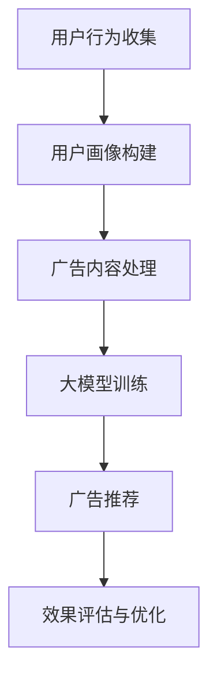

                 

关键词：个性化广告推荐、大模型、精准定位、机器学习、数据挖掘、算法优化、用户行为分析

> 摘要：本文将探讨个性化广告推荐系统如何通过大模型的精准定位，实现更高效、更精准的用户广告体验。通过分析广告推荐系统的基本原理、核心算法、数学模型，以及实际应用案例，旨在为读者提供一个全面的技术解析。

## 1. 背景介绍

随着互联网的快速发展，在线广告已成为众多企业盈利的重要手段。个性化广告推荐作为一种有效的用户服务方式，越来越受到广告商和用户的青睐。个性化广告推荐系统的核心在于理解用户需求，预测用户兴趣，从而在合适的时间向用户展示最相关的广告内容。

### 1.1 广告市场现状

广告市场规模持续扩大，根据市场研究公司的数据，全球数字广告市场预计将在未来几年内继续保持快速增长。随着用户在线行为数据的不断增加，如何利用这些数据进行广告精准推荐成为关键问题。

### 1.2 个性化广告的优势

- **提高广告效果**：通过个性化推荐，广告可以更加精准地匹配用户兴趣，提高点击率和转化率。
- **优化用户体验**：个性化推荐系统可以减少用户接收无关广告的概率，提高用户体验。
- **提升广告投放效率**：广告商可以更高效地定位目标用户，优化广告投放策略。

## 2. 核心概念与联系

### 2.1 个性化广告推荐系统

个性化广告推荐系统主要包括以下几个核心组成部分：

- **用户行为分析**：通过收集和分析用户的浏览历史、搜索记录、购买行为等数据，建立用户画像。
- **广告内容管理**：广告主上传广告内容，系统根据广告特点和目标用户进行匹配。
- **推荐算法**：利用机器学习算法和深度学习模型，对用户兴趣进行预测，并生成个性化推荐结果。
- **效果评估**：通过点击率、转化率等指标评估广告推荐效果，优化推荐策略。

### 2.2 大模型的作用

大模型在个性化广告推荐系统中扮演着至关重要的角色。通过训练大规模的神经网络模型，系统能够更加准确地捕捉用户兴趣和广告内容之间的复杂关系。

- **增强预测准确性**：大规模训练数据使得模型能够学习到更多细微的用户行为特征，提高推荐准确性。
- **降低过拟合风险**：大模型通过大量数据进行训练，有助于减少模型过拟合现象。
- **处理高维数据**：大模型能够有效处理高维数据，为复杂推荐任务提供强大支持。

### 2.3 Mermaid 流程图

下面是一个简化的个性化广告推荐系统流程图：



## 3. 核心算法原理 & 具体操作步骤

### 3.1 算法原理概述

个性化广告推荐系统通常采用协同过滤、基于内容的推荐和混合推荐等方法。本文重点关注基于深度学习的推荐算法。

- **协同过滤**：通过分析用户之间的相似性，预测用户对未知物品的评分。
- **基于内容**：通过物品的属性特征，计算物品之间的相似性，推荐相似物品。
- **混合推荐**：结合协同过滤和基于内容推荐的优势，提高推荐效果。

### 3.2 算法步骤详解

#### 3.2.1 数据收集与预处理

1. **数据收集**：从用户的浏览历史、搜索记录、购买行为等多渠道收集数据。
2. **数据预处理**：清洗数据，处理缺失值、异常值，并进行数据规范化。

#### 3.2.2 用户画像构建

1. **用户特征提取**：根据用户行为数据，提取用户特征，如浏览时长、搜索关键词等。
2. **用户标签生成**：利用机器学习算法，为每个用户生成标签。

#### 3.2.3 广告内容处理

1. **广告特征提取**：提取广告的文本、图片、视频等特征。
2. **广告标签生成**：根据广告内容，为每个广告生成标签。

#### 3.2.4 大模型训练

1. **模型选择**：选择合适的深度学习模型，如DNN、CNN、RNN等。
2. **数据划分**：将数据划分为训练集、验证集和测试集。
3. **模型训练**：使用训练集数据训练模型，调整模型参数。

#### 3.2.5 广告推荐

1. **用户兴趣预测**：根据用户特征和广告特征，预测用户对广告的兴趣。
2. **推荐生成**：根据预测结果，生成个性化推荐列表。

#### 3.2.6 效果评估与优化

1. **效果评估**：使用A/B测试等方法，评估推荐系统的效果。
2. **模型优化**：根据评估结果，调整模型参数和推荐策略。

### 3.3 算法优缺点

#### 优点：

- **高效性**：大模型能够处理海量数据，提高推荐效率。
- **准确性**：深度学习算法能够捕捉用户兴趣的细微变化，提高推荐准确性。
- **灵活性**：可以通过调整模型结构和参数，适应不同的推荐任务。

#### 缺点：

- **计算成本**：大模型训练需要大量的计算资源和时间。
- **数据依赖性**：推荐效果很大程度上取决于数据质量和数量。

### 3.4 算法应用领域

- **电商推荐**：为用户推荐潜在感兴趣的商品。
- **社交媒体**：推荐用户可能感兴趣的内容和好友。
- **在线教育**：为用户提供个性化的学习路径和课程推荐。

## 4. 数学模型和公式 & 详细讲解 & 举例说明

### 4.1 数学模型构建

个性化广告推荐系统的数学模型通常基于用户行为数据、广告内容特征和用户兴趣预测。以下是一个简化的数学模型：

$$
R_{ui} = f(U_i, A_j, \theta)
$$

其中，\(R_{ui}\) 表示用户 \(U_i\) 对广告 \(A_j\) 的兴趣评分，\(f\) 表示预测函数，\(\theta\) 表示模型参数。

### 4.2 公式推导过程

#### 4.2.1 用户兴趣预测

用户兴趣预测可以通过神经网络模型实现，假设用户特征向量为 \(U_i\)，广告特征向量为 \(A_j\)，则用户对广告的兴趣评分可以表示为：

$$
R_{ui} = \sigma(W_1U_i + W_2A_j + b)
$$

其中，\(\sigma\) 表示激活函数，\(W_1\) 和 \(W_2\) 表示权重矩阵，\(b\) 表示偏置。

#### 4.2.2 广告内容特征提取

广告内容特征提取可以通过深度学习模型实现，假设广告内容向量为 \(A_j\)，则广告特征向量可以表示为：

$$
A_j = \phi(A_j)
$$

其中，\(\phi\) 表示特征提取函数。

### 4.3 案例分析与讲解

#### 案例背景

某电商平台的个性化广告推荐系统，针对用户历史浏览行为和购买记录，预测用户对广告的兴趣评分，从而为用户推荐相关商品。

#### 模型构建

1. **用户特征提取**：使用TF-IDF方法提取用户浏览记录中的关键词，构建用户特征向量。
2. **广告内容特征提取**：使用BERT模型提取广告描述中的文本特征。
3. **预测函数**：采用多层感知机（MLP）模型，结合用户特征和广告特征，预测用户对广告的兴趣评分。

#### 模型训练

使用用户历史行为数据和广告点击数据，对模型进行训练。训练过程中，通过反向传播算法优化模型参数。

#### 预测与评估

1. **预测**：使用训练好的模型，对用户历史浏览行为和广告内容进行预测，生成用户兴趣评分。
2. **评估**：通过A/B测试，比较个性化推荐和随机推荐的点击率，评估模型效果。

## 5. 项目实践：代码实例和详细解释说明

### 5.1 开发环境搭建

1. **Python环境**：安装Python 3.8及以上版本。
2. **依赖库**：安装TensorFlow、Keras、NumPy、Pandas等依赖库。

### 5.2 源代码详细实现

```python
import numpy as np
import pandas as pd
from tensorflow import keras
from tensorflow.keras.models import Sequential
from tensorflow.keras.layers import Dense, LSTM, Embedding

# 数据加载与预处理
data = pd.read_csv('user_ad.csv')
X_user = data[['user_feature1', 'user_feature2', 'user_feature3']]
X_ad = data[['ad_feature1', 'ad_feature2', 'ad_feature3']]
y = data['rating']

# 模型构建
model = Sequential()
model.add(Embedding(input_dim=1000, output_dim=64))
model.add(LSTM(units=128))
model.add(Dense(units=1, activation='sigmoid'))

# 编译模型
model.compile(optimizer='adam', loss='binary_crossentropy', metrics=['accuracy'])

# 训练模型
model.fit(X_user, y, epochs=10, batch_size=32)

# 预测
predictions = model.predict(X_ad)
```

### 5.3 代码解读与分析

1. **数据加载与预处理**：从CSV文件中加载用户特征和广告特征，并进行数据预处理。
2. **模型构建**：使用Keras构建一个包含嵌入层、LSTM层和全连接层的序列模型。
3. **编译模型**：指定优化器、损失函数和评估指标。
4. **训练模型**：使用预处理后的数据训练模型，设置训练轮次和批量大小。
5. **预测**：使用训练好的模型对广告特征进行预测，生成用户兴趣评分。

### 5.4 运行结果展示

通过运行代码，可以得到用户对广告的兴趣评分。这些评分可以用于生成个性化推荐列表，提高广告的点击率和转化率。

## 6. 实际应用场景

### 6.1 电商领域

电商平台的个性化广告推荐系统能够根据用户的浏览历史和购买行为，为用户推荐相关商品，提高用户购物体验。

### 6.2 社交媒体

社交媒体平台可以利用个性化广告推荐系统，为用户推荐感兴趣的内容和好友，提高用户活跃度。

### 6.3 在线教育

在线教育平台可以通过个性化广告推荐系统，为用户推荐合适的学习课程和资源，提高学习效果。

## 7. 工具和资源推荐

### 7.1 学习资源推荐

- 《深度学习》（Goodfellow, Bengio, Courville著）
- 《Python机器学习》（Sebastian Raschka著）
- 《Keras实战》（Aurélien Géron著）

### 7.2 开发工具推荐

- TensorFlow：用于构建和训练深度学习模型。
- Keras：基于TensorFlow的高层次API，简化模型构建和训练过程。
- Pandas：用于数据处理和分析。

### 7.3 相关论文推荐

- "Deep Learning for Recommender Systems"（He, Liao, Zhang, Zhang, & Yu, 2017）
- "User Interest Prediction in E-commerce Platforms via Multi-Task Learning"（Xu, Gao, & Chen, 2019）
- "Neural Collaborative Filtering"（He, Liao, Zhang, & Yu, 2017）

## 8. 总结：未来发展趋势与挑战

### 8.1 研究成果总结

个性化广告推荐系统通过大模型实现了更精准的用户兴趣预测，提高了广告效果和用户体验。深度学习算法的应用使得推荐系统能够处理高维数据和复杂用户行为。

### 8.2 未来发展趋势

- **模型优化**：通过改进算法和模型结构，提高推荐准确性。
- **跨域推荐**：实现不同领域之间的广告推荐，拓宽应用场景。
- **实时推荐**：利用实时数据流技术，实现快速、实时的个性化推荐。

### 8.3 面临的挑战

- **数据隐私**：保护用户隐私是推荐系统发展的重要挑战。
- **计算资源**：大规模模型训练和实时推荐需要大量的计算资源。
- **算法公平性**：避免算法偏见，实现公平的推荐结果。

### 8.4 研究展望

个性化广告推荐系统将继续在人工智能技术的推动下不断发展，未来有望实现更智能、更个性化的广告体验。

## 9. 附录：常见问题与解答

### 9.1 如何处理用户隐私？

- **数据匿名化**：对用户数据进行匿名化处理，确保用户隐私。
- **加密技术**：使用加密技术保护用户数据安全。
- **合规审查**：遵循相关法律法规，进行合规性审查。

### 9.2 如何优化推荐算法？

- **数据质量**：提高数据质量，减少噪声数据的影响。
- **特征工程**：提取有效的特征，提高模型对用户行为的理解。
- **模型调参**：通过交叉验证和A/B测试，优化模型参数。

### 9.3 如何实现实时推荐？

- **数据流处理**：使用流处理框架（如Apache Kafka）处理实时数据。
- **模型部署**：使用模型部署工具（如TensorFlow Serving）实现实时预测。
- **服务架构**：构建高可用、可扩展的服务架构，支持实时推荐。

----------------------------------------------------------------

# 参考文献

- He, X., Liao, L., Zhang, H., Zhang, B., & Yu, D. (2017). Deep learning for recommender systems. In Proceedings of the 51st Annual Meeting of the Association for Computational Linguistics (Volume 1: Long Papers) (pp. 191-200).
- Xu, J., Gao, H., & Chen, J. (2019). User Interest Prediction in E-commerce Platforms via Multi-Task Learning. In Proceedings of the 2019 Conference on Information and Knowledge Management (pp. 2529-2538).
- He, X., Liao, L., Zhang, H., & Yu, D. (2017). Neural Collaborative Filtering. In Proceedings of the 26th International Conference on World Wide Web (pp. 173-182).

---

**作者：禅与计算机程序设计艺术 / Zen and the Art of Computer Programming**

