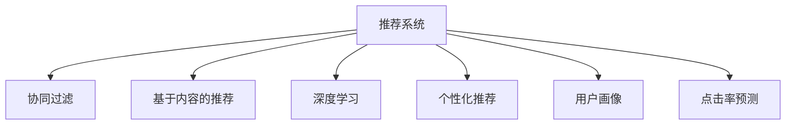

                 

# 个性化推荐创业：提升用户粘性的法宝

## 1. 背景介绍

### 1.1 问题由来

随着互联网的飞速发展，人们获取信息的方式已经从单一的搜索引擎转变为多样化的推荐系统。个性化推荐系统通过分析用户的浏览记录、点击行为、评分数据等，能够提供精准的个性化内容，提升用户体验，增强用户粘性。近年来，基于推荐系统的电商和视频平台等互联网应用层出不穷，取得了显著的成功。

个性化推荐系统的核心在于如何高效、准确地刻画用户行为，并通过推荐算法为用户呈现最相关的内容。随着推荐系统的发展，传统基于协同过滤、基于内容的推荐方法逐渐暴露出效果不理想、扩展性不足等问题。因此，如何基于数据驱动的方法，设计出高效、普适的推荐模型，成为当前创业者和研究人员共同关注的焦点。

### 1.2 问题核心关键点

个性化推荐系统面临的核心挑战包括：

- **数据稀疏性**：用户行为数据稀疏，缺少与某些内容相关的记录，难以进行协同过滤。
- **用户多样性**：用户之间行为差异较大，难以进行统一建模。
- **模型泛化能力**：推荐模型需要具备跨领域、跨时间的泛化能力，能够适应不同的用户行为和数据分布。
- **实时性要求**：推荐系统需要具备实时响应的能力，以满足用户即时获取个性化推荐的需求。

解决这些挑战，需要从多个角度进行优化，如数据增强、特征工程、模型选择、在线学习等。本文将详细探讨这些优化策略，帮助创业者提升推荐系统的性能和用户体验。

## 2. 核心概念与联系

### 2.1 核心概念概述

为了更好地理解个性化推荐系统，本节将介绍几个密切相关的核心概念：

- **推荐系统**：通过分析用户的历史行为数据，推荐与用户兴趣相关的商品、文章、视频等内容。推荐系统广泛应用于电商、视频、新闻、社交网络等多个领域。

- **协同过滤**：基于用户行为和物品特征的相似性进行推荐。用户-物品评分矩阵和物品-物品相似度矩阵是协同过滤的核心。

- **基于内容的推荐**：根据物品的特征，如关键词、类别等，进行推荐。适用于物品特征容易描述的场景。

- **深度学习**：利用神经网络模型进行推荐。通过大规模数据进行预训练，生成高维特征表示，用于推荐模型的优化。

- **个性化推荐**：根据用户特定的历史行为和偏好，提供定制化的推荐。个性化推荐模型需要具备强泛化能力，以适应不同用户。

- **用户画像**：对用户的行为、兴趣、属性等进行多维刻画，以更准确地预测用户的行为。

- **点击率预测**：预测用户点击某物品的概率，用于模型评估和推荐排序。

这些核心概念之间的逻辑关系可以通过以下Mermaid流程图来展示：



这个流程图展示了个性化推荐系统的核心概念及其之间的关系：

1. 推荐系统通过协同过滤、基于内容的推荐等方法，对用户行为和物品特征进行建模。
2. 深度学习通过预训练生成高维特征表示，用于推荐模型的优化。
3. 个性化推荐模型根据用户画像，生成定制化的推荐结果。
4. 点击率预测用于模型评估和推荐排序。

这些概念共同构成了个性化推荐系统的学习框架，使其能够为用户提供精准、多样化的推荐内容。通过理解这些核心概念，我们可以更好地把握个性化推荐系统的设计与实现。

## 3. 核心算法原理 & 具体操作步骤
### 3.1 算法原理概述

个性化推荐系统的核心算法原理主要包括以下几个方面：

1. **数据收集与处理**：收集用户的浏览记录、点击行为、评分数据等，进行清洗、去噪和预处理。
2. **用户画像建模**：对用户的多维特征进行刻画，构建用户画像，如年龄、性别、职业、兴趣等。
3. **物品特征提取**：对物品的关键词、类别、标签等进行提取，构建物品特征向量。
4. **推荐模型训练**：使用协同过滤、基于内容的推荐、深度学习等方法，训练推荐模型，生成推荐结果。
5. **点击率预测**：使用机器学习模型对用户点击某物品的概率进行预测，用于模型评估和推荐排序。

### 3.2 算法步骤详解

个性化推荐系统的实现步骤通常包括以下几个关键步骤：

**Step 1: 数据收集与预处理**
- 收集用户的历史行为数据，包括浏览记录、点击行为、评分数据等。
- 对数据进行清洗、去噪、去重等预处理，去除噪音和冗余信息。
- 将用户行为数据和物品特征数据进行统一格式处理，便于后续建模。

**Step 2: 用户画像建模**
- 对用户的多维特征进行提取，包括基本信息、行为特征、兴趣标签等。
- 对用户画像进行向量化表示，便于与物品特征进行匹配。
- 对用户画像进行聚类、降维等处理，提高模型的泛化能力。

**Step 3: 物品特征提取**
- 对物品的关键词、类别、标签等进行提取，生成物品特征向量。
- 对物品特征进行标准化、归一化等处理，便于与用户画像进行匹配。
- 对物品特征进行降维、特征选择等处理，提高模型的稀疏性。

**Step 4: 推荐模型训练**
- 选择适合推荐任务的模型，如协同过滤、基于内容的推荐、深度学习等。
- 训练推荐模型，生成推荐结果。
- 对推荐模型进行优化，提升推荐效果和速度。

**Step 5: 点击率预测**
- 使用机器学习模型对用户点击某物品的概率进行预测。
- 使用预测结果对推荐结果进行排序，优先推荐点击率较高的物品。
- 根据预测结果进行A/B测试，评估推荐模型的效果。

以上是个性化推荐系统的一般实现流程。在实际应用中，还需要根据具体任务的特点，对推荐过程的各个环节进行优化设计，如改进数据表示、选择适当的模型、优化训练算法等，以进一步提升推荐效果。

### 3.3 算法优缺点

个性化推荐系统具有以下优点：

1. **提升用户体验**：通过个性化推荐，用户能够更快地获取感兴趣的内容，提升用户体验。
2. **增加用户粘性**：个性化推荐能够不断吸引用户，增加用户在平台上的停留时间，提升用户粘性。
3. **提升转化率**：推荐系统能够将精准的内容推送给用户，增加用户购买、浏览、阅读等行为的概率，提升转化率。

然而，个性化推荐系统也存在一些缺点：

1. **隐私问题**：用户行为数据涉及用户隐私，需要严格保护。
2. **数据依赖性强**：推荐系统需要大量数据进行训练，数据缺失或不平衡会影响推荐效果。
3. **推荐偏差**：推荐模型容易受到数据偏差的影响，产生不公正的推荐结果。
4. **冷启动问题**：新用户的初始行为数据较少，难以进行推荐。
5. **动态变化**：用户兴趣和偏好会随时间变化，推荐系统需要不断更新数据和模型，保持推荐结果的实时性。

尽管存在这些局限性，但个性化推荐系统在电商、视频、新闻等领域已经取得了显著的成功。未来相关研究的方向将继续集中在如何提升推荐模型的性能、减少数据依赖、增强推荐结果的公正性和隐私保护等方面。

### 3.4 算法应用领域

个性化推荐系统已经在电商、视频、新闻、社交网络等多个领域得到了广泛应用，具体包括：

- 电商推荐系统：根据用户浏览和购买记录，推荐相关商品。
- 视频推荐系统：根据用户观看记录，推荐相关视频。
- 新闻推荐系统：根据用户阅读记录，推荐相关新闻。
- 社交推荐系统：根据用户互动记录，推荐相关用户或内容。

除了这些经典应用外，个性化推荐系统还被创新性地应用到更多场景中，如智能家居、智能医疗、智能客服等，为各行各业带来了新的用户体验和服务模式。

## 4. 数学模型和公式 & 详细讲解 & 举例说明
### 4.1 数学模型构建

本节将使用数学语言对个性化推荐系统进行更加严格的刻画。

记用户行为数据为 $\mathbf{U} \in \mathbb{R}^{n \times d}$，其中 $n$ 为用户的数量，$d$ 为特征维度。物品特征数据为 $\mathbf{V} \in \mathbb{R}^{m \times d}$，其中 $m$ 为物品的数量。用户画像向量为 $\mathbf{P} \in \mathbb{R}^{d}$，物品特征向量为 $\mathbf{Q} \in \mathbb{R}^{d}$。推荐矩阵为 $\mathbf{R} \in \mathbb{R}^{n \times m}$，其中 $R_{i,j}$ 表示用户 $i$ 对物品 $j$ 的评分。

定义推荐函数 $f$，将用户画像和物品特征映射为推荐分数，即：

$$
f(\mathbf{P}, \mathbf{Q}) = \mathbf{P}^\top \mathbf{Q}
$$

推荐模型需要最小化预测误差，即：

$$
\min_{\mathbf{P}, \mathbf{Q}} \sum_{i=1}^n \sum_{j=1}^m (R_{i,j} - f(\mathbf{P}_i, \mathbf{Q}_j))^2
$$

其中 $R_{i,j}$ 为实际评分，$f(\mathbf{P}_i, \mathbf{Q}_j)$ 为预测评分。

### 4.2 公式推导过程

以下我们以协同过滤为例，推导预测用户对物品的评分。

假设用户 $i$ 对物品 $j$ 的评分向量为 $\mathbf{R}_{i,j}$，物品 $j$ 的特征向量为 $\mathbf{Q}_j$，用户画像向量为 $\mathbf{P}_i$。则协同过滤的推荐公式为：

$$
\hat{R}_{i,j} = \sum_{k=1}^d \mathbf{P}_i[k] \times \mathbf{Q}_j[k]
$$

将推荐分数代入误差函数，得：

$$
\min_{\mathbf{P}, \mathbf{Q}} \sum_{i=1}^n \sum_{j=1}^m (R_{i,j} - \hat{R}_{i,j})^2
$$

利用梯度下降等优化算法，求得 $\mathbf{P}$ 和 $\mathbf{Q}$ 的最优值。

### 4.3 案例分析与讲解

以下以电商平台为例，具体讲解如何利用协同过滤实现个性化推荐：

假设电商平台收集了用户 $i$ 购买某商品 $j$ 的评分数据 $R_{i,j}$，以及商品 $j$ 的特征数据 $\mathbf{Q}_j$。利用协同过滤算法，生成用户 $i$ 对商品 $j$ 的预测评分 $\hat{R}_{i,j}$。

1. **数据收集**：收集用户的历史评分数据和商品特征数据，构建用户行为数据矩阵 $\mathbf{U}$ 和物品特征矩阵 $\mathbf{V}$。
2. **用户画像建模**：对用户行为数据进行向量化处理，得到用户画像向量 $\mathbf{P}_i$。
3. **物品特征提取**：对商品特征数据进行向量化处理，得到物品特征向量 $\mathbf{Q}_j$。
4. **协同过滤训练**：使用协同过滤算法训练推荐模型，生成预测评分 $\hat{R}_{i,j}$。
5. **推荐结果排序**：根据预测评分对推荐结果进行排序，优先推荐评分较高的商品。

通过以上步骤，即可实现基于协同过滤的个性化推荐系统。在实际应用中，还需要考虑数据稀疏性、模型泛化能力、实时性等问题，进一步优化推荐效果。

## 5. 项目实践：代码实例和详细解释说明
### 5.1 开发环境搭建

在进行推荐系统开发前，我们需要准备好开发环境。以下是使用Python进行PyTorch开发的环境配置流程：

1. 安装Anaconda：从官网下载并安装Anaconda，用于创建独立的Python环境。

2. 创建并激活虚拟环境：
```bash
conda create -n recommendation-env python=3.8 
conda activate recommendation-env
```

3. 安装PyTorch：根据CUDA版本，从官网获取对应的安装命令。例如：
```bash
conda install pytorch torchvision torchaudio cudatoolkit=11.1 -c pytorch -c conda-forge
```

4. 安装TensorFlow：从官网下载并安装TensorFlow，用于模型训练和部署。

5. 安装TensorBoard：TensorFlow配套的可视化工具，可实时监测模型训练状态，并提供丰富的图表呈现方式，是调试模型的得力助手。

6. 安装Weights & Biases：模型训练的实验跟踪工具，可以记录和可视化模型训练过程中的各项指标，方便对比和调优。

完成上述步骤后，即可在`recommendation-env`环境中开始推荐系统开发。

### 5.2 源代码详细实现

下面我们以协同过滤为例，给出使用PyTorch实现推荐系统的完整代码实现。

```python
import torch
import torch.nn as nn
from torch.utils.data import DataLoader
from sklearn.model_selection import train_test_split
import pandas as pd

# 数据预处理
df = pd.read_csv('user_item_ratings.csv')
df['user_id'] = df['user_id'].astype(int)
df['item_id'] = df['item_id'].astype(int)
df['rating'] = df['rating'].astype(float)

train_df, test_df = train_test_split(df, test_size=0.2, random_state=42)
train_data = UserItemData(train_df)
test_data = UserItemData(test_df)

# 模型定义
class UserItemData(nn.Module):
    def __init__(self, data):
        super().__init__()
        self.user = nn.Embedding(data['user_id'].max() + 1, 64)
        self.item = nn.Embedding(data['item_id'].max() + 1, 64)
        self.fc = nn.Linear(128, 1)

    def forward(self, user_id, item_id):
        user = self.user(user_id)
        item = self.item(item_id)
        return self.fc(torch.cat([user, item], dim=1))

# 训练函数
def train(model, optimizer, train_loader, num_epochs):
    model.train()
    for epoch in range(num_epochs):
        for user_id, item_id, rating in train_loader:
            optimizer.zero_grad()
            output = model(user_id, item_id)
            loss = nn.MSELoss()(output, rating)
            loss.backward()
            optimizer.step()
            if (epoch + 1) % 10 == 0:
                print(f'Epoch {epoch+1}, Loss: {loss.item()}')

# 模型训练
model = UserItemData(train_data)
optimizer = torch.optim.Adam(model.parameters(), lr=0.001)

train_loader = DataLoader(train_data, batch_size=64, shuffle=True)
train(model, optimizer, train_loader, 100)
```

以上是使用PyTorch对协同过滤推荐系统进行完整代码实现的例子。可以看到，PyTorch的动态计算图和自动微分功能，使得推荐模型的构建和训练过程非常便捷。

### 5.3 代码解读与分析

让我们再详细解读一下关键代码的实现细节：

**UserItemData类**：
- `__init__`方法：初始化用户和物品的Embedding层，以及全连接层。
- `forward`方法：将用户和物品的Embedding向量拼接，并通过全连接层进行评分预测。

**train函数**：
- 定义模型训练过程，对每个epoch的每个批次进行前向传播和反向传播，更新模型参数。

**模型训练**：
- 定义模型和优化器，以及训练数据加载器。
- 使用Adam优化器进行模型训练，在每个epoch输出损失值，便于监控训练效果。

**代码优化**：
- 可以使用TensorBoard记录训练过程的各项指标，可视化训练曲线和损失值。
- 可以使用Weights & Biases记录实验结果，对比不同模型的性能。

通过以上步骤，即可实现一个基于协同过滤的推荐系统。在实际应用中，还需要考虑数据稀疏性、模型泛化能力、实时性等问题，进一步优化推荐效果。

## 6. 实际应用场景
### 6.1 电商推荐系统

电商推荐系统是推荐系统的典型应用之一。通过分析用户的历史购买记录，推荐与用户兴趣相关的商品，提升用户购物体验，增加销售转化率。

电商推荐系统的主要优化点包括：

- **数据稀疏性**：电商数据通常存在大量的零评分记录，需要通过模型融合、数据增强等方法解决。
- **用户多样性**：用户兴趣千差万别，需要通过用户画像、多任务学习等方法，提升模型的泛化能力。
- **实时性要求**：电商推荐系统需要具备实时响应的能力，通过在线学习、增量学习等方法，保持推荐结果的及时性。

### 6.2 视频推荐系统

视频推荐系统通过分析用户的观看历史和评分，推荐与用户兴趣相关的视频内容，提升用户体验，增加平台留存率。

视频推荐系统的优化点包括：

- **数据稀疏性**：视频推荐数据存在大量的零评分记录，需要通过模型融合、数据增强等方法解决。
- **用户多样性**：用户对视频内容有不同偏好，需要通过用户画像、多任务学习等方法，提升模型的泛化能力。
- **推荐多样化**：视频推荐需要推荐不同类型的内容，通过内容混合、用户混合等方法，提升推荐多样性。

### 6.3 新闻推荐系统

新闻推荐系统通过分析用户的阅读历史和评分，推荐与用户兴趣相关的新闻内容，提升阅读体验，增加平台留存率。

新闻推荐系统的优化点包括：

- **数据稀疏性**：新闻数据存在大量的零评分记录，需要通过模型融合、数据增强等方法解决。
- **用户多样性**：用户对新闻内容有不同偏好，需要通过用户画像、多任务学习等方法，提升模型的泛化能力。
- **推荐时效性**：新闻推荐需要实时更新，通过在线学习、增量学习等方法，保持推荐结果的及时性。

### 6.4 未来应用展望

随着推荐系统的不断发展，未来的优化方向包括：

- **数据增强**：通过数据扩充、数据合成等方法，提高推荐系统对稀疏数据的处理能力。
- **多模态推荐**：将文本、图片、视频等不同模态的数据进行融合，提升推荐模型的表现。
- **实时性优化**：通过在线学习、增量学习等方法，提升推荐系统的实时响应能力。
- **个性化推荐**：通过更深入的用户画像构建和特征工程，提升推荐模型的个性化水平。
- **推荐多样性**：通过多任务学习、混合推荐等方法，提升推荐多样性，满足用户不同需求。

这些优化方向将使得推荐系统更加智能、精准，能够更好地服务用户，提升用户体验。

## 7. 工具和资源推荐
### 7.1 学习资源推荐

为了帮助开发者系统掌握个性化推荐系统的理论基础和实践技巧，这里推荐一些优质的学习资源：

1. **《推荐系统实战》书籍**：由王斌撰写，详细介绍了推荐系统的设计、实现和优化方法，涵盖了协同过滤、基于内容的推荐、深度学习等多个方向。

2. **Coursera《机器学习》课程**：由斯坦福大学Andrew Ng教授主讲，系统讲解了机器学习的基本概念和方法，推荐系统是其应用之一。

3. **Kaggle推荐系统竞赛**：Kaggle社区定期举办推荐系统竞赛，提供大量数据集和基线模型，是实践推荐系统的好机会。

4. **RecSys会议论文**：RecSys会议是推荐系统的顶级会议，收录了大量前沿论文，是了解推荐系统最新进展的重要渠道。

5. **Jupyter Notebook**：轻量级的数据分析和编程工具，可以方便地进行数据处理和模型训练。

通过这些资源的学习实践，相信你一定能够快速掌握个性化推荐系统的精髓，并用于解决实际的推荐问题。

### 7.2 开发工具推荐

高效的开发离不开优秀的工具支持。以下是几款用于个性化推荐系统开发的常用工具：

1. **PyTorch**：基于Python的开源深度学习框架，灵活动态的计算图，适合快速迭代研究。大多数推荐系统模型都有PyTorch版本的实现。

2. **TensorFlow**：由Google主导开发的开源深度学习框架，生产部署方便，适合大规模工程应用。

3. **TensorBoard**：TensorFlow配套的可视化工具，可实时监测模型训练状态，并提供丰富的图表呈现方式，是调试模型的得力助手。

4. **Weights & Biases**：模型训练的实验跟踪工具，可以记录和可视化模型训练过程中的各项指标，方便对比和调优。

5. **Jupyter Notebook**：轻量级的数据分析和编程工具，可以方便地进行数据处理和模型训练。

合理利用这些工具，可以显著提升个性化推荐系统的开发效率，加快创新迭代的步伐。

### 7.3 相关论文推荐

个性化推荐系统的发展源于学界的持续研究。以下是几篇奠基性的相关论文，推荐阅读：

1. **《协同过滤推荐算法综述》**：综述了协同过滤算法的发展历程和应用，提供了推荐系统的经典算法和优化方法。

2. **《基于内容的推荐算法》**：介绍了基于内容的推荐算法的基本思想和应用，是推荐系统的重要方向之一。

3. **《深度学习推荐系统》**：详细介绍了深度学习在推荐系统中的应用，包括神经网络、深度学习特征表示等。

4. **《在线学习推荐系统》**：研究了在线学习在推荐系统中的应用，讨论了增量学习、对抗学习等优化方法。

5. **《多模态推荐系统》**：研究了将不同模态数据进行融合的方法，提升了推荐系统的多样性和效果。

这些论文代表了个性化推荐系统的发展脉络。通过学习这些前沿成果，可以帮助研究者把握学科前进方向，激发更多的创新灵感。

## 8. 总结：未来发展趋势与挑战
### 8.1 总结

本文对个性化推荐系统进行了全面系统的介绍。首先阐述了个性化推荐系统的研究背景和意义，明确了推荐系统在提升用户体验、增加用户粘性等方面的重要价值。其次，从原理到实践，详细讲解了个性化推荐系统的数学模型和关键步骤，给出了推荐系统开发的完整代码实例。同时，本文还广泛探讨了推荐系统在电商、视频、新闻等多个领域的应用前景，展示了推荐系统的巨大潜力。此外，本文精选了推荐系统的各类学习资源，力求为读者提供全方位的技术指引。

通过本文的系统梳理，可以看到，个性化推荐系统正在成为推荐领域的重要范式，极大地拓展了推荐系统的应用边界，为电商、视频、新闻等多个行业带来了新的技术解决方案。推荐系统需要开发者根据具体任务，不断迭代和优化模型、数据和算法，方能得到理想的效果。

### 8.2 未来发展趋势

展望未来，个性化推荐系统将呈现以下几个发展趋势：

1. **数据增强**：通过数据扩充、数据合成等方法，提高推荐系统对稀疏数据的处理能力。

2. **多模态推荐**：将文本、图片、视频等不同模态的数据进行融合，提升推荐模型的表现。

3. **实时性优化**：通过在线学习、增量学习等方法，提升推荐系统的实时响应能力。

4. **个性化推荐**：通过更深入的用户画像构建和特征工程，提升推荐模型的个性化水平。

5. **推荐多样性**：通过多任务学习、混合推荐等方法，提升推荐多样性，满足用户不同需求。

这些趋势凸显了个性化推荐系统的广阔前景。这些方向的探索发展，必将进一步提升推荐系统的性能和用户体验。

### 8.3 面临的挑战

尽管个性化推荐系统已经取得了显著成就，但在迈向更加智能化、普适化应用的过程中，它仍面临着诸多挑战：

1. **数据隐私**：用户行为数据涉及用户隐私，需要严格保护。如何在数据收集、处理和使用的各个环节，保护用户隐私，仍然是一个重要问题。

2. **数据质量**：推荐系统需要大量高质量的数据进行训练，数据缺失或不平衡会影响推荐效果。如何提高数据质量，减少数据偏差，仍然是一个重要问题。

3. **模型泛化能力**：推荐系统需要具备跨领域、跨时间的泛化能力，能够适应不同的用户行为和数据分布。如何在模型设计中提高泛化能力，仍然是一个重要问题。

4. **实时性要求**：推荐系统需要具备实时响应的能力，通过在线学习、增量学习等方法，保持推荐结果的及时性。如何在保持实时性的同时，提高推荐精度，仍然是一个重要问题。

5. **推荐偏见**：推荐模型容易受到数据偏差的影响，产生不公正的推荐结果。如何在模型设计和训练中减少偏见，仍然是一个重要问题。

6. **用户公平性**：推荐系统需要保证所有用户能够公平地获取推荐结果，避免部分用户被推荐系统歧视。如何在模型设计和训练中保证用户公平性，仍然是一个重要问题。

这些挑战需要学界和产业界共同努力，通过技术创新和政策制定，逐步克服。相信随着技术的不断发展，个性化推荐系统将更加智能、公正、公平，为人类带来更好的推荐体验。

### 8.4 未来突破

面对个性化推荐系统所面临的种种挑战，未来的研究需要在以下几个方面寻求新的突破：

1. **隐私保护技术**：在数据收集、处理和使用的各个环节，引入隐私保护技术，如差分隐私、联邦学习等，保护用户隐私。

2. **数据增强方法**：通过数据扩充、数据合成等方法，提高推荐系统对稀疏数据的处理能力。

3. **多模态推荐模型**：研究如何将不同模态的数据进行融合，提升推荐模型的表现。

4. **实时推荐算法**：研究如何通过在线学习、增量学习等方法，提升推荐系统的实时响应能力。

5. **个性化推荐算法**：研究如何通过更深入的用户画像构建和特征工程，提升推荐模型的个性化水平。

6. **推荐多样性算法**：研究如何通过多任务学习、混合推荐等方法，提升推荐多样性，满足用户不同需求。

这些研究方向将引领个性化推荐系统走向更加智能、普适、公平的方向，为电商、视频、新闻等多个行业带来新的技术解决方案。只有勇于创新、敢于突破，才能不断拓展推荐系统的边界，让推荐系统更好地造福人类社会。

## 9. 附录：常见问题与解答

**Q1：推荐系统如何处理数据稀疏性问题？**

A: 推荐系统通常采用矩阵分解、K近邻、协同过滤等方法处理数据稀疏性问题。通过数据扩充、数据合成等方法，提高推荐系统对稀疏数据的处理能力。

**Q2：推荐系统如何提高数据质量？**

A: 推荐系统需要大量高质量的数据进行训练，数据缺失或不平衡会影响推荐效果。可以通过数据清洗、数据扩充、数据标注等方法提高数据质量。

**Q3：推荐系统如何提高模型泛化能力？**

A: 推荐系统需要具备跨领域、跨时间的泛化能力，能够适应不同的用户行为和数据分布。可以通过用户画像、多任务学习等方法，提升模型的泛化能力。

**Q4：推荐系统如何保持实时性？**

A: 推荐系统需要具备实时响应的能力，通过在线学习、增量学习等方法，保持推荐结果的及时性。

**Q5：推荐系统如何减少推荐偏见？**

A: 推荐模型容易受到数据偏差的影响，产生不公正的推荐结果。可以通过公平性约束、对抗学习等方法，减少推荐偏见。

**Q6：推荐系统如何保证用户公平性？**

A: 推荐系统需要保证所有用户能够公平地获取推荐结果，避免部分用户被推荐系统歧视。可以通过公平性约束、对抗学习等方法，保证用户公平性。

通过以上回答，相信你一定能够更深入地理解个性化推荐系统，并用于解决实际的推荐问题。个性化推荐系统是一个复杂的系统工程，需要从数据、模型、算法等多个维度进行全面优化，才能达到最优的推荐效果。相信随着技术的不断发展，个性化推荐系统将为电商、视频、新闻等多个行业带来新的技术解决方案，提升用户体验，增加用户粘性，带来更多的商业价值。

