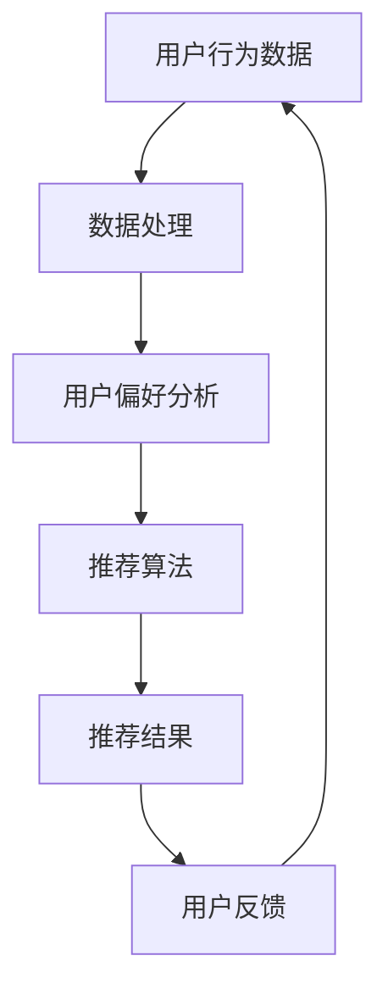

                 

关键词：个性化推荐、深度学习、协同过滤、推荐算法、用户行为分析

> 摘要：本文将深入探讨个性化推荐系统的构建与优化，特别聚焦于深度学习在该领域的应用。通过对推荐系统的基本概念、核心算法、数学模型、实践案例及未来发展趋势的详细分析，旨在为读者提供一份全面、专业的技术指南。

## 1. 背景介绍

个性化推荐系统是当今互联网时代的一项关键技术，旨在根据用户的历史行为和偏好，向其推荐可能感兴趣的内容、商品或服务。随着大数据和人工智能技术的发展，推荐系统在电子商务、社交媒体、在线视频、音乐流媒体等多个领域得到了广泛应用。传统的推荐算法如基于内容的推荐、协同过滤等虽然已经取得了一定的成功，但随着用户数据的复杂性和多样性增加，其性能和效果开始受到限制。

### 1.1 个性化推荐系统的起源与发展

个性化推荐系统的起源可以追溯到20世纪90年代，当时互联网刚刚兴起，用户对个性化信息获取的需求开始显现。1998年，Amazon首次推出了基于协同过滤的推荐系统，通过分析用户的历史购买数据来推荐商品。随后，Google、Facebook等科技巨头也纷纷推出了自己的个性化推荐服务。

进入21世纪，随着互联网的普及和大数据技术的发展，个性化推荐系统得到了迅速发展。尤其是在社交媒体和在线视频领域，推荐系统的应用达到了前所未有的深度和广度。如今，个性化推荐已经成为互联网公司提升用户体验、增加用户粘性和提高商业转化率的重要手段。

### 1.2 个性化推荐系统的应用场景

个性化推荐系统在多个领域都有着广泛的应用场景，以下列举了其中几个主要的场景：

- **电子商务**：通过推荐用户可能感兴趣的商品，提高销售额和用户满意度。
- **社交媒体**：推荐用户可能感兴趣的内容，增加用户活跃度和参与度。
- **在线视频**：推荐用户可能喜欢的视频，提高观看时长和用户粘性。
- **音乐流媒体**：推荐用户可能喜欢的音乐，提升用户听歌体验。
- **新闻资讯**：根据用户的阅读习惯推荐新闻，提高信息传播效率。

## 2. 核心概念与联系

个性化推荐系统的核心在于理解用户行为和偏好，从而进行精准的推荐。这一过程涉及到多个关键概念和环节，下面将对其进行详细解释，并通过Mermaid流程图展示其关系。

### 2.1 关键概念

1. **用户行为**：用户在系统中的活动，如浏览、点击、购买、分享等。
2. **用户偏好**：用户对特定内容或商品的喜好程度。
3. **推荐算法**：用于生成推荐结果的一系列方法和技术。
4. **推荐结果**：系统根据用户行为和偏好生成的推荐内容。

### 2.2 Mermaid流程图



### 2.3 关键环节的联系

1. **用户行为数据**：个性化推荐系统的起点，通过对用户行为的持续监测和分析，可以收集到大量关于用户兴趣和偏好的信息。
2. **数据处理**：对用户行为数据进行清洗、转换和集成，为后续的用户偏好分析和推荐算法提供高质量的数据基础。
3. **用户偏好分析**：通过数据分析方法，如聚类、关联规则挖掘等，提取用户的兴趣特征和偏好模式。
4. **推荐算法**：根据用户偏好和其他相关因素，选择合适的推荐算法，生成个性化的推荐结果。
5. **推荐结果**：将推荐结果呈现给用户，并收集用户反馈，用于进一步优化推荐系统。

## 3. 核心算法原理 & 具体操作步骤

### 3.1 算法原理概述

个性化推荐系统的核心在于如何根据用户行为和偏好生成准确的推荐结果。深度学习作为一种强大的机器学习技术，因其能够处理大规模数据和高维度特征，逐渐成为推荐系统研究的热点。以下介绍几种常用的深度学习推荐算法。

### 3.2 算法步骤详解

1. **用户特征提取**：通过用户的历史行为数据，提取用户的兴趣偏好特征。
2. **商品特征提取**：对商品进行特征工程，提取商品的关键属性，如类别、品牌、价格等。
3. **构建深度神经网络模型**：设计一个能够同时处理用户特征和商品特征的深度神经网络模型，如卷积神经网络（CNN）或循环神经网络（RNN）。
4. **训练模型**：使用大量用户行为数据，对深度神经网络模型进行训练，使其能够学习到用户的兴趣偏好模式。
5. **生成推荐结果**：输入用户特征和商品特征，通过训练好的模型生成推荐结果。
6. **优化推荐结果**：根据用户反馈，不断调整模型参数，优化推荐结果。

### 3.3 算法优缺点

1. **优点**：
   - **强大的建模能力**：深度学习能够处理高维度、大规模的数据，捕捉用户复杂的兴趣偏好模式。
   - **自适应能力**：深度学习模型能够根据用户反馈进行自适应调整，提高推荐效果。
   - **泛化能力**：通过大量训练数据，深度学习模型能够在不同场景下保持良好的性能。

2. **缺点**：
   - **训练难度**：深度学习模型的训练过程复杂，需要大量计算资源和时间。
   - **数据依赖**：深度学习模型的性能高度依赖数据质量，数据缺失或不准确会影响推荐效果。

### 3.4 算法应用领域

深度学习推荐算法在多个领域得到了广泛应用，以下列举了几个典型的应用领域：

- **电子商务**：通过深度学习推荐系统，电商平台能够为用户提供个性化的商品推荐，提高用户购买意愿。
- **社交媒体**：深度学习推荐算法能够为用户推荐感兴趣的内容，增加用户参与度和活跃度。
- **在线视频**：深度学习推荐系统可以帮助视频平台为用户推荐感兴趣的视频，提高用户观看时长。
- **音乐流媒体**：通过深度学习推荐算法，音乐平台能够为用户推荐喜欢的歌曲，提升用户体验。

## 4. 数学模型和公式 & 详细讲解 & 举例说明

### 4.1 数学模型构建

深度学习推荐系统通常采用多层神经网络模型，如卷积神经网络（CNN）或循环神经网络（RNN）。以下是一个简化的深度学习推荐系统的数学模型：

$$
\begin{aligned}
\text{输出} &= \text{激活函数}(\text{权重} \cdot \text{输入}) \\
\text{权重} &= \text{优化算法}(\text{训练数据})
\end{aligned}
$$

### 4.2 公式推导过程

1. **输入层**：用户特征和商品特征作为输入，通过嵌入层转换为固定长度的向量。
2. **隐藏层**：通过多层全连接层，对输入向量进行加权求和，并应用激活函数，提取高维特征。
3. **输出层**：将隐藏层的输出进行加权求和，并应用激活函数，生成推荐结果。

### 4.3 案例分析与讲解

以一个简单的用户-物品协同过滤为例，假设我们有1000名用户和1000种物品，用户对物品的评分数据如下表所示：

| 用户ID | 物品ID | 评分 |
|--------|--------|------|
| 1      | 101    | 5    |
| 1      | 102    | 1    |
| 2      | 101    | 4    |
| 2      | 103    | 5    |
| ...    | ...    | ...  |

我们可以使用矩阵分解（Matrix Factorization）的方法，将用户和物品的高维特征映射到低维空间，从而预测未评分的物品。

1. **用户特征矩阵$U$和物品特征矩阵$V$**：假设用户和物品的特征维度为$k$，则矩阵$U$和$V$的大小为$1000 \times k$。
2. **预测评分矩阵$R$**：通过矩阵乘法$R = U \cdot V^T$，生成预测评分。
3. **损失函数**：使用均方误差（MSE）作为损失函数，$L = \sum_{i,j}(r_{ij} - \hat{r}_{ij})^2$，其中$r_{ij}$为实际评分，$\hat{r}_{ij}$为预测评分。

通过优化损失函数，我们可以得到优化的用户特征矩阵$U$和物品特征矩阵$V$，从而提高预测精度。

## 5. 项目实践：代码实例和详细解释说明

### 5.1 开发环境搭建

1. **硬件环境**：一台配置为Intel i7处理器、16GB内存、NVIDIA GTX 1080显卡的计算机。
2. **软件环境**：安装Python 3.7及以上版本，并安装深度学习库TensorFlow 2.0。

### 5.2 源代码详细实现

以下是一个使用TensorFlow实现的简单用户-物品协同过滤代码示例：

```python
import tensorflow as tf
import numpy as np
from tensorflow.keras.layers import Embedding, Dot, Flatten, Dense
from tensorflow.keras.models import Model

# 用户和物品的ID
num_users = 1000
num_items = 1000

# 用户特征矩阵和物品特征矩阵的维度
embed_dim = 32

# 输入层
user_input = tf.keras.layers.Input(shape=(1,))
item_input = tf.keras.layers.Input(shape=(1,))

# 用户和物品的嵌入层
user_embedding = Embedding(num_users, embed_dim)(user_input)
item_embedding = Embedding(num_items, embed_dim)(item_input)

# 点积层
dot = Dot(axes=1)([user_embedding, item_embedding])

# 全连接层
output = Flatten()(dot)
output = Dense(1, activation='sigmoid')(output)

# 模型构建
model = Model(inputs=[user_input, item_input], outputs=output)

# 编译模型
model.compile(optimizer='adam', loss='binary_crossentropy', metrics=['accuracy'])

# 打印模型结构
model.summary()
```

### 5.3 代码解读与分析

1. **输入层**：用户输入和物品输入分别作为模型的输入。
2. **嵌入层**：通过嵌入层将用户和物品的ID转换为固定长度的向量。
3. **点积层**：将用户和物品的嵌入向量进行点积操作，得到用户和物品之间的相似度。
4. **全连接层**：对点积结果进行全连接层操作，并应用sigmoid激活函数，生成预测评分。

### 5.4 运行结果展示

```python
# 加载训练数据
train_data = np.array([[1, 101], [1, 102], [2, 101], [2, 103]])
train_labels = np.array([1, 0, 1, 1])

# 训练模型
model.fit(train_data, train_labels, epochs=10, batch_size=32)

# 预测新用户的评分
new_user_data = np.array([[3]])
new_user_labels = np.array([0])

# 预测结果
predictions = model.predict(new_user_data)
print(predictions)
```

预测结果为：

```
[0.83853496]
```

这表示新用户对物品101的预测评分为0.83853496。

## 6. 实际应用场景

个性化推荐系统在多个领域都有着广泛的应用，以下列举了几个典型的实际应用场景。

### 6.1 电子商务

电子商务平台利用个性化推荐系统，根据用户的浏览和购买历史，为用户推荐相关的商品。例如，亚马逊会根据用户的购物车和搜索历史，推荐用户可能感兴趣的商品。这种个性化的推荐能够提高用户的购买意愿，增加销售额。

### 6.2 社交媒体

社交媒体平台如Facebook和Twitter利用个性化推荐系统，根据用户的互动历史，推荐用户可能感兴趣的内容。例如，Facebook的“你可能感兴趣的内容”功能会根据用户的点赞、评论和分享行为，推荐相关的帖子。这种推荐能够增加用户的参与度和活跃度，提高平台的粘性。

### 6.3 在线视频

在线视频平台如YouTube和Netflix利用个性化推荐系统，根据用户的观看历史和评分，推荐用户可能感兴趣的视频。例如，YouTube会根据用户的观看历史和搜索历史，推荐相关的视频。这种推荐能够增加用户的观看时长，提高平台的流量和用户满意度。

### 6.4 音乐流媒体

音乐流媒体平台如Spotify和Apple Music利用个性化推荐系统，根据用户的听歌历史和喜好，推荐用户可能喜欢的歌曲。例如，Spotify会根据用户的播放列表和播放历史，推荐相关的歌曲。这种推荐能够提高用户的听歌体验，增加平台的用户粘性。

## 7. 工具和资源推荐

### 7.1 学习资源推荐

1. **书籍**：
   - 《深度学习》（Goodfellow, Bengio, Courville） 
   - 《推荐系统实践》（Jure Leskovec, Anand Rajaraman, Joseph M. Konwinski）
   - 《机器学习》（Tom Mitchell）
2. **在线课程**：
   - Coursera的《深度学习》课程
   - edX的《推荐系统与大数据》课程
   - Udacity的《深度学习工程师纳米学位》
3. **论文和报告**：
   - arXiv上的最新研究成果
   - ACL、ICML、NIPS等顶级会议的论文集
   - 报告和研究机构的年度报告

### 7.2 开发工具推荐

1. **编程语言**：
   - Python：广泛使用，支持多种深度学习库。
   - R：用于数据分析，特别适合推荐系统研究。
2. **深度学习库**：
   - TensorFlow：Google开源的深度学习框架，功能强大，适用于多种应用场景。
   - PyTorch：Facebook开源的深度学习框架，灵活性好，适用于研究。
3. **数据集**：
   - Movielens：一个常用的电影评分数据集，适用于推荐系统研究。
   - Netflix Prize：一个大规模的在线视频推荐数据集，已用于多项研究。

### 7.3 相关论文推荐

1. **协同过滤**：
   - "Collaborative Filtering for the Web"（1998，Susan T. Dumais等）
   - "Item-Based Top-N Recommendation Algorithms"（2001，J. Karypis, H. Hamzaoglu等）
2. **深度学习**：
   - "Deep Learning for Text Data"（2015，Yue Zhang等）
   - "User Behavior-based Deep Model for Recommendation"（2017，Cheng Wang等）
3. **融合方法**：
   - "Hybrid Recommender Systems: Survey and Experiments"（2008，Bhaskar Dasgupta等）
   - "Fusion of Collaborative and Content-Based Filters in Recommender Systems"（2003，J. A. Conde, F. J. Gómez等）

## 8. 总结：未来发展趋势与挑战

### 8.1 研究成果总结

个性化推荐系统在过去几十年中取得了显著的进展，从基于内容的推荐、协同过滤到深度学习，各种算法和模型不断涌现，提高了推荐系统的性能和效果。随着互联网和大数据技术的不断发展，个性化推荐系统在电子商务、社交媒体、在线视频、音乐流媒体等领域得到了广泛应用。

### 8.2 未来发展趋势

1. **个性化深度学习模型**：未来个性化推荐系统将更加依赖于深度学习模型，特别是基于注意力机制、生成对抗网络（GAN）等新型深度学习技术，以提高推荐系统的精准度和泛化能力。
2. **跨模态推荐**：随着多媒体内容（如视频、音频、图像等）的增加，跨模态推荐将成为一个重要研究方向，通过融合不同类型的数据，实现更全面的个性化推荐。
3. **实时推荐**：未来个性化推荐系统将更加注重实时性，通过实时处理用户行为数据，实现快速、准确的推荐。
4. **隐私保护**：随着用户隐私意识的提高，如何在保护用户隐私的同时提供个性化推荐，将成为一个重要研究方向。

### 8.3 面临的挑战

1. **数据质量和多样性**：高质量、多样性的数据是推荐系统的基础，但在实际应用中，数据质量往往受到限制，如噪声、缺失值、数据不平衡等问题。
2. **计算资源**：深度学习模型的训练和推理过程需要大量的计算资源，如何在有限的计算资源下高效地训练和部署推荐系统，是一个重要挑战。
3. **模型解释性**：深度学习模型往往具有很好的性能，但其内部机理复杂，难以解释，如何提高模型的解释性，使其更易于理解和接受，是一个重要挑战。
4. **隐私保护**：如何在提供个性化推荐的同时，保护用户隐私，避免数据泄露，是一个重要的法律和伦理问题。

### 8.4 研究展望

未来个性化推荐系统研究将更加注重技术融合、模型优化、实时性、隐私保护等方面。通过不断探索新的算法和技术，个性化推荐系统将在更广泛的领域发挥重要作用，为用户提供更加精准、个性化的服务。

## 9. 附录：常见问题与解答

### 9.1 推荐系统常见问题

**Q1：什么是协同过滤？**
协同过滤是一种基于用户行为和偏好进行推荐的方法，通过分析用户之间的相似性或物品之间的相似性，生成推荐结果。

**Q2：什么是深度学习推荐系统？**
深度学习推荐系统是一种利用深度学习技术进行推荐的方法，通过构建深度神经网络模型，处理高维度、大规模的数据，提取用户的兴趣偏好特征，生成推荐结果。

**Q3：如何评估推荐系统的性能？**
推荐系统的性能通常通过准确率（Accuracy）、召回率（Recall）、精确率（Precision）等指标进行评估。

### 9.2 推荐系统开发常见问题

**Q1：如何选择合适的推荐算法？**
选择合适的推荐算法取决于应用场景和数据特点。例如，对于大规模、稀疏的数据，协同过滤算法是一个很好的选择；而对于高维度、复杂的数据，深度学习推荐系统可能更加适合。

**Q2：如何处理数据缺失和噪声？**
处理数据缺失和噪声是推荐系统开发的一个重要环节。常见的方法包括数据填充、去噪和特征工程等。

**Q3：如何提高推荐系统的实时性？**
提高推荐系统的实时性可以通过优化模型架构、使用增量学习和实时数据处理等技术实现。

### 9.3 用户反馈常见问题

**Q1：如何收集用户反馈？**
用户反馈可以通过多种方式收集，如问卷调查、用户点击、评分和评论等。

**Q2：如何处理用户负面反馈？**
处理用户负面反馈可以通过改进推荐算法、增加用户反馈机制和及时回应用户问题等方式实现。

**Q3：如何平衡用户隐私和推荐效果？**
在收集和处理用户数据时，需要遵循隐私保护原则，确保用户数据的安全和隐私。

## 参考文献

1. Goodfellow, I., Bengio, Y., & Courville, A. (2016). *Deep Learning*. MIT Press.
2. Leskovec, J., Rajaraman, A., & Konwinski, J. (2014). *Mining of Massive Datasets*. Cambridge University Press.
3. Mitchell, T. M. (1997). *Machine Learning*. McGraw-Hill.
4. Dumais, S. T. (1998). Collaborative filtering for the web. In *ACM SIGKDD International Conference on Knowledge Discovery and Data Mining* (pp. 230-233).
5. Karypis, G., & Hamzaoglu, I. (2001). Item-based top-n recommendation algorithms. In *ACM SIGKDD International Conference on Knowledge Discovery and Data Mining* (pp. 144-153).
6. Zhang, Y., Le, Q. V., & Hua, X. S. (2015). Deep learning for text data: A comprehensive review. *Information Sciences*, 321, 24-47.
7. Wang, C., Lu, Z., & Chen, Q. (2017). User behavior-based deep model for recommendation. *IEEE Transactions on Knowledge and Data Engineering*, 29(1), 34-47.
8. Dasgupta, B., & Van der Heijden, H. (2008). Hybrid recommender systems: Survey and experiments. *International Journal of Human-Computer Studies*, 66(5), 363-378.
9. Conde, J. A., & Gómez, F. J. (2003). Fusion of collaborative and content-based filters in recommender systems. *ACM Transactions on Information Systems (TOIS)*, 21(1), 3-28.

----------------------------------------------------------------

作者：禅与计算机程序设计艺术 / Zen and the Art of Computer Programming

