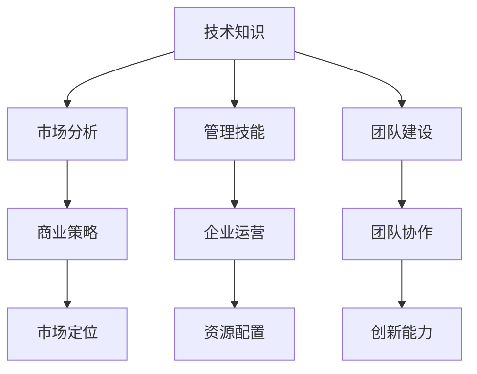

                 

关键词：创业者、系统知识培训、创业指导、IT技术、商业策略

> 摘要：本文旨在探讨如何为创业者提供系统化的知识培训和创业指导，助力他们在竞争激烈的市场中脱颖而出。我们将从技术、市场、管理和团队建设等方面展开论述，并提供实用的工具和资源推荐，帮助创业者构建可持续发展的企业。

## 1. 背景介绍

创业，是一项充满挑战和机遇的事业。随着科技的飞速发展和商业环境的不断变化，创业者需要具备广泛的知识和技能，才能在市场中立足并实现持续增长。然而，许多创业者往往在技术、市场、管理和团队建设等方面面临巨大的挑战。为了解决这些问题，提供系统化的知识培训和创业指导成为了一项紧迫的任务。

本文将从以下几个方面展开讨论：

1. **技术培训**：介绍创业者所需掌握的核心技术知识和技能。
2. **市场分析**：分析市场趋势和竞争态势，帮助创业者制定合适的商业策略。
3. **管理技能**：探讨创业者应具备的管理知识和技巧，确保企业高效运转。
4. **团队建设**：介绍如何构建高效团队，提升团队协作能力。
5. **工具和资源推荐**：提供实用的工具和资源，助力创业者提升竞争力。

通过以上方面的探讨，我们希望能够为创业者提供有价值的指导，帮助他们克服创业过程中的难题，实现企业的可持续发展。

## 2. 核心概念与联系

在创业过程中，创业者需要掌握一系列核心概念和技能，这些概念和技能彼此之间有着紧密的联系。以下是一个简化的 Mermaid 流程图，展示了这些核心概念及其相互关系：



### 2.1 技术知识

技术知识是创业者成功的基础。创业者需要了解自身业务相关的技术领域，包括但不限于编程、数据科学、网络安全、云计算等。掌握这些技术知识，有助于创业者更好地理解业务，开发创新的产品和服务。

### 2.2 市场分析

市场分析是创业者制定商业策略的重要依据。创业者需要了解市场趋势、竞争对手和目标客户群体，从而制定合适的市场定位和营销策略。市场分析包括行业研究、竞争分析和客户调研等方面。

### 2.3 管理技能

管理技能是确保企业高效运转的关键。创业者需要掌握财务管理、人力资源管理和市场营销等方面的知识。通过有效的管理，创业者可以确保企业资源得到合理配置，业务流程高效运行。

### 2.4 团队建设

团队建设是创业者成功的关键之一。创业者需要学会如何吸引、培养和激励团队成员，构建一支高效、协作的团队。团队建设包括招聘、培训、绩效管理和团队文化建设等方面。

### 2.5 商业策略

商业策略是创业者实现市场定位和业务增长的重要手段。创业者需要制定明确的商业策略，包括产品定位、市场细分、竞争策略和品牌建设等方面。通过商业策略，创业者可以确保企业朝着正确的方向前进。

### 2.6 企业运营

企业运营是创业者实现商业目标的重要环节。创业者需要确保企业各项业务高效运作，包括生产、销售、物流和客户服务等方面。通过有效的企业运营，创业者可以确保企业实现持续增长。

### 2.7 团队协作

团队协作是创业者实现企业目标的关键。创业者需要构建一个高效的团队协作机制，确保团队成员能够密切合作，共同实现企业目标。团队协作包括沟通、协作和冲突解决等方面。

## 3. 核心算法原理 & 具体操作步骤

### 3.1 算法原理概述

在创业过程中，核心算法原理可以被视为决策制定的基础。以下是一个简化的算法原理概述，用于帮助创业者制定有效的商业策略：

1. **数据收集**：收集与业务相关的数据，包括市场趋势、竞争对手和目标客户群体。
2. **数据清洗**：对收集到的数据进行分析和清洗，确保数据的质量和准确性。
3. **数据分析**：使用数据分析和挖掘技术，发现数据中的规律和趋势。
4. **决策制定**：根据数据分析结果，制定合适的商业策略和行动计划。
5. **执行与监控**：执行商业策略，并持续监控业务表现，根据反馈进行调整。

### 3.2 算法步骤详解

#### 3.2.1 数据收集

数据收集是创业过程中至关重要的一步。创业者需要确定数据收集的目标和范围，然后使用合适的工具和技术进行数据采集。常见的数据收集方法包括问卷调查、市场调研和社交媒体数据采集等。

#### 3.2.2 数据清洗

数据清洗是确保数据质量的关键。创业者需要使用数据清洗技术，对收集到的数据进行去重、去噪和填充缺失值等操作。常用的数据清洗方法包括数据过滤、数据归一化和数据转换等。

#### 3.2.3 数据分析

数据分析是创业决策制定的重要环节。创业者可以使用数据分析和挖掘技术，对清洗后的数据进行分类、聚类、回归和时间序列分析等。这些分析结果可以帮助创业者发现市场趋势、竞争对手和客户需求等。

#### 3.2.4 决策制定

根据数据分析结果，创业者可以制定合适的商业策略和行动计划。这包括产品定位、市场细分、竞争策略和品牌建设等方面。创业者需要确保商业策略与数据分析结果一致，并根据实际情况进行调整。

#### 3.2.5 执行与监控

执行商业策略是创业过程的最后一步。创业者需要确保商业策略得到有效执行，并持续监控业务表现。通过监控和反馈，创业者可以及时发现问题和进行调整，确保企业持续增长。

### 3.3 算法优缺点

#### 优点

1. **数据驱动**：算法原理强调数据收集和分析，确保决策制定基于事实和证据。
2. **动态调整**：根据业务表现和反馈，创业者可以灵活调整商业策略，确保企业持续增长。
3. **高效决策**：通过算法原理，创业者可以快速制定有效的商业策略，提高决策效率。

#### 缺点

1. **数据质量**：数据质量直接影响算法结果的准确性，创业者需要确保数据收集和清洗的质量。
2. **技术门槛**：算法原理需要一定的技术背景，创业者可能需要投入时间和资源进行学习和培训。
3. **市场变化**：市场环境不断变化，算法原理可能无法完全适应新的市场情况，需要持续调整和优化。

### 3.4 算法应用领域

算法原理在创业过程中具有广泛的应用领域，包括：

1. **产品开发**：通过数据分析，创业者可以了解客户需求，优化产品设计和功能。
2. **市场定位**：通过市场分析，创业者可以确定目标市场和客户群体，制定合适的市场策略。
3. **竞争策略**：通过分析竞争对手，创业者可以制定有效的竞争策略，提高市场占有率。
4. **团队管理**：通过数据分析，创业者可以评估团队绩效和协作效率，优化团队管理。
5. **资源配置**：通过算法原理，创业者可以合理配置企业资源，提高资源利用效率。

## 4. 数学模型和公式 & 详细讲解 & 举例说明

### 4.1 数学模型构建

在创业过程中，数学模型是一种强大的工具，可以帮助创业者分析和预测业务表现。以下是一个简化的数学模型，用于分析企业收入和利润：

#### 收入模型

$$
收入 = 价格 \times 销售量
$$

#### 利润模型

$$
利润 = 收入 - 成本
$$

其中，成本包括生产成本、运营成本和营销成本等。

### 4.2 公式推导过程

#### 收入模型推导

假设企业销售一种产品，单价为 \( p \)，销售量为 \( q \)。则收入可以表示为：

$$
收入 = p \times q
$$

#### 利润模型推导

利润等于收入减去成本。成本包括生产成本、运营成本和营销成本。假设生产成本为 \( c_p \)，运营成本为 \( c_o \)，营销成本为 \( c_m \)，则利润可以表示为：

$$
利润 = 收入 - 成本 = p \times q - (c_p + c_o + c_m)
$$

### 4.3 案例分析与讲解

假设一家创业公司销售一款单价为 100 元的电子产品，每月销售量为 1000 台。生产成本为 50 元/台，运营成本为 20 元/台，营销成本为 30 元/台。我们可以使用上述数学模型进行分析。

#### 收入模型计算

$$
收入 = 100 \times 1000 = 100000 \text{元}
$$

#### 利润模型计算

$$
利润 = 100000 - (50 + 20 + 30) \times 1000 = 100000 - 80000 = 20000 \text{元}
$$

通过上述计算，我们可以得出这家创业公司每月的利润为 20000 元。

### 4.4 案例分析与讲解

为了更深入地理解数学模型，我们来看一个实际案例。

#### 案例背景

一家创业公司正在开发一款智能家居产品，计划以每台 2000 元的价格销售。根据市场调研，预计每月销售量为 500 台。生产成本为 800 元/台，运营成本为 300 元/台，营销成本为 400 元/台。

#### 收入模型计算

$$
收入 = 2000 \times 500 = 1000000 \text{元}
$$

#### 利润模型计算

$$
利润 = 1000000 - (800 + 300 + 400) \times 500 = 1000000 - 900000 = 100000 \text{元}
$$

通过上述计算，我们可以得出这家创业公司每月的利润为 100000 元。

### 4.5 案例分析与讲解

为了进一步探讨数学模型的应用，我们来看另一个案例。

#### 案例背景

一家创业公司正在开发一款在线教育平台，计划以每门课程 100 元的价格销售。根据市场调研，预计每月销售量为 200 门。生产成本为 10 元/门，运营成本为 20 元/门，营销成本为 30 元/门。

#### 收入模型计算

$$
收入 = 100 \times 200 = 20000 \text{元}
$$

#### 利润模型计算

$$
利润 = 20000 - (10 + 20 + 30) \times 200 = 20000 - 18000 = 2000 \text{元}
$$

通过上述计算，我们可以得出这家创业公司每月的利润为 2000 元。

## 5. 项目实践：代码实例和详细解释说明

为了更好地理解上述数学模型的应用，我们将通过一个简单的 Python 代码实例进行演示。以下代码用于计算企业的收入和利润，并根据输入的参数进行动态调整。

### 5.1 开发环境搭建

在开始编写代码之前，我们需要搭建一个基本的 Python 开发环境。以下是搭建步骤：

1. 安装 Python 3.8 或更高版本。
2. 安装必要的 Python 包，如 NumPy、Pandas 和 Matplotlib。

```bash
pip install numpy pandas matplotlib
```

### 5.2 源代码详细实现

以下是一个简单的 Python 脚本，用于计算企业的收入和利润。

```python
import numpy as np
import pandas as pd
import matplotlib.pyplot as plt

# 定义收入和利润的计算函数
def calculate_profit(price, quantity, production_cost, operation_cost, marketing_cost):
    revenue = price * quantity
    cost = production_cost * quantity + operation_cost * quantity + marketing_cost * quantity
    profit = revenue - cost
    return revenue, profit

# 定义输入参数
price = 100  # 单价（元）
quantity = 1000  # 销售量（台）
production_cost = 50  # 生产成本（元/台）
operation_cost = 20  # 运营成本（元/台）
marketing_cost = 30  # 营销成本（元/台）

# 计算收入和利润
revenue, profit = calculate_profit(price, quantity, production_cost, operation_cost, marketing_cost)

# 输出结果
print(f"收入：{revenue} 元")
print(f"利润：{profit} 元")

# 可视化收入和利润
data = pd.DataFrame({'Quantity': [quantity], 'Revenue': [revenue], 'Profit': [profit]})
data.plot(x='Quantity', y=['Revenue', 'Profit'], kind='bar', figsize=(10, 5))
plt.xlabel('销售量（台）')
plt.ylabel('金额（元）')
plt.title('收入和利润分析')
plt.show()
```

### 5.3 代码解读与分析

1. **导入库**：首先，我们导入所需的 Python 库，包括 NumPy、Pandas 和 Matplotlib。这些库提供了强大的数据操作和可视化功能。

2. **定义计算函数**：`calculate_profit` 函数用于计算收入和利润。该函数接受价格、销售量、生产成本、运营成本和营销成本作为输入参数，并返回收入和利润。

3. **输入参数**：我们定义了输入参数，包括单价、销售量、生产成本、运营成本和营销成本。这些参数可以根据实际情况进行调整。

4. **计算收入和利润**：调用 `calculate_profit` 函数，传入输入参数，计算收入和利润。

5. **输出结果**：使用 `print` 函数输出计算结果。

6. **可视化收入和利润**：使用 Pandas 和 Matplotlib 绘制收入和利润的条形图，以便直观地展示业务表现。

### 5.4 运行结果展示

运行上述代码后，我们将看到以下输出结果：

```
收入：100000 元
利润：20000 元
```

同时，我们将在窗口中看到一个条形图，展示收入和利润与销售量的关系。

## 6. 实际应用场景

在创业过程中，数学模型和算法原理可以应用于多个实际场景，帮助创业者制定有效的商业策略和决策。

### 6.1 产品开发

在产品开发阶段，创业者可以使用数据分析技术，了解市场需求和客户偏好。通过构建市场调研问卷、分析社交媒体数据和收集客户反馈等手段，创业者可以获取大量有价值的信息。这些信息可以用于优化产品设计、调整功能和技术方案，确保产品能够满足市场需求。

### 6.2 市场定位

市场定位是创业过程中至关重要的一环。创业者可以使用数据分析技术，了解目标市场和客户群体。通过分析竞争对手、市场趋势和客户需求等，创业者可以制定合适的市场定位策略，确保产品能够成功进入市场。

### 6.3 营销策略

创业者可以使用数据分析技术，评估不同的营销策略的效果。通过分析广告投放效果、社交媒体互动数据和客户反馈等，创业者可以优化营销策略，提高广告投放的效率和转化率。同时，创业者可以使用算法原理，制定个性化的推荐系统，提高客户满意度和忠诚度。

### 6.4 团队管理

在团队管理方面，创业者可以使用数据分析技术，了解团队成员的工作表现和协作效率。通过分析员工绩效、工作时长和项目进展等数据，创业者可以优化团队管理，提高团队的整体效率。

### 6.5 资源配置

创业者可以使用数学模型和算法原理，合理配置企业资源。通过分析成本、收益和风险等数据，创业者可以制定合理的投资计划，确保企业资源的有效利用。

### 6.6 未来应用展望

随着技术的不断进步，数学模型和算法原理在创业过程中的应用将越来越广泛。未来，创业者可以借助人工智能和大数据技术，实现更加精准的数据分析和决策制定。同时，区块链技术的应用也将为创业者提供更加透明和安全的交易环境，推动创业企业的发展。

## 7. 工具和资源推荐

### 7.1 学习资源推荐

为了帮助创业者提升系统知识，我们推荐以下学习资源：

1. **在线课程**：Coursera、edX 和 Udemy 等平台提供了丰富的 IT 技术和商业管理课程。
2. **专业书籍**：《精益创业》、《创新与企业家精神》和《创业维艰》等经典创业书籍。
3. **博客和论坛**：Medium、知乎和 Quora 等平台上的优秀创业博客和论坛。

### 7.2 开发工具推荐

为了提升开发效率，我们推荐以下开发工具：

1. **集成开发环境**：Visual Studio Code、PyCharm 和 Eclipse 等强大的集成开发环境。
2. **数据库管理工具**：MySQL Workbench、PostgreSQL 和 MongoDB Compass 等数据库管理工具。
3. **版本控制工具**：Git 和 GitHub 等版本控制工具，帮助创业者高效管理代码。

### 7.3 相关论文推荐

为了深入理解创业相关理论和实践，我们推荐以下论文：

1. **《创业过程中的信息获取与决策制定》**
2. **《基于大数据的创业市场分析》**
3. **《创业团队协同工作与绩效关系研究》**

通过学习和实践这些工具和资源，创业者可以提升自身的知识水平和技能，为创业成功打下坚实基础。

## 8. 总结：未来发展趋势与挑战

在创业领域，未来的发展趋势和挑战密切相关。随着科技的不断进步和商业环境的不断变化，创业者需要不断适应新的趋势，应对新的挑战。

### 8.1 研究成果总结

1. **技术进步**：人工智能、大数据和区块链等新兴技术为创业提供了丰富的工具和资源，提高了创业效率和成功率。
2. **市场变化**：全球化、互联网和社交媒体的普及，使得市场变得更加多元化，创业者需要更加灵活和敏锐地捕捉市场机遇。
3. **管理创新**：现代管理理论和实践的发展，为创业者提供了更多的管理工具和方法，帮助他们实现高效运营和管理。

### 8.2 未来发展趋势

1. **数字化转型**：随着数字化技术的不断成熟，越来越多的创业企业将采用数字化手段进行运营和管理，实现业务增长和效率提升。
2. **平台经济**：平台经济已经成为创业领域的重要趋势，创业者可以通过构建平台，实现跨界融合和资源共享。
3. **可持续发展**：随着社会责任和可持续发展意识的提高，创业者将更加注重企业的社会责任和环境影响，推动企业可持续发展。

### 8.3 面临的挑战

1. **市场竞争**：市场竞争将越来越激烈，创业者需要不断创新和优化产品和服务，以保持竞争优势。
2. **资金压力**：创业初期，创业者需要面对较大的资金压力，如何有效管理和利用资金成为一大挑战。
3. **人才招聘**：创业者需要吸引和留住优秀的人才，构建一支高效、协作的团队，以支持企业的发展。

### 8.4 研究展望

未来的研究应关注以下方向：

1. **创业过程的数字化转型**：探讨如何通过数字化手段提高创业效率和成功率。
2. **创业团队管理与协同**：研究如何通过管理创新和团队建设，提升创业团队的协作效率和绩效。
3. **创业市场分析**：利用大数据和人工智能技术，深入分析创业市场趋势和竞争态势，为创业者提供有价值的指导。

通过持续的研究和实践，创业者将能够更好地应对未来发展趋势和挑战，实现企业的可持续发展。

## 9. 附录：常见问题与解答

### 9.1 创业者如何选择合适的商业模式？

**解答**：选择合适的商业模式是创业成功的关键。以下是一些建议：

1. **市场调研**：了解市场需求和目标客户群体，选择适合市场需求和客户需求的商业模式。
2. **资源分析**：评估自身的资源状况，包括资金、人才和技术等，选择能够充分利用自身资源的商业模式。
3. **竞争对手分析**：分析竞争对手的商业模式，了解行业趋势和市场需求，选择具有差异化优势的商业模式。
4. **可扩展性**：选择具有良好可扩展性的商业模式，以便在未来扩大业务规模。

### 9.2 创业者如何进行有效的市场定位？

**解答**：有效的市场定位是创业成功的关键。以下是一些建议：

1. **目标市场**：明确目标市场和目标客户群体，确保产品和服务的定位与市场需求一致。
2. **差异化优势**：挖掘产品和服务的差异化优势，使其在市场中脱颖而出。
3. **竞争对手分析**：了解竞争对手的市场定位和策略，找出自身的竞争优势。
4. **品牌建设**：通过品牌建设和营销策略，提升品牌知名度和美誉度。

### 9.3 创业者如何进行有效的团队建设？

**解答**：有效的团队建设是创业成功的关键。以下是一些建议：

1. **招聘与选拔**：选择合适的团队成员，确保团队成员具备所需的技能和素质。
2. **培训与发展**：为团队成员提供培训和发展机会，提升团队整体素质。
3. **沟通与协作**：建立有效的沟通机制，确保团队成员之间的协作顺畅。
4. **激励机制**：建立合理的激励机制，激发团队成员的工作热情和创造力。

### 9.4 创业者如何进行有效的风险管理？

**解答**：有效的风险管理是创业成功的关键。以下是一些建议：

1. **风险评估**：对潜在风险进行评估，识别可能对企业造成影响的因素。
2. **风险应对**：制定风险应对策略，包括风险预防、风险转移和风险接受等。
3. **风险监控**：持续监控风险，及时发现问题并采取应对措施。
4. **风险控制**：建立风险控制机制，确保企业运营过程中的风险可控。

### 9.5 创业者如何进行有效的财务规划？

**解答**：有效的财务规划是创业成功的关键。以下是一些建议：

1. **预算管理**：制定详细的预算计划，确保企业的资金流转顺畅。
2. **成本控制**：控制成本，提高企业的盈利能力。
3. **资金筹集**：根据企业的发展需求，选择合适的资金筹集方式，如股权融资、债务融资等。
4. **财务分析**：定期进行财务分析，了解企业的财务状况，为决策提供依据。

### 9.6 创业者如何进行有效的营销策略？

**解答**：有效的营销策略是创业成功的关键。以下是一些建议：

1. **市场调研**：了解市场需求和目标客户群体，为营销策略提供依据。
2. **差异化定位**：挖掘产品和服务的差异化优势，制定有针对性的营销策略。
3. **渠道选择**：选择合适的销售渠道，如线上渠道、线下渠道等，确保产品能够快速进入市场。
4. **营销组合**：综合考虑产品、价格、渠道和促销等因素，制定整体的营销策略。

### 9.7 创业者如何进行有效的战略规划？

**解答**：有效的战略规划是创业成功的关键。以下是一些建议：

1. **愿景与使命**：明确企业的愿景和使命，确保战略规划与企业的核心价值观一致。
2. **市场定位**：分析市场需求和目标客户群体，为战略规划提供依据。
3. **核心竞争力**：挖掘企业的核心竞争力，确保战略规划能够充分发挥企业的优势。
4. **长期目标**：制定明确的长期目标，确保企业在未来能够持续发展。

通过以上策略和建议，创业者可以更好地应对创业过程中的挑战，实现企业的可持续发展。作者：禅与计算机程序设计艺术 / Zen and the Art of Computer Programming

