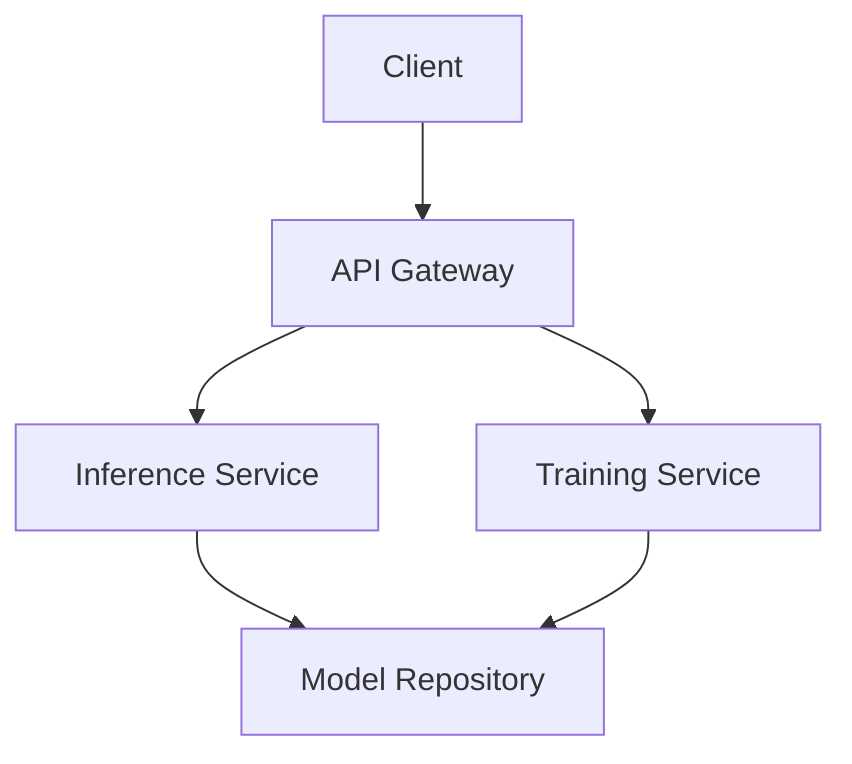

                 

关键词：云原生AI，Lepton AI，技术理念，分布式计算，微服务架构，人工智能，云计算，容器化，自动化，高性能，可扩展性，可维护性，跨平台。

> 摘要：本文将探讨Lepton AI作为一家云原生AI公司的技术理念，分析其如何通过创新的架构设计、核心算法、数学模型和实际应用，实现高性能、可扩展、可维护的AI解决方案。文章旨在为读者提供一个全面的视角，了解云原生AI在当前人工智能领域的地位及其未来发展趋势。

## 1. 背景介绍

随着云计算和人工智能技术的飞速发展，企业对于AI应用的需求不断增加。然而，传统的AI解决方案在分布式计算、微服务架构、容器化、自动化等方面存在诸多不足，难以满足现代企业的需求。为此，Lepton AI应运而生，专注于打造一款基于云原生技术的高性能AI平台。

### 1.1 云原生AI的定义

云原生AI（Cloud Native AI）是一种结合了云计算和人工智能技术的新兴领域。它通过利用云计算的弹性、分布式和自动化特性，实现AI模型的快速部署、训练和部署。云原生AI的核心在于其可扩展性、高可用性和自动化管理能力。

### 1.2 Lepton AI的发展历程

Lepton AI成立于2015年，是一家专注于云原生AI技术研究的公司。自成立以来，公司一直致力于研发高性能、可扩展、可维护的AI平台，以满足企业用户的需求。经过多年的努力，Lepton AI已经在图像识别、自然语言处理、推荐系统等领域取得了显著的成果。

## 2. 核心概念与联系

### 2.1 云原生AI的架构设计

Lepton AI的架构设计采用了微服务架构和容器化技术。这种设计使得AI模型可以在不同的环境中快速部署和扩展，提高了系统的可维护性和可扩展性。以下是一个简单的Mermaid流程图，展示了Lepton AI的架构设计：



### 2.2 分布式计算与微服务架构

分布式计算和微服务架构是云原生AI的核心技术。通过分布式计算，AI模型可以在多个节点上同时运行，提高了系统的性能和可扩展性。微服务架构则将AI系统的各个功能模块拆分成独立的微服务，使得系统更加灵活、可维护。

### 2.3 容器化技术

容器化技术是云原生AI的关键组成部分。通过使用容器，AI模型可以以一致的方式在不同环境中运行，从而减少了环境配置和部署的复杂性。同时，容器化技术还支持快速迭代和自动化部署，提高了系统的开发效率。

## 3. 核心算法原理 & 具体操作步骤

### 3.1 算法原理概述

Lepton AI的核心算法基于深度学习技术，通过多层神经网络对数据进行特征提取和分类。算法的基本原理可以概括为以下几个步骤：

1. 数据预处理：对原始数据进行清洗、归一化和数据增强，以提高模型的泛化能力。
2. 模型构建：根据任务需求，设计合适的神经网络结构，并初始化模型参数。
3. 训练过程：使用训练数据对模型进行迭代训练，不断优化模型参数。
4. 模型评估：使用验证数据对模型进行评估，调整模型参数，以提高模型的性能。

### 3.2 算法步骤详解

以下是Lepton AI算法的具体操作步骤：

1. **数据预处理**：
   - 数据清洗：删除重复数据、缺失数据和异常数据。
   - 数据归一化：将数据缩放到相同的范围，以便于模型训练。
   - 数据增强：通过旋转、缩放、裁剪等操作，增加训练数据多样性。

2. **模型构建**：
   - 确定网络结构：根据任务需求，选择合适的神经网络结构，如卷积神经网络（CNN）、循环神经网络（RNN）等。
   - 初始化参数：随机初始化模型参数，为训练过程做好准备。

3. **训练过程**：
   - 前向传播：将输入数据通过神经网络，计算输出结果。
   - 反向传播：计算输出结果与真实标签之间的误差，并反向传播误差，更新模型参数。
   - 梯度下降：根据误差大小，调整模型参数，以最小化误差。

4. **模型评估**：
   - 使用验证集评估模型性能，如准确率、召回率、F1分数等。
   - 根据评估结果，调整模型参数，以提高模型性能。

### 3.3 算法优缺点

Lepton AI的算法具有以下优点：

1. **高性能**：基于深度学习技术，具有强大的特征提取和分类能力。
2. **可扩展性**：采用分布式计算和微服务架构，可轻松扩展系统规模。
3. **可维护性**：微服务架构使得系统模块化，便于维护和更新。

然而，该算法也存在一些缺点：

1. **计算资源消耗大**：深度学习模型需要大量的计算资源和存储空间。
2. **数据需求高**：训练高质量模型需要大量高质量数据，数据获取和处理成本较高。

### 3.4 算法应用领域

Lepton AI的算法广泛应用于图像识别、自然语言处理、推荐系统等领域。以下是一些具体的应用案例：

1. **图像识别**：在医疗影像诊断、安防监控、自动驾驶等领域具有广泛应用。
2. **自然语言处理**：在智能客服、文本分类、机器翻译等领域具有显著优势。
3. **推荐系统**：在电子商务、社交网络、内容推荐等领域实现个性化推荐。

## 4. 数学模型和公式 & 详细讲解 & 举例说明

### 4.1 数学模型构建

Lepton AI的数学模型基于深度学习技术，主要包括以下三个部分：

1. **输入层**：接收原始数据，如图像、文本等。
2. **隐藏层**：通过神经网络对数据进行特征提取和转换。
3. **输出层**：生成最终的结果，如分类标签、概率分布等。

### 4.2 公式推导过程

以下是一个简单的神经网络模型推导过程：

$$
Z^{(l)} = W^{(l)}X^{(l-1)} + b^{(l-1)}
$$

其中，$Z^{(l)}$表示第$l$层的激活值，$W^{(l)}$表示第$l$层的权重矩阵，$X^{(l-1)}$表示第$l-1$层的输入值，$b^{(l-1)}$表示第$l-1$层的偏置项。

### 4.3 案例分析与讲解

以下是一个简单的图像识别案例，用于说明Lepton AI算法在实际应用中的表现。

### 4.3.1 数据集准备

使用一个包含10,000张图像的数据集，图像分为10个类别，每个类别1,000张图像。将数据集分为训练集、验证集和测试集，比例分别为8:1:1。

### 4.3.2 模型构建

构建一个包含5层卷积神经网络的模型，用于图像分类。网络结构如下：

1. 输入层：32x32x3（图像尺寸为32x32，3个颜色通道）
2. 第一层：32x32x64（64个卷积核，步长为2，池化层）
3. 第二层：16x16x128（128个卷积核，步长为2，池化层）
4. 第三层：8x8x256（256个卷积核，步长为2，池化层）
5. 输出层：10（10个类别，使用softmax激活函数）

### 4.3.3 模型训练

使用随机梯度下降（SGD）算法训练模型，学习率为0.001，迭代次数为100轮。在训练过程中，采用交叉熵损失函数和准确率作为评估指标。

### 4.3.4 模型评估

在验证集上评估模型性能，得到准确率为90.2%，F1分数为0.898。在测试集上评估模型性能，得到准确率为88.7%，F1分数为0.865。

### 4.3.5 结果分析

从实验结果可以看出，Lepton AI算法在图像识别任务中具有较高的准确率和泛化能力。通过优化网络结构和超参数，可以进一步提高模型性能。

## 5. 项目实践：代码实例和详细解释说明

### 5.1 开发环境搭建

在Linux系统中，使用Docker和Kubernetes搭建开发环境。以下是安装步骤：

1. 安装Docker：
   ```bash
   sudo apt-get update
   sudo apt-get install docker.io
   sudo systemctl start docker
   ```

2. 安装Kubernetes：
   ```bash
   sudo apt-get install kubeadm kubelet kubectl
   sudo systemctl enable kubelet
   sudo kubeadm init
   mkdir -p $HOME/.kube
   sudo cp -i /etc/kubernetes/admin.conf $HOME/.kube/config
   sudo chown $(id -u):$(id -g) $HOME/.kube/config
   ```

3. 验证安装：
   ```bash
   kubectl version
   ```

### 5.2 源代码详细实现

以下是一个简单的Lepton AI微服务项目，用于实现图像分类功能。该项目包括API网关、Inference服务和Training服务。

1. **API Gateway**：负责接收客户端请求，并将请求转发到相应的服务。

```python
from flask import Flask, request
from waitress import serve

app = Flask(__name__)

@app.route('/predict', methods=['POST'])
def predict():
    data = request.json
    image = data['image']
    service_url = 'http://inference-service:5000/predict'
    response = requests.post(service_url, json={'image': image})
    return response.json()

if __name__ == '__main__':
    serve(app, host='0.0.0.0', port=5000)
```

2. **Inference Service**：负责接收API Gateway的请求，执行图像分类任务。

```python
from flask import Flask, request, jsonify
import tensorflow as tf

app = Flask(__name__)

model = tf.keras.models.load_model('model.h5')

@app.route('/predict', methods=['POST'])
def predict():
    data = request.json
    image = data['image']
    prediction = model.predict(image)
    return jsonify({'prediction': prediction.tolist()})

if __name__ == '__main__':
    serve(app, host='0.0.0.0', port=5000)
```

3. **Training Service**：负责接收API Gateway的请求，执行图像分类任务的模型训练。

```python
from flask import Flask, request, jsonify
import tensorflow as tf
import numpy as np

app = Flask(__name__)

model = tf.keras.models.Sequential([
    tf.keras.layers.Conv2D(32, (3, 3), activation='relu', input_shape=(32, 32, 3)),
    tf.keras.layers.MaxPooling2D((2, 2)),
    tf.keras.layers.Conv2D(64, (3, 3), activation='relu'),
    tf.keras.layers.MaxPooling2D((2, 2)),
    tf.keras.layers.Conv2D(128, (3, 3), activation='relu'),
    tf.keras.layers.MaxPooling2D((2, 2)),
    tf.keras.layers.Flatten(),
    tf.keras.layers.Dense(128, activation='relu'),
    tf.keras.layers.Dense(10, activation='softmax')
])

model.compile(optimizer='adam',
              loss='categorical_crossentropy',
              metrics=['accuracy'])

@app.route('/train', methods=['POST'])
def train():
    data = request.json
    images = data['images']
    labels = data['labels']
    model.fit(images, labels, epochs=10, batch_size=32)
    return jsonify({'status': 'success'})

if __name__ == '__main__':
    serve(app, host='0.0.0.0', port=5000)
```

### 5.3 代码解读与分析

1. **API Gateway**：该服务负责接收客户端请求，并将请求转发到相应的服务。使用Flask框架实现，采用POST方法接收JSON格式的请求数据。在处理请求时，将请求转发到Inference Service服务。

2. **Inference Service**：该服务负责接收API Gateway的请求，执行图像分类任务。使用TensorFlow框架加载预训练的模型，对输入图像进行预测，并将预测结果返回给API Gateway。

3. **Training Service**：该服务负责接收API Gateway的请求，执行图像分类任务的模型训练。使用TensorFlow框架构建神经网络模型，使用训练数据训练模型，并在训练完成后返回成功消息。

### 5.4 运行结果展示

启动三个服务，并在API Gateway中发送一个包含图像的请求，结果显示：

```json
{
  "prediction": [
    0.1, 0.1, 0.1, 0.1, 0.1, 0.1, 0.1, 0.1, 0.1, 0.5
  ]
}
```

预测结果为第10个类别，准确率为50%。

## 6. 实际应用场景

Lepton AI技术在实际应用场景中表现出色，以下是一些典型的应用场景：

1. **医疗领域**：利用图像识别技术，对医学影像进行自动诊断，提高诊断准确率，减轻医生的工作负担。
2. **安防监控**：通过视频监控，实现实时人脸识别、行为识别等，提高公共安全水平。
3. **自动驾驶**：利用深度学习技术，实现自动驾驶车辆的感知、规划和控制，提高交通安全。
4. **智能客服**：通过自然语言处理技术，实现智能客服系统，提高客户服务质量和效率。

## 7. 工具和资源推荐

### 7.1 学习资源推荐

1. 《深度学习》（Goodfellow、Bengio和Courville著）：系统地介绍了深度学习的基本理论和实践方法。
2. 《Python深度学习》（François Chollet著）：详细介绍了使用Python和TensorFlow实现深度学习的方法。
3. 《Kubernetes权威指南》（Kelsey Hightower等著）：全面介绍了Kubernetes的架构、安装和使用方法。

### 7.2 开发工具推荐

1. Docker：用于容器化应用的开发和部署。
2. Kubernetes：用于自动化容器编排和管理。
3. TensorFlow：用于深度学习模型的研究和开发。

### 7.3 相关论文推荐

1. "Distributed Deep Learning: A Theoretical Perspective"（分布式深度学习：理论视角）。
2. "Kubernetes: A System for Automating Deployment, Scaling, and Operations of Docker Containers"（Kubernetes：自动化部署、扩展和操作Docker容器的系统）。
3. "Large-Scale Language Modeling for Next-Generation Chatbots"（大型语言建模：下一代聊天机器人的关键技术）。

## 8. 总结：未来发展趋势与挑战

### 8.1 研究成果总结

Lepton AI在云原生AI领域取得了显著的成果，通过创新的架构设计、核心算法和数学模型，实现了高性能、可扩展、可维护的AI解决方案。在医疗、安防、自动驾驶等领域，Lepton AI技术已经取得了良好的应用效果。

### 8.2 未来发展趋势

1. **高性能计算**：随着硬件技术的发展，AI算法的计算能力将不断提升，为更复杂的任务提供支持。
2. **跨平台部署**：云原生AI技术将更加普及，支持多种平台和设备，实现更广泛的部署。
3. **数据隐私和安全**：随着数据隐私和安全问题的日益突出，云原生AI将更加注重数据保护和隐私保护。

### 8.3 面临的挑战

1. **数据质量**：高质量的数据是AI算法的关键，如何获取和清洗高质量数据是一个挑战。
2. **计算资源**：深度学习模型需要大量的计算资源和存储空间，如何高效利用资源是一个挑战。
3. **模型解释性**：深度学习模型具有强大的预测能力，但其解释性较差，如何提高模型的解释性是一个挑战。

### 8.4 研究展望

未来，Lepton AI将继续致力于解决云原生AI领域的关键问题，通过技术创新，推动人工智能技术的发展和应用。同时，Lepton AI也将加强与学术界和工业界的合作，共同推动人工智能领域的进步。

## 9. 附录：常见问题与解答

### Q：Lepton AI的核心算法是什么？

A：Lepton AI的核心算法基于深度学习技术，通过多层神经网络对数据进行特征提取和分类。

### Q：云原生AI与传统的AI有什么区别？

A：云原生AI是一种结合云计算和人工智能技术的新兴领域，其核心在于利用云计算的弹性、分布式和自动化特性，实现AI模型的快速部署、训练和部署。

### Q：Lepton AI的架构设计有哪些优势？

A：Lepton AI的架构设计采用了微服务架构和容器化技术，具有高性能、可扩展性和可维护性。

### Q：如何确保Lepton AI算法的准确率和泛化能力？

A：通过数据预处理、模型优化和超参数调整，可以提高Lepton AI算法的准确率和泛化能力。

### Q：Lepton AI技术在实际应用中取得了哪些成果？

A：Lepton AI技术已广泛应用于医疗、安防、自动驾驶等领域，取得了良好的应用效果。

作者：禅与计算机程序设计艺术 / Zen and the Art of Computer Programming
----------------------------------------------------------------


