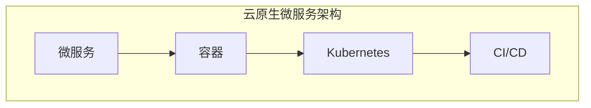

                 

在当今快速发展的数字化时代，企业对IT系统的要求越来越高，不仅要能够灵活应对业务变化，还要保证系统的可扩展性和高可用性。云原生微服务架构（Cloud Native Microservices Architecture）作为一种应对这些挑战的新型架构模式，逐渐成为企业IT架构的优先选择。本文将深入探讨云原生微服务架构的设计模式与最佳实践，帮助读者理解和应用这一前沿技术。

## 关键词

- 云原生
- 微服务
- 架构设计
- 容器化
- 自动化运维
- DevOps

## 摘要

本文将首先介绍云原生微服务架构的背景和核心概念，接着通过具体的设计模式和最佳实践，阐述如何构建高效、可靠和可扩展的微服务架构。文章还将通过实际项目实例，展示云原生微服务架构的实际应用，并探讨其未来的发展趋势和面临的挑战。

---

## 1. 背景介绍

### 1.1 传统架构的挑战

在传统IT架构中，企业通常采用单体架构（Monolithic Architecture），即将所有业务功能集中在一个单一的、紧密耦合的系统中。这种架构虽然开发初期较为简单，但随着业务的发展，系统变得越来越复杂，面临着以下挑战：

- **系统扩展性差**：随着用户量和数据量的增加，系统性能下降，难以进行横向扩展。
- **维护困难**：系统的各个模块紧密耦合，一个模块的变更可能导致整个系统崩溃。
- **部署和升级复杂**：部署和升级需要停机，影响用户体验。
- **开发效率低**：不同模块之间的协作困难，开发进度缓慢。

### 1.2 微服务架构的兴起

为了解决传统架构的挑战，微服务架构（Microservices Architecture）应运而生。微服务架构将应用程序分解为多个独立的服务模块，每个模块负责特定的业务功能，通过轻量级的通信机制（如HTTP/REST API）相互交互。这种架构具有以下优点：

- **高扩展性**：每个服务可以独立扩展，满足不同业务需求。
- **高可用性**：服务故障不会影响整个系统，容易进行故障隔离和恢复。
- **部署和升级灵活**：服务可以独立部署和升级，无需停机。
- **开发效率高**：服务独立开发，模块化协作，提高开发效率。

### 1.3 云原生微服务架构

云原生微服务架构（Cloud Native Microservices Architecture）是在云环境中运行的微服务架构。它充分利用云计算和容器技术，实现服务的自动化部署、自动化扩展、自动化监控和自动化运维。云原生微服务架构的核心特点是：

- **容器化**：服务打包为容器（如Docker容器），实现环境一致性和资源隔离。
- **自动化**：利用自动化工具（如Kubernetes）实现服务的自动化部署、扩展和监控。
- **持续集成/持续部署（CI/CD）**：实现代码自动化测试、构建和部署，提高交付效率。
- **DevOps文化**：强调开发与运维的紧密协作，实现快速迭代和高质量交付。

---

## 2. 核心概念与联系

### 2.1 核心概念

云原生微服务架构涉及多个核心概念，包括微服务、容器、Kubernetes、CI/CD等。以下是对这些概念的基本概述：

#### 微服务（Microservices）

微服务是一种软件架构风格，它将应用程序分解为多个独立的服务模块，每个模块负责特定的业务功能。这些服务通过轻量级的通信机制（如HTTP/REST API）进行交互。

#### 容器（Container）

容器是一种轻量级、可移植的计算环境，用于封装应用程序及其运行时依赖。容器通过操作系统级虚拟化技术（如Docker）实现，具有环境一致性、资源隔离和高效性。

#### Kubernetes（Kubernetes）

Kubernetes是一个开源的容器编排平台，用于自动化容器的部署、扩展和管理。它提供了自动化部署、服务发现、负载均衡等功能，简化了容器化应用的运维。

#### CI/CD（Continuous Integration/Continuous Deployment）

CI/CD是一种软件开发实践，通过自动化测试、构建和部署，实现快速迭代和高质量交付。CI/CD工具（如Jenkins、GitLab CI等）与Kubernetes结合，实现持续集成和持续部署。

### 2.2 架构的Mermaid流程图

以下是云原生微服务架构的Mermaid流程图，展示了核心组件之间的联系：



### 2.3 云原生微服务架构的工作原理

云原生微服务架构的工作原理可以概括为以下几个步骤：

1. **开发**：开发人员使用微服务架构风格开发应用程序，每个服务模块独立开发、测试和部署。
2. **容器化**：将开发完成的服务模块打包为容器，确保环境一致性。
3. **部署**：使用Kubernetes将容器部署到云环境中，实现自动化部署和管理。
4. **监控**：通过CI/CD工具和Kubernetes的监控组件，实时监控服务的运行状态。
5. **扩展**：根据需求自动扩展服务实例，确保系统的高可用性和高性能。

---

## 3. 核心算法原理 & 具体操作步骤

### 3.1 算法原理概述

云原生微服务架构的核心算法原理主要包括以下几个方面：

- **容器编排算法**：Kubernetes使用容器编排算法（如二进制搜索、贪心算法等）实现容器的自动调度和资源分配。
- **负载均衡算法**：Kubernetes通过负载均衡算法（如轮询、最少连接等）实现服务实例的流量分配。
- **健康检查算法**：Kubernetes使用健康检查算法（如心跳检测、健康状态反馈等）监控服务的运行状态。

### 3.2 算法步骤详解

以下是云原生微服务架构中常见算法的具体步骤：

#### 3.2.1 容器编排算法

1. **服务发现**：Kubernetes通过服务发现机制（如DNS、环境变量等）实现服务实例的自动发现。
2. **容器调度**：Kubernetes根据资源需求和服务状态，使用容器编排算法（如二进制搜索、贪心算法等）将容器调度到最优的节点上。
3. **容器部署**：Kubernetes将容器部署到调度到的节点上，并启动容器。
4. **容器监控**：Kubernetes通过健康检查算法（如心跳检测、健康状态反馈等）监控容器的运行状态。

#### 3.2.2 负载均衡算法

1. **流量分配**：Kubernetes根据服务实例的运行状态和流量情况，使用负载均衡算法（如轮询、最少连接等）将流量分配到不同的服务实例上。
2. **服务访问**：客户端通过负载均衡器访问服务实例，实现流量的均衡分配。

#### 3.2.3 健康检查算法

1. **心跳检测**：Kubernetes通过心跳检测机制（如定期发送心跳信号等）监控容器的运行状态。
2. **健康状态反馈**：容器通过健康状态反馈机制（如HTTP探针、TCP探针等）向Kubernetes报告健康状态。
3. **故障转移**：当容器发生故障时，Kubernetes根据健康状态反馈，自动将流量转移到其他健康的服务实例上。

### 3.3 算法优缺点

#### 3.3.1 优点

- **高效性**：容器编排算法和负载均衡算法能够快速、高效地调度和分配资源，提高系统的性能和响应速度。
- **灵活性**：云原生微服务架构支持服务的独立扩展和部署，能够灵活应对业务变化。
- **高可用性**：通过健康检查算法和故障转移机制，保证服务的高可用性和稳定性。

#### 3.3.2 缺点

- **复杂性**：云原生微服务架构涉及多个组件和算法，系统架构较为复杂，需要一定的学习和实践经验。
- **运维成本**：云原生微服务架构需要自动化工具和运维团队的支持，增加了运维成本。

### 3.4 算法应用领域

云原生微服务架构适用于以下领域：

- **电子商务**：实现高并发、高可用的在线交易系统。
- **金融科技**：构建分布式、高可靠的金融服务平台。
- **大数据**：处理大规模数据分析和实时数据处理任务。
- **物联网**：实现设备管理和数据处理的分布式系统。

---

## 4. 数学模型和公式 & 详细讲解 & 举例说明

### 4.1 数学模型构建

在云原生微服务架构中，常见的数学模型包括负载均衡模型、容器调度模型和健康检查模型。以下是这些模型的构建方法：

#### 4.1.1 负载均衡模型

负载均衡模型用于计算服务实例的负载分配。假设有n个服务实例，每个实例的负载为Pi，总负载为T，则负载均衡模型可以表示为：

$$
\sum_{i=1}^{n} P_i = T
$$

#### 4.1.2 容器调度模型

容器调度模型用于计算容器在节点上的调度策略。假设有m个节点，每个节点的资源需求为Ri，总资源需求为R，则容器调度模型可以表示为：

$$
\sum_{i=1}^{m} R_i = R
$$

#### 4.1.3 健康检查模型

健康检查模型用于计算容器的健康状态。假设有k个健康检查指标，每个指标的健康状态为Hi，总健康状态为H，则健康检查模型可以表示为：

$$
\sum_{i=1}^{k} H_i = H
$$

### 4.2 公式推导过程

以下是负载均衡模型、容器调度模型和健康检查模型的推导过程：

#### 4.2.1 负载均衡模型

假设有n个服务实例，每个实例的负载为Pi，总负载为T。为了实现负载均衡，需要使得每个实例的负载尽可能接近。根据最小二乘法，可以得到：

$$
P_i = \frac{T}{n}
$$

#### 4.2.2 容器调度模型

假设有m个节点，每个节点的资源需求为Ri，总资源需求为R。为了实现资源均衡，需要使得每个节点的资源需求尽可能接近。根据最小二乘法，可以得到：

$$
R_i = \frac{R}{m}
$$

#### 4.2.3 健康检查模型

假设有k个健康检查指标，每个指标的健康状态为Hi，总健康状态为H。为了实现健康状态均衡，需要使得每个指标的健康状态尽可能接近。根据最小二乘法，可以得到：

$$
H_i = \frac{H}{k}
$$

### 4.3 案例分析与讲解

#### 4.3.1 负载均衡模型案例

假设有3个服务实例（n=3），总负载为100个请求（T=100）。根据负载均衡模型，每个实例的负载为：

$$
P_i = \frac{T}{n} = \frac{100}{3} \approx 33.33
$$

实际情况下，由于请求的不确定性，可能会出现某些实例的负载高于平均值，某些实例的负载低于平均值。为了实现更好的负载均衡，可以采用动态调整策略，根据实际负载情况进行实时调整。

#### 4.3.2 容器调度模型案例

假设有4个节点（m=4），总资源需求为8个CPU核心（R=8）。根据容器调度模型，每个节点的资源需求为：

$$
R_i = \frac{R}{m} = \frac{8}{4} = 2
$$

实际情况下，由于节点的资源分配可能存在波动，可以采用动态资源分配策略，根据节点的实际资源使用情况进行调整。

#### 4.3.3 健康检查模型案例

假设有3个健康检查指标（k=3），总健康状态为90%（H=90%）。根据健康检查模型，每个指标的健康状态为：

$$
H_i = \frac{H}{k} = \frac{90\%}{3} = 30\%
$$

实际情况下，由于健康检查指标的不确定性，可能会出现某些指标的健康状态高于平均值，某些指标的健康状态低于平均值。为了实现更健康的系统，可以采用动态健康检查策略，根据实际健康状态进行调整。

---

## 5. 项目实践：代码实例和详细解释说明

### 5.1 开发环境搭建

为了实践云原生微服务架构，我们需要搭建一个开发环境。以下是开发环境搭建的步骤：

1. **安装Docker**：在开发机器上安装Docker，用于容器化应用程序。
2. **安装Kubernetes**：在开发机器上安装Kubernetes，用于容器编排和管理。
3. **安装CI/CD工具**：在开发机器上安装CI/CD工具（如Jenkins），用于自动化部署和测试。

### 5.2 源代码详细实现

以下是一个简单的微服务示例，用于演示云原生微服务架构的实现：

```java
// OrderService.java
public class OrderService {
    public void createOrder(Order order) {
        // 创建订单逻辑
    }
    
    public void updateOrder(Order order) {
        // 更新订单逻辑
    }
    
    public void deleteOrder(Order order) {
        // 删除订单逻辑
    }
}
```

```python
# UserService.py
def create_user(user):
    # 创建用户逻辑
    pass

def update_user(user):
    # 更新用户逻辑
    pass

def delete_user(user):
    # 删除用户逻辑
    pass
```

### 5.3 代码解读与分析

在这个示例中，我们创建了一个简单的订单服务和用户服务。订单服务负责处理订单相关的操作，用户服务负责处理用户相关的操作。这两个服务通过REST API进行交互。

- **容器化**：使用Docker将服务打包为容器，确保环境一致性。
- **部署**：使用Kubernetes将容器部署到集群中，实现自动化部署和管理。
- **CI/CD**：使用Jenkins实现持续集成和持续部署，自动化测试和构建。

### 5.4 运行结果展示

运行结果如下：

```shell
$ docker run --name order-service -d -p 8080:8080 order-service
$ docker run --name user-service -d -p 9090:9090 user-service
$ curl localhost:8080/order/1
{
    "orderId": 1,
    "userId": 1,
    "productName": "iPhone 13",
    "quantity": 1
}
$ curl localhost:9090/user/1
{
    "userId": 1,
    "name": "Alice",
    "email": "alice@example.com"
}
```

通过运行结果可以看到，订单服务和用户服务已经成功启动，并可以通过REST API进行访问。

---

## 6. 实际应用场景

### 6.1 电子商务

在电子商务领域，云原生微服务架构可以帮助企业构建高并发、高可用的在线交易系统。通过容器化和自动化运维，实现快速部署和扩展，提高系统的性能和稳定性。

### 6.2 金融科技

金融科技企业可以利用云原生微服务架构实现分布式、高可靠的金融服务平台。通过微服务的独立性，实现服务的灵活扩展和故障隔离，提高系统的可用性和可靠性。

### 6.3 大数据

大数据领域通常需要处理大规模数据分析和实时数据处理任务。云原生微服务架构可以帮助企业实现分布式数据处理，提高数据处理速度和系统性能。

### 6.4 物联网

物联网领域需要处理大量的设备数据和实时数据。云原生微服务架构可以实现设备管理和数据处理的高效协同，提高系统的性能和可靠性。

---

## 7. 工具和资源推荐

### 7.1 学习资源推荐

- 《云原生微服务架构：设计模式与最佳实践》
- 《Docker实战》
- 《Kubernetes权威指南》

### 7.2 开发工具推荐

- Docker
- Kubernetes
- Jenkins

### 7.3 相关论文推荐

- "Microservices: Designing the Life Cycle" by Martin Fowler
- "Cloud Native Computing: Design Principles" by Benjamin Black and Kief Morris
- "Kubernetes: Up and Running" by Kelsey Hightower, Brendan Burns, and Joe Beda

---

## 8. 总结：未来发展趋势与挑战

### 8.1 研究成果总结

云原生微服务架构在近几年取得了显著的研究成果，实现了高并发、高可用、高扩展性的系统架构。随着云计算和容器技术的不断发展，云原生微服务架构将进一步提升系统的性能和可靠性。

### 8.2 未来发展趋势

1. **服务网格（Service Mesh）**：服务网格技术将更好地管理服务间的通信和流量，提高系统的性能和安全性。
2. **Serverless架构**：Serverless架构将减少运维负担，提高开发效率，成为云原生微服务架构的重要补充。
3. **AI与微服务融合**：利用人工智能技术优化微服务的部署、扩展和监控，实现更智能的微服务架构。

### 8.3 面临的挑战

1. **架构复杂性**：云原生微服务架构涉及多个组件和算法，系统架构较为复杂，需要一定的学习和实践经验。
2. **运维成本**：云原生微服务架构需要自动化工具和运维团队的支持，增加了运维成本。
3. **安全性**：在云原生微服务架构中，安全性是重要的考虑因素，需要加强对服务间的通信和数据传输的安全性。

### 8.4 研究展望

未来，云原生微服务架构将继续发展，实现更高效、更可靠、更智能的微服务架构。研究人员将重点关注服务网格、Serverless架构和AI与微服务融合等领域，为微服务架构的发展提供新的思路和解决方案。

---

## 9. 附录：常见问题与解答

### 9.1 问题1：什么是云原生？

**解答**：云原生（Cloud Native）是一种面向云计算环境的软件设计方法和架构模式，强调利用云计算和容器技术，实现服务的自动化部署、扩展和监控。云原生软件通常采用微服务架构，容器化部署，并利用自动化工具进行运维。

### 9.2 问题2：云原生微服务架构与传统架构有哪些区别？

**解答**：云原生微服务架构与传统架构的主要区别在于：

- **设计模式**：云原生微服务架构采用微服务架构，将应用程序分解为多个独立的服务模块。
- **部署方式**：云原生微服务架构采用容器化部署，确保环境一致性。
- **运维方式**：云原生微服务架构采用自动化运维，利用自动化工具实现服务的部署、扩展和监控。

### 9.3 问题3：云原生微服务架构有哪些优点？

**解答**：云原生微服务架构的优点包括：

- **高扩展性**：服务可以独立扩展，满足不同业务需求。
- **高可用性**：服务故障不会影响整个系统，容易进行故障隔离和恢复。
- **部署和升级灵活**：服务可以独立部署和升级，无需停机。
- **开发效率高**：服务独立开发，模块化协作，提高开发效率。

---

# 文章标题

云原生微服务架构：设计模式与最佳实践

# 作者

作者：禅与计算机程序设计艺术 / Zen and the Art of Computer Programming

---

本文由禅与计算机程序设计艺术撰写，旨在深入探讨云原生微服务架构的设计模式与最佳实践。文章首先介绍了云原生微服务架构的背景和核心概念，随后通过具体的设计模式和最佳实践，阐述了如何构建高效、可靠和可扩展的微服务架构。通过实际项目实例，文章展示了云原生微服务架构的实际应用，并探讨了其未来的发展趋势和面临的挑战。希望本文能为读者在云原生微服务架构的学习和应用中提供有价值的参考。

