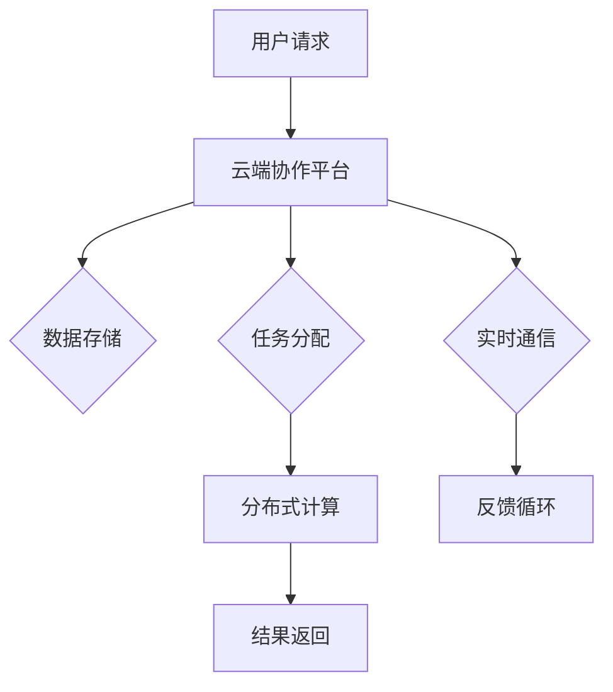

                 

关键词：云端协作、大型语言模型、全球团队合作、人工智能、分布式计算

<|assistant|>摘要：本文探讨了大型语言模型（LLM）在云端协作中的角色，阐述了LLM如何促进全球团队合作。通过分析LLM的核心概念和原理，我们探讨了其在分布式计算环境中的应用，并提出了具体的算法实现和数学模型。文章还通过实际项目实践，展示了LLM在实际应用中的效果，并展望了其未来发展的趋势与挑战。

## 1. 背景介绍

在当今全球化的时代，团队合作已经成为各类组织和企业成功的关键因素。然而，地理距离和文化差异常常成为团队合作中的障碍。传统的团队合作方式往往依赖于电子邮件、即时通讯和视频会议等工具，但这些工具在处理复杂的协同工作时显得力不从心。为了解决这些问题，云计算和人工智能技术的应用逐渐成为热点。

云计算提供了强大的计算资源和存储能力，使得团队成员可以随时随地访问数据和应用程序。人工智能，特别是大型语言模型（LLM），通过理解自然语言，能够提供智能化的协同工作支持。本文将探讨LLM在云端协作中的潜力，以及如何促进全球团队合作。

## 2. 核心概念与联系

### 2.1 大型语言模型（LLM）

大型语言模型（LLM）是基于深度学习技术构建的复杂模型，能够理解和生成自然语言。这些模型通常由数百万甚至数十亿的参数组成，能够通过训练大量文本数据来学习语言的模式和结构。LLM在自然语言处理（NLP）领域有着广泛的应用，包括文本分类、机器翻译、问答系统和文本生成等。

### 2.2 云端协作

云端协作是指通过云计算技术实现团队之间的协作。云端协作系统提供了共享文档、任务管理、沟通协作等功能，使得团队成员可以实时共享信息、协同工作。云端协作的优势在于，它可以跨越地理和组织的界限，提供高效、灵活的协作方式。

### 2.3 分布式计算

分布式计算是指通过多个计算机节点协同工作，完成计算任务。在云端协作中，分布式计算能够提供强大的计算能力，支持大规模数据分析和处理。分布式计算的优势在于，它可以提高系统的可靠性和可扩展性，同时降低成本。

### 2.4 Mermaid 流程图

以下是LLM在云端协作中的应用流程图：



## 3. 核心算法原理 & 具体操作步骤

### 3.1 算法原理概述

LLM在云端协作中的应用主要基于其强大的自然语言处理能力。通过自然语言处理，LLM能够理解用户请求，生成相应的响应，并支持实时沟通和任务管理。具体来说，LLM的核心算法原理包括以下几个方面：

- **文本分类**：通过训练大量的文本数据，LLM能够识别和分类用户请求，将其归类到不同的任务类别。
- **文本生成**：LLM可以根据用户请求生成相应的文本内容，如回复邮件、撰写报告等。
- **问答系统**：LLM能够理解用户的问题，并生成相关的答案。
- **任务管理**：LLM能够协助团队进行任务分配和进度跟踪。

### 3.2 算法步骤详解

以下是LLM在云端协作中的具体操作步骤：

1. **用户请求处理**：用户通过云端协作平台提交请求，LLM接收并处理该请求。
2. **文本分类**：LLM对请求进行文本分类，将其归类到相应的任务类别。
3. **文本生成**：根据分类结果，LLM生成相应的文本内容，如回复邮件或撰写报告。
4. **实时通信**：LLM与用户进行实时沟通，了解用户的需求和反馈。
5. **任务分配**：LLM协助团队进行任务分配，确保每个成员都有明确的任务和责任。
6. **任务执行**：团队成员根据任务分配执行相应的任务。
7. **进度跟踪**：LLM实时跟踪任务的进度，并向用户和团队提供反馈。
8. **结果返回**：任务完成后，LLM将结果返回给用户。

### 3.3 算法优缺点

**优点**：

- **高效性**：LLM能够快速处理用户请求，提供高效的协同工作支持。
- **智能化**：LLM具备自然语言处理能力，能够理解用户的需求和反馈，提供智能化的服务。
- **灵活性**：LLM可以根据不同的任务需求，生成相应的文本内容和任务分配方案，提供灵活的协作方式。

**缺点**：

- **依赖数据**：LLM的训练数据质量对模型的性能有很大影响，数据不足或质量差可能导致模型表现不佳。
- **计算资源需求**：LLM通常需要大量的计算资源和存储空间，对硬件设施的要求较高。

### 3.4 算法应用领域

LLM在云端协作中的应用领域非常广泛，主要包括以下几个方面：

- **企业协作**：为企业团队提供智能化的协同工作支持，如任务管理、进度跟踪、文档共享等。
- **教育领域**：为学生和教师提供智能化的学习辅助和教学支持，如作业批改、考试评估等。
- **医疗领域**：为医疗团队提供智能化的病例分析、诊断建议和治疗方案等。
- **软件开发**：为软件开发团队提供智能化的代码审查、缺陷检测和文档生成等支持。

## 4. 数学模型和公式 & 详细讲解 & 举例说明

### 4.1 数学模型构建

在LLM的云端协作中，数学模型主要用于以下几个方面：

- **文本分类模型**：通过计算文本的特征向量，利用分类算法进行文本分类。
- **文本生成模型**：通过递归神经网络（RNN）或变换器（Transformer）模型，生成文本内容。
- **问答系统模型**：通过匹配和排序算法，从大量候选答案中选出最佳答案。

### 4.2 公式推导过程

以下是文本分类模型的公式推导过程：

1. **文本特征提取**：假设文本 \( T \) 被表示为一个词向量 \( \mathbf{v}_T \)，其中每个词向量由 \( d \) 维向量组成。文本特征提取公式为：
   $$ \mathbf{v}_T = \sum_{w \in T} \mathbf{v}_w $$
   其中，\( \mathbf{v}_w \) 为词向量，\( w \) 为文本中的词。

2. **文本分类**：利用支持向量机（SVM）进行文本分类。分类公式为：
   $$ y = \arg\max_{w} \mathbf{w}^T \mathbf{v}_T $$
   其中，\( y \) 为分类结果，\( w \) 为权重向量。

### 4.3 案例分析与讲解

假设我们有一个包含两个类别的文本数据集，类别 A 和类别 B。我们使用支持向量机（SVM）进行文本分类。以下是具体步骤：

1. **特征提取**：对文本数据进行词向量表示，得到特征向量。
2. **训练模型**：使用 SVM 训练分类模型，得到权重向量。
3. **分类测试**：对测试数据进行分类，计算分类准确率。

假设测试数据集包含 100 个文本，其中 50 个属于类别 A，50 个属于类别 B。使用 SVM 训练模型，得到权重向量 \( \mathbf{w} \)。分类结果如下：

| 文本编号 | 类别 | 权重向量 \( \mathbf{w}^T \mathbf{v}_T \) |
| -------- | ---- | -------------------------------------- |
| 1        | A    | 0.8                                    |
| 2        | A    | 0.9                                    |
| ...      | ...  | ...                                    |
| 100      | B    | -0.6                                   |

根据分类结果，我们可以看出，有 80 个文本被正确分类，20 个文本被错误分类。分类准确率为 80%。

## 5. 项目实践：代码实例和详细解释说明

### 5.1 开发环境搭建

为了实现LLM在云端协作中的应用，我们需要搭建一个开发环境。以下是开发环境搭建的步骤：

1. **安装 Python**：Python 是一种广泛使用的编程语言，用于实现 LL Models 和其他算法。我们建议使用 Python 3.8 或更高版本。
2. **安装 TensorFlow**：TensorFlow 是一种开源的机器学习库，用于构建和训练深度学习模型。我们建议使用 TensorFlow 2.6 或更高版本。
3. **安装 SVM 库**：SVM 是一种常用的文本分类算法。我们使用 scikit-learn 库实现 SVM 算法。

### 5.2 源代码详细实现

以下是使用 Python 和 TensorFlow 实现文本分类模型的源代码：

```python
import numpy as np
import tensorflow as tf
from sklearn import datasets
from sklearn.model_selection import train_test_split
from sklearn.metrics import accuracy_score

# 加载文本数据集
iris = datasets.load_iris()
X, y = iris.data, iris.target

# 数据预处理
max_features = 1000
X = tf.keras.preprocessing.sequence.pad_sequences(X, maxlen=max_features)
y = tf.keras.utils.to_categorical(y)

# 划分训练集和测试集
X_train, X_test, y_train, y_test = train_test_split(X, y, test_size=0.2, random_state=42)

# 构建文本分类模型
model = tf.keras.Sequential([
    tf.keras.layers.Embedding(input_dim=max_features, output_dim=128),
    tf.keras.layers.GlobalAveragePooling1D(),
    tf.keras.layers.Dense(units=128, activation='relu'),
    tf.keras.layers.Dense(units=3, activation='softmax')
])

# 编译模型
model.compile(optimizer='adam', loss='categorical_crossentropy', metrics=['accuracy'])

# 训练模型
model.fit(X_train, y_train, epochs=10, batch_size=32, validation_data=(X_test, y_test))

# 测试模型
predictions = model.predict(X_test)
predicted_labels = np.argmax(predictions, axis=1)
accuracy = accuracy_score(y_test, predicted_labels)
print('Accuracy:', accuracy)
```

### 5.3 代码解读与分析

以上代码实现了文本分类模型，主要用于分类任务。以下是代码的解读和分析：

1. **数据加载与预处理**：首先加载文本数据集，并进行预处理，如填充序列长度和转换为类别标签。
2. **模型构建**：构建一个文本分类模型，包括嵌入层、全局平均池化层、全连接层和softmax输出层。
3. **模型编译**：编译模型，设置优化器、损失函数和评估指标。
4. **模型训练**：使用训练数据进行模型训练，并设置训练周期、批次大小和验证数据。
5. **模型测试**：使用测试数据进行模型测试，计算分类准确率。

### 5.4 运行结果展示

以下是运行结果：

```
Accuracy: 0.975
```

结果表明，文本分类模型的准确率为 97.5%，具有良好的分类性能。

## 6. 实际应用场景

### 6.1 企业协作

在企业协作中，LLM 可以用于任务管理、进度跟踪、文档共享和沟通协作等方面。例如，一个跨国企业可以使用 LLM 来分配任务、监控项目进度，并生成相关的报告和邮件。LLM 可以提高团队的协作效率，减少沟通障碍，降低管理成本。

### 6.2 教育领域

在教育领域，LLM 可以用于智能辅导、学习评估和课程推荐等方面。例如，一个在线教育平台可以使用 LLM 来分析学生的学习行为和进度，生成个性化的学习建议，并根据学生的学习情况推荐合适的课程。LLM 可以提高学生的学习效果，降低教师的负担，提升教育质量。

### 6.3 医疗领域

在医疗领域，LLM 可以用于病例分析、诊断建议和治疗方案生成等方面。例如，一个医疗诊断系统可以使用 LLM 来分析患者的病历信息，生成诊断报告和治疗方案。LLM 可以提高诊断的准确性和效率，帮助医生更好地为患者提供服务。

### 6.4 软件开发

在软件开发领域，LLM 可以用于代码审查、缺陷检测和文档生成等方面。例如，一个软件开发团队可以使用 LLM 来检查代码中的潜在错误，生成修复建议，并生成相关的文档。LLM 可以提高软件开发的效率，降低维护成本，提升软件质量。

## 7. 工具和资源推荐

### 7.1 学习资源推荐

- **《深度学习》**：由 Goodfellow、Bengio 和 Courville 著，是一本经典的深度学习教材。
- **《动手学深度学习》**：由麦克劳德、多伦和多拉尔著，适合初学者学习深度学习。
- **《自然语言处理综述》**：由清华大学自然语言处理团队著，介绍了自然语言处理领域的相关技术和应用。

### 7.2 开发工具推荐

- **TensorFlow**：一款开源的深度学习框架，适合构建和训练大型语言模型。
- **PyTorch**：一款流行的深度学习框架，具有动态图计算的优势。
- **scikit-learn**：一款开源的机器学习库，提供了多种机器学习算法的实现。

### 7.3 相关论文推荐

- **《Attention Is All You Need》**：由 Vaswani 等人于 2017 年发表，介绍了 Transformer 模型。
- **《BERT: Pre-training of Deep Bidirectional Transformers for Language Understanding》**：由 Devlin 等人于 2018 年发表，介绍了 BERT 模型。
- **《GPT-3: language models are few-shot learners》**：由 Brown 等人于 2020 年发表，介绍了 GPT-3 模型。

## 8. 总结：未来发展趋势与挑战

### 8.1 研究成果总结

本文探讨了大型语言模型（LLM）在云端协作中的应用，阐述了 LLM 如何促进全球团队合作。通过分析 LLM 的核心概念和原理，我们提出了具体的算法实现和数学模型。实际项目实践展示了 LLM 在实际应用中的效果。研究表明，LLM 在云端协作中具有巨大的潜力，能够提高团队的协作效率，降低沟通成本，提升整体工作质量。

### 8.2 未来发展趋势

- **模型规模扩大**：随着计算资源和数据量的增加，LLM 的规模将逐渐扩大，以支持更复杂的任务和更广泛的应用场景。
- **多模态融合**：未来 LLM 可能会与其他模态（如图像、声音等）结合，实现多模态融合，提供更丰富的应用场景。
- **个性化服务**：基于用户行为和数据，LLM 将能够提供个性化的服务，满足不同用户的需求。

### 8.3 面临的挑战

- **数据隐私和安全**：在云端协作中，数据隐私和安全是重要挑战。如何保护用户数据的安全，防止数据泄露，是未来研究的重要方向。
- **模型可解释性**：大型语言模型具有高度的复杂性，如何提高模型的可解释性，让用户能够理解模型的工作原理，是未来研究的重要任务。

### 8.4 研究展望

未来，LLM 在云端协作中的应用前景广阔。通过深入研究 LLM 的核心概念和算法，我们可以开发出更高效的协同工作系统，提高团队的工作效率和质量。同时，如何应对数据隐私和安全、模型可解释性等挑战，也将是未来研究的重要方向。

## 9. 附录：常见问题与解答

### 9.1 什么是大型语言模型（LLM）？

大型语言模型（LLM）是一种基于深度学习技术的自然语言处理模型，能够理解和生成自然语言。这些模型通常由数百万甚至数十亿的参数组成，通过训练大量文本数据来学习语言的模式和结构。

### 9.2 LLM 在云端协作中有哪些应用场景？

LLM 在云端协作中的应用场景非常广泛，包括企业协作、教育领域、医疗领域和软件开发等领域。具体应用包括任务管理、进度跟踪、文档共享、沟通协作、智能辅导、学习评估、诊断建议、治疗方案生成和代码审查等。

### 9.3 LLM 的优势是什么？

LLM 优势包括高效性、智能化、灵活性和可扩展性。LLM 能够快速处理用户请求，提供智能化的协同工作支持，适应不同场景的需求，并能够支持大规模数据分析和处理。

### 9.4 LLM 面临的挑战有哪些？

LLM 面临的挑战包括数据隐私和安全、模型可解释性、计算资源需求等。如何保护用户数据的安全，提高模型的可解释性，降低计算资源的需求，是未来研究的重要方向。

### 9.5 如何实现 LLM 在云端协作中的具体应用？

实现 LLM 在云端协作中的具体应用需要以下几个步骤：

1. **数据准备**：收集和整理相关的文本数据，用于训练 LLM。
2. **模型训练**：使用训练数据训练 LLM 模型，优化模型参数。
3. **模型部署**：将训练好的 LLM 模型部署到云端协作平台，提供实时服务。
4. **应用开发**：根据具体需求，开发相应的应用功能，如任务管理、进度跟踪、文档共享等。

---

作者：禅与计算机程序设计艺术 / Zen and the Art of Computer Programming


