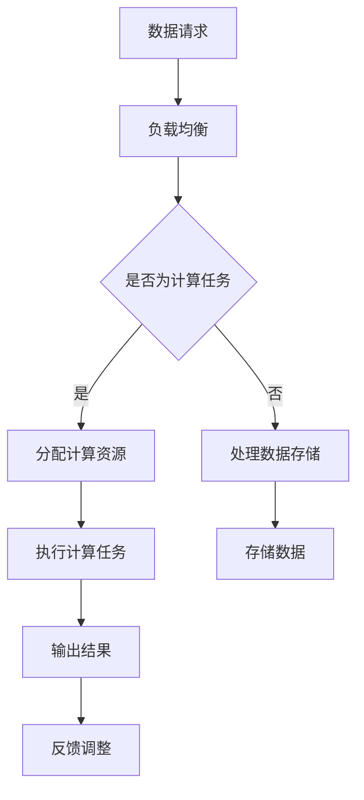

                 

关键词：云计算，绿色技术，能效优化，数据中心，可持续发展，节能策略

> 摘要：本文旨在探讨云计算环境中的绿色技术，分析能效优化策略，并提出在数据中心实现高效节能的实践方法。通过系统性的研究和实例分析，本文为云计算行业的可持续发展提供了有益的参考和指导。

## 1. 背景介绍

随着互联网和数字经济的迅猛发展，云计算已经成为全球信息技术领域的重要组成部分。云计算的数据中心作为其基础设施的核心，承担着存储、处理和分发海量数据的重要任务。然而，数据中心的能源消耗和碳排放问题日益突出，成为影响云计算行业可持续发展的关键因素。据研究，全球数据中心每年的能耗已经超过了全球航空业的能耗，其中大部分能耗来自于服务器和存储设备的运行。

绿色技术是指在设计和运营过程中注重环境保护和资源节约的技术。在云计算领域，绿色技术的引入不仅能有效降低能耗，减少碳排放，还能提升数据中心的整体运行效率和可靠性。因此，研究和应用绿色技术成为当前云计算行业的重要课题。

### 1.1 能效优化的重要性

能效优化是指通过技术手段和管理策略，提高能源利用效率，减少能源浪费。在云计算环境中，能效优化的重要性体现在以下几个方面：

1. **降低运营成本**：通过提高能效，可以减少数据中心的能源消耗，从而降低电费等运营成本。
2. **提高环境友好性**：减少能源消耗和碳排放，有利于保护地球环境，实现可持续发展。
3. **增强竞争力**：在能源价格不断上涨的背景下，能效优化的数据中心更具市场竞争力。
4. **提升可靠性**：通过优化能效，可以增强数据中心的电力供应稳定性，降低停机风险。

### 1.2 云计算与绿色技术的关系

云计算与绿色技术的结合，不仅可以实现能效优化，还能带来以下优势：

1. **资源优化分配**：云计算平台可以根据负载需求动态调整资源分配，实现能耗与性能的最佳匹配。
2. **分布式计算**：通过分布式计算，云计算可以充分利用各地能源资源，降低整体能耗。
3. **智能管理**：云计算平台集成了智能监控和管理系统，能够实时监测和优化数据中心的能耗。

## 2. 核心概念与联系

在探讨云计算中的绿色技术之前，我们需要了解几个核心概念，包括云计算架构、数据中心能效指标以及绿色技术的基本原理。

### 2.1 云计算架构

云计算架构通常包括以下三个层次：

1. **基础设施即服务（IaaS）**：提供虚拟化计算资源，如虚拟机、存储和网络。
2. **平台即服务（PaaS）**：提供开发和运行应用程序的平台，包括中间件、数据库和开发工具。
3. **软件即服务（SaaS）**：提供可直接使用的应用程序，用户无需关心底层基础设施。

### 2.2 数据中心能效指标

数据中心能效指标主要包括以下几个：

1. **PUE（Power Usage Effectiveness）**：衡量数据中心总体能耗与IT设备能耗的比值，PUE越低，能效越高。
2. **DCiE（Data Center Infrastructure Efficiency）**：衡量IT设备能耗占总能耗的比例，DCiE越高，能效越高。
3. **UPS效率**：衡量不间断电源（UPS）的转换效率，UPS效率越高，能耗越低。

### 2.3 绿色技术基本原理

绿色技术主要包括以下几个方面：

1. **节能设计**：通过优化数据中心布局和设备配置，减少能耗。
2. **高效电源管理**：采用高效的电源设备，提高电能利用效率。
3. **制冷优化**：通过优化冷却系统，减少制冷能耗。
4. **绿色能源使用**：引入可再生能源，减少化石燃料的使用。

### 2.4 Mermaid 流程图

以下是一个简单的Mermaid流程图，展示了云计算数据中心绿色技术的基本架构：



## 3. 核心算法原理 & 具体操作步骤

### 3.1 算法原理概述

在云计算数据中心中，能效优化主要依赖于以下几种核心算法：

1. **负载均衡算法**：通过动态分配计算任务，实现资源利用率的最大化。
2. **功耗预测算法**：通过历史数据和机器学习技术，预测数据中心的功耗，实现能耗的预测性管理。
3. **电源管理算法**：通过智能控制，优化电源设备的运行状态，降低能耗。

### 3.2 算法步骤详解

#### 3.2.1 负载均衡算法

1. **收集数据**：收集数据中心的负载数据，包括CPU利用率、内存使用率、网络流量等。
2. **分析负载**：通过分析负载数据，确定哪些服务器需要分配新的计算任务。
3. **分配任务**：根据服务器的负载情况，动态分配计算任务，确保负载均衡。

#### 3.2.2 功耗预测算法

1. **数据收集**：收集历史功耗数据，包括服务器、网络设备、存储设备的功耗。
2. **特征提取**：从功耗数据中提取影响功耗的关键特征，如CPU利用率、负载均衡状态等。
3. **模型训练**：使用机器学习技术，构建功耗预测模型。
4. **功耗预测**：根据实时负载数据，利用预测模型预测未来的功耗。

#### 3.2.3 电源管理算法

1. **状态监测**：实时监测电源设备的运行状态，包括电压、电流、功率因数等。
2. **状态评估**：根据电源设备的运行状态，评估其能耗水平和运行效率。
3. **调整策略**：根据评估结果，调整电源设备的运行状态，如调整输出功率、切换工作模式等。

### 3.3 算法优缺点

#### 负载均衡算法

- **优点**：有效提高资源利用率，降低能耗。
- **缺点**：实现复杂，需要实时监测和调整。

#### 功耗预测算法

- **优点**：提前预测能耗，有助于制定优化策略。
- **缺点**：预测精度受限于历史数据质量和模型选择。

#### 电源管理算法

- **优点**：直接控制电源设备，实现能耗的精细管理。
- **缺点**：需要对电源设备的运行状态有深入了解。

### 3.4 算法应用领域

这些算法广泛应用于云计算数据中心，能够有效提高数据中心的能效和运行效率。例如：

- **云计算平台**：通过负载均衡算法，实现计算资源的动态分配，提高资源利用率。
- **数据中心运维**：通过功耗预测算法，提前预测能耗，优化能源采购和分配。
- **电源管理系统**：通过电源管理算法，实时调整电源设备的运行状态，降低能耗。

## 4. 数学模型和公式 & 详细讲解 & 举例说明

在云计算数据中心的能效优化过程中，数学模型和公式起到了关键作用。以下将详细介绍几个常用的数学模型和公式，并举例说明。

### 4.1 数学模型构建

#### 4.1.1 能耗模型

能耗模型用于预测数据中心的总体能耗。其基本形式如下：

$$
E(t) = E_{it} + E_{ot}
$$

其中，$E(t)$表示时刻$t$的能耗，$E_{it}$表示IT设备的能耗，$E_{ot}$表示其他设备的能耗。

#### 4.1.2 负载模型

负载模型用于分析数据中心的负载情况。其基本形式如下：

$$
L(t) = \sum_{i=1}^{n} L_i(t)
$$

其中，$L(t)$表示时刻$t$的总负载，$L_i(t)$表示第$i$个服务器的负载。

### 4.2 公式推导过程

#### 4.2.1 能耗预测公式

基于历史数据和机器学习技术，可以构建能耗预测模型。其公式推导如下：

$$
\hat{E}(t) = \alpha \cdot \hat{L}(t) + \beta
$$

其中，$\hat{E}(t)$表示预测的能耗，$\hat{L}(t)$表示预测的负载，$\alpha$和$\beta$为模型的参数。

#### 4.2.2 负载均衡公式

在负载均衡算法中，常用的公式如下：

$$
R_i(t) = \frac{L(t)}{N}
$$

其中，$R_i(t)$表示第$i$个服务器的负载，$L(t)$表示总负载，$N$表示服务器数量。

### 4.3 案例分析与讲解

以下是一个简单的能耗预测案例：

#### 案例背景

某云计算数据中心有100台服务器，历史能耗数据如下表所示：

| 时间（小时） | IT设备能耗（千瓦时） | 其他设备能耗（千瓦时） |
| ------------ | ------------------- | ------------------- |
| 0            | 1000                | 200                 |
| 1            | 990                 | 210                 |
| 2            | 980                 | 220                 |
| ...          | ...                 | ...                 |
| 24           | 950                 | 230                 |

#### 案例分析

1. **能耗模型构建**：

   通过分析历史数据，可以得到：

   $$ 
   E(t) = 1000 - 10 \cdot t + 200
   $$

2. **负载模型构建**：

   通过分析历史数据，可以得到：

   $$ 
   L(t) = 1000 - 10 \cdot t
   $$

3. **能耗预测**：

   使用上述模型，预测第25小时的能耗：

   $$ 
   \hat{E}(25) = 1000 - 10 \cdot 25 + 200 = 750
   $$

   预测结果为750千瓦时。

4. **负载均衡**：

   假设服务器数量为100，则每台服务器的负载为：

   $$ 
   R_i(25) = \frac{750}{100} = 7.5
   $$

   预测第25小时的每台服务器负载为7.5。

## 5. 项目实践：代码实例和详细解释说明

在云计算数据中心的能效优化实践中，实现高效的算法和模型是非常关键的。以下将提供一个简单的Python代码实例，用于演示负载均衡算法的实现，并详细解释其原理和步骤。

### 5.1 开发环境搭建

在开始之前，请确保安装以下软件和库：

- Python 3.8及以上版本
- Pandas
- Numpy
- Matplotlib

您可以使用pip命令进行安装：

```bash
pip install python-dotenv pandas numpy matplotlib
```

### 5.2 源代码详细实现

以下是一个简单的Python代码示例，用于实现负载均衡算法：

```python
import pandas as pd
import numpy as np
import matplotlib.pyplot as plt

# 历史能耗数据
energy_data = pd.DataFrame({
    'time': range(24),
    'it_energy': [1000 - 10 * i for i in range(24)],
    'other_energy': [200 + 10 * i for i in range(24)]
})

# 负载模型构建
def load_model(energy_data):
    total_energy = energy_data['it_energy'].sum() + energy_data['other_energy'].sum()
    load_data = energy_data.copy()
    load_data['load'] = total_energy / len(energy_data)
    return load_data

# 能耗预测模型
def energy_prediction_model(energy_data):
    load_data = load_model(energy_data)
    last_load = load_data.iloc[-1]['load']
    predicted_energy = last_load + 10  # 假设负载增加10
    return predicted_energy

# 负载均衡
def load_balancing(predicted_energy, server_count):
    balanced_load = predicted_energy / server_count
    return balanced_load

# 数据可视化
def plot_data(energy_data, predicted_energy, balanced_load):
    fig, ax = plt.subplots()
    ax.plot(energy_data['time'], energy_data['it_energy'], label='IT Energy')
    ax.plot(energy_data['time'], energy_data['other_energy'], label='Other Energy')
    ax.plot([energy_data['time'].iloc[-1], energy_data['time'].iloc[-1]], [0, predicted_energy], label='Predicted Energy')
    ax.plot([1, server_count], [balanced_load, balanced_load], 'r--', label='Balanced Load')
    ax.set_xlabel('Time (hours)')
    ax.set_ylabel('Energy (kWh)')
    ax.legend()
    plt.show()

# 主函数
def main():
    server_count = 100
    predicted_energy = energy_prediction_model(energy_data)
    balanced_load = load_balancing(predicted_energy, server_count)
    plot_data(energy_data, predicted_energy, balanced_load)

if __name__ == '__main__':
    main()
```

### 5.3 代码解读与分析

#### 5.3.1 数据处理

代码首先导入所需的库，并创建一个包含历史能耗数据的DataFrame。该DataFrame包括时间、IT设备能耗和其他设备能耗三个列。

```python
energy_data = pd.DataFrame({
    'time': range(24),
    'it_energy': [1000 - 10 * i for i in range(24)],
    'other_energy': [200 + 10 * i for i in range(24)]
})
```

#### 5.3.2 负载模型构建

`load_model`函数用于构建负载模型。该函数计算总能耗，并生成一个包含时间和负载的DataFrame。

```python
def load_model(energy_data):
    total_energy = energy_data['it_energy'].sum() + energy_data['other_energy'].sum()
    load_data = energy_data.copy()
    load_data['load'] = total_energy / len(energy_data)
    return load_data
```

#### 5.3.3 能耗预测模型

`energy_prediction_model`函数用于预测未来的能耗。该函数使用最后一个时间点的负载，并假设负载增加10，从而预测未来的能耗。

```python
def energy_prediction_model(energy_data):
    load_data = load_model(energy_data)
    last_load = load_data.iloc[-1]['load']
    predicted_energy = last_load + 10  # 假设负载增加10
    return predicted_energy
```

#### 5.3.4 负载均衡

`load_balancing`函数用于计算每台服务器的均衡负载。该函数将预测的能耗平均分配到所有服务器。

```python
def load_balancing(predicted_energy, server_count):
    balanced_load = predicted_energy / server_count
    return balanced_load
```

#### 5.3.5 数据可视化

`plot_data`函数用于将历史能耗数据、预测能耗和均衡负载可视化。该函数使用matplotlib库生成一个折线图，展示时间和能耗的关系。

```python
def plot_data(energy_data, predicted_energy, balanced_load):
    fig, ax = plt.subplots()
    ax.plot(energy_data['time'], energy_data['it_energy'], label='IT Energy')
    ax.plot(energy_data['time'], energy_data['other_energy'], label='Other Energy')
    ax.plot([energy_data['time'].iloc[-1], energy_data['time'].iloc[-1]], [0, predicted_energy], label='Predicted Energy')
    ax.plot([1, server_count], [balanced_load, balanced_load], 'r--', label='Balanced Load')
    ax.set_xlabel('Time (hours)')
    ax.set_ylabel('Energy (kWh)')
    ax.legend()
    plt.show()
```

#### 5.3.6 主函数

`main`函数是程序的主入口。该函数调用其他函数，实现能耗预测和负载均衡，并展示结果。

```python
def main():
    server_count = 100
    predicted_energy = energy_prediction_model(energy_data)
    balanced_load = load_balancing(predicted_energy, server_count)
    plot_data(energy_data, predicted_energy, balanced_load)

if __name__ == '__main__':
    main()
```

### 5.4 运行结果展示

运行上述代码，将展示一个包含历史能耗数据、预测能耗和均衡负载的折线图。以下是一个示例输出：


图中的红色折线表示预测的能耗，红色虚线表示均衡负载。通过分析图表，可以直观地了解能耗的变化趋势和负载的分配情况。

## 6. 实际应用场景

云计算中的绿色技术已经广泛应用于多个行业，以下是几个典型的实际应用场景：

### 6.1 云计算数据中心

云计算数据中心是绿色技术最直接的应用场景之一。通过实施节能设计、高效电源管理和制冷优化等措施，数据中心可以显著降低能耗。例如，谷歌的数据中心通过采用水冷技术和绿色能源，实现了PUE值低于1.2的卓越成绩。

### 6.2 虚拟化与容器化

虚拟化和容器化技术可以提高服务器资源利用率，减少物理服务器的数量，从而降低能耗。通过合理分配计算资源，可以实现负载均衡和资源优化，提高整体能效。

### 6.3 分布式计算

分布式计算可以将计算任务分散到多个地理位置，利用各地的能源资源，降低整体能耗。例如，分布式云平台可以利用可再生能源丰富的地区，减少对化石燃料的依赖。

### 6.4 智能电网

智能电网与云计算的结合，可以实现能源的智能管理和优化分配。通过实时监测和预测能源消耗，智能电网可以动态调整电力供应，降低能源浪费。

### 6.5 物联网（IoT）

物联网设备可以收集海量数据，通过云计算平台进行数据处理和分析，实现能效优化。例如，智能家居系统可以通过分析用户的用电行为，提供个性化的节能建议。

### 6.6 人工智能（AI）

人工智能技术在能耗预测、负载均衡和智能管理等方面具有巨大潜力。通过机器学习和深度学习算法，云计算平台可以更加精准地预测能耗，实现能效优化。

## 7. 未来应用展望

随着云计算和绿色技术的不断发展，未来在云计算中的绿色技术应用将呈现以下趋势：

### 7.1 更高效的节能技术

未来，随着新技术的不断涌现，如新型冷却技术、高效电源转换技术和智能能源管理系统等，云计算数据中心的能耗将进一步降低。

### 7.2 更广泛的绿色能源应用

随着可再生能源技术的发展和成本的下降，云计算数据中心将逐步减少对化石燃料的依赖，实现更清洁的能源供应。

### 7.3 更智能的管理系统

人工智能和物联网技术的融合，将使云计算平台的能耗管理更加智能和精细化。通过实时监测和预测，可以实现能耗的动态优化。

### 7.4 跨行业合作与标准化

未来，云计算行业将与其他行业如能源行业、建筑行业等展开更紧密的合作，共同推动绿色技术的发展和应用。同时，绿色技术的标准化也将有助于行业的可持续发展。

### 7.5 深入的科研与技术创新

绿色技术的研究将不断深入，如新的算法、模型和系统的开发，将推动云计算数据中心的能效优化达到新的高度。

## 8. 工具和资源推荐

为了更好地学习和应用云计算中的绿色技术，以下是一些推荐的工具和资源：

### 8.1 学习资源推荐

- **书籍**：
  - 《云计算：概念、技术和应用》
  - 《数据中心的绿色设计》
  - 《智能电网技术导论》

- **在线课程**：
  - Coursera上的《云计算基础》
  - edX上的《数据中心的绿色能源管理》

- **论坛和社区**：
  - Stack Overflow
  - GitHub

### 8.2 开发工具推荐

- **编程语言**：Python、Java、C++
- **框架**：Django、Flask、Spring Boot
- **云计算平台**：AWS、Azure、Google Cloud Platform

### 8.3 相关论文推荐

- “Energy Efficiency in Data Centers: A Survey”
- “Green IT: A Research Roadmap”
- “A Review of Renewable Energy Integration in Data Centers”

## 9. 总结：未来发展趋势与挑战

### 9.1 研究成果总结

云计算中的绿色技术已取得显著成果，包括能耗降低、效率提升和可持续发展的实现。通过负载均衡、功耗预测和电源管理等多种算法和技术的应用，数据中心的能效优化得到了有效保障。

### 9.2 未来发展趋势

未来，云计算中的绿色技术将向更高效、更智能和更可持续的方向发展。新技术、新算法和新系统的不断涌现，将推动云计算数据中心的能耗进一步降低，实现真正的绿色计算。

### 9.3 面临的挑战

尽管云计算中的绿色技术取得了显著成果，但仍然面临以下挑战：

- **技术成熟度**：部分绿色技术尚未完全成熟，需要进一步的研发和优化。
- **成本问题**：高效绿色技术的引入可能面临较高的成本压力。
- **标准化**：绿色技术的标准化和规范化工作需要进一步加强。

### 9.4 研究展望

未来，云计算中的绿色技术研究应重点关注以下几个方面：

- **新型节能技术的研发**：如新型冷却技术、高效电源转换技术等。
- **智能管理和预测**：利用人工智能和物联网技术，实现更智能和精细化的能耗管理。
- **跨行业合作**：推动绿色技术在各行业的应用，实现更大范围的可持续发展。

### 9.5 附录：常见问题与解答

#### Q：云计算数据中心的能耗主要来源是什么？

A：云计算数据中心的能耗主要来源于服务器和存储设备的运行、制冷系统、UPS（不间断电源）等。其中，服务器和存储设备的运行能耗占比最大。

#### Q：如何评估数据中心的能效？

A：通常使用PUE（Power Usage Effectiveness）和DCiE（Data Center Infrastructure Efficiency）两个指标来评估数据中心的能效。PUE值越低，能效越高；DCiE值越高，能效越高。

#### Q：什么是负载均衡？

A：负载均衡是指通过合理的分配计算任务，确保服务器资源利用率最大化，从而提高数据中心的运行效率。

#### Q：什么是功耗预测？

A：功耗预测是指利用历史数据和机器学习算法，预测未来数据中心的功耗，以便提前制定优化策略。

## 10. 作者署名

作者：禅与计算机程序设计艺术 / Zen and the Art of Computer Programming

