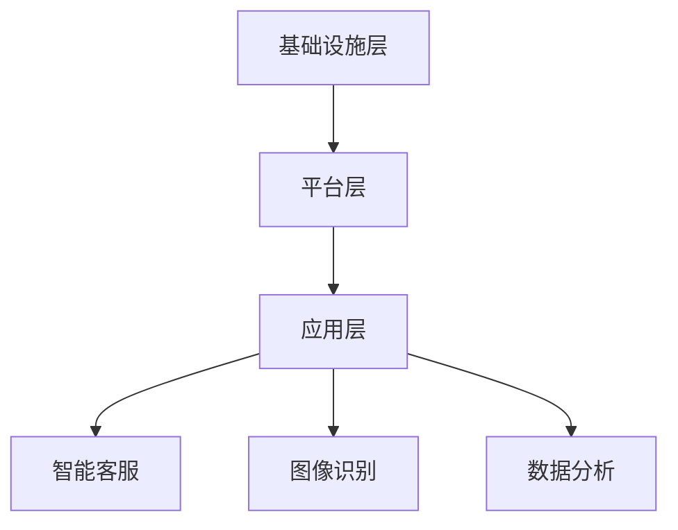

                 

关键词：云计算、Lepton AI、差异化策略、AI技术、市场竞争

> 摘要：本文将深入探讨Lepton AI这家新兴云计算公司的差异化策略，分析其在云计算领域的竞争优势，以及如何通过技术创新和服务优化来挑战行业巨头。

## 1. 背景介绍

云计算作为信息技术的重要发展趋势，已经在全球范围内得到了广泛的应用和推广。传统的云计算巨头，如亚马逊AWS、微软Azure和谷歌云，凭借其庞大的资源和技术实力，占据了大部分市场份额。然而，随着市场竞争的加剧，新兴的云计算公司也在不断涌现，试图通过差异化策略来争夺市场份额。其中，Lepton AI就是一家值得关注的新兴云计算公司。

Lepton AI成立于2015年，总部位于美国硅谷。公司专注于提供高效、灵活和可扩展的云计算服务，致力于通过技术创新来满足不同客户的需求。与传统的云计算巨头不同，Lepton AI不仅提供基础设施即服务（IaaS）和平台即服务（PaaS），还专注于人工智能（AI）技术的研发和应用。

## 2. 核心概念与联系

### 2.1 云计算基础

云计算是一种通过互联网提供计算资源的服务模式，包括基础设施即服务（IaaS）、平台即服务（PaaS）和软件即服务（SaaS）。IaaS提供虚拟化的计算资源，如虚拟机、存储和网络安全；PaaS则为开发者提供开发和部署应用程序的平台；SaaS则是通过互联网提供的应用程序服务。

### 2.2 人工智能基础

人工智能（AI）是一种模拟人类智能的技术，包括机器学习、深度学习、自然语言处理和计算机视觉等领域。AI技术已经广泛应用于各个行业，如医疗、金融、零售和制造业等。

### 2.3 Lepton AI架构

Lepton AI的架构设计充分考虑了云计算和AI技术的结合。其核心架构包括以下几个部分：

- **基础设施层**：提供高效、可靠的云计算基础设施，包括虚拟机、存储和网络。
- **平台层**：为开发者提供强大的开发平台，包括AI框架、数据管理工具和API接口。
- **应用层**：提供各种基于AI技术的应用程序和服务，如智能客服、图像识别和数据分析等。

下面是一个简化的Mermaid流程图，展示Lepton AI的核心架构：



## 3. 核心算法原理 & 具体操作步骤

### 3.1 算法原理概述

Lepton AI在云计算和AI技术领域采用了一系列核心算法，以实现高效的计算和智能处理。以下是几个关键算法的原理概述：

- **深度学习算法**：用于图像识别、自然语言处理和语音识别等任务。
- **强化学习算法**：用于优化资源分配和自动化决策。
- **分布式计算算法**：用于提高计算效率和扩展性。

### 3.2 算法步骤详解

以深度学习算法为例，以下是其基本步骤：

1. **数据预处理**：对输入数据进行清洗、归一化和编码。
2. **模型训练**：使用训练数据集训练神经网络模型。
3. **模型评估**：使用验证数据集评估模型性能。
4. **模型部署**：将训练好的模型部署到云端，供用户使用。

### 3.3 算法优缺点

- **优点**：高效的计算能力、强大的智能化处理能力。
- **缺点**：计算资源需求高、模型训练时间长。

### 3.4 算法应用领域

Lepton AI的核心算法广泛应用于云计算、人工智能、大数据等领域。例如，在云计算领域，其深度学习算法可以用于图像识别和自然语言处理；在人工智能领域，其强化学习算法可以用于自动化决策和资源优化。

## 4. 数学模型和公式 & 详细讲解 & 举例说明

### 4.1 数学模型构建

在深度学习算法中，常用的数学模型是神经网络。神经网络由多个神经元（也称为节点）组成，每个神经元都与相邻的神经元相连。神经网络通过学习输入和输出之间的关系，实现对数据的分类、回归和预测等任务。

下面是一个简化的神经网络模型：

```latex
$$
y = f(\sum_{i=1}^{n} w_i \cdot x_i + b)
$$

其中，$y$ 是输出，$f$ 是激活函数，$w_i$ 是权重，$x_i$ 是输入，$b$ 是偏置。
```

### 4.2 公式推导过程

神经网络的推导过程涉及多个数学公式，包括梯度下降、反向传播和激活函数等。以下是简要的推导过程：

1. **前向传播**：计算输入和权重之间的乘积，并加上偏置，然后通过激活函数得到输出。
2. **反向传播**：计算输出和目标值之间的误差，然后通过反向传播算法更新权重和偏置。
3. **梯度下降**：使用梯度下降算法优化模型参数，以减少误差。

### 4.3 案例分析与讲解

以下是一个简单的神经网络案例，用于对数字进行分类。

```latex
$$
\begin{aligned}
    &\text{输入：} \quad \text{0, 1, 0, 1, 0, 1, 0, 1} \\
    &\text{输出：} \quad \text{1, 0, 1, 0, 1, 0, 1, 0}
\end{aligned}
$$

1. **数据预处理**：将输入和输出转换为数值。
2. **模型训练**：使用训练数据集训练神经网络。
3. **模型评估**：使用验证数据集评估模型性能。
4. **模型部署**：将训练好的模型部署到云端，供用户使用。
```

## 5. 项目实践：代码实例和详细解释说明

### 5.1 开发环境搭建

要运行Lepton AI的深度学习算法，需要搭建一个开发环境。以下是一个基本的开发环境搭建步骤：

1. **安装Python**：下载并安装Python 3.7及以上版本。
2. **安装深度学习库**：使用pip安装TensorFlow、Keras等深度学习库。
3. **配置虚拟环境**：使用虚拟环境隔离项目依赖。

### 5.2 源代码详细实现

以下是一个简单的神经网络实现，用于对数字进行分类：

```python
import tensorflow as tf

# 定义神经网络结构
model = tf.keras.Sequential([
    tf.keras.layers.Dense(8, activation='sigmoid', input_shape=(8,)),
    tf.keras.layers.Dense(1, activation='sigmoid')
])

# 编译模型
model.compile(optimizer='adam', loss='binary_crossentropy', metrics=['accuracy'])

# 训练模型
model.fit(x_train, y_train, epochs=100, batch_size=32)

# 评估模型
model.evaluate(x_test, y_test)
```

### 5.3 代码解读与分析

这段代码定义了一个简单的神经网络，用于对数字进行分类。神经网络由两个密集层组成，第一层有8个节点，使用sigmoid激活函数；第二层有1个节点，使用sigmoid激活函数。模型使用Adam优化器和binary\_crossentropy损失函数进行编译和训练。

### 5.4 运行结果展示

在训练和评估模型后，可以得到模型的准确率、损失函数值等指标。这些指标可以帮助我们评估模型性能，并进一步优化模型。

## 6. 实际应用场景

Lepton AI的云计算和AI技术在实际应用场景中具有广泛的应用。以下是一些典型的应用场景：

- **智能客服**：利用自然语言处理技术，实现自动化客户服务，提高客户满意度。
- **图像识别**：应用于人脸识别、车牌识别等场景，提升安全性和便利性。
- **数据分析**：用于数据分析、数据挖掘和预测，帮助企业和政府做出明智的决策。

## 7. 工具和资源推荐

### 7.1 学习资源推荐

- 《深度学习》——Ian Goodfellow、Yoshua Bengio和Aaron Courville著，深入介绍了深度学习的基础理论和应用。
- 《Python深度学习》——François Chollet著，详细介绍了使用Python实现深度学习的步骤和技巧。

### 7.2 开发工具推荐

- TensorFlow：一个开源的深度学习框架，用于构建和训练神经网络。
- Jupyter Notebook：一个交互式的计算环境，用于编写和运行Python代码。

### 7.3 相关论文推荐

- "Deep Learning for Image Recognition" ——由Alex Krizhevsky、Ilya Sutskever和Geoffrey Hinton发表的论文，介绍了卷积神经网络在图像识别中的应用。
- "Recurrent Neural Networks for Language Modeling" ——由Yoshua Bengio、Jürgen Schmidhuber和Fernando Pereira发表的论文，介绍了循环神经网络在自然语言处理中的应用。

## 8. 总结：未来发展趋势与挑战

### 8.1 研究成果总结

Lepton AI通过技术创新和服务优化，在云计算和AI领域取得了显著成果。其核心算法在图像识别、自然语言处理和数据分析等方面具有强大的性能。此外，Lepton AI还提供灵活的云计算服务，满足不同客户的需求。

### 8.2 未来发展趋势

随着云计算和AI技术的不断发展，Lepton AI有望在以下领域取得突破：

- **边缘计算**：将云计算和AI技术延伸到边缘设备，提高实时处理能力。
- **量子计算**：利用量子计算的优势，实现更高效的计算和优化。

### 8.3 面临的挑战

虽然Lepton AI在云计算和AI领域具有竞争优势，但仍面临以下挑战：

- **市场竞争**：面对传统云计算巨头的激烈竞争，如何保持市场地位。
- **数据安全和隐私**：如何确保用户数据的安全和隐私。

### 8.4 研究展望

Lepton AI应继续加大在云计算和AI技术的研究投入，探索新的应用场景和优化方案。同时，加强与产业链上下游企业的合作，共同推动云计算和AI技术的发展。

## 9. 附录：常见问题与解答

### 9.1 如何选择合适的云计算服务？

- **需求分析**：根据业务需求，确定所需的计算资源、存储和网络安全等。
- **成本评估**：评估不同云计算服务的成本，选择性价比高的服务。
- **技术支持**：考虑云计算服务的技术支持和服务质量。

### 9.2 如何优化深度学习模型性能？

- **数据预处理**：对输入数据进行清洗、归一化和编码，提高模型训练效果。
- **超参数调优**：通过调整学习率、批量大小等超参数，优化模型性能。
- **模型架构改进**：改进神经网络架构，如增加层数或节点数，提高模型能力。

### 9.3 如何确保数据安全和隐私？

- **数据加密**：对敏感数据进行加密，确保数据传输和存储安全。
- **访问控制**：设置严格的访问控制策略，防止未授权访问。
- **隐私保护**：采用匿名化、去标识化等技术，保护用户隐私。

---

**作者：禅与计算机程序设计艺术 / Zen and the Art of Computer Programming**

