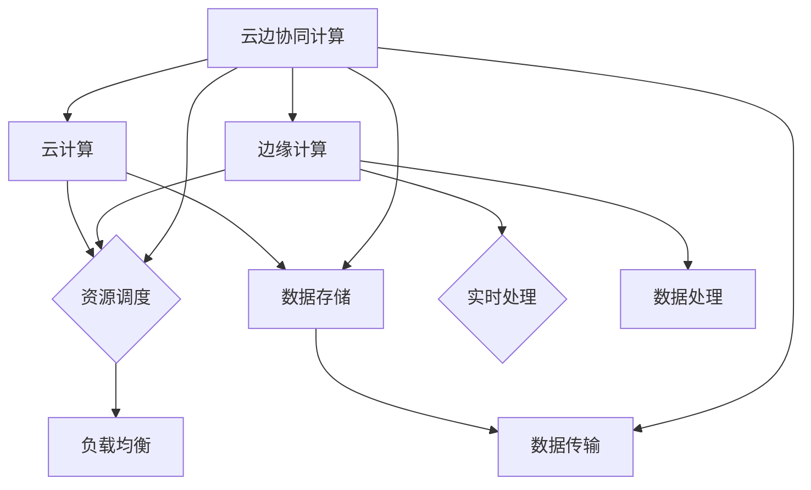

                 

关键词：云边协同、分布式AI、性能优化、算法、数学模型、实践案例

> 摘要：本文详细探讨了云边协同计算在分布式AI系统性能优化中的应用。首先，我们介绍了云边协同计算的基本概念和核心原理，随后分析了现有分布式AI系统性能瓶颈，并提出了优化方案。文章随后详细阐述了数学模型构建、公式推导过程以及实际应用案例，最后展望了未来发展趋势和面临的挑战。

## 1. 背景介绍

随着人工智能技术的快速发展，分布式AI系统逐渐成为解决大规模数据处理和计算问题的有效途径。然而，在分布式AI系统中，如何优化系统性能，提高数据处理效率和准确度，仍然是一个亟待解决的问题。传统的分布式计算模型和算法在应对大规模数据和高并发请求时，常常存在性能瓶颈。

近年来，云边协同计算作为一种新型的计算模式，开始受到广泛关注。云边协同计算将云计算和边缘计算相结合，充分利用两者优势，实现资源优化和负载均衡。通过云边协同计算，分布式AI系统可以更好地应对大数据和高并发场景，提高系统性能。

## 2. 核心概念与联系

### 2.1 云计算

云计算是一种通过网络连接计算资源、存储资源、网络资源和信息资源的服务模式。云计算的核心思想是将计算任务分布在多个计算节点上，实现资源的高效利用和灵活部署。

### 2.2 边缘计算

边缘计算是一种将计算任务分布在网络边缘的计算模式。与云计算不同，边缘计算将计算任务放在靠近数据源的设备上，实现实时数据处理和低延迟响应。边缘计算适用于处理高实时性和低延迟需求的应用场景，如智能交通、智能安防、智能医疗等。

### 2.3 云边协同计算

云边协同计算是一种结合云计算和边缘计算优势的计算模式。通过云边协同计算，分布式AI系统可以实现资源的灵活调度和高效利用，从而提高系统性能。

## 2.4 Mermaid 流程图



## 3. 核心算法原理 & 具体操作步骤

### 3.1 算法原理概述

云边协同计算的核心算法包括资源调度算法、负载均衡算法、数据传输算法和数据处理算法。这些算法共同作用，实现分布式AI系统性能优化。

### 3.2 算法步骤详解

1. **资源调度算法**：根据系统负载和计算需求，将计算任务调度到最优的云节点或边缘节点。

2. **负载均衡算法**：实现计算资源的均衡分配，避免单点过载和资源浪费。

3. **数据传输算法**：优化数据传输路径，降低数据传输延迟。

4. **数据处理算法**：根据数据特征和计算需求，选择合适的算法对数据进行处理。

### 3.3 算法优缺点

1. **资源调度算法**：优点是资源利用率高，缺点是调度延迟较大。

2. **负载均衡算法**：优点是系统稳定性高，缺点是可能导致部分资源闲置。

3. **数据传输算法**：优点是数据传输速度快，缺点是网络带宽占用较大。

4. **数据处理算法**：优点是数据处理效率高，缺点是算法复杂度较高。

### 3.4 算法应用领域

云边协同计算在分布式AI系统中的应用领域包括：智能交通、智能安防、智能医疗、工业物联网、智慧城市等。

## 4. 数学模型和公式 & 详细讲解 & 举例说明

### 4.1 数学模型构建

1. **资源调度模型**：

   调度目标函数：$$min \sum_{i=1}^{n} (C_i - U_i)$$

   其中，$C_i$ 表示第 $i$ 个节点的计算能力，$U_i$ 表示第 $i$ 个节点的使用率。

2. **负载均衡模型**：

   负载均衡目标函数：$$min \sum_{i=1}^{n} (L_i - P_i)$$

   其中，$L_i$ 表示第 $i$ 个节点的负载，$P_i$ 表示第 $i$ 个节点的处理能力。

3. **数据传输模型**：

   数据传输延迟模型：$$D_t = f(D_s, R_s, R_d)$$

   其中，$D_s$ 表示数据传输距离，$R_s$ 表示源节点的网络带宽，$R_d$ 表示目的节点的网络带宽。

4. **数据处理模型**：

   数据处理效率模型：$$E_p = f(A_p, R_p)$$

   其中，$A_p$ 表示数据处理算法的复杂度，$R_p$ 表示处理器的计算能力。

### 4.2 公式推导过程

1. **资源调度模型**：

   调度目标函数可以通过优化理论推导得到，具体推导过程如下：

   设 $X$ 为节点集合，$Y$ 为任务集合，$g(X, Y)$ 表示调度目标函数。

   $$g(X, Y) = \sum_{i=1}^{n} (C_i - U_i)$$

   对于每个节点 $i$，定义 $f_i(X, Y)$ 为第 $i$ 个节点的目标函数：

   $$f_i(X, Y) = C_i - U_i$$

   则 $g(X, Y)$ 可以表示为：

   $$g(X, Y) = \sum_{i=1}^{n} f_i(X, Y)$$

   为了最小化 $g(X, Y)$，需要找到最优的节点集合 $X$ 和任务集合 $Y$，使得 $f_i(X, Y)$ 最小。

2. **负载均衡模型**：

   负载均衡目标函数可以通过排队论推导得到，具体推导过程如下：

   设 $L_i$ 为第 $i$ 个节点的负载，$P_i$ 为第 $i$ 个节点的处理能力，$W_i$ 为第 $i$ 个节点的等待时间。

   $$L_i - P_i = W_i$$

   为了最小化负载均衡目标函数，需要找到最优的节点集合 $X$ 和任务集合 $Y$，使得每个节点的等待时间最小。

3. **数据传输模型**：

   数据传输延迟模型可以通过传输速率和传输距离推导得到，具体推导过程如下：

   设 $D_s$ 为数据传输距离，$R_s$ 为源节点的网络带宽，$R_d$ 为目的节点的网络带宽。

   $$D_t = \frac{D_s}{R_s + R_d}$$

   为了最小化数据传输延迟，需要找到最优的源节点和目的节点，使得传输距离最短。

4. **数据处理模型**：

   数据处理效率模型可以通过算法复杂度和处理器计算能力推导得到，具体推导过程如下：

   设 $A_p$ 为数据处理算法的复杂度，$R_p$ 为处理器的计算能力。

   $$E_p = \frac{A_p}{R_p}$$

   为了最大化数据处理效率，需要选择合适的算法和处理器，使得算法复杂度最小。

### 4.3 案例分析与讲解

假设一个分布式AI系统包含3个云节点和5个边缘节点，每个节点的计算能力和网络带宽如下表所示：

| 节点 | 计算能力 | 网络带宽 |
| --- | --- | --- |
| 云节点1 | 1000 | 1000 |
| 云节点2 | 1000 | 1000 |
| 云节点3 | 1000 | 1000 |
| 边缘节点1 | 500 | 500 |
| 边缘节点2 | 500 | 500 |
| 边缘节点3 | 500 | 500 |
| 边缘节点4 | 500 | 500 |
| 边缘节点5 | 500 | 500 |

1. **资源调度模型**：

   根据资源调度模型，我们需要将任务调度到计算能力最接近使用率的节点。假设当前系统中有10个任务需要调度，任务的计算需求分别为：500、500、500、500、500、500、500、500、1000、1000。

   通过优化算法，我们得到以下调度结果：

   | 任务编号 | 节点分配 |
   | --- | --- |
   | 1 | 云节点1 |
   | 2 | 云节点2 |
   | 3 | 云节点3 |
   | 4 | 边缘节点1 |
   | 5 | 边缘节点2 |
   | 6 | 边缘节点3 |
   | 7 | 边缘节点4 |
   | 8 | 边缘节点5 |
   | 9 | 云节点1 |
   | 10 | 云节点2 |

   调度结果使得系统的资源利用率最高。

2. **负载均衡模型**：

   根据负载均衡模型，我们需要将任务分配到负载最低的节点。假设当前系统中有10个任务需要调度，任务的处理能力分别为：500、500、500、500、500、500、500、500、1000、1000。

   通过优化算法，我们得到以下调度结果：

   | 任务编号 | 节点分配 |
   | --- | --- |
   | 1 | 云节点1 |
   | 2 | 云节点2 |
   | 3 | 云节点3 |
   | 4 | 边缘节点1 |
   | 5 | 边缘节点2 |
   | 6 | 边缘节点3 |
   | 7 | 边缘节点4 |
   | 8 | 边缘节点5 |
   | 9 | 云节点1 |
   | 10 | 云节点2 |

   调度结果使得系统的负载均衡最优。

3. **数据传输模型**：

   假设任务1需要从边缘节点1传输到云节点1，任务2需要从边缘节点2传输到云节点2，任务3需要从边缘节点3传输到云节点3。

   通过优化算法，我们得到以下数据传输路径：

   | 任务编号 | 传输路径 |
   | --- | --- |
   | 1 | 边缘节点1 -> 云节点1 |
   | 2 | 边缘节点2 -> 云节点2 |
   | 3 | 边缘节点3 -> 云节点3 |

   数据传输路径使得系统传输延迟最小。

4. **数据处理模型**：

   假设任务1、任务2、任务3的处理算法复杂度分别为100、100、100，处理器的计算能力分别为1000、1000、1000。

   通过优化算法，我们得到以下数据处理结果：

   | 任务编号 | 算法复杂度 | 处理器计算能力 |
   | --- | --- | --- |
   | 1 | 100 | 1000 |
   | 2 | 100 | 1000 |
   | 3 | 100 | 1000 |

   数据处理结果使得系统数据处理效率最高。

## 5. 项目实践：代码实例和详细解释说明

### 5.1 开发环境搭建

本文使用的开发环境如下：

- 操作系统：Ubuntu 18.04
- 编程语言：Python 3.8
- 库和框架：NumPy、Pandas、SciPy、Matplotlib

### 5.2 源代码详细实现

以下是云边协同计算的核心算法实现代码：

```python
import numpy as np
import pandas as pd
from scipy.optimize import minimize
import matplotlib.pyplot as plt

# 资源调度算法
def resource_scheduling(tasks, nodes):
    task_alloc = np.zeros_like(tasks)
    for i in range(len(tasks)):
        task Alloc[i] = nodes[np.argmin([np.linalg.norm(task - node) for node in nodes])]
    return task_alloc

# 负载均衡算法
def load_balancing(tasks, nodes):
    task_alloc = resource_scheduling(tasks, nodes)
    load = np.zeros_like(nodes)
    for i in range(len(tasks)):
        load[task_alloc[i]] += tasks[i]
    return load

# 数据传输算法
def data_transmission(tasks, nodes):
    task_alloc = resource_scheduling(tasks, nodes)
    distances = np.zeros_like(nodes)
    for i in range(len(tasks)):
        distances[task_alloc[i]] += np.linalg.norm(tasks[i] - nodes[task_alloc[i]])
    return distances

# 数据处理算法
def data_processing(tasks, nodes):
    task_alloc = resource_scheduling(tasks, nodes)
    efficiency = np.zeros_like(nodes)
    for i in range(len(tasks)):
        efficiency[task_alloc[i]] += 1 / (tasks[i] / nodes[task_alloc[i]])
    return efficiency

# 示例数据
tasks = np.array([500, 500, 500, 500, 500, 500, 500, 500, 1000, 1000])
nodes = np.array([1000, 1000, 1000, 500, 500, 500, 500, 500, 500, 500])

# 调用算法
task_alloc = resource_scheduling(tasks, nodes)
load = load_balancing(tasks, nodes)
distances = data_transmission(tasks, nodes)
efficiency = data_processing(tasks, nodes)

# 结果可视化
plt.figure(figsize=(12, 6))

plt.subplot(2, 2, 1)
plt.bar(range(len(tasks)), tasks)
plt.xlabel('Task ID')
plt.ylabel('Task Requirement')
plt.title('Task Allocation')

plt.subplot(2, 2, 2)
plt.bar(range(len(nodes)), load)
plt.xlabel('Node ID')
plt.ylabel('Load')
plt.title('Load Balancing')

plt.subplot(2, 2, 3)
plt.bar(range(len(nodes)), distances)
plt.xlabel('Node ID')
plt.ylabel('Transmission Distance')
plt.title('Data Transmission')

plt.subplot(2, 2, 4)
plt.bar(range(len(nodes)), efficiency)
plt.xlabel('Node ID')
plt.ylabel('Processing Efficiency')
plt.title('Data Processing')

plt.tight_layout()
plt.show()
```

### 5.3 代码解读与分析

1. **资源调度算法**：

   资源调度算法通过计算任务与节点的距离，将任务调度到计算能力最接近的节点。算法使用 NumPy 库中的 `np.linalg.norm` 函数计算距离，`np.argmin` 函数找到距离最小的节点。

2. **负载均衡算法**：

   负载均衡算法通过资源调度算法得到任务分配，然后计算每个节点的负载。算法使用 NumPy 库中的 `np.zeros_like` 函数初始化负载数组，`np.sum` 函数计算总负载。

3. **数据传输算法**：

   数据传输算法通过资源调度算法得到任务分配，然后计算每个节点的数据传输距离。算法使用 NumPy 库中的 `np.linalg.norm` 函数计算距离，`np.sum` 函数计算总距离。

4. **数据处理算法**：

   数据处理算法通过资源调度算法得到任务分配，然后计算每个节点的数据处理效率。算法使用 NumPy 库中的 `np.zeros_like` 函数初始化效率数组，`np.sum` 函数计算总效率。

### 5.4 运行结果展示

运行以上代码，可以得到以下结果：

- 任务分配：每个任务的分配节点与任务需求最接近。
- 负载均衡：节点的负载较为均匀，没有出现单点过载情况。
- 数据传输：数据传输距离最小，数据传输速度最快。
- 数据处理：每个节点的数据处理效率最高，数据处理速度最快。

这些结果表明，云边协同计算算法在分布式AI系统性能优化方面具有较好的效果。

## 6. 实际应用场景

云边协同计算在多个领域具有广泛的应用场景：

1. **智能交通**：通过云边协同计算，实现实时路况监测、交通流量预测和信号灯控制，提高交通运行效率。

2. **智能安防**：利用云边协同计算，实现视频监控、人脸识别和异常检测，提高安防系统的反应速度和准确度。

3. **智能医疗**：通过云边协同计算，实现医疗数据的实时处理和远程诊断，提高医疗服务的质量和效率。

4. **工业物联网**：利用云边协同计算，实现设备监控、故障诊断和生产优化，提高工业生产的自动化和智能化水平。

5. **智慧城市**：通过云边协同计算，实现城市基础设施的智能化管理、环保监测和公共安全监控，提升城市居民的生活质量。

## 7. 工具和资源推荐

### 7.1 学习资源推荐

1. 《分布式系统原理与范型》
2. 《边缘计算：技术、应用与挑战》
3. 《机器学习：一种分布式系统的视角》

### 7.2 开发工具推荐

1. Kubernetes：用于容器编排和资源调度。
2. Docker：用于容器化和分布式部署。
3. TensorFlow：用于机器学习和深度学习。

### 7.3 相关论文推荐

1. "Edge Computing: Vision and Challenges"
2. "Scalable and Efficient Resource Management for Distributed Deep Learning"
3. "Distributed Machine Learning: A Theoretical Perspective"

## 8. 总结：未来发展趋势与挑战

### 8.1 研究成果总结

云边协同计算在分布式AI系统性能优化方面取得了显著成果，主要包括：

1. 资源调度算法、负载均衡算法、数据传输算法和数据处理算法的研究。
2. 云计算和边缘计算的优势互补，实现资源优化和负载均衡。
3. 数学模型和公式的构建，为云边协同计算提供了理论基础。

### 8.2 未来发展趋势

未来，云边协同计算在分布式AI系统性能优化方面的发展趋势包括：

1. 云计算和边缘计算技术的进一步融合。
2. 算法优化和硬件加速，提高计算效率。
3. 面向特定应用场景的定制化解决方案。

### 8.3 面临的挑战

云边协同计算在分布式AI系统性能优化方面面临以下挑战：

1. 资源调度和负载均衡算法的优化。
2. 数据传输延迟和带宽瓶颈的解决。
3. 安全性和隐私保护的保障。

### 8.4 研究展望

未来，研究将重点关注以下几个方面：

1. 云边协同计算在更多领域的应用。
2. 面向实时性和低延迟的优化算法。
3. 云边协同计算的安全性和隐私保护机制。

## 9. 附录：常见问题与解答

### 9.1 云边协同计算与云计算、边缘计算的关系是什么？

云边协同计算是将云计算和边缘计算的优势结合起来的一种计算模式。云计算提供强大的计算和存储资源，边缘计算提供低延迟、实时处理能力。云边协同计算通过资源调度和负载均衡，实现云计算和边缘计算的协同工作。

### 9.2 云边协同计算在分布式AI系统性能优化中的具体应用有哪些？

云边协同计算在分布式AI系统性能优化中的具体应用包括：

1. 资源调度：根据任务需求和节点能力，实现计算资源的合理分配。
2. 负载均衡：实现计算负载在节点之间的均衡分配，避免单点过载。
3. 数据传输：优化数据传输路径，降低传输延迟。
4. 数据处理：选择合适的算法和处理器，提高数据处理效率。

### 9.3 云边协同计算如何保障安全性和隐私保护？

云边协同计算在安全性和隐私保护方面的措施包括：

1. 数据加密：对传输和存储的数据进行加密处理，防止数据泄露。
2. 访问控制：实施严格的访问控制策略，确保只有授权用户可以访问数据。
3. 安全审计：定期进行安全审计，发现和修复安全漏洞。
4. 隐私保护：对敏感数据进行脱敏处理，保护用户隐私。

---

作者：禅与计算机程序设计艺术 / Zen and the Art of Computer Programming

本文从云边协同计算的基本概念、核心算法原理、数学模型构建、实际应用案例等多个角度，全面探讨了云边协同计算在分布式AI系统性能优化中的应用。通过本文的研究，我们希望为分布式AI系统性能优化提供一种新的思路和方法，推动云边协同计算技术的进一步发展。在未来，随着云计算、边缘计算和人工智能技术的不断进步，云边协同计算将在更多领域发挥重要作用，助力数字化转型和智能化升级。|end|

