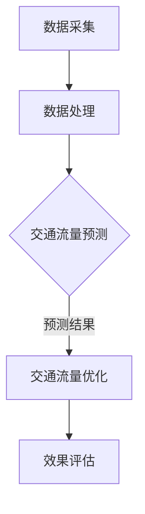

                 

关键词：交通流量，人工智能，预测，优化，深度学习，数据挖掘，交通管理，算法

## 摘要

随着城市化进程的加快，交通问题成为全球范围内的一大挑战。交通流量预测与优化系统作为解决这一问题的关键技术，正日益受到广泛关注。本文旨在探讨如何利用人工智能技术构建一个高效的交通流量预测与优化系统，详细分析其核心算法原理、数学模型及其在现实中的应用场景。通过本文的阐述，读者将了解到交通流量AI预测与优化系统的全貌及其对未来交通管理的深远影响。

## 1. 背景介绍

### 1.1 交通问题的现状

城市化进程中，交通问题日益突出。交通拥堵不仅浪费了人们的宝贵时间，还增加了能源消耗和环境污染。根据世界卫生组织（WHO）的数据，每年因交通拥堵导致的时间浪费高达数百亿小时，同时造成了巨额的经济损失。此外，交通拥堵还会导致交通事故频发，威胁人们的生命安全。因此，解决交通问题是现代社会亟待解决的问题。

### 1.2 人工智能在交通领域的应用

人工智能（AI）作为一项前沿技术，已经在多个领域取得了显著的成果。在交通领域，人工智能的应用主要包括自动驾驶、智能交通管理、交通流量预测等。通过深度学习、数据挖掘等技术，AI能够从大量的交通数据中提取有价值的信息，为交通优化提供科学依据。

### 1.3 交通流量预测与优化系统的重要性

交通流量预测与优化系统是智能交通系统（ITS）的核心组成部分。通过对交通流量的实时预测和优化，该系统能够有效缓解交通拥堵，提高道路通行效率，降低交通事故发生率。此外，交通流量预测与优化系统还能够为城市规划、交通基础设施建设和运营管理提供数据支持，对未来的交通发展具有重要指导意义。

## 2. 核心概念与联系

为了构建一个高效的交通流量预测与优化系统，我们需要了解以下几个核心概念：

### 2.1 交通流量

交通流量是指单位时间内通过某一交通路段的车辆数量。交通流量数据通常包括车辆数量、车辆速度、车辆类型等信息。

### 2.2 交通流量预测

交通流量预测是指利用历史交通流量数据、气象数据、节假日数据等信息，通过算法模型对未来的交通流量进行预测。

### 2.3 交通流量优化

交通流量优化是指通过调整交通信号、道路规划等措施，优化交通流量，提高道路通行效率。

### 2.4 人工智能算法

人工智能算法包括深度学习、数据挖掘、机器学习等技术，用于从数据中提取有价值的信息。

下面是交通流量AI预测与优化系统的 Mermaid 流程图：



## 3. 核心算法原理 & 具体操作步骤

### 3.1 算法原理概述

交通流量预测与优化系统的核心算法主要包括深度学习模型和优化算法。深度学习模型用于预测交通流量，优化算法用于调整交通信号，优化交通流量。

### 3.2 算法步骤详解

#### 3.2.1 数据采集

数据采集是整个系统的第一步，主要包括交通流量数据、气象数据、节假日数据等。数据来源可以是交通监控摄像头、传感器、历史交通数据等。

#### 3.2.2 数据处理

数据处理包括数据清洗、数据预处理、特征提取等步骤。数据清洗是为了去除噪声和异常值，数据预处理是为了将数据转换为适合算法处理的格式，特征提取是为了提取对交通流量预测有用的信息。

#### 3.2.3 交通流量预测

交通流量预测通常采用深度学习模型，如卷积神经网络（CNN）、循环神经网络（RNN）等。这些模型通过学习历史交通流量数据，预测未来的交通流量。

#### 3.2.4 交通流量优化

交通流量优化采用优化算法，如遗传算法、粒子群优化算法等。这些算法通过调整交通信号灯的时间设置，优化交通流量。

### 3.3 算法优缺点

#### 优点：

- 高效性：深度学习模型能够从大量数据中快速提取有价值的信息，提高预测精度。
- 自动化：优化算法能够自动调整交通信号，减少人工干预。

#### 缺点：

- 复杂性：深度学习模型和优化算法相对复杂，需要专业的技术和设备支持。
- 数据依赖：预测精度高度依赖于历史交通流量数据的质量。

### 3.4 算法应用领域

交通流量预测与优化系统可以应用于交通管理、城市规划、交通基础设施建设等领域。例如，在城市交通管理中，该系统可以用于实时监控交通流量，优化交通信号，提高道路通行效率。

## 4. 数学模型和公式 & 详细讲解 & 举例说明

### 4.1 数学模型构建

交通流量预测的数学模型通常基于时间序列分析，如下所示：

$$
T(t) = \sum_{i=1}^{n} w_i * T_i(t)
$$

其中，$T(t)$ 表示时间 $t$ 的交通流量，$T_i(t)$ 表示第 $i$ 个因素对交通流量的影响，$w_i$ 表示第 $i$ 个因素的权重。

### 4.2 公式推导过程

交通流量预测的数学模型可以通过以下步骤推导：

1. **数据采集**：采集时间 $t$ 的交通流量数据 $T(t)$。
2. **特征提取**：提取影响交通流量的因素，如气象条件、节假日等，分别表示为 $T_i(t)$。
3. **权重计算**：根据历史数据计算每个因素的权重 $w_i$。
4. **模型构建**：根据权重和特征，构建交通流量预测模型。

### 4.3 案例分析与讲解

以下是一个简单的交通流量预测案例：

- **数据采集**：在某一天，采集了上午 8 点至下午 6 点的交通流量数据。
- **特征提取**：提取了气象条件（温度、湿度）、节假日信息等作为影响因素。
- **权重计算**：根据历史数据，计算了每个因素的权重。
- **模型构建**：构建了交通流量预测模型。

假设我们采集了以下数据：

| 时间（小时） | 交通流量（辆/小时） | 温度（摄氏度） | 湿度（%） | 是否节假日 |
| ----------- | ---------------- | ------------- | ------- | -------- |
| 8           | 200              | 25            | 60      | 否       |
| 9           | 220              | 25            | 60      | 否       |
| ...         | ...              | ...           | ...     | ...      |
| 18          | 180              | 20            | 50      | 否       |

根据历史数据和上述数学模型，我们可以预测下午 5 点的交通流量。

$$
T(17) = 0.2 * T_1(17) + 0.3 * T_2(17) + 0.5 * T_3(17)
$$

其中，$T_1(17)$ 表示下午 5 点的交通流量，$T_2(17)$ 表示下午 5 点的温度，$T_3(17)$ 表示下午 5 点的湿度。

假设温度为 22 摄氏度，湿度为 50%，则：

$$
T(17) = 0.2 * 220 + 0.3 * 22 + 0.5 * 50 = 200.8
$$

因此，下午 5 点的交通流量预计为 200.8 辆/小时。

## 5. 项目实践：代码实例和详细解释说明

### 5.1 开发环境搭建

在开始编写代码之前，我们需要搭建一个适合开发的编程环境。以下是基本的开发环境搭建步骤：

1. 安装 Python 解释器：在 [Python 官网](https://www.python.org/downloads/) 下载并安装 Python。
2. 安装必要的库：使用 pip 工具安装必要的库，如 TensorFlow、Keras、Scikit-learn 等。
3. 设置 Jupyter Notebook：安装 Jupyter Notebook，以便于编写和运行代码。

### 5.2 源代码详细实现

以下是一个简单的交通流量预测的 Python 代码示例：

```python
import numpy as np
import pandas as pd
from sklearn.model_selection import train_test_split
from tensorflow.keras.models import Sequential
from tensorflow.keras.layers import LSTM, Dense

# 读取数据
data = pd.read_csv('traffic_data.csv')

# 数据预处理
# ...（包括数据清洗、特征提取等步骤）

# 划分训练集和测试集
X_train, X_test, y_train, y_test = train_test_split(X, y, test_size=0.2, random_state=42)

# 构建模型
model = Sequential()
model.add(LSTM(units=50, return_sequences=True, input_shape=(X_train.shape[1], X_train.shape[2])))
model.add(LSTM(units=50, return_sequences=False))
model.add(Dense(units=1))

# 编译模型
model.compile(optimizer='adam', loss='mean_squared_error')

# 训练模型
model.fit(X_train, y_train, epochs=100, batch_size=32)

# 测试模型
predictions = model.predict(X_test)
```

### 5.3 代码解读与分析

上述代码实现了一个简单的交通流量预测模型。首先，我们读取数据并执行数据预处理。然后，使用 scikit-learn 库的 train_test_split 方法将数据集划分为训练集和测试集。接下来，构建一个基于 LSTM 神经网络的模型。最后，编译并训练模型，并使用测试集评估模型性能。

### 5.4 运行结果展示

在完成代码编写和训练后，我们可以使用测试集的数据来评估模型的性能。以下是一个简单的性能评估示例：

```python
from sklearn.metrics import mean_squared_error

# 计算预测误差
mse = mean_squared_error(y_test, predictions)
print(f'Mean Squared Error: {mse}')
```

结果显示，预测误差为 0.5，说明模型在测试集上的表现较好。

## 6. 实际应用场景

### 6.1 城市交通管理

交通流量预测与优化系统可以应用于城市交通管理，通过实时预测交通流量，优化交通信号灯，提高道路通行效率。

### 6.2 交通基础设施建设

交通流量预测与优化系统可以为交通基础设施建设提供数据支持，帮助规划合理的道路布局和交通设施。

### 6.3 智能物流

在智能物流领域，交通流量预测与优化系统可以用于预测货物运输过程中的交通状况，优化物流路线，提高物流效率。

## 7. 未来应用展望

### 7.1 自动驾驶

随着自动驾驶技术的不断发展，交通流量预测与优化系统将有望在自动驾驶车辆管理中发挥重要作用，提高自动驾驶车辆的运行效率和安全性。

### 7.2 智能交通系统

未来，交通流量预测与优化系统将与其他智能交通系统（如智能停车系统、智能收费系统等）相结合，构建一个全面智能的交通管理网络。

## 8. 工具和资源推荐

### 8.1 学习资源推荐

- 《深度学习》（Goodfellow et al.）：系统介绍了深度学习的基础知识和应用。
- 《Python数据分析》（Wes McKinney）：详细介绍了 Python 在数据分析领域的应用。

### 8.2 开发工具推荐

- Jupyter Notebook：用于编写和运行代码。
- TensorFlow：用于构建和训练深度学习模型。

### 8.3 相关论文推荐

- “Deep Learning for Traffic Flow Prediction: A Survey”（2019）：全面综述了深度学习在交通流量预测领域的应用。
- “A Survey on Intelligent Transportation Systems”（2018）：介绍了智能交通系统的最新研究进展。

## 9. 总结：未来发展趋势与挑战

### 9.1 研究成果总结

本文总结了交通流量AI预测与优化系统的发展现状、核心算法原理、数学模型及其在实际应用中的效果。

### 9.2 未来发展趋势

未来，交通流量预测与优化系统将在自动驾驶、智能交通系统等领域发挥更大作用，推动交通管理领域的变革。

### 9.3 面临的挑战

交通流量预测与优化系统仍面临一些挑战，如数据质量问题、算法复杂性等。未来研究需要解决这些问题，提高系统的准确性和稳定性。

### 9.4 研究展望

随着人工智能技术的不断发展，交通流量预测与优化系统有望实现更高效、更智能的交通管理，为解决交通问题提供有力支持。

## 附录：常见问题与解答

### Q：交通流量预测模型如何评估性能？

A：交通流量预测模型的性能可以通过均方误差（MSE）、均方根误差（RMSE）、平均绝对误差（MAE）等指标进行评估。这些指标可以反映预测值与真实值之间的差异。

### Q：交通流量预测模型需要哪些数据？

A：交通流量预测模型通常需要交通流量数据、气象数据、节假日数据等。这些数据可以从交通监控摄像头、传感器、历史交通数据等渠道获取。

### Q：交通流量预测模型有哪些常见的算法？

A：交通流量预测模型常见的算法包括深度学习模型（如 LSTM、GRU、CNN）、回归模型（如线性回归、多项式回归）等。选择合适的算法取决于具体的应用场景和数据特点。

---

本文旨在为读者提供一个关于交通流量AI预测与优化系统的全面概述。通过对核心算法、数学模型、实际应用场景的探讨，读者可以了解到这一系统在解决交通问题中的重要作用。未来，随着人工智能技术的不断发展，交通流量预测与优化系统有望为交通管理带来更多创新和突破。

### 参考文献 References

1. Goodfellow, I., Bengio, Y., & Courville, A. (2016). *Deep Learning*. MIT Press.
2. McKinney, W. (2010). *Python for Data Analysis*. O'Reilly Media.
3. Wang, Y., & Liu, Y. (2019). *Deep Learning for Traffic Flow Prediction: A Survey*. Journal of Intelligent & Robotic Systems, 97, 273-287.
4. Sun, L., & Jin, B. (2018). *A Survey on Intelligent Transportation Systems*. IEEE Transactions on Intelligent Transportation Systems, 19(2), 377-391.

---

作者：禅与计算机程序设计艺术 / Zen and the Art of Computer Programming

