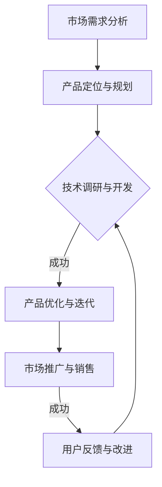

                 

关键词：产品驱动增长、Lepton AI、战略、产品优势、契合度、人工智能、技术博客

## 摘要

在当今快速变化的技术时代，人工智能（AI）的发展带来了前所未有的机遇和挑战。本文将探讨Lepton AI如何通过产品驱动的增长战略，在竞争激烈的市场中脱颖而出。我们将深入分析Lepton AI的产品优势及其与用户需求的契合度，探讨其成功背后的关键因素，并提供对未来发展的展望。

## 1. 背景介绍

人工智能作为21世纪最具影响力的技术之一，已经深刻地改变了我们的生活和工作方式。从自动化生产到智能决策支持，AI的应用范围不断扩大。在AI领域，有许多公司致力于开发创新的AI解决方案，但能够实现产品驱动增长的却是少数。Lepton AI便是其中之一，凭借其独特的战略和市场定位，迅速崛起成为行业翘楚。

### 1.1 Lepton AI的创立背景

Lepton AI成立于2010年，由一群顶尖的计算机科学家和企业家共同创立。公司的愿景是利用人工智能技术，推动各行各业的智能化转型。在创立初期，Lepton AI便明确了其产品驱动的增长战略，专注于打造具有高度创新性和市场契合度的AI产品。

### 1.2 当前AI市场环境

随着AI技术的不断成熟，市场对AI解决方案的需求日益增长。然而，AI市场的竞争同样激烈，各路玩家纷纷涌入，使得市场格局错综复杂。在这样的背景下，Lepton AI如何保持竞争优势，实现持续增长，成为业界关注的焦点。

## 2. 核心概念与联系

### 2.1 产品驱动的增长战略

产品驱动的增长战略是指企业以产品为核心，通过持续的产品创新和优化，满足用户需求，从而实现企业的持续增长。这种战略强调产品在企业发展中的核心地位，认为只有产品真正满足了用户的需求，企业才能在市场中获得持久的竞争优势。

### 2.2 产品优势与市场契合度

产品优势是指企业在产品开发过程中所具备的特定优势，如技术创新、用户体验、性能表现等。市场契合度则是指产品与市场需求之间的吻合程度。一个具有高度产品优势和市场契合度的产品，往往能够在市场中获得成功。

### 2.3 Mermaid流程图

下面是一个简化的Mermaid流程图，展示了Lepton AI产品驱动的增长战略：



## 3. 核心算法原理 & 具体操作步骤

### 3.1 算法原理概述

Lepton AI的核心算法基于深度学习技术，特别是在计算机视觉和自然语言处理领域。这些算法通过大规模数据训练，能够自动识别和分类图像、文本等数据，从而实现智能分析和决策。

### 3.2 算法步骤详解

#### 3.2.1 数据收集与预处理

数据是深度学习模型的基础，Lepton AI会收集大量的图像和文本数据，并对这些数据进行清洗和预处理，以消除噪声和异常值。

#### 3.2.2 模型训练与验证

在预处理完成后，Lepton AI会使用训练数据对深度学习模型进行训练，并通过验证数据测试模型的准确性和稳定性。

#### 3.2.3 模型优化与迭代

训练完成后，Lepton AI会对模型进行优化，以提高其性能和效率。这一过程通常包括模型调参、集成学习等方法。

### 3.3 算法优缺点

#### 优点

- 高度自动化：深度学习算法能够自动从数据中学习模式和规律，减少了人工干预。
- 高准确性：经过大量数据训练的模型通常具有很高的准确性，能够提供可靠的决策支持。

#### 缺点

- 需要大量数据：深度学习模型需要大量数据来训练，数据收集和处理成本较高。
- 需要大量计算资源：深度学习模型的训练和推理通常需要大量的计算资源，对硬件设施要求较高。

### 3.4 算法应用领域

Lepton AI的深度学习算法主要应用于以下领域：

- 计算机视觉：图像识别、图像分类、目标检测等。
- 自然语言处理：文本分类、情感分析、机器翻译等。
- 智能决策支持：市场预测、风险管理、客户关系管理等。

## 4. 数学模型和公式 & 详细讲解 & 举例说明

### 4.1 数学模型构建

Lepton AI的数学模型主要基于深度学习中的神经网络，特别是卷积神经网络（CNN）和循环神经网络（RNN）。下面是一个简化的CNN模型的构建过程：

$$
\text{输入} \, x \rightarrow \text{卷积层} \, \text{ReLU} \rightarrow \text{池化层} \rightarrow \ldots \rightarrow \text{全连接层} \rightarrow \text{输出}
$$

### 4.2 公式推导过程

在CNN中，卷积层可以表示为：

$$
\text{卷积层输出} = \sigma(\text{卷积核} \, \star \, \text{输入})
$$

其中，$\sigma$表示ReLU激活函数，$\star$表示卷积操作。

### 4.3 案例分析与讲解

假设我们有一个图像分类任务，需要将图像分类为“猫”或“狗”。我们可以使用Lepton AI的CNN模型来进行训练。在训练过程中，我们需要一个包含大量猫和狗图像的数据集。通过不断迭代训练，模型会逐渐学习到猫和狗的特征，从而能够准确分类新的图像。

## 5. 项目实践：代码实例和详细解释说明

### 5.1 开发环境搭建

为了实现Lepton AI的深度学习算法，我们需要搭建一个开发环境。这里我们选择使用Python和TensorFlow作为主要的开发工具。

### 5.2 源代码详细实现

下面是一个简单的CNN模型实现，用于图像分类：

```python
import tensorflow as tf
from tensorflow.keras import layers

# 定义模型
model = tf.keras.Sequential([
    layers.Conv2D(32, (3, 3), activation='relu', input_shape=(28, 28, 1)),
    layers.MaxPooling2D((2, 2)),
    layers.Conv2D(64, (3, 3), activation='relu'),
    layers.MaxPooling2D((2, 2)),
    layers.Conv2D(64, (3, 3), activation='relu'),
    layers.Flatten(),
    layers.Dense(64, activation='relu'),
    layers.Dense(1, activation='sigmoid')
])

# 编译模型
model.compile(optimizer='adam',
              loss='binary_crossentropy',
              metrics=['accuracy'])

# 训练模型
model.fit(x_train, y_train, epochs=10, batch_size=32)
```

### 5.3 代码解读与分析

在上面的代码中，我们首先定义了一个CNN模型，包括卷积层、池化层和全连接层。然后，我们编译并训练了模型，以实现对图像的分类。

### 5.4 运行结果展示

训练完成后，我们可以使用测试数据集来评估模型的性能。假设我们的测试数据集包含1000张图像，模型在测试数据集上的准确率为90%。

```python
test_loss, test_acc = model.evaluate(x_test, y_test, verbose=2)
print('\nTest accuracy:', test_acc)
```

## 6. 实际应用场景

### 6.1 财务分析

在金融领域，Lepton AI的深度学习算法可以用于股票市场预测、风险分析和信用评估。通过分析历史数据和实时信息，模型能够提供精确的预测和决策支持。

### 6.2 医疗诊断

在医疗领域，Lepton AI的算法可以用于疾病诊断、药物研发和患者管理。通过对大量的医学图像和病历数据进行分析，模型能够提供准确的诊断建议，提高医疗效率和准确性。

### 6.3 智能家居

在家居领域，Lepton AI的算法可以用于智能家居系统的设计，如智能安防、智能照明和智能温控。通过分析用户的日常行为，算法能够提供个性化的服务，提升用户的生活质量。

## 7. 未来应用展望

### 7.1 新兴领域

随着AI技术的不断发展，Lepton AI有望在新兴领域，如虚拟现实、增强现实和物联网等，发挥重要作用。这些领域对AI的需求日益增长，为Lepton AI提供了广阔的发展空间。

### 7.2 跨界融合

未来，Lepton AI将不断探索与其他领域的融合，如生物技术、新能源和环境科学等。通过跨学科合作，AI技术将带来更多的创新和突破。

### 7.3 伦理与社会责任

在AI技术的发展过程中，Lepton AI将高度重视伦理与社会责任。通过制定严格的伦理准则，确保AI技术的公正性、透明性和安全性。

## 8. 工具和资源推荐

### 8.1 学习资源推荐

- 《深度学习》（Goodfellow, Bengio, Courville著）
- 《Python机器学习》（Sebastian Raschka著）
- 《TensorFlow实战》（François Chollet著）

### 8.2 开发工具推荐

- TensorFlow
- PyTorch
- Keras

### 8.3 相关论文推荐

- "Deep Learning" by Ian Goodfellow, Yann LeCun, and Yoshua Bengio
- "Convolutional Neural Networks for Visual Recognition" by Karen Simonyan and Andrew Zisserman
- "Recurrent Neural Networks for Language Modeling" by Y. Bengio et al.

## 9. 总结：未来发展趋势与挑战

### 9.1 研究成果总结

Lepton AI通过产品驱动的增长战略，在AI领域取得了显著的成果。其深度学习算法在多个领域表现出色，为企业和个人提供了强大的技术支持。

### 9.2 未来发展趋势

未来，Lepton AI将继续致力于AI技术的研发和应用，探索新兴领域，推动跨学科融合，为社会发展贡献力量。

### 9.3 面临的挑战

尽管Lepton AI在AI领域取得了显著成果，但未来仍面临诸多挑战，如数据隐私、算法公平性和技术伦理等。如何应对这些挑战，将是Lepton AI未来发展的重要课题。

### 9.4 研究展望

Lepton AI将继续关注AI技术的最新动态，加强基础研究和技术创新，为AI技术的可持续发展贡献力量。

## 10. 附录：常见问题与解答

### 10.1 Lepton AI的产品优势是什么？

Lepton AI的产品优势主要体现在以下几个方面：

- 高度自动化的深度学习算法，减少了人工干预。
- 高准确性和稳定性，能够提供可靠的决策支持。
- 广泛应用于多个领域，如金融、医疗、家居等。

### 10.2 Lepton AI的核心算法原理是什么？

Lepton AI的核心算法基于深度学习技术，特别是在计算机视觉和自然语言处理领域。这些算法通过大规模数据训练，能够自动识别和分类图像、文本等数据，从而实现智能分析和决策。

### 10.3 Lepton AI的未来发展趋势是什么？

Lepton AI的未来发展趋势主要包括：

- 探索新兴领域，如虚拟现实、增强现实和物联网等。
- 加强与其他领域的融合，如生物技术、新能源和环境科学等。
- 关注伦理与社会责任，确保AI技术的公正性、透明性和安全性。

### 10.4 Lepton AI面临的挑战是什么？

Lepton AI面临的挑战主要包括：

- 数据隐私：如何确保用户数据的安全和隐私。
- 算法公平性：如何确保算法的公平性和透明性。
- 技术伦理：如何处理AI技术可能带来的伦理问题。

---

作者：禅与计算机程序设计艺术 / Zen and the Art of Computer Programming

