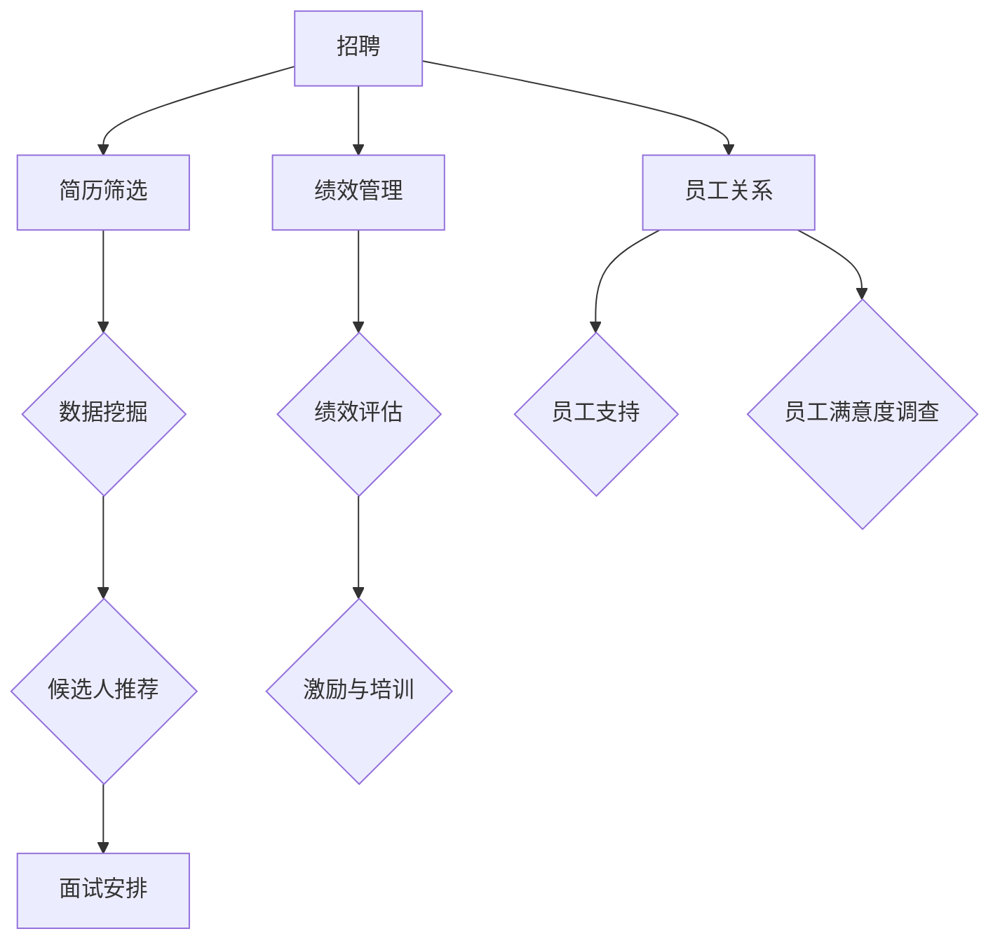

                 

关键词：人力资源科技、人才管理、数字化转型、人工智能、数据分析、HRTech

> 摘要：本文旨在探讨人力资源科技（HR Tech）在人才管理领域的应用，通过数字化转型提升企业的人才竞争力和人力资源管理效率。文章首先介绍HR Tech的背景和核心概念，然后详细解析其核心技术原理、算法步骤和数学模型，并通过项目实践展示其实际应用效果，最后对未来的发展趋势和挑战进行展望。

## 1. 背景介绍

在当今快速变化的经济环境中，企业面临着前所未有的挑战和机遇。一方面，全球化和技术进步推动市场不断变化，另一方面，人才竞争愈发激烈。为了在竞争中获得优势，企业需要迅速调整其战略，特别是在人力资源管理（HRM）方面。传统的HR管理方式已经无法满足现代企业的需求，数字化转型的趋势要求企业采用更加智能、高效的HR解决方案。

### 1.1 数字化转型的概念和意义

数字化转型是指利用数字技术来改变组织内部的工作流程、客户体验和商业模式。在HR领域，数字化转型意味着通过引入新技术和工具，提高招聘、培训、绩效管理、员工关系等方面的效率和效果。数字化转型的意义在于：

- **提高效率**：自动化和智能化的工具可以减少HR工作所需的时间和人力成本。
- **优化决策**：通过数据分析，HR团队能够更好地了解员工需求和业务趋势，从而做出更明智的决策。
- **提升员工体验**：数字化工具能够提供更加便捷和个性化的服务，提高员工的满意度和忠诚度。

### 1.2 人力资源科技（HR Tech）的兴起

人力资源科技（HR Tech）是推动数字化转型的重要力量。HR Tech涵盖了一系列技术和应用，包括人工智能（AI）、机器学习（ML）、大数据分析、云计算、移动应用等。这些技术的应用不仅改变了HR的工作方式，也重塑了HR的角色和职能。

- **招聘**：通过AI驱动的简历筛选工具，快速定位合适候选人。
- **绩效管理**：利用数据分析工具，实时监控和评估员工绩效。
- **员工培训**：借助在线学习平台和虚拟现实（VR）技术，提高培训效果。
- **员工关系**：通过社交媒体和协作工具，加强员工之间的沟通和协作。

### 1.3 人才管理的数字化转型

人才管理是指企业如何吸引、发展、保留和激励员工，以实现企业战略目标。数字化转型的关键在于如何利用HR Tech工具来优化人才管理流程。具体包括以下几个方面：

- **数据分析**：通过数据分析，HR团队能够更深入地了解员工的绩效、潜力、离职率等关键指标，从而制定更有针对性的管理策略。
- **个性化**：数字化工具使得HR能够根据员工的特点和需求，提供个性化的培训、发展和激励方案。
- **智能化**：利用人工智能和机器学习技术，实现招聘、筛选、评估和推荐等HR任务的自动化，提高效率和准确性。

## 2. 核心概念与联系

在探讨HR Tech在人才管理中的应用之前，我们需要了解一些核心概念和技术，这些概念和技术是数字化转型的基石。

### 2.1 人工智能（AI）

人工智能是指使计算机具备人类智能特征的技术，包括学习、推理、感知和自我修正等能力。在HR Tech中，AI的应用主要包括：

- **招聘**：通过自然语言处理（NLP）和机器学习算法，自动筛选和推荐候选人。
- **绩效评估**：利用监督学习和无监督学习算法，分析员工绩效数据，提供客观评估。
- **员工体验**：通过聊天机器人和虚拟助手，提供7x24小时的员工支持和服务。

### 2.2 数据分析

数据分析是指通过收集、处理和分析大量数据，从中提取有价值的信息和洞察。在HR Tech中，数据分析的应用主要包括：

- **人才预测**：通过历史数据和趋势分析，预测员工的离职风险、晋升潜力等。
- **招聘优化**：分析招聘数据，优化招聘策略，提高招聘效果。
- **绩效管理**：通过数据分析，发现绩效优秀和需要改进的员工，制定相应的激励和培训方案。

### 2.3 云计算和大数据

云计算是指通过互联网提供计算资源和服务，实现资源的弹性分配和按需使用。大数据是指处理和分析海量结构化和非结构化数据的能力。在HR Tech中，云计算和大数据的应用主要包括：

- **数据存储和管理**：利用云存储和分布式数据库，存储和管理大量HR数据。
- **数据处理和分析**：通过大数据技术，快速处理和分析海量HR数据，提供实时洞察。
- **数据安全**：通过云安全解决方案，确保HR数据的安全和隐私。

### 2.4 Mermaid 流程图

以下是HR Tech在人才管理中的核心流程及其关系的Mermaid流程图：



## 3. 核心算法原理 & 具体操作步骤

### 3.1 算法原理概述

在HR Tech中，核心算法主要涉及招聘、绩效评估和员工关系管理等领域。以下简要介绍这些算法的原理：

- **招聘算法**：主要基于机器学习和自然语言处理技术，通过分析简历内容和职位要求，自动筛选和推荐候选人。
- **绩效评估算法**：主要利用监督学习和无监督学习技术，分析员工的工作表现和绩效数据，提供客观评估和反馈。
- **员工关系管理算法**：通过数据分析，识别员工需求，提供个性化的员工支持和服务。

### 3.2 算法步骤详解

#### 3.2.1 招聘算法步骤

1. **数据收集**：从多个渠道收集简历数据，包括在线招聘平台、社交媒体和内部推荐等。
2. **数据预处理**：清洗和标准化简历数据，去除噪声和冗余信息。
3. **特征提取**：提取简历中的关键信息，如教育背景、工作经验、技能和关键词等。
4. **模型训练**：使用机器学习算法（如朴素贝叶斯、支持向量机等）训练模型，预测候选人是否适合职位。
5. **模型评估**：通过交叉验证和A/B测试等方法，评估模型性能和准确性。
6. **候选人推荐**：根据职位要求和候选人特征，自动筛选和推荐最适合的候选人。

#### 3.2.2 绩效评估算法步骤

1. **数据收集**：收集员工的工作表现、绩效评估、反馈和自我评估等数据。
2. **数据预处理**：清洗和标准化数据，确保数据质量。
3. **特征提取**：提取与绩效相关的关键特征，如工作效率、项目完成度、团队协作等。
4. **模型训练**：使用监督学习算法（如线性回归、决策树等）训练模型，预测员工绩效。
5. **模型评估**：通过交叉验证和A/B测试等方法，评估模型性能和准确性。
6. **绩效评估**：根据模型预测结果，对员工进行绩效评估和反馈。

#### 3.2.3 员工关系管理算法步骤

1. **数据收集**：收集员工反馈、投诉、建议等数据，以及工作环境、公司文化等相关数据。
2. **数据预处理**：清洗和标准化数据，确保数据质量。
3. **特征提取**：提取与员工关系相关的关键特征，如员工满意度、离职率、员工参与度等。
4. **模型训练**：使用无监督学习算法（如聚类、关联规则等）训练模型，识别员工关系问题。
5. **模型评估**：通过交叉验证和A/B测试等方法，评估模型性能和准确性。
6. **员工支持**：根据模型预测结果，提供个性化的员工支持和服务，如心理辅导、培训和发展等。

### 3.3 算法优缺点

#### 3.3.1 招聘算法

**优点**：

- **高效性**：自动化筛选和推荐候选人，节省招聘时间和成本。
- **客观性**：基于数据驱动的评估，减少人为偏见和主观判断。

**缺点**：

- **数据质量**：简历数据质量参差不齐，可能影响算法的准确性和可靠性。
- **算法偏见**：模型可能存在算法偏见，导致某些群体被歧视或忽视。

#### 3.3.2 绩效评估算法

**优点**：

- **客观性**：基于数据驱动的评估，减少主观偏见和人为错误。
- **实时性**：实时监控和评估员工绩效，及时反馈和改进。

**缺点**：

- **数据完整性**：绩效数据可能不完整或存在偏差，影响评估准确性。
- **算法适应性**：不同业务场景和组织的绩效指标可能不同，需要调整算法参数。

#### 3.3.3 员工关系管理算法

**优点**：

- **个性化**：根据员工需求提供个性化的支持和服务，提高员工满意度和忠诚度。
- **实时性**：实时识别员工关系问题，及时采取干预措施。

**缺点**：

- **数据隐私**：员工数据隐私和安全问题，需要确保数据处理符合法律法规。
- **模型复杂性**：模型训练和评估过程复杂，需要专业知识和资源。

### 3.4 算法应用领域

招聘算法主要应用于招聘流程，包括简历筛选、候选人推荐和面试安排等。绩效评估算法主要应用于绩效管理和员工激励，如绩效评估、奖金分配和晋升推荐等。员工关系管理算法主要应用于员工关系管理，如员工满意度调查、员工支持和员工参与度提升等。

## 4. 数学模型和公式 & 详细讲解 & 举例说明

### 4.1 数学模型构建

在HR Tech中，数学模型广泛应用于招聘、绩效评估和员工关系管理等领域。以下是几个典型的数学模型及其构建方法：

#### 4.1.1 招聘模型

招聘模型主要基于回归分析，通过分析简历内容和职位要求，预测候选人是否适合职位。具体模型如下：

$$
P(\text{适合职位}) = f(\text{简历特征}, \text{职位要求})
$$

其中，$f$ 表示函数，$P(\text{适合职位})$ 表示候选人适合职位的概率，$\text{简历特征}$ 和 $\text{职位要求}$ 分别表示候选人的简历内容和职位要求。

#### 4.1.2 绩效评估模型

绩效评估模型主要基于线性回归和决策树等算法，通过分析员工的工作表现和绩效数据，预测员工的绩效等级。具体模型如下：

$$
y = f(\text{工作表现}, \text{绩效数据})
$$

其中，$y$ 表示绩效等级，$f$ 表示函数，$\text{工作表现}$ 和 $\text{绩效数据}$ 分别表示员工的工作表现和绩效数据。

#### 4.1.3 员工关系模型

员工关系模型主要基于聚类分析和关联规则等算法，通过分析员工反馈和投诉数据，识别员工关系问题。具体模型如下：

$$
C = f(\text{员工反馈}, \text{投诉数据})
$$

其中，$C$ 表示员工关系类别，$f$ 表示函数，$\text{员工反馈}$ 和 $\text{投诉数据}$ 分别表示员工的反馈和投诉数据。

### 4.2 公式推导过程

以下是招聘模型的推导过程：

#### 4.2.1 数据预处理

首先，对简历内容和职位要求进行数据预处理，包括文本清洗、词频统计和特征提取等。具体步骤如下：

1. **文本清洗**：去除简历中的HTML标签、特殊字符和停用词等。
2. **词频统计**：统计简历和职位要求中的关键词及其出现频率。
3. **特征提取**：将关键词转换为向量，使用词袋模型或TF-IDF模型等方法。

#### 4.2.2 模型建立

假设简历特征集为 $\text{X} = [\text{X}_1, \text{X}_2, ..., \text{X}_n]$，职位要求特征集为 $\text{Y} = [\text{Y}_1, \text{Y}_2, ..., \text{Y}_m]$。招聘模型可以表示为：

$$
P(\text{适合职位}) = \sigma(\text{W} \cdot \text{X} + \text{b})
$$

其中，$\sigma$ 表示 sigmoid 函数，$\text{W}$ 表示权重矩阵，$\text{b}$ 表示偏置项。

#### 4.2.3 模型训练

使用梯度下降算法训练模型，最小化损失函数：

$$
\text{L} = -\sum_{i=1}^n y_i \log(\sigma(\text{W} \cdot \text{X}_i + \text{b})) - (1 - y_i) \log(1 - \sigma(\text{W} \cdot \text{X}_i + \text{b}))
$$

通过迭代更新权重矩阵和偏置项：

$$
\text{W} \leftarrow \text{W} - \alpha \frac{\partial \text{L}}{\partial \text{W}}
$$

$$
\text{b} \leftarrow \text{b} - \alpha \frac{\partial \text{L}}{\partial \text{b}}
$$

其中，$\alpha$ 表示学习率。

### 4.3 案例分析与讲解

#### 4.3.1 案例背景

某互联网公司需要招聘一名软件工程师，职位要求包括熟练掌握Java和Python编程语言、具有两年以上工作经验等。现有100份符合要求的简历，需要使用招聘模型预测哪些候选人适合该职位。

#### 4.3.2 数据准备

收集100份简历，进行文本清洗和特征提取，提取出关键技能和经验等信息，得到简历特征矩阵 $\text{X}$ 和职位要求特征矩阵 $\text{Y}$。

#### 4.3.3 模型训练

使用梯度下降算法训练招聘模型，选择合适的参数（如学习率和迭代次数）以优化模型性能。

#### 4.3.4 模型评估

通过交叉验证和A/B测试等方法，评估模型的准确性和可靠性。

#### 4.3.5 候选人推荐

根据模型预测结果，筛选出适合职位的候选人，进行面试安排。

## 5. 项目实践：代码实例和详细解释说明

### 5.1 开发环境搭建

为了实现招聘模型的项目实践，我们需要搭建一个基本的开发环境。以下是所需的工具和库：

- Python（3.8及以上版本）
- Numpy（1.19及以上版本）
- Scikit-learn（0.22及以上版本）
- Pandas（1.1及以上版本）

安装步骤：

```bash
pip install numpy scikit-learn pandas
```

### 5.2 源代码详细实现

以下是一个简单的招聘模型实现，包括数据预处理、模型训练和评估等步骤。

```python
import numpy as np
import pandas as pd
from sklearn.feature_extraction.text import TfidfVectorizer
from sklearn.linear_model import LogisticRegression
from sklearn.model_selection import train_test_split
from sklearn.metrics import accuracy_score, classification_report

# 数据预处理
def preprocess_data(data):
    # 清洗文本数据
    data = data.apply(lambda x: x.lower().replace('\n', ' '))
    # 去除停用词
    stop_words = set(['is', 'are', 'the', 'and', 'to', 'of', 'in', 'it', 'for', 'on'])
    data = data.apply(lambda x: ' '.join([word for word in x.split() if word not in stop_words]))
    return data

# 读取数据
data = pd.read_csv('resume_data.csv')
data['cleaned_resume'] = preprocess_data(data['resume'])
data['is_fit'] = (data['experience'] >= 2) & (data['language'] == 'Java')

# 特征提取
vectorizer = TfidfVectorizer()
X = vectorizer.fit_transform(data['cleaned_resume'])
y = data['is_fit']

# 模型训练
X_train, X_test, y_train, y_test = train_test_split(X, y, test_size=0.2, random_state=42)
model = LogisticRegression()
model.fit(X_train, y_train)

# 模型评估
y_pred = model.predict(X_test)
print(f"Accuracy: {accuracy_score(y_test, y_pred)}")
print(classification_report(y_test, y_pred))

# 候选人推荐
def recommend_candidates(model, vectorizer, resumes, threshold=0.5):
    X_candidates = vectorizer.transform(resumes)
    y_candidates = model.predict(X_candidates)
    return y_candidates

# 测试推荐
test_resumes = ["Java developer with 3 years of experience", "Python developer with 1 year of experience"]
candidates = recommend_candidates(model, vectorizer, test_resumes)
print(candidates)
```

### 5.3 代码解读与分析

以下是对上述代码的详细解读和分析：

1. **数据预处理**：首先，我们读取简历数据，并对其进行清洗和预处理，包括文本转换为小写、去除HTML标签和特殊字符、去除停用词等。这有助于提高模型对文本数据的处理效率和准确性。

2. **特征提取**：使用TF-IDF向量

