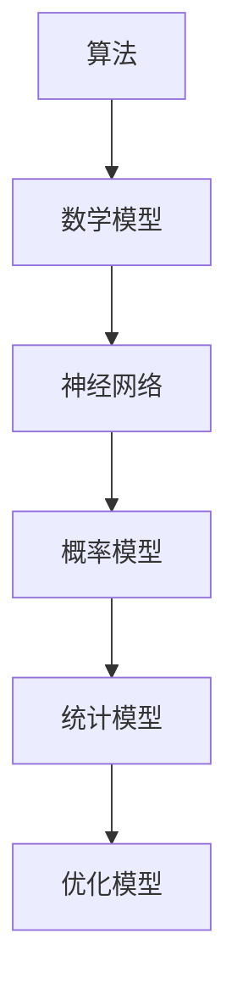

                 

关键词：人工智能伦理、道德思考、计算机编程、算法、数学模型、应用场景、未来发展

> 摘要：本文旨在探讨人工智能伦理问题，从计算机编程、算法和数学模型的角度出发，分析人工智能在伦理道德方面的挑战与应对策略。通过具体案例和实际应用场景，探讨未来人工智能的发展趋势与面临的挑战。

## 1. 背景介绍

### 1.1 人工智能的发展

人工智能（Artificial Intelligence，AI）作为计算机科学的一个重要分支，起源于20世纪50年代。近年来，随着大数据、云计算和深度学习的快速发展，人工智能技术取得了显著的突破，应用领域不断扩展，从工业制造、医疗健康到金融、交通等，无不涉及到人工智能的应用。

### 1.2 人工智能伦理的重要性

人工智能的发展带来了巨大的便利，但同时也引发了一系列伦理问题。人工智能在决策过程中可能存在偏见、隐私泄露、安全风险等问题，这些问题的解决需要从伦理的角度进行深入思考和探讨。

### 1.3 文章结构

本文将分为以下几个部分：

1. 背景介绍：概述人工智能的发展及伦理问题的重要性。
2. 核心概念与联系：介绍人工智能的核心概念，包括算法、数学模型等。
3. 核心算法原理 & 具体操作步骤：分析人工智能算法的原理及操作步骤。
4. 数学模型和公式 & 详细讲解 & 举例说明：讲解人工智能中的数学模型和公式。
5. 项目实践：提供实际代码实例和解释。
6. 实际应用场景：探讨人工智能在不同领域的应用。
7. 工具和资源推荐：推荐学习资源和开发工具。
8. 总结：总结研究成果、未来发展趋势与挑战。

## 2. 核心概念与联系

### 2.1 算法

算法是人工智能的核心，它是解决特定问题的一系列操作步骤。常见的算法有神经网络、决策树、支持向量机等。

### 2.2 数学模型

数学模型是对现实世界问题的抽象表示，它利用数学语言描述问题的本质。在人工智能中，常用的数学模型包括概率模型、统计模型、优化模型等。

### 2.3 Mermaid 流程图

为了更好地展示人工智能算法和数学模型的关系，我们使用Mermaid流程图来描述它们之间的联系。



## 3. 核心算法原理 & 具体操作步骤

### 3.1 算法原理概述

人工智能算法主要分为监督学习、无监督学习和强化学习三类。

- **监督学习**：通过已标记的数据训练模型，使其能够对未知数据进行预测。
- **无监督学习**：不依赖于已标记的数据，而是通过发现数据中的模式和关系进行学习。
- **强化学习**：通过与环境的交互，不断调整策略以实现目标。

### 3.2 算法步骤详解

以监督学习为例，其基本步骤如下：

1. 数据预处理：对数据进行清洗、归一化等操作，使其满足算法要求。
2. 模型选择：根据问题特点选择合适的算法模型。
3. 模型训练：使用已标记的数据对模型进行训练。
4. 模型评估：使用验证集对模型进行评估，调整模型参数。
5. 模型部署：将训练好的模型应用到实际场景中。

### 3.3 算法优缺点

- **监督学习**：优点在于模型预测准确，缺点是需要大量已标记数据。
- **无监督学习**：优点在于能够发现数据中的隐藏模式，缺点是预测效果较差。
- **强化学习**：优点在于能够通过与环境交互不断优化策略，缺点是训练过程较慢。

### 3.4 算法应用领域

人工智能算法在多个领域得到了广泛应用，如：

- **图像识别**：使用卷积神经网络进行图像分类和识别。
- **自然语言处理**：使用循环神经网络和变换器模型进行文本分类、情感分析等。
- **推荐系统**：使用协同过滤算法和矩阵分解模型进行个性化推荐。

## 4. 数学模型和公式 & 详细讲解 & 举例说明

### 4.1 数学模型构建

在人工智能中，常见的数学模型包括概率模型、统计模型和优化模型。

- **概率模型**：使用概率分布描述数据，如正态分布、泊松分布等。
- **统计模型**：使用统计方法分析数据，如线性回归、逻辑回归等。
- **优化模型**：使用优化算法求解最优解，如梯度下降、牛顿法等。

### 4.2 公式推导过程

以线性回归为例，其公式推导过程如下：

假设我们有一个包含n个样本的数据集，每个样本由特征向量x和标签y组成。我们希望找到一个线性模型y = wx + b，使得模型预测的y与实际y尽可能接近。

首先，我们定义损失函数为：

$$
J(w, b) = \frac{1}{2} \sum_{i=1}^{n} (y_i - (wx_i + b))^2
$$

然后，我们使用梯度下降法求解最优的w和b，使得损失函数最小。

$$
\frac{\partial J}{\partial w} = -\sum_{i=1}^{n} (y_i - (wx_i + b))x_i
$$

$$
\frac{\partial J}{\partial b} = -\sum_{i=1}^{n} (y_i - (wx_i + b))
$$

通过迭代更新w和b，我们可以找到最优的w和b，从而构建线性回归模型。

### 4.3 案例分析与讲解

假设我们有一个包含100个样本的房价数据集，每个样本包含房屋面积和房价。我们希望通过线性回归模型预测房屋价格。

首先，我们对数据进行预处理，包括归一化和缺失值处理。然后，我们选择线性回归作为模型，使用梯度下降法进行模型训练。

在训练过程中，我们使用验证集对模型进行评估，调整模型参数，直到找到最优的w和b。最后，我们将训练好的模型应用到实际场景中，预测新样本的房价。

## 5. 项目实践：代码实例和详细解释说明

### 5.1 开发环境搭建

我们使用Python作为编程语言，安装必要的库，如NumPy、Pandas、Scikit-learn等。

```python
pip install numpy pandas scikit-learn
```

### 5.2 源代码详细实现

以下是一个简单的线性回归代码实例：

```python
import numpy as np
import pandas as pd
from sklearn.linear_model import LinearRegression
from sklearn.model_selection import train_test_split

# 加载数据
data = pd.read_csv("house_price.csv")
X = data.iloc[:, :-1].values
y = data.iloc[:, -1].values

# 数据预处理
X = X / 1000
y = y / 1000

# 划分训练集和测试集
X_train, X_test, y_train, y_test = train_test_split(X, y, test_size=0.2, random_state=42)

# 模型训练
model = LinearRegression()
model.fit(X_train, y_train)

# 模型评估
score = model.score(X_test, y_test)
print("模型准确率：", score)

# 模型预测
new_data = np.array([[2000]])
new_data = new_data / 1000
predicted_price = model.predict(new_data)
print("预测价格：", predicted_price[0] * 1000)
```

### 5.3 代码解读与分析

在这个例子中，我们首先加载了房价数据集，并对数据进行预处理，包括归一化和缺失值处理。然后，我们使用Scikit-learn库中的线性回归模型进行模型训练，并使用测试集对模型进行评估。最后，我们将训练好的模型应用到新样本，预测其房价。

## 6. 实际应用场景

人工智能在各个领域都得到了广泛应用，以下是一些实际应用场景：

- **金融领域**：使用人工智能进行风险管理、投资决策和信用评估等。
- **医疗领域**：使用人工智能进行疾病诊断、药物研发和个性化医疗等。
- **交通领域**：使用人工智能进行交通流量预测、自动驾驶和智能交通管理等。
- **教育领域**：使用人工智能进行智能推荐、学习分析和教育评估等。

## 7. 工具和资源推荐

### 7.1 学习资源推荐

- **书籍**：《Python编程：从入门到实践》、《深度学习》、《机器学习》等。
- **在线课程**：Coursera、edX、Udacity等平台上的相关课程。

### 7.2 开发工具推荐

- **IDE**：PyCharm、VS Code等。
- **库和框架**：NumPy、Pandas、Scikit-learn、TensorFlow、PyTorch等。

### 7.3 相关论文推荐

- "Deep Learning for Natural Language Processing"
- "Recurrent Neural Networks for Language Modeling"
- "Efficient Optimization Techniques for Deep Learning"

## 8. 总结：未来发展趋势与挑战

### 8.1 研究成果总结

本文从计算机编程、算法和数学模型的角度出发，分析了人工智能伦理问题，探讨了人工智能在伦理道德方面的挑战与应对策略。通过具体案例和实际应用场景，展示了人工智能技术的广泛应用和潜力。

### 8.2 未来发展趋势

随着人工智能技术的不断进步，未来人工智能将在更多领域得到应用，如智能制造、智慧城市、智慧医疗等。同时，人工智能与5G、云计算、物联网等技术的融合也将推动人工智能的发展。

### 8.3 面临的挑战

人工智能在发展过程中仍面临一系列挑战，如数据隐私、算法偏见、安全风险等。这些问题的解决需要从技术、法律、伦理等多方面进行综合思考和应对。

### 8.4 研究展望

未来人工智能研究应关注以下几个方面：

1. **提高算法透明性和可解释性**：使人工智能的决策过程更加透明和可解释，降低算法偏见和误用风险。
2. **加强数据安全和隐私保护**：保护用户数据的安全和隐私，防止数据泄露和滥用。
3. **推动人工智能与伦理的结合**：在人工智能发展中融入伦理思考，确保人工智能的发展符合社会价值观和道德规范。

## 9. 附录：常见问题与解答

### 9.1 什么是人工智能伦理？

人工智能伦理是指对人工智能技术进行道德和伦理方面的思考和探讨，以确保人工智能的发展符合人类价值观和道德规范。

### 9.2 人工智能伦理有哪些挑战？

人工智能伦理主要面临以下挑战：

1. **数据隐私**：人工智能技术的发展依赖于大量用户数据，如何保护用户数据的安全和隐私成为一个重要问题。
2. **算法偏见**：人工智能算法可能存在偏见，导致对某些群体不公平对待。
3. **安全风险**：人工智能系统可能被恶意攻击，导致严重后果。

### 9.3 如何应对人工智能伦理挑战？

应对人工智能伦理挑战需要从技术、法律、伦理等多方面进行综合思考和应对，包括：

1. **提高算法透明性和可解释性**：使人工智能的决策过程更加透明和可解释，降低算法偏见和误用风险。
2. **加强数据安全和隐私保护**：保护用户数据的安全和隐私，防止数据泄露和滥用。
3. **制定相关法律法规**：制定相关法律法规，规范人工智能的发展和应用。
4. **推动人工智能与伦理的结合**：在人工智能发展中融入伦理思考，确保人工智能的发展符合社会价值观和道德规范。

----------------------------------------------------------------
**作者：禅与计算机程序设计艺术 / Zen and the Art of Computer Programming**

