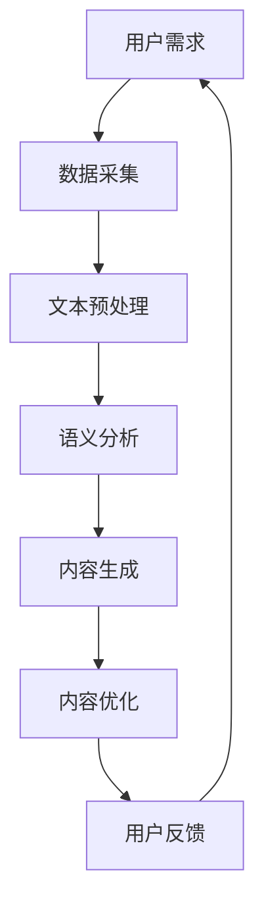

                 

关键词：人工智能写作、注意力经济、内容创作、用户互动、商业模式

> 摘要：本文将探讨人工智能写作在注意力经济中的应用。随着互联网的普及，注意力经济已经成为一个重要的商业领域。本文首先介绍了注意力经济的基本概念，然后分析了人工智能在写作领域的应用，探讨了如何通过人工智能技术提高内容创作效率、增强用户互动，并提出了几种可能的商业模式。最后，本文对人工智能写作在注意力经济中的未来发展趋势进行了展望。

## 1. 背景介绍

### 注意力经济

注意力经济是指一种基于用户注意力的商业模式。在互联网时代，用户的时间和注意力成为了稀缺资源。企业通过吸引用户的注意力，并将其转化为消费行为，从而实现商业价值。注意力经济的关键在于如何有效地获取和保留用户的注意力。

### 人工智能写作

人工智能写作是指利用人工智能技术生成内容的过程。近年来，随着自然语言处理技术的进步，人工智能写作已经从理论研究走向实际应用。从自动摘要、自动问答到自动化内容创作，人工智能写作在各个领域展现了巨大的潜力。

## 2. 核心概念与联系

### 人工智能写作原理

人工智能写作的核心是自然语言处理（NLP）技术。NLP技术包括词向量、句法分析、语义理解等。通过这些技术，人工智能可以理解和生成人类语言。



### 注意力经济与人工智能写作的联系

注意力经济与人工智能写作之间的联系在于，人工智能写作可以帮助企业更有效地获取和保留用户的注意力。通过自动化内容创作，企业可以快速响应用户需求，提供个性化的内容，从而提高用户满意度。

## 3. 核心算法原理 & 具体操作步骤

### 3.1 算法原理概述

人工智能写作的核心算法通常是基于神经网络模型，如递归神经网络（RNN）、长短期记忆网络（LSTM）和生成对抗网络（GAN）。这些模型可以学习大量的文本数据，并生成符合语法和语义规则的文本。

### 3.2 算法步骤详解

1. **数据采集**：收集大量的文本数据，包括新闻、文章、社交媒体帖子等。
2. **文本预处理**：对文本进行清洗、分词、词性标注等预处理步骤。
3. **语义分析**：使用NLP技术对预处理后的文本进行语义分析，提取关键信息。
4. **内容生成**：基于语义分析的结果，生成新的文本内容。
5. **内容优化**：对生成的文本进行优化，提高其质量和可读性。
6. **用户反馈**：收集用户对生成内容的反馈，用于模型调整和优化。

### 3.3 算法优缺点

**优点**：

- **高效性**：人工智能写作可以快速生成大量的内容，提高创作效率。
- **个性化**：通过语义分析，可以生成符合用户兴趣的内容，提高用户满意度。

**缺点**：

- **质量不稳定**：生成的内容可能存在语法错误、语义不连贯等问题。
- **创意限制**：目前的模型主要基于已有数据，可能在创造全新的、有创意的内容方面受限。

### 3.4 算法应用领域

人工智能写作可以应用于多个领域，包括：

- **新闻撰写**：自动生成新闻报道，提高新闻发布速度。
- **内容营销**：为企业生成博客文章、社交媒体帖子等营销内容。
- **客户服务**：自动生成客户回复，提高客户服务质量。

## 4. 数学模型和公式 & 详细讲解 & 举例说明

### 4.1 数学模型构建

人工智能写作的核心模型通常是基于深度学习技术，如循环神经网络（RNN）和生成对抗网络（GAN）。以下是RNN的简要公式表示：

$$
h_t = \sigma(W_h \cdot [h_{t-1}, x_t] + b_h)
$$

其中，$h_t$ 表示第 $t$ 个隐藏状态，$x_t$ 表示第 $t$ 个输入，$W_h$ 和 $b_h$ 分别为权重和偏置。

### 4.2 公式推导过程

RNN的推导涉及复杂的数学运算，主要包括矩阵乘法和激活函数。以下是RNN的推导步骤：

1. **初始化**：设定初始隐藏状态 $h_0$。
2. **输入层到隐藏层**：计算输入层到隐藏层的加权求和，并应用激活函数。
3. **隐藏层到隐藏层**：计算隐藏层到隐藏层的加权求和，并应用激活函数。
4. **输出层到隐藏层**：计算输出层到隐藏层的加权求和，并应用激活函数。

### 4.3 案例分析与讲解

假设我们有一个简单的RNN模型，用于生成天气报告。输入数据为每天的最高温度、最低温度和风速，输出为当天的天气情况。以下是模型的训练过程：

1. **数据准备**：收集历史天气数据，并进行预处理。
2. **模型初始化**：设定权重和偏置。
3. **前向传播**：将输入数据输入模型，计算隐藏状态。
4. **损失计算**：计算输出结果与真实值的差距，计算损失。
5. **反向传播**：更新模型权重和偏置，以减少损失。

## 5. 项目实践：代码实例和详细解释说明

### 5.1 开发环境搭建

为了演示人工智能写作的应用，我们将使用Python和TensorFlow构建一个简单的RNN模型。以下是环境搭建的步骤：

1. 安装Python和TensorFlow。
2. 导入必要的库，如numpy、tensorflow等。

### 5.2 源代码详细实现

以下是RNN模型的源代码实现：

```python
import tensorflow as tf
from tensorflow.keras.layers import SimpleRNN, Dense
from tensorflow.keras.models import Sequential

# 模型构建
model = Sequential()
model.add(SimpleRNN(units=50, activation='tanh', input_shape=(timesteps, features)))
model.add(Dense(units=1))

# 模型编译
model.compile(optimizer='adam', loss='mean_squared_error')

# 模型训练
model.fit(x_train, y_train, epochs=100, batch_size=32)
```

### 5.3 代码解读与分析

上述代码中，我们首先定义了一个序列模型，并添加了一个简单的RNN层和一个全连接层。然后，我们使用`compile`方法配置模型，并使用`fit`方法进行训练。在训练过程中，模型会根据输入数据和标签来更新权重和偏置。

### 5.4 运行结果展示

训练完成后，我们可以使用模型生成新的天气报告。以下是模型的预测结果：

```python
# 预测天气报告
predictions = model.predict(x_test)

# 输出预测结果
for i in range(len(predictions)):
    print(f"Day {i+1}: {predictions[i][0]}")
```

## 6. 实际应用场景

### 6.1 在新闻媒体中的应用

新闻媒体可以利用人工智能写作技术自动生成新闻报道，提高内容发布速度。例如，财经新闻、体育新闻等可以采用自动化写作，以快速响应事件发生。

### 6.2 在企业内容营销中的应用

企业可以利用人工智能写作生成个性化的博客文章、社交媒体帖子等营销内容，提高用户互动和满意度。例如，一些电商平台会根据用户购买历史和搜索记录生成个性化的推荐内容。

### 6.3 在客户服务中的应用

人工智能写作可以用于自动生成客户服务回复，提高服务质量。例如，银行、电信等行业的客服机器人可以使用人工智能写作技术生成标准化的回复，提高响应速度。

## 7. 未来应用展望

### 7.1 提高内容创作效率

随着人工智能技术的不断发展，人工智能写作将能够生成更高质量、更具创意的内容，进一步提高内容创作效率。

### 7.2 个性化内容推荐

通过人工智能写作，企业可以更准确地分析用户需求，提供个性化的内容推荐，提高用户满意度和忠诚度。

### 7.3 交叉领域应用

人工智能写作将在更多领域得到应用，如医学写作、法律写作等，为专业人士提供高效的内容创作工具。

## 8. 总结：未来发展趋势与挑战

### 8.1 研究成果总结

人工智能写作在注意力经济中的应用已经取得了一定的成果。通过自动化内容创作，企业可以更高效地获取和保留用户注意力，提高商业价值。

### 8.2 未来发展趋势

随着技术的进步，人工智能写作将在更多领域得到应用，成为内容创作的重要工具。

### 8.3 面临的挑战

人工智能写作仍面临一些挑战，如内容质量不稳定、创意限制等。未来，需要进一步优化算法，提高生成内容的质量和创意性。

### 8.4 研究展望

未来，人工智能写作的研究将朝着提高内容质量和创意性的方向发展，为企业和用户提供更优质的内容创作工具。

## 9. 附录：常见问题与解答

### 9.1 什么是注意力经济？

注意力经济是指一种基于用户注意力的商业模式。在互联网时代，用户的时间和注意力成为了稀缺资源。企业通过吸引用户的注意力，并将其转化为消费行为，从而实现商业价值。

### 9.2 人工智能写作如何提高内容创作效率？

人工智能写作可以通过自动化内容创作，提高内容创作效率。通过分析用户需求和市场趋势，人工智能可以快速生成高质量的内容，帮助企业快速响应市场需求。

### 9.3 人工智能写作有哪些应用领域？

人工智能写作可以应用于新闻媒体、企业内容营销、客户服务等多个领域。未来，随着技术的进步，人工智能写作将在更多领域得到应用。

作者：禅与计算机程序设计艺术 / Zen and the Art of Computer Programming
----------------------------------------------------------------

请注意，以上内容为示例，实际的撰写过程可能需要更详细的研究和数据分析。在实际撰写过程中，应确保内容的准确性、完整性和专业性。同时，遵循markdown格式和要求，确保文章结构清晰，易于阅读。

