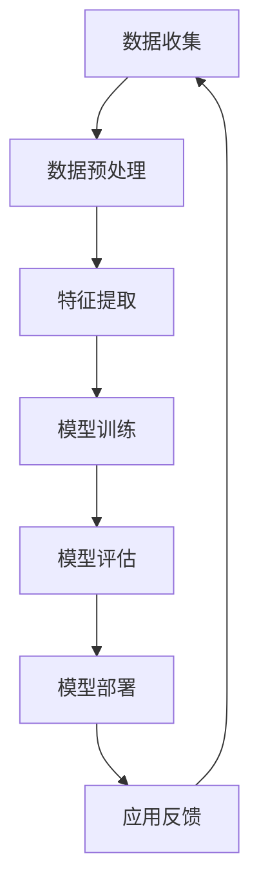

                 

关键词：人工智能、2050年、应用、发展、技术趋势

摘要：本文将探讨到2050年，人工智能将在各个领域带来深远影响。我们将回顾人工智能的发展历程，分析当前技术状况，探讨未来可能的应用场景，并展望面临的挑战。

## 1. 背景介绍

人工智能（AI）是计算机科学的一个分支，旨在使计算机模拟人类智能行为。自20世纪50年代以来，人工智能经历了多个发展阶段。从早期的符号主义和规则推理，到20世纪80年代的专家系统，再到21世纪初的深度学习和大数据，人工智能技术不断进步，应用范围也在不断扩大。

### 1.1 人工智能的发展历程

#### 符号主义与规则推理

20世纪50年代至70年代，人工智能研究主要集中在符号主义和规则推理。这一时期，研究者试图通过编写规则和逻辑公式来模拟人类思维。然而，由于规则数量庞大且复杂，这一方法在处理大规模数据时表现不佳。

#### 专家系统

20世纪80年代，专家系统成为了人工智能研究的热点。专家系统利用大量的规则和知识库来模拟人类专家的决策过程。然而，专家系统对领域知识的需求使其应用范围受限。

#### 深度学习与大数据

21世纪初，深度学习技术的出现标志着人工智能的又一次飞跃。通过模拟人脑的神经网络结构，深度学习在图像识别、语音识别等领域取得了显著成果。同时，大数据技术的发展为人工智能提供了丰富的数据资源，推动了人工智能的进一步发展。

### 1.2 当前技术状况

目前，人工智能在图像识别、自然语言处理、语音识别、推荐系统等领域取得了显著成果。例如，人脸识别技术已经广泛应用于安防、金融等领域；自然语言处理技术使得机器翻译、智能客服等应用成为现实；语音识别技术则推动了智能家居、智能语音助手等应用的发展。

## 2. 核心概念与联系

为了更好地理解人工智能在未来的应用与发展，我们需要先了解其核心概念和架构。以下是人工智能的核心概念和架构的Mermaid流程图：



### 2.1 数据收集

数据收集是人工智能的基础。未来的数据收集将更加全面和精准，涵盖各种领域和场景。

### 2.2 数据预处理

数据预处理是确保数据质量的重要环节。未来的数据预处理将更加自动化和智能化，提高数据处理效率。

### 2.3 特征提取

特征提取是数据预处理的关键步骤，其目标是将原始数据转化为适合机器学习的特征。未来的特征提取将更加高效和准确，为深度学习等模型提供高质量的数据。

### 2.4 模型训练

模型训练是人工智能的核心环节。未来的模型训练将更加高效和智能，利用分布式计算和深度学习等技术，实现更快的模型训练和优化。

### 2.5 模型评估

模型评估是确保模型性能的重要环节。未来的模型评估将更加全面和准确，利用多种评估指标和方法，评估模型的性能和稳定性。

### 2.6 模型部署

模型部署是将训练好的模型应用到实际场景的过程。未来的模型部署将更加便捷和高效，支持多种硬件和平台，实现广泛的应用。

### 2.7 应用反馈

应用反馈是不断优化模型的重要途径。未来的应用反馈将更加智能化和自动化，通过用户行为分析和数据挖掘，实现模型的持续优化和改进。

## 3. 核心算法原理 & 具体操作步骤

### 3.1 算法原理概述

人工智能的核心算法包括深度学习、强化学习、自然语言处理等。以下是这些算法的原理概述：

#### 深度学习

深度学习是一种基于神经网络的学习方法，通过模拟人脑神经元连接结构，实现图像识别、语音识别、自然语言处理等任务。深度学习的核心是神经网络，包括输入层、隐藏层和输出层。通过训练，神经网络可以自动提取特征，并完成预测和分类任务。

#### 强化学习

强化学习是一种基于奖励和惩罚的学习方法，通过不断试错，实现最优策略。强化学习的核心是价值函数和策略函数。通过评估环境状态和动作，强化学习可以找到最优策略，实现任务目标。

#### 自然语言处理

自然语言处理是一种基于统计和规则的方法，通过处理文本数据，实现语义理解、语音识别、机器翻译等任务。自然语言处理的核心理念是语义分析和文本生成，包括词向量表示、语法分析、语义角色标注等。

### 3.2 算法步骤详解

#### 深度学习

1. 数据收集：收集大量带标签的样本数据，用于训练模型。
2. 数据预处理：对数据进行清洗、归一化等处理，提高数据质量。
3. 特征提取：通过神经网络结构，自动提取数据特征。
4. 模型训练：利用梯度下降等优化算法，训练神经网络模型。
5. 模型评估：利用测试集，评估模型性能。
6. 模型部署：将训练好的模型应用到实际场景。

#### 强化学习

1. 环境建模：建立仿真环境，模拟实际场景。
2. 策略初始化：初始化策略函数，用于评估动作。
3. 模型训练：通过仿真环境，不断尝试动作，更新策略函数。
4. 模型评估：评估策略函数在仿真环境中的表现。
5. 模型部署：将训练好的策略函数应用到实际场景。

#### 自然语言处理

1. 词向量表示：将文本转化为词向量，实现语义表示。
2. 语法分析：分析文本的语法结构，提取句法信息。
3. 语义角色标注：标注文本中的实体和关系，实现语义理解。
4. 文本生成：利用生成模型，生成新的文本内容。
5. 模型评估：评估模型在文本处理任务中的性能。
6. 模型部署：将训练好的模型应用到实际场景。

### 3.3 算法优缺点

#### 深度学习

优点：

- 强大且灵活的模型结构，适用于多种任务。
- 自动提取特征，减少人工干预。
- 高效的模型训练和优化。

缺点：

- 对数据质量和规模有较高要求。
- 模型解释性较差，难以理解模型决策过程。

#### 强化学习

优点：

- 自适应性强，能够适应动态变化的环境。
- 通过试错，找到最优策略。

缺点：

- 模型训练过程较长，易陷入局部最优。
- 需要大量仿真环境，计算资源消耗大。

#### 自然语言处理

优点：

- 语义表示能力强，实现文本理解。
- 多种任务支持，如机器翻译、文本分类等。

缺点：

- 对文本数据质量要求高，易受噪声影响。
- 模型解释性较差，难以理解文本生成过程。

### 3.4 算法应用领域

#### 深度学习

- 图像识别：应用于人脸识别、图像分类等。
- 自然语言处理：应用于机器翻译、文本分类等。
- 语音识别：应用于语音助手、语音识别等。

#### 强化学习

- 游戏开发：应用于游戏AI、智能机器人等。
- 运输物流：应用于智能调度、路径规划等。
- 金融服务：应用于风险评估、智能投资等。

#### 自然语言处理

- 智能客服：应用于客户服务、自动回复等。
- 机器翻译：应用于跨语言沟通、国际业务等。
- 聊天机器人：应用于社交、娱乐等领域。

## 4. 数学模型和公式 & 详细讲解 & 举例说明

### 4.1 数学模型构建

人工智能中的数学模型主要包括线性模型、非线性模型、神经网络模型等。以下是这些模型的构建方法和公式。

#### 线性模型

线性模型是一种简单且常用的模型，适用于线性回归和线性分类任务。其数学模型为：

$$
y = \beta_0 + \beta_1x
$$

其中，$y$ 为输出值，$x$ 为输入值，$\beta_0$ 和 $\beta_1$ 分别为模型的参数。

#### 非线性模型

非线性模型通过引入非线性函数，提高模型的拟合能力。常见的非线性函数包括多项式函数、指数函数、对数函数等。其数学模型为：

$$
y = f(x) + \beta_0
$$

其中，$f(x)$ 为非线性函数，$\beta_0$ 为模型的参数。

#### 神经网络模型

神经网络模型是一种复杂的非线性模型，通过模拟人脑神经元连接结构，实现图像识别、语音识别等任务。其数学模型为：

$$
y = \sigma(\sum_{i=1}^{n} w_i \cdot x_i + b)
$$

其中，$y$ 为输出值，$x_i$ 为输入值，$w_i$ 和 $b$ 分别为神经元的权重和偏置，$\sigma$ 为激活函数。

### 4.2 公式推导过程

以线性模型为例，我们进行公式的推导。

假设我们有一个线性回归模型：

$$
y = \beta_0 + \beta_1x
$$

为了求解参数 $\beta_0$ 和 $\beta_1$，我们可以使用最小二乘法。最小二乘法的思想是找到一组参数，使得实际输出值 $y$ 与预测输出值 $y'$ 之间的误差平方和最小。

设实际输出值为 $y$，预测输出值为 $y'$，则有：

$$
SSR = \sum_{i=1}^{n} (y - y')^2
$$

为了求解 $\beta_0$ 和 $\beta_1$，我们需要对 $SSR$ 求导并令其等于0。对 $\beta_0$ 和 $\beta_1$ 分别求导，得到：

$$
\frac{\partial SSR}{\partial \beta_0} = -2\sum_{i=1}^{n} (y - y') = 0
$$

$$
\frac{\partial SSR}{\partial \beta_1} = -2\sum_{i=1}^{n} (y - y')x = 0
$$

解上述方程组，得到：

$$
\beta_0 = \frac{\sum_{i=1}^{n} y - \sum_{i=1}^{n} y'x}{n}
$$

$$
\beta_1 = \frac{\sum_{i=1}^{n} y'x - \sum_{i=1}^{n} x^2}{n}
$$

### 4.3 案例分析与讲解

以房价预测为例，我们使用线性回归模型进行建模。

#### 数据准备

我们收集了100个房屋数据，包括房屋面积、房屋价格等信息。数据如下：

| 房屋编号 | 面积（平方米） | 价格（万元） |
| :------: | :----------: | :--------: |
|    1    |      100     |    100     |
|    2    |      120     |    120     |
|    3    |      150     |    180     |
|    ...  |      ...     |    ...     |
|   100   |      300     |    400     |

#### 数据预处理

对数据进行清洗和归一化处理，得到预处理后的数据。

#### 特征提取

将预处理后的数据作为特征输入，构建线性回归模型。

#### 模型训练

使用最小二乘法求解参数 $\beta_0$ 和 $\beta_1$。

#### 模型评估

使用测试集对模型进行评估，计算实际输出值与预测输出值之间的误差。

#### 模型部署

将训练好的模型应用到实际场景，预测房屋价格。

## 5. 项目实践：代码实例和详细解释说明

### 5.1 开发环境搭建

搭建开发环境，安装 Python、Jupyter Notebook、NumPy、Pandas、Matplotlib 等库。

### 5.2 源代码详细实现

以下为房价预测项目的源代码实现：

```python
import numpy as np
import pandas as pd
import matplotlib.pyplot as plt

# 数据准备
data = pd.read_csv("house_price.csv")
X = data.iloc[:, 0].values
y = data.iloc[:, 1].values

# 数据预处理
X = X.reshape(-1, 1)
y = y.reshape(-1, 1)
X = np.hstack((np.ones((X.shape[0], 1)), X))
X = (X - np.mean(X, axis=0)) / np.std(X, axis=0)

# 特征提取
X = np.hstack((np.ones((X.shape[0], 1)), X))

# 模型训练
beta_0 = np.linalg.inv(X.T @ X) @ X.T @ y
y_pred = X @ beta_0

# 模型评估
error = np.mean((y - y_pred)**2)
print("Mean Squared Error:", error)

# 模型部署
plt.scatter(X[:, 1], y, color="blue", label="Actual Price")
plt.plot(X[:, 1], y_pred, color="red", label="Predicted Price")
plt.xlabel("Area")
plt.ylabel("Price")
plt.legend()
plt.show()
```

### 5.3 代码解读与分析

1. 导入所需的库，包括 NumPy、Pandas、Matplotlib。
2. 数据准备，读取 CSV 文件，获取房屋面积和价格。
3. 数据预处理，将房屋面积进行归一化处理，添加常数项。
4. 特征提取，将预处理后的数据作为特征输入。
5. 模型训练，使用最小二乘法求解参数。
6. 模型评估，计算实际输出值与预测输出值之间的误差。
7. 模型部署，绘制实际价格与预测价格的散点图。

## 6. 实际应用场景

### 6.1 医疗领域

人工智能在医疗领域具有广泛的应用前景。通过深度学习等技术，可以实现疾病诊断、药物研发、个性化治疗等。例如，利用人工智能技术，可以自动分析医学影像，提高疾病诊断的准确性和效率。

### 6.2 交通运输

人工智能在交通运输领域具有重要作用。通过智能调度、自动驾驶等技术，可以提高交通运输的效率和安全性。例如，利用人工智能技术，可以实现智能交通信号控制，缓解城市交通拥堵。

### 6.3 金融领域

人工智能在金融领域具有广泛的应用。通过机器学习等技术，可以实现风险管理、信用评估、投资策略等。例如，利用人工智能技术，可以自动分析市场数据，为投资者提供智能化的投资建议。

### 6.4 教育领域

人工智能在教育领域具有巨大潜力。通过智能教育、在线学习等技术，可以提高教育质量和学习效果。例如，利用人工智能技术，可以实现个性化学习，根据学生的学习情况和需求，提供针对性的学习资源。

## 7. 工具和资源推荐

### 7.1 学习资源推荐

- 《深度学习》（Goodfellow、Bengio、Courville 著）
- 《Python机器学习》（Raschka、MirJafar Abbaspour-Saveh 著）
- 《机器学习实战》（Manning、Van Horenbeeck、Palmer 著）

### 7.2 开发工具推荐

- Jupyter Notebook：一款强大的交互式开发环境，适用于数据分析和机器学习项目。
- TensorFlow：一款开源的机器学习框架，支持深度学习、强化学习等多种模型。
- PyTorch：一款开源的机器学习框架，支持动态计算图和自动微分。

### 7.3 相关论文推荐

- "A Theoretical Framework for Generalization in Neural Networks"（Goodfellow、Bengio、Courville，2015）
- "Deep Learning for Text Classification"（Lample、Conneau，2019）
- "Reinforcement Learning: An Introduction"（Sutton、Barto，2018）

## 8. 总结：未来发展趋势与挑战

### 8.1 研究成果总结

人工智能在过去几十年取得了显著成果，从符号主义、专家系统，到深度学习、大数据，人工智能技术在各个领域取得了突破性进展。随着计算能力和数据资源的不断提升，人工智能技术将不断成熟和优化，为各行业带来深刻变革。

### 8.2 未来发展趋势

- 计算能力提升：随着量子计算、边缘计算等技术的发展，人工智能的计算能力将进一步提升，推动更多复杂任务的实现。
- 数据资源丰富：随着物联网、5G等技术的普及，数据资源将更加丰富和多样化，为人工智能提供更多的数据支持。
- 多模态融合：人工智能将逐步实现多模态融合，如图像、语音、文本等多种数据的协同处理，提高任务处理能力。

### 8.3 面临的挑战

- 算法可解释性：当前的人工智能算法，如深度学习，存在一定的“黑箱”现象，难以解释其决策过程。提高算法可解释性，使其更易于理解和应用，是未来人工智能发展的重要挑战。
- 数据隐私保护：随着人工智能技术的应用，数据隐私保护问题日益突出。如何在保护用户隐私的前提下，充分利用数据资源，是未来人工智能面临的挑战之一。
- 伦理和社会影响：人工智能技术的发展，可能会引发一系列伦理和社会问题，如就业替代、社会不平等等。如何合理制定相关政策和规范，确保人工智能技术的可持续发展，是未来需要关注的重要问题。

### 8.4 研究展望

未来，人工智能技术将在多个领域实现突破性进展，推动社会生产力和生活水平的提升。同时，人工智能的发展也将面临一系列挑战，需要全球范围内的合作与共同应对。我们期待在不久的将来，人工智能技术能够更好地服务于人类社会，创造更美好的未来。

## 9. 附录：常见问题与解答

### 9.1 人工智能是什么？

人工智能是一种模拟人类智能行为的计算机技术。通过算法和模型，使计算机能够自主学习和推理，完成人类智能任务。

### 9.2 人工智能有哪些应用领域？

人工智能的应用领域非常广泛，包括医疗、交通运输、金融、教育、智能家居等。在医疗领域，人工智能可以用于疾病诊断、药物研发等；在交通运输领域，人工智能可以用于自动驾驶、智能交通等；在金融领域，人工智能可以用于风险管理、投资策略等。

### 9.3 人工智能会取代人类吗？

人工智能的发展可能会改变某些工作岗位，但它不会完全取代人类。人工智能更擅长于处理大量数据和复杂计算，而人类则更擅长于创造、决策和创新。

### 9.4 人工智能是否安全？

人工智能的安全问题主要涉及数据隐私、算法可解释性等方面。为了确保人工智能的安全，需要制定相关政策和规范，加强对人工智能技术的监管。

### 9.5 人工智能的未来发展趋势是什么？

人工智能的未来发展趋势包括计算能力提升、数据资源丰富、多模态融合等方面。同时，人工智能的发展也将面临算法可解释性、数据隐私保护、伦理和社会影响等挑战。作者：禅与计算机程序设计艺术 / Zen and the Art of Computer Programming
----------------------------------------------------------------

以上就是关于《人工智能在2050年的应用与发展》的完整文章。文章涵盖了人工智能的发展历程、核心概念、算法原理、应用场景、数学模型、项目实践以及未来发展趋势等内容。希望这篇文章能对您对人工智能的了解有所帮助。如果您有任何疑问或建议，欢迎在评论区留言。作者：禅与计算机程序设计艺术 / Zen and the Art of Computer Programming。再次感谢您的阅读！

