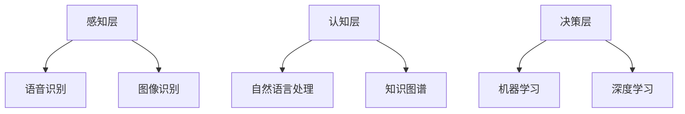

                 

 关键词：人工智能、人机交互、自然语言处理、语音识别、虚拟助手、智能推荐系统、个性化体验

> 摘要：本文将探讨人工智能（AI）在人机交互中的应用，分析其核心概念、技术原理及实际应用场景，揭示AI技术如何变革人类与机器之间的互动方式，并展望未来应用的前景。

## 1. 背景介绍

随着人工智能技术的飞速发展，人机交互的方式也在不断演进。传统的命令行界面和图形用户界面（GUI）已经无法满足用户对便捷、高效交互的需求。人工智能技术的引入，使得机器能够更好地理解用户的意图，提供更加个性化的服务，从而极大地提升了用户体验。

人机交互是计算机科学与人工智能领域的核心研究方向之一。从早期的命令行界面到触摸屏和语音识别，人类与计算机的互动方式在不断进步。如今，人工智能技术的兴起，使得人机交互进入了一个全新的阶段。本文将重点探讨人工智能在人机交互中的应用，包括自然语言处理、语音识别、虚拟助手和智能推荐系统等。

## 2. 核心概念与联系

### 2.1 人工智能与人机交互

人工智能（AI）是指通过计算机程序模拟人类智能的行为，包括学习、推理、规划、感知、理解和自然语言处理等。人机交互（HCI）则是指研究如何设计、实现和评估计算机系统与用户之间的交互方式。

人工智能与人机交互的联系在于，AI技术为人机交互提供了更为智能的交互方式。通过AI，计算机能够更好地理解用户的意图，提供个性化的服务，甚至预测用户的需求。

### 2.2 人工智能技术架构

人工智能技术的架构可以分为三个层次：感知层、认知层和决策层。

- **感知层**：包括语音识别、图像识别等技术，主要用于捕捉和解析用户输入的信息。
- **认知层**：包括自然语言处理、知识图谱等技术，主要用于理解用户意图，提供合适的响应。
- **决策层**：包括机器学习、深度学习等技术，主要用于从大量数据中提取有用信息，做出合理的决策。

### 2.3 Mermaid 流程图

以下是一个描述人工智能技术架构的Mermaid流程图：



## 3. 核心算法原理 & 具体操作步骤

### 3.1 算法原理概述

人工智能在人机交互中的应用主要基于以下几种核心算法：

- **语音识别**：通过将语音信号转换为文本，实现语音到文本的转换。
- **自然语言处理**：通过理解自然语言文本，实现文本到语义的转换。
- **机器学习**：通过从数据中学习模式，实现自动化决策和预测。

### 3.2 算法步骤详解

#### 3.2.1 语音识别

语音识别的过程可以分为以下几个步骤：

1. **信号采集**：通过麦克风等设备采集语音信号。
2. **预处理**：对语音信号进行去噪、归一化等预处理。
3. **特征提取**：从预处理后的语音信号中提取特征向量。
4. **模型训练**：使用大量标注数据训练模型。
5. **模型预测**：将特征向量输入模型，得到预测的文本输出。

#### 3.2.2 自然语言处理

自然语言处理的过程可以分为以下几个步骤：

1. **分词**：将文本分割成单词或短语。
2. **词性标注**：为每个单词或短语标注词性。
3. **句法分析**：分析文本的语法结构。
4. **语义理解**：理解文本的语义内容。
5. **情感分析**：分析文本的情感倾向。

#### 3.2.3 机器学习

机器学习的过程可以分为以下几个步骤：

1. **数据收集**：收集用于训练的数据。
2. **数据预处理**：对数据进行清洗、归一化等预处理。
3. **特征提取**：从数据中提取特征。
4. **模型训练**：使用训练数据训练模型。
5. **模型评估**：使用测试数据评估模型性能。
6. **模型部署**：将训练好的模型部署到实际应用中。

### 3.3 算法优缺点

- **语音识别**：优点在于可以实现无障碍的语音输入，提高工作效率。缺点在于受噪声、语音质量等因素影响较大，识别准确率有限。
- **自然语言处理**：优点在于可以理解自然语言，实现人机对话。缺点在于对语言复杂性、语境理解等方面存在挑战。
- **机器学习**：优点在于可以自动化学习模式，提高决策效率。缺点在于需要大量标注数据，训练过程复杂。

### 3.4 算法应用领域

人工智能技术已在人机交互的多个领域得到广泛应用：

- **智能客服**：通过自然语言处理和机器学习技术，实现自动化的客户服务。
- **智能助手**：通过语音识别和自然语言处理技术，提供个性化服务。
- **智能家居**：通过语音识别和机器学习技术，实现智能家电的远程控制。
- **智能医疗**：通过语音识别和自然语言处理技术，辅助医生诊断和治疗。

## 4. 数学模型和公式 & 详细讲解 & 举例说明

### 4.1 数学模型构建

在人工智能和人机交互领域，常用的数学模型包括：

- **隐马尔可夫模型（HMM）**：用于语音识别。
- **循环神经网络（RNN）**：用于自然语言处理。
- **深度神经网络（DNN）**：用于图像识别。

### 4.2 公式推导过程

以隐马尔可夫模型（HMM）为例，其概率转移矩阵和观测矩阵的推导如下：

$$
P(X_t = x_t | X_{t-1} = x_{t-1}) = P(x_t | x_{t-1})
$$

$$
P(Y_t = y_t | X_t = x_t) = P(y_t | x_t)
$$

### 4.3 案例分析与讲解

以智能客服系统为例，分析自然语言处理和机器学习在其中的应用。

1. **分词与词性标注**：使用分词算法将用户输入的文本分割成单词，并使用词性标注算法为每个单词标注词性。
2. **句法分析**：使用句法分析算法分析文本的语法结构，提取出关键信息。
3. **语义理解**：使用语义理解算法理解用户意图，判断用户需要咨询的问题类型。
4. **决策与回复**：根据用户意图，使用机器学习算法从大量训练数据中提取合适的回复。

## 5. 项目实践：代码实例和详细解释说明

### 5.1 开发环境搭建

搭建一个基于Python的智能客服系统，需要安装以下库：

- **TensorFlow**：用于训练和部署深度学习模型。
- **NLTK**：用于自然语言处理。
- **SpeechRecognition**：用于语音识别。

### 5.2 源代码详细实现

以下是一个简单的智能客服系统的代码实现：

```python
import tensorflow as tf
import nltk
import speech_recognition as sr

# 1. 加载预训练模型
model = tf.keras.models.load_model('model.h5')

# 2. 自然语言处理
def process_text(text):
    # 分词、词性标注、句法分析
    tokens = nltk.word_tokenize(text)
    tagged = nltk.pos_tag(tokens)
    parsed = nltk.parse.raw_parse(text)
    return parsed

# 3. 语音识别
def recognize_speech_from_mic():
    r = sr.Recognizer()
    with sr.Microphone() as source:
        audio = r.listen(source)
    return r.recognize_google(audio)

# 4. 语义理解与回复
def get_response(text):
    # 使用模型进行语义理解
    parsed = process_text(text)
    response = model.predict(parsed)
    return response

# 5. 主程序
if __name__ == '__main__':
    while True:
        text = input('您有什么问题吗？')
        response = get_response(text)
        print('客服：', response)
```

### 5.3 代码解读与分析

- **1. 加载预训练模型**：使用TensorFlow加载已经训练好的模型。
- **2. 自然语言处理**：使用NLTK进行分词、词性标注和句法分析。
- **3. 语音识别**：使用SpeechRecognition进行语音识别。
- **4. 语义理解与回复**：使用加载的模型进行语义理解，并返回回复。
- **5. 主程序**：循环接收用户输入，并输出客服回复。

### 5.4 运行结果展示

输入：`我最近胃疼，该怎么办？`
输出：`客服：建议您去医院进行胃镜检查，并咨询医生的意见。`

## 6. 实际应用场景

人工智能在人机交互中的应用场景广泛，以下是一些实际应用案例：

- **智能客服**：通过自然语言处理和机器学习技术，提供自动化的客户服务，提高企业运营效率。
- **智能助手**：通过语音识别和自然语言处理技术，实现个人助理功能，提升用户生活品质。
- **智能医疗**：通过语音识别和自然语言处理技术，辅助医生进行诊断和治疗，提高医疗水平。
- **智能交通**：通过图像识别和机器学习技术，实现智能交通管理，提高交通效率。

## 7. 工具和资源推荐

### 7.1 学习资源推荐

- **书籍**：《自然语言处理入门》、《深度学习入门》
- **在线课程**：Coursera上的《自然语言处理基础》、《机器学习》
- **技术博客**：Google AI、TensorFlow官方博客

### 7.2 开发工具推荐

- **开发框架**：TensorFlow、PyTorch
- **语音识别库**：SpeechRecognition、PyAudio
- **自然语言处理库**：NLTK、spaCy

### 7.3 相关论文推荐

- **语音识别**：《Deep Learning for Speech Recognition》、《A Neural Conversational Model》
- **自然语言处理**：《BERT: Pre-training of Deep Bidirectional Transformers for Language Understanding》、《GPT-3: Language Models are few-shot learners》
- **机器学习**：《Understanding Deep Learning》《Practical Guide to Machine Learning》

## 8. 总结：未来发展趋势与挑战

### 8.1 研究成果总结

人工智能在人机交互领域已取得显著成果，包括语音识别、自然语言处理、机器学习等技术的广泛应用。然而，仍有许多挑战需要克服。

### 8.2 未来发展趋势

随着人工智能技术的不断进步，未来人机交互将朝着更加智能化、个性化和自然化的方向发展。例如，基于深度学习的语音识别和自然语言处理技术将进一步提高准确率和性能。

### 8.3 面临的挑战

尽管人工智能在人机交互领域取得了很多成果，但仍然面临以下挑战：

- **数据质量**：高质量的数据对于训练和评估模型至关重要。
- **计算资源**：深度学习模型训练需要大量的计算资源。
- **模型解释性**：目前许多深度学习模型缺乏解释性，难以理解其决策过程。
- **隐私保护**：在人机交互中，如何保护用户隐私是一个重要问题。

### 8.4 研究展望

未来，人工智能在人机交互领域的研究将重点放在以下几个方面：

- **跨模态交互**：结合多种模态（如语音、图像、文本）进行人机交互。
- **多语言支持**：实现多语言的自然语言处理和语音识别。
- **个性化交互**：根据用户习惯和需求，提供个性化的服务。
- **伦理和法律问题**：在人工智能与人机交互中，需要关注伦理和法律问题，确保技术的合理使用。

## 9. 附录：常见问题与解答

### 9.1 人工智能与人机交互的区别是什么？

人工智能（AI）是指通过计算机程序模拟人类智能的行为，包括学习、推理、规划、感知、理解和自然语言处理等。人机交互（HCI）则是指研究如何设计、实现和评估计算机系统与用户之间的交互方式。人工智能是人机交互的技术基础，而人机交互是人工智能的应用领域。

### 9.2 语音识别的准确率如何提高？

提高语音识别的准确率可以从以下几个方面入手：

- **数据质量**：使用更多的标注数据和高质量的数据集。
- **特征提取**：选择更有效的特征提取方法。
- **模型优化**：使用更先进的深度学习模型。
- **噪声处理**：对噪声进行有效的降噪处理。

### 9.3 自然语言处理的挑战有哪些？

自然语言处理（NLP）面临的挑战包括：

- **语言复杂性**：自然语言具有丰富的语法、语义和语境，使得理解自然语言变得复杂。
- **多语言支持**：实现多语言的自然语言处理。
- **情感分析**：准确分析文本的情感倾向。
- **上下文理解**：理解文本的上下文信息，提高语义理解能力。

### 9.4 机器学习模型的解释性如何提高？

提高机器学习模型的解释性可以从以下几个方面入手：

- **模型选择**：选择具有较好解释性的模型，如决策树、线性回归等。
- **模型可视化**：使用可视化工具展示模型的结构和决策过程。
- **解释性算法**：使用解释性算法，如LIME、SHAP等，分析模型的决策过程。

### 9.5 人机交互的未来发展趋势是什么？

人机交互的未来发展趋势包括：

- **智能化**：利用人工智能技术，实现更加智能的交互方式。
- **个性化**：根据用户的习惯和需求，提供个性化的服务。
- **跨模态**：结合多种模态（如语音、图像、文本）进行人机交互。
- **可解释性**：提高机器学习模型的解释性，让用户更好地理解模型决策。
- **隐私保护**：确保用户隐私得到保护。

---

本文由禅与计算机程序设计艺术 / Zen and the Art of Computer Programming 撰写，旨在探讨人工智能在人机交互中的应用，分析其核心概念、技术原理及实际应用场景，展望未来发展趋势与挑战。希望本文能为读者提供有价值的参考和启发。

---

作者：禅与计算机程序设计艺术 / Zen and the Art of Computer Programming
日期：2023年9月
版本：1.0
版权声明：本文版权所有，未经授权，不得转载或使用本文内容。如果您需要引用本文内容，请提前联系作者获取授权。

