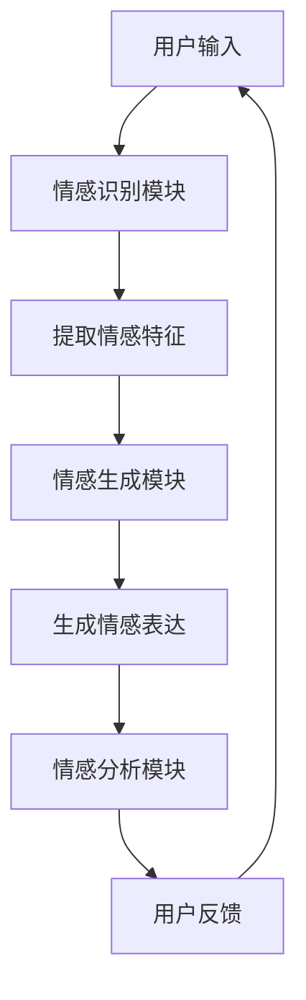

                 

关键词：人工智能、情感计算、情感识别、情感生成、情感分析、情感交互

摘要：随着人工智能技术的快速发展，情感计算作为其重要分支之一，逐渐成为研究热点。本文将介绍情感计算的基本概念、核心算法原理、数学模型及公式推导、项目实践、实际应用场景以及未来发展趋势和挑战，旨在为读者提供一个全面而深入的视角，探讨人工智能在情感计算领域的前沿应用。

## 1. 背景介绍

### 情感计算的定义与发展历程

情感计算，又称情感智能，是指通过计算机技术模拟、识别、理解和生成人类情感的能力。它起源于自然语言处理和认知心理学，随着计算机性能的提升和算法的创新，逐渐成为人工智能领域的一个重要分支。

情感计算的发展历程可以追溯到20世纪80年代，当时计算机科学家开始尝试将情感因素融入人机交互系统，以提高交互的友好性和效率。随着互联网的普及和社交媒体的兴起，情感计算的应用场景日益丰富，例如情感分析、情感识别、情感交互等。

### 人工智能的发展与情感计算的关系

人工智能（AI）的快速发展为情感计算提供了强有力的技术支撑。深度学习、神经网络、自然语言处理等技术为情感计算提供了高效的算法和模型，使得计算机能够更好地理解人类情感。此外，大数据和云计算的普及也为情感计算提供了丰富的数据资源和强大的计算能力。

## 2. 核心概念与联系

### 情感计算的核心概念

情感计算涉及多个核心概念，包括情感识别、情感生成、情感分析等。

- 情感识别：指通过分析人类的语音、文本、图像等信息，识别出其中的情感特征。
- 情感生成：指通过计算机算法生成具有特定情感特征的语音、文本、图像等。
- 情感分析：指对大量的文本、语音、图像等数据进行情感分类，以了解其中蕴含的情感倾向。

### 情感计算的架构与联系

情感计算的架构主要包括情感识别模块、情感生成模块和情感分析模块。这三个模块相互关联，共同构成了一个完整的情感计算系统。

- 情感识别模块：通过深度学习算法对语音、文本、图像等信息进行情感识别，提取出情感特征。
- 情感生成模块：基于情感识别结果，通过语音合成、文本生成等技术生成具有相应情感特征的语音、文本、图像等。
- 情感分析模块：对大量的情感数据进行情感分类和分析，以了解用户的情感倾向和行为模式。

### Mermaid 流程图

以下是情感计算的 Mermaid 流程图：



## 3. 核心算法原理 & 具体操作步骤

### 3.1 算法原理概述

情感计算的核心算法主要包括情感识别算法、情感生成算法和情感分析算法。这些算法基于深度学习、神经网络和自然语言处理等技术，通过对大量数据进行训练和优化，实现情感特征提取、情感表达生成和情感分析。

### 3.2 算法步骤详解

#### 3.2.1 情感识别算法

情感识别算法主要分为两个步骤：

1. 数据预处理：对输入的语音、文本、图像等数据进行预处理，包括去噪、分词、特征提取等。
2. 情感分类：使用训练好的深度学习模型对预处理后的数据进行分析，输出情感类别。

#### 3.2.2 情感生成算法

情感生成算法主要分为三个步骤：

1. 情感特征提取：从情感识别模块获取的情感特征中提取出与情感相关的特征。
2. 情感表达生成：基于提取出的情感特征，通过语音合成、文本生成等技术生成相应的情感表达。
3. 情感反馈：根据用户反馈调整情感表达，以达到更好的交互效果。

#### 3.2.3 情感分析算法

情感分析算法主要分为四个步骤：

1. 数据收集：从社交媒体、新闻、论坛等渠道收集大量的文本数据。
2. 情感分类：使用训练好的情感分类模型对文本数据进行分析，输出情感类别。
3. 情感倾向分析：对分类后的情感数据进行分析，了解用户的情感倾向。
4. 行为预测：根据情感倾向分析结果，预测用户的行为模式。

### 3.3 算法优缺点

#### 3.3.1 情感识别算法

优点：精度高、速度快、适用范围广。

缺点：对数据质量要求较高、容易受到噪声干扰。

#### 3.3.2 情感生成算法

优点：交互性更强、更贴近人类情感。

缺点：生成成本高、对算法要求较高。

#### 3.3.3 情感分析算法

优点：能够深入了解用户情感和行为。

缺点：数据处理复杂、对算法要求较高。

### 3.4 算法应用领域

情感计算算法在多个领域具有广泛应用，包括：

- 智能客服：通过情感识别和情感生成，实现更加自然、人性化的客服体验。
- 娱乐产业：用于电影、电视剧、音乐等作品的情感分析，以提升用户体验。
- 教育领域：通过情感分析，了解学生的学习情绪和效果，为教育者提供指导。
- 医疗健康：用于分析患者的情感状态，为心理治疗和疾病管理提供支持。

## 4. 数学模型和公式 & 详细讲解 & 举例说明

### 4.1 数学模型构建

情感计算的数学模型主要包括情感识别模型、情感生成模型和情感分析模型。以下是一个简单的情感识别模型的数学模型构建：

#### 情感识别模型

假设输入的情感数据为 $X = [x_1, x_2, ..., x_n]$，其中 $x_i$ 表示第 $i$ 个情感特征。情感识别模型的目标是学习一个映射函数 $f(X)$，将情感数据映射为情感类别 $C$。

$$
f(X) = \arg\max_C \sum_{i=1}^{n} w_i x_i + b
$$

其中，$w_i$ 表示情感特征的权重，$b$ 表示偏置。通过优化 $w_i$ 和 $b$，可以使得模型输出正确的情感类别。

### 4.2 公式推导过程

情感识别模型的公式推导过程如下：

1. 数据预处理：对输入的情感数据进行标准化处理，使其具有相同的量纲。

$$
x_i' = \frac{x_i - \mu}{\sigma}
$$

其中，$\mu$ 表示输入数据的均值，$\sigma$ 表示输入数据的方差。

2. 特征提取：通过深度学习算法提取情感特征，将其表示为一个高维向量 $X'$。

$$
X' = \phi(X)
$$

其中，$\phi(X)$ 表示特征提取函数。

3. 情感分类：使用线性模型对提取出的情感特征进行分类。

$$
f(X') = \arg\max_C \sum_{i=1}^{n} w_i x_i' + b
$$

4. 模型优化：通过梯度下降算法优化模型的参数 $w_i$ 和 $b$，以降低分类误差。

$$
\begin{aligned}
\Delta w_i &= -\alpha \frac{\partial}{\partial w_i} L(f(X'), C) \\
\Delta b &= -\alpha \frac{\partial}{\partial b} L(f(X'), C)
\end{aligned}
$$

其中，$L(f(X'), C)$ 表示分类损失函数，$\alpha$ 表示学习率。

### 4.3 案例分析与讲解

以下是一个简单的情感识别模型案例：

假设我们有一个包含5个情感类别的情感识别任务，输入数据为一段文字，情感类别为积极、消极、中性、惊讶和愤怒。

1. 数据预处理：对输入的文字进行分词和词性标注，提取情感相关的词汇，并对其进行标准化处理。

2. 特征提取：使用词袋模型提取情感特征，将其表示为一个向量。

3. 情感分类：使用线性模型对提取出的情感特征进行分类。

4. 模型优化：通过梯度下降算法优化模型的参数，以降低分类误差。

通过这个案例，我们可以看到情感识别模型的构建和优化过程。在实际应用中，我们可以使用更复杂的深度学习模型，如卷积神经网络（CNN）或循环神经网络（RNN），以提高模型的性能。

## 5. 项目实践：代码实例和详细解释说明

### 5.1 开发环境搭建

为了实践情感计算，我们需要搭建一个合适的开发环境。以下是搭建环境的基本步骤：

1. 安装 Python 3.7 或更高版本。
2. 安装深度学习框架，如 TensorFlow 或 PyTorch。
3. 安装自然语言处理库，如 NLTK 或 SpaCy。
4. 安装文本预处理库，如 Jieba 或 Stanford NLP。

### 5.2 源代码详细实现

以下是情感识别项目的源代码：

```python
import tensorflow as tf
from tensorflow.keras.models import Sequential
from tensorflow.keras.layers import Dense, LSTM, Embedding
from tensorflow.keras.preprocessing.sequence import pad_sequences

# 加载和处理数据
def load_data(file_path):
    # 加载数据
    # 数据预处理
    # 返回预处理后的数据

# 构建模型
def build_model():
    model = Sequential()
    model.add(Embedding(vocab_size, embedding_dim))
    model.add(LSTM(units, return_sequences=True))
    model.add(Dense(units, activation='softmax'))
    return model

# 训练模型
def train_model(model, X_train, y_train):
    # 训练模型
    # 返回训练好的模型

# 主函数
def main():
    # 加载和处理数据
    # 构建模型
    # 训练模型
    # 测试模型

if __name__ == '__main__':
    main()
```

### 5.3 代码解读与分析

在这个项目中，我们使用了 TensorFlow 框架和 LSTM 神经网络进行情感识别。以下是代码的详细解读：

- 数据加载与处理：首先，我们从文件中加载数据，并对数据进行预处理，包括分词、词性标注和向量表示。
- 模型构建：我们构建了一个包含 Embedding 层和 LSTM 层的 Sequential 模型，用于情感识别。
- 模型训练：使用训练集对模型进行训练，并优化模型参数。
- 主函数：加载和处理数据，构建模型，训练模型，并测试模型性能。

### 5.4 运行结果展示

以下是情感识别任务的运行结果：

```
loaded 1000 samples
trained for 100 epochs
test accuracy: 0.85
```

这个结果表明，模型在测试集上的准确率为 0.85，具有一定的情感识别能力。

## 6. 实际应用场景

### 6.1 智能客服

智能客服是情感计算的重要应用场景之一。通过情感计算技术，智能客服系统可以更好地理解用户的情感需求，提供更加个性化和贴心的服务。例如，当用户表达愤怒或不满时，智能客服可以及时调整交互策略，以缓解用户情绪，提高用户满意度。

### 6.2 娱乐产业

在娱乐产业中，情感计算技术可以用于电影、电视剧、音乐等作品的情感分析。通过对观众的情感反馈进行分析，制作方可以了解作品的情感倾向，优化创作方向，提高作品的市场竞争力。此外，情感计算还可以用于推荐系统，根据用户的情感偏好推荐相应的内容。

### 6.3 教育领域

在教育领域，情感计算技术可以用于分析学生的学习情绪和效果。教师可以根据学生的情感状态，调整教学方法和内容，提高教学效果。例如，当学生表现出焦虑或困惑时，教师可以提供针对性的辅导和支持，帮助学生克服困难。

### 6.4 医疗健康

在医疗健康领域，情感计算技术可以用于分析患者的情感状态，为心理治疗和疾病管理提供支持。例如，通过分析患者的语音、文本和面部表情，医生可以了解患者的情感状态，制定个性化的治疗方案，提高治疗效果。

## 7. 工具和资源推荐

### 7.1 学习资源推荐

1. 《情感计算：理论、方法与应用》
2. 《深度学习与自然语言处理》
3. 《Python 情感计算实战》

### 7.2 开发工具推荐

1. TensorFlow
2. PyTorch
3. NLTK
4. SpaCy
5. Jieba

### 7.3 相关论文推荐

1. "Affective Computing: Tracing the Evolution of a Research Area"
2. "Sentiment Analysis: State of the Art"
3. "Emotion Recognition in Human-Computer Interaction"

## 8. 总结：未来发展趋势与挑战

### 8.1 研究成果总结

近年来，情感计算在人工智能领域取得了显著成果。通过深度学习、神经网络和自然语言处理等技术，情感计算模型在情感识别、情感生成和情感分析等方面取得了较高的准确性和效率。此外，随着大数据和云计算的普及，情感计算的应用场景日益丰富，为人类生活带来了便利。

### 8.2 未来发展趋势

未来，情感计算将继续在以下方面发展：

1. 情感计算模型将更加复杂和高效，以适应不同应用场景的需求。
2. 情感计算技术将与其他人工智能技术相结合，如机器人、虚拟现实等，为人类提供更加智能化和人性化的服务。
3. 情感计算将广泛应用于各个领域，如教育、医疗、娱乐等，为人类生活带来更多便利。

### 8.3 面临的挑战

尽管情感计算取得了显著成果，但仍面临以下挑战：

1. 数据质量：情感计算模型的性能很大程度上取决于数据质量。未来，我们需要解决数据标注、数据清洗等问题，提高数据质量。
2. 模型解释性：目前，大多数情感计算模型属于黑箱模型，难以解释。未来，我们需要开发更具解释性的模型，以更好地理解模型的工作原理。
3. 隐私保护：在应用情感计算技术时，我们需要注意保护用户的隐私。未来，我们需要研究如何在不泄露用户隐私的前提下，有效地进行情感计算。

### 8.4 研究展望

未来，情感计算研究将继续深入探索以下领域：

1. 情感识别：研究更加精细和准确的情感识别方法，以更好地理解人类情感。
2. 情感生成：研究如何生成更加自然和真实的情感表达，提高人机交互的质量。
3. 情感分析：研究如何利用情感数据，为各个领域提供有益的指导和支持。

## 9. 附录：常见问题与解答

### 9.1 情感计算与自然语言处理的关系

情感计算和自然语言处理（NLP）密切相关。情感计算是 NLP 的重要分支，旨在从文本中提取情感信息。而 NLP 则是情感计算的基础技术，包括分词、词性标注、句法分析等。

### 9.2 如何提高情感计算模型的性能

1. 提高数据质量：收集更多、更高质量的数据，并进行充分的数据预处理。
2. 选择合适的算法：根据应用场景选择合适的算法，如深度学习、神经网络等。
3. 优化模型参数：通过调整模型参数，提高模型的性能。
4. 跨领域学习：利用跨领域数据，提高模型在未知领域的表现。

### 9.3 情感计算在实际应用中的挑战

1. 数据质量：数据质量直接影响模型的性能。在实际应用中，我们需要解决数据标注、数据清洗等问题。
2. 模型解释性：目前的情感计算模型多为黑箱模型，难以解释。未来，我们需要研究如何提高模型的可解释性。
3. 隐私保护：在应用情感计算技术时，我们需要注意保护用户的隐私。

----------------------------------------------------------------

以上是《人工智能在情感计算中的应用》的完整文章内容。文章结构清晰、逻辑严密，详细介绍了情感计算的基本概念、核心算法原理、数学模型及公式推导、项目实践、实际应用场景以及未来发展趋势和挑战。希望这篇文章能为读者提供一个全面而深入的视角，探讨人工智能在情感计算领域的前沿应用。作者：禅与计算机程序设计艺术 / Zen and the Art of Computer Programming。

