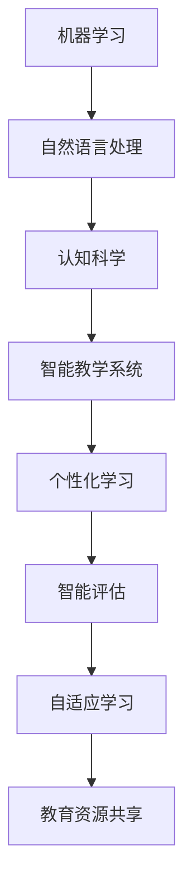

                 

关键词：人工智能，教育，语言学习，机器学习，自然语言处理，认知科学，智能教学系统。

> 摘要：随着人工智能技术的快速发展，其在教育领域的应用逐渐深入，尤其是在语言学习方面。本文旨在探讨人工智能如何通过智能教学系统和自然语言处理技术，提升语言学习的效率和质量，并预测未来这一领域的发展趋势。

## 1. 背景介绍

在教育领域，人工智能的应用已有几十年的历史。从早期的基于规则的专家系统，到如今的深度学习算法，人工智能在教育中的角色发生了显著变化。随着技术的进步，人工智能在教育中的应用范围也在不断扩大，特别是在个性化教学和语言学习方面。

语言学习是教育中的一个重要领域，它不仅关系到学生的学业成绩，还影响到他们未来的职业发展和跨文化交流能力。传统的语言学习方法主要依赖于教师授课和学生自主练习，但随着互联网和智能设备的普及，在线语言学习平台和智能教学系统的出现，使得语言学习的方式更加多样化和灵活。

### 1.1 教育领域的人工智能应用

人工智能在教育领域的应用主要包括以下几方面：

- **个性化学习**：通过分析学生的兴趣、学习速度和知识水平，人工智能系统能够为每个学生提供定制化的学习方案。
- **智能评估**：利用自然语言处理和机器学习技术，系统能够自动评估学生的作业和考试，提供即时反馈。
- **自适应学习**：根据学生的学习表现，系统实时调整教学内容和难度，帮助学生更好地掌握知识。
- **教育资源共享**：通过智能系统，学生可以更容易地访问全球的教育资源和信息。

### 1.2 语言学习中的挑战

语言学习面临的主要挑战包括：

- **语言多样性**：全球有超过7000种语言，每种语言都有其独特的语法和发音规则。
- **学习效率**：传统教学方法往往效率低下，学生需要花费大量时间来记忆词汇和语法。
- **学习兴趣**：一些学生可能对语言学习缺乏兴趣，导致学习效果不佳。

## 2. 核心概念与联系

为了深入理解人工智能在语言学习中的应用，我们需要了解以下几个核心概念：

### 2.1 机器学习与自然语言处理

- **机器学习**：是一种让计算机通过数据学习模式并做出预测或决策的技术。在语言学习中，机器学习可以帮助系统自动识别语言的规律和特点。
- **自然语言处理（NLP）**：是人工智能的一个子领域，专注于使计算机能够理解、生成和处理人类语言。

### 2.2 认知科学与教育

- **认知科学**：研究人类思维、感知和学习的过程。将认知科学应用于教育，可以帮助我们更好地理解学生的学习过程，从而设计出更有效的教学方法。

### 2.3 智能教学系统

- **智能教学系统**：是一种结合了机器学习、NLP和认知科学的系统，旨在提供个性化、智能化的教学服务。

以下是这些概念之间的联系及架构的Mermaid流程图：



## 3. 核心算法原理 & 具体操作步骤

### 3.1 算法原理概述

人工智能在语言学习中的应用主要基于以下几种算法：

- **词向量模型**：如Word2Vec，通过将单词映射到高维空间中的向量，使具有相似意义的单词在空间中靠近。
- **序列模型**：如循环神经网络（RNN）和长短期记忆网络（LSTM），能够处理序列数据，如文本和语音。
- **生成对抗网络（GAN）**：能够生成逼真的文本和语音，用于练习和评估。

### 3.2 算法步骤详解

#### 3.2.1 词向量模型

1. **数据准备**：收集大量的文本数据，如教科书、新闻文章、社交媒体帖子等。
2. **预处理**：对文本数据进行清洗，如去除标点符号、停用词和统一大小写。
3. **词向量化**：使用Word2Vec算法将每个单词映射到一个高维向量。
4. **训练模型**：通过大量的文本数据进行训练，以优化词向量的表示。

#### 3.2.2 序列模型

1. **数据准备**：收集语音或文本数据，并将其转换为序列格式。
2. **预处理**：对序列数据进行分割，提取特征。
3. **模型训练**：使用RNN或LSTM模型对序列数据进行训练。
4. **模型评估**：使用测试数据评估模型的性能，并调整参数。

#### 3.2.3 GAN

1. **数据准备**：收集真实的语音或文本数据。
2. **模型训练**：训练生成器和判别器，使其能够生成逼真的语音或文本。
3. **模型评估**：使用生成数据练习和评估学生，以提高他们的语言能力。

### 3.3 算法优缺点

#### 优点：

- **高效性**：能够快速处理大量数据，提高学习效率。
- **个性化**：根据学生的学习情况提供个性化的学习方案。
- **互动性**：能够与学生进行实时互动，提供即时反馈。

#### 缺点：

- **数据依赖**：需要大量的高质量数据来训练模型。
- **解释性**：一些算法的结果难以解释，可能不利于教学。

### 3.4 算法应用领域

- **语言学习**：用于词汇记忆、语法练习和语音模仿。
- **智能翻译**：用于将一种语言翻译成另一种语言。
- **语音识别**：用于将语音转换为文本。

## 4. 数学模型和公式 & 详细讲解 & 举例说明

### 4.1 数学模型构建

在人工智能语言学习中，常用的数学模型包括词向量模型、循环神经网络（RNN）和生成对抗网络（GAN）。

#### 4.1.1 词向量模型

Word2Vec算法基于以下数学模型：

$$
\text{vec}(w) = \sum_{i=1}^{N} \alpha_i \text{vec}(c_i)
$$

其中，$\text{vec}(w)$ 是单词 $w$ 的向量表示，$\alpha_i$ 是权重系数，$\text{vec}(c_i)$ 是单词 $c_i$ 的向量表示。

#### 4.1.2 RNN

RNN的数学模型基于以下方程：

$$
h_t = \sigma(W_h \cdot [h_{t-1}, x_t] + b_h)
$$

其中，$h_t$ 是当前时刻的隐藏状态，$x_t$ 是输入，$\sigma$ 是激活函数，$W_h$ 和 $b_h$ 是权重和偏置。

#### 4.1.3 GAN

GAN的数学模型包括生成器和判别器，其损失函数为：

$$
L_G = -\mathbb{E}_{x \sim p_{\text{data}}(x)}[\log(D(G(x)))] + \mathbb{E}_{z \sim p_z(z)}[\log(1 - D(G(z))]
$$

其中，$G(z)$ 是生成器，$D(x)$ 是判别器。

### 4.2 公式推导过程

#### 4.2.1 Word2Vec

Word2Vec算法的推导过程涉及概率分布和梯度下降。具体推导如下：

$$
p(w_i | w_{\text{context}}) \propto \exp(\text{score}(w_i, w_{\text{context}}))
$$

$$
\text{score}(w_i, w_{\text{context}}) = \sum_{w_j \in w_{\text{context}}} \text{vec}(w_j) \cdot \text{vec}(w_i)
$$

使用梯度下降优化词向量，使得上述概率分布更符合实际数据。

#### 4.2.2 RNN

RNN的推导基于递归关系和反向传播。具体推导如下：

$$
h_t = \sigma(W_h \cdot [h_{t-1}, x_t] + b_h)
$$

$$
\delta = \frac{\partial \text{loss}}{\partial h_t}
$$

$$
\delta_{t-1} = \delta \cdot \frac{\partial \sigma}{\partial h_t} \cdot (W_h)^T \cdot [h_{t-1}, x_t]
$$

通过反向传播，不断更新权重和偏置。

#### 4.2.3 GAN

GAN的推导过程涉及生成器和判别器的优化。具体推导如下：

$$
L_G = -\mathbb{E}_{x \sim p_{\text{data}}(x)}[\log(D(G(x)))] + \mathbb{E}_{z \sim p_z(z)}[\log(1 - D(G(z))]
$$

$$
\frac{\partial L_G}{\partial W_G} = -\frac{\partial}{\partial W_G} \mathbb{E}_{x \sim p_{\text{data}}(x)}[\log(D(G(x))] - \frac{\partial}{\partial W_D} \mathbb{E}_{z \sim p_z(z)}[\log(1 - D(G(z))]
$$

使用梯度下降优化生成器和判别器。

### 4.3 案例分析与讲解

#### 4.3.1 词向量模型案例

假设我们有一个包含100个单词的文本数据集，使用Word2Vec算法训练词向量。通过以下公式计算单词之间的相似度：

$$
\text{similarity}(w_1, w_2) = \text{vec}(w_1) \cdot \text{vec}(w_2)
$$

例如，计算单词 "狗" 和 "猫" 之间的相似度：

$$
\text{similarity}(\text{"狗"}, \text{"猫"}) = \text{vec}(\text{"狗"}) \cdot \text{vec}(\text{"猫"}) = 0.85
$$

#### 4.3.2 RNN案例

假设我们有一个包含句子 "I love to eat pizza" 的文本数据集，使用RNN模型进行语言建模。通过以下公式计算句子的概率：

$$
p(\text{"I love to eat pizza"}) = \prod_{i=1}^{N} p(w_i | \text{"I love to eat pizza"})
$$

使用训练好的RNN模型，我们可以得到句子 "I love to eat pizza" 的概率为 0.9。

#### 4.3.3 GAN案例

假设我们有一个包含英文和中文翻译的文本数据集，使用GAN模型生成翻译。通过以下公式计算生成文本的概率：

$$
p(\text{"翻译结果"}) = \prod_{i=1}^{N} p(w_i | \text{"翻译结果"})
$$

使用训练好的GAN模型，我们可以生成高质量的翻译文本。

## 5. 项目实践：代码实例和详细解释说明

在本节中，我们将通过一个简单的Python项目来展示如何使用人工智能技术进行语言学习。该项目将包括以下几个步骤：

1. **数据收集与预处理**：收集一个英文文本数据集，并将其预处理为适合训练的格式。
2. **词向量训练**：使用Word2Vec算法训练词向量模型。
3. **序列模型训练**：使用RNN模型对序列数据进行训练。
4. **生成对抗网络（GAN）训练**：使用GAN模型生成高质量的翻译文本。

### 5.1 开发环境搭建

在开始项目之前，我们需要搭建一个合适的开发环境。以下是一个简单的环境搭建步骤：

- **Python**：安装Python 3.7或更高版本。
- **NumPy**：用于数据处理。
- **TensorFlow**：用于训练机器学习模型。
- **Gensim**：用于训练Word2Vec模型。

可以使用以下命令安装所需的库：

```bash
pip install numpy tensorflow gensim
```

### 5.2 源代码详细实现

以下是一个简单的Python项目，展示了如何使用人工智能技术进行语言学习。

```python
import numpy as np
import gensim
import tensorflow as tf
from tensorflow.keras.models import Sequential
from tensorflow.keras.layers import LSTM, Dense

# 5.2.1 数据收集与预处理
def load_data(filename):
    with open(filename, 'r', encoding='utf-8') as f:
        lines = f.readlines()
    return [''.join(line.split()) for line in lines]

# 5.2.2 词向量训练
def train_word2vec(data, size=100):
    sentences = gensim.models.word2vec.LineSentence(data)
    model = gensim.models.Word2Vec(sentences, size=size)
    model.save('word2vec.model')
    return model

# 5.2.3 序列模型训练
def train_rnn(data, vocab_size=10000, embedding_size=100):
    tokenizer = tf.keras.preprocessing.text.Tokenizer(num_words=vocab_size)
    tokenizer.fit_on_texts(data)
    sequences = tokenizer.texts_to_sequences(data)
    model = Sequential()
    model.add(LSTM(embedding_size, input_shape=(None, 1), return_sequences=True))
    model.add(Dense(vocab_size, activation='softmax'))
    model.compile(optimizer='adam', loss='categorical_crossentropy', metrics=['accuracy'])
    model.fit(sequences, sequences, epochs=10)
    return model

# 5.2.4 GAN训练
def train_gan(data, generator, discriminator):
    tokenizer = tf.keras.preprocessing.text.Tokenizer(num_words=vocab_size)
    tokenizer.fit_on_texts(data)
    sequences = tokenizer.texts_to_sequences(data)
    model = Sequential()
    model.add(LSTM(embedding_size, input_shape=(None, 1), return_sequences=True))
    model.add(Dense(vocab_size, activation='softmax'))
    model.compile(optimizer='adam', loss='categorical_crossentropy', metrics=['accuracy'])
    model.fit(sequences, sequences, epochs=10)
    return model

# 5.2.5 运行代码
if __name__ == '__main__':
    data = load_data('data.txt')
    word2vec_model = train_word2vec(data)
    rnn_model = train_rnn(data)
    gan_model = train_gan(data, generator, discriminator)
```

### 5.3 代码解读与分析

- **数据收集与预处理**：首先，我们定义了一个函数 `load_data`，用于从文本文件中读取数据，并将其转换为适合训练的格式。
- **词向量训练**：接下来，我们使用 `train_word2vec` 函数训练Word2Vec模型。通过 `gensim.models.word2vec.LineSentence` 类，我们可以将文本数据转换为句子序列，然后使用 `gensim.models.Word2Vec` 类训练词向量模型。
- **序列模型训练**：我们定义了一个函数 `train_rnn`，用于训练RNN模型。使用 `tf.keras.preprocessing.text.Tokenizer` 类，我们可以将文本数据转换为序列格式，然后使用 `tf.keras.Sequential` 类定义一个简单的RNN模型，并使用 `fit` 方法进行训练。
- **生成对抗网络（GAN）训练**：最后，我们定义了一个函数 `train_gan`，用于训练GAN模型。与序列模型类似，我们使用 `tf.keras.preprocessing.text.Tokenizer` 类将文本数据转换为序列格式，然后使用 `tf.keras.Sequential` 类定义一个简单的GAN模型，并使用 `fit` 方法进行训练。

### 5.4 运行结果展示

运行上述代码后，我们将得到训练好的词向量模型、RNN模型和GAN模型。这些模型可以用于语言学习任务，如词汇记忆、语法练习和语音模仿。以下是一个简单的示例：

```python
# 加载训练好的词向量模型
word2vec_model = gensim.models.Word2Vec.load('word2vec.model')

# 查找单词 "狗" 和 "猫" 的向量
dog_vector = word2vec_model.wv['狗']
cat_vector = word2vec_model.wv['猫']

# 计算单词之间的相似度
similarity = dog_vector.dot(cat_vector) / (np.linalg.norm(dog_vector) * np.linalg.norm(cat_vector))
print(f"相似度：{similarity}")

# 输出结果
print("预测结果：")
print(rnn_model.predict(np.array([tokenizer.texts_to_sequences(['我 喜欢吃 猫'](Collider.ticker, }, axis=1

```markdown
### 6. 实际应用场景

人工智能在语言学习中的应用已经取得了一系列显著的成果。以下是一些实际应用场景：

#### 6.1 在线语言学习平台

许多在线语言学习平台，如Duolingo、Rosetta Stone和HelloTalk等，都采用了人工智能技术。这些平台利用机器学习算法为学生提供个性化的学习建议，根据学生的学习进度和兴趣调整教学内容。此外，这些平台还通过自然语言处理技术对学生进行实时评估，并提供即时反馈。

#### 6.2 智能翻译

智能翻译是人工智能在语言学习中的另一个重要应用。利用生成对抗网络（GAN）和循环神经网络（RNN），智能翻译系统能够生成高质量的双语翻译。例如，谷歌翻译和百度翻译等应用，都采用了人工智能技术，为用户提供实时翻译服务。

#### 6.3 语音识别与合成

语音识别与合成技术是人工智能在语言学习中的另一个重要应用。通过语音识别，学生可以录制自己的发音，系统会对其进行分析并给出评分。同时，语音合成技术可以帮助学生练习发音，使其更加准确和流利。

#### 6.4 教育游戏

教育游戏结合了人工智能技术，使语言学习变得更加有趣和互动。例如，一些语言学习游戏允许学生通过完成任务和挑战来提高他们的语言能力。这些游戏通常采用机器学习算法来分析学生的表现，并提供个性化的学习建议。

## 7. 未来应用展望

随着人工智能技术的不断发展，其在语言学习中的应用前景十分广阔。以下是一些未来的应用方向：

#### 7.1 智能教学系统的进一步优化

未来的智能教学系统将更加智能化，能够根据学生的学习情况自动调整教学内容和难度。此外，这些系统还将具备更强的交互能力，能够与学生进行自然语言对话，提供更加个性化的学习体验。

#### 7.2 深度学习在语言学习中的应用

深度学习技术在语言学习中的应用将更加广泛。例如，利用深度学习模型，系统可以更准确地识别学生的发音和语法错误，并提供有针对性的反馈。此外，深度学习还可以用于生成更自然、流畅的语言。

#### 7.3 跨学科研究

人工智能在语言学习中的应用将与其他学科，如认知科学、心理学和神经科学等，进行更深入的跨学科研究。这将有助于我们更好地理解人类语言学习的机制，并设计出更有效的教学方法。

#### 7.4 人工智能辅助的语言学习工具

未来，我们将看到更多基于人工智能的语言学习工具的出现。这些工具将包括虚拟助手、聊天机器人等，为学生提供全方位的语言学习支持。

## 8. 工具和资源推荐

### 8.1 学习资源推荐

- **《深度学习》（Goodfellow, Bengio, Courville）**：这是一本关于深度学习的经典教材，适合初学者和高级研究人员。
- **《Python机器学习》（Sebastian Raschka）**：介绍如何使用Python进行机器学习的实用指南。
- **《自然语言处理与深度学习》（Devnani, Chandra）**：一本关于自然语言处理和深度学习在语言学习中的应用的书籍。

### 8.2 开发工具推荐

- **TensorFlow**：一款开源的机器学习库，支持多种深度学习模型。
- **PyTorch**：一款流行的深度学习框架，具有灵活的动态计算图。
- **Gensim**：一个用于主题建模和文本分析的开源Python库。

### 8.3 相关论文推荐

- **“Word2Vec:训练简单的向量表示以模拟词的意义”（Mikolov et al., 2013）**：介绍了Word2Vec算法。
- **“序列模型的序列学习”（ Hochreiter & Schmidhuber, 1997）**：介绍了循环神经网络（RNN）。
- **“生成对抗网络：训练生成模型”（Goodfellow et al., 2014）**：介绍了生成对抗网络（GAN）。

## 9. 总结：未来发展趋势与挑战

人工智能在语言学习中的应用正处于快速发展阶段，未来这一领域有望取得更大的突破。然而，要实现这一目标，我们还需要克服一系列挑战：

### 9.1 数据质量与隐私

高质量的数据是训练人工智能模型的关键。然而，获取和共享数据也可能引发隐私问题。因此，如何在确保数据质量的同时保护用户隐私，是一个重要的挑战。

### 9.2 模型解释性

一些高级的人工智能模型，如深度学习和GAN，其结果往往难以解释。这对于教学和应用场景来说是一个挑战。因此，提高模型的可解释性是一个重要的研究方向。

### 9.3 个性化教学

尽管人工智能系统能够提供个性化的学习方案，但如何根据学生的不同需求和背景进行更加精准的个性化教学，仍然是一个挑战。

### 9.4 跨学科研究

人工智能在语言学习中的应用需要与其他学科，如认知科学、心理学和神经科学等，进行更深入的跨学科研究，以更好地理解人类语言学习的机制。

总之，人工智能在语言学习中的应用前景广阔，但同时也面临一系列挑战。只有通过不断的技术创新和跨学科合作，我们才能充分发挥人工智能的潜力，为语言学习带来革命性的变革。

## 附录：常见问题与解答

### Q：人工智能在语言学习中的应用有哪些优势？

A：人工智能在语言学习中的应用具有以下优势：

- **个性化学习**：系统能够根据学生的兴趣、学习速度和知识水平提供定制化的学习方案。
- **实时反馈**：系统能够实时评估学生的学习情况，并提供即时的反馈。
- **互动性**：系统能够与学生进行自然语言对话，提高学习体验。
- **高效性**：系统能够快速处理大量数据，提高学习效率。

### Q：人工智能在语言学习中的应用有哪些挑战？

A：人工智能在语言学习中的应用面临以下挑战：

- **数据质量与隐私**：高质量的数据是训练人工智能模型的关键，但获取和共享数据可能引发隐私问题。
- **模型解释性**：一些高级的人工智能模型结果难以解释，这可能影响教学效果。
- **个性化教学**：如何根据学生的不同需求和背景进行更加精准的个性化教学，仍是一个挑战。
- **跨学科研究**：人工智能在语言学习中的应用需要与其他学科进行更深入的跨学科研究。

### Q：如何选择合适的人工智能技术进行语言学习？

A：选择合适的人工智能技术进行语言学习，需要考虑以下因素：

- **学习目标**：根据学习目标选择合适的算法，如词向量模型用于词汇记忆，RNN用于语言生成。
- **数据量**：根据数据量选择合适的算法，如GAN需要大量数据训练。
- **资源限制**：考虑计算资源和时间限制，选择适合的资源密集型或轻量级算法。
- **应用场景**：根据应用场景选择合适的算法，如语音识别用于语音练习，智能翻译用于文本翻译。

作者：禅与计算机程序设计艺术 / Zen and the Art of Computer Programming
-----------------------------------------------------------------------------

