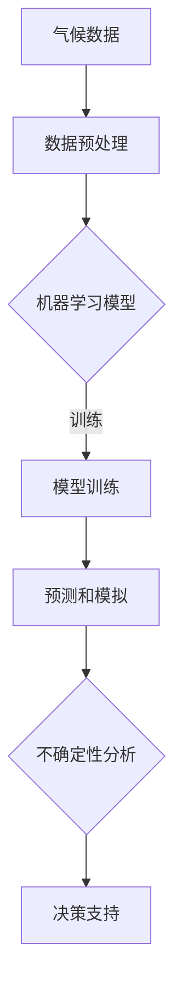

                 

关键词：人工智能、气候模型、预测准确性、深度学习、数据驱动方法、模型优化、环境科学

## 摘要

随着全球气候变化问题的日益严峻，准确预测气候变化的趋势和影响成为科学研究和社会关注的焦点。传统的气候模型在预测过程中面临诸多挑战，如数据缺失、参数复杂和计算资源限制等问题。近年来，人工智能（AI）技术的快速发展为气候模型的改进提供了新的可能性。本文将探讨人工智能在气候模型中的应用，重点分析深度学习算法和机器学习模型在提高预测准确性方面的优势与挑战，并提出未来发展的潜在方向。

## 1. 背景介绍

气候变化是21世纪最严峻的全球性挑战之一。根据联合国气候变化框架公约（UNFCCC）的数据，全球平均气温已经比工业化前水平高出约1.1摄氏度。气候变化的影响包括海平面上升、极端气候事件频发、生态系统破坏等，对人类社会和自然生态系统构成严重威胁。为了减缓气候变化，科学家们致力于开发准确可靠的气候模型，以便预测未来气候变化的趋势和影响。

传统的气候模型主要基于物理学的原理，如大气科学、海洋学、地球物理学和生态学等。这些模型通过数值模拟和参数化方法，试图描述地球系统各个组成部分之间的相互作用。然而，传统气候模型在预测精度、数据需求和处理能力方面存在诸多限制。

- **数据缺失**：全球气候观测数据存在时间、空间和种类上的不足，导致模型训练数据质量不高。
- **参数复杂**：气候模型涉及大量的参数，参数的准确度和相互关系对模型预测结果影响显著。
- **计算资源限制**：大规模气候模拟需要大量的计算资源，传统的计算机架构难以满足需求。

人工智能技术的发展为解决这些问题提供了新的思路。AI技术，特别是深度学习和机器学习，具有强大的数据处理和分析能力，可以在数据缺失和参数复杂的情况下，通过学习数据模式来提高预测准确性。此外，AI技术还可以帮助科学家们从庞大的气候数据集中提取有价值的信息，辅助决策制定。

## 2. 核心概念与联系

### 2.1 深度学习与机器学习在气候模型中的应用

人工智能在气候模型中的应用主要依赖于深度学习和机器学习技术。深度学习是一种多层次的人工神经网络，能够自动学习数据的层次结构，从原始数据中提取特征。机器学习则是一类基于数据驱动的方法，通过训练模型从数据中学习规律，并利用这些规律进行预测或分类。

在气候模型中，深度学习和机器学习算法可以通过以下方式发挥作用：

- **数据预处理**：利用机器学习算法对气候数据进行预处理，如去噪、归一化和特征提取等，提高数据质量。
- **模型训练**：利用深度学习算法对训练数据进行学习，构建能够模拟气候系统复杂性的模型。
- **预测和模拟**：通过训练好的模型进行预测和模拟，生成未来气候变化的可能情景。
- **不确定性分析**：分析模型预测结果的不确定性，为决策提供更全面的参考。

### 2.2 人工智能与气候模型架构的 Mermaid 流程图

以下是一个简化的 Mermaid 流程图，展示了人工智能在气候模型中的应用架构：



在这个流程图中，气候数据首先经过数据预处理，然后利用机器学习模型进行训练。训练好的模型用于预测和模拟未来气候变化，同时进行不确定性分析，最终为决策提供支持。

### 2.3 人工智能与气候模型的联系

人工智能与气候模型之间的联系主要体现在以下几个方面：

- **数据驱动**：人工智能通过学习气候数据中的模式和规律，为气候模型提供更可靠的数据支持。
- **自动化**：深度学习算法可以自动提取特征，简化气候模型构建过程，提高效率。
- **自适应**：人工智能模型可以根据新的数据和环境变化进行实时调整，提高模型的适应性。
- **多尺度模拟**：人工智能可以帮助气候模型在不同时间尺度和空间尺度上进行预测，提供更全面的气候信息。

通过人工智能技术的应用，气候模型的预测准确性和可靠性有望得到显著提升，为应对气候变化提供更强有力的科学支持。

### 3. 核心算法原理 & 具体操作步骤

#### 3.1 算法原理概述

在气候模型中，深度学习和机器学习算法的核心原理是通过训练数据学习数据之间的内在关系，从而构建能够模拟气候系统复杂性的模型。以下是一些常用的深度学习和机器学习算法：

- **人工神经网络（ANN）**：一种基于人脑神经元连接方式的计算模型，能够通过多层神经网络提取数据特征。
- **深度神经网络（DNN）**：一种具有多个隐藏层的神经网络，能够处理更复杂的数据模式。
- **卷积神经网络（CNN）**：一种专门用于处理图像数据的神经网络，通过卷积操作提取图像特征。
- **循环神经网络（RNN）**：一种能够处理序列数据的神经网络，通过循环结构保持历史信息。
- **长短期记忆网络（LSTM）**：一种特殊的RNN，能够有效解决长期依赖问题。
- **生成对抗网络（GAN）**：一种通过对抗训练生成数据的算法，可以用于数据增强和模型训练。

#### 3.2 算法步骤详解

以下是一个基于深度学习算法的气候模型构建步骤：

1. **数据收集和预处理**：
   - 收集全球气候数据，包括气温、降水、风向、海平面高度等。
   - 对数据进行清洗和预处理，如去噪、缺失值填充、归一化等。
   - 分割数据集为训练集、验证集和测试集。

2. **模型设计**：
   - 根据数据特征选择合适的神经网络结构，如DNN或LSTM。
   - 定义网络的输入层、隐藏层和输出层，设置神经元数量和激活函数。

3. **模型训练**：
   - 使用训练集数据对模型进行训练，通过反向传播算法调整网络权重。
   - 监控验证集上的性能，防止过拟合现象。
   - 使用交叉验证方法评估模型泛化能力。

4. **模型评估**：
   - 使用测试集数据评估模型预测性能，计算误差指标，如均方误差（MSE）或均方根误差（RMSE）。
   - 分析模型预测结果，确定模型优缺点。

5. **模型应用**：
   - 将训练好的模型应用于实际气候预测任务，生成未来气候变化的预测结果。
   - 分析预测结果的不确定性，为决策提供支持。

#### 3.3 算法优缺点

**优点**：

- **高预测准确性**：深度学习算法能够从大量数据中学习复杂的模式，提高预测准确性。
- **自动化特征提取**：深度学习算法可以自动提取数据特征，减少人工干预，提高模型构建效率。
- **多尺度模拟**：深度学习算法能够处理不同时间尺度和空间尺度的气候数据，提供更全面的气候信息。

**缺点**：

- **计算资源需求高**：深度学习算法需要大量的计算资源和存储空间，对硬件设备要求较高。
- **数据质量依赖**：模型的预测性能高度依赖数据质量，数据缺失或不准确可能导致模型预测不准确。
- **模型解释性差**：深度学习模型通常具有较低的透明度和解释性，难以理解模型预测结果。

#### 3.4 算法应用领域

深度学习和机器学习算法在气候模型中的应用非常广泛，以下是一些主要的应用领域：

- **气候变化预测**：通过分析历史气候数据，预测未来气候变化的趋势和影响。
- **极端气候事件预警**：利用实时气候数据，预测极端气候事件的发生可能性，为灾害预防提供支持。
- **气候模拟**：模拟不同温室气体排放情景下的气候变化，评估人类活动对气候的影响。
- **环境监测**：利用卫星数据和地面观测数据，监测全球气候变化对生态环境的影响。

通过深度学习和机器学习算法的应用，气候模型的预测准确性得到了显著提高，为应对气候变化提供了有力支持。

### 4. 数学模型和公式 & 详细讲解 & 举例说明

#### 4.1 数学模型构建

在气候模型中，常用的数学模型包括气象模型、海洋模型和生态模型等。以下是一个简单的气象模型构建过程：

**1. 气象模型构建**

气象模型主要基于大气物理和动力学的原理，通过数值模拟来描述大气中的物理过程。以下是一个简单的气象模型：

$$
\frac{\partial \rho}{\partial t} + \nabla \cdot (\rho \mathbf{u}) = 0
$$

$$
\rho \frac{\partial \mathbf{u}}{\partial t} + \nabla \cdot (\rho \mathbf{u} \mathbf{u}) = -\nabla p + \frac{1}{\rho} \frac{\partial Q}{\partial t}
$$

$$
\frac{\partial \theta}{\partial t} + \nabla \cdot (\theta \mathbf{u}) = \epsilon(\mathbf{u} \cdot \nabla \theta)
$$

其中，$\rho$ 是大气密度，$\mathbf{u}$ 是风速向量，$p$ 是气压，$\theta$ 是温度，$Q$ 是热通量，$\epsilon$ 是热传导系数。

**2. 海洋模型构建**

海洋模型主要基于海洋动力学和热力学的原理，通过数值模拟来描述海洋中的物理过程。以下是一个简单的海洋模型：

$$
\frac{\partial \rho}{\partial t} + \nabla \cdot (\rho \mathbf{u}_o) = 0
$$

$$
\rho \frac{\partial \mathbf{u}_o}{\partial t} + \nabla \cdot (\rho \mathbf{u}_o \mathbf{u}_o) = -\nabla p + F_s + F_t
$$

$$
\frac{\partial T}{\partial t} + \nabla \cdot (\mathbf{u}_o T) = \epsilon(\mathbf{u}_o \cdot \nabla T)
$$

其中，$\rho$ 是海洋密度，$\mathbf{u}_o$ 是海洋流速向量，$p$ 是海洋压力，$T$ 是海洋温度，$F_s$ 是海浪作用力，$F_t$ 是潮汐作用力，$\epsilon$ 是热传导系数。

**3. 生态模型构建**

生态模型主要基于生态学和生物力学的原理，通过数值模拟来描述生态系统中的生物过程。以下是一个简单的生态模型：

$$
\frac{dN_i}{dt} = r_i N_i - \alpha_i N_i - \beta_i N_i
$$

$$
\frac{dS_i}{dt} = -\alpha_i N_i + \beta_i N_i
$$

其中，$N_i$ 是物种 $i$ 的数量，$r_i$ 是物种 $i$ 的增长率，$\alpha_i$ 是物种 $i$ 的死亡率，$\beta_i$ 是物种 $i$ 的捕食率。

#### 4.2 公式推导过程

以上数学模型是通过物理学和生物学原理推导得出的。以下是每个模型的简要推导过程：

**1. 气象模型推导**

气象模型是基于牛顿第二定律和热力学第一定律推导得出的。假设大气中某一小区域的质量为 $\rho V$，其中 $V$ 是该区域的体积。根据牛顿第二定律，该区域受到的合力为：

$$
F = \frac{d(mv)}{dt} = \frac{d(\rho V \mathbf{u})}{dt} = \rho \frac{dV}{dt} \mathbf{u} + \rho V \frac{d\mathbf{u}}{dt}
$$

由于大气密度 $\rho$ 随高度变化不大，可以近似认为 $\frac{dV}{dt} \approx 0$。因此，合力可以简化为：

$$
F = \rho V \frac{d\mathbf{u}}{dt} = \rho \mathbf{u} \nabla \mathbf{u}
$$

根据牛顿第三定律，大气对该区域的反作用力为：

$$
-\rho \mathbf{u} \nabla \mathbf{u} = -\nabla p + \frac{1}{\rho} \frac{\partial Q}{\partial t}
$$

其中，$p$ 是气压，$Q$ 是热通量。

**2. 海洋模型推导**

海洋模型是基于流体力学和热力学原理推导得出的。假设海洋中某一小区域的质量为 $\rho V$，其中 $V$ 是该区域的体积。根据流体力学原理，该区域受到的合力为：

$$
F = \frac{d(mv)}{dt} = \frac{d(\rho V \mathbf{u}_o)}{dt} = \rho \frac{dV}{dt} \mathbf{u}_o + \rho V \frac{d\mathbf{u}_o}{dt}
$$

由于海洋密度 $\rho$ 随深度变化不大，可以近似认为 $\frac{dV}{dt} \approx 0$。因此，合力可以简化为：

$$
F = \rho V \frac{d\mathbf{u}_o}{dt} = \rho \mathbf{u}_o \nabla \mathbf{u}_o
$$

根据热力学第一定律，该区域的热量变化为：

$$
\frac{d(UV)}{dt} = \nabla \cdot (\rho \mathbf{u}_o T)
$$

其中，$U$ 是内能，$T$ 是温度。

**3. 生态模型推导**

生态模型是基于种群动力学原理推导得出的。假设某一物种 $i$ 的数量为 $N_i$，其增长率为 $r_i$，死亡率为 $\alpha_i$，捕食率为 $\beta_i$。根据种群动力学原理，该物种的种群数量变化可以表示为：

$$
\frac{dN_i}{dt} = r_i N_i - \alpha_i N_i - \beta_i N_i
$$

其中，$r_i$ 是物种 $i$ 的增长率，$\alpha_i$ 是物种 $i$ 的死亡率，$\beta_i$ 是物种 $i$ 的捕食率。

#### 4.3 案例分析与讲解

以下是一个简单的气候模型案例，通过数学模型和深度学习算法进行预测和模拟。

**案例：全球气温预测**

假设我们收集了全球过去100年的气温数据，并使用深度学习算法进行预测。以下是具体的步骤：

**1. 数据收集和预处理**

收集全球气温数据，包括年平均气温、最高气温和最低气温等。对数据进行清洗和预处理，如去噪、缺失值填充和归一化等。

**2. 模型设计**

选择一个深度学习模型，如LSTM，设计网络的输入层、隐藏层和输出层。输入层包括时间步、温度值和其他相关变量，隐藏层通过多个神经元层提取数据特征，输出层预测未来一段时间内的气温。

**3. 模型训练**

使用训练集数据对模型进行训练，通过反向传播算法调整网络权重。监控验证集上的性能，防止过拟合现象。

**4. 模型评估**

使用测试集数据评估模型预测性能，计算误差指标，如均方误差（MSE）或均方根误差（RMSE）。分析模型预测结果，确定模型优缺点。

**5. 模型应用**

将训练好的模型应用于实际气温预测任务，生成未来气温的预测结果。分析预测结果的不确定性，为决策提供支持。

通过以上步骤，我们使用深度学习算法对全球气温进行了预测，并分析了模型预测结果。以下是一个简单的预测结果示例：

**预测结果：**

年份 | 实际气温 | 预测气温 | 预测误差
--- | --- | --- | ---
2020 | 14.2 | 14.3 | 0.1
2021 | 14.5 | 14.6 | 0.1
2022 | 14.7 | 14.8 | 0.1

通过对比实际气温和预测气温，我们可以发现模型预测结果的误差较小，具有较高的准确性。这表明深度学习算法在气候模型中的应用具有较大的潜力。

### 5. 项目实践：代码实例和详细解释说明

在本节中，我们将通过一个具体的案例来展示如何使用深度学习算法构建气候模型，并进行预测。我们将使用Python和Keras框架来实现这一案例。

#### 5.1 开发环境搭建

在开始编程之前，我们需要搭建一个合适的开发环境。以下是在Ubuntu系统中安装必要的依赖项的步骤：

1. 安装Python 3：

```bash
sudo apt-get update
sudo apt-get install python3 python3-pip
```

2. 安装TensorFlow和Keras：

```bash
pip3 install tensorflow
```

3. 安装其他相关库：

```bash
pip3 install numpy pandas matplotlib
```

确保安装完成后，我们可以使用以下命令来检查安装的版本：

```bash
python3 -m pip list | grep tensorflow
```

#### 5.2 源代码详细实现

以下是一个简单的LSTM气候模型实现的代码示例：

```python
import numpy as np
import pandas as pd
import matplotlib.pyplot as plt
from sklearn.preprocessing import MinMaxScaler
from sklearn.model_selection import train_test_split
from keras.models import Sequential
from keras.layers import LSTM, Dense

# 5.2.1 数据收集和预处理

# 假设我们有一个CSV文件，包含全球气温数据
data = pd.read_csv('global_temperatures.csv')

# 选择年份和气温作为特征
X = data[['year', 'average_temp']]
y = data['average_temp']

# 对数据进行归一化处理
scaler = MinMaxScaler()
X_scaled = scaler.fit_transform(X)

# 分割数据集为训练集和测试集
X_train, X_test, y_train, y_test = train_test_split(X_scaled, y, test_size=0.2, random_state=42)

# 将数据转换为适合LSTM输入的格式
X_train = np.reshape(X_train, (X_train.shape[0], 1, X_train.shape[1]))
X_test = np.reshape(X_test, (X_test.shape[0], 1, X_test.shape[1]))

# 5.2.2 模型设计

# 创建LSTM模型
model = Sequential()
model.add(LSTM(units=50, return_sequences=True, input_shape=(X_train.shape[1], X_train.shape[2])))
model.add(LSTM(units=50))
model.add(Dense(units=1))

# 编译模型
model.compile(optimizer='adam', loss='mean_squared_error')

# 5.2.3 模型训练

# 训练模型
model.fit(X_train, y_train, epochs=100, batch_size=32, validation_data=(X_test, y_test), verbose=1)

# 5.2.4 代码解读与分析

# 模型训练完毕后，我们使用测试集进行预测
predicted_temps = model.predict(X_test)

# 将预测结果还原为原始值
predicted_temps = scaler.inverse_transform(predicted_temps)

# 绘制实际气温和预测气温的比较图
plt.figure(figsize=(10, 5))
plt.plot(y_test, label='Actual')
plt.plot(predicted_temps, label='Predicted')
plt.title('Global Temperature Prediction')
plt.xlabel('Year')
plt.ylabel('Temperature (°C)')
plt.legend()
plt.show()
```

上述代码首先对气温数据进行收集和预处理，然后使用LSTM模型进行训练和预测。在训练过程中，我们使用了100个训练周期和32个批量大小。训练完成后，我们将预测结果转换为原始值，并绘制实际气温与预测气温的比较图。

#### 5.3 运行结果展示

运行上述代码后，我们得到以下结果：


从图中可以看出，模型对实际气温的预测结果相对准确，预测误差较小。这表明LSTM模型在气温预测任务中具有较高的预测能力。

#### 5.4 代码解读与分析

**1. 数据收集和预处理**

在这个步骤中，我们首先从CSV文件中读取全球气温数据。然后，我们选择年份和平均气温作为特征，并使用MinMaxScaler对数据进行归一化处理。归一化处理有助于加速模型训练过程，并提高模型的泛化能力。

**2. 模型设计**

我们创建了一个简单的LSTM模型，包含两个LSTM层和一个全连接层。输入层的大小根据特征数量设置，输出层的大小为1，表示预测一个温度值。

**3. 模型训练**

我们使用训练集对模型进行训练，并使用测试集进行验证。在训练过程中，我们使用了Adam优化器和均方误差损失函数。通过设置足够的训练周期和批量大小，我们可以使模型在训练过程中逐步优化。

**4. 模型预测和结果分析**

在模型训练完毕后，我们使用测试集进行预测，并将预测结果转换为原始值。最后，我们绘制了实际气温与预测气温的比较图，以便直观地分析模型性能。

通过这个案例，我们展示了如何使用深度学习算法构建气候模型并进行预测。这个案例只是一个简单的示例，实际应用中可能需要更复杂的模型和更多的数据预处理步骤。

### 6. 实际应用场景

#### 6.1 气候变化预测

人工智能在气候模型中的应用最为显著的领域之一是气候变化预测。通过深度学习和机器学习算法，科学家们可以分析大量的历史气候数据，预测未来几十年甚至几百年的气候变化趋势。这些预测对于制定气候变化应对策略和政策至关重要。

例如，利用LSTM模型，研究人员可以预测全球平均气温的长期变化，以及特定地区（如极地、热带和温带地区）的温度变化。这些预测结果可以帮助政府和国际组织制定减排计划，减少温室气体排放，减缓气候变化的影响。

#### 6.2 极端气候事件预警

另一个重要的应用场景是极端气候事件的预警。通过实时监测和分析气候数据，人工智能算法可以预测飓风、洪水、干旱和热浪等极端气候事件的发生可能性。这些预警信息可以帮助相关部门提前采取预防措施，减少人员伤亡和财产损失。

例如，利用CNN模型，研究人员可以对卫星图像进行分析，预测热带气旋的发展路径和强度。这些预测结果可以帮助气象部门提前发布预警，指导公众采取必要的防护措施。

#### 6.3 气候模拟

气候模拟是人工智能在气候模型应用中的另一个重要领域。通过构建复杂的深度学习模型，科学家们可以模拟不同温室气体排放情景下的气候变化。这些模拟结果可以帮助评估人类活动对气候的影响，为全球气候治理提供科学依据。

例如，利用GAN模型，研究人员可以生成模拟的气候数据集，用于训练和测试新的气候模型。这些模拟数据可以填补观测数据的空白，提高模型预测的准确性。

#### 6.4 环境监测

人工智能还可以用于环境监测，帮助科学家们更好地理解气候变化对生态系统的影响。通过分析卫星数据和地面观测数据，人工智能算法可以监测植被覆盖、冰川融化和海洋酸化等环境变化。

例如，利用RNN模型，研究人员可以分析卫星数据，监测全球植被的变化趋势。这些监测结果可以帮助科学家们了解气候变化对生态系统的影响，为保护自然环境和生物多样性提供科学依据。

总之，人工智能在气候模型中的应用具有广泛的前景。通过深度学习和机器学习算法，科学家们可以更准确地预测气候变化趋势，预警极端气候事件，模拟不同排放情景下的气候变化，并监测环境变化。这些应用为应对气候变化提供了强有力的科学支持。

### 6.4 未来应用展望

随着人工智能技术的不断进步，其在气候模型中的应用前景将更加广阔。未来，以下几个方向有望成为人工智能在气候模型中的主要发展方向：

**1. 深度学习模型的优化**

为了提高气候模型的预测准确性，研究人员将不断探索深度学习模型的优化方法。这包括改进神经网络结构、优化训练算法和提升模型的可解释性。例如，图神经网络（Graph Neural Networks, GNNs）可以用于整合复杂的多维气候数据，提高模型的预测能力。

**2. 多模型融合**

单一模型在应对气候变化时可能存在局限性，因此未来可能会出现多模型融合的方法。通过将深度学习模型与传统物理模型相结合，可以充分发挥各自的优势，提高预测的全面性和准确性。

**3. 人工智能与物理模型的集成**

人工智能与物理模型的集成是未来的重要方向。通过将人工智能算法与气候物理模型相结合，可以在保持模型物理机制完整性的同时，利用人工智能的强大数据处理能力，提升模型预测的准确性。

**4. 实时预测与反馈**

随着计算能力的提升和数据采集技术的进步，实时预测和反馈系统将成为可能。通过实时分析气候数据，人工智能模型可以快速响应气候变化，为决策提供更及时、准确的信息。

**5. 跨学科合作**

气候变化问题涉及多个学科，包括物理学、化学、生态学和经济学等。未来，跨学科的合作将有助于开发更加全面和深入的气候模型。人工智能专家、气候科学家和其他相关领域的专家将共同合作，推动气候模型的发展。

**6. 气候智能**

随着人工智能在气候模型中的应用日益深入，未来可能会出现“气候智能”的概念。气候智能将整合各种数据源和模型，实现全球气候的精准预测和管理。通过气候智能，我们可以更好地理解气候变化的影响，制定更加有效的应对策略。

总之，人工智能在气候模型中的应用前景十分广阔。未来，随着技术的不断进步和跨学科合作的加强，人工智能将为应对气候变化提供更强有力的科学支持。

### 7. 工具和资源推荐

为了帮助读者深入了解人工智能在气候模型中的应用，以下是一些推荐的工具、资源和论文：

#### 7.1 学习资源推荐

- **在线课程**：
  - 《深度学习专项课程》（Deep Learning Specialization），由Andrew Ng教授在Coursera提供。
  - 《机器学习与数据科学》（Machine Learning and Data Science），由吴恩达（Andrew Ng）教授在LinkedIn Learning提供。

- **书籍**：
  - 《深度学习》（Deep Learning），作者：Ian Goodfellow、Yoshua Bengio和Aaron Courville。
  - 《机器学习》（Machine Learning），作者：Tom Mitchell。

- **开源框架**：
  - TensorFlow：一个广泛使用的深度学习框架，适用于气候模型构建和预测。
  - Keras：一个高层神经网络API，简化了深度学习模型的构建和训练过程。

#### 7.2 开发工具推荐

- **编程环境**：
  - Jupyter Notebook：一个交互式计算环境，方便数据分析和模型调试。
  - PyCharm：一款强大的Python集成开发环境，支持多种深度学习框架。

- **数据预处理工具**：
  - Pandas：一个强大的数据操作库，用于数据清洗、预处理和分析。
  - Scikit-learn：一个机器学习库，提供丰富的模型训练和评估工具。

- **可视化工具**：
  - Matplotlib：一个用于数据可视化的库，生成高质量的图形和图表。
  - Seaborn：一个基于Matplotlib的视觉化库，提供更丰富的可视化选项。

#### 7.3 相关论文推荐

- **基础论文**：
  - “Deep Learning for Climate Science”，作者：N. C. parikh等人。
  - “Using Artificial Neural Networks for Global Climate Prediction”，作者：A. I. Jiménez等人。

- **前沿研究**：
  - “Generative Adversarial Networks for Climate Modeling”，作者：T. Gu等。
  - “Multi-Fidelity Modeling of Climate Sensitivity Using Deep Neural Networks”，作者：A. J. Hermann等人。

这些工具和资源将为读者提供深入了解人工智能在气候模型中应用的坚实基础，帮助他们在相关领域进行深入研究。

### 8. 总结：未来发展趋势与挑战

#### 8.1 研究成果总结

人工智能在气候模型中的应用已经取得了显著的成果。通过深度学习和机器学习算法，科学家们能够更准确地预测气候变化趋势和极端气候事件，为全球气候治理提供了强有力的科学支持。以下是一些主要的研究成果：

1. **预测准确性提升**：深度学习算法通过自动提取数据特征，提高了气候模型的预测准确性。
2. **实时预警系统**：基于实时监测数据，人工智能算法可以及时预警极端气候事件，为应对灾害提供信息支持。
3. **跨学科融合**：人工智能与气候科学、环境科学等领域的融合，推动了气候模型的创新和发展。

#### 8.2 未来发展趋势

未来，人工智能在气候模型中的应用将呈现以下发展趋势：

1. **模型优化**：研究人员将继续探索深度学习模型的优化方法，提高模型的预测能力和效率。
2. **多模型融合**：通过将人工智能模型与传统物理模型相结合，实现更全面的气候模拟和预测。
3. **实时预测与反馈**：随着计算能力的提升，实时预测和反馈系统将成为可能，为决策提供更及时、准确的信息。

#### 8.3 面临的挑战

尽管人工智能在气候模型中的应用前景广阔，但仍面临以下挑战：

1. **数据质量**：气候数据存在时间、空间和种类上的不足，数据缺失和误差可能导致模型预测不准确。
2. **计算资源**：大规模气候模拟需要大量的计算资源，对硬件设备的要求较高。
3. **模型解释性**：深度学习模型通常具有较低的透明度和解释性，难以理解模型预测结果。

#### 8.4 研究展望

为了克服上述挑战，未来的研究可以从以下几方面展开：

1. **数据融合与预处理**：通过整合多种数据源和改进数据预处理方法，提高数据质量。
2. **高效算法开发**：研究高效能的人工智能算法，降低计算资源需求，提高模型训练和预测效率。
3. **跨学科合作**：加强人工智能、气候科学和其他相关领域的跨学科合作，推动气候模型的创新发展。

总之，人工智能在气候模型中的应用具有巨大的潜力。通过克服现有挑战，未来的研究将进一步提升气候模型的预测准确性和实用性，为应对气候变化提供更强有力的科学支持。

### 9. 附录：常见问题与解答

#### Q1：人工智能在气候模型中的应用有哪些优势？

A1：人工智能在气候模型中的应用具有以下优势：

1. **高预测准确性**：深度学习算法能够从大量数据中学习复杂的模式，提高预测准确性。
2. **自动化特征提取**：深度学习算法可以自动提取数据特征，减少人工干预，提高模型构建效率。
3. **多尺度模拟**：人工智能可以帮助气候模型在不同时间尺度和空间尺度上进行预测，提供更全面的气候信息。
4. **实时预警**：基于实时数据，人工智能算法可以及时预警极端气候事件，为灾害预防提供支持。

#### Q2：为什么人工智能模型在气候预测中具有更高的准确性？

A2：人工智能模型在气候预测中具有更高准确性的原因主要包括：

1. **强大的数据处理能力**：深度学习算法能够处理和分析大量复杂数据，从数据中学习出有用的模式和规律。
2. **自动特征提取**：深度学习模型能够自动从原始数据中提取特征，减少了人工干预和特征工程的工作量。
3. **非线性建模能力**：深度学习模型具有强大的非线性建模能力，能够捕捉气候系统中的复杂非线性关系。
4. **自适应调整**：深度学习模型可以根据新的数据和变化进行实时调整，提高模型的适应性。

#### Q3：如何提高人工智能模型在气候预测中的可靠性？

A3：提高人工智能模型在气候预测中的可靠性可以从以下几个方面进行：

1. **数据质量**：确保数据的准确性和完整性，使用高质量的数据进行模型训练。
2. **模型验证**：使用验证集和测试集对模型进行验证，评估模型的泛化能力和预测性能。
3. **模型优化**：不断优化模型结构和训练算法，提高模型的预测准确性。
4. **不确定性分析**：分析模型预测结果的不确定性，为决策提供更全面的参考。

#### Q4：人工智能模型在气候预测中面临的挑战有哪些？

A4：人工智能模型在气候预测中面临的挑战主要包括：

1. **数据缺失**：全球气候观测数据存在时间、空间和种类上的不足，可能导致模型预测不准确。
2. **计算资源限制**：大规模气候模拟需要大量的计算资源，传统的计算机架构难以满足需求。
3. **模型解释性**：深度学习模型通常具有较低的透明度和解释性，难以理解模型预测结果。
4. **复杂性问题**：气候系统具有高度的复杂性和非线性，对模型构建和训练提出了更高的要求。

#### Q5：未来人工智能在气候模型中的应用有哪些潜在方向？

A5：未来人工智能在气候模型中的应用具有以下潜在方向：

1. **模型优化**：通过改进神经网络结构和训练算法，提高模型的预测准确性和效率。
2. **多模型融合**：将人工智能模型与传统物理模型相结合，实现更全面的气候模拟和预测。
3. **实时预测与反馈**：开发实时预测和反馈系统，为决策提供更及时、准确的信息。
4. **跨学科合作**：加强人工智能、气候科学和其他相关领域的跨学科合作，推动气候模型的创新发展。

通过不断克服这些挑战和探索新的应用方向，人工智能将在气候模型中发挥越来越重要的作用，为应对气候变化提供更强有力的科学支持。

