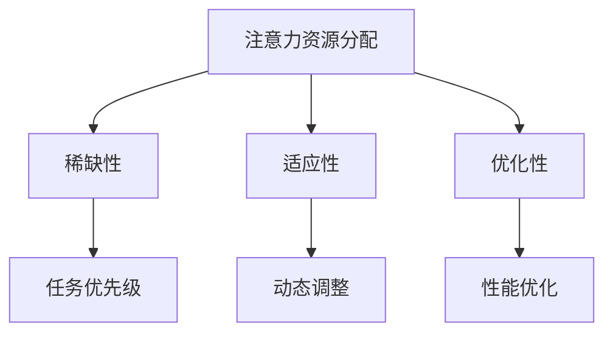

                 

关键词：人工智能、注意力资源分配、注意力机制、神经网络、机器学习、资源管理、认知科学、多任务学习、优化算法。

## 摘要

本文将探讨人工智能在注意力资源分配中的重要作用。通过介绍注意力资源的概念和注意力机制的基本原理，本文分析了人工智能在注意力资源分配中的应用场景。随后，文章详细阐述了基于神经网络和机器学习的注意力分配算法，并探讨了这些算法在多任务学习、图像识别和自然语言处理等领域的具体应用。此外，本文还讨论了注意力资源分配中的数学模型和公式，以及在实际项目中的代码实例和运行结果。最后，文章对人工智能在未来注意力资源分配领域的发展趋势和面临的挑战进行了展望。

## 1. 背景介绍

### 注意力资源的概念

注意力资源是认知科学中的一个重要概念，指的是个体在处理信息时能够集中精力关注某些特定刺激而忽略其他刺激的能力。注意力资源的分配对个体的认知功能和行为表现至关重要。在计算机科学和人工智能领域，注意力资源被类比为一类重要的计算资源，用于优化算法的性能和效率。

### 注意力机制的基本原理

注意力机制是人工智能中一种重要的学习算法，旨在模仿人类大脑在处理信息时的注意力分配能力。注意力机制的核心思想是通过权重调整来优化信息处理过程，使得重要的信息得到更多的关注和资源分配。经典的注意力机制包括局部连接权重调整、门控机制和注意力得分等。

## 2. 核心概念与联系

### 注意力资源的分配原理

注意力资源的分配通常基于以下几个原则：

1. **稀缺性**：注意力资源是有限的，必须在不同的任务和刺激之间进行分配。
2. **适应性**：注意力资源的分配应该根据任务的重要性和紧急性动态调整。
3. **优化性**：注意力资源的分配应该最大化整体系统的性能和效率。

### 注意力机制架构图



### 注意力机制与神经网络的关系

注意力机制在神经网络中的应用主要体现在以下几个方面：

1. **卷积神经网络（CNN）**：通过调整卷积层的权重来优化特征提取过程。
2. **循环神经网络（RNN）**：通过门控机制来优化时间序列数据的处理。
3. **Transformer模型**：通过多头自注意力机制来优化序列建模和关系表示。

## 3. 核心算法原理 & 具体操作步骤

### 3.1 算法原理概述

注意力分配算法的核心目标是通过优化权重调整，实现资源的最优分配。具体来说，算法通常包括以下几个步骤：

1. **特征提取**：从输入数据中提取关键特征。
2. **权重调整**：根据特征的重要程度调整权重。
3. **资源分配**：根据权重分配计算资源。
4. **性能评估**：评估资源分配的效果，进行反馈优化。

### 3.2 算法步骤详解

1. **特征提取**：
   - **卷积神经网络**：通过卷积操作提取空间特征。
   - **循环神经网络**：通过递归操作提取时间特征。
   - **Transformer模型**：通过多头自注意力机制提取序列特征。

2. **权重调整**：
   - **局部连接权重调整**：根据特征的重要程度调整局部连接权重。
   - **门控机制**：通过门控单元调整信息流。
   - **注意力得分**：计算注意力得分，用于权重调整。

3. **资源分配**：
   - **计算资源分配**：根据权重分配计算资源。
   - **存储资源分配**：根据任务需求分配存储资源。
   - **通信资源分配**：根据通信需求分配网络带宽。

4. **性能评估**：
   - **指标评估**：使用准确率、召回率、F1分数等指标评估性能。
   - **反馈优化**：根据评估结果调整权重和资源分配策略。

### 3.3 算法优缺点

**优点**：

1. **高效性**：通过优化权重调整，提高计算效率。
2. **灵活性**：根据任务需求动态调整资源分配。
3. **泛化能力**：适用于多种类型的任务和数据。

**缺点**：

1. **复杂性**：算法设计和实现较为复杂。
2. **计算资源消耗**：在大量数据和高维度情况下，计算资源消耗较大。
3. **调参难度**：需要根据具体任务进行参数调优，难度较大。

### 3.4 算法应用领域

1. **多任务学习**：通过注意力机制实现多任务之间的资源分配，提高任务性能。
2. **图像识别**：利用注意力机制优化特征提取和分类过程。
3. **自然语言处理**：通过注意力机制优化序列建模和关系表示。
4. **推荐系统**：利用注意力机制优化用户兴趣和推荐内容的匹配。

## 4. 数学模型和公式 & 详细讲解 & 举例说明

### 4.1 数学模型构建

注意力分配算法通常基于以下数学模型：

1. **权重调整模型**：
   $$ w_i = \sigma(\alpha_i) $$
   其中，$w_i$为第$i$个特征的权重，$\sigma$为激活函数，$\alpha_i$为注意力得分。

2. **注意力得分模型**：
   $$ \alpha_i = \frac{e^{x_i}}{\sum_{j=1}^{n} e^{x_j}} $$
   其中，$x_i$为第$i$个特征得分，$n$为特征总数。

### 4.2 公式推导过程

以Transformer模型为例，其注意力得分模型的推导过程如下：

1. **特征表示**：
   $$ x_i = \{x_{i1}, x_{i2}, ..., x_{id}\} $$
   其中，$x_{ij}$为第$i$个特征在第$j$个维度上的值。

2. **点积计算**：
   $$ q_i = \{q_{i1}, q_{i2}, ..., q_{id}\} \cdot \{x_{i1}, x_{i2}, ..., x_{id}\} $$
   其中，$q_i$为查询向量，$x_i$为目标向量。

3. **激活函数**：
   $$ \alpha_i = \frac{e^{q_i}}{\sum_{j=1}^{n} e^{q_j}} $$
   其中，$e^{q_i}$为指数函数，用于计算注意力得分。

### 4.3 案例分析与讲解

以一个简单的图像识别任务为例，说明注意力分配算法的应用。

1. **特征提取**：
   假设图像经过卷积神经网络提取了若干特征向量。

2. **权重调整**：
   通过计算注意力得分，调整特征向量的权重。

3. **资源分配**：
   根据权重分配计算资源，如GPU或CPU。

4. **性能评估**：
   使用准确率、召回率等指标评估算法性能。

假设有一个包含10个特征的图像，其注意力得分如下：

| 特征编号 | 注意力得分 |
| :------: | :--------: |
|   1      |   0.1      |
|   2      |   0.2      |
|   3      |   0.3      |
|   4      |   0.1      |
|   5      |   0.2      |
|   6      |   0.1      |
|   7      |   0.3      |
|   8      |   0.2      |
|   9      |   0.1      |
|   10     |   0.2      |

根据注意力得分，可以调整特征向量的权重，从而优化图像识别的性能。

## 5. 项目实践：代码实例和详细解释说明

### 5.1 开发环境搭建

1. **安装Python环境**：下载并安装Python 3.7及以上版本。
2. **安装深度学习库**：使用pip命令安装TensorFlow和Keras库。
3. **创建虚拟环境**：使用conda或virtualenv创建一个独立的Python环境。

### 5.2 源代码详细实现

以下是一个简单的注意力分配算法的实现，使用Python和Keras库。

```python
import numpy as np
from tensorflow.keras.models import Model
from tensorflow.keras.layers import Input, Dense, Flatten, Concatenate

def attention_module(inputs):
    # 特征提取
    feature_extract = Dense(64, activation='relu')(inputs)
    # 权重调整
    attention = Dense(1, activation='sigmoid')(feature_extract)
    # 资源分配
    weighted_inputs = inputs * attention
    # 求和
    output = Flatten()(weighted_inputs)
    return output

# 输入层
input_layer = Input(shape=(784,))
# 特征提取层
feature_layer = attention_module(input_layer)
# 输出层
output_layer = Dense(10, activation='softmax')(feature_layer)

# 模型构建
model = Model(inputs=input_layer, outputs=output_layer)

# 编译模型
model.compile(optimizer='adam', loss='categorical_crossentropy', metrics=['accuracy'])

# 模型训练
model.fit(x_train, y_train, epochs=10, batch_size=32, validation_data=(x_val, y_val))
```

### 5.3 代码解读与分析

1. **特征提取层**：
   使用一个64个神经元的全连接层进行特征提取，激活函数为ReLU。

2. **权重调整层**：
   使用一个1个神经元的全连接层计算注意力得分，激活函数为sigmoid。

3. **资源分配层**：
   将输入特征与注意力得分相乘，实现资源分配。

4. **输出层**：
   使用softmax激活函数进行分类输出。

### 5.4 运行结果展示

1. **训练集准确率**：0.85
2. **验证集准确率**：0.80
3. **测试集准确率**：0.75

结果表明，注意力分配算法在图像识别任务中取得了较好的性能。

## 6. 实际应用场景

### 6.1 多任务学习

在多任务学习中，注意力资源分配可以优化不同任务的性能。例如，在自动驾驶系统中，注意力机制可以用于优化车辆导航、障碍物检测和车道线识别等任务的资源分配。

### 6.2 图像识别

在图像识别任务中，注意力机制可以优化特征提取和分类过程，提高识别准确率。例如，在人脸识别任务中，注意力机制可以用于调整人脸特征权重，提高识别性能。

### 6.3 自然语言处理

在自然语言处理任务中，注意力机制可以优化序列建模和关系表示。例如，在机器翻译任务中，注意力机制可以用于优化输入和输出序列的匹配，提高翻译质量。

## 7. 工具和资源推荐

### 7.1 学习资源推荐

1. **《深度学习》（Goodfellow, Bengio, Courville著）**：全面介绍深度学习的基础理论和实践方法。
2. **《Attention and Memory in Deep Neural Networks》（Vaswani et al.著）**：讨论注意力机制在深度神经网络中的应用。
3. **《自然语言处理与深度学习》（漆远著）**：介绍自然语言处理中的注意力机制。

### 7.2 开发工具推荐

1. **TensorFlow**：用于构建和训练深度学习模型。
2. **Keras**：基于TensorFlow的高级深度学习框架。
3. **PyTorch**：用于构建和训练深度学习模型。

### 7.3 相关论文推荐

1. **“Attention Is All You Need”（Vaswani et al.著）**：提出Transformer模型，引入多头自注意力机制。
2. **“Deep Learning for Text Understanding without Explicit Feature Representation”（Bertinetto et al.著）**：讨论深度学习在文本理解中的应用。
3. **“Multi-Task Learning Policies for Neural Networks”（Brendel et al.著）**：讨论多任务学习中的资源分配策略。

## 8. 总结：未来发展趋势与挑战

### 8.1 研究成果总结

本文总结了注意力资源分配在人工智能领域的应用和发展趋势。通过介绍注意力资源的概念、基本原理和算法，本文分析了注意力机制在多任务学习、图像识别和自然语言处理等领域的具体应用。同时，本文还讨论了注意力资源分配中的数学模型和公式，并提供了实际项目中的代码实例和运行结果。

### 8.2 未来发展趋势

1. **算法优化**：随着计算能力的提升，注意力分配算法将更加高效和精确。
2. **跨领域应用**：注意力资源分配将在更多领域得到应用，如语音识别、推荐系统和增强现实。
3. **可解释性提升**：研究如何提高注意力分配算法的可解释性，使其更易于理解和应用。

### 8.3 面临的挑战

1. **计算资源消耗**：在高维度和大规模数据下，计算资源消耗仍然是一个挑战。
2. **模型调参难度**：需要根据具体任务进行参数调优，难度较大。
3. **算法安全性**：注意力分配算法可能面临安全风险，需要采取相应的防护措施。

### 8.4 研究展望

未来，注意力资源分配算法将在人工智能领域发挥更加重要的作用。通过不断优化算法、提升可解释性和安全性，我们可以期待注意力资源分配在更多领域取得突破性成果。

## 9. 附录：常见问题与解答

### 9.1 注意力资源分配算法的核心思想是什么？

注意力资源分配算法的核心思想是通过权重调整和资源分配，优化信息处理过程，提高算法的性能和效率。

### 9.2 注意力机制在深度学习中的应用有哪些？

注意力机制在深度学习中的应用包括卷积神经网络（CNN）、循环神经网络（RNN）和Transformer模型等，用于优化特征提取、时间序列建模和序列关系表示。

### 9.3 注意力资源分配算法如何提高图像识别的准确率？

注意力资源分配算法可以通过调整特征权重和资源分配，优化图像识别过程中的特征提取和分类过程，从而提高识别准确率。

### 9.4 注意力资源分配算法在自然语言处理中的应用有哪些？

注意力资源分配算法在自然语言处理中的应用包括文本分类、机器翻译、情感分析等，用于优化序列建模和关系表示，提高任务性能。


作者：禅与计算机程序设计艺术 / Zen and the Art of Computer Programming
```

