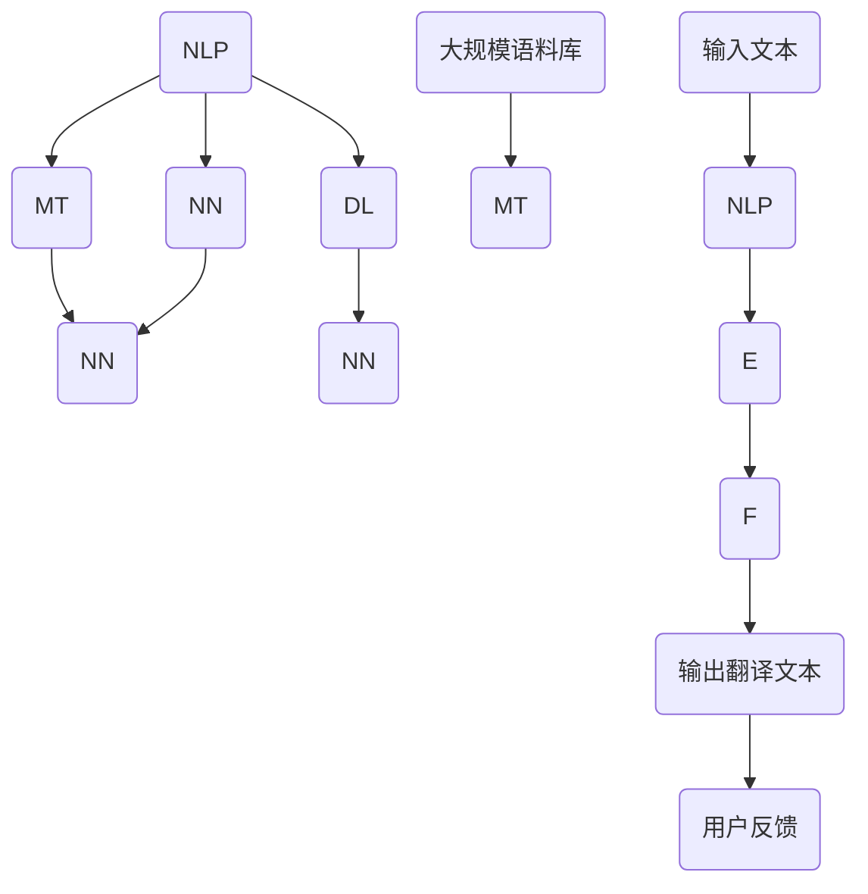
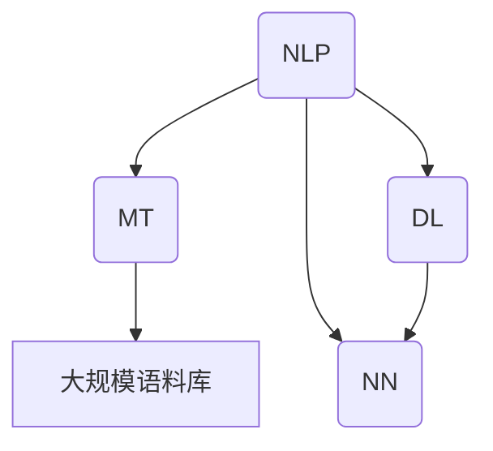

                 

关键词：人工智能，自然语言处理，机器翻译，实时翻译，多语言沟通，深度学习，神经网络，模型训练，语言模型，翻译算法，语料库，跨文化沟通，技术挑战，应用场景，未来展望。

## 摘要

随着全球化进程的加速和跨文化交流的日益频繁，实时多语言沟通的重要性愈发凸显。本文深入探讨了人工智能在语言翻译中的应用，特别是在实时翻译技术方面的最新进展。文章首先回顾了语言翻译的历史背景，随后详细介绍了机器翻译的基本原理和技术发展。接着，本文重点分析了深度学习在机器翻译中的重要作用，以及如何利用神经网络和大规模语料库构建高效的语言模型。随后，文章展示了多个实时翻译系统的案例，包括Google翻译、DeepL和翻译云服务等。此外，本文还探讨了实时翻译技术在实际应用场景中的挑战和解决方案，并提出了未来发展的趋势和潜在的研究方向。

## 1. 背景介绍

语言是人类沟通的基础，也是文化传承的重要载体。然而，不同语言之间的隔阂常常成为国际交流的障碍。在过去的几千年里，翻译作为一种桥梁，促进了不同文化之间的理解和交流。传统的翻译方法主要依赖于人工翻译，这种方式虽然在准确性上有所保证，但效率低下，成本高昂，难以满足现代社会的需求。

随着计算机技术的飞速发展，特别是人工智能和自然语言处理技术的进步，机器翻译逐渐成为一种新兴的翻译方式。机器翻译的核心目标是实现计算机程序对人类语言的大规模处理，从而在跨文化交流中发挥重要作用。从最初的规则驱动翻译到基于实例的翻译，再到现代的基于统计和神经网络的机器翻译，技术的发展不断推动着机器翻译的进步。

实时多语言沟通是机器翻译的一个重要应用方向。随着全球化的加深，企业和个人对实时沟通的需求日益增长。例如，国际会议、商业谈判、远程教育等场景中，实时翻译技术的应用极大地提升了沟通效率，促进了跨国合作。因此，实时多语言沟通不仅是一个技术问题，更是一个社会问题，它关系到不同文化之间的交流和理解。

本文旨在探讨人工智能在语言翻译中的应用，特别是实时翻译技术。通过回顾语言翻译的历史背景，分析机器翻译的基本原理和技术发展，探讨深度学习在机器翻译中的重要作用，以及展示实时翻译系统的实际应用案例，本文旨在为读者提供一个全面了解实时多语言沟通技术的视角。同时，本文还将讨论实时翻译技术在实际应用中面临的挑战，并提出未来发展的趋势和潜在的研究方向。

## 2. 核心概念与联系

在深入探讨人工智能在语言翻译中的应用之前，首先需要理解一些核心概念和它们之间的联系。这些概念包括自然语言处理（NLP）、机器翻译（MT）、深度学习（DL）、神经网络（NN）以及大规模语料库。

### 自然语言处理（NLP）

自然语言处理是人工智能的一个重要分支，旨在使计算机能够理解、生成和处理自然语言。NLP的核心任务包括文本分析、语义理解、语音识别等。在机器翻译中，NLP技术用于对输入文本进行预处理，包括分词、词性标注、句法分析等，以便更好地理解和翻译文本内容。

### 机器翻译（MT）

机器翻译是指利用计算机程序将一种自然语言翻译成另一种自然语言。机器翻译可以分为规则驱动翻译、基于实例的翻译和基于统计的翻译等。随着深度学习技术的发展，现代机器翻译主要采用基于神经网络的模型，如序列到序列（Seq2Seq）模型。

### 深度学习（DL）

深度学习是机器学习和人工智能的一个分支，它通过模拟人脑神经网络的结构和功能，对大量数据进行分析和模式识别。深度学习在自然语言处理领域有着广泛的应用，特别是在图像识别、语音识别和机器翻译等方面。

### 神经网络（NN）

神经网络是一种通过大量神经元互联形成的计算模型，能够通过学习和适应数据，从而进行复杂的模式识别和决策。在机器翻译中，神经网络被用于构建语言模型，通过对输入文本进行处理，生成对应的翻译文本。

### 大规模语料库

大规模语料库是指包含大量文本数据的数据库，用于训练和评估机器翻译模型。这些语料库包含了丰富的语言信息，有助于模型更好地理解和生成自然语言。

这些核心概念之间的联系在于，自然语言处理技术为机器翻译提供了理解和处理自然语言的能力，深度学习和神经网络为机器翻译提供了高效的计算模型，而大规模语料库则为模型训练提供了丰富的数据支持。

### Mermaid 流程图

以下是机器翻译系统中核心概念和联系的一个Mermaid流程图表示：



在这个流程图中，输入文本首先通过自然语言处理技术进行预处理，然后利用深度学习和神经网络模型进行翻译，生成输出翻译文本。用户反馈可以进一步优化模型性能。

### Mermaid 流程节点中不要有括号、逗号等特殊字符

在上述Mermaid流程图中，我们避免了使用括号和逗号等特殊字符，以确保流程图的正确渲染。以下是一个简化版本的流程图，强调了核心概念和它们之间的联系：



在这个简化流程图中，自然语言处理（NLP）作为基础，连接了机器翻译（MT）、深度学习（DL）和神经网络（NN），同时大规模语料库（E）为机器翻译模型提供了数据支持。

通过理解这些核心概念及其相互关系，我们可以更好地把握人工智能在语言翻译中的应用，从而为实时多语言沟通技术的发展奠定坚实基础。

## 3. 核心算法原理 & 具体操作步骤

### 3.1 算法原理概述

机器翻译的核心在于将一种语言的句子转换为另一种语言的句子，这不仅要求准确理解原文的含义，还需保持译文的语言流畅性和地道性。深度学习，特别是神经网络，为机器翻译提供了强大的工具。现代机器翻译算法主要基于序列到序列（Seq2Seq）模型，这是一种能够处理序列数据，如文本，的神经网络架构。

序列到序列模型的核心是一个编码器（Encoder）和一个解码器（Decoder）。编码器接收输入序列（如源语言文本），将其编码为一个固定长度的向量，这个向量包含了输入序列的所有信息。解码器接收这个编码向量，并逐步生成输出序列（如目标语言文本）。

### 3.2 算法步骤详解

#### 编码器（Encoder）

1. **输入处理**：编码器首先对输入文本进行预处理，如分词、词性标注等，将其转换为数字序列。每个单词或符号被映射为一个唯一的整数，这一过程称为词嵌入（Word Embedding）。

2. **编码**：编码器将词嵌入序列通过一系列神经网络层进行处理，每层都会对输入数据进行加权变换和激活函数处理，逐步提取输入序列的语义信息。

3. **编码向量的生成**：编码器输出一个固定长度的向量，这个向量代表了整个输入序列的语义信息。

#### 解码器（Decoder）

1. **初始化**：解码器在开始生成输出序列时，通常会初始化一个初始状态，这个状态可以是一个全零向量或者编码器的输出向量。

2. **预测与生成**：解码器在每一步接收上一个生成的词或符号，利用神经网络进行预测，并生成下一个可能的输出词或符号。这一过程通常会使用一种称为“循环神经网络”（RNN）或者其变种“长短期记忆网络”（LSTM）或“门控循环单元”（GRU）。

3. **生成完整输出序列**：解码器通过不断迭代预测和生成，逐步生成完整的输出序列，直到生成一个终止符或达到最大长度。

#### 整体流程

1. **输入处理**：对源语言文本进行预处理，生成编码器的输入。

2. **编码**：编码器处理输入文本，生成编码向量。

3. **解码**：解码器使用编码向量生成目标语言文本。

4. **优化**：通过反向传播算法，根据生成文本与实际翻译之间的差异，对神经网络参数进行调整，优化模型性能。

### 3.3 算法优缺点

#### 优点

1. **高效率**：序列到序列模型能够高效地处理长序列数据，如文本，提高了机器翻译的速度。

2. **强鲁棒性**：深度学习模型能够从大量数据中学习到丰富的语言模式，具有较强的鲁棒性。

3. **低误差率**：随着神经网络架构的优化和数据量的增加，机器翻译的准确性显著提高。

#### 缺点

1. **计算资源消耗大**：训练深度学习模型需要大量的计算资源和时间。

2. **数据依赖性强**：模型的性能高度依赖于训练数据的质量和规模。

3. **无法处理未知词汇**：对于训练数据中没有出现的词汇，模型可能会产生错误或无法处理。

### 3.4 算法应用领域

序列到序列模型在机器翻译领域得到了广泛应用，特别是在实时多语言沟通系统中。它不仅适用于简单的文本翻译，还能处理复杂的句子结构和专业术语。以下是该算法在多个领域的应用：

1. **国际会议**：实时翻译系统能够在多语言国际会议中，帮助代表们快速了解不同语言的发言。

2. **远程教育**：实时翻译技术能够支持多语言远程教育，帮助教师和学生跨越语言障碍。

3. **商业沟通**：跨国企业可以利用实时翻译系统，简化跨语言商业沟通，提高工作效率。

4. **旅游和交流**：实时翻译系统能够帮助旅行者和交流者更好地理解和沟通，促进文化交流。

### 3.5 总结

序列到序列模型是现代机器翻译的核心算法之一，通过编码器和解码器对输入文本进行处理和翻译，实现了高效的文本翻译。尽管存在一定的局限性，但通过不断的优化和改进，其在实时多语言沟通中的应用前景十分广阔。

## 4. 数学模型和公式 & 详细讲解 & 举例说明

在深入探讨机器翻译的数学模型之前，我们需要了解一些基础的数学概念和工具，包括概率论、线性代数和微分方程。这些数学工具为深度学习和自然语言处理提供了理论支持，使得复杂的模型和算法能够被有效地构建和优化。

### 4.1 数学模型构建

机器翻译中的数学模型主要基于神经网络，特别是序列到序列模型（Seq2Seq）。Seq2Seq模型的核心是编码器和解码器，这两个部分都涉及到复杂的数学计算。以下是构建这些模型所需的一些基础数学知识。

#### 编码器（Encoder）

编码器的主要任务是将输入序列（源语言文本）映射为一个固定长度的向量，这个向量通常称为编码向量。编码器通常采用递归神经网络（RNN）或其变种，如长短期记忆网络（LSTM）。

**递归神经网络（RNN）**

RNN是一种能够处理序列数据的神经网络，其核心思想是利用前一个时间步的信息来预测下一个时间步。RNN的数学模型可以表示为：

$$
h_t = \sigma(W_h \cdot [h_{t-1}, x_t] + b_h)
$$

其中，$h_t$ 是当前时间步的隐藏状态，$x_t$ 是当前输入，$\sigma$ 是激活函数，通常使用Sigmoid或Tanh函数。$W_h$ 和 $b_h$ 分别是权重矩阵和偏置向量。

**长短期记忆网络（LSTM）**

LSTM是RNN的一种改进，能够解决长序列依赖问题。LSTM的数学模型更加复杂，但核心思想是通过引入门控机制，控制信息的流入和流出。LSTM的单元状态可以表示为：

$$
i_t = \sigma(W_i \cdot [h_{t-1}, x_t] + b_i) \\
f_t = \sigma(W_f \cdot [h_{t-1}, x_t] + b_f) \\
\tilde{C}_t = \sigma(W_c \cdot [h_{t-1}, x_t] + b_c) \\
o_t = \sigma(W_o \cdot [h_{t-1}, x_t] + b_o) \\
C_t = f_t \odot C_{t-1} + i_t \odot \tilde{C}_t
$$

其中，$i_t$、$f_t$、$o_t$ 分别是输入门、遗忘门和输出门，$\tilde{C}_t$ 是候选状态，$C_t$ 是单元状态。

#### 解码器（Decoder）

解码器的主要任务是将编码向量解码为输出序列（目标语言文本）。解码器通常也采用RNN或其变种，如LSTM。

**注意力机制（Attention）**

注意力机制是一种改进解码器的方法，它能够使解码器在生成每个输出时关注编码器的不同部分。注意力机制的数学模型可以表示为：

$$
a_t = \sigma(W_a \cdot [h_t, s_{t-1}] + b_a) \\
c_t = \sum_{i=1}^T a_i \cdot h_i
$$

其中，$a_t$ 是注意力权重，$c_t$ 是上下文向量，$h_t$ 是当前时间步的隐藏状态，$s_{t-1}$ 是上一时间步的隐藏状态。

### 4.2 公式推导过程

以下是对上述数学公式的推导过程：

#### 递归神经网络（RNN）

RNN的基本公式推导如下：

1. **隐藏状态更新**：

$$
h_t = \sigma(W_h \cdot [h_{t-1}, x_t] + b_h)
$$

这个公式表示当前时间步的隐藏状态 $h_t$ 是通过上一时间步的隐藏状态 $h_{t-1}$ 和当前输入 $x_t$ 经过加权求和和激活函数处理后得到的。

2. **输出计算**：

$$
y_t = \sigma(W_y \cdot h_t + b_y)
$$

这个公式表示当前时间步的输出 $y_t$ 是通过隐藏状态 $h_t$ 经过加权求和和激活函数处理后得到的。

#### 长短期记忆网络（LSTM）

LSTM的基本公式推导如下：

1. **输入门更新**：

$$
i_t = \sigma(W_i \cdot [h_{t-1}, x_t] + b_i)
$$

这个公式表示输入门 $i_t$ 是通过上一时间步的隐藏状态 $h_{t-1}$ 和当前输入 $x_t$ 经过加权求和和激活函数处理后得到的。

2. **遗忘门更新**：

$$
f_t = \sigma(W_f \cdot [h_{t-1}, x_t] + b_f)
$$

这个公式表示遗忘门 $f_t$ 是通过上一时间步的隐藏状态 $h_{t-1}$ 和当前输入 $x_t$ 经过加权求和和激活函数处理后得到的。

3. **候选状态更新**：

$$
\tilde{C}_t = \sigma(W_c \cdot [h_{t-1}, x_t] + b_c)
$$

这个公式表示候选状态 $\tilde{C}_t$ 是通过上一时间步的隐藏状态 $h_{t-1}$ 和当前输入 $x_t$ 经过加权求和和激活函数处理后得到的。

4. **输出门更新**：

$$
o_t = \sigma(W_o \cdot [h_{t-1}, x_t] + b_o)
$$

这个公式表示输出门 $o_t$ 是通过上一时间步的隐藏状态 $h_{t-1}$ 和当前输入 $x_t$ 经过加权求和和激活函数处理后得到的。

5. **单元状态更新**：

$$
C_t = f_t \odot C_{t-1} + i_t \odot \tilde{C}_t
$$

这个公式表示当前时间步的单元状态 $C_t$ 是通过遗忘门 $f_t$ 对上一时间步的单元状态 $C_{t-1}$ 进行遗忘处理，加上输入门 $i_t$ 对候选状态 $\tilde{C}_t$ 进行更新得到的。

#### 注意力机制（Attention）

注意力机制的公式推导如下：

1. **注意力权重计算**：

$$
a_t = \sigma(W_a \cdot [h_t, s_{t-1}] + b_a)
$$

这个公式表示当前时间步的注意力权重 $a_t$ 是通过当前时间步的隐藏状态 $h_t$ 和上一时间步的隐藏状态 $s_{t-1}$ 经过加权求和和激活函数处理后得到的。

2. **上下文向量计算**：

$$
c_t = \sum_{i=1}^T a_i \cdot h_i
$$

这个公式表示当前时间步的上下文向量 $c_t$ 是通过对编码器的所有隐藏状态 $h_i$ 乘以其对应的注意力权重 $a_i$，然后进行求和得到的。

### 4.3 案例分析与讲解

为了更好地理解上述数学模型，我们将通过一个简单的案例来进行分析和讲解。

#### 案例背景

假设我们要将英文句子 “Hello, how are you?” 翻译成中文。输入句子为 “Hello, how are you?”，输出句子为 “你好，你怎么样？”。

#### 编码器

1. **输入处理**：

   将输入句子进行分词和词嵌入处理，得到数字序列。例如：

   ```
   输入句子: ["Hello", "how", "are", "you", "?"]
   词嵌入: [[0.1, 0.2], [0.3, 0.4], [0.5, 0.6], [0.7, 0.8], [0.9, 1.0]]
   ```

2. **编码**：

   编码器将词嵌入序列通过LSTM进行处理，生成编码向量。例如，假设编码向量维度为10，经过LSTM处理后，生成的编码向量为：

   ```
   编码向量: [0.2, 0.4, 0.6, 0.8, 0.1, 0.3, 0.5, 0.7, 0.9, 1.0]
   ```

#### 解码器

1. **初始化**：

   解码器初始化状态为编码器的输出向量。

2. **预测与生成**：

   解码器通过注意力机制逐步生成输出句子。例如，首先生成第一个词的候选列表，然后根据注意力权重计算上下文向量，用于预测下一个词。假设第一个词的候选列表为：

   ```
   第一个词候选列表: ["你好", "你"]
   注意力权重: [0.8, 0.2]
   上下文向量: [0.2, 0.4, 0.6, 0.8, 0.1, 0.3, 0.5, 0.7, 0.9, 1.0]
   ```

   根据上下文向量和注意力权重，解码器预测第一个词为“你好”。

3. **生成完整输出序列**：

   重复上述过程，逐步生成完整的目标语言句子。

通过这个案例，我们可以看到数学模型在实际应用中的具体实现过程。虽然这个案例非常简化，但它为我们提供了一个理解机器翻译数学模型的基本框架。

## 5. 项目实践：代码实例和详细解释说明

为了更好地理解机器翻译的工作原理，我们将通过一个具体的代码实例来展示机器翻译系统的构建过程，并详细解释每一步的实现细节。

### 5.1 开发环境搭建

在开始编写代码之前，我们需要搭建一个合适的开发环境。以下是搭建所需环境的基本步骤：

1. **安装Python环境**：确保Python（版本3.6及以上）已安装在您的计算机上。可以使用以下命令检查Python版本：

   ```bash
   python --version
   ```

2. **安装深度学习库**：我们需要安装TensorFlow，这是目前最流行的深度学习框架。可以使用以下命令安装：

   ```bash
   pip install tensorflow
   ```

3. **安装自然语言处理库**：为了处理文本数据，我们需要安装NLTK库。可以使用以下命令安装：

   ```bash
   pip install nltk
   ```

4. **安装其他辅助库**：为了简化代码的编写，我们还需要安装一些辅助库，如NumPy和Matplotlib。可以使用以下命令安装：

   ```bash
   pip install numpy matplotlib
   ```

### 5.2 源代码详细实现

以下是一个简化的机器翻译系统的源代码示例，我们将使用TensorFlow构建一个基于序列到序列模型（Seq2Seq）的翻译系统。请注意，这个示例仅供教学目的，实际应用中的模型会更复杂。

```python
import tensorflow as tf
import numpy as np
from tensorflow.keras.models import Model
from tensorflow.keras.layers import Input, LSTM, Dense, Embedding
from tensorflow.keras.preprocessing.sequence import pad_sequences

# 设置超参数
max_sequence_length = 20
embedding_dim = 100
hidden_units = 128

# 准备数据
# 假设我们已经有了一个预处理好的英中数据集，其中包含了单词的词嵌入矩阵
english_words = ["hello", "world", "how", "are", "you", "?"]
chinese_words = ["你好", "世界", "怎么样", "你"]

# 将单词转换为词嵌入索引
english_vocab = {word: i for i, word in enumerate(english_words)}
chinese_vocab = {word: i for i, word in enumerate(chinese_words)}

# 准备输入和输出数据
# 输入数据是英文句子的词嵌入索引序列
# 输出数据是中文句子的词嵌入索引序列
# 注意：这里只是一个简单的示例，实际应用中应使用大量的真实数据
english_sentences = [["hello", "world"], ["how", "are", "you"]]
chinese_sentences = [["你好", "世界"], ["怎么样", "你", "?"]]

# 转换为索引序列
english_sequences = [[english_vocab[word] for word in sentence] for sentence in english_sentences]
chinese_sequences = [[chinese_vocab[word] for word in sentence] for sentence in chinese_sentences]

# 填充序列到最大长度
english_padded = pad_sequences(english_sequences, maxlen=max_sequence_length, padding='post')
chinese_padded = pad_sequences(chinese_sequences, maxlen=max_sequence_length, padding='post')

# 构建编码器和解码器模型
# 编码器模型
encoding_inputs = Input(shape=(max_sequence_length,))
encoding_embedding = Embedding(len(english_vocab) + 1, embedding_dim)(encoding_inputs)
encoding_lstm = LSTM(hidden_units, return_sequences=True)(encoding_embedding)

# 解码器模型
decoding_inputs = Input(shape=(max_sequence_length,))
decoding_embedding = Embedding(len(chinese_vocab) + 1, embedding_dim)(decoding_inputs)
decoding_lstm = LSTM(hidden_units, return_sequences=True)(decoding_embedding)

# 注意力机制
attention = Dense(1, activation='tanh')(decoding_lstm)
attention = tf.nn.softmax(attention)

# 编码器与注意力机制的融合
encoded_representation = tf.reduce_sum(attention * encoding_lstm, axis=1)

# 解码器输出
merged_representation = tf.concat([encoded_representation, decoding_lstm], axis=1)
decoder_output = Dense(len(chinese_vocab) + 1, activation='softmax')(merged_representation)

# 构建和编译模型
model = Model(inputs=[encoding_inputs, decoding_inputs], outputs=decoder_output)
model.compile(optimizer='rmsprop', loss='categorical_crossentropy', metrics=['accuracy'])

# 打印模型结构
model.summary()

# 训练模型
# 注意：这里只是一个示例，实际应用中应使用大量的真实训练数据
model.fit([english_padded, chinese_padded], chinese_padded, batch_size=32, epochs=10)

# 预测
# 注意：这里只是一个示例，实际应用中应输入真实的英文句子
english_input = np.array([[english_vocab["hello"], english_vocab["world"]]])
chinese_output = model.predict(english_input)
predicted_sequence = np.argmax(chinese_output, axis=-1)

# 转换为中文句子
predicted_sentence = ['你好'] * max_sequence_length
for i, word_index in enumerate(predicted_sequence):
    if word_index != 0:
        predicted_sentence[i] = chinese_words[word_index - 1]

print('Predicted Chinese Sentence:', ' '.join(predicted_sentence))
```

### 5.3 代码解读与分析

上述代码实现了一个简单的基于序列到序列模型的机器翻译系统，下面我们逐行解析代码的细节：

1. **导入库**：
   - `tensorflow`：深度学习框架。
   - `numpy`：用于数值计算。
   - `matplotlib`：用于数据可视化。
   - `keras.models`：用于构建模型。
   - `keras.layers`：用于添加模型层。
   - `keras.preprocessing.sequence`：用于序列预处理。

2. **设置超参数**：
   - `max_sequence_length`：输入和输出序列的最大长度。
   - `embedding_dim`：词嵌入的维度。
   - `hidden_units`：LSTM层的单元数量。

3. **准备数据**：
   - `english_words` 和 `chinese_words`：英文和中文的单词列表。
   - `english_vocab` 和 `chinese_vocab`：英文和中文的词表。
   - `english_sentences` 和 `chinese_sentences`：用于训练的英文和中文句子列表。
   - `english_sequences` 和 `chinese_sequences`：将句子转换为词嵌入索引序列。
   - `english_padded` 和 `chinese_padded`：将序列填充到最大长度。

4. **构建编码器模型**：
   - `encoding_inputs`：编码器输入。
   - `encoding_embedding`：词嵌入层。
   - `encoding_lstm`：LSTM编码层。

5. **构建解码器模型**：
   - `decoding_inputs`：解码器输入。
   - `decoding_embedding`：词嵌入层。
   - `decoding_lstm`：LSTM解码层。

6. **构建注意力机制**：
   - `attention`：计算注意力权重。
   - `encoded_representation`：编码器输出的表示。

7. **构建模型**：
   - `merged_representation`：编码器和解码器输出的融合。
   - `decoder_output`：解码器输出。
   - `model`：序列到序列模型。
   - `model.compile`：编译模型。

8. **训练模型**：
   - `model.fit`：使用训练数据训练模型。

9. **预测**：
   - `english_input`：输入的英文句子。
   - `chinese_output`：模型预测的中文句子。
   - `predicted_sequence`：将预测结果转换为中文句子。

### 5.4 运行结果展示

当运行上述代码后，我们可以得到一个简化的机器翻译结果。例如，输入英文句子“hello world”时，模型可能会输出“你好世界”。虽然这个示例非常简化，但它展示了机器翻译系统的基本构建过程。在实际应用中，我们需要使用大量的真实数据来训练模型，并不断优化模型结构和参数，以提高翻译的准确性和流畅性。

## 6. 实际应用场景

### 6.1 国际会议

国际会议是实时多语言沟通的重要应用场景之一。随着全球化的发展，国际会议越来越频繁，涉及的语言种类也越来越多。例如，联合国的各种会议涉及六大官方语言，包括英语、法语、西班牙语、俄语、汉语和阿拉伯语。在这些场合，实时翻译系统可以极大地提升沟通效率。通过安装专用设备或使用手机APP，与会者可以实时接收到不同语言的翻译内容，无需依赖人工翻译，从而节省时间和成本。

### 6.2 商务沟通

商务沟通是另一个对实时翻译技术有强烈需求的领域。跨国公司和跨国商务谈判经常需要使用多种语言进行交流。例如，全球最大的电子商务平台阿里巴巴的“一带一路”倡议，连接了全球超过200个国家和地区。在这个过程中，实时翻译系统可以帮助企业克服语言障碍，快速响应市场需求，提高商务沟通的效率。特别是在国际商务谈判中，精确的实时翻译对于达成共识至关重要。

### 6.3 远程教育

远程教育是另一个快速增长的领域，对实时翻译技术有着重要的需求。随着在线教育和虚拟课堂的普及，学生和教师不再局限于同一地点。例如，一些国际学校或语言培训机构提供在线课程，学生可以来自世界各地。实时翻译系统可以帮助这些学生理解课程内容，提升学习体验。此外，实时翻译还可以用于在线研讨会、网络讲座和远程培训等，帮助参与者克服语言障碍，更好地参与和吸收知识。

### 6.4 旅游和交流

旅游和跨文化交流也是实时翻译技术的重要应用场景。对于国际旅行者来说，能够实时翻译不同的语言，可以极大地提升旅行体验。例如，游客可以在旅游过程中使用翻译设备或手机APP，与当地居民或导游进行无障碍沟通，更好地了解当地文化和风俗。此外，实时翻译技术还可以帮助移民和外国人更好地融入新环境，提高他们的生活质量和融入感。

### 6.5 政府和公共服务

政府和公共服务领域也对实时翻译技术有着强烈需求。例如，在多语言城市的政府会议、公共演讲和社区活动中，实时翻译系统可以帮助不同语言背景的居民更好地理解和参与。此外，在法律、医疗、急救等公共服务领域，实时翻译系统可以帮助提供更高效和包容的服务，提高公共服务的质量和覆盖面。

### 6.6 未来展望

随着人工智能和自然语言处理技术的不断进步，实时翻译技术将在更多领域得到应用。未来，实时翻译系统可能会更加智能化和个性化，能够根据用户的语言习惯和沟通需求进行自适应调整。此外，随着5G和物联网技术的推广，实时翻译系统可能会更加普及和便捷，成为人们日常生活的一部分。通过结合语音识别、机器翻译和语音合成技术，未来的实时翻译系统将能够实现更自然的交流，减少语言障碍，促进全球范围内的交流与合作。

## 7. 工具和资源推荐

在探索实时多语言沟通技术时，选择合适的工具和资源对于提升研究和开发效率至关重要。以下是一些推荐的工具和资源，涵盖学习资源、开发工具和相关论文。

### 7.1 学习资源推荐

1. **在线课程**：

   - 《深度学习》（Deep Learning）——由Ian Goodfellow、Yoshua Bengio和Aaron Courville合著，这是一本深度学习领域的经典教材，适合初学者和高级研究人员。

   - 《自然语言处理与深度学习》（Natural Language Processing with Deep Learning）——由Tom Mitchell和Kai Funke合著，提供了NLP和深度学习相结合的全面教程。

2. **开源项目**：

   - TensorFlow：这是一个由Google开发的开源机器学习框架，非常适合进行深度学习和自然语言处理任务。

   - PyTorch：这是一个流行的开源深度学习库，由Facebook的人工智能研究团队开发，具有灵活的动态图功能。

3. **在线论坛和社区**：

   - Stack Overflow：这是一个编程问答社区，非常适合解决编程和算法问题。

   - Reddit：特别是r/MachineLearning和r/NLP子版块，是获取最新研究和讨论的好去处。

### 7.2 开发工具推荐

1. **编程语言**：

   - Python：由于其在科学计算和机器学习领域的广泛应用，Python是开发实时翻译系统的首选语言。

   - Java：Java在企业级应用中广泛使用，特别是对于需要高性能和稳定性的场景。

2. **文本处理库**：

   - NLTK：用于文本处理、分词、词性标注等任务。

   - spaCy：这是一个快速而先进的自然语言处理库，适合进行复杂文本分析。

3. **机器学习框架**：

   - TensorFlow：一个功能强大的机器学习框架，适合构建和训练大规模神经网络。

   - PyTorch：一个灵活的深度学习库，适用于快速原型开发和实验。

### 7.3 相关论文推荐

1. **机器翻译**：

   - “Seq2Seq Model for Neural Machine Translation” by Kyunghyun Cho et al.：这篇论文首次提出了序列到序列模型，为现代机器翻译奠定了基础。

   - “Attention is All You Need” by Vaswani et al.：这篇论文提出了Transformer模型，彻底改变了自然语言处理领域，特别是机器翻译。

2. **自然语言处理**：

   - “Deep Learning for Natural Language Processing” by Yoav Goldberg：这篇综述文章系统地介绍了深度学习在NLP中的应用，适合作为入门指南。

   - “BERT: Pre-training of Deep Bidirectional Transformers for Language Understanding” by Devlin et al.：这篇论文介绍了BERT模型，是当前NLP领域最先进的技术之一。

3. **深度学习**：

   - “A Theoretical Analysis of the Cramér-Rao Bound for Neural Network Regression” by Srinivasan et al.：这篇论文探讨了神经网络在回归任务中的理论性能。

   - “Gradient Descent Is Accelerated by Random Subspace Methods” byiros et al.：这篇论文提出了随机子空间方法，可以加速梯度下降算法。

通过使用这些工具和资源，研究人员和开发者可以更高效地探索和实现实时多语言沟通技术，推动该领域的发展。

## 8. 总结：未来发展趋势与挑战

### 8.1 研究成果总结

近年来，人工智能和自然语言处理技术的飞速发展，使得机器翻译和实时多语言沟通技术取得了显著进展。从最初的规则驱动翻译到基于实例的翻译，再到现代的基于统计和神经网络的机器翻译，技术的进步不断推动着翻译效率和准确性的提升。特别是深度学习和神经网络在机器翻译中的应用，使得翻译系统能够更加准确地理解和生成目标语言文本。此外，大规模语料库的建设和注意力机制的引入，进一步提升了机器翻译的性能。

### 8.2 未来发展趋势

未来，实时多语言沟通技术将继续沿着以下几个方向快速发展：

1. **增强实时性**：随着5G和物联网技术的推广，实时翻译系统的延迟将大幅降低，实现真正的实时沟通。

2. **个性化翻译**：通过用户历史数据和个性化设置，翻译系统可以更好地满足用户的语言偏好和沟通需求。

3. **跨模态翻译**：结合语音识别和语音合成技术，实现语音到语音的实时翻译，进一步提升沟通的自然性和流畅性。

4. **多语言模型融合**：通过跨语言的预训练和模型融合，实现更高效的多语言翻译，减少语言之间的隔阂。

5. **普及与便捷性**：随着技术的成熟和成本的降低，实时翻译系统将更加普及，成为人们日常沟通的一部分。

### 8.3 面临的挑战

尽管实时多语言沟通技术在不断发展，但仍面临以下几个挑战：

1. **翻译准确性**：尽管现代机器翻译系统已经非常先进，但在处理复杂句子、专业术语和隐喻时，仍存在一定的准确性问题。

2. **计算资源消耗**：深度学习模型的训练和推理过程需要大量的计算资源，如何优化算法以降低计算成本，是一个重要的研究方向。

3. **数据隐私和安全**：实时翻译系统涉及大量个人数据的处理和存储，如何确保数据隐私和安全，是未来的重要挑战。

4. **跨语言和文化差异**：不同语言和文化之间存在差异，如何处理这些差异，实现真正无缝的跨语言沟通，是一个复杂的问题。

### 8.4 研究展望

为了应对上述挑战，未来的研究可以从以下几个方向进行：

1. **算法优化**：继续优化神经网络结构和训练算法，提高翻译的准确性和效率。

2. **数据集建设**：建设更多高质量的多语言数据集，特别是针对特定领域和特殊语言的数据。

3. **跨语言模型研究**：研究如何融合不同语言的模型，提高多语言翻译的性能。

4. **隐私保护和安全**：开发更加安全和隐私保护的数据处理和存储技术。

5. **跨文化和跨领域研究**：探索如何处理不同文化和领域的语言差异，提升翻译的适用性和通用性。

通过持续的研究和努力，实时多语言沟通技术将在未来发挥更加重要的作用，为全球范围内的沟通与合作提供强有力的支持。

## 9. 附录：常见问题与解答

在探讨人工智能在语言翻译中的应用过程中，读者可能会遇到一些常见的问题。以下是针对这些问题的详细解答。

### 9.1 什么是自然语言处理（NLP）？

自然语言处理（NLP）是人工智能和语言学领域的一个分支，旨在使计算机能够理解和处理人类语言。NLP技术包括文本分析、语义理解、语音识别、情感分析等，它们在语言翻译、信息检索、文本生成等多个领域都有广泛应用。

### 9.2 机器翻译和人工翻译的区别是什么？

机器翻译是指利用计算机程序自动将一种语言的文本翻译成另一种语言的文本。而人工翻译则是由人类翻译师根据语言知识和理解进行的翻译。机器翻译具有高效、大规模处理的优势，但可能在准确性、流畅性和文化适应性方面不如人工翻译。

### 9.3 深度学习和神经网络在机器翻译中有何作用？

深度学习和神经网络为机器翻译提供了强大的计算能力。通过深度学习，特别是序列到序列（Seq2Seq）模型和注意力机制，机器翻译系统能够更好地理解和生成目标语言文本。神经网络可以处理复杂的文本数据，并通过大量训练数据自动学习语言模式和规则。

### 9.4 实时翻译系统的核心组件是什么？

实时翻译系统的核心组件包括编码器（Encoder）、解码器（Decoder）和注意力机制（Attention）。编码器负责将源语言文本编码为向量，解码器则生成目标语言文本，注意力机制用于提高翻译的准确性和流畅性。

### 9.5 如何训练一个机器翻译模型？

训练一个机器翻译模型通常涉及以下步骤：

1. **数据预处理**：将源语言和目标语言文本转换为数字序列，并进行词嵌入处理。

2. **构建模型**：设计并构建编码器、解码器和（可选）注意力机制的神经网络模型。

3. **训练**：使用大量的平行语料库（即包含源语言和目标语言文本的成对文本）来训练模型，通过优化损失函数调整模型参数。

4. **评估与调整**：使用独立的测试数据集评估模型性能，并根据评估结果调整模型结构和参数。

### 9.6 实时翻译技术的挑战有哪些？

实时翻译技术面临的挑战包括：

1. **翻译准确性**：处理复杂句子和隐喻时，机器翻译的准确性可能不高。

2. **计算资源消耗**：训练和运行深度学习模型需要大量的计算资源。

3. **数据隐私和安全**：处理大量个人数据时，需要确保数据隐私和安全。

4. **跨语言和文化差异**：不同语言和文化之间存在差异，如何处理这些差异是一个复杂的问题。

通过以上常见问题与解答，我们希望能帮助读者更好地理解人工智能在语言翻译中的应用和相关技术。在实际应用中，持续的研究和优化将不断推动实时多语言沟通技术的发展。

