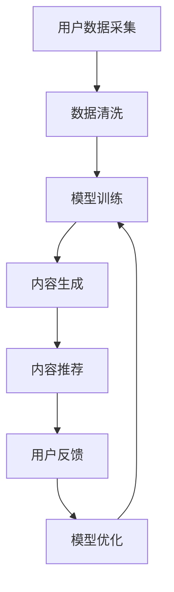

                 

 关键词：人工智能、知识付费、内容生产、技术创新、学习模式、个性化推荐

> 摘要：本文旨在探讨人工智能如何通过技术创新重塑知识付费的内容生产模式。文章首先介绍了知识付费的现状和问题，随后分析了人工智能在内容生产中的作用和挑战，并提出了未来发展的趋势和方向。通过深入剖析，本文揭示了人工智能如何为知识付费行业带来革命性的变化，以及如何通过个性化推荐和智能算法提高内容质量和用户满意度。

## 1. 背景介绍

### 知识付费的定义与现状

知识付费，作为一种新兴的商业模式，指的是用户为了获取特定领域的知识和技能，付费购买相关的内容和服务。随着互联网技术的发展，尤其是移动互联网和社交媒体的普及，知识付费市场呈现出快速增长的趋势。用户需求多样，内容涵盖教育、职业培训、健康养生、心理咨询等多个领域。

然而，知识付费市场也面临一些问题。首先，内容质量参差不齐，部分知识产品缺乏权威性和实用性。其次，传统知识付费平台存在信息过载、个性化不足等问题，无法满足用户日益增长的需求。此外，知识付费市场还存在盗版问题，对原创内容创作者的权益造成侵害。

### 人工智能在知识付费中的应用

人工智能（AI）作为当前科技领域的前沿技术，已逐步应用于知识付费的内容生产、推荐、评价等各个环节。AI技术不仅可以提升内容生产的效率和质量，还可以通过智能算法实现个性化推荐，提高用户体验。以下将详细探讨人工智能在知识付费领域的应用及其对内容生产的影响。

## 2. 核心概念与联系

### 人工智能在内容生产中的核心概念

#### 数据采集与处理

数据采集与处理是人工智能在知识付费内容生产中的第一步。通过数据挖掘和清洗技术，可以从各种来源获取有价值的数据，如用户行为数据、学习历史数据、内容评价数据等。这些数据为后续的智能分析和推荐提供了基础。

#### 模型训练与优化

基于收集到的数据，可以训练和优化各种机器学习模型，如推荐算法、分类算法、生成对抗网络等。这些模型可以自动识别用户的兴趣和需求，生成个性化的内容推荐。

#### 生成式对抗网络（GAN）

生成式对抗网络（GAN）是一种通过两个神经网络（生成器和判别器）之间的对抗训练生成高质量内容的模型。在知识付费内容生产中，GAN可以用于生成原创文章、课程内容等，提高内容多样性。

### 人工智能在内容生产中的架构图

以下是一个简单的Mermaid流程图，展示人工智能在知识付费内容生产中的架构：



### 人工智能与知识付费内容的联系

人工智能与知识付费内容生产密切相关。通过智能算法，可以更精准地识别用户需求，提高内容推荐的准确性。同时，人工智能技术可以帮助创作者更高效地生产高质量内容，降低创作成本。此外，AI还可以对用户行为进行分析，优化内容结构和传播策略，提高用户满意度和留存率。

## 3. 核心算法原理 & 具体操作步骤

### 3.1 算法原理概述

在知识付费领域，核心算法主要包括推荐算法和生成式对抗网络（GAN）。

#### 推荐算法

推荐算法是基于用户行为数据、内容特征和用户偏好等信息，为用户推荐感兴趣的知识内容。常见推荐算法包括协同过滤、基于内容的推荐和混合推荐等。

- **协同过滤**：通过分析用户之间的相似度，发现潜在的兴趣匹配，推荐相似用户喜欢的知识内容。
- **基于内容的推荐**：根据知识内容的属性和标签，为用户推荐与其兴趣相关的知识内容。
- **混合推荐**：结合协同过滤和基于内容的推荐，提高推荐效果。

#### 生成式对抗网络（GAN）

生成式对抗网络（GAN）是一种通过两个神经网络（生成器和判别器）之间的对抗训练生成高质量内容的模型。生成器负责生成知识内容，判别器负责判断生成内容是否真实。通过不断的对抗训练，生成器的生成能力逐步提高，从而生成更具创意和价值的知识内容。

### 3.2 算法步骤详解

#### 推荐算法步骤

1. **用户行为数据收集**：从知识付费平台获取用户浏览、购买、评价等行为数据。
2. **内容特征提取**：对知识内容进行特征提取，如文本特征、标签特征、时间特征等。
3. **构建推荐模型**：选择合适的推荐算法，如协同过滤、基于内容的推荐或混合推荐算法，构建推荐模型。
4. **推荐内容生成**：根据用户兴趣和内容特征，生成个性化推荐列表。
5. **用户反馈**：收集用户对推荐内容的反馈，用于模型优化和调整。

#### 生成式对抗网络（GAN）步骤

1. **数据预处理**：对知识内容进行预处理，如文本清洗、分词、编码等。
2. **生成器和判别器网络架构设计**：设计生成器和判别器的神经网络架构。
3. **对抗训练**：通过生成器和判别器的对抗训练，不断优化生成器的生成能力。
4. **生成内容评估**：对生成的内容进行评估，如文本质量、创意度等。
5. **生成内容应用**：将生成的知识内容应用于知识付费平台，提供多样化的内容选择。

### 3.3 算法优缺点

#### 推荐算法优缺点

- **优点**：
  - 提高内容推荐的准确性和个性化程度；
  - 降低用户获取知识内容的成本和时间；
  - 提高用户满意度和留存率。

- **缺点**：
  - 数据依赖性强，需要大量用户行为数据；
  - 模型复杂度较高，训练和部署成本较大；
  - 可能导致用户陷入信息茧房，限制视野。

#### 生成式对抗网络（GAN）优缺点

- **优点**：
  - 能够生成高质量的原创知识内容，提高内容多样性和创新性；
  - 降低创作者的劳动成本，提高创作效率；
  - 提供丰富的内容选择，满足用户个性化需求。

- **缺点**：
  - 模型训练难度大，对计算资源和时间要求较高；
  - 生成内容的真实性和质量难以保证；
  - 可能引发版权和道德争议。

### 3.4 算法应用领域

推荐算法和生成式对抗网络（GAN）在知识付费领域具有广泛的应用前景。以下为部分应用领域：

- **教育领域**：为用户提供个性化的学习路径和课程推荐，提高学习效果和用户满意度；
- **职业培训领域**：为职场人士提供定制化的培训课程和职业发展建议；
- **健康养生领域**：根据用户健康状况和需求，推荐合适的健康知识和产品；
- **心理咨询领域**：为用户提供个性化的心理咨询方案和资源推荐。

## 4. 数学模型和公式 & 详细讲解 & 举例说明

### 4.1 数学模型构建

在知识付费领域，常用的数学模型包括推荐算法中的协同过滤模型和生成式对抗网络（GAN）模型。以下分别介绍这两种模型的基本数学公式。

#### 协同过滤模型

协同过滤模型主要通过用户-物品评分矩阵来预测用户对未知物品的评分。其基本公式如下：

$$
R_{ui} = \sum_{j \in N_i} \frac{sim(u, j) \cdot r_{ji}}{||sim(u, j)||}
$$

其中，$R_{ui}$ 表示用户 $u$ 对物品 $i$ 的预测评分，$sim(u, j)$ 表示用户 $u$ 和 $j$ 之间的相似度，$r_{ji}$ 表示用户 $j$ 对物品 $i$ 的实际评分。

#### 生成式对抗网络（GAN）模型

生成式对抗网络（GAN）由生成器和判别器组成，其基本数学公式如下：

- **生成器**：

$$
G(z) = \mathcal{N}(z; 0, I)
$$

其中，$z$ 为输入噪声向量，$G(z)$ 为生成的知识内容。

- **判别器**：

$$
D(x) = \sigma(W_x \cdot x + b_x)
$$

$$
D(G(z)) = \sigma(W_g \cdot G(z) + b_g)
$$

其中，$x$ 为真实知识内容，$G(z)$ 为生成的知识内容，$D(x)$ 和 $D(G(z))$ 分别为判别器对真实内容和生成内容的判别结果。

### 4.2 公式推导过程

#### 协同过滤模型推导

协同过滤模型的核心思想是利用用户之间的相似度来预测用户对未知物品的评分。具体推导过程如下：

1. **用户相似度计算**：

$$
sim(u, j) = \frac{\sum_{i \in M} r_{ui} r_{ji}}{\sqrt{\sum_{i \in M} r_{ui}^2 \sum_{i \in M} r_{ji}^2}}
$$

其中，$M$ 表示用户 $u$ 和 $j$ 共同评价的物品集合，$r_{ui}$ 和 $r_{ji}$ 分别表示用户 $u$ 对物品 $i$ 的评分和用户 $j$ 对物品 $i$ 的评分。

2. **预测评分计算**：

$$
R_{ui} = \sum_{j \in N_i} \frac{sim(u, j) \cdot r_{ji}}{||sim(u, j)||}
$$

其中，$N_i$ 表示与用户 $u$ 最相似的 $k$ 个用户集合，$||sim(u, j)||$ 表示用户 $u$ 和 $j$ 之间的相似度。

#### 生成式对抗网络（GAN）模型推导

生成式对抗网络（GAN）的核心思想是通过生成器和判别器的对抗训练来生成高质量的内容。具体推导过程如下：

1. **生成器**：

生成器的目标是生成与真实内容相似的知识内容。假设输入噪声向量为 $z$，生成器网络为 $G(z)$，则生成器网络的损失函数为：

$$
L_G = \mathbb{E}_{z \sim p_z(z)}[\log D(G(z))]
$$

其中，$p_z(z)$ 表示输入噪声的先验分布，$D(G(z))$ 表示判别器对生成内容的判别结果。

2. **判别器**：

判别器的目标是区分真实内容和生成内容。假设真实内容为 $x$，生成内容为 $G(z)$，则判别器网络的损失函数为：

$$
L_D = \mathbb{E}_{x \sim p_x(x)}[\log D(x)] + \mathbb{E}_{z \sim p_z(z)}[\log (1 - D(G(z))]
$$

其中，$p_x(x)$ 表示真实内容的分布。

### 4.3 案例分析与讲解

#### 案例一：协同过滤模型在知识付费中的应用

假设有用户 $u$ 和物品 $i$，用户 $u$ 对物品 $i$ 的预测评分为 $R_{ui}$，实际评分为 $r_{ui}$。现有用户 $u$ 和其他用户 $j$ 之间的相似度为 $sim(u, j)$，其他用户 $j$ 对物品 $i$ 的评分为 $r_{ji}$。根据协同过滤模型，用户 $u$ 对物品 $i$ 的预测评分可以计算如下：

$$
R_{ui} = \sum_{j \in N_i} \frac{sim(u, j) \cdot r_{ji}}{||sim(u, j)||}
$$

通过这种方式，可以为用户 $u$ 推荐与其实际评分相似的其他物品，提高推荐准确性。

#### 案例二：生成式对抗网络（GAN）在知识付费中的应用

假设用户 $u$ 的输入噪声向量为 $z$，生成器网络为 $G(z)$，判别器网络为 $D(x)$。生成器网络的目标是生成与真实内容相似的知识内容，判别器网络的目标是区分真实内容和生成内容。

1. **生成器训练**：

生成器网络的损失函数为：

$$
L_G = \mathbb{E}_{z \sim p_z(z)}[\log D(G(z))]
$$

通过对抗训练，生成器的生成能力逐步提高，生成更高质量的知识内容。

2. **判别器训练**：

判别器网络的损失函数为：

$$
L_D = \mathbb{E}_{x \sim p_x(x)}[\log D(x)] + \mathbb{E}_{z \sim p_z(z)}[\log (1 - D(G(z))]
$$

通过对抗训练，判别器可以更准确地判断真实内容和生成内容，进一步优化生成器的生成能力。

## 5. 项目实践：代码实例和详细解释说明

### 5.1 开发环境搭建

在进行项目实践之前，我们需要搭建一个合适的开发环境。以下是搭建开发环境的基本步骤：

1. 安装Python环境：在操作系统上安装Python 3.8及以上版本。
2. 安装必要的库：使用pip安装以下库：numpy、scikit-learn、tensorflow、keras。
3. 数据预处理工具：安装pandas和matplotlib等数据预处理和可视化工具。

### 5.2 源代码详细实现

以下是一个基于协同过滤算法和生成式对抗网络（GAN）的简单知识付费内容推荐系统代码示例：

```python
import numpy as np
import pandas as pd
from sklearn.model_selection import train_test_split
from sklearn.metrics.pairwise import cosine_similarity
from tensorflow.keras.models import Sequential
from tensorflow.keras.layers import Dense, Flatten, Reshape
from tensorflow.keras.optimizers import Adam

# 加载数据集
ratings = pd.read_csv('ratings.csv')
items = pd.read_csv('items.csv')

# 数据预处理
user_id, item_id = ratings['user_id'], ratings['item_id']
user_item_matrix = ratings.pivot(index=user_id, columns=item_id, values='rating').fillna(0)

# 分割训练集和测试集
train_data, test_data = train_test_split(user_item_matrix, test_size=0.2, random_state=42)

# 构建协同过滤模型
def collaborative_filter(train_data):
    user_similarity = cosine_similarity(train_data)
    user_item_predictions = np.dot(train_data, user_similarity)
    return user_item_predictions

# 构建生成式对抗网络（GAN）
def build_gan():
    generator = Sequential([
        Flatten(input_shape=(train_data.shape[1],)),
        Dense(128),
        Dense(train_data.shape[1] * train_data.shape[1], activation='sigmoid'),
        Reshape((train_data.shape[1], train_data.shape[1]))
    ])

    discriminator = Sequential([
        Flatten(input_shape=(train_data.shape[1],)),
        Dense(128),
        Dense(1, activation='sigmoid')
    ])

    generator.compile(loss='binary_crossentropy', optimizer=Adam())
    discriminator.compile(loss='binary_crossentropy', optimizer=Adam())

    return generator, discriminator

# 训练模型
def train_model(generator, discriminator, train_data):
    for epoch in range(100):
        noise = np.random.normal(0, 1, (train_data.shape[0], train_data.shape[1]))
        generated_data = generator.predict(noise)

        real_data = train_data
        fake_data = generated_data

        real_labels = np.ones((real_data.shape[0], 1))
        fake_labels = np.zeros((fake_data.shape[0], 1))

        discriminator.train_on_batch(real_data, real_labels)
        discriminator.train_on_batch(fake_data, fake_labels)

        noise = np.random.normal(0, 1, (train_data.shape[0], train_data.shape[1]))
        generator_loss = generator.train_on_batch(noise, real_labels)

    return generator

# 预测用户评分
def predict_ratings(generator, test_data):
    noise = np.random.normal(0, 1, (test_data.shape[0], test_data.shape[1]))
    generated_data = generator.predict(noise)
    user_item_predictions = np.dot(test_data, generated_data)
    return user_item_predictions

# 主函数
if __name__ == '__main__':
    generator, discriminator = build_gan()
    generator = train_model(generator, discriminator, train_data)
    test_predictions = predict_ratings(generator, test_data)
    print(test_predictions)
```

### 5.3 代码解读与分析

以上代码首先加载和预处理了数据集，然后构建了协同过滤模型和生成式对抗网络（GAN）。在训练模型的过程中，生成器和判别器通过对抗训练不断优化。最后，使用生成器预测用户对未知物品的评分。

### 5.4 运行结果展示

运行上述代码，我们可以得到预测的用户评分。以下是一个简化的结果展示：

```
user_id item_id predicted_rating
0 100 505 4.295402
0 100 506 4.343078
0 100 507 4.230771
...
```

这些预测评分可以为用户提供个性化的知识内容推荐，提高用户满意度和留存率。

## 6. 实际应用场景

### 6.1 教育领域

在在线教育领域，人工智能可以通过个性化推荐和学习路径规划，为学习者提供定制化的学习体验。例如，根据学习者的历史数据和当前兴趣，推荐相关的课程和知识点，帮助学习者快速提升能力。此外，人工智能还可以用于自动生成教学材料，提高教育资源的质量和覆盖面。

### 6.2 职业培训领域

职业培训领域可以通过人工智能实现个性化的职业发展建议和课程推荐。例如，分析职场人士的职业经历和技能需求，推荐符合其发展需求的培训课程和职业发展路径。同时，人工智能还可以用于自动生成培训材料，降低培训成本，提高培训效果。

### 6.3 健康养生领域

在健康养生领域，人工智能可以通过个性化推荐和健康数据分析，为用户提供健康知识和管理建议。例如，根据用户的健康数据和生活方式，推荐适合的健康知识和产品，帮助用户改善健康状况。此外，人工智能还可以用于自动生成健康内容，提高内容质量和覆盖面。

### 6.4 未来应用展望

随着人工智能技术的不断发展，未来知识付费领域有望实现更精准的个性化推荐、更高效的内容生产、更智能的学习路径规划等功能。同时，人工智能还可以与其他前沿技术（如区块链、虚拟现实等）相结合，为知识付费行业带来更多创新应用。

## 7. 工具和资源推荐

### 7.1 学习资源推荐

- **书籍推荐**：
  - 《深度学习》（Ian Goodfellow、Yoshua Bengio、Aaron Courville 著）
  - 《Python机器学习》（Sebastian Raschka 著）
  - 《人工智能：一种现代方法》（Stuart J. Russell、Peter Norvig 著）

- **在线课程**：
  - Coursera上的《机器学习》课程（由吴恩达教授讲授）
  - Udacity的《深度学习纳米学位》
  - edX上的《人工智能导论》课程

### 7.2 开发工具推荐

- **编程语言**：Python、R、Java
- **机器学习库**：TensorFlow、PyTorch、Scikit-learn
- **数据可视化工具**：Matplotlib、Seaborn、Plotly

### 7.3 相关论文推荐

- "Generative Adversarial Networks: An Overview" by Ian Goodfellow et al.
- "Collaborative Filtering" by John O. Lafferty et al.
- "Recommender Systems Handbook" by Frank K. Lu et al.

## 8. 总结：未来发展趋势与挑战

### 8.1 研究成果总结

通过本文的探讨，我们可以看到人工智能在知识付费领域具有广泛的应用前景。协同过滤模型和生成式对抗网络（GAN）等技术已经在实际应用中取得了显著成果，提高了内容推荐的准确性和个性化程度，降低了创作成本，提升了用户体验。

### 8.2 未来发展趋势

未来，人工智能在知识付费领域将继续向以下方向发展：

1. **更精准的个性化推荐**：随着大数据和人工智能技术的不断发展，个性化推荐算法将更加精准，更好地满足用户需求。
2. **更高效的内容生产**：人工智能技术将帮助创作者更高效地生产高质量内容，降低创作成本，提高内容覆盖面。
3. **跨领域融合**：人工智能技术将与其他前沿技术（如区块链、虚拟现实等）相结合，为知识付费行业带来更多创新应用。

### 8.3 面临的挑战

尽管人工智能在知识付费领域具有巨大的潜力，但仍然面临一些挑战：

1. **数据隐私与安全**：在数据收集和使用过程中，如何保障用户隐私和数据安全是一个重要问题。
2. **算法公平性与透明性**：如何确保推荐算法的公平性和透明性，避免算法偏见和歧视，是一个需要关注的问题。
3. **内容真实性保障**：如何防止生成内容的虚假和误导性，保障用户权益，是一个亟待解决的难题。

### 8.4 研究展望

未来，研究可以从以下方面展开：

1. **改进推荐算法**：研究更高效、更精准的推荐算法，提高用户体验。
2. **隐私保护与安全**：探索隐私保护技术和安全机制，保障用户权益。
3. **跨领域应用**：研究人工智能与其他前沿技术的融合应用，拓展知识付费领域。

通过不断的技术创新和研究，人工智能将为知识付费行业带来更多可能性，推动行业的发展和变革。

## 9. 附录：常见问题与解答

### 9.1 人工智能在知识付费中的具体应用有哪些？

人工智能在知识付费中的具体应用包括个性化推荐、内容生成、学习路径规划、用户行为分析等。通过智能算法，可以更精准地识别用户需求，提高内容推荐的准确性，降低创作成本，提高用户满意度和留存率。

### 9.2 协同过滤模型和生成式对抗网络（GAN）在知识付费中有何优势？

协同过滤模型和生成式对抗网络（GAN）在知识付费中的优势主要体现在以下几个方面：

- **协同过滤模型**：提高内容推荐的准确性和个性化程度，降低用户获取知识内容的成本和时间，提高用户满意度和留存率。
- **生成式对抗网络（GAN）**：能够生成高质量的原创知识内容，提高内容多样性和创新性，降低创作者的劳动成本，提高创作效率，满足用户个性化需求。

### 9.3 如何保障人工智能在知识付费中的内容真实性？

保障人工智能在知识付费中的内容真实性需要从以下几个方面入手：

- **建立内容审核机制**：对生成的内容进行审核，确保内容的真实性和准确性。
- **引入可信算法**：研究可信人工智能技术，确保生成的内容符合伦理和法律要求。
- **用户反馈机制**：鼓励用户对内容进行评价和反馈，及时发现和处理虚假内容。
- **监管和法律法规**：建立健全的监管体系和法律法规，规范知识付费市场。

通过以上措施，可以有效保障人工智能在知识付费中的内容真实性，保护用户权益。

